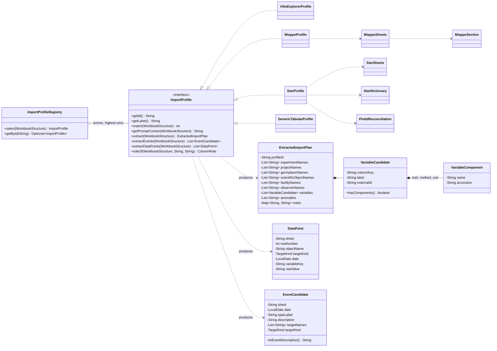
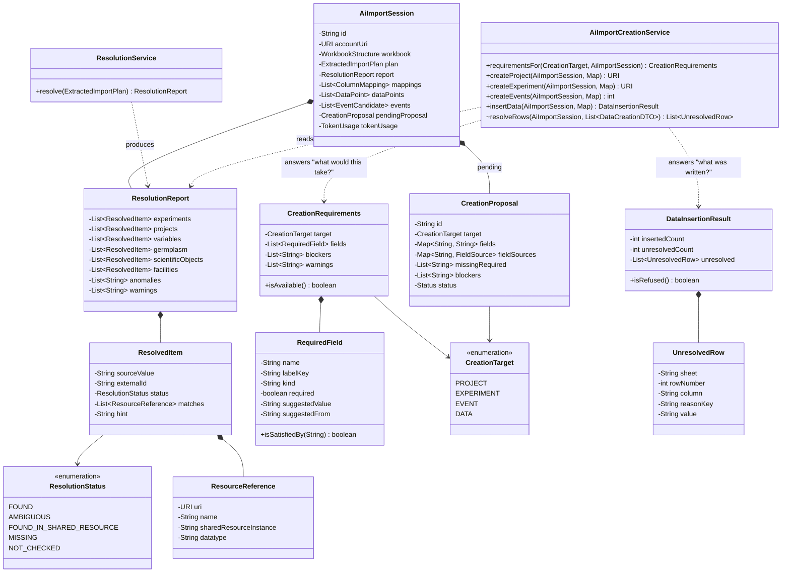
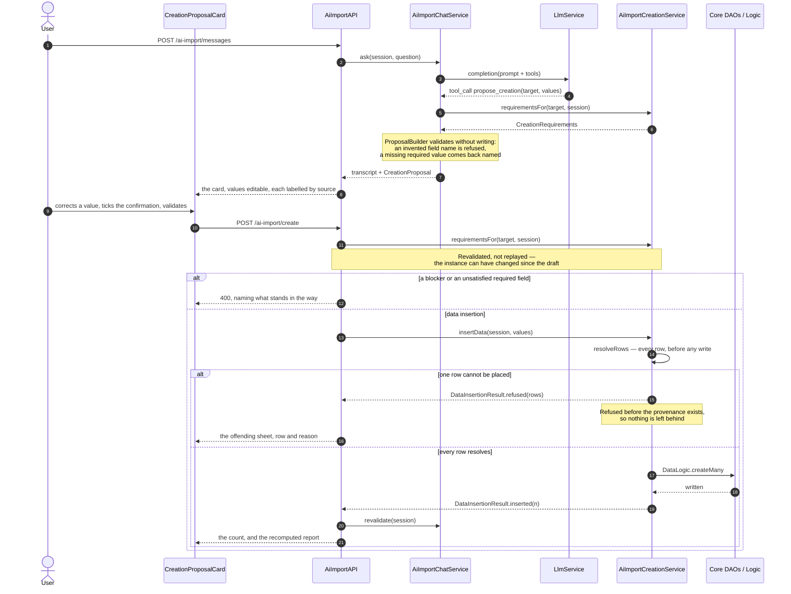

# Technical documentation : [`data import`] LLM-assisted import assistant (`opensilex-ai-import`)

**Document history (please add a line when you edit the document)**

| Date       | Editor(s)       | OpenSILEX version | Comment           |
|------------|-----------------|-------------------|-------------------|
| 2026-09-08 | Arnaud Charleroy | BUILD-SNAPSHOT    | Document creation |

> ⚠️ _WARNING_ : This document is incomplete ! You can help by expanding it. ⚠️
>
> Currently covered topics :
>
> - module wiring, configuration, and the request flow
> - workbook reading, import profiles, resolution, column mapping and type checking
> - the language model connector and its tool-calling loop
> - creation of projects, experiments and observation data
> - the front-end bundle and the constraints the `vue3` branch imposes on it
> - the measured token cost of a conversation, and how to bring it down
>
> Missing topics :
>
> - streaming replies (no server-sent events exist in the repository yet)
> - persisting a conversation beyond the in-memory cache
> - exporting the validation report

## Table of contents

<!-- TOC -->
* [Technical documentation : [`data import`] LLM-assisted import assistant (`opensilex-ai-import`)](#technical-documentation--data-import-llm-assisted-import-assistant-opensilex-ai-import)
  * [Table of contents](#table-of-contents)
  * [Definitions](#definitions)
  * [Functional requirements](#functional-requirements)
  * [Non-functional requirements](#non-functional-requirements)
  * [Solution](#solution)
    * [The central guard-rail](#the-central-guard-rail)
    * [Request flow](#request-flow)
  * [Technical specifications](#technical-specifications)
    * [Module wiring](#module-wiring)
    * [Configuration](#configuration)
    * [Package layout](#package-layout)
    * [UML](#uml)
      * [Reading a file: the profile SPI](#reading-a-file-the-profile-spi)
      * [Confronting the instance, and creating](#confronting-the-instance-and-creating)
      * [Proposing, then writing](#proposing-then-writing)
    * [`workbook` — reading the file](#workbook--reading-the-file)
    * [`profile` — knowing the file family](#profile--knowing-the-file-family)
      * [The STAR profile](#the-star-profile)
      * [Events](#events)
      * [The MIAPPE profile](#the-miappe-profile)
    * [`resolve` — confronting the instance](#resolve--confronting-the-instance)
    * [`mapping` — business entities and expected types](#mapping--business-entities-and-expected-types)
    * [`service` — the language model and the tool loop](#service--the-language-model-and-the-tool-loop)
    * [`create` — proposing, then writing](#create--proposing-then-writing)
      * [Insertion is all or nothing](#insertion-is-all-or-nothing)
    * [`api` — the REST surface](#api--the-rest-surface)
    * [Front end](#front-end)
    * [Tests](#tests)
    * [Environment](#environment)
  * [Token cost](#token-cost)
  * [Remaining cost work](#remaining-cost-work)
  * [Limitations and improvements](#limitations-and-improvements)
  * [Documentation](#documentation)
<!-- TOC -->

## Definitions

- **Data entry file** : a spreadsheet filled in the field by an observer, following a template that
  is documented inside the file itself rather than in a schema.
- **Import profile** : the knowledge about one family of data entry files — what its columns mean,
  which sheets are fixed, and which conventions its author prescribed.
- **Column role** : what a column stands for in OpenSILEX terms (an observed object, a date, a
  variable, an observer, …). See `mapping/ColumnRole.java`.
- **Resolution** : looking every name found in the file up in this instance, and reporting whether
  it exists, is ambiguous, lives on a shared resource instance, or is missing.
- **Column mapping** : a column, its role, the resource it matched, the kind of value its cells
  actually hold, and the disagreements between the last two.
- **Session** (or *conversation*) : one uploaded file and the exchange about it, held in memory.
- **Blocker** : a reason a creation cannot be attempted at all, as opposed to a form field the user
  can simply fill.

## Functional requirements

A scientist has a spreadsheet and no clear path into OpenSILEX. The module gives them one:

1. upload the file and be told, in plain language, what it appears to contain;
2. be told what this instance already has and what it does not — variables, projects, experiments,
   germplasm, scientific objects;
3. see how each column was mapped onto a business entity, and where its values disagree with the
   data type the matching variable expects;
4. be asked about what is genuinely missing or contradictory, rather than being handed a stack
   trace;
5. create the project, the experiment, or insert the observations, each refused while a required
   field is empty.

## Non-functional requirements

- **Reproducibility.** The mapping and the resolution are computed in Java. The same file analysed
  twice yields the same report. A mapping that changed between two runs could not be reviewed.
- **Data minimisation.** Only column headers, a bounded sample of rows (5 per sheet by default) and
  the text of instruction sheets are sent to the language model. The file itself never leaves.
- **Sovereignty.** A single OpenAI-compatible connector, so an instance can point `baseUrl` at a
  gateway inside its own network (vLLM, Ollama, LiteLLM) and keep everything in-house.
- **Least privilege.** Every lookup the assistant performs runs as the account that opened the
  conversation, through the existing DAOs. A conversation is invisible to any other account.
- **Traceability.** Every lookup is listed on the reply that used it. No value is ever silently
  converted.

## Solution

### The central guard-rail

> The language model never produces an identifier, and never decides a mapping.

Everything factual the assistant is allowed to state comes from one of two places: the report that
`ResolutionService` computed, or the result of a tool call that ran a real query. The assistant
explains, questions, and proposes; Java resolves, validates and writes. This is what makes the
feature auditable, and it is the constraint every design decision below follows from.

Three consequences worth stating explicitly:

- creation is driven by a form whose required fields the server declares, not by the assistant;
- a type mismatch is reported cell by cell, with a suggestion, and the correction stays the user's;
- a profile that cannot map a file with confidence refuses to, rather than guessing.

### Request flow

```
POST /ai-import/sessions  (multipart)
      │
      ├─ WorkbookReader ──────────────► WorkbookStructure   (POI, bounded)
      ├─ ImportProfileRegistry.select ► ImportProfile        (best match wins)
      ├─ profile.extract ─────────────► ExtractedImportPlan  (names + anomalies)
      ├─ profile.extractDataPoints ───► List<DataPoint>      (observations, in the file's words)
      ├─ ResolutionService.resolve ───► ResolutionReport     (DAO queries, + shared resources)
      ├─ MappingService.map ──────────► List<ColumnMapping>  (roles + type checks)
      ├─ PromptBuilder.build ─────────► system prompt
      └─ LlmService.complete ─────────► opening analysis
                                        │
                              tool_calls│ (bounded loop)
                                        ▼
                              read-only tools over the existing DAOs
```

Later calls reuse the session: `POST /ai-import/messages` runs the same tool loop,
`POST /ai-import/sessions/{id}/revalidate` recomputes the report and the prompt without losing the
conversation, and `POST /ai-import/create` writes and then revalidates.

## Technical specifications

### Module wiring

`AiImportModule extends OpenSilexModule implements APIExtension`.

- `getConfigId()` → `ai-import`, which is the top-level key read from `opensilex.yml`.
- `getConfigClass()` → `AiImportConfig`.
- No `META-INF/services` file is written by hand: `eu.somatik.serviceloader-maven-plugin`, configured
  in `opensilex-parent/pom.xml`, generates `META-INF/services/org.opensilex.OpenSilexModule`.
- REST classes are discovered automatically — `APIExtension.apiPackages()` scans for `@Path`.
- `LlmService` and `AiImportSessionCache` are `@SelfBound @Service`, so `RestApplication` binds them
  into HK2 and they can be `@Inject`-ed into the API.

**One dependency is added**: `org.apache.poi:poi-ooxml`. Nothing in OpenSILEX read spreadsheets
before this module; CSV goes through univocity. HTTP (Jersey), JSON (Jackson) and the cache
(Caffeine) were already available.

### Configuration

`AiImportConfig` and `config/LlmConfig` are **interfaces** annotated with `@ConfigDescription`, which
the framework proxies from YAML. They follow `core.agroportal` exactly.

```yaml
ai-import:
    enabled: true
    llm:
        baseUrl: "http://localhost:11434/v1"   # any OpenAI-compatible /chat/completions
        model: "qwen2.5:14b"
        apiKey: ""                             # omitted as a header when empty
        maxTokens: 2048
        temperature: 0.2
        timeoutMs: 120000
        maxToolIterations: 6
    maxFileSizeMb: 20
    sampleRowsPerSheet: 5
    sessionTtlMinutes: 60
    searchSharedResourceInstances: true
```

`LlmService.isEnable()` guards on `baseUrl` and `model` being non-empty, so an unconfigured instance
reports the module as unavailable instead of failing at the first request.

### Package layout

88 classes, ~13700 lines under `org.opensilex.aiimport`:

| Package        | Responsibility                                                      |
|----------------|---------------------------------------------------------------------|
| `workbook`     | reads the file into a bounded in-memory model                       |
| `profile`      | knowledge about one family of files; extracts names and observations |
| `resolve`      | confronts those names with this instance and with shared resources  |
| `mapping`      | column → business entity, and expected type versus observed type    |
| `service`      | the language model connector, the tool loop, the session, the prompt |
| `create`       | what a creation requires, and the creation itself                    |
| `api`          | the REST surface and its DTOs                                       |
| `exception`    | `WorkbookReadException`                                             |

### UML

Three views rather than one diagram, because the module has three separable concerns: reading a
family of files, confronting what it read with the instance, and turning the difference into
something created.

#### Reading a file: the profile SPI

A profile is the only place that knows a file *family*. Everything downstream works on what a
profile produced, never on the spreadsheet, which is why adding a fourth template touches one
package.



`VariableComponent` is what makes a variable *creatable* rather than merely *missing*: only MIAPPE
fills it today, and only a variable that knows its trait, method and scale can be proposed for
creation without inventing them.

#### Confronting the instance, and creating

The resolution never writes and the creation never guesses. `ResolvedItem.status` is the whole
vocabulary of the report, and every URI a creation uses comes from one of those items.



#### Proposing, then writing

The guard-rail as a sequence. Two things are worth following: the model never holds a URI, and the
second validation — not the first — is the one that decides.



### `workbook` — reading the file

`WorkbookReader` (243 lines) opens the file with POI and produces a `WorkbookStructure`. Cells are
kept **as text**, deliberately: the point is to show what was actually typed before any
interpretation. Two decisions carry weight:

- **Header detection.** The header row is the first row whose non-empty cells all look like labels:
  at least two of them, none numeric, none longer than 80 characters. That last bound matters — the
  `ReadMe` of the reference template has a row made of a long sentence plus a date-formatted cell,
  which without it reads as a header row and the author's instructions are lost. A sheet with no
  header row is kept as prose in `SheetStructure.text`.
- **Date system.** `WorkbookStructure.date1904` records whether the workbook uses the 1904 system.
  The same serial reads four years apart in the two systems, so a file saved in one and read in the
  other files data under the wrong season. POI resolves date-formatted cells itself; the flag covers
  the cells it cannot — a bare number in a date column — and lets a profile tell the user their
  workbook is not in the system their template prescribes.

`ExcelValueParser` normalises what field templates actually contain: `NA` and its variants as
missing, a comma as decimal separator, non-breaking and zero-width spaces stripped, and serial
numbers converted with the workbook's own epoch.

`HeaderMatcher` locates a column by the words its header contains, accent- and separator-insensitive.
Templates version their header names — `Nouvelle_Abréviation_FR_maj_03_2023` — and matching on words
survives a revision where matching on an exact name does not.

### `profile` — knowing the file family

```java
public interface ImportProfile {
    String getId();
    String getLabel();
    int match(WorkbookStructure structure);              // 0 = not mine; highest wins
    String getPromptContext(WorkbookStructure structure);
    ExtractedImportPlan extract(WorkbookStructure structure);
    default List<EventCandidate> extractEvents(WorkbookStructure structure); // empty = none
    default List<DataPoint> extractDataPoints(WorkbookStructure structure);  // empty = refuse
    default ColumnRole roleOf(WorkbookStructure s, String sheet, String header);
}
```

`ImportProfileRegistry` ships `VitisExplorerProfile`, `StarProfile`, `MiappeProfile` and
`GenericTabularProfile`, and picks up any
profile contributed by another module through `ServiceLoader`. The generic profile scores 1, so it
only wins when nothing recognises the file.

`VitisExplorerProfile` (614 lines) knows the grapevine observation template: three fixed sheets
(`ReadMe`, `Chronologie` catalogue, `Cartouche_Fixe`) then one sheet per phenological stage. It maps
`Dispositif` → experiment, `PU` → scientific object, `Genotype` → germplasm, `Statut` → factor level,
`Observateur` → provenance, and keys variable columns to the catalogue by abbreviation, carrying the
CropOntology identifier along.

Two subtleties encoded there:

- a stage sheet dated by its own column, such as `Deb_Date`, uses that column **both** as the row's
  date and as the observation — the date of budburst *is* the measurement;
- `Obs_libre` appears in the catalogue but is a free comment, not a measurement.

`extractDataPoints` returning an empty list is a **refusal, not a gap**. Guessing which column
identifies the observed object would attach measurements to the wrong plots, which is worse than
offering no insertion at all. Data creation is therefore unavailable under the generic profile.

#### The STAR profile

`profile/star/` handles the STAR agronomic trial model, a normalised template with one entity per
sheet. It is a better fit for OpenSILEX than an observation template, because it carries its own
metadata — the experiment, its objective and dates, the treatments, the plots, the field — and its
own schema.

Three pieces:

- **`StarSheets`** finds sheets **by prefix**, not by name: `ed_` for the experimental design,
  `data_` for observations, `dictionary` for the schema. The prefix is stable where names are not —
  the reference template calls a sheet `ed_placette` where an earlier revision called it
  `placette` — and it absorbs a future `data_` sheet without a code change.
- **`StarDictionary`** reads the sheets that describe every column. It reads **by content, not by
  position**: the header declares eight columns but a row carries only the ones it has, so a row is
  four to seven cells wide and the same index means a different field from one line to the next.
  Classifying each cell by what it looks like — a boolean, a known R class, something with a colon —
  is what makes it safe. This is a property of the format, not a defect of any one file (the
  reference template behaves identically), so it is handled quietly rather than reported.
- **`PlotIdReconciliation`** resolves the identifier mismatch described below.

The mapping onto OpenSILEX is settled by the published STAR to ELOA alignment rather than guessed:
`expe` is the experiment, `ed_parcelle` a **facility** (address from the commune, location from the
coordinates), `ed_placette` the **scientific objects**, `cultivar_name` the germplasm, `modalite` a
factor and its levels. The ELOA classes are not loaded in this instance, so each resource takes an
existing OESO type and keeps its ELOA IRI as an external reference — the same treatment already
given to the CropOntology identifiers of variables.

**Two real defects the profile surfaces**, both present in the reference template and therefore in
every workbook derived from it:

1. **The plot sheet and the data sheets disagree on how a plot is named.** The plot sheet composes
   block then treatment (`A1`, `A10`); the data sheets compose treatment then block (`1A`, `10A`).
   Nothing matches, so no observation can be attached. Recomposing the plot sheet's treatment and
   block resolves all 44 — 40 by recomposition, 4 controls that already matched. The profile
   reconciles deterministically and **states what it applied**, as an anomaly and as a plan note.
   The observations are extracted, recomposed; the decision to accept the recomposition is asked at
   the confirmation before writing, as a checkbox carrying that sentence. Returning nothing from
   `extractDataPoints` was the earlier design and it hid the disagreement instead of raising it —
   the page showed no observation and no reason — where every other decision of this kind already
   lives in the conversation.
2. **`rain_mm` is filed under metadata rather than variables** in the reference template, beside
   `plot_id` and `commune_name`, though it is a measured quantity and a column of `data_meteo`. An
   import driven by that template would quietly drop rainfall. The check is general — any column of
   a `data_` sheet the dictionary does not declare a variable is raised.

**Sheet names across the two revisions.** `dataSheets()` also accepts the earlier revision's
unprefixed `meteo`, named explicitly rather than inferred — deciding by content which sheet holds
observations would sweep in `suivi_data` and `listes`. Without it a workbook of that revision lost
its **847 weather observations** in silence: the sheet was read, then never looked at. That sheet
also names no object column at all, so when the workbook declares exactly **one** field the
observations are attached to it — weather is the field's — and only then; more than one field and
there is nothing that can stand in.

**What a `data_` sheet is.** The contract is *an object identifier, a date, then one or more
variables* — in that sense, not in that order, and the column names vary. The identifier names
either a **scientific object** (a plot) or a **facility** (the field): weather is measured at the
field, not on a micro plot, which is why `DataPoint.targetKind` exists and why resolving every
target as a scientific object silently dropped the weather. `data_template` is an empty sheet whose
only purpose is to show that shape, and it is skipped as a source of observations.

#### Events

Two STAR sheets record what happened during the trial, and both were being read and then ignored:

- **`evenement`** — a date, a free-text type, a description. No column says what the event
  concerned, and the sheet sits at trial level, so it concerns the **field**. Naming the field
  rather than every plot keeps one event where the file records one.
- **`ppp`** — plant protection product applications, named per treatment. A treatment covers several
  plots and a spraying is one pass of the sprayer over all of them, so one row becomes **one event
  concerning every plot of that treatment**.

The shipped event vocabulary (`oeev`) describes device maintenance and moves; it has no class for a
spraying or a hailstorm. An event therefore takes the generic `oeev:Event` type and keeps the file's
own wording — product, AMM number, dose, volume, sprayer — in its description, where nothing is
lost. Forcing an agronomic event into `Incident` or `ScientificObjectManagement` would state
something the file never said.

`EventCandidate` carries the targets **as names**, resolved against the report at creation time like
every other target, so an event is never filed against a URI the assistant invented.

#### The MIAPPE profile

`profile/miappe/` handles MIAPPE v1.1, the minimum information checklist for a plant phenotyping
experiment. It differs from the other two in kind: it is a **metadata checklist, not a data entry
file**. The observations live in a separate file that the `Data file` section links to, so
`extractDataPoints` always returns nothing — not a refusal this time, simply the truth about the
format. What the workbook carries is everything *around* the measurements, which is the part an
import usually has to invent.

Three conventions of the checklist do the work:

- **A trailing asterisk marks a mandatory field.** The standard states what a valid submission must
  carry, so the report can name what is missing without a rule being written for each field —
  `MiappeSection.unfilledMandatoryFields()` reads the asterisks.
- **The three rows under each header are documentation** — definition, example, format — followed by
  a `Values (add rows if necessary)` banner. Reading them as values would import the standard's own
  examples: a plot called `plot:894`, a person called `Ines Chaves`. `MiappeSection` steps over
  them by the label in the first column.
- **`Investigation` is written transposed**, one field per row with its value in the second column,
  because it describes a single thing.

The mapping: `Investigation` → project, `Study` → experiment (its `Experimental site name` → a
facility), `Observation Unit` → scientific objects, `Biological Material` → germplasm, `Event` →
events, `Observed Variable` → variables.

**`Observed Variable` is why MIAPPE matters here.** It defines each variable as a *trait*, a
*method* and a *scale*, each with an optional ontology accession — the components an OpenSILEX
variable is made of, which neither STAR nor VitisExplorer supplies. `VariableCandidate` carries them
as `VariableComponent` values, which is what lets a missing variable be **proposed for creation**
rather than only reported as absent. One gap remains and is deliberate: OpenSILEX splits the trait
into an entity and a characteristic — MIAPPE's "plant height" becomes the entity "plant" and the
characteristic "height" — and that split is a judgement about the user's science, so it goes through
a form they can correct rather than being applied by a reader.

**What happens to those components.** When a variable resolves nowhere, `resolveComponents` looks
each one up in this instance by name, through the same `BaseVariableDAO` the variables screen uses,
and records the result on the report as a `ResolvedComponent` — role, name, accession, and the URI
when it is here. Three things follow. The report shows the four parts as tags, green for the ones
that already exist, so the user can see at a glance whether creating this variable is two clicks or
a form to fill. The Create button opens `opensilex-VariableForm` with the found components already
selected. And what was not found goes into the description, where the user can read the file's own
words while choosing or creating it — otherwise that information is lost between the spreadsheet and
the form.

Reusing beats creating, and this is where it is enforced: a component entered a second time under a
second spelling stays in the instance's referential for good.

The training spreadsheet ships **empty**, every section documented and no values. That is the state
a submission starts in, so it is the state the profile handles best: it reports "9 of the 11
sections are still blank templates" rather than reporting nothing found and leaving the user to
wonder what went wrong.

#### When the model is unreachable

The assistant is a conversation, not a dependency. Reading the file, choosing a profile, extracting
the plan, confronting the instance and mapping the columns are all plain Java: a user whose model
endpoint is down still uploads a workbook and still gets the report, the mapping and the creation
forms. `LlmService` funnels every failure — unreachable, misconfigured, disabled, timed out — into
one exception, which the chat service turns into a notice in the transcript rather than an error
page, carrying a translation key because the module wrote it and not the model.

`HeaderRoleDictionary` is what makes that promise worth something for an **unrecognised** file. The
default `roleOf` used to answer only DATE, COMMENT or VARIABLE, leaving the business mapping to the
conversation; the dictionary answers OBJECT, TRIAL, PROJECT, GERMPLASM, LOCATION, PERSON, OBSERVER,
SEASON and FACTOR_LEVEL from the header alone, in French and English, as a table lookup.

Two rules keep it from guessing. A term matches the whole normalised header before it matches an
edge of it, so `plot_id` is an object where `surface_bloc_m2` is a measurement. And a word that
means two things in two templates is **absent** from the table — STAR calls a field a *parcelle* and
treats it as a facility, other templates use it for the observed plot — because a column left
`UNKNOWN` asks a question, where a column mapped wrongly answers one nobody asked.

### `resolve` — confronting the instance

`ResolutionService` (464 lines) turns names into a `ResolutionReport`. Per category:

| Category           | How                                                                            |
|--------------------|--------------------------------------------------------------------------------|
| Experiment         | `ExperimentDAO.getExperimentByNameOrURI`                                       |
| Project            | `ProjectDAO.search`, then strict equality on name or short name                |
| Variable           | pass 1: `skos:exactMatch` ending with the ontology id from the file; pass 2: `VariableDAO.search` then strict equality on name or alternative name; pass 3: the shared resource instances |
| Germplasm          | `GermplasmSearchFilter` on name, then strict equality                          |
| Scientific object  | `ScientificObjectDAO.getByNameAndContext`, sampled at 25                       |

Each entry carries a `ResolutionStatus`: `FOUND`, `AMBIGUOUS`, `FOUND_IN_SHARED_RESOURCE`, `MISSING`
or `NOT_CHECKED`. The strict-equality filter matters: every DAO name filter is a regular expression,
so a near miss would otherwise point the user at a variable that merely looks similar.

The ontology-identifier pass is the most reliable key the file offers. The file carries a compact
`CO_356:1000217` while the instance stores a full URI whose prefix is a local choice, so the query
matches on the **end** of the URI (`STRENDS`) rather than hard-coding anyone's prefix.

`SharedResourceVariableLookup` queries the instances declared in `core.sharedResourceInstances`,
lazily and per instance. An unreachable instance is recorded once as a warning on the report and then
left alone: one unavailable service must not sink the whole analysis. **Nothing is copied** — the
report points at where the variable lives, and importing it stays a deliberate act in the variables
screen.

Facilities are resolved through **`FacilityLogic.search(filter)`**, not through a direct
`sparql.search`. The direct query bypassed the access control that logic applies, so a user could be
told about a facility they are not entitled to see. Going through the logic layer is also what the
rest of the codebase does.

### `mapping` — business entities and expected types

**A property is not a measurement, and neither is a place.** `OBJECT_PROPERTY` describes the
observed object — the first row of a unit plot, its last vine, the spacing it was planted at — where
`LOCATION` says where something sits and `VARIABLE` says what was measured on it. The difference
decides where the value goes: a property is written **once**, on the scientific object, as a
relation of the ontology; a measurement is written **per observation**, with a date and a
provenance. Filing one as the other produces either a variable nobody ever observes, or an object
attribute buried in a time series.

**A coordinate is a dated event, not an attribute.** `POSITION` covers `plot_x` and `plot_y`,
because OpenSILEX records where an object is as a **move**: a pot moves and a plot does not, and the
model does not decide that in advance. Its own scientific object CSV import carries exactly these
columns — `x`, `y`, `z`, `textualPosition`, with a start and an end date — and turns them into a
`MoveModel`. Writing them as properties would put a coordinate on the object with no date and no
history.

**A block is not a treatment.** `PARENT_OBJECT` covers `block_code`: a block groups plots, where a
treatment is a level of a factor. Two plots in the same block carry different treatments — that is
what blocking is for — so calling the block a factor level made the design unreadable.
`xp_trt_code` stays `FACTOR_LEVEL`, which is what it is: a level of a factor declared on the
experiment.

So, per column: VitisExplorer's `Premier_Rang`, `Dernier_Rang`, `Premiere_Souche`,
`Derniere_Souche` are properties; STAR's `row_spacing`, `plant_spacing` and `plot_n` are too;
`plot_x`/`plot_y` are positions; `block_code` is a parent object; `field_latitude`,
`field_longitude`, `commune_name` and `commune_insee_id` locate the facility.

#### Two things the file cannot settle

Both are raised as anomalies rather than defaulted, because both are expensive to undo — creating
several hundred objects under a type nobody chose is not repaired by editing one of them.

- **What a plot *is*.** STAR counts plants per plot (`plot_n`) and never states the scientific
  object type. That type decides what can be observed on the object and how it is created.
- **What a block *is*.** OpenSILEX supports both readings: a scientific object of its own with the
  plots as its parts, or a property carried by each plot. The first is right when something is
  observed on the block itself, and only the user knows whether anything is.

`MappingService` (420 lines) produces one `ColumnMapping` per column:

- `role` from `profile.roleOf(...)`, and `ColumnRole.getEntity()` names the OpenSILEX concept it
  feeds;
- the matched variable and its `expectedDatatype`, carried up from `ResourceReference`;
- `observedKind` read from the cells: `INTEGER`, `DECIMAL`, `DATE`, `BOOLEAN`, `TEXT`, `MIXED`,
  `EMPTY`;
- a column-level `suggestion` when the two disagree, and up to 10 `TypeIssue` entries naming the
  offending cells with the row number **as it appears in the spreadsheet**.

Only `VARIABLE` columns are type-checked; checking an observer column would produce noise the user
cannot act on. A column with no matching variable gets the datatype to create it with, deduced from
its values — which is the information the user actually needs at that moment.

The six datatypes are the ones `VariableAPI.getDatatypes()` offers: `xsd:boolean`, `xsd:date`,
`xsd:dateTime`, `xsd:decimal`, `xsd:integer`, `xsd:string`.

### `service` — the language model and the tool loop

`LlmService` (173 lines) posts to `{baseUrl}/chat/completions`. It follows
`opensilex-core`'s `AgroportalService` closely: `@SelfBound @Service`, config injected, a JAX-RS
client with an explicit timeout, the shared Jackson mapper, an `isEnable()` guard and
`DisplayableServiceUnavailableException` with an i18n key. `Authorization: Bearer` is omitted
entirely when `apiKey` is empty, so a local endpoint is not handed an empty token. Streaming is not
used; progress is reported from the tool round trips, which is what actually takes time.

`AiImportChatService` runs the loop: while the reply carries `tool_calls`, execute them in Java,
append `role: tool` messages, call again — at most `maxToolIterations` times, after which the user is
told rather than the request running to the timeout. A tool failure is reported *to the model*, not
raised, so it can say so or try something else.

Six tools, all **read-only**, all running as the current account:

| Tool                                    | Backed by                                             |
|-----------------------------------------|-------------------------------------------------------|
| `search_variables`                      | `VariableDAO.search`                                  |
| `search_variables_in_shared_resource`   | `SharedResourceInstanceService.search`                |
| `search_experiments`                    | `ExperimentDAO.search`                                |
| `search_projects`                       | `ProjectDAO.search`                                   |
| `search_germplasm`                      | `GermplasmDAO.search`                                 |
| `get_sheet_preview`                     | the session's workbook, not the databases             |

`PromptBuilder` (306 lines) assembles the system prompt: the rules, the profile's domain knowledge,
the bounded file view, the resolution report, and the mapping restricted to columns worth discussing.
The rules forbid inventing a URI, forbid claiming something exists without having seen it, and forbid
silently correcting a value — a measurement converted behind the user's back is a measurement nobody
can trace.

`AiImportSession` holds the workbook, plan, report, mappings, data points, the wire history and the
visible transcript. `AiImportSessionCache` keeps sessions in a **static** Caffeine cache: self-bound
services are request-scoped, so a per-instance cache would be discarded between two calls of the same
conversation. Lookups require the owning account, so a conversation opened by someone else is
indistinguishable from one that never existed.

### `create` — proposing, then writing

`AiImportCreationService` (441 lines) answers two questions with the same computation — *what would
this take?* and *is this allowed?* — which is why the rules live here rather than in the API.

`CreationRequirements` separates two things deliberately:

- a **`RequiredField`** is something a human can type, optionally pre-filled with a suggestion read
  from the file and labelled with where it came from. A field of kind `boolean` is a *decision*
  rather than a value — rendered as a checkbox, and satisfied only when ticked, since `false` is
  exactly what an unticked box submits. `RequiredField.isSatisfiedBy` owns that rule so the API,
  the proposal builder and the card cannot disagree about it;
- a **blocker** is something they cannot, because it depends on a resource that does not exist yet.
  Only a blocker makes the action unavailable outright.

| Target       | Required fields                                 | Blockers                                                                                       |
|--------------|-------------------------------------------------|------------------------------------------------------------------------------------------------|
| `PROJECT`    | `name`, `start_date`                            | none                                                                                           |
| `EXPERIMENT` | `name`, `objective`, `start_date`               | none                                                                                           |
| `VARIABLE`   | `variable_summary` (informational)              | not analysed; no variable of the file found on a shared resource instance                      |
| `DATA` (STAR)| `reconciliation_confirmed` — a checkbox carrying the sentence the profile wrote | as `DATA`                                                    |
| `EVENT`      | `event_summary` (informational)                 | no event read; not analysed; none of the targets exists yet                                    |
| `DATA`       | `experiment`, `provenance_name`                 | no readable observation; not analysed; experiment missing; a variable missing, ambiguous or only on a shared resource instance; a scientific object missing or unchecked; a facility missing, when the file measures at one |

Those three are the fields the model genuinely demands: `required = true` on the SPARQL mapping
raises at insert time, independently of the DTO annotations. `objective` is the one no field
observation file can answer — which is why a STAR workbook, which states it, changes what is
possible.

**The flow is conversational, not a form.** A panel of three forms used to sit beside the
conversation; it was replaced because a form cannot explain *why* it proposes a given start date,
and a sentence can.

1. the assistant describes what the resource would contain, in prose;
2. it calls `propose_creation`, which validates without writing and stores one
   `CreationProposal` on the session;
3. a card renders under that message with the values, each editable, and a confirm button;
4. `POST /ai-import/create` names the draft, revalidates it, and writes.

`ProposalBuilder` is what keeps step 2 honest: a field name the assistant invented is refused, a
malformed date is refused, and a required field left empty comes back **named** so the assistant can
ask for it in the same turn instead of proposing something incomplete. A value the assistant omitted
falls back to the file's own suggestion, and `fieldSources` records for each value whether it came
from the file, the assistant, or the user — a date read from a spreadsheet and a date written by a
language model do not deserve the same trust, and the card says which is which.

Confirmation revalidates rather than replays: the instance can change between the draft and the
click, and the second check is the one that decides. A proposal's `status` is what prevents
confirming twice.

#### Reading the session once

`SessionFacts` holds everything a conversation already knows: the URI of a resolved plot, the
earliest observed date, the variables available on a shared instance. Two very different callers
kept asking the same questions — the code that answers *what would this creation take?* and the code
that performs it — and a requirement that says a creation is possible while the write disagrees is
the worst bug this module can have.

Nothing in it touches a database; every answer comes from the report, computed once. That is what
lets the requirements be tested with no instance at all, which the tests had been claiming
informally.

#### Importing a variable rather than inventing one

A variable needs an entity, a characteristic, a method and a unit — all four `required = true` on
the SPARQL mapping — so creating one from nothing means creating up to five resources and adding
four permanent entries to this instance's referential. When the report says
`FOUND_IN_SHARED_RESOURCE`, there is a cheaper and safer path: copy the variable and its components
from the instance that already defines them, in one transaction.

That copy already existed, but only inside `VariableAPI.copyFromSharedResourceInstance` — reachable
over HTTP and nowhere else. It moved to **`org.opensilex.core.variable.bll.VariableCopyLogic`**,
the `bll` layer this codebase already uses for `DataLogic`, `EventLogic` and `FacilityLogic`; the
API method is now a delegation, and this module calls the same code. Reimplementing a five-resource
transaction would have been a second way to leave it half done.

`importVariables` groups the report's matches by the instance they came from — one copy call per
instance — and reports how many components arrived with the variables, which is usually the
surprise: two variables can bring four entities and three units.

#### Creating a variable: the platform's own form, not a second one

When a variable exists nowhere — not here, not on a shared instance — it has to be created with its
four components, and the temptation is to add a fifth creation target with five selectors of its
own. The module does **not** do that. The report's Create button beside a missing variable opens
`opensilex-VariableForm`, the very form the variables screen uses, prefilled with the name and the
ontology identifier the file supplies (carried as an `exact_match`, which is what it is).

That form already brings what this step needs and what would otherwise have to be rebuilt: an
entity, characteristic, method and unit selector that search what the instance has, each with the
inline modal that creates a new one, plus the datatype selector, the URI generator and the
Agroportal lookup. Rebuilding it would mean a second form to keep in step with the platform's rules
about a resource whose accidental creation is permanent.

So there is no Java code here for creating a variable — the useful work is elsewhere: saying which
variables are missing, what the file does supply about each, and revalidating afterwards so the
report picks up what was created. `MiappeProfile` is what makes that saying worthwhile, since it
alone reads a trait, a method and a scale out of the file.

#### Insertion is all or nothing

`insertData` resolves **every** row before writing **any**, in `resolveRows`, and returns a
`DataInsertionResult` — either a count, or a refusal naming the sheet, the row and what could not be
placed. The refusal happens before the provenance is created, so a refused insertion leaves nothing
behind at all.

This closed three paths that lost rows in silence, each of which reported success for a partial
import — the worst possible outcome, because the user believes they imported:

1. **facility targets were resolved against the scientific objects.** A `data_` sheet can name a
   field rather than a plot — weather is measured at the field — and those rows matched nothing. The
   2242 rows of `data_meteo` would have been dropped. `DataPoint.targetKind` now decides which map
   to look in.
2. **the resolution sampled 25 scientific objects.** Beyond the sample, a plot never entered the
   report, so it was never `MISSING`, and its observations were dropped without a word.
   `ScientificObjectDAO.checkUniqueNameByGraph` resolves every name in **one** SPARQL `VALUES`
   query — the same call the CSV importer uses — so the sample is gone and 44 plots (or 500) cost
   one query instead of 44.
   *Contrepartie:* that helper keeps the first URI when a name repeats, where `getByNameAndContext`
   raises `DuplicateNameException`. Ambiguity detection on scientific objects is therefore traded
   for completeness; a duplicate name within an experiment graph is an abnormal state of the
   instance, the CSV importer makes the same trade, and a shortfall between distinct names and
   returned URIs is reported as a warning.
3. **an unresolved target was logged and skipped**, and the method returned the number written, so
   the user read "N values inserted" with no indication that M had vanished. The comment defending
   that path — *"reaching this point means the instance changed under our feet"* — had stopped being
   true: with sampling and facilities it was reached in normal operation.

Since the report now covers every object, `insertData` reads the resolved URIs **from the report**
rather than querying again: one source for what exists, and one fewer round trip.

Insertion then builds `DataCreationDTO` objects and calls `newModel()` on each, reusing the core
DTO's date parsing rather than reimplementing it, then `DataLogic.createMany`. After any creation
the report is recomputed and returned, so the interface reflects the new state without a second
call.

Event creation follows the same rule for the same reason, through `EventLogic.create`.

### `api` — the REST surface

`AiImportAPI` (579 lines), `@Path("/ai-import")`, every endpoint `@ApiProtected`.

| Verb   | Path                                                | Purpose                                                        |
|--------|-----------------------------------------------------|----------------------------------------------------------------|
| `GET`  | `/profiles`                                         | the file families recognised                                   |
| `POST` | `/sessions`                                         | multipart upload; opens a conversation and returns the analysis |
| `GET`  | `/sessions/{id}`                                    | structure, report, mapping and history                         |
| `DELETE` | `/sessions/{id}`                                  | close and forget                                               |
| `POST` | `/messages`                                         | ask a question (`session_id` in the body)                      |
| `GET`  | `/sessions/{id}/report`                             | the validation report                                          |
| `GET`  | `/sessions/{id}/mapping`                            | the column mapping and its type issues                         |
| `POST` | `/sessions/{id}/revalidate`                         | recompute against the instance, keeping the conversation       |
| `GET`  | `/sessions/{id}/creation-requirements?target=`      | fields, suggestions and blockers                               |
| `POST` | `/create`                                           | create a project or experiment, or insert the data             |

> **A generator constraint worth knowing.** The TypeScript client generator cannot express a request
> that has both a body and a path parameter — it emits `method(body?: X, sessionId: string)`, which is
> invalid TypeScript. No endpoint in OpenSILEX combines the two; every update carries its identifiers
> inside the body. `POST /messages` and `POST /create` follow that, which is why `session_id` travels
> in the body while the read-only endpoints keep it in the path.

An oversized or wrongly-typed upload is refused before the file is opened, so a mistake gives a clear
answer rather than a parser error.

### Front end

The creation card renders **the form components OpenSILEX already ships** rather than raw inputs:
`opensilex-InputForm`, `opensilex-TextAreaForm`, `opensilex-DateForm`, `opensilex-CheckboxForm`,
and — where a field designates a referential — the very selector the matching screen uses
(`opensilex-ExperimentSelector`, `opensilex-ProjectSelector`, `opensilex-EntitySelector`,
`opensilex-CharacteristicSelector`, `opensilex-MethodSelector`, `opensilex-UnitSelector`). Every
`.vue` under `opensilex-front/front/src/components` is registered globally as
`opensilex-<FileName>`, so a module uses them by tag, with nothing to import.

This is what `RequiredField.resource` is for: the server says *which referential* a field
designates, and the card hands it to the selector that knows how to search it. A URI is chosen from
what exists instead of pasted, the field looks the way it looks everywhere else in the instance, and
the "offer choices, not blank fields" requirement is met by components that already do it. The
selectors differ in their model prop — `experiments`, `projects`, `selected` — so the card carries a
small table of those names rather than assuming one.


`front/` builds a UMD bundle the host loads with a `<script>` tag and then hands to
`app.use(...)`. Four constraints of the `vue3` branch shape it, all verified in the source:

1. **`window.Vue` used to expose four functions only.** A module bundle with `vue` external fails as
   soon as a component reaches for `onMounted` or `watch`. `opensilex-front/front/src/main.ts` now
   exposes the whole namespace, which also keeps a single Vue instance in the page — what
   `inject('$opensilex')` across the module boundary depends on.
2. **`initAsyncComponents` has no caller**, so a plugin's `components` field is never read. The
   plugin registers its own components with `app.component(id, …)` inside `install()`.
3. **`loadTranslations` has no caller** either. Messages are merged in `install()` through
   `$opensilex.$i18n.mergeLocaleMessage`, and templates use `$t(...)` — not `useI18n()`, which would
   need a bundled copy of `vue-i18n` and lose the host's instance.
4. **`exports: 'default'`** in the Rollup output, because the host does
   `app.use(window[moduleId])`: the global has to *be* the plugin, not the module namespace.

naive-ui is used **by tag, never imported**. `main.ts` now registers the components it already
imported but never passed to `create()` — dead imports until then. Verified: naive-ui does not appear
in the module bundle, so there is no second runtime.

Component ids follow `{module}-{Name}`, which
`ModuleComponentDefinition.fromString` splits on the last dash — so a component name must carry none
of its own.

| Component                  | Role                                                            |
|----------------------------|-----------------------------------------------------------------|
| `AiImportView`             | the page; owns the session and coordinates the panels           |
| `AiChatPanel`              | the conversation and the input                                  |
| `AiChatMessage`            | one turn; renders the assistant's markdown with `marked`        |
| `ResolutionReportPanel`    | what exists and what does not, per category                     |
| `MappingPanel`             | column → entity, expected versus observed type, offending cells |
| `CreationProposalCard`     | a drafted creation, editable, confirmed in the conversation     |
| `WorkbookStructurePanel`   | sheets, headers and a sample of rows                            |

> **A styling trap.** `opensilex-front/front/src/styles/common.scss` sets
> `.btn-sm { width: 32px }` globally, for the icon-only action buttons in its tables. Any labelled
> `btn-sm` is clipped. That rule is load-bearing across the application and is left alone; each
> component of this module neutralises it with a scoped `.btn-sm { width: auto }`, whose specificity
> is enough without `!important`.

### Tests

192 tests, no database and no language model required.

| Suite                                | Covers                                                                 |
|--------------------------------------|------------------------------------------------------------------------|
| `ExcelValueParserTest` (12)          | `NA`, decimal comma, invisible characters, both date systems           |
| `HeaderMatcherTest` (4)              | accents, separators, versioned header names                            |
| `WorkbookReaderTest` (10)            | 18 sheets, the `ReadMe` staying prose, the workbook's date system      |
| `VitisExplorerProfileTest` (21)      | roles, catalogue, the three anomalies, observation extraction          |
| `StarProfileTest` (27)               | both revisions, sheet names, facility targets, events, applications, the pinned observation counts |
| `StarDictionaryTest` (12)            | content-driven reading, declared types, variable flags                 |
| `PlotIdReconciliationTest` (5)       | the identifier mismatch and what it recomposes                         |
| `MiappeProfileTest` (9)              | recognition, documentation rows, mandatory fields, the empty template  |
| `FilledMiappeSubmissionTest` (8)     | a filled submission: sections, variable components, events             |
| `MappingServiceTest` (15)            | roles, observed kinds, type mismatches, proposed datatypes             |
| `AiImportCreationServiceTest` (23)   | required fields, every blocker, the all-or-nothing refusal, the confirmation checkbox, importing from a shared instance |
| `ProposalBuilderTest` (9)            | invented fields, malformed dates, missing required values              |
| `LlmServiceTest` (11)                | request shape, bearer header, tool-call parsing, every failure path    |
| `AiImportSessionCacheTest` (6)       | ownership isolation, expiry, prompt replacement                        |
| `PromptBudgetTest` (5)               | the prompt stays within its measured budget                            |
| `TranslationKeyTest` (3)             | every key the report emits exists in both language files               |
| `HeaderRoleDictionaryTest` (11)      | the header-to-entity mapping, its near-misses and its stated limits    |

`StubLlmEndpoint` is a chat completion endpoint built on the JDK's own HTTP server — no test
framework dependency was added. `TestConfig` implements the configuration interfaces directly, which
is all a proxied-from-YAML interface needs.

The workbooks live in `src/test/resources/`: the VitisExplorer file, both STAR revisions, and the
MIAPPE v1.1 training spreadsheet. A *filled* MIAPPE submission is built in the test rather than
shipped — the training spreadsheet ships empty, and what needs testing there is the reading rules,
the file format being already covered by the tests that read the real workbook.

The VitisExplorer workbook carries three real anomalies, and the tests
assert that each is reported: the 1904 date system against a template prescribing 1900, a cartouche
declaring season 2018 while every stage sheet declares 2020, and a `Souche_HE` column the catalogue
calls `Cep_HE`.

### Environment

- **Java 17 or later** (`opensilex-parent` sets `java.compiler.version` to 17). A JDK, not a JRE.
- Build: `mvn -pl opensilex-ai-import -am install`.
- The front bundle is produced by the module's own `vite build`; `node_modules` resolves from the
  repository root, as it does for `opensilex-core`.
- A local Ollama is enough for acceptance testing. Nothing in the module requires a hosted provider.

### Saying it twice: keys for the interface, English for the model

The report's sentences have two audiences with opposite needs. The interface is French for a French
user, so it needs a translation key and its parameters. The same sentences go into the system
prompt, where English is right and a key would be meaningless — the model cannot resolve
`AiImport.report.hint.experimentMissing`, and the prompt already tells it to answer in the user's
language.

`ReportMessage` carries both: a key, its parameters, and the English text. The Java keeps the
English sentence inline rather than deriving it from a key, so the sentence a reviewer reads in the
code is the sentence the model receives.

Every carrier of such a sentence — `ResolvedItem.hint`, the report's anomalies and warnings,
`ColumnMapping.suggestion`, `TypeIssue.problem` and its suggestion — holds a `ReportMessage`, while
keeping a `String` overload that wraps the text in `ReportMessage.plain`. A sentence with no key yet
still reaches the interface, in English, rather than being dropped; and the change needed no
sweep of the call sites that had nothing to gain from a key.

`TranslationKeyTest` runs the three profiles over their own workbooks, collects every key produced,
and fails when one is absent from either language file. Checked this way round on purpose: a test
that hunted English words in the output would fail on a proper noun and pass on a missing
translation, where this one asks the question that matters — will the interface find something to
show?

The distinction to hold: messages meant **for the model** — tool descriptions, profile context,
prompt rules — stay English and get no key. They are not shown to anyone.

## Token cost

Measured, not estimated. `PromptBudgetTest` builds the real prompt from the reference workbook
against an empty instance — the worst realistic case, where every name is missing and therefore
every entry carries a hint — and fails if it grows past a ceiling.

**System prompt: 20 786 characters, roughly 5 200 tokens.** It is rebuilt and resent on every
message, so this is a per-message cost.

It was **17 900 tokens** before the reduction described below. What changed, and what it bought:

| Section               | Before | After | How                                                                 |
|-----------------------|-------:|------:|---------------------------------------------------------------------|
| Rules                 |    600 |   600 | unchanged                                                            |
| Profile context       |    455 |   455 | unchanged                                                            |
| File structure        |  4 200 |   750 | shared columns declared once; samples for the first 3 sheets only    |
| `ReadMe` text         |    640 |   640 | unchanged — it is the format's specification and worth every token   |
| Resolution report     |  5 700 |   900 | counts and 8 examples per status, with the shared hint stated once   |
| Column mapping        |  6 260 | 1 400 | keyed by column not by sheet; 12 lines; offending cells counted      |
| Getting the detail    |      — |    90 | tells the model which tool returns the rest                          |
| Creation panel        |      — |   450 | what the page's own forms ask for, derived from the creation service |
| **Total**             | **17 900** | **5 200** | **−71%**                                                    |

The saving is a change of shape, not a trim: nothing was dropped, it moved behind three tools —
`get_report`, `get_mapping` and `get_sheet_preview` — and is fetched only when a question needs it.
A question about one column no longer pays for the other sixty.

The one section that grew is worth its 450 tokens. Without it the assistant answered "I cannot
create a project in OpenSILEX, you have to do it manually" and sent users to the general screens,
throwing away the pre-filled form this page had just built. It is generated from
`AiImportCreationService.requirementsFor`, the same computation the panel uses, so a required field
renamed in Java cannot leave the assistant describing a form that no longer exists.

**What a question costs now.** One user message is still several API calls; the difference is what
each one carries:

```
                                       before          after
call 1   system + question              17 950          4 800
call 2   + tool_calls + results         18 950          5 900
call 3   + tool_calls + results         19 950          7 000
                              total  ≈ 56 850       ≈ 17 700   prompt tokens
```

About $0.17 a question at $3 per million input tokens, down to about $0.05. On a local endpoint the
figure to watch is the prefill: ~57 000 tokens a question, down to ~18 000.

Two further levers are in place:

- **History compaction.** Tool results older than the last two turns are replaced by a one-line
  note, so a long conversation stops growing without bound. The message itself is kept, not removed:
  an OpenAI-compatible endpoint rejects a conversation where an assistant message asks for a tool
  call that no result answers.
- **The row sample is no longer a cost driver.** It applies to the first three sheets rather than
  all seventeen, so a row costs a few hundred characters instead of ~2 200. `PromptBudgetTest` pins
  that, and fails if the bound is ever removed.

**Measuring it in production.** Estimates are for catching regressions; the endpoint's own figures
are for telling an administrator what was spent. `TokenUsage` accumulates `prompt_tokens` and
`completion_tokens` per conversation from every `ChatResponse`, is logged at `INFO` at the end of
each turn, and is returned on `AiImportSessionDTO.token_usage`. Calls are counted too: `calls`
divided by the number of user messages is what says how chatty the tool loop is being on a given
model.

A cost figure is then `prompt × price_in + completion × price_out`, with the prices wherever the
instance keeps them — zero for a self-hosted endpoint, where the number to watch is latency.

## Remaining cost work

- **Prompt caching where the endpoint supports it.** The system prompt is stable within a session,
  which makes it the ideal cache target. Worth a configuration flag rather than an assumption, since
  support varies across OpenAI-compatible gateways.
- **A tool-call budget per question.** `maxToolIterations` bounds the loop at 6; a model that uses
  all six triples the cost of a question. Logging the distribution would say whether the ceiling
  should be lower.
- **Summaries scale with the file, not with the instance.** A workbook with 200 columns would push
  the mapping summary back up. Capping it by relevance rather than by count would hold the line.

## Limitations and improvements

- **No streaming.** There is no server-sent events anywhere in the repository. The REST contract is
  compatible with adding it later.
- **Sessions are in memory.** Nothing survives a restart. Acceptable while the module holds no state
  worth keeping, but it means a long analysis cannot be resumed tomorrow.
- **Scientific objects are sampled at 25.** A workbook with hundreds of plots is only partly checked,
  and the report says so. Data insertion is blocked while any sampled object is missing, so the
  sampling is safe, but a full check would be better.
- **Variables are never created.** The mapping proposes the datatype; creating the variable is a
  manual step. Copying one from a shared resource instance
  (`POST /core/variables/copy_from_shared_resource_instance`) is the obvious next addition.
- **The generic profile cannot insert data.** By design, but a guided mapping — the user naming the
  object and date columns themselves — would extend insertion to unknown files.
- **`cdb doctor` reports a false wiring problem** for this repository's `claude-db` hooks, unrelated
  to this module; noted here only because it confuses anyone running the diagnostics.

## Documentation

- `opensilex-doc/src/main/resources/how-to/modules.md` — creating an OpenSILEX module
- `opensilex-doc/src/main/resources/how-to/vuejs.md` — the front-end extension mechanism
- `opensilex-doc/src/main/resources/how-to/config.md` — the configuration system
- `opensilex-doc/src/main/resources/how-to/rest-api.md` — REST conventions
