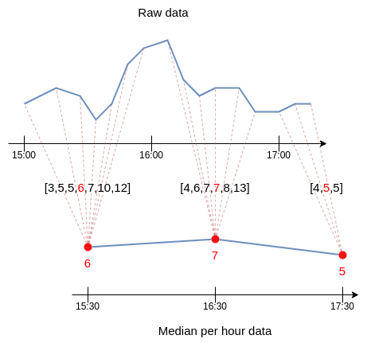
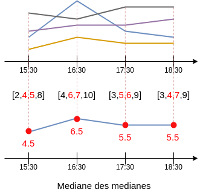
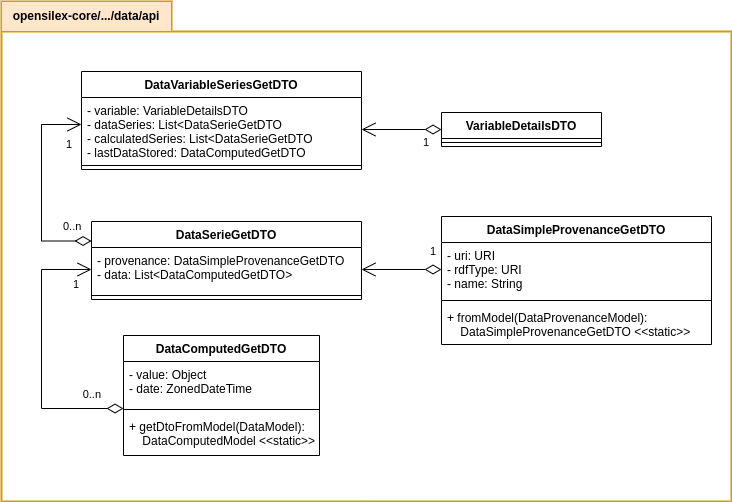
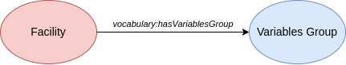

# [Facilities] Environmental data visualization

Author: Brice Maussang

Date: 30/05/2023

Developer(s): Brice Maussang

Version: Opensilex 1.0.0-rc+7

<!-- TOC -->
## Table of contents
* [Needs](#needs)
* [Definitions](#definitions)
* [Solution](#solution)
* [Technical specifications](#technical-specifications)
  * [General functioning](#general-functioning)
  * [API](#api)
    * [Web service](#web-service)
    * [Models and DTOs](#models-and-dtos)
  * [Frontend](#frontend)
  * [Ontology](#ontology)
  * [Tests](#tests)
  * [Environment changes](#environment-changes)
* [Limitations and Improvements](#limitations-and-improvements)
  * [Limitations](#limitations)
  * [Possible improvements](#possible-improvements)
<!-- TOC -->

## Needs

Facilities represent the different installations that can be used for the experiments. That includes for example
fields, greenhouses or growth chambers.

Data can characterize the environmental conditions of a facility (ex: temperature, humidity, ...).

- Use case #1 : As a user, I want to observe the environmental conditions of a facility.

## Definitions

**Environmental data**:

A data with its *target* field set to a facility URI.

**Environmental variable**:

Variables associated to an environmental data.

**Data series**:

Is considered as the whole data which share the same variable and the same provenance.

## Solution

Add a 'Monitoring' tab in the facility view (open by default) which can display environmental data.

Environmental data are grouped by variables. Each variable are display as a tile within a grid,
showing the variable's name and the last calculated data from past week (median of medians) (see [General_functioning](#general)).
If there is no data found for this period, display the date of the last stored data in the system (in red).

On click on a tile, display the graphic representation of all data series.
By default, only calculated data series are accessible (median of medians, daily mean).
Make possible the display of all data series and the change of the period date by using a settings button.

Possibility to associate one or more variable groups to a facility (at creation or modification
using facility forms) to allow restricted observation of variables.

Add a selector filled with previously associated variable groups on top of the page.
Display only variables which are contained in the selected group.

## Technical specifications

### General functioning

Environmental data are grouped by the couple variable/provenance that gives us multiple data series.

For each data series, the hourly median is constructed.
It consists of retrieving the median value of each hour (cf. [Figure 2](#median_serie)).

After obtaining individual median series, the process is repeated to gather the hourly median
of all median series (cf. [Figure 3](#median_of_medians)).

The mean per day is also computed. It is formed by gathering all raw data (not the medians)
and calculate the mean for each day.

### API

#### Web service

The service is located in `DataAPI`.
It retrieves all data series for given variable and facility.

    public Response getDataSeriesByFacility(
        @NotNull URI variableUri,
        @NotNull URI facilityUri,
        String startDate,
        String endDate,
        Boolean calculatedOnly
    )

*variableUri* and *facilityUri* specifies the concerned variable and the observed facility.

*startDate* and *endDate* defines the period to be taken into account for data collection.
If *endDate* is not specified, the service consider the actual date as the end date.

*calculatedOnly* restrict the service to return calculated series only.

Only the hourly median of individual data series are returned, never the raw data.
Calculated series are computed only if there is more than one individual data series.

The class `DataMathFunctions` was added in the `/utils` folder to externalize calculation methods
such as median and mean.

#### Models and DTOs

    
`DataVariableSeriesGetDTO` contains detailed information on the variable concerned, as well as two lists of data series.
One contains the hourly medians for each provenance, the other the calculated data series
(median of medians and mean).
The last data recorded in the system is also stored, used if there is no data for the chosen period.

`DataSerieGetDTO` defines a data series. Contains the provenance (sensor or complete provenance) and the list of data.

`DataComputedGetDTO` is a lighter version of `DataGetDTO` that stores only the information needed for calculations and visualisation.

`DataSimpleProvenanceGetDTO` defines a provenance with just a URI and a name.

The provenance model contained in a data item can contain variable information.
The list of agents (sensors/operators) in the *provWasAssociatedWith* field can be empty or contain
an indefinite number of elements (cf. [code below](#codeprov)).

To simplify and standardise the information returned by the service, a *DataSimpleProvenanceGetDTO* 
is generated for each provenance from the *DataProvenanceModel* according to these rules:
- If the *provWasAssociatedWith* field contains a single agent, retrieves the URI and name
of this agent.
- If the provenance contains a list of several agents, the URI and the name of the provenance are used.

     /** DataProvenance example **/
    
     {
        ...
    
        "provenance": {
           "provWasAssociatedWith": [
              {
                 "type": "http://www.opensilex.org/vocabulary/oeso#SensingDevice",
                 "uri": "http://opensilex.dev/id/device/deviceA"
              },
              {
                 "type": "http://www.opensilex.org/vocabulary/oeso#SensingDevice",
                 "uri": "http://opensilex.dev/id/device/deviceB"
              }
              {
                 "type": "http://www.opensilex.org/vocabulary/oeso#Operator",
                 "uri": "http://opensilex.dev/id/agent/operateur"
              }
           ],
           "uri": "http://opensilex.dev/id/provenance/prov_carbondioxide_sensor_part_per_million_aria_co2_ce2"
        },
    
        ...
     }

### Frontend

`FacilityMonitoringView`

The main view of the "Supervision" tab.
Contains:
- a *GridLayout* to represent variables in tiles
- a variable group selector

When the component is created, loads all the variables used by the infrastructure.
If a variable group is selected, retrieves the variables present in this group.
Otherwise, retrieves the variables associated with data which is itself associated with an infrastructure
(using the *target* field).

`VariableVisualizationTile`

A *GridItem* which represents a tile for a variable.
Takes the form of a small box displaying the name of the variable and the latest data calculated
(median of medians) for the last week. If there is no data for this period, displays the date 
of the last data recorded in the system for this variable.

Clicking on the tile opens a modal with the graph. Only the calculated series are loaded and the median
of the medians is displayed by default. An option menu is available to change the period of data 
to be displayed and a checkbox for loading or not loading all individual medians.

### Ontology

In order to associate groups of variables with an infrastructure, a property
*oeso#hasVariablesGroup* has been added to the ontology.

    /** oeso-core.owl **/

    <owl:ObjectProperty rdf:about="http://www.opensilex.org/vocabulary/oeso#hasVariablesGroup">
      <rdfs:domain rdf:resource="http://www.opensilex.org/vocabulary/oeso#Installation"/>
      <rdfs:range rdf:resource="http://www.opensilex.org/vocabulary/oeso#VariablesGroup"/>
      <rdfs:label xml:lang="fr">a un groupe de variables</rdfs:label>
      <rdfs:label xml:lang="en">has variable group</rdfs:label>
    </owl:ObjectProperty>

### Tests

Tests are located in `DataMathFunctionsTest`.

Following tests check if the calculations results are correct:
- `testComputeMedianPerHour`
- `testComputeAveragePerDay`

## Limitations and Improvements

### Limitations

At the moment, the datetime considered for calculations is the content of the field `date` from the data.
the service does not consider the `offset` field, which will lead to potential further issues.
Also, the service assumes the `date` is a datetime with no verifications.

The data values must be numbers, but there is no verifications.
The service's behaviour with other types is unknown.

### Possible improvements

Display the median of medians directly on the tile as a simplified curve.
This will grant a better overview without having to click on the tiles.

Being able to select individual devices to display in the graph.
