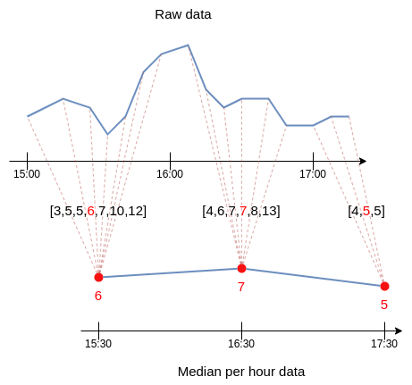
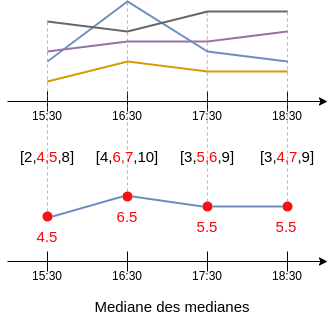
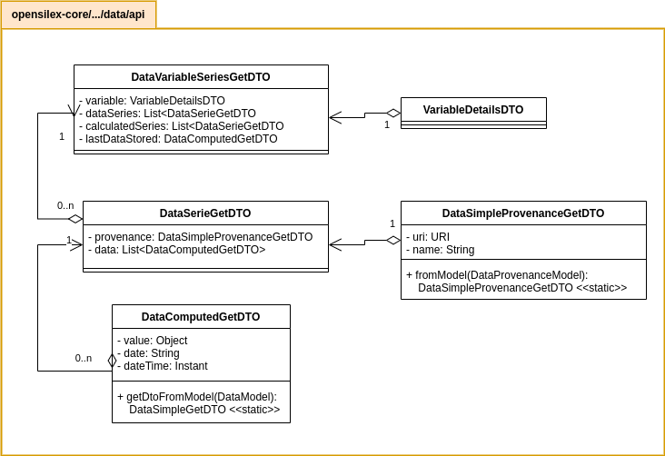
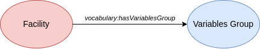

# [Facilities] Visualisation de données environnementales

Auteur: Brice Maussang

Date: 30/05/2023

Developpeureuse(s): Brice Maussang

Versions: Opensilex 1.0.0-rc+7

# Table des matières
1. [Besoin](#besoin)
2. [Solution retenue](#solution-retenue)
3. [Spécification techniques](#specifications)
   1. [Définitions clés](#definitions)
   2. [API](#api)
   3. [Frontend](#frontend)
   4. [Ontologie](#ontology)
   5. [Tests implémentés](#tests)
   6. [Modifications de l'environnement](#environment)
4. [Améliorations](#improvments)

## I. Besoin

Un utilisateur doit être en mesure de visualiser rapidement "l'état" d’une infrastructure
(ex: serre, chambre de culture, …) en observant des données environnementales rattachées 
à celle-ci (ex: température, humidité, …).

## II. Solution retenue

Ajouter un onglet "Supervision" dans la page d’une infrastructure (ouvert par défaut)
qui affiche les différentes données environnementales.

Possibilité d’associer un ou plusieurs groupes de variables à une infrastructure dans 
le formulaire de création et de modification.
Un bandeau présent en haut de page met à disposition un sélecteur de groupe de variables 
(parmi ceux associés à l’infrastructure). En sélectionnant un groupe, seules les variables présentes dans celui-ci 

Regrouper les données par variables sous la forme de petits encadrés.
Chacun représente une variable et affiche la dernière donnée calculé sur la dernière semaine
(médiane des médianes).
S’il n’y a pas de données sur cette période, affiche la date de la dernière donnée 
enregistrée dans le système.

Pouvoir visualiser le graphique complet contenant les séries de données calculées
ainsi que l’ensemble des séries de données. Le graphique s’affiche en cliquant sur la tuile, 
seules les séries de données calculées sont visibles.
Un bouton de paramètre offre la possibilité de changer la période des données à afficher
et de sélectionner si oui on non afficher toutes les séries de données individuelles.

## III. Spécification techniques

### A) Définitions clés

**Variable environnementale**:

Est considérée comme une variable environnementale toute variable ayant des données rattachées
qui pointent vers une infrastructure (via le champ "target").

**Série de données**:

Une série de données est un ensemble de données possédant la même variable ainsi que la même provenance.

### B) API

#### 1) Architecture générale

<i>Figure 1 - architecture des dossiers</i>

#### 2) Web service

Le web service récupère toutes les séries de données pour une variable et une infrastructure.
Ce service est appelé lorsque l’utilisateur souhaite voir en détail les données associées à
une variable environnementale.

    public Response getDataSeriesByFacility(
        @NotNull URI variableUri,
        @NotNull URI facilityUri,
        String startDate,
        String endDate,
        Boolean calculatedOnly
    )

*variableUri* et *facilityUri* spécifient l'infrastructure observée et la variable concernée.

*startDate* et *endDate* définissent la période à prendre en compte pour la collecte de données.
Si *endDate* est null, le service considère la date actuelle comme date de fin.

*calculatedOnly* contraint le service à retourner uniquement les séries calculées.

Le service recherche toutes les données associées à la variable et l’infrastructure passés en paramètres,
puis les regroupent par série de données brutes (couple variable/provenance).

Pour chaque série, seule la médiane horaire est conservée, c-à-d la médiane des valeurs comprises entre
chaque intervalle d’une heure (cf. [Figure 2](#median_serie)).

[//]: <> (

)
[//]: <> (
<i>Figure 2 - construction d'une série de médianes horaires</i>
)

S’il y a plusieurs séries de données, deux séries supplémentaires sont alors calculées: 
la médiane des médianes horaire et la moyenne horaire.
- La médiane des médianes horaire: correspond à la médiane des séries médianes calculées précédemment 
  (médiane des médianes) (cf. [Figure 3](#median_of_medians)).
- La moyenne journalière: correspond à la moyenne par jour des séries de données brutes.

#### 3) Modèles et DTOs

Les informations retournées par le services sont organisées selon le format ci-dessous:
    
**DataVariableSeriesGetDTO**

Contient les informations détaillées de la variable concernée ainsi que deux listes de série de données.
L’une contient les médianes horaires de chaque provenance, l’autre les série de données calculées 
(médiane des médianes et moyenne).
On stocke également la dernière donnée enregistrée dans le system,
pour le cas où il n'y a aucune donées pour la période choisie.

**DataSerieGetDTO**

Défini une série de donnée. Contient la provenance (capteur ou provenance) et la liste des données.

**DataComputedGetDTO**

Une version allégée de DataGetDTO qui stocke uniquement les informations nécessaires aux calculs et à la visualisation.

**DataSimpleProvenanceGetDTO**

Défini une provenance avec seulement une URI et un nom.

Le modèle de provenance contenu dans une data peut contenir des informations variables.
La liste d'agent (capteurs/opérateurs) du champ *provWasAssociatedWith* peut être vide ou contenir
un nombre indéfini d'élément (cf. [code ci-dessous](#codeprov).

Afin de simplifier et d'uniformiser l'information retournée par le service, un *DataSimpleProvenanceGetDTO*
est généré pour chaque série (chaque provenance) à partir du *DataProvenanceModel* selon ces règles:
- Si le champ *provWasAssociatedWith* contient un seul agent, récupère l'URI et le nom
de cet agent.
- Si la provenance contient une liste de plusieurs agents, l'URI et le nom de la provenance est utilisé.

     /** DataProvenance example **/
    
     {
        ...
    
        "provenance": {
           "provWasAssociatedWith": [
              {
                 "type": "http://www.opensilex.org/vocabulary/oeso#SensingDevice",
                 "uri": "http://opensilex.dev/id/device/deviceA"
              },
              {
                 "type": "http://www.opensilex.org/vocabulary/oeso#SensingDevice",
                 "uri": "http://opensilex.dev/id/device/deviceB"
              }
              {
                 "type": "http://www.opensilex.org/vocabulary/oeso#Operator",
                 "uri": "http://opensilex.dev/id/agent/operateur"
              }
           ],
           "uri": "http://opensilex.dev/id/provenance/prov_carbondioxide_sensor_part_per_million_aria_co2_ce2"
        },
    
        ...
     }

### C) Frontend

**FacilityMonitoringView**

La vue principale de l'onglet "Supervision".
Contient:
- un *GridLayout* pour représenter les variables par tuiles
- un sélecteur de groupe de variable

A la création du composant, charge l'ensemble des variables utilisée par l'infrastructure.
Si un groupe de variable est sélectionné, récupère les variables présentes dans ce groupe.
Sinon, récupère les variables associées à des données elle-même associées à une infrastructure
(via le champ *target*).

**VariableVisualizationTile**

Un *GridItem* qui représente une tuile pour une variable.
Prend la forme d'un petit encadré affichant le nom de la variable ansi que la dernière donnée calculé
(médiane des médianes) pour la dernière semaine (valeur et date). S'il n'y a aucune donnée pour cette période,
affiche la date de la dernière donnée enregistrée dans le système pour cette variable.

En cliquant sur la tuile, ouvre un modal avec le graphique. Seules les séries calculées sont chargées et la médiane
des médianes et affiché par défaut. Un menu d'option est disponible pour changer la période des données à afficher
et une case à cocher pour charger ou non l'intégralité des séries de médianes individuelles.

### D) Ontologie

Afin de pouvoir associer des groupes de variables à une infrastructure, une propriété 
*oeso#hasVariablesGroup* a été ajouté à l'ontologie.

    /** oeso-core.owl **/

    <owl:ObjectProperty rdf:about="http://www.opensilex.org/vocabulary/oeso#hasVariablesGroup">
      <rdfs:domain rdf:resource="http://www.opensilex.org/vocabulary/oeso#Installation"/>
      <rdfs:range rdf:resource="http://www.opensilex.org/vocabulary/oeso#VariablesGroup"/>
      <rdfs:label xml:lang="fr">a un groupe de variables</rdfs:label>
      <rdfs:label xml:lang="en">has variable group</rdfs:label>
    </owl:ObjectProperty>

### E) Tests implémentés

### F) Modifications de l'environnement

**Vue-grid-layout (v2.4.0)**: Ajout d’un système de disposition en grille pour VueJS
https://jbaysolutions.github.io/vue-grid-layout/

## IV. Améliorations