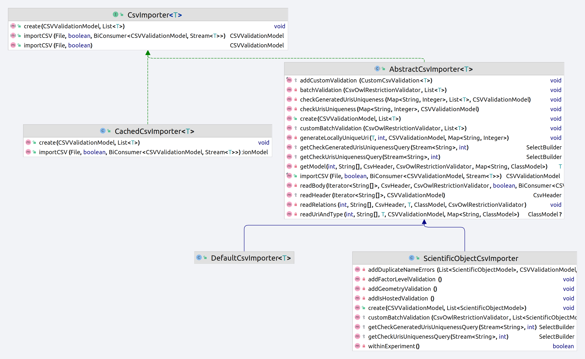

<b>Description</b> : Documentation on validation and import mechanism with CSV file <br> 
<b>Tags</b> :  #csv #RDF #OWL2

<hr>


# Description

This document describes use cases and conception concerning the import and validation of a CSV file which can contains instance of some concept (Device, Scientific Object)

# Usage


## Basic

The example below show a minimal CSV file with two row.
Suppose that we are in the case of import of object with `vocabulary:test_type` as type

| **uri**                       | **type**                       | **rdfs:label**                       |
|-------------------------------|--------------------------------|--------------------------------------|
| uri header comment (optional) | type header comment (optional) | rdfs:label header comment (optional) |
|                               |                                | "name1"                              |
| `opensilex:my_fixed_uri_1`    | `vocabulary:test_sub_type`     | "name2"                              |

- **Row 1**
  - no uri specified : the URI will be generated
  - no type specified :  we consider  `vocabulary:test_type` as type.
  - `"name1"` 
    - the object will have `rdfs:label "name1"` as relation if the property `rdfs:label` is applicable to the type `vocabulary:test_type`.
    - The property is applicable if there exist a OWL2 restriction between the OWL Class `vocabulary:test_sub_type` and 
    and the OWL property`rdfs:label`
    - Else it's a `Invalid value` error
- **Row 2**
  - `opensilex:my_fixed_uri_1` as URI : use this URI if it's a new URI in the triple store (`Already existing URI` error else)
  - `vocabulary:test_sub_type` as type : use this type if `vocabulary:test_sub_type` is a subclass of `vocabulary:test_type` (`Invalid value` error else)
  - the object will have `rdfs:label "name2"` as relation

## Data and object properties

We are still considering the case of import of object with `vocabulary:test_type` as type


| uri                           | type                           | vocabulary:int_property  | vocabulary:object_prop1     | 
|-------------------------------|--------------------------------|--------------------------|-----------------------------|
| uri header comment (optional) | type header comment (optional) | type: integer (optional) | type: vocabulary:test_type2 |
|                               |                                | 5                        | test:object1                |

- **Row1** 
  - `vocabulary:int_property` :
    - object will have `vocabulary:int_property 5` as relation, if 
      - `vocabulary:int_property` apply on `vocabulary:test_type`
      - the value 5 is well parsed as an integer
  - `vocabulary:object_prop1` : object will have `vocabulary:object_prop1 test:object1` as relation, if 
    - `vocabulary:object_prop1` apply on `vocabulary:test_type`
    - there exist a resource with  `vocabulary:object_prop1` as URI, which is a `vocabulary:test_type2` into the triple store

## Data and object list properties


| uri | type | rdfs:label | rdfs:comment | vocabulary:object_property1 | vocabulary:data_property1 | vocabulary:data_list_property1 |     |
|-----|------|------------|--------------|-----------------------------|---------------------------|--------------------------------|-----|
|     |      |            |              |                             |                           |                                |     |
|     |      |            |              |                             |                           |                                |     |
|     |      |            |              |                             |                           |                                |     |
|     |      |            |              |                             |                           |                                |     |


## Errors

| Name                       | Description                                                                  | Type   |
|----------------------------|------------------------------------------------------------------------------|--------|
| **Empty header**           | The CSV file has no header                                                   | HEADER |
| **Invalid header URI**     | A column use an invalid URI as identifier                                    | HEADER |
| **Missing header**         | A required property is not present into the header                           | HEADER |
| **Invalid value**          | A value is defined for a property, which is not compatible with the row type | BODY   |
| **Already existing URI**   | A fixed URI already exists into the triple store                             | BODY   |
| **Invalid datatype**       | A data-property (primitive value) can't be parsed                            | BODY   |
| **Missing required value** | No value for a required relation                                             | BODY   |
| **URI not found**          | URI used as value of an object property is not found into the triple store   | BODY   |
| **Duplicate URI**          | A fixed URI is already used by a previous row                                | BODY   |
| **Invalid URI**            | A URI used as value of an object property can't be parsed                    | BODY   |
| **Invalid row size**       | Row size is different than the header size                                   | BODY   |
| **Invalid date**           | A Start date cannot be later than End date                                   | BODY   |

# Conception



- ```CsvImporter``` : Basic interface for CSV file validation and import
- ```AbstractCsvImporter``` :  Default importer in which read, validation and import logic are implemented. This abstract implementation allow specializations to define custom validation and insertion logic. 
- ```DefaultCsvImporter``` :  Default CSV importer for any concept. 
- ```CachedCsvImporter``` : Implementation of import used when performing validation and import in two times. This implementation cache validation in order to make further import faster.  This importer rely on a delegated importer for import and validation. 
- ```ScientificObjectCsvImporter``` :  Specialization of import, which implements custom validation and insertion, based on scientific object business logic

## Validation

### File read

CSV file parsing is performed with the [univocity](https://github.com/uniVocity/univocity-parsers) CSV parser. This library provide
fast parsers and several useful functionality (separator handling,  row or column based processing).

To summarize, the CSV validation and import are performed inside the `AbstractCsvImporter.readBody` method
by following the following steps : 

> - Buffered read of CSV file as a stream (using  java BufferedInputStream in order to minimize I/O call)
> 
> - Pass stream to univocity CSV parser and process CSV row by row
> 	-  Validation of type and properties coherence by using OWL schema information (with the OntologyStore)
> 	- Validate data-properties values row by row
>   - Batch validation of object-properties (minimize the number of query for validation)
>   - Batch insertion

### Custom validation handling

The `AbstractCsvImporter` class allow subclasses to define custom validation.
By custom validation, we mean a specific validation which can apply on some property.

If this validation is defined, then importer will apply the validation action associated with the property, if 
this property is encountered inside CSV header

The definition of a custom validation is done by calling `AbstractCsvImporter.addCustomValidation(CustomCsvValidation)` method.


### Custom batch validation

Following the same principle as the custom validation handling, abstract import allow implementation
to define validation(s) to apply that a chunk has been processed by the abstract importer.

It is useful when some validation must be evaluated on multiple model/row in order to be efficient.  <br>
Ex: Evaluate a SPARQL query to known if values for some properties are unique, this query can be performed 
on a batch of model.

The definition of custom batch validation is done by calling `AbstractCsvImporter.customBatchValidation(CsvOwlRestrictionValidator, List<T>,int)` method.


### Custom URI generation rules

Implementation can also define how to validate the URI uniqueness in case of generated or fixed URI.

**Generated**

The process of checking if all generated URI are unique is performed inside  `AbstractCsvImporter.checkGeneratedUrisUniqueness` method. <br>
This method rely on  `AbstractCsvImporter.getCheckGeneratedUrisUniquenessQuery` in order to know which SPARQL query execute, for 
URI validation.

Implementation can define a custom SPARQL query in the case of a custom graph or logic must be applied for URI generation.

**Fixed**

The process of checking if all fixed URI are unique is performed inside  `AbstractCsvImporter.checkUrisUniqueness` method. <br>
This method rely on  `AbstractCsvImporter.getCheckUrisUniquenessQuery` in order to know which SPARQL query execute, for
URI validation.

Implementation can define a custom SPARQL query in the case of a custom graph or logic must be applied for URI which are fixed.


## Creation

Importer rely on `CsvImporter.create(CSVValidationModel,List<T>)` method in order to perform
insertion of a validation chunk composed of model from CSV rows.

By default, the importer only create models with the associated graph, but implementation
can define a custom insertion pipeline by redefining `create(CSVValidationModel,List<T>` method.
Use this if the business logic imply to perform other write operation after each chunk validation. 

## Further improvements 

This section describes several performances improvements which could be implemented in the future.

### Parallelization of column validation

Validation of each column could be performed concurrency, since if most cases, column are independent.

For object properties, this can be done by evaluating SPARQL query associated to each column in a parallelized way. 

For data properties, this can be done by validating each column inside a seperated thread/task. 

Moreover, grouping operation which apply on each column could lead to a better CPU cache locality and less RAM usage (by reusing object 
needed for validation for each cell value to validation) and probably a better use of JIT optimization, since
the JVM can optimize operation which are repeated in some amount of time by compiling the associated bytecode.

### Cache instance for some classes in RAM 

We can suppose that the number of instance of concept like variable, germplasm, factor, experiment etc. 
is largely smaller than the number of scientific object, event or measure/data.

So we could check if a property has as range, a concept which is cached.
Ex: If the property is `vocabulary:hasGermplasm` has `vocabulary:Germplasm` as range.
So if Germplasms are cached (small number of germplasm and low frequency of update or insertion), we can 
retrieve them from RAM in order to accelerate validation.


### Object insertion

Actually a lot of transformation and memory allocations are performed when importing a model from a row : 

- A row (an array of string) in converted to a generic `SPARQLResourceModel` with corresponding relations
- Corresponding Jena query is updated by using `UpdateBuilder`
- This `UpdateBuilder` in converted into a String representation of the corresponding SPARQL update
- Then the SPARQL query is passed to RDF4J for evaluation

All these operations lead to more memory allocation (which lead to more GC operations), and more CPU usage.
An optimization could be to directly write parsed and validated row content into the RDF4J query builder.

This optimization need some work in order to expose RDF4J connection directly into the importer, to validate
relations are not stored from a `SPARQLResourceModel` and to ensure that custom validation can still be performed. 

### Scientific object specific optimizations

**Geometry parsing** 

The parsing of geometry from WKT format into MongoDB compatible format (Geometry) is actually very-CPU consuming.
Since multiple conversion are performed, the processing of some thousand of geometries can take some seconds.

We should find a way to validate these WKT geometries in a faster way. 
