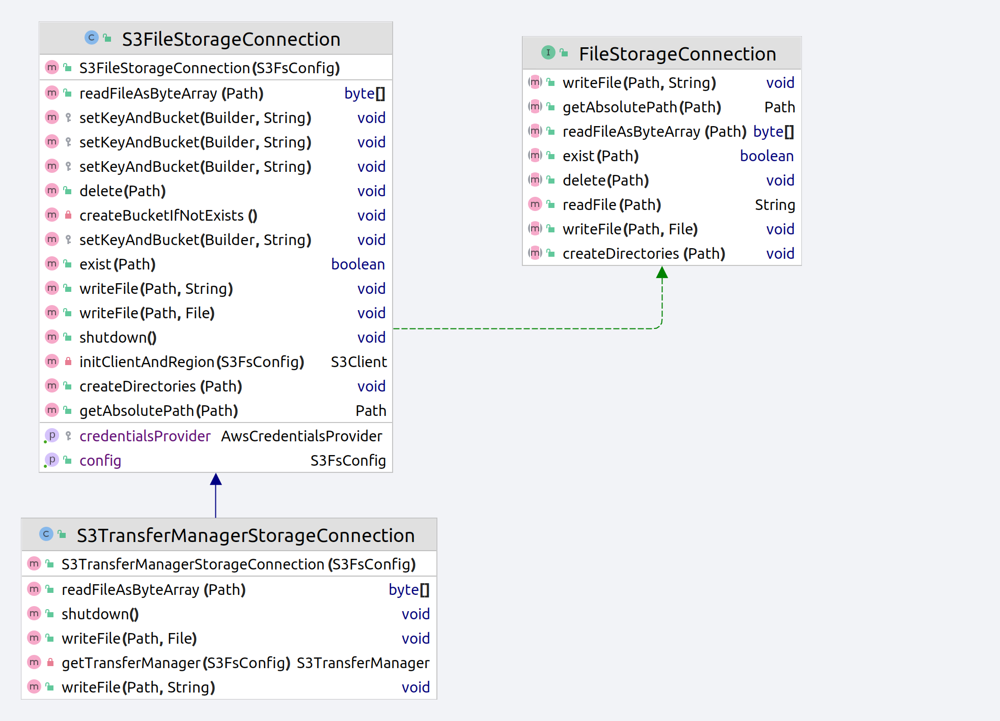
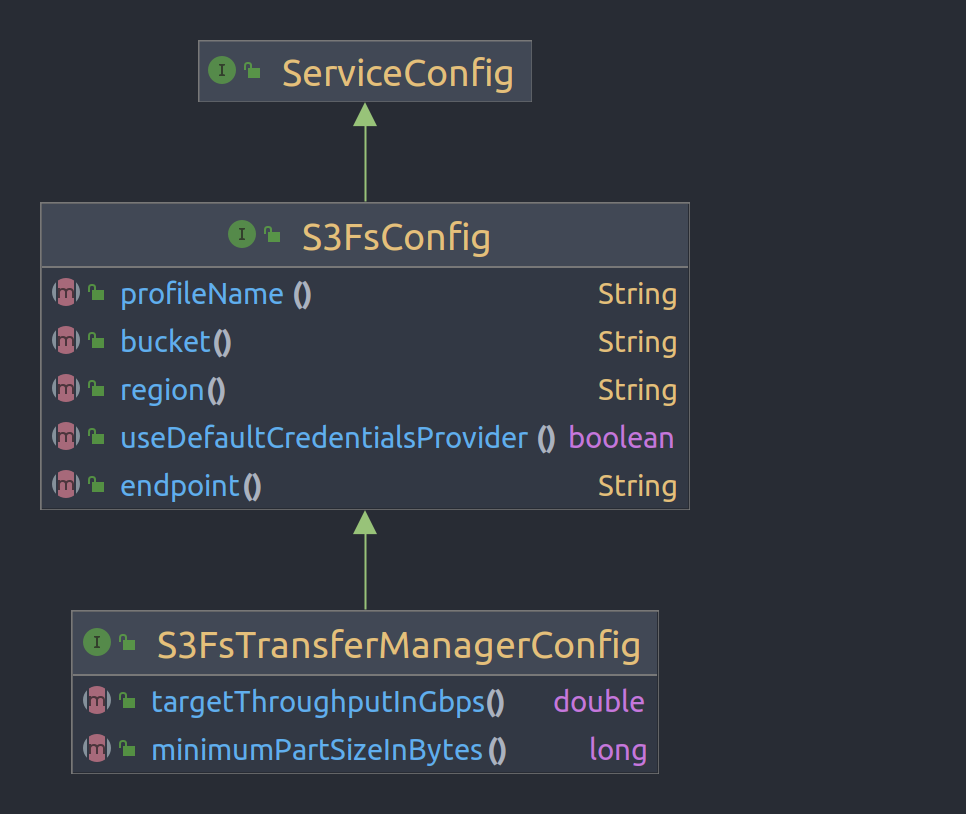

# S3 storage with OpenSILEX

- **Description**: Conception, implementation and usage of an Amazon S3 storage as file-system connection
  for OpenSILEX
- **Author** : Renaud COLIN (INRAE MISTEA)
- **Date** : 06/10/2022
- **Tags**: `[S3, Amazon, FileSystem]`

<hr>

- [Conception](#conception)
  - [Bucket and file management ](#bucket-and-file-management)
  - [Upload/Download file](#uploaddownload-file)
  - [Authentication](#authentication)
  - [Configuration](#configuration)
  - [S3 client usage](#s3-client-usage)
- [Performances](#performances)
  - [Protocol](#benchmark-protocol)
  - [Results](#results)
- [How to use](#how-to-use)
  - [One endpoint <-> One bucket](#one-endpoint---one-bucket)
  - [One endpoint <-> Multiple bucket](#one-endpoint---multiple-bucket) 
  - [Multiple endpoint <-> Multiple bucket](#multiple-endpoint---multiple-bucket)
  - [Credentials configuration](#use-a-credential-method-different-from-the-credential-file-method)
- [Links](#links)
  - [Developers](#developers)
  - [Users and admin](#usersadministrators)

<hr>

# Conception

## Bucket and file management 

S3 use the concept **bucket** in order to represent storage resource and access configuration.
It can be viewed as the equivalent of database for a RDBMS or collection for document NoSQL databases.

This section describes how OpenSILEX can handle S3 connection and manage storage by different way (see **_How to use_** for configuration)

### One endpoint <-> One bucket

OpenSILEX can use a single S3 connection which use a single bucket.
Into this bucket, multiple files types can be stored : documents, datafile

```yaml
s3-website.eu-west-2.amazonaws.com:
    opensilex-bucket:
        datafile/aHR0cDovL3d3dy5waGVub21l
        document/fd45fdpf5df1fd14df4fd14d
```

with :
- `s3-website.eu-west-2.amazonaws.com` : URL of the S3 service/endpoint
- `opensilex-bucket` : a bucket
- `datafile/aHR0cDovL3d3dy5waGVub21l`: path to an object/file stored inside the opensilex-bucket.
- `document/fd45fdpf5df1fd14df4fd14d` : path to an object/file stored inside the opensilex-bucket.

### One endpoint <-> multiple bucket

OpenSILEX can manage multiple S3 bucket for a single endpoint

```yaml
s3-website.eu-west-2.amazonaws.com:
    datafile-bucket:
        datafile/aHR0cDovL3d3dy5waGVub21l
    document-bucket:
        document/fd45fdpf5df1fd14df4fd14d
```

with :
- `s3-website.eu-west-2.amazonaws.com` : URL of the S3 service/endpoint
- `datafile-bucket` : a bucket
- `datafile/aHR0cDovL3d3dy5waGVub21l`: path to an object/file stored inside the datafile-bucket.
- `document-bucket` : a bucket
- `document/fd45fdpf5df1fd14df4fd14d` : path to an object/file stored inside the document-bucket.


### Multiple endpoint <-> multiple bucket

OpenSILEX can manage several endpoint, if multiple S3 connection are provided as configuration

```yaml
s3-website.eu-west-2.amazonaws.com:
    datafile-bucket:
        datafile/aHR0cDovL3d3dy5waGVub21l
    
s3-website.eu-west-3.amazonaws.com:   
    document-bucket:
        document/fd45fdpf5df1fd14df4fd14d
```

with :
- `s3-website.eu-west-2.amazonaws.com` : URL of the S3 service/endpoint
- `s3-website.eu-west-3.amazonaws.com` : URL of another S3 endpoint


## Authentication

Several authentication method are provided for S3 ([credentials](https://docs.aws.amazon.com/sdk-for-java/latest/developer-guide/credentials.html))

The authentication is performed at the endpoint level, so multiple 
bucket inside an endpoint use the same authentication method and credentials.

By default, OpenSILEX rely on credentials file stored in `$HOME/.aws/credentials` with `aws_access_key_id` and `aws_secret_access_key` and 
use the [ProfileCredentialsProvider](https://sdk.amazonaws.com/java/api/latest/software/amazon/awssdk/auth/credentials/ProfileCredentialsProvider.html).
This credential provider also take care of the profile passed in configuration. 

**Note :**  If you must use a credential method different from shared credentials file, you can update the
configuration file in order to tell OpenSILEX to let Amazon SDK search for any available credentials.
See ([S3 credentials](https://docs.aws.amazon.com/sdk-for-java/latest/developer-guide/credentials.html)) for more information about credentials methods.

Some of the following method are available : 

- **Java system properties** : 
  - Amazon SDK search for `aws.accessKeyId`, `aws.secretAccessKey` and `aws.sessionToken` Java system properties.
  - In this case, OpenSILEX `.jar` archive must be executed with these properties defined
- **Environment variable** : 
  - Amazon SDK use `AWS_ACCESS_KEY_ID` and `AWS_SECRET_ACCESS_KEY` and `AWS_SESSION_TOKEN` system environment variables. 
  - These variables must be defined and exported before launching OpenSILEX

(Go to **How to use/Use a credential method different from the credential file method for configuration** section for an example)

### Bucket

**Creation strategy**

If the specified bucket doesn't exist, then OpenSILEX will try to create it.
It can fail according the permissions accorded to the used profile.

**Bucket policy**

S3 allow to configure advanced bucket access policy concerning resource usage 
(bandwidth, request number) and authorization.

https://docs.aws.amazon.com/config/latest/developerguide/s3-bucket-policy.html
https://docs.aws.amazon.com/AmazonS3/latest/userguide/BucketRestrictions.html


**Limitations**

- `Maximum object size` :    5 TB
- `Maximum number of parts per upload ` :    10,000
- `Part numbers` :    1 to 10,000 (inclusive)
- `part size` :    5 MB to 5 GB.

https://docs.aws.amazon.com/AmazonS3/latest/userguide/qfacts.html

# How to use

### One endpoint <-> One bucket

```yaml
file-system:
    fs:
        config:
            defaultFS: S3      
            connections:
                S3:
                    implementation: org.opensilex.fs.s3.S3FileStorageConnection
                    config:
                        endpoint: s3-website.eu-west-3.amazonaws.com
                        region: eu-west-3
                        bucket: opensilex-bucket # global bucket for datafile and document management
```

### One endpoint <-> multiple bucket

```yaml
file-system:
    fs:
        config:
            customPath:
                datafile/: s3_datafile
                documents/: s3_document 
                
            connections:
                s3_datafile:
                    implementation: org.opensilex.fs.s3.S3FileStorageConnection
                    config:
                        endpoint: s3-website.eu-west-3.amazonaws.com # same endpoint
                        region: eu-west-3
                        bucket: opensilex-datafile-bucket # datafile bucket
                        
                s3_document:
                    implementation: org.opensilex.fs.s3.S3FileStorageConnection
                    config:
                      endpoint: s3-website.eu-west-3.amazonaws.com # same endpoint
                      region: eu-west-3
                      bucket: opensilex-document-bucket  # document bucket
```

### Multiple endpoint <-> Multiple bucket

```yaml
file-system:
    fs:
        config:
            customPath:
                datafile/: s3_datafile
                documents/: s3_document 
                
            connections:
                s3_datafile:
                    implementation: org.opensilex.fs.s3.S3FileStorageConnection
                    config:
                        endpoint: s3-website.eu-west-3.amazonaws.com # endpoint 1
                        region: eu-west-3
                        bucket: opensilex-datafile-bucket # datafile bucket
                        
                s3_document:
                    implementation: org.opensilex.fs.s3.S3FileStorageConnection
                    config:
                      endpoint: s3-website.eu-west-2.amazonaws.com # endpoint 2
                      region: eu-west-2
                      bucket: opensilex-document-bucket  # document bucket
```

### Use default credential method 

Your have to create or to update the shared credentials file which will be read by S3 SDK on OpenSILEX 
file system initialization.

Run the following command

```shell
mkdir $HOME/.aws/ && nano $HOME/.aws/credentials
```

put the following content in the file and save it (by replacing `custom_profile`, `aws_access_key_id` and `aws_secret_access_key` with your correct values)

```
[custom_profile]
aws_access_key_id = 4XoC55EXyaMo4thWqH8k
aws_secret_access_key = 1iEorGRsia7S4o32XHxLx8mQlntx6gLH7W58wXJ9
```

**Note:** if no particular profile is set, then consider the use of the default profile :

```
[default]
aws_access_key_id = 4XoC55EXyaMo4thWqH8k
aws_secret_access_key = 1iEorGRsia7S4o32XHxLx8mQlntx6gLH7W58wXJ9
```

The OpenSILEX config to use will be the following : 

```yaml
file-system:
    fs:
        config:
            defaultFS: S3      
            connections:
                S3:
                    implementation: org.opensilex.fs.s3.S3FileStorageConnection
                    config:
                        endpoint: s3-website.eu-west-3.amazonaws.com
                        region: eu-west-3
                        bucket: opensilex-bucket 
                        profile: custom_profile # no value | default if no particular profile is used
```

See [credentials-files-format](https://docs.aws.amazon.com/sdkref/latest/guide/file-format.html) for more informations
about file configuration

### Use a credential method different from the credential file method

```yaml
file-system:
    fs:
        config:
            defaultFS: S3      
            connections:
                S3:
                    implementation: org.opensilex.fs.s3.S3FileStorageConnection
                    config:
                        endpoint: s3-website.eu-west-3.amazonaws.com
                        region: eu-west-3
                        bucket: opensilex-bucket # global bucket for datafile and document management
                        useDefaultCredentialsProvider: true
```
### Use the S3 transfer manager based implementation (more optimized) (not yet functional)

**Note** :  
Due to an issue on S3 transfer manager API (`software.amazon.awssdk.s3-transfer-manager` version`2.17.276-PREVIEW`). <br>
The use of this implementation will result to an error (see https://github.com/aws/aws-sdk-java-v2/issues/3350 for more technical details)

```yaml
file-system:
    fs:
        config:
            defaultFS: S3      
            connections:
                S3:
                  implementation: org.opensilex.fs.s3.transferManager.S3TransferManagerStorageConnection
                  config:
                    endpoint: s3-website.eu-west-3.amazonaws.com
                    region: eu-west-3
                    bucket: opensilex-bucket                              
                    minimumPartSizeInBytes: 8000000
                    targetThroughputInGbps: 5.0
```

<hr>

# Implementation

## Upload/Download file



Two `FileStoreConnection` are implemented for the access of a S3 storage :
- `S3FileStorageConnection` : Basic implementation of S3 storage access
- `S3TransferManagerStorageConnection` : Specialization which use the high level `TransferManager` library.
  This one has high level file manipulation functionalities (file upload/download, directory upload), enhanced throughput and performance, and provides
  progress view of files operations.

Following sections describe succinctly the possible uses cases of file connection
and some connection code examples.

### Upload

Considering the upload of a datafile with :
- `http://www.phenome-fppn.fr/id/file/1661036401.fcf0933a40d6bc61bbdb89d625c44ec1` : URI of the datafile
- `datafile/aHR0cDovL3d3dy5waGVub21l`: file path generated from datafile URI

**Upload file :**

```java
File fileToUpload; // file from API
Path dataFilePath = Paths.get("datafile/aHR0cDovL3d3dy5waGVub21l"); // path for a datafile
s3FsConnection.writeFile(dataFilePath,fileToUpload);
```

**Upload file content :**

```java
String fileContent; // file content from API
Path dataFilePath = Paths.get("datafile/aHR0cDovL3d3dy5waGVub21l"); // path for a datafile
s3FsConnection.writeFile(dataFilePath,fileContent);
```

An object (a file here) with the key `datafile/aHR0cDovL3d3dy5waGVub21l` will be inserted
into the bucket used by the datafile connection.

### Declaring existing file

Considering the declaration of an existing datafile from a S3 bucket with :
- `datafile/sub_directory/LWZwcG4uZnIvaWQvZmlsZS8x` : relative path of the existing datafile (key of file into bucket)
- `/datafile/sub_directory/LWZwcG4uZnIvaWQvZmlsZS8x` : absolute path of the existing datafile

For already uploaded file declaration, it's just needed to check if the specified file exists or not

**Check file existence**

```java
Path dataFilePath = Paths.get("datafile/aHR0cDovL3d3dy5waGVub21l"); // path for a datafile
boolean fileExists = s3FsConnection.exists(dataFilePath);

Path absoluteFilePath = Paths.get("/datafile/aHR0cDovL3d3dy5waGVub21l"); // absolute path for a datafile
fileExists =  s3FsConnection.exists(absoluteFilePath);
```

**_Note_** : The S3 connection has no notion of base/root path, so calling `S3FileStorageConnection.getAbsolutePath(path)`
will just return `path`

### Download file

Considering the download of a datafile with :
- `http://www.phenome-fppn.fr/id/file/1661036401.fcf0933a40d6bc61bbdb89d625c44ec1` : URI of the datafile
- `datafile/aHR0cDovL3d3dy5waGVub21l`: file path generated from datafile URI (key of file into bucket)

File is just downloaded from S3 bucket with the corresponding path/key.

**Read file**

```java
Path dataFilePath = Paths.get("datafile/aHR0cDovL3d3dy5waGVub21l"); // path for a datafile
byte[] fileContent = s3FsConnection.readFileAsByteArray(dataFilePath);
```

## Configuration

Two configurations are available depending on the chosen S3 file store implementation



### S3 Client

`S3FsConfig` : Settings which apply on S3 storage configuration

- `endpoint` : S3 endpoint URL
- `region` : S3 region code
- `bucket` : S3 bucket name
- `profileName` : S3 credential profile name
- `useDefaultCredentialsProvider` : Indicate if we let S3 determine the credentials method or if the OpenSILEX
  preferred credentials method must be used (Use shared credentials and configs file).

See _credentials_ in developers links for more details

### Transfer Manager

`S3FsTransferManagerConfig` : Specific settings when using S3 Transfer Manager :

- `minimumPartSizeInBytes` : minimum part size for file transfer parts
- `targetThroughputInGbps` : target throughput

See _client configuration_ in developers links for more details

<hr>

# Links

## Developers

- [developer-guide](https://docs.aws.amazon.com/sdk-for-java/latest/developer-guide/)
- [s3-objects](https://docs.aws.amazon.com/sdk-for-java/latest/developer-guide/examples-s3-objects.html)
- [credentials](https://docs.aws.amazon.com/sdk-for-java/latest/developer-guide/credentials.html)
- [transfer-manager](https://sdk.amazonaws.com/java/api/latest/software/amazon/awssdk/transfer/s3/S3TransferManager.html)
- [transfer-manager-examples](https://github.com/aws/aws-sdk-java-v2/tree/master/services-custom/s3-transfer-manager)
- [client configuration](https://sdk.amazonaws.com/java/api/latest/software/amazon/awssdk/transfer/s3/S3ClientConfiguration.html)

## Users/Administrators
- [endpoints-region-quotas](https://docs.aws.amazon.com/general/latest/gr/s3.html)
- [s3-folders](https://docs.aws.amazon.com/AmazonS3/latest/userguide/using-folders.html)
- [configuration-and-credentials](https://docs.aws.amazon.com/cli/latest/userguide/cli-configure-files.html)
- [credentials-files](https://docs.aws.amazon.com/sdkref/latest/guide/creds-config-files.html)
- [credentilas-files-format](https://docs.aws.amazon.com/sdkref/latest/guide/file-format.html)
- [bucket-restrictions](https://docs.aws.amazon.com/AmazonS3/latest/userguide/BucketRestrictions.html)
- [s3-limits](https://docs.aws.amazon.com/AmazonS3/latest/userguide/qfacts.html)

# Performances

## Benchmark protocol

**Client configuration :**
- **CPU** : i7-8650U CPU @ 1.90GHz × 8
- **RAM** : 16GO DDR4
- **SSD** : NVMe 512GB
- **OS** : Ubuntu 20.04 LTS
- **Amazon SDK**: v2.17.267
- **Java** : OpenJDK 11.0.1
- **Network** : test from local and university networks

**Dataset**
- **Little** : 998 files, 272,8 MB, 
- **Middle** :  69 files, 1.7GB [4.5MB,72MB]
- **Big**: 19 files, 3.96GB [213MB]

**Connections**
- **S3FileStorageConnection** : basic S3 connection
- **S3TransferManagerStorageConnection** : optimized connection for file upload/download

**Run mode**:
- **Single** : upload/download file one by one
- **Concurrent** : parallel file upload/download

## Results

| Dataset | Connection                         | Upload | Download | Upload (parallel) | Download (parallel) |
|---------|------------------------------------|--------|----------|-------------------|---------------------|
| little  | S3FileStorageConnection            |        |          |                   |                     |
| middle  | S3FileStorageConnection            |        |          |                   |                     |
| big     | S3FileStorageConnection            |        |          |                   |                     |
| little  | S3TransferManagerStorageConnection |        |          |                   |                     |
| middle  | S3TransferManagerStorageConnection |        |          |                   |                     |
| big     | S3TransferManagerStorageConnection |        |          |                   |                     |

<hr>