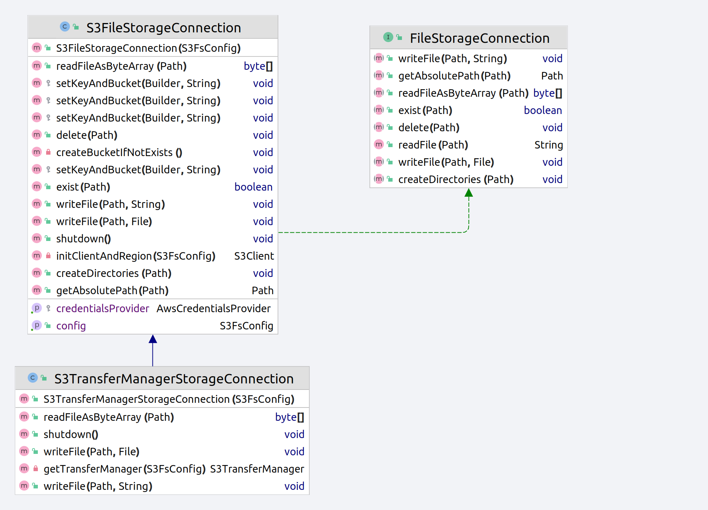
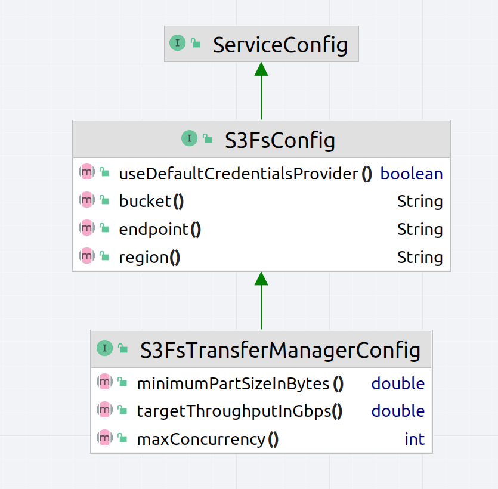

# S3 storage with OpenSILEX
- **Description**: Conception, implementation and usage of an Amazon S3 storage as file-system connection
  for OpenSILEX
- **Author** : Renaud COLIN (INRAE MISTEA)
- **Date** : 06/10/2022
- **Tags**: `[S3, Amazon, FileSystem]`

# Conception

## Bucket and file management 

OpenSILEX can handle S3 connection by different way (see **_How to use_** for configuration)
### One endpoint <-> One bucket

OpenSILEX can use a single S3 connection which use a single bucket.
Into this bucket, multiple files types can be stored : documents, datafile

```yaml
s3_endpoint:
    opensilex-bucket:
        datafile/aHR0cDovL3d3dy5waGVub21l
        document/fd45fdpf5df1fd14df4fd14d
```


### One endpoint <-> multiple bucket

OpenSILEX can manage multiple S3 bucket for a single endpoint

```yaml
s3_endpoint:
    datafile-bucket:
        datafile/aHR0cDovL3d3dy5waGVub21l
    document-bucket:
      document/fd45fdpf5df1fd14df4fd14d
```

### Multiple endpoint <-> multiple bucket

```yaml
s3_endpoint1:
    datafile-bucket:
        datafile/aHR0cDovL3d3dy5waGVub21l
    
s3_endpoint2:    
    document-bucket:
      document/fd45fdpf5df1fd14df4fd14d
```

## Upload/Download on a bucket



### Upload

Considering the upload of a datafile with : 
- `http://www.phenome-fppn.fr/id/file/1661036401.fcf0933a40d6bc61bbdb89d625c44ec1` : URI of the datafile
- `datafile/aHR0cDovL3d3dy5waGVub21l`: file path generated from datafile URI

**Upload file :** 

```java
File fileToUpload; // file from API
Path dataFilePath = Paths.get("datafile/aHR0cDovL3d3dy5waGVub21l"); // path for a datafile
s3FsConnection.writeFile(dataFilePath,fileToUpload);
```

**Upload file content :**

```java
String fileContent; // file content from API
Path dataFilePath = Paths.get("datafile/aHR0cDovL3d3dy5waGVub21l"); // path for a datafile
s3FsConnection.writeFile(dataFilePath,fileContent);
```

### Declaring existing file

Considering the declaration of an existing datafile with : 
- `datafile/sub_directory/LWZwcG4uZnIvaWQvZmlsZS8x` : relative path of the existing datafile
- `/datafile/sub_directory/LWZwcG4uZnIvaWQvZmlsZS8x` : absolute path of the existing datafile

Here it's just need to check if the specified file exists or not

**Check file existence**

```java
Path dataFilePath = Paths.get("datafile/aHR0cDovL3d3dy5waGVub21l"); // path for a datafile
boolean fileExists = s3FsConnection.exists(dataFilePath);

Path absoluteFilePath = Paths.get("/datafile/aHR0cDovL3d3dy5waGVub21l"); // absolute path for a datafile
fileExists =  s3FsConnection.exists(absoluteFilePath);
```

**_Note_** : The S3 connection has no notion of base/root path, so calling `S3FileStorageConnection.getAbsolutePath(path)`
will just return `path`

### Download file

Considering the download of a datafile with :
- `http://www.phenome-fppn.fr/id/file/1661036401.fcf0933a40d6bc61bbdb89d625c44ec1` : URI of the datafile
- `datafile/aHR0cDovL3d3dy5waGVub21l`: file path generated from datafile URI

**Read file**

```java
Path dataFilePath = Paths.get("datafile/aHR0cDovL3d3dy5waGVub21l"); // path for a datafile
byte[] fileContent = s3FsConnection.readFileAsByteArray(dataFilePath);
```

## Authentication


## Configuration




### S3 Client

`S3FsConfig` : Settings which apply on S3 storage configuration

- `endpoint` : S3 endpoint URL
- `region` : S3 region code 
- `bucket` : S3 bucket name
- `useDefaultCredentialsProvider` : Indicate if we let S3 determine the credentials method or if the OpenSILEX
preferred credentials method must be used (Use shared credentials anc configs file). 

See _credentials_ in developers links for more details

### Transfer Manager

`S3FsTransferManagerConfig` : Specific settings when using S3 Transfer Manager : 

- `minimumPartSizeInBytes` : minimum part size for file transfer parts
- `targetThroughputInGbps` : target throughput

See _client configuration_ in developers links for more details

### Notes
**Client sharing:**  If multiple connection share the same endpoint and region, then the `S3FileStorageConnection`
can reuse the same `S3Client` :
- This ensures to not re-create multiple `S3Client` which can be costly
- `S3Client` is thread-safe and can so be shared by multiple `S3FileStorageConnection` safely
- In this case it's only during read/write that each `S3FileStorageConnection` will need a different bucket setting,
  but with the same client.


## Performances

### Benchmark protocol

**Client configuration :** 
- **CPU** : i7-8650U CPU @ 1.90GHz × 8
- **RAM** : 16GO DDR4
- **SSD** : NVMe 512GB
- **OS** : Ubuntu 18.04.6LTS
- **Amazon SDK**: v2.17.267
- **Java** : OpenJDK 11.0.1
- **Network** : max net speed ? 

**Dataset**
- **Little** : high number of call (1000) with small file (372KB) -> **372 MB** of bandwidth
- **Middle** : medium number of call (500) with medium file (2.3MB) -> **1.15 GB** of bandwidth
- **Big** : small number of call (50) with big file (22.6MB) -> **1.13 GB** of bandwidth

**Connections**
- **S3FileStorageConnection** : basic S3 connection
- **S3TransferManagerStorageConnection** : optimized connection for file upload/download

**Run mode**:
- **Single** : upload/download file one by one
- **Concurrent** : parallel file upload/download

### Results

| Dataset | Connection                         | Upload | Download | Upload (parallel) | Download (parallel) |
|---------|------------------------------------|--------|----------|-------------------|---------------------|
| little  | S3FileStorageConnection            |        |          |                   |                     |
| middle  | S3FileStorageConnection            |        |          |                   |                     |
| big     | S3FileStorageConnection            |        |          |                   |                     |
| little  | S3TransferManagerStorageConnection |        |          |                   |                     |
| middle  | S3TransferManagerStorageConnection |        |          |                   |                     |
| big     | S3TransferManagerStorageConnection |        |          |                   |                     |

# How to use

### One endpoint <-> One bucket

```yaml
file-system:
    fs:
        config:
            defaultFS: S3      
            connections:
                S3:
                    implementation: org.opensilex.fs.s3.S3FileStorageConnection
                    config:
                        endpoint: s3-website.eu-west-3.amazonaws.com
                        region: eu-west-3
                        bucket: opensilex-bucket # global bucket for datafile and document management
```

### One endpoint <-> multiple bucket

```yaml
file-system:
    fs:
        config:
            customPath:
                datafile/: s3_datafile
                documents/: s3_document 
                
            connections:
                s3_datafile:
                    implementation: org.opensilex.fs.s3.S3FileStorageConnection
                    config:
                        endpoint: s3-website.eu-west-3.amazonaws.com # same endpoint
                        region: eu-west-3
                        bucket: opensilex-datafile-bucket # datafile bucket
                        
                s3_document:
                    implementation: org.opensilex.fs.s3.S3FileStorageConnection
                    config:
                      endpoint: s3-website.eu-west-3.amazonaws.com # same endpoint
                      region: eu-west-3
                      bucket: opensilex-document-bucket  # document bucket
```

### Multiple endpoint <-> Multiple bucket

```yaml
file-system:
    fs:
        config:
            customPath:
                datafile/: s3_datafile
                documents/: s3_document 
                
            connections:
                s3_datafile:
                    implementation: org.opensilex.fs.s3.S3FileStorageConnection
                    config:
                        endpoint: s3-website.eu-west-3.amazonaws.com # endpoint 1
                        region: eu-west-3
                        bucket: opensilex-datafile-bucket # datafile bucket
                        
                s3_document:
                    implementation: org.opensilex.fs.s3.S3FileStorageConnection
                    config:
                      endpoint: s3-website.eu-west-2.amazonaws.com # endpoint 2
                      region: eu-west-2
                      bucket: opensilex-document-bucket  # document bucket
```

# Links

## Developers

- [developer-guide](https://docs.aws.amazon.com/sdk-for-java/latest/developer-guide/)
- [s3-objects](https://docs.aws.amazon.com/sdk-for-java/latest/developer-guide/examples-s3-objects.html)
- [credentials](https://docs.aws.amazon.com/sdk-for-java/latest/developer-guide/credentials.html)
- [transfer-manager](https://sdk.amazonaws.com/java/api/latest/software/amazon/awssdk/transfer/s3/S3TransferManager.html)
- [transfer-manager-examples](https://github.com/aws/aws-sdk-java-v2/tree/master/services-custom/s3-transfer-manager)
- [client configuration](https://sdk.amazonaws.com/java/api/latest/software/amazon/awssdk/transfer/s3/S3ClientConfiguration.html)

## Users/Administrators
- [endpoints-region-quotas](https://docs.aws.amazon.com/general/latest/gr/s3.html)
- [s3-folders](https://docs.aws.amazon.com/AmazonS3/latest/userguide/using-folders.html)
- [configuration-and-credentials](https://docs.aws.amazon.com/cli/latest/userguide/cli-configure-files.html)