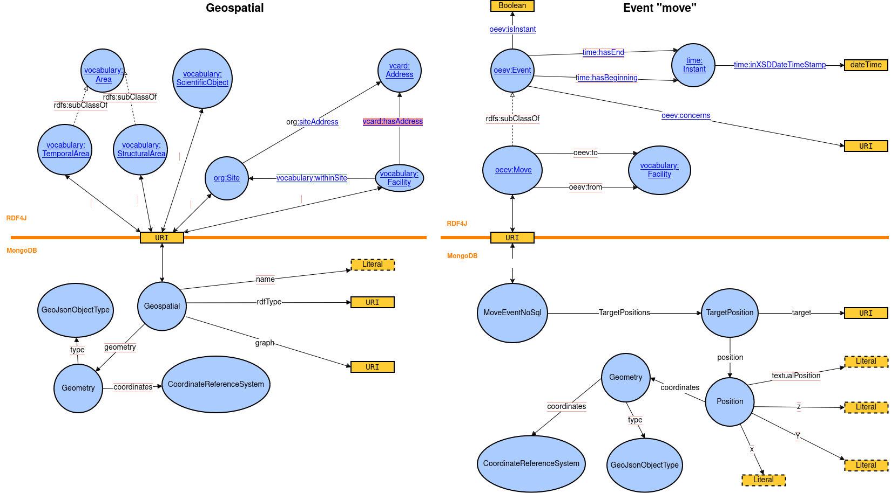

| Date       | Author             | Developer(s)      | Version OpenSilex       | Comment                                                                      |
|------------|--------------------|-------------------|-------------------------|------------------------------------------------------------------------------|
| 7/08/2024  | Alexia Chiavarino  | Alexia Chiavarino | 1.3.0                   | created spec - global and site case                                          |
| 20/09/2024 | Alexia Chiavarino  | Alexia Chiavarino | 1.3.0                   | updated spec - add featureOfInterest field in Mongo + add Improvements       |
| 04/10/2024 | Alexia Chiavarino  | Alexia Chiavarino | 1.3.0                   | updated spec - add facility case + definitions                               |
| 39/09/2025 | yvan.roux@inrae.fr | Yvan Roux         | 1.4.9 Explosive Emerald | Split document into Business logic (spec) and Technical specifications (dev) |

## Table of contents
<!-- TOC -->
  * [Table of contents](#table-of-contents)
  * [Definitions](#definitions)
  * [Functional specifications](#functional-specifications)
  * [Business logic](#business-logic)
    * [Site](#site)
    * [Facility](#facility)
  * [Retro compatibility with version 1.4.x](#retro-compatibility-with-version-14x)
  * [Documentation](#documentation)
<!-- TOC -->

## Definitions

- **Location**: The act of determining the location of a thing, phenomenon or its origin.
- **Position**: Place where a thing is positioned in relation to a whole (in a coordinate system, the orientation of an object, for example: facing east).
- **Geometry**: Science of space and the figures that can occupy it (shape and size of spatial objects).
- **Spatial coordinates**: Numerical representation of the position of an object in space, expressed in various forms according to the spatial coordinate system (sexagesimal or decimal degrees, longitude and latitude).
- **Move**: Oriented distance separating the starting point from the finishing point, in a straight line over a given time.
- **Trajectory**: The trajectory of a moving object is the set of positions it has occupied throughout its movement. A line describes the object's movement with a time dimension (x positions at x times).

## Functional specifications

In OpenSilex, element locations are store in several ways : with an address, spatial coordinates and relative positions
(from/to a facility, X/Y/Z and/or textual position). These locations are associated with the element when it is created
or through the "move" event.

This location information is stored in different databases and with different models, depending on the type of element.
See the table below:

| Element                   | MongoDB - collection "geospatial"        | MongoDB - collection "move"                                    | RDF4J                                |
|---------------------------|------------------------------------------|----------------------------------------------------------------|--------------------------------------|
| Scientific object         | on creation/update : spatial coordinates | on "move" event : spatial coordinates / XYZ / textual position | on "move" event : from/to a facility |
| Device                    |                                          | on "move" event : spatial coordinates / XYZ / textual position | on "move" event : from/to a facility |
| Facility                  | on creation/update : spatial coordinates |                                                                | on creation/update :  address        |
| Site                      | on creation/update : spatial coordinates |                                                                | on creation/update :  address        |
| Structural/ temporal area | on creation/update : spatial coordinates |                                                                |                                      |

In the case of a "move" event, the location is associated with a date (instant or interval).

When an address is associated with a site or facility, the address is stored in RDF4J and converted into spatial
coordinates, stored in the MongoDB in the "geospatial" collection".

For facilities, we can enter an address and spatial coordinates. The feature behavior is explained in the
[facility specification](/src/main/resources/functional-specifications/facilities.md).

This dispersion of the location information, especially for scientific objects stored in the 2 MongoDB
collections with 2 different models, leads to difficulties to get the right location information and spatio-temporal
inconsistencies.

We need to homogenize and simplify the location model of the elements, their storage and control consistency.
In second stage, we would also like to store spatial dataset (e.g. drone flight sessions). .

## Business logic

For facilities, we can enter an address and spatial coordinates. The feature behavior is explained in the
[facility specification](facilities.md).

In SOSA Ontology, an observation collection of a property must be unique for each feature of interest. For example, a
person (feature of interest) can have only one observation collection of his height (property : height) and only one 
observation collection of his location (property : location).

In OpenSilex, the concept of an observation collection is currently only used for the location property. Thus, a location
observation collection is linked to the feature of interest by a unique URI.

### Site

As a site is only located by one address, the localization model must be adjusted:

- a site can have only one address, so the observation collection for a site must contain only one observation.
- no date can be linked to a site, so location observation don't need to store the date.
- an address can only be converted to spatial coordinates as a point type in the location model.

     {
        “observationCollection” : URI,
        "featureOfInterest": URI,
        “hasGeometry” : boolean,
        “location”: {
              "geometry" : {
                  "type": Point,
                  "coordinates": [ X , Y ]
                  },
              },
    }

### Facility
A facility can be located by an address and positions (at different times):

- if the facility is only located by an address, no date can be associated with it, as in the site case.
- if the facility has one or more positions, each position will be associated with a time (instantaneous or interval) and spatial coordinates. Each position is an observation of the facility geometry at time "i". The position must have at least a "endDate".
- as before, if facility has an address and positions, the address spatial coordinates will be replaced by position coordinates.

    {
        “observationCollection” : URI,
        "featureOfInterest": URI,
        “hasGeometry” : boolean,
        “location”: {
              "geometry" : {
                  "type": Point, Line or Polygon
                  "coordinates": [ X , Y ]
              },
        },
        "endDate" : 2024-10-15T06:48:15.777+00:00,
        "startDate" : 2024-11-15T06:48:15.777+00:00
    }

## Retro compatibility with version 1.4.x

In order to avoid **breaking API changes**, we kept **deprecated API properties** despite significant logic changes.
This section explains the behavior of these deprecated properties. **Please do not use these properties, as they will be deleted in a future version, and use `location` property instead.**

Deprecated properties are : `from`, `to`, and `targetPositions`.

When **creating** a move :
- A move with a non-null `location` property will ignore the deprecated properties listed above.
- A move filled with `from` and `to` properties will have the same behaviour as if it was filled with a location containing a `from` and `to` property
- A move filled with many `targetPositionswill` result in many different moves. If you send a move with 3 `targetPositions`, it will create 3 different moves with the same information. Only information contained in the `targetsPositions` will differ.
- `x`, `y`, `z`, `point` and `text` properties in `targetPositions.position` are used to fill resprectively `x`, `y`, `z`, `geojson` and `text` properties in the `location` property of the move.
- A move filled with `from` and `to` and with many `targetPositions` will result in many different moves, each move will have the same `location.from` and `location.to` properties.

**Updating** a move with one of the deprecated properties will result in an error. You can only update a move with the `location` property.

**Getting** a move will always return a move with the `location` property. The deprecated properties will not be returned in the response, even if they were used to create the move.

For compatibility changes regarding the facilities or scientific objects, please see the following documentation files :

- [Specifications : facilities](facilities.md#compatibility)
- [Specifications : Scientific object - geospatial information](scientific-object/scientific-object-geospatial.md#compatibility)
- [Specifications : scientific objects import](scientific-object/scientific-objects-import.md#compatibility)

## Documentation

- see the technical document [new_location_model.md](../technical-documentation/opensilex-core/geospatial/new_location_model.md)