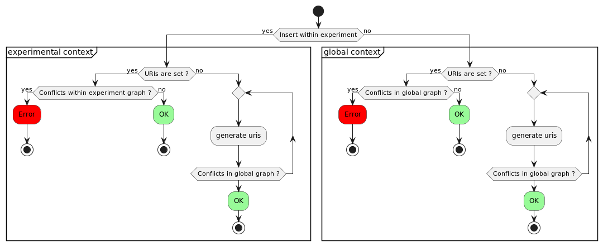

# Specifications : [Scientific object] graph management and uri generation

**Document history (please add a line when you edit the document)**

| Date       | Editor(s)             | OpenSILEX version       | Comment                                                         |
|------------|-----------------------|-------------------------|-----------------------------------------------------------------|
| 13/09/2022 | renaud.colin@inrae.fr | 1.0.0-rc+4.1            | Document creation                                               |
| 10/12/2025 | yvan.roux@inrae.fr    | 1.4.9 Explosive Emerald | refactoring document to follow new template and file management |

## Table of contents

<!-- TOC -->
* [Specifications : [Scientific object] graph management and uri generation](#specifications--scientific-object-graph-management-and-uri-generation)
  * [Table of contents](#table-of-contents)
  * [functional requirements](#functional-requirements)
  * [Business logic](#business-logic)
    * [Experimental context (Insertion within an experiment)](#experimental-context-insertion-within-an-experiment)
    * [Global context  (Insertion outside any experiment)](#global-context-insertion-outside-any-experiment)
<!-- TOC -->

## functional requirements

Scientific object can be handled in two context :
- **Experimental context** : the object is attached into one or multiple experiment and the object properties are stored
  into each corresponding experiment RDF graph. These relations can change from an experiment to another experiment.
- **Global context** : the global scientific object RDF graph (`/set/scientific-objects`) store each scientific object global properties (uri, type and name).
  These relations are stored when creating an object into experiment (name and type are copied into global graph), or when directly creating
  a scientific object into the global graph.

## Business logic

The UML activity diagram just below describe the process of URI handling in experimental/global context



### Experimental context (Insertion within an experiment)

- **If URI are set** 
  - check that OS are unique from experiment graph
  - no checking of uniqueness inside global OS graph, indeed in this case, 
  we consider that OS are just declared to be used inside the experiment graph
- **If URI are not set** : 
  - Generate URI while there are unique according any declared OS.
  - Here we check the global graph, in order to ensure that an OS without URI, created inside an experiment, 
  can't have the same URI as any OS declared into another experiment or globally.
  - In the first case, it's ensure that two different OS from two different XP can't share the same URI
  - In the last case, user must reuse existing URI in order to indicate that the same OS is reused inside 
  other experiment
  
**Examples :** 

Considering two experiment `test:id/experiment/xp1` and `test:id/experiment/xp2`

```yaml
test:id/experiment/xp1:
    test:id/scientific_object/os1

test:id/experiment/xp2:

test:set/scientific-objects:
    test:id/scientific_object/os1
```

Considering the following insertions : 
- os with name `os1` inside `test:id/experiment/xp2` experiment (object creation with URI generation)
- os with name `os2` inside `test:id/experiment/xp2` experiment (object creation with URI generation)
- os with URI `test:id/scientific_object/os1` inside `test:id/experiment/xp2` experiment (object reuse)
- 
These insertions (according insert order) will result to :

```yaml
test:id/experiment/xp1:
    test:id/scientific_object/os1

test:id/experiment/xp2:
    test:id/scientific_object/os1
    test:id/scientific_object/os1/1
    test:id/scientific_object/os2

test:set/scientific-objects:
    test:id/scientific_object/os1
    test:id/scientific_object/os1/1
    test:id/scientific_object/os2
```

The following insertion will result to error 
- os with URI `test:id/scientific_object/os1` inside `test:id/experiment/xp1` experiment (this URI already exist into experiment)

**Name** : OS name must be unique for an experiment, else it's an error.

### Global context  (Insertion outside any experiment)

- **If URI are set**
  - Check that OS URIs are unique inside global graph, else it's a duplicate error
- **If URI are not set** :
  - Generate URI while there are unique according any declared OS.

**Examples :**

Considering the following global scientific object graph

```yaml
test:set/scientific-objects:
  test:id/scientific_object/os1
```

Considering the following insertions :
- os with name `os1` inside `test:set/scientific-objects` (object creation with URI generation)
- os with name `os2` inside `test:set/scientific-objects` (object creation with URI generation)

These insertions (according insert order) will result to : 

```yaml
test:set/scientific-objects:
  test:id/scientific_object/os1
  test:id/scientific_object/os1/1
  test:id/scientific_object/os2
```

The following insertion will result to error
- os with URI `test:id/scientific_object/os1` inside `test:set/scientific-objects` (this URI already exist into the global graph)

**Name** : OS name is not unique inside global graph.
- Two OS with same name which are inserted within two experiment, can have the same name into the global OS graph
- Two OS inserted into the global graph, can have the same name

