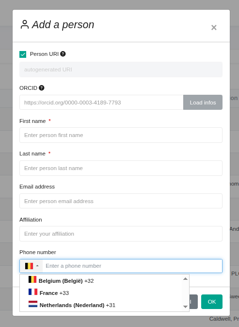

# Phone number countries

### List of available countries

The phone number field of the person form only proposes a restricted list of countries.
This list is defined in the `front` section of the configuration file :

```yaml
front:
    phoneCountryList:
        - FR
```

If none is specified, the list defaults to `FR`, so only French phone numbers can be entered.

Each entry is an [ISO 3166-1 alpha-2](https://en.wikipedia.org/wiki/ISO_3166-1_alpha-2) country code.
Only the listed countries appear in the country selector

### Default country

The first country of the list is the country selected by default when the form is opened.

### Example
To allow French, Belgian and Dutch numbers, with Belgium preselected :

```yaml
front:
    phoneCountryList:
        - BE
        - FR
        - NL
```
With this result :

