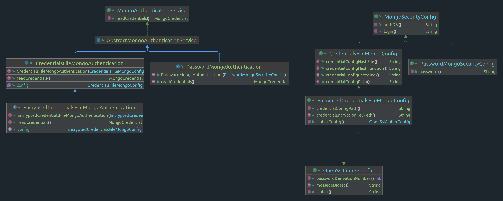

- **Description** : MongoDB Authentication handling inside OpenSILEX
- **Date** : 16/05/2023
- **Author** : COLIN Renaud (MISTEA)
- **Tags** :  [#security #mongodb #authentication]
- 
<!-- TOC -->
* [Description](#description)
  * [Requirements](#requirements)
    * [Actions](#actions)
    * [Collections](#collections)
  * [Conception](#conception)
* [Documentation](#documentation)
  * [No password](#no-password)
  * [Plain password (`PasswordMongoAuthentication`)](#plain-password--passwordmongoauthentication-)
  * [Credentials file (`CredentialsMongoAuthentication`)](#credentials-file--credentialsmongoauthentication-)
    * [Generate credentials](#generate-credentials)
  * [Encrypted credentials file (`EncryptedCredentialsMongoAuthentication`)](#encrypted-credentials-file--encryptedcredentialsmongoauthentication-)
    * [Generate an encryption key](#generate-an-encryption-key)
    * [Encrypt credentials file (with OpenSSL)](#encrypt-credentials-file--with-openssl-)
    * [Advanced configuration](#advanced-configuration)
  * [Commons errors](#commons-errors)
    * [Mongo credentials file](#mongo-credentials-file)
    * [Mongo credentials key file](#mongo-credentials-key-file)
* [Links](#links)
* [TODO](#todo)
  * [Rely on a secret management service and key encryption key (Hashicorp Vault)](#rely-on-a-secret-management-service-and-key-encryption-key--hashicorp-vault-)
  * [Use certificates based for authentication (X509)](#use-certificates-based-for-authentication--x509-)
<!-- TOC -->

# Description

OpenSILEX allow administrators to connect to a MongoDB server with authentication mechanism.

## Requirements

If access control is enabled, then the MongoDB database administrator must grant to the OpenSILEX user, a role 
which allow to perform a specific [actions](https://www.mongodb.com/docs/manual/reference/privilege-actions/) set on a specific collection set.

### Actions

The following actions are required :

- `update`
- `insert`
- `remove`
- `find`
- `createCollection`
- `createIndex`

### Collections

These actions be available for the following collection set :
- `data`
- `provenance`
- `file`
- `fs.files`
- `move`
- `geospatial`
- `germplasmAttribute`
- `deviceAttribute`
- `metrics`
- `history`

## Conception

The following diagram describes which interface and implementation are involved in authentication.



**Core interfaces :**
- The `MongoAuthenticationService` interface define how to build a `MongoCredential` (object from Java Mongo driver) which
is passed to the MongoClient
- The `MongoSecurityConfig` config interface define which settings are needed for authentication
  - By default, only the authentication database is required
  - The default value is the `admin` database
  - See [this link](https://www.mongodb.com/docs/manual/core/security-users/#std-label-user-authentication-database) for more information about the MongoDB authentification database
  
**Implementations**
- The `PasswordMongoAuthentication` implementation which use plain login/password inside OpenSILEX config file
  -   The associated `PasswordMongoSecurityConfig` define which password/login to use
  
- The `CredentialsFileMongoAuthentication` implementation which use plain password stored inside a separated credential files
    - The associated `CredentialsFileMongoConfig` define where this credentials file is located
  
- The `EncryptedCredentialsFileMongoAuthentication` implementation which use encrypted plain password stored inside a separated credential files
  - The associated `CredentialsFileMongoConfig` define where this credentials file is located, and where the credentials' encryption/decryption key is located (symmetric encryption)

The authentication is defined during the MongoClient initializing,
see `MongoDBService.buildMongoDBClient(MongoDBConfig cfg)` for more details

# Documentation

**Note**
- Inside the following sections, only the configuration parts relative to MongoDB is described

## No password

If you don't want to define password just let your OpenSILEX config as following

```yaml
big-data:
    mongodb:
        config:
            host: localhost
            port: 8668
            database: opensilex
 ```       

**Note**
- Of course, this configuration is NOT recommended in production


OpenSILEX supports password authentication. This authentication rely on <a href="https://www.mongodb.com/docs/drivers/java/sync/v4.3/fundamentals/auth/#std-label-scram-sha-256-auth-mechanism">SCRAM-SHA256</a> authentication mechanism

## Plain password (`PasswordMongoAuthentication`)

This method rely on a password and login defined inside your configuration file.

```yaml
big-data:
    mongodb:
        config:
            host: localhost
            port: 8668
            database: opensilex
            authentication:
                implementation: org.opensilex.nosql.mongodb.auth.password.PasswordMongoAuthentication
                config:
                    authDb: admin # optional authentication database (admin by default)
                    login: opensilex
                    password: @O2G[YCZic-mLI.@I"L\;7EiZnvI@0Yo
```

## Credentials file (`CredentialsMongoAuthentication`)

This method rely on a credentials file which contains MongoDB password inside a separate file from the OpenSILEX config.
Here you can see an example of credentials file content : 

```yaml
@O2G[YCZic-mLI.@I"L\;7EiZnvI@0Yo
```

Then you just have to update your OpenSILEX config as follows : 

```yaml
big-data:
    mongodb:
        config:
            host: localhost
            port: 8668
            database: opensilex
            authentication:
                implementation: org.opensilex.nosql.mongodb.auth.password.CredentialsFileMongoAuthentication
                config:
                    login: opensilex
                    credentialConfigPath: mongo_credentials
                    authDb: admin # optional authentication database (admin by default)
```

Notes : 
- Considering a user `opensilex`, which is the user which run the OpenSILEX application
   - The credentials file must only be readable by `opensilex`. The **chmod** mask must be **400**
   - The credentials file belongs to `opensilex`. The **chown** file proprietary must be `opensilex`.
   - OpenSILEX performs these verification before loading the credentials file and throw an error if these conditions are
not validated (see **commons-errors** for more details)

### Generate credentials

The command just below, generate a 128 character-long strong password inside a file.

```shell
printf "%s" $(pwgen -s 128 1) > mongo_credentials
```


**Notes** :
- The `printf` command is used in order to remove the newline character generated by the pwgen command.
- The package [pwgen](https://linux.die.net/man/1/pwgen) is required in order to use the `pwgen` command. 
- This package is used to generate secure password. 


Then you must execute the following commands to update permissions.

```bash
chmod 400 mongo_credentials;
chown opensilex_application_user mongo_credentials;
```

## Encrypted credentials file (`EncryptedCredentialsMongoAuthentication`)

This authentication method rely on an encrypted credentials file.
If so, even if intercepted, the credentials file content is not readable in plaintext.

```yaml
big-data:
    mongodb:
        config:
            host: localhost
            port: 8668
            database: opensilex
            authentication:
                implementation: org.opensilex.nosql.mongodb.auth.password.EncryptedCredentialsFileMongoAuthentication
                config:
                    authDb: admin # optional authentication database (admin by default)
                    login: opensilex
                    credentialConfigPath:  mongo_credentials
                    credentialEncryptionKeyPath:  mongo_credentials_key_file
```

This method rely on a encrypted credentials file which is decrypted with OpenSSL with a symmetric key file (called **DEK** : Data Encryption Key).
The following linux-package are required : 

- `openssl` : Cryptographic tools library
- `secure-delete` : Package which include commands for secure data deletion. 

### Generate an encryption key  

First, you need to generate a strong password/key file. 
This key file will be used for credentials file encryption/decryption.

In order to restrict the read permission of the generated credentials key we will :
- Give ownership of the credentials key to the user which run the OpenSILEX application
- Limit the permissions to read access for this user

Run the followings commands : 

```bash
printf "%s" $(pwgen -s 128 1) > mongo_credentials

openssl rand -rand /dev/urandom 4096 > mongo_credentials_key_file;
chmod 400 mongo_credentials_key_file;
chown opensilex_application_user mongo_credentials_key_file;
```


### Encrypt credentials file (with OpenSSL)

Now use openssl command in order to encrypt your credentials file

```bash
openssl enc -aes-256-cbc -md sha512-256 -pass file:mongo_credentials_key_file -salt -pbkdf2 -iter 1000000 -in  mongo_credentials -out mongo_credentials_encrypted
chmod 400 mongo_credentials_encrypted;
chown opensilex_application_user mongo_credentials_encrypted;
srm mongo_credentials;
```

> **Encryption options**

Use `openssl enc` for encryption, the options are the following : 

- `-aes-256-cbc` : use AES-256-CBC encryption algorithm
- `-salt` : use Salt in order to prevent dictionary-bases brute force attacks
- `-pbkdf2 -iter 1000000` : Use key derivation algorithm with 1000000 iterations
- `-pass file:opensilex_config_key` : use the generated key as passphrase for encryption
- `-md sha512-256` : use sha512-256 algorithm for hash passphrase hash

**Documentation** :
- https://blastoise.hashnode.dev/aes-encryption-in-linux
- https://www.openssl.org/docs/manmaster/man1/openssl-enc.html
- Use `openssl list --digest-commands` to list message digest list
- Use `openssl enc -list` to list encryption algorithm list

> Decrypt

The decryption command is the following. It should not be executed manually except for debugging/testing purposes.
```bash
openssl enc -d -aes-256-cbc -md sha512-256 -pass file:mongo_credentials_key_file -salt -pbkdf2 -iter 1000000 -in  mongo_credentials_encrypted -out mongo_credentials_decrypted
```

- Use `openssl -d` for decryption
- This command will be performed by OpenSILEX by using a [Process](https://docs.oracle.com/javase/8/docs/api/java/lang/Process.html) in order to decrypt the file
  with the secret key and redirect standard output (decrypted credentials).

## Advanced configuration

### Encryption/decryption options

You can configure the cipher used for encryption. You must change it in :

- The openssl encryption command by using the other cipher. 
- Use `openssl enc -list` to list encryption algorithm list available with OpenSSL.

You must also update your OpenSILEX configuration by specifying advanced settings for decryption.

```yaml
big-data:
    mongodb:
        config:
            host: localhost
            port: 8668
            database: opensilex
            authentication:
                implementation: org.opensilex.nosql.mongodb.auth.password.EncryptedCredentialsFileMongoAuthentication
                config:
                    authDb: admin # optional authentication database (admin by default)
                    login: opensilex
                    credentialConfigPath:  mongo_credentials
                    credentialEncryptionKeyPath:  mongo_credentials_key_file
                    cipherConfig:
                        cipher: -aes-256-cbc
                        messageDigest: sha512-256
                        passwordDerivationNumber: 1000000
```

The cipherConfig part contains several settings : 

- `cipher` : 
  - The cipher algorithm used for encryption/decryption. 
  - Default value : **-aes-256-cbc**
  - The cipher name must be present in the list returned by `openssl enc -list` commands.
- `messageDigest` : 
  - The hash/message digest function used for password hashing
  - Default value : **sha512-256**
  - The function name must be present in the list returned by `openssl list --digest-commands` commands.
- `passwordDerivationNumber` :
  - The number of derivation to use when using pbkdf2 key derivation
  - Default value : **1000000**
  - If <= 0, then OpenSIELX consider that no password derivation was used.
  
For these 3 settings, the value must be the same for encryption (via OpenSSL command) and decryption (via OpenSILEX)

### Credentials hash verification

OpenSILEX can check that the decrypted credentials read from a file, are ok regarding a checksum file.
These credentials checking can be done with the following authentication services : 

- `EncryptedCredentialsFileMongoAuthentication`
- `CredentialsFileMongoAuthentication`

You can enable this functionality with the following configuration : 

```yaml
big-data:
    mongodb:
        config:
            authentication:
                implementation: org.opensilex.nosql.mongodb.auth.password.EncryptedCredentialsFileMongoAuthentication
                config:
                    credentialConfigPath:  mongo_credentials
                    credentialEncryptionKeyPath:  mongo_credentials_key_file
                    credentialConfigHashFile: mongo_credentials_hash
                    credentialConfigHashFunction: SHA-512/256
```

The settings are :
`credentialConfigHashFile` : a File which contains the hash of the file located in `credentialConfigPath`
`credentialConfigHashFunction` : 
  - The hash function used for the file hashing.  
  - The value used here must be the name of a valid message digest algorithm.
  - Some values accepted are : 
    - **SHA-512/256** (Java) -> **sha512-256** (OpenSSL)
    - **SHA-512** (Java) -> **sha512** (OpenSSL)
    - **SHA3** (Java) -> **sha3-512** (OpenSSL)

The `credentialConfigHashFile` of a credentials file can be generated with the following command : 

```shell
openssl dgst -<hash_function> -r mongo_credentials | cut -d ' ' -f 1 > mongo_credentials_hash
```
Example : 

```shell
printf "%s" $(openssl dgst -sha512-256 -r mongo_credentials | cut -d ' ' -f 1) > mongo_credentials_hash
```

## Commons errors

### Mongo credentials file 

> **Mongo credentials file ownership**

- **Error message** : `[Mongo credentials file] The file path should be owned by the OpenSILEX application system user : <OPENSILEX_USER>. File owner is <FILE_OWNER>`
- **Reason** : Mongo credentials file is not owned by the OpenSILEX application user
- **Fix** : 
    - Execute the following Linux command : `chown opensilex_application_user mongo_credentials_file`

<hr>

> **Mongo credentials file permissions**

- **Error message** : `[Mongo credentials file] Permissions for file %s are too open: <>`
- **Reason** : Mongo credentials file permissions must be limited to the owner
- **Fix** :
  - Execute the following Linux command : `chmod 600 mongo_credentials_file`
  
<hr>

### Mongo credentials key file

> **Mongo credentials key file ownership**

- **Error message** : `[Mongo key credentials file] The file path should be owned by the OpenSILEX application system user : <OPENSILEX_USER>. File owner is <FILE_OWNER>`
- **Reason** : Mongo credentials key file is not owned by the OpenSILEX application user
- **Fix** :
  - Execute the following Linux command : `chown opensilex_application_user mongo_credentials_key_file`

<hr>

> **Mongo credentials key file permissions**

- **Error message** : `[Mongo credentials key file] Permissions for file %s are too open: <>`
- **Reason** : Mongo credentials key file is accessible to group or other users
- **Fix** :
  - Execute the following Linux command : `chown 600 mongo_credentials_key_file`

# Links

- [Java sensitive data lifetime](https://wiki.sei.cmu.edu/confluence/display/java/MSC59-J.+Limit+the+lifetime+of+sensitive+data)
- https://devslash.net/why-you-dont-store-secrets-in-strings-in-java/
- [Cryptographic_Storage_Cheat_Sheet](https://cheatsheetseries.owasp.org/cheatsheets/Cryptographic_Storage_Cheat_Sheet.html)
- [Password_Storage_Cheat_Sheet](https://cheatsheetseries.owasp.org/cheatsheets/Password_Storage_Cheat_Sheet.html)
- [Key_Management_Cheat_Sheet](https://cheatsheetseries.owasp.org/cheatsheets/Key_Management_Cheat_Sheet.html)
- [Secrets_Management_Cheat_Sheet](https://cheatsheetseries.owasp.org/cheatsheets/Secrets_Management_Cheat_Sheet.html)
- [Envelope encryption](https://cloud.google.com/kms/docs/envelope-encryption?hl=fr)
- [Encryption key management guide](https://info.townsendsecurity.com/definitive-guide-to-encryption-key-management-fundamentals)
- [practical-cryptography-for-developers-book](https://cryptobook.nakov.com/)

# TODO

## Rely on a secret management service and key encryption key (Hashicorp Vault)

In order to improve security, a 2-nd layer of encryption can be done by using a **KEK** (key encryption key) which will be
used to encrypt the DEK.
This mechanism need to use a key management service which can be queried by the application/API in order
to ask for DEK decryption.

## Use certificates based for authentication (X509)

Provide advanced authentication methods like X509 certificates or LDAP which are supported by MongoDB
