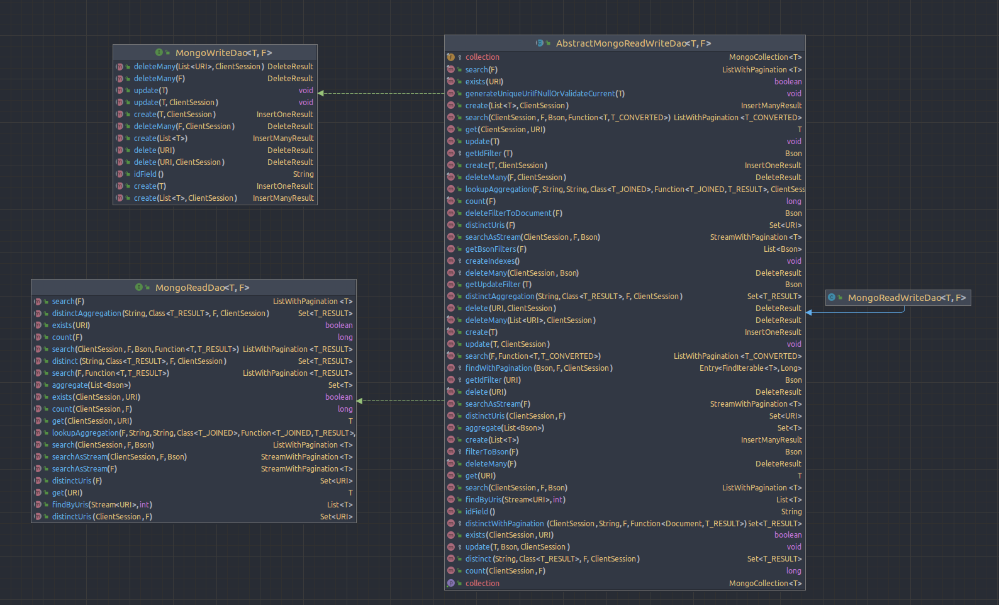
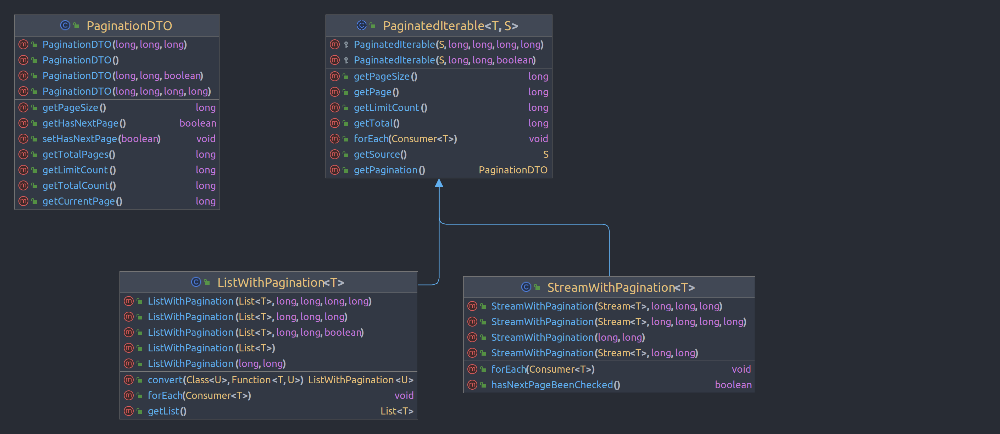
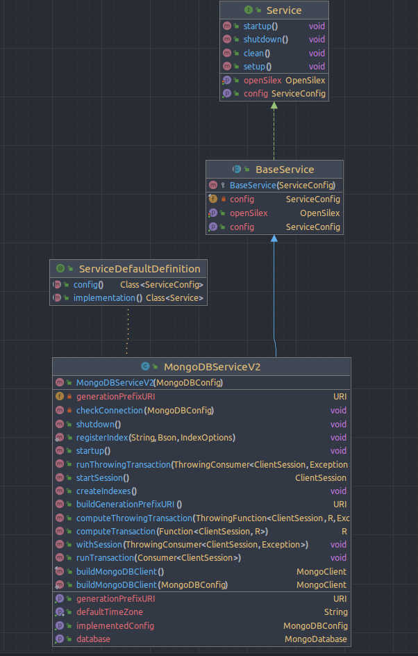

# Specifications : MongoDB DAOs and Service

# Table of contents

<!-- TOC -->
* [Specifications : MongoDB DAOs and Service](#specifications--mongodb-daos-and-service)
* [Table of contents](#table-of-contents)
* [Definitions](#definitions)
* [Analysis](#analysis)
  * [Non-functional requirements](#non-functional-requirements)
    * [Performance and reliability](#performance-and-reliability)
      * [SLA (service-level-agreement)](#sla-service-level-agreement)
* [Solution](#solution)
  * [MongoReadWriteDao](#mongoreadwritedao)
    * [Pagination handling](#pagination-handling)
      * [Count limiting](#count-limiting)
  * [MongoDBServiceV2](#mongodbservicev2)
    * [Indexes generation](#indexes-generation)
<!-- TOC -->

# Definitions

- **OLTP** : Online Transactional Processing
- **OLAP** : Online Analytical processing
- **P99 Latency** : The maximum latency observed for 99% of request
  - Ex a P99 latency of 10ms imply that 99% of the request take less thant 10ms

# Analysis

OpenSILEX relies on [MongoDB](https://www.mongodb.com/fr-fr) for the storage and the interrogation of several kinds
of data models.
The use of MongoDB is guided by the following reasons : 
- A **semi-structured** data-model which provides flexibility for developers for updating data-models and allow
to store several data-models inside the same database
- A **good performance** for OLTP and OLAP workload
- MongoDB provide **horizontal scalability** with **sharding** and **replication**
- MongoDB offers all the common functionality of a DBMS (**authentification**, **transaction**, **performance-tuning**, **database management**)
- A strong **community** and a **stable team**


## Non-functional requirements

### Performance and reliability

#### SLA (service-level-agreement)

- The table below describes the expected performance for common read and write operations 
- This only includes DAOs operations (it doesn't include business logic or the whole request performed inside a single API method)
- The operation doesn't expect multi-threading, this means that latency can be reduced if multi-threading is available
- Of course, it could be greatly optimized, but it's the minimal expectations for an acceptable user experience

| **Operation**                                   | **Size** | **P99 Latency** | **Notes** |
|-------------------------------------------------|----------|-----------------|-----------|
| Insert an unique element                        | 1        | 100 ms          |           |
| Get by unique identifier                        | 1        | 100 ms          |           |
| Update an unique element                        | 1        | 100 ms          |           |
| Delete an unique element                        | 1        | 100 ms          |           |
| Insert an unique element                        | 1        | 100 ms          |           |
| Get by unique identifier                        | 1        | 100 ms          |           |
| Update an unique element                        | 1        | 100 ms          |           |
| Delete an unique element                        | 1        | 100 ms          |           |
| Search 1000 element (with index-covered query)  | 1000     | 100 ms          |           |
| Search 10000 element (with index-covered query) | 10000    | 5 s             |           |
| Insert 1000 element                             | 1000     | 1 s             |           |
| Insert 10000 element                            | 1000     | 5 s             |           |
| Delete 1000  element (with index-covered query) | 1000     | 1 s             |           |

- This SLA should be respected for any small dataset (<10M documents on a MongoDB single server without replication)
- Of course, they are variant regarding the nature of the dataset, the size of the document and the underlying hardware
but for these basic operations on very-small data the P99 latency should keep this magnitude

# Solution

## MongoReadWriteDao

The class diagram below describes the methods available for any MongoDB based DAO



> **MongoReadWriteDao**

The Dao is parametrized with two types `T, F` : 
- `T` : the type of `MongoModel` to handle with the Dao
- `F` : The type of `MongoSearchFilter` to handle. This object contains all search filters corresponding to a `MongoModel`

The `MongoReadWriteDao` implementation provides methods for the read and write operations for a given model and a given search filter.
When implementing a new Dao for some class, this dao must extend the `MongoReadWriteDao` class and specify the model class and the corresponding 
filter.

See [MongoDaoTutorial.md](MongoDaoTutorial.md) for example of use of Dao methods

## Pagination handling



The `MongoReadWriteDao` handle pagination when using `searchWithPagination()` and `searchAsStreamWithPagination()`.
These method return a `PaginatedIterable` object.

- This object has a nested object which can be iterated (a `List` for `ListWithPagination`, a `Stream` for `StreamWithPagination`).
- It also includes a `PaginationDTO` object which store the following information about pagination :
  - `total` : The total number of element counted for this search with a count query
  - `page` : The page number (passed to the `MongoSearchFilter` filter)
  - `pageSize` : The page size (passed to the `MongoSearchFilter` filter)
  - `totalPages` : The total number of pages available (total / pageSize)
  - `limitCount` : The maximum number of counted element
  - `hasNextPage`: Indicate if there exist a next page after the current page

### Count limiting

Performance issues can be encountered when the MongoDB server has to iterate over a large number of document (when using `countDocument()`)
To deal with this, several strategy are available

#### Limited Count

The maximum number of counted document can be limited by providing a `CountOptions` which include a custom limit to the MongoDB `countDocuments() `method.
To handle this, the `MongoReadDao` interface allow to specify a `CountOptions` for the following methods : 

> Count

```java
long count(ClientSession session, @NotNull F filter, CountOptions countOptions) throws MongoException;
```

> Search

For search methods, you just have to use `MongoSearchQuery.setCountOptions(CountOptions options)` method and to pass the `MongoSearchQuery` to the following methods : 

```java
<T_RESULT> @NotNull ListWithPagination<T_RESULT> searchWithPagination(MongoSearchQuery<T, F, T_RESULT> query) throws MongoException;
<T_RESULT> @NotNull StreamWithPagination<T_RESULT> searchAsStreamWithPagination(MongoSearchQuery<T, F, T_RESULT> query) throws MongoException;
```

#### No count

You can also disable the computing of counted element, and just check if a next page exist.
To do this you just have to use the following setter method with `PAGINATED_SEARCH_STRATEGY.HAS_NEXT_PAGE` : 

```java
MongoSearchQuery.setCountStrategy(PAGINATED_SEARCH_STRATEGY.HAS_NEXT_PAGE);
```

- By doing this, you indicate to the search method to only check if a next page exist during the request

### Default behavior and how to override them

#### Count

- `MongoReadDao.count(F filter)` : Perform a full count of document that match the filter
- `MongoReadDao.count(F filter, CountOptions options)` : Perform a full count of document that match the filter and use the given `CountOptions`

> Redefine custom count options

- Just pass a custom `CountOptions` inside the `count(session, filter, countOptions)` method
- Override the `MongoReadWriteDao.getDefaultCountOptions(F)` method

#### Search

If no `CountOptions` is provided during the call to `searchWithPagination(MongoSearchQuery)` and `searchAsStreamWithPagination(MongoSearchQuery)`
then, a default `CountOptions` is used (returned by `MongoReadWriteDao.getDefaultSearchCountOptions(F)` method).

The behavior is the following :

- If no `pageSize` was provided (`pageSize` == 0), then a default count limit (from MongoDB config `maxCountLimit` setting) is applied with `CountOptions.limit(limit)`
- If the `pageSize` is inferior to the MongoDB config count limit : set a limit equals to k `pageSize`, with k equals to MongoDB config `maxPageCountLimit` setting
  - This allows to provide a count sufficient for the desired page number 
- Else just use the `pageSize` as count limit 
  - This is useful in case of explicit call with a large page, e.g: for internal queries

> Redefine custom count options

If this semantic don't match with your requirement you can : 
- Just pass a custom `CountOptions` inside the `MongoSearchQuery` for `searchWithPagination(MongoSearchQuery)` and `searchAsStreamWithPagination(MongoSearchQuery)`
- Override the `MongoReadWriteDao.getDefaultSearchCountOptions(F)` method

## MongoDBServiceV2



The `MongoDBServiceV2` classes provides method for the following features : 
- `MongoClient` initialization ( `buildMongoDBClient()` ). This client is initialized during service initialization (`startup()`)
- Run operation with transaction : 
  - `runTransaction()` : run an operation with transaction handling
  - `computeTransaction()` : run an operation with transaction handling and return result
  - `runThrowingTransaction()` : run a potentially throwing operation with transaction handling
  - `computeThrowingTransaction()` : run a potentially throwing operation with transaction handling and return result
- Creation of indexes in database (if they don't already exist)
  - `MongoDBService.registerIndex(collectionName, index, indexOptions)` : register an index to create
  - `createIndexes()` : Create (if not-exists) all indexes registered previously with `MongoDBService.registerIndex`

### Indexes generation

In any Dao class, you must use the static method `MongoDBService.registerIndex(collectionName, index, indexOptions)` in order
to register a new index which must be created during OpenSILEX startup.
This method call must be performed with static context

> Example

```java
import org.opensilex.nosql.mongodb.dao.MongoReadWriteDao;

public class DataDao extends MongoReadWriteDao<DataModel,DataSearchFilter> {
    
    // Creation of two indexes
    // One unique index on uri, and another index on target
    static {
      MongoDBServiceV2.registerIndex("data",Indexes.ascending("uri"), new IndexOptions().unique(true));
      MongoDBServiceV2.registerIndex("data",Indexes.ascending("target"), null);
    }
}
```