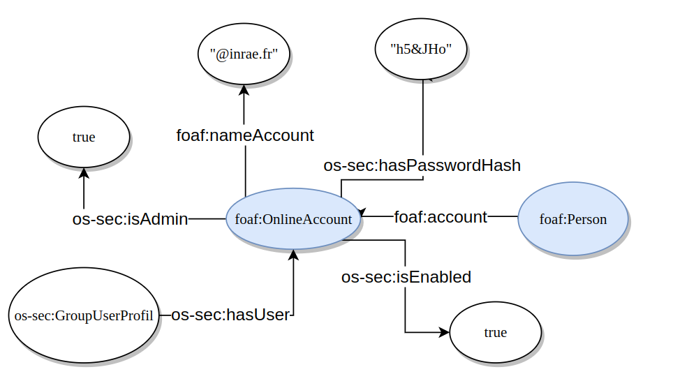

******
* Author : yvan.roux@inrae.fr
* created : 2023-05-30
* last update : 2023-05-30
******

## needs

Account are used to manage personal credentials and store login and password for the authentication.

> Warning : this document is about account service and representation of account in the database
> 
> this document don't address this topics
> - credentials management
> - authentication system

## deletion of an account
Because deletion is not protected and can cause loss of data, it's actually impossible to delete an account with the web service.

**for developers only** : here a SPARQL request that allow you to delete every triple (incoming/outgoging) about an account.
**Warning** Check that the URI is correct and that you really want to suppress it from the database, data will be lost after execution of this request.
```
PREFIX rdf: <http://www.w3.org/1999/02/22-rdf-syntax-ns#>
PREFIX foaf: <http://xmlns.com/foaf/0.1/>
delete {?s ?p_in ?uri. ?uri ?p_out ?o} where {
  { ?s ?p_in ?uri }
  UNION
  { ?uri ?p_out ?o}
  ?uri rdf:type foaf:OnlineAccount
    VALUES ?uri { [URI_TO_DElETE] }
}
```

## technical specifications

### model of a person


### specific behaviors
- `isEnabled` allow the admin to deactivate an account without deletion. Deleting an Account means probably loss the traceability of creations and updates of data.
- Accounts that are admins can't be deleted nor disabled.
- Accounts that are admins has automatically unrestricted credentials.
- An account is not necessarily linked to a Person.
- An account can be linked to a person only if the person does not already have an account.
- the person linked to an account can't be changed nor removed

### credentials

Credentials for POST and PUT access to the account API, and for accessing the account page, are available and already used in the Vue client

see [store.ts](../../../../../opensilex-front/front/src/models/Store.ts) and [credentials.yml](../../../../../opensilex-security/src/main/resources/credentials/credentials.yml) to find them

### tests
Several integrations tests are located in `AccountAPITest.java` to ensure both success and error POST, PUT and GET scenarios


## futurs perspectives

### delete control
Accounts are used as metadata to enrich primary data with traceability of creation and updates.
Deleting an account means deleting metadata for all objects connected to this account.

Idea of solution : authorize deletion only for accounts that are not connected with any objects yet.