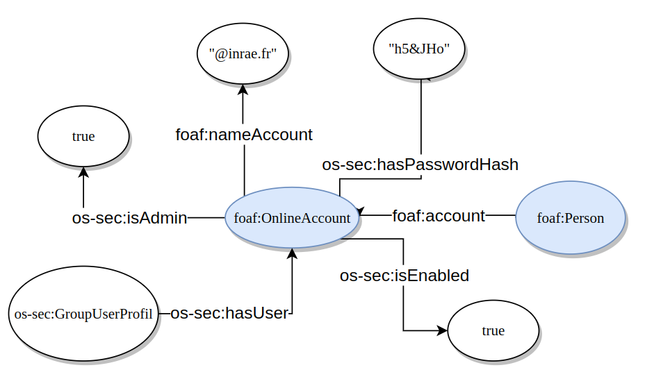

******
* Author : yvan.roux@inrae.fr
* created : 2023-05-30
* last update : 2023-05-30
******

## Needs

Account are used to manage personal credentials and store login and password for the authentication.

> Warning : this document is about account service and representation of account in the database
> 
> this document don't address this topics
> - credentials management
> - authentication system

## technical specifications

### model of a person

### specific behaviors
- isEnabled allow the admin to deactivate an account without deletion. Deleting an Account means probably loss the traceability of creations and updates of data.
- Account that are admins can't be deleted nor disabled.
- Account that are admins has automatically unrestricted credentials.
- An account is not necessarily linked to a Person.
- An account can be linked to a person only if the person does not already have an account.

### tests
Several integrations tests in `AccountAPI.java` to ensure both success and error POST scenarios