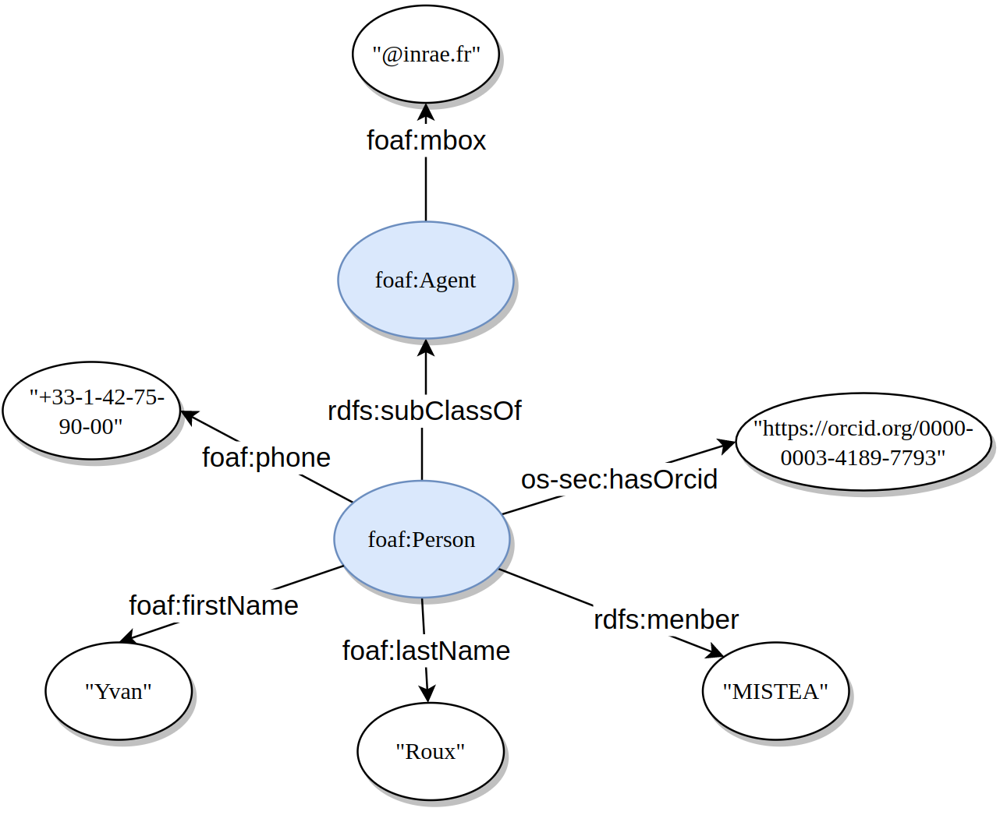

******
* Author : yvan.roux@inrae.fr
* created : 2023-05-30
* last update : 2023-05-30
******

## Needs

Persons are used to give contact information (name, email, phone, ...) on other objects.

example of use-cases :
- use-case #1: as a user, when I create a new project, I want to be able to easily find the operator and its contact information
- use-case #2: as an administrator, when I create an account for someone, I want to be able to easily identify the owner of the account

## technical specifications

### model of a person

#### specification of the model :
* ORCID is stored as a URI and should be unique (see [orcid website](https://orcid.org/) for more information)
* PhoneNumber is stored as a URI with the tel:scheme ex: tel:+33-1-42-75-90-00

### specifications of the service
- POST : name and first_name are required. If Orcid is given, it will be used as the URI of the person, even if URI is also given.
If both URI and Orcid are empty, URI will be auto-generated.
- DELETE : delete the person's data. Also delete the link between it and its account if it has one.
- PUT : update the person's data. This service can change, but not unset the account of the person. Orcid can't be updated.

### tests
Several integrations tests in `PersonAPITest.java` to ensure both success and error scenarios

## futurs perspectives

### delete control
Persons are used as metadata to enrich primary data with contact information.
Deleting a person means deleting metadata for all objects connected to this person.

Idea of solution : authorize deletion only for persons that are not connected with any objects yet.