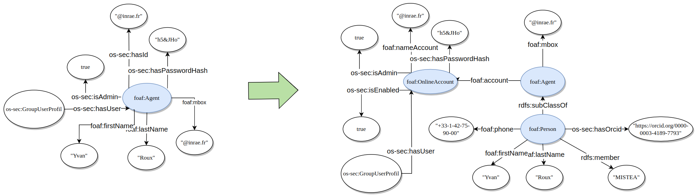

******
* Author : yvan.roux@inrae.fr
* created : 2023-05-30
* last update : 2023-05-30
******

## Needs

Manipulate [account](./account_API_service.md) and [person](./person_API_service.md) simultaneously for a better comprehension of users.

> Warning : the user concept is a representative concept only, there is no user objects in database or classes.
>
> A while ago, we were using user object for authentication, credentials and contact information.
After a rework, this concept were split between [account](./account_API_service.md) and [person](./person_API_service.md).

## technical specifications

### migration of model during the rework
see [account](./account_API_service.md) and [person](./person_API_service.md) documentation for further information.

### specifications of the service
- POST : create an account and a person with the same email and link them together. Only the URI is not required, it will be auto-generated if not given.
- PUT : update the account and the firstname/lastname of its holder if it has one.
- DELETE : delete the account and its holder if it has one.

### tests
Several integrations tests in `UserAPITest.java` to ensure both success and error scenarios

## futurs perspectives

### model evolution
Actually we can create an account and connect it, or not, to a person. But account can be created for persons or for more global Agents.
For exemple, we can create an account with special credentials for the authentication of a device or a script.

Warning, in the ontology, a foaf:person is a foaf:Agent