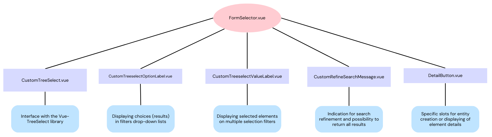

**History**

| Date | Author | Developer(s) | OpenSILEX version | Comment |
|----|----|----|----|----|
| 2024-04-25 | Sebastien Prado | Sebastien Prado | 1.3.0 | New components for selections by forms |

## Needs

The management of all the application's forms is done through a central component, `"SelectForm.vue"`. This component manages many types of forms in different cases (global forms / forms embedded in a modal window for exemple).

This component having been extended over time by several developers for new needs, it has become difficult to maintain, and its logic must be rethought.

## Solution

The first step is to extract a part of the logic, so that the `SelectForm` only handles the case of modal forms.
The management of global forms is entrusted to a new component structure revolving around `FormSelector.vue`.

Each child component is responsible for a single task, which should allow for better understanding, maintainability and error handling.

## Technical specifications

### Library

- **vue-treeselect** : vue-treeselect is a multi-select component with nested options.
We use this library for managing forms : [Link to library documentation](https://vue-treeselect.js.org/).

### Used props

- Details of some important `@props` sent to the library component from `customTreeSelect.vue` :   

`:async`
dynamically loading & changing the entire options list as the user types. By default, vue-treeselect will cache the result of each AJAX request so that the user waits less.

`:value`
Should be id or node object when :multiple="false", or an array of id or node object when :multiple="true". Its format depends on the valueFormat prop.
For most cases, just use v-model instead.

`valueFormat`
This is format of value prop. Note that, when set to "object", only id & label properties are required in each node object in value.
Acceptable values: "id" , "node" or "object"

`:default-options`
The default set of options to show before the user starts searching. Used for async search mode. When set to true, the results for search query as a empty string will be autoloaded.

`:load-options`
Used for dynamically loading options (root options, childrens options, async search).   

- Details of some important `@props` passed between `FormSelector` and `CustomTreeselect` :   

`:optionsLoadingMethod`
function that is used to load options when the action is "LOAD_ROOT_OPTIONS". This function is called to load the root options of the selection component.

`:options="options || internalOption"`
used to temporarily store loaded options. If there are no internal options defined, is an empty array by default

`:viewHandler`
Used to display or hide details of an entity

`:itemLoadingMethod`
allows to load elements from the response of a service call. 
For example to load user accounts, the prop will be linked to a function calling  "opensilex.SecurityService.getAccountsByURI()"

`:conversionMethod`
used to convert a Data Transfer Object (DTO) into an object that can be displayed in the selector component.
In our case, this function takes an object of type NamedResourceDTO as input and returns an object of type SelectableItem.   

### Child Components

- `CustomTreeselect.vue` :
  provides an encapsulation of the `vue-treeselect` library, it is responsible for displaying the item selector, provides custom options and handles the processing of selected values by asynchronous loading and conversion methods.   

- `CustomTreeselectOptionLabel.vue` :
  allows to return the different node labels as selectable options for the filter used.   

- `CustomTreeselectRefineSearchMessage.vue` : allows to asynchronously display the number of items on the displayed list and the total number of items from the response, each time the user modifies the search.
  Also provides a function to return all items in a drop-down list.   

- `CustomTreeselectValueLabel.vue` :  
  Allows to display in the input, for multiple choice filters, the selected elements and interact with them (remove one of the elements from the selection).   

- `DetailButton.vue` :
Generic component with conditional rendering allowing you to view the details of an entity and/or to return to a creation form when clicked. 
It is located against the filter with which it is associated.  

### Explanation according to a use case

More precise description of the technical process in the example of search and selection of values.

- Loading options:

By "options", the library means selectable search results.
When the customTreeselect.vue component is mounted and needs to load options, the `loadOptions()` method is called.
This defines the loading actions that must be done based on the `@Props()` passed.
If an options loading method is passed (`optionsLoadingMethod`), this is used to load options from an external source (a parent component). Once the options are loaded, they are stored in an `internalOption` variable.

- Asynchronous search:

When an async search is initiated in `customTreeselect.vue`, the `debounceSearch()` method is called.
When a certain time has elapsed since the user's last entry (300ms), this method then calls on the specific search method defined (exemple: `SearchProvenance` method of the associated service). This search method retrieves the query results and formats them, so they can be displayed. At the end of the formatting, the count displayed in the list and the total count of the results are transmitted using events.
Error handling and a wait loader are also integrated.

- Selection of an option: 

On selection, the `select()` method of `CustomTreeselect.vue` is called, it receives the selected value as a parameter and informs the parent component of the selection by an event. Furthermore, the `"selection"` array linked to `@PropSync("selected")` receives the id of the value, which is then used in the management of the selected values.

- Management of selected values:

The `@AsyncComputedProp()` decorator is used to define an asynchronous computed property called `selectedValues`. It is executed when the component is initially mounted and then each time the selected values or component options change. It returns a promise that resolves with the current selected values. This `selectedValues` method retrieves these values and, just like when loading options, formats them using the specified conversion method `conversionMethod()`. Once the selected values are formatted, the promise is resolved with these values, and they can be used or passed to the parent component.