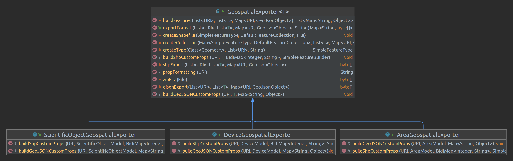

# [Map] Export shapefiles

| Date       |Author|Developer(s)| Version OpenSilex | Comment                                                                  |
|------------|------|------------|------------------|--------------------------------------------------------------------------|
| 05/07/2023 |Alexia Chiavarino|Alexia Chiavarino| 1.0.0-rc+7.2     | created spec                                                             |
| 13/12/2023 |Alexia Chiavarino|Alexia Chiavarino| 1.0.1            | upgrade - add export in geojson + export devices and areas with geotools |

## Table of contents
* [Needs](#needs)
* [Definitions](#definitions)
* [Solution](#solution)
* [Technical specifications](#technical-specifications)
  * [Frontend](#frontend)
  * [API](#api)
  * [Environment changes](#environment-changes)
* [Limitations and Improvements](#limitations-and-improvements)
  * [Limitations](#limitations)
  * [Improvements](#possible-improvements)

## Needs

The map makes easier to locate and select items (scientific objects, areas, devices) in particular for retrieve and analyze associated data on other specific tools (e.g. SIG).

- Use case #1 : As a user, I need to export a selection of items from the map in shapefiles.
- Use case #2 : As a user, I want to choose the items (scientific object, devices, areas) properties to be exported.
- Use case #3 : As a user, I need to export a selection of items from the map in geojson.

## Definitions

**Shapefile**:

Is a vector data storage format for archiving the location, shape and attributes of geographic features. It is stored as a set of associated files, usually added to a .zip file. The .zip file must contain at least 4 files, components of the shapefile :

 - .shp : stores geographic features. This is the shapefile itself.
 - .shx : stores indexes of ".shp" file records.
 - .dbf (DataBaseFile): stores attribute data (can be viewed in Excel).
 - .prj : stores the associated projection.

Shapefiles often contain large entities with a lot of associated data and were historically used in GIS office applications.

**GIS (geographic information system)**:

Is an information system designed to collect, store, process, analyze, manage and present all types of spatial and geographic data.

**CRS (coordinate reference system)**:

also known as projections.

The earth has an approximately spherical shape, which poses a problem when it comes to visualizing its surface on 2D.
A CRS is a mathematical model for locating any point on the earth's surface on a flat surface. Many different projection systems exist.

**GeoJson**:

is a simple geospatial dataset encoding format using the JSON standard.

     {  
        "type: "FeatureCollection"
        "features": [
          {
           "type": "Feature",
           "geometry": 
              {
                 "type": "Point",
                 "coordinates": [...]
              },
            "properties: {
              ...
            }
      }

## Solution

There are 2 buttons above the map :

- "Print the map" button : 

Opens a modal offering to save the map in 2 formats (2 buttons): pdf and png;
- "Export items" button: 

Opens a modal offering to export scientific objects, devices and areas in shapefile or GeoJSON format. For each type of items, we can select the properties to export. 

By default, 4 basic properties are exported - label, uri, rdf type and rdf type label - and 3 geometry types can be to exported : polygon, line and point. The selection of map items is exported. Without any selection, all items visible in the "panel menu" are exported.

A zip file is created. A file is created for each type of geometry because some GIS software cannot import shapefiles/geojson files with multiple geometries.  

Items are exported in the "World Geodetic System 1984" CRS (WGS 84 - EPSG:4326).

## Technical specifications

### Front-end
From the "Export items" modal, property selectors are available for each item type. By default, all properties are already selected. If one or more item type - scientific objects, devices or areas - aren't visible (and selected), its selector is disabled.
For improved performance, conversion to shapefiles or GeoJSON is managed in the back-end.

- clicking on the "shapefile" button, a zip file is downloaded in-browser, containing an "XModel_shp" file. It contains the shapefiles (composed of 4 files: .shp, .shx, .dbf and .prj) for each type of geometry of the items recorded.
- clicking on the "GeoJSON" button, a zip file is downloaded in-browser, containing simple GeoJSON files for each type of geometry.
### API

For each item type exported, an `exportGeospatial` service is called from their respective APIs (`ScientifObjectAPI`, `DeviceAPI` and `AreaAPI`).
In this service, data details are retrieved and converted into the chosen format using the abstract class `GeospatialExporter`. 

In this abstract class, the `exportFormat` method dispatch between two different data treatments, depending on the chosen format: shapefiles or GeoJSON.

- For shapefile, the GeoTools library is used and converts the selected items by the method`shpExport`:

1- Create feature types : Define features type (shapefile columns) according to the selected properties and geometry (polygon, line, point). GIS software limit the size of the column names (10 max), so property names have to be formatted.

2- Writing collections with the corresponding feature type. The abstract method `buildShpCustomProps` implemented in classes `ScientificObjectGeospatialExporter`, `DeviceGeospatialExporter`, `AreaGeospatialExporter` is used to build collections with specific properties of each type of items.

3- Create a new shapefile for each feature type and its corresponding collection saved in the same file.

4- Shapefiles are then zipped and returned.

- For GeoJSON, the selected items are converted in the method`gjsonExport` :

1- Build features : Writing features according to the selected properties. The abstract method `buildGeoJSONCustomProps` implemented in classes `ScientificObjectGeospatialExporter`, `DeviceGeospatialExporter`, `AreaGeospatialExporter` is used to build collections with specific properties of each type of items.

2- Writing feature collection for each feature type of geometry.

3- Return a zipped file.

### Environment changes

**Geotools (v29.2)**: Add tools to convert items coordinates and properties into shapefiles.
https://geotools.org/
https://docs.geotools.org/latest/javadocs/index.html

## Limitations and Improvements

### Limitations

The items export is limited to 10 000 objects because beyond this size, processing time exceeds 2 min and causes an error.

### Improvements

- Add a selector to choose variables for scientific objects to be exported.
- Add selectors to choose variables for devices to be exported
