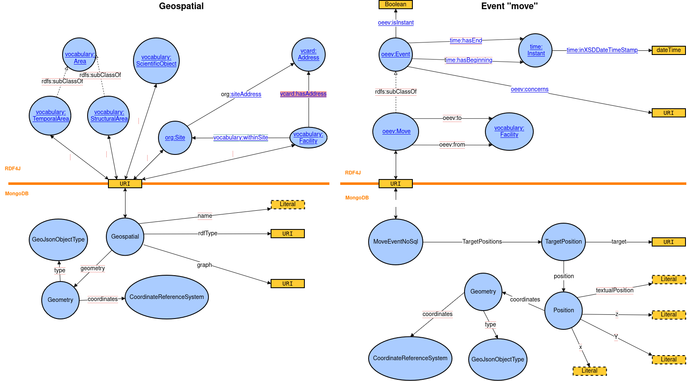
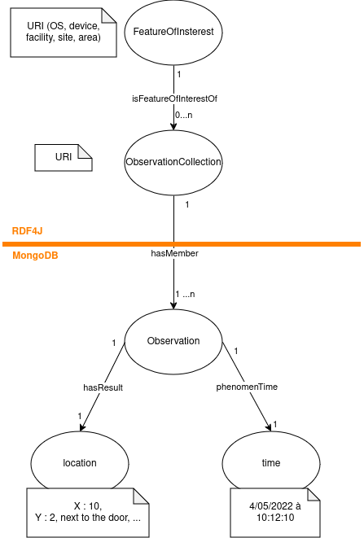
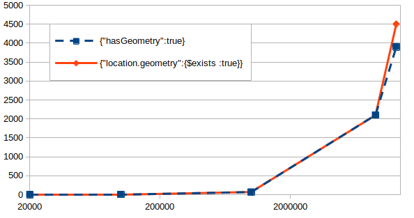
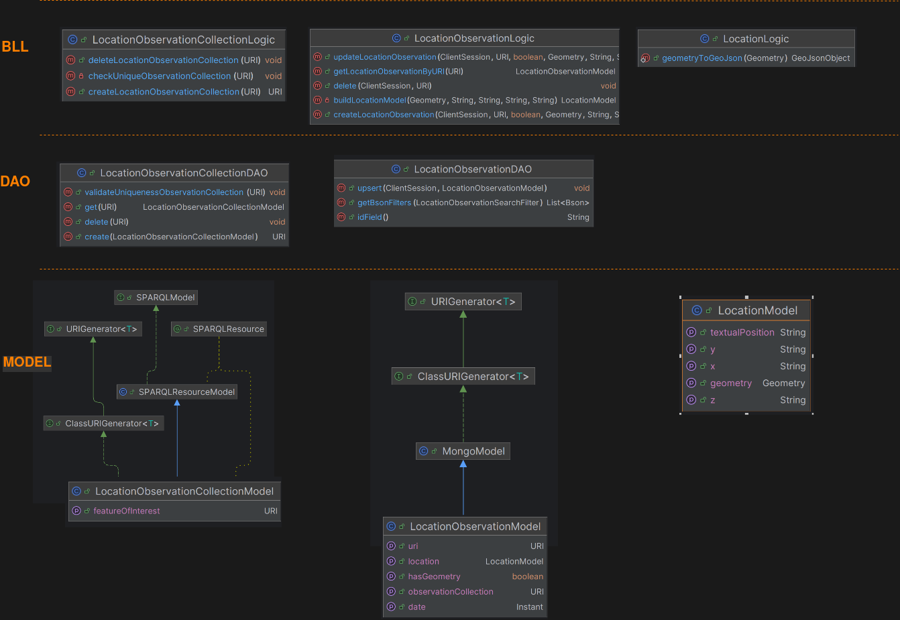

| Date       |Author|Developer(s)| Version OpenSilex | Comment                                                                |
|------------|------|------------|-------------------|------------------------------------------------------------------------|
| 7/08/2024  |Alexia Chiavarino|Alexia Chiavarino| 1.3.0      | created spec - global and site case                                    |
| 20/09/2024 |Alexia Chiavarino|Alexia Chiavarino| 1.3.0      | updated spec - add featureOfInterest field in Mongo + add Improvements |
| 04/10/2024 |Alexia Chiavarino|Alexia Chiavarino| 1.3.0      | updated spec - add facility case + definitions                         |

## Table of contents
* [Needs](#needs)
* [Definitions](#definitions)
* [Solution](#solution)
  * [Business logic](#business-logic)
* [Technical specifications](#technical-specifications)
    * [Frontend](#frontend)
    * [API](#api)
* [Limitations and Improvements](#limitations-and-improvements)
    * [Limitations](#limitations)
    * [Improvements](#possible-improvements)

## Needs

In OpenSilex, element locations are store in several ways : with an address, spatial coordinates and relative positions
(from/to a facility, X/Y/Z and/or textual position). These locations are associated with the element when it is created 
or through the "move" event. 

This location information is stored in different databases and with different models, depending on the type of element. 
See the table below: 

| Element                   | MongoDB - collection "geospatial"        | MongoDB - collection "move"                                   | RDF4J                              |
|---------------------------|------------------------------------------|---------------------------------------------------------------|------------------------------------|
| Scientific object         | on creation/update : spatial coordinates | on "move" event : spatial coordinates / XYZ / textual position | on "move" event : from/to a facilty |
| Device                    |  | on "move" event : spatial coordinates / XYZ / textual position | on "move" event : from/to a facilty |
| Facility                  | on creation/update : spatial coordinates |  | on creation/update :  address      |
| Site                      | on creation/update : spatial coordinates |  | on creation/update :  address      |
| Structural/ temporal area | on creation/update : spatial coordinates | | |

In the case of a "move" event, the location is associated with a date (instant or interval).

When an address is associated with a site or facility, the address is stored in RDF4J and converted into spatial 
coordinates, stored in the MongoDB in the "geospatial" collection".

For facilities, we can enter an address and spatial coordinates. The feature behavior is explained in the 
[facility specification](facilities.md).

This dispersion of the location information, especially for scientific objects stored in the 2 MongoDB 
collections with 2 different models, leads to difficulties to get the right location information and spatio-temporal 
inconsistencies.

We need to homogenize and simplify the location model of the elements, their storage and control consistency.
In second stage, we would also like to store spatial dataset (e.g. drone flight sessions). . 

## Definitions

**Location**: The act of determining the location of a thing, phenomenon or its origin.
**Position**: Place where a thing is positioned in relation to a whole (in a coordinate system, the orientation of an object, for example: facing east).
**Geometry**: Science of space and the figures that can occupy it (shape and size of spatial objects).
**Spatial coordinates**: Numerical representation of the position of an object in space, expressed in various forms according to the spatial coordinate system (sexagesimal or decimal degrees, longitude and latitude).
**Move**: Oriented distance separating the starting point from the finishing point, in a straight line over a given time.
**Trajectory**: The trajectory of a moving object is the set of positions it has occupied throughout its movement. A line describes the object's movement with a time dimension (x positions at x times).

## Solution

To simplify and homogenize the location model, we need to store all the location information (spatial coordinates from 
address or not, from/to a facility, X/Y/Z and/or textual position) in the same database and with the same format : in
MongoDB, in a "location" collection with a new model based on the [extension SOSA ontology](https://www.w3.org/TR/vocab-ssn-ext/#sosa:ObservationCollection).

In SOSA Ontology, the "Collection of Observation" class contains at least one observation (or a collection of observation)
of a property on a feature of interest at a given time.

In OpenSilex:
- feature of interest : is the located element (scientific object, device, facility, site, area).
- collection of observation : collection on the location property. It is single for each feature of interest. It's stored 
in RDF4J.
- observation: corresponds to a location at a given time. It's stored in MongoDB in the "location" collection and is linked
to the collection of observation of the observed feature of interest (URI).
- location : includes all location information available in OpenSilex (spatial coordinates from address or not, from/to 
a facility, X/Y/Z and/or textual position).

However, this model will be adjusted according to the element type.

The new model location in MongoDB (location collection) is : 

     {
        “observationCollection” : URI,
        "featureOfInterest": URI,
        “hasGeometry” : boolean,
        “location”: {
              "geometry" : optionnel {
                  "type": Point/Polygon/LineString,
                  "coordinates": [ X , Y ]
                  },
              "textualPosition": optionnel – Description ,
              "x": optionnel – A ou 10 ou 10,5,
              "y": optionnel – A ou 10 ou 10,5,
              "z": optionnel – A ou 10 ou 10,5,
              "facility”: optionnel – to
              },
        "time" : Instant/interval
    }

The `hasGeometry` field  is added to improve the queries in MongoDB when we are only looking for elements to display on 
a map. We need to get only locations with spatial coordinates ("geometry").

A benchmark was run to test which MongoDB query performs best in obtaining only locations with spatial coordinates between
`find ({hasGeometry : true})` and `find ({"location.geometry":{$exists :true} )`. The query `find ({hasGeometry : true})`
seems to be slightly more efficient when the number of examined documents exceeds 10 million.

| Document number | {"hasGeometry":true} - ms | {"location.geometry":{$exists :true}} - ms |
|-----------------|---------------------------|--------------------------------------------|
| 20 000          | 2                         | 1                                          |
| 100 000         | 7.5                       | 11                                         |
| 1 000 000       | 71                        | 72                                         |
| 9 000 000       | 2100                      | 2100                                       |
| 13 000 000      | 3900                      | 4500                                       |

### Business logic

In SOSA Ontology, an observation collection of a property must be unique for each feature of interest. For example, a
person (feature of interest) can have only one observation collection of his height (property : height) and only one 
observation collection of his location (property : location).

In OpenSilex, the concept of an observation collection is currently only used for the location property. Thus, a location
observation collection is linked to the feature of interest by a unique URI.

#### Site

As a site is only located by one address, the localization model must be adjusted:

- a site can have only one address, so the observation collection for a site must contain only one observation.
- no date can be linked to a site, so location observation don't need to store the date.
- an address can only be converted to spatial coordinates as a point type in the location model.

     {
        “observationCollection” : URI,
        "featureOfInterest": URI,
        “hasGeometry” : boolean,
        “location”: {
              "geometry" : {
                  "type": Point,
                  "coordinates": [ X , Y ]
                  },
              },
    }

#### Facility
A facility can be located by an address and positions (at different times):

- if the facility is only located by an address, no date can be associated with it, as in the site case.
- if the facility has one or more positions, each position will be associated with a time (instantaneous or interval) and spatial coordinates. Each position is an observation of the facility geometry at time "i". The position must have at least a "endDate".
- as before, if facility has an address and positions, the address spatial coordinates will be replaced by position coordinates.

    {
        “observationCollection” : URI,
        "featureOfInterest": URI,
        “hasGeometry” : boolean,
        “location”: {
              "geometry" : {
                  "type": Point, Line or Polygon
                  "coordinates": [ X , Y ]
              },
        },
        "endDate" : 2024-10-15T06:48:15.777+00:00,
        "startDate" : 2024-11-15T06:48:15.777+00:00
    }

## Technical specifications

### Front-end
#### Site
No change

#### Facility
As a facility can now have several positions associated with time,a few components has to be modified:
- create/update form : add a position form with a position table.
- facility detail : add last position and position list tab.

### API
The concepts of observation collection, observation and location are represented by three distinct models. They follow the
layered architecture (BLL/DAL).

Thus, the `LocationObservationCollectionDAO` class only queries the RDF4J database, while the `LocationObservationDAO` 
class only queries the MongoDB database.

A `LocationAPI` has been created. It will replace the `PositionAPI`. For the moment, it has only 2 services:
 - `searchLocationHistory`: gets the location history of a feature of interest. The history can be filtered by date.
 - `countLocations` : gets the location count of a feature of interest.

These services only retrieve locations with associated dates(not spatial coordinates from an address).

#### Ontology
Only classes of the SOSA ontology related with had be added to the OpenSilex

#### Site
The API and DAO classes for sites are refactoring to respect the layered architecture and the `geospatial` model is replaced
by  the `LocationObservationCollection` and `LocationObservation` models.

The `LocationObservationCollectionModel` is added to the `SiteModel`.

#### Facility
As the site case, the API and DAO classes for facilities are refactoring to respect the layered architecture and the `geospatial` model is replaced
by  the `LocationObservationCollection` and `LocationObservation` models.

The `LocationObservationCollectionModel` is added to the `FacilityModel`.

Because there is a difference between the "address" location (no date) and "position" location (date), the API services don't always retrieve the same type of locations:
`getAllFacilities` / `getFacilitiesByURI` / `searchFacilities` / `minimalSearchFacilities`: no location.
`getFacility`:  only the last position, if the stored spatial coordinates come from an address (no date), they are not retrieved.
`getFacilitiesWithGeometry`: the last position or, if there is no position, the address spatial coordinates.

## Limitations and Improvements
### Limitations
### Improvements

- Refactoring the new location model for the rest of the elements : scientific objects, devices and areas.
- Tests mongoDB queries and indexes.

