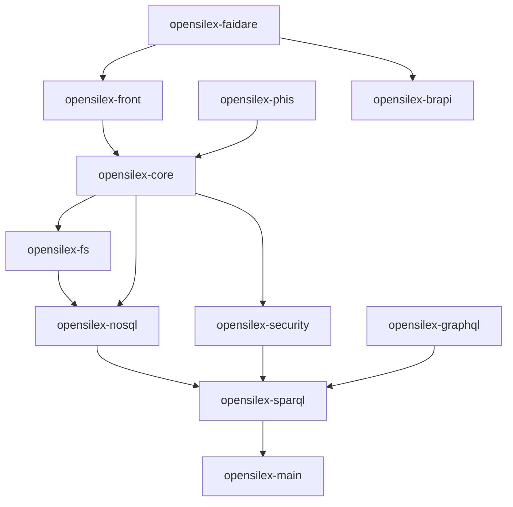

# Technical documentation : [`architecture`] `OpenSILEX modules overview`

**Document history (please add a line when you edit the document)**

| Date       | Editor(s)        | OpenSILEX version | Comment           |
|------------|------------------|-------------------|-------------------|
| 2026-09-29 | Arnaud Charleroy | BUILD-SNAPSHOT    | Document creation |

> ⚠️ _WARNING_ : this document describes the `develop` branch as of commit `6725c2912`. Facts were checked
> by reading the sources and the `pom.xml` files; **nothing was built or run**, so anything that depends on
> generated files (`META-INF/services`, `opensilex-pom.xml`) is inferred from the build configuration.
>
> It complements, and where they disagree it corrects, [README.md](./README.md), [main.md](./main.md) and
> [code-organization.md](./code-organization.md). The disagreements are listed in
> [Corrections to earlier documents](#corrections-to-earlier-documents).

## Table of contents

<!-- TOC -->
* [Technical documentation : [`architecture`] `OpenSILEX modules overview`](#technical-documentation--architecture-opensilex-modules-overview)
  * [Table of contents](#table-of-contents)
  * [Definitions](#definitions)
  * [Modules at a glance](#modules-at-a-glance)
  * [Two graphs: Maven dependencies and runtime load order](#two-graphs-maven-dependencies-and-runtime-load-order)
    * [Maven dependencies](#maven-dependencies)
    * [Runtime load order](#runtime-load-order)
  * [How the platform boots](#how-the-platform-boots)
    * [Module discovery](#module-discovery)
    * [Configuration merge order](#configuration-merge-order)
    * [Lifecycle](#lifecycle)
    * [REST wiring](#rest-wiring)
  * [Layers as they are really implemented](#layers-as-they-are-really-implemented)
  * [Extension points](#extension-points)
  * [Test infrastructure](#test-infrastructure)
  * [Build, release and tooling modules](#build-release-and-tooling-modules)
  * [Module documentation index](#module-documentation-index)
  * [Corrections to earlier documents](#corrections-to-earlier-documents)
  * [Limitations and improvements](#limitations-and-improvements)
  * [Documentation](#documentation)
<!-- TOC -->

## Definitions

- **Maven module** : a directory of the repository with a `pom.xml`. The root `pom.xml` aggregates 18 sub-directories;
  a 19th, `opensilex-dataverse`, is commented out there.
- **OpenSILEX module** : a Maven `JAR` module that contains a class extending
  [`OpenSilexModule`](../../../../../../opensilex-main/src/main/java/org/opensilex/OpenSilexModule.java). There are
  14 such classes in the tree, one per module, 13 of them active.
- **Extension point** : an interface that a module defines so that other modules can plug behaviour into it.
- **Built-in module** : a module listed in `BUILD_IN_MODULES_ORDER` (see [Runtime load order](#runtime-load-order)).
- **DAL / BLL / API** : the data access layer (`dal` packages), the business logic layer (`bll` packages, only in
  `opensilex-core`) and the REST layer (`api` packages).

## Modules at a glance

`Files` counts the Java files under `src/main/java` (test files are counted separately in each module page).
The `Config id` is the root key of the module in `opensilex.yml`.

| Maven module                        | Packaging    | OpenSILEX module class | Config id     | Files | What it is for                                                                     |
|-------------------------------------|--------------|------------------------|---------------|-------|------------------------------------------------------------------------------------|
| `opensilex-parent`                  | `pom`        | no                     |               | 0     | Dependency versions, plugin configuration, build profiles                          |
| `opensilex` (root `pom.xml`)        | `pom`        | no                     |               | 0     | Reactor aggregator, and a dependency on every module                               |
| `opensilex-module`                  | `pom`        | no                     |               | 0     | Parent of extension modules: pre-wires dependencies and build                      |
| `opensilex-main`                    | `jar`        | `ServerModule`         | `server`      | 134   | Bootstrap, CLI, configuration, services, REST infrastructure, embedded Tomcat      |
| `opensilex-sparql`                  | `jar`        | `SPARQLModule`         | `ontologies`  | 150   | Triple store access and the object/RDF mapper                                      |
| `opensilex-nosql`                   | `jar`        | `NoSQLModule`          | `big-data`    | 35    | MongoDB access                                                                     |
| `opensilex-fs`                      | `jar`        | `FileStorageModule`    | `file-system` | 16    | File storage connections (local, S3, GridFS, iRODS)                                |
| `opensilex-security`                | `jar`        | `SecurityModule`       | `security`    | 76    | Accounts, persons, groups, profiles, JWT authentication, credential checks         |
| `opensilex-core`                    | `jar`        | `CoreModule`           | `core`        | 419   | The scientific concepts and their REST API                                         |
| `opensilex-front`                   | `jar`        | `FrontModule`          | `front`       | 58    | Serves the Vue application, front configuration API, ontology-driven forms         |
| `opensilex-phis`                    | `jar`        | `PhisWsModule`         | none          | 2     | `oeso-phis` ontology, species seed, PHIS login/header components and theme         |
| `opensilex-brapi`                   | `jar`        | `BrapiModule`          | none          | 38    | BrAPI 1.2/1.3 read-only endpoints                                                  |
| `opensilex-faidare`                 | `jar`        | `FaidareModule`        | none          | 42    | FAIDARE flavoured BrAPI 1.3 subset                                                 |
| `opensilex-graphql`                 | `jar`        | `GraphQLModule`        | none          | 4     | Staple API: ontology and resource-graph export for a GraphQL layer                 |
| `opensilex-migration`               | `jar`        | `MigrationModule`      | none          | 24    | Data migrations run by the `system run-update` command                             |
| `opensilex-dev-tools`               | `jar`        | `DevModule`            | none          | 12    | IDE launch classes and the `dev` CLI group                                         |
| `opensilex-swagger-codegen-maven-plugin` | `maven-plugin` | no              |               | 1     | Generates the TypeScript API client from the Swagger specification                 |
| `opensilex-release`                 | `pom`        | no                     |               | 0     | Assembles the release archive                                                      |
| `opensilex-doc`                     | `pom`        | no                     |               | 0     | Documentation sources (this site)                                                  |

`opensilex-dataverse` has a module class (`DataverseModule`) but is disabled: it is commented out of the root
`pom.xml` and is not documented here.

## Two graphs: Maven dependencies and runtime load order

The platform has two different notions of "module order", and they do not agree. Reading only the Maven
dependencies, or only the loading list, gives a wrong picture.

### Maven dependencies

Direct dependencies on other `opensilex-*` modules, as declared in each `pom.xml` (test-jar dependencies are left out).

| Module                | Declares a dependency on                                    | Parent                |
|-----------------------|-------------------------------------------------------------|-----------------------|
| `opensilex-main`      | none                                                        | `opensilex-parent`    |
| `opensilex-sparql`    | main                                                        | `opensilex-parent`    |
| `opensilex-nosql`     | main, sparql                                                | `opensilex-parent`    |
| `opensilex-fs`        | main, nosql (only for GridFS)                               | `opensilex-parent`    |
| `opensilex-security`  | main, sparql                                                | `opensilex-parent`    |
| `opensilex-core`      | main, security, sparql, nosql, fs                           | `opensilex-parent`    |
| `opensilex-front`     | main, security, core                                        | `opensilex-parent`    |
| `opensilex-phis`      | core                                                        | `opensilex-module`    |
| `opensilex-faidare`   | brapi, front                                                | `opensilex-module`    |
| `opensilex-graphql`   | sparql                                                      | `opensilex-module`    |
| `opensilex-brapi`     | none declared                                               | `opensilex-module`    |
| `opensilex-migration` | none declared                                               | `opensilex-module`    |
| `opensilex-dev-tools` | none declared                                               | `opensilex` (root)    |

The children of `opensilex-module` (phis, brapi, faidare, graphql, migration) **inherit** dependencies on main,
sparql, nosql, fs, core, security and front from it. So `brapi` and `migration` declare nothing themselves and
still import classes from `core`, `sparql` and `security`.

In words: `sparql` sits directly on `main`; `nosql` sits on `sparql`, and `fs` on `nosql`; `security` sits on `sparql`;
`core` gathers all of them; `front` and `phis` sit on `core`. Edges to `main` are omitted for readability except
for `sparql`.

### Runtime load order

There is **no dependency declaration in Java**: `OpenSilexModule` has no `getDependencies()` hook. The order in
which modules are started is a hard-coded list in
[OpenSilexModuleManager.java:48](../../../../../../opensilex-main/src/main/java/org/opensilex/OpenSilexModuleManager.java):

| Rank | Maven artifact      |
|------|---------------------|
| 1    | `opensilex-main`    |
| 2    | `opensilex-fs`      |
| 3    | `opensilex-nosql`   |
| 4    | `opensilex-sparql`  |
| 5    | `opensilex-security`|
| 6    | `opensilex-core`    |
| 7    | `opensilex-front`   |

Consequences worth knowing:

- The order is **not** the Maven order: `fs` is loaded before `nosql`, and `nosql` before `sparql`, although each
  depends on the next one in Maven.
- Modules that are not in the list (`phis`, `brapi`, `faidare`, `graphql`, `migration`, `dev-tools`) are sorted after the
  built-in ones. Their relative order is the order the `ServiceLoader` returns them, which is unspecified. Entries of the
  `system.modulesOrder` configuration key are appended to the list, and are the only way to control it.
- The same order drives every per-module callback (`install`, `check`, `setup`, `startup`, `clean`) and also
  `shutdown`, which is **not** reversed.
- Services, on the other hand, are iterated from a `HashMap`, so the order in which services are set up is not the
  module order.

## How the platform boots

### Module discovery

`OpenSilexModuleManager.getModules()` uses `ServiceLoader.load(OpenSilexModule.class, ...)`. The
`META-INF/services/org.opensilex.OpenSilexModule` and `org.opensilex.cli.OpenSilexCommand` files are **generated at
build time** by the `serviceloader-maven-plugin` execution declared in
[opensilex-parent/pom.xml](../../../../../../opensilex-parent/pom.xml), which every module inherits. No such file is
checked in. `opensilex-module` adds two more generated registrations, for `SPARQLDeserializer` and `VueOntologyType`.

Before that, the manager lists the `modules/*.jar` files of the base directory, resolves their Maven dependencies
with `DependencyManager` and caches the result in `.opensilex.dependencies`. That is what the "automatic module
dependency resolution" mentioned in [README.md](./README.md) really is: it resolves the **Maven artifacts** of
external jars, not the order between modules.

Modules listed in `system.ignoredModules` are filtered out.

### Configuration merge order

`ConfigManager.build` merges YAML sources in this order, each source overriding the keys of the previous ones (Jackson
`updateValue`). The code is in
[ConfigManager.java:236](../../../../../../opensilex-main/src/main/java/org/opensilex/config/ConfigManager.java).

| Step | Source                                                                                   |
|------|------------------------------------------------------------------------------------------|
| 1    | the file given by `--CONFIG_FILE`, if it exists                                          |
| 2    | for each module, `config/prod/opensilex.yml` from the module jar                          |
| 3    | for each module, the `dev` or `test` overlay of the same name, according to the profile  |
| 4    | `opensilex.yml` in the base directory                                                    |
| 5    | `opensilex-` followed by the profile id and `.yml` in the base directory, when the profile is not `prod` |

The `system:` section is a special case: it is read from the `--CONFIG_FILE` only (`buildSystemConfig`), never from the
base directory file. Only `opensilex-main` ships profile overlays (`config/dev` and `config/test`).

> **Behaviour to be aware of (established by reading the code, not by running it).** When a `--CONFIG_FILE` exists, the
> profile is re-read from the file's `extend` key with `loadConfig("extend", String.class)`. That call goes through
> `ConfigProxyHandler.getPrimitive`, which receives the key `extend` where it expects a type name; no case matches and
> the result is `null`, so the profile falls back to `prod`. As a result the `dev`/`test` overlays of steps 3 and 5
> are skipped whenever a `CONFIG_FILE` is given, whatever `--PROFILE_ID` says. The `dev-tools` launch classes always
> pass a config file.

### Lifecycle

`OpenSilex.startup()` runs, in this order:

1. register a shutdown hook;
2. `setOpenSilex` on every module, then `OpenSilex.setup()` (which calls each module's `setup()`);
3. `setOpenSilex` and `setup()` on every service;
4. `startup()` on every service;
5. `startup()` on every module.

`shutdown()` calls `shutdown()` on every module, then on every service, then `clean()`. `install` is only run by
`opensilex system install [--reset]` and `check` by `opensilex system check`.

Two run modes matter: `server start` uses the requested profile, and **every other command is forced to the
`internal_operations` profile** (see `MainCommand`). That profile is only tested by `OpenSilex.isReservedProfile()`,
which the SPARQL and MongoDB startup code use to skip connection checks and index creation.

### REST wiring

`server start` builds an embedded Tomcat (`Server`). The JAX-RS application is
[RestApplication](../../../../../../opensilex-main/src/main/java/org/opensilex/server/rest/RestApplication.java)
under `@ApplicationPath("/rest")`. It registers the packages returned by
`APIExtension.getPackagesToScan()`, binds every module, module configuration and service for HK2 injection, then calls
`APIExtension.bindServices`.

The default `getPackagesToScan()` returns the packages of **every** `@Path` class known to the application. A module that
only declares `implements APIExtension` with an empty body (`brapi`, `faidare`, `graphql`, `migration`) is therefore
enough to have its resources served; only non-resource classes (filters, providers) need an explicit package list, as
`SecurityModule` and `CoreModule` do.

## Layers as they are really implemented

[README.md](./README.md) defines ordered layers (front and CLI, REST API, business logic, data access, services,
libraries) and forbids a lower layer from referring to a higher one.
[code-organization.md](./code-organization.md) prescribes `<concept>/api` and `<concept>/dal` packages. What the code
does:

| Module group                                              | Organisation                                                                 |
|-----------------------------------------------------------|------------------------------------------------------------------------------|
| `opensilex-core` (32 top-level packages)                  | 22 concepts have both `api` and `dal`; 7 also have a `bll` package             |
| `opensilex-security` (11 top-level packages)              | 5 concepts have both `api` and `dal`; the legacy `user` package is `api` only |
| `opensilex-front`                                         | `api` and `dal` only under `vueOwlExtension`                                  |
| `main`, `sparql`, `nosql`, `fs`, `migration`, `dev-tools` | organised by technical function, no `api` / `dal` split                        |
| `brapi`, `faidare`                                        | flat `api`, `model`, `responses`; `faidare` adds `builder` and `dal`           |

Over the 90 packages directly under a module root, 28 have both `api` and `dal`, 6 only `api`, 2 only `dal`, and 54
neither. The split is a convention of `core` and `security`, not of the platform.

The layer a class belongs to is visible in its name and its package, and the two agree: no `*DTO` sits in a `dal`
package, and no `*DAO` or `*Model` in an `api` package. The prescribed dependency direction is less respected:
14 of the 141 `dal` files import something from an `api` package or a DTO. The `bll` layer of `core`, absent from
[code-organization.md](./code-organization.md), is documented in the [core module page](../opensilex-core/module-architecture.md).

How a request travels through the layers is described per module. The short version: an `API` class is a JAX-RS
resource with injected services (`SPARQLService`, `MongoDBService`, `FileStorageService`, the current account); it
creates its DAO or logic object with `new` inside the endpoint method, and the DAO calls the service.

## Extension points

Interfaces that plug behaviour into a module. Only the first four extend
[`OpenSilexExtension`](../../../../../../opensilex-main/src/main/java/org/opensilex/OpenSilexExtension.java); the
others are plain interfaces that modules find through `getModulesImplementingInterface`.

| Interface                              | Defined in | Extends `OpenSilexExtension` | Purpose                                                              |
|----------------------------------------|------------|------------------------------|----------------------------------------------------------------------|
| `APIExtension`                         | main       | yes                          | Register REST packages, bind HK2 services, initialise the REST app   |
| `ServerExtension`                      | main       | yes                          | Act on the embedded Tomcat (mount a web application)                 |
| `SPARQLExtension`                      | sparql     | yes                          | Register ontology files, install/check them, in-memory initialisation |
| `LoginExtension`                       | security   | yes                          | Add claims at login, react at logout (default no-ops)                |
| `SwaggerExtension`                     | main       | no                           | Add extra classes to the Swagger definition                          |
| `JCSApiCacheExtension`                 | main       | no                           | Supply a JCS cache configuration file                                |
| `ModuleWithNosqlEntityLinkedToAccount` | security   | no                           | Tell `AccountDAO` whether Mongo data blocks an account deletion      |

Which module implements which (the interface list is the `implements` clause of each module class):

| Module class        | `APIExtension` | `ServerExtension` | `SPARQLExtension` | `LoginExtension` | Others                                                  |
|---------------------|:--------------:|:-----------------:|:-----------------:|:----------------:|---------------------------------------------------------|
| `ServerModule`      | yes            |                   |                   |                  | `JCSApiCacheExtension`                                  |
| `SPARQLModule`      |                |                   |                   |                  | defines `SPARQLExtension`                               |
| `NoSQLModule`       |                |                   |                   |                  |                                                         |
| `FileStorageModule` |                |                   |                   |                  |                                                         |
| `SecurityModule`    | yes            |                   | yes               | yes              | defines `LoginExtension`                                |
| `CoreModule`        | yes            |                   | yes               |                  | `JCSApiCacheExtension`, `SwaggerExtension`, `ModuleWithNosqlEntityLinkedToAccount` |
| `FrontModule`       | yes            | yes               |                   |                  |                                                         |
| `PhisWsModule`      | yes            |                   | yes               |                  |                                                         |
| `BrapiModule`, `FaidareModule`, `GraphQLModule`, `MigrationModule` | yes | |          |                  |                                                         |
| `DevModule`         |                |                   |                   |                  |                                                         |

`SecurityModule` implements `LoginExtension` but only inherits the default no-op methods: the credentials are written into
the token by `AuthenticationService` itself. `CoreModule` does **not** implement `LoginExtension`.

Not extension points in the `OpenSilexExtension` sense but resolved with `ServiceLoader`: `SPARQLDeserializer` (sparql),
`VueOntologyType` (front) and `ClassSpecificDeleteVerificationAskQueryProvider` (sparql, implemented in core).

## Test infrastructure

The base classes are spread over three modules and shared through Maven `test-jar` artifacts (every module depends on the
`tests` classifier of the modules below it):

| Class                                | Module    | Role                                                                                       |
|--------------------------------------|-----------|--------------------------------------------------------------------------------------------|
| `AbstractUnitTest`                   | main      | Boots an `OpenSilex` instance with the `test` profile                                       |
| `AbstractIntegrationTest`            | main      | `JerseyTest` on Grizzly; `PublicCall` and `PublicCallBuilder` to call the REST API          |
| `AbstractSecurityIntegrationTest`    | security  | Creates a super admin, `UserCall` to call as an authenticated user, cleans the SPARQL graphs |
| `AbstractMongoIntegrationTest`       | **core**  | Starts an embedded MongoDB (port 28018) and cleans collections                              |
| `OpenSilexTestEnvironment`           | sparql    | Singleton test environment used by the sparql tests and a few core and security tests       |

`AbstractMongoIntegrationTest` lives in the `core` tests, not in `nosql`, so `faidare` tests reach it through the core
test-jar. Details are in [tests.md](./tests.md).

## Build, release and tooling modules

- **`opensilex-parent`** : `packaging pom`, `version` is `${revision}` (`BUILD-SNAPSHOT`), Java 17. Holds every shared
  dependency, the `pluginManagement`, the flatten plugin (which writes `opensilex-pom.xml` used for external module
  resolution) and the build profiles (`with-test-report`, `with-vue-app`, `with-vue-config`, `with-security-check`,
  `for-eclipse`, `for-module`, `for-java-11`).
- **`opensilex`** (root `pom.xml`) : the reactor aggregator, also a dependency on every module.
- **`opensilex-module`** : parent for extension modules. No Java code. It declares the built-in modules (and their
  test-jars) as dependencies and pre-wires the Swagger generation, the TypeScript codegen and two service registrations.
- **`opensilex-swagger-codegen-maven-plugin`** : one class (`CodeGenMojo`) wrapping the upstream swagger-codegen plugin;
  it skips silently when the input specification is missing. Bound to the `compile` phase in the parent.
- **TypeScript client generation** : at `compile`, `SwaggerAPIGenerator` (run by `exec-maven-plugin`) writes
  `front/src/lib/swagger.json` and the codegen plugin turns it into a typed client in `front/src/lib`, using the
  templates in `opensilex-main/src/main/resources/swagger/templates/typescript-inversify`.
- **`opensilex-release`** : assembles `opensilex.jar` (the shaded `-full` jar of `main`), `logback.xml` and
  `modules/<artifactId>.jar` for every other module.
- **`opensilex-dev-tools`** : IDE `main` classes (install, start the server, reset ontologies, run an update) and a `dev`
  CLI group. Nothing runs during the Maven build. Its parent is the root `pom.xml`, not `opensilex-module`.
- **`opensilex-doc`** : no Java; the VitePress sources of the documentation, under `src/main/resources`.

## Module documentation index

| Module                | Page                                                                                       |
|-----------------------|--------------------------------------------------------------------------------------------|
| `opensilex-main`      | [opensilex-main/module-architecture.md](../opensilex-main/module-architecture.md)           |
| `opensilex-sparql`    | [opensilex-sparql/module-architecture.md](../opensilex-sparql/module-architecture.md), and the ORM documentation set in [opensilex-sparql/README.md](../opensilex-sparql/README.md) |
| `opensilex-nosql`     | [opensilex-nosql/module-architecture.md](../opensilex-nosql/module-architecture.md)         |
| `opensilex-fs`        | [opensilex-fs/module-architecture.md](../opensilex-fs/module-architecture.md)               |
| `opensilex-security`  | [opensilex-security/module-architecture.md](../opensilex-security/module-architecture.md)   |
| `opensilex-core`      | [opensilex-core/module-architecture.md](../opensilex-core/module-architecture.md)           |
| `opensilex-front`     | [opensilex-front/module-architecture.md](../opensilex-front/module-architecture.md)         |
| `opensilex-brapi`     | [opensilex-brapi/module-architecture.md](../opensilex-brapi/module-architecture.md)         |
| `opensilex-faidare`   | [opensilex-faidaire/module-architecture.md](../opensilex-faidaire/module-architecture.md) (the folder name is misspelled in the tree) |
| `opensilex-graphql`   | [opensilex-graphql/module-architecture.md](../opensilex-graphql/module-architecture.md)     |
| `opensilex-migration` | [opensilex-migration/module-architecture.md](../opensilex-migration/module-architecture.md) |
| `opensilex-phis`      | [opensilex-phis/module-architecture.md](../opensilex-phis/module-architecture.md)           |

Naming rules for the Java code of all these modules are in [java-naming-conventions.md](./java-naming-conventions.md).

## Corrections to earlier documents

Statements in the earlier architecture documents that the code contradicts. Nothing in those documents was edited.

| Document          | Statement                                                                                     | What the code says                                                                                                                          |
|-------------------|-----------------------------------------------------------------------------------------------|---------------------------------------------------------------------------------------------------------------------------------------------|
| README.md         | Built-in load order is fs, sparql, nosql, security, core, phis, front                          | main, fs, nosql, sparql, security, core, front. `phis` is not in the list; `main` is the first entry                                        |
| README.md, main.md| Modules resolve their dependencies automatically                                               | No dependency declaration exists in Java; only the Maven artifacts of external jars are resolved                                            |
| README.md         | Every extension interface extends `OpenSilexExtension`                                         | `SwaggerExtension` and `JCSApiCacheExtension` do not                                                                                         |
| README.md         | Security provides `SwaggerExtension`                                                           | It is defined in `opensilex-main` and implemented by `CoreModule`                                                                            |
| README.md         | Security's `LoginExtension` stores credentials in the token; core implements `LoginExtension`  | Security only inherits the no-op defaults; core does not implement it                                                                       |
| README.md         | `opensilex-core` provides Experiment and Infrastructure, and "Provide APIs" in its DAL box      | There is no "Infrastructure" concept (now organisation, facility, site); core has about 30 concepts, a `bll` layer and Mongo storage       |
| README.md         | `opensilex-phis` contains legacy PHIS services                                                 | It holds the `oeso-phis` ontology, a species seed and two Vue layout components; there are no web services                                  |
| README.md         | `LocalFileSystemConnection` is the default file storage                                         | Without `defaultFS` the default is `TempFileSystemConnection`                                                                                |
| README.md         | Swagger UI is set up on `/`                                                                     | Swagger UI is served at `/api-docs/`; `/` redirects to the front application                                                               |
| main.md           | Startup calls `startup` on services then modules                                                | It also calls `setup()` on modules and services first                                                                                       |
| main.md           | `CONFIG_FILE` is applied last                                                                   | It is merged first, and module defaults are merged after it                                                                                  |
| main.md           | Hierarchy diagrams show sparql, fs and nosql as independent peers and front above phis         | `fs` depends on `nosql`, which depends on `sparql`; `front` depends on `core`, not on `phis`                                                 |
| main.md           | Names `org.opensilex.module.ModuleManager`, `RestModule`, `org.opensilex.rest.*`, `NoSQLService`| None of these exist. They are now `OpenSilexModuleManager`, `SecurityModule`, `org.opensilex.security.*`, `MongoDBService`                   |
| main.md           | Configuration keys `serviceClass`, `serviceID`, `configID`                                      | Services are selected with `implementation` and `@ServiceDefaultDefinition`; the old keys are gone                                          |
| code-organization.md | `ConceptDAOTest` extends `AbstractUnitTest`                                                | DAO tests are integration tests in `core` and `security`, built on the integration base classes                                              |
| code-organization.md | Generated TypeScript typings sit under `front/src`                                          | The typings are generated in `front/types`, next to `front/src/lib`                                                                          |

## Limitations and improvements

- The two orderings (Maven and runtime) are independent and only one of them is written in Java. A module that needs to
  start after another one outside the built-in list has no declarative way to say so.
- The cross-module coupling is high in `core`: concepts import each other's DAOs and logic classes, and some `dal` classes
  import `api` packages (see the [core module page](../opensilex-core/module-architecture.md)).
- The earlier documents listed above should be corrected or replaced by these pages.

## Documentation

- [README.md](./README.md), [main.md](./main.md), [code-organization.md](./code-organization.md), [module.md](./module.md),
  [tests.md](./tests.md) : the earlier architecture documents.
- [java-naming-conventions.md](./java-naming-conventions.md) : naming rules for Java code.
- The per-module pages listed in [Module documentation index](#module-documentation-index).
