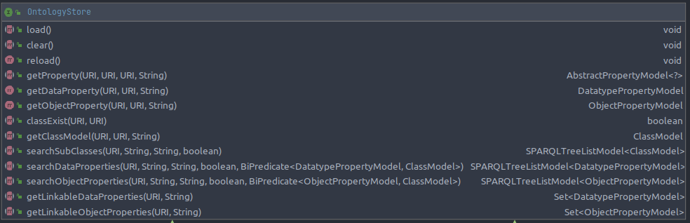

# Optimisation du stockage RAM des ontologies

**Document history**

| Date | Editor(s) | OpenSILEX version | Comment |
|------|-----------|-------------------|---------|
| 09/02/2022 | Renaud COLIN | - | Document original |
| 26/08/2026 | ARGO | - | Mise à jour avec détails techniques |

---

## 1. Motivation

L'**OntologyAPI** et la **VueOwlExtensionAPI** fournissent des informations sur les classes, propriétés et restrictions de toutes les ontologies du repository SPARQL utilisé par OpenSILEX.

Initialement, ces données sont récupérées via des requêtes SPARQL (en déclarant des modèles et en utilisant le `SPARQLService`).

**Problèmes identifiés :**
- Latence due à l'évaluation des requêtes SPARQL (2-3 secondes)
- De nombreuses requêtes SPARQL générées par le SPARQLService (structure arborescente)
- Inacceptable pour le client Vue (appel de formulaire ou vue peut prendre 1-3s)
- Quantité de données faible pour l'affichage de formulaires
- Données du vocabulaire quasi-statiques (pas de milliers de modifications par heure)

**Solution :** Mettre en cache/indexer en RAM tout le vocabulaire pour accélérer les services.

---

## 2. Conception

### 2.1. Interface OntologyStore

L'interface définit quatre catégories de fonctionnalités :

```java
public interface OntologyStore {
    
    // 1. Classes
    void load() throws SPARQLException;
    void clear();
    void reload() throws SPARQLException;
    boolean classExist(URI classURI, URI ancestorURI) throws SPARQLException;
    ClassModel getClassModel(URI classURI, URI ancestorURI, String lang) throws SPARQLException;
    LinkedHashSet<String> getAncestorHierarchy(URI classURI, URI ancestorUri);
    SPARQLTreeListModel<ClassModel> searchSubClasses(URI classURI, String namePattern, String lang, boolean excludeRoot);
    
    // 2. Propriétés
    AbstractPropertyModel<?> getProperty(URI propertyURI, URI propertyType, URI domain, String lang);
    DatatypePropertyModel getDataProperty(URI property, URI domain, String lang);
    ObjectPropertyModel getObjectProperty(URI property, URI domain, String lang);
    SPARQLTreeListModel<DatatypePropertyModel> searchDataProperties(URI domain, String namePattern, String lang, boolean includeSubClasses, BiPredicate<DatatypePropertyModel, ClassModel> filter);
    SPARQLTreeListModel<ObjectPropertyModel> searchObjectProperties(URI domain, String namePattern, String lang, boolean includeSubClasses, BiPredicate<ObjectPropertyModel, ClassModel> filter);
    
    // 3. Restrictions
    Set<String> getOwlRestrictionsUris(URI classURI, boolean includeNestedRestrictions);
    Set<DatatypePropertyModel> getLinkableDataProperties(URI domain, URI ancestor, String lang);
    Set<ObjectPropertyModel> getLinkableObjectProperties(URI domain, URI ancestor, String lang);
}
```

### 2.2. Utilisateurs

| Composant | Utilisation |
|-----------|-------------|
| `OntologyAPI` | Accès aux métadonnées du vocabulaire |
| `VueOwlExtensionAPI` | Extension Vue.js pour l'ontologie |
| Import CSV | Validation des types lors de l'import |
| `SPARQLRelationFetcher` | Gestion des propriétés spécifiques |
| `DataAPI`, `ScientificObjectAPI`, `EventAPI`, `DeviceAPI` | Utilisation du vocabulaire dans les API |

### 2.3. Configuration

Activation via la propriété `enableOntologyStore` dans `SPARQLConfig` :

```yaml
ontologies:
    baseURI: http://opensilex.dev/
    baseURIAlias: dev
    sparql:
        config:
            serverURI: http://localhost:7200
            repository: opensilex
    enableOntologyStore: true    # Par défaut: true
```

---

## 3. Implémentations

### 3.1. DefaultOntologyStore → AbstractOntologyStore

Implémentation par défaut utilisant :

| Structure | Rôle |
|-----------|------|
| `PatriciaTrie` | Index des modèles par URI |
| `SimpleDirectedGraph` (JGraphT) | Graphes pour le traversal des ancêtres |

**Algorithme de chargement :**

```
1. Exécution des requêtes SPARQL pour récupérer :
   - Classes
   - Propriétés
   - Restrictions OWL

2. Construction d'un index modelsByUris par URI

3. Construction d'un graphe modelsGraph pour :
   - Récupération efficace des ancêtres
   - Traversal des descendants
```

**Caractéristiques :**

| Fonctionnalité | Détail |
|----------------|--------|
| Sous-classes/sous-propriétés | Traversal des descendants pour construire une représentation arborescente |
| Restrictions héritées | `getClassModel(type, ancestor)` retourne toutes les classes entre type et ancêtre, avec leurs restrictions |
| Gestion des lang | Tous les lang pour une classe/propriété sont stockés ; lors du retour, le store applique le lang demandé |

**Principe d'héritage des restrictions :**
> Si une classe a une sous-classe, alors toutes les restrictions de cette sous-classe s'appliquent à la classe parente.

### 3.2. NoOntologyStore

Implémentation de fallback (utilisée pour les tests) qui utilise simplement `OntologyDAO` pour effectuer toutes les opérations.

```java
public class NoOntologyStore implements OntologyStore {
    private final OntologyDAO ontologyDAO;
    
    // Toutes les méthodes delegate à OntologyDAO
    // Pas de cache RAM
    // Pas de vérification des sous-classes (TODO)
}
```

---

## 4. Diagramme UML



---

## 5. Améliorations et TODO

| Priorité | Amélioration | Description |
|----------|--------------|-------------|
| Haute | Tests | Ajouter plus de tests (valeurs incorrectes, sémantique mauvaise, vocabulaire incomplet) |
| Moyenne | Generics | Corriger les warnings de generics dans `AbstractOntologyStore` |
| Moyenne | Mise à jour incrémentale | Actuellement, la création/modification/suppression de classes/propriétés/restrictions utilise une stratégie naive (reset + reload). Il faudrait mettre à jour le modèle donné et les liens (parent/enfant). Difficile à implémenter et tester. |
| Basse | Micro-benchmarks | Écrire des benchmarks de performance lecture/écriture et utilisation RAM |

---

## 6. Performance

### 6.1. Temps de chargement

Le chargement initial de l'OntologyStore est loggé :

```
DEBUG Using DefaultOntologyStore implementation
DEBUG Ontology store loaded with success. Duration: 142 ms
```

### 6.2. Comparaison avant/après

| Métrique | Sans cache (OntologyDAO) | Avec cache (DefaultOntologyStore) |
|----------|--------------------------|-----------------------------------|
| Temps de réponse | 2-3 secondes | < 10 ms |
| Requêtes SPARQL | Multiples | 0 (après chargement initial) |
| RAM utilisée | N/A | Modérée (stockage des modèles) |

---

## 7. Cycle de vie

```
SPARQLModule.startup()
    │
    ├─→ SPARQLModule.initOntologyStore()
    │   ├─ Si enableOntologyStore && !reservedProfile && !test
    │   │   → new DefaultOntologyStore(sparql, openSilex)
    │   │   → ontologyStore.load()
    │   └─ Sinon
    │       → new NoOntologyStore(new OntologyDAO(sparql))
    │
    └─→ Log du temps de chargement
```

---

## 8. Exemple d'utilisation

```java
// Récupérer un modèle de classe
ClassModel germplasmModel = ontologyStore.getClassModel(
    URI.create("http://opensilex.org/vocabulary/Germplasm"),
    null,  // pas d'ancêtre
    "fr"   // langue
);

// Rechercher les sous-classes
SPARQLTreeListModel<ClassModel> subclasses = ontologyStore.searchSubClasses(
    germplasmModel.getUri(),
    "maize",  // pattern de nom
    "en",
    false     // inclure la racine
);

// Vérifier l'existence
boolean exists = ontologyStore.classExist(
    URI.create("http://opensilex.org/vocabulary/MyGermplasm"),
    germplasmModel.getUri()  // sous-classe de Germplasm
);

// Récupérer les propriétés liées
Set<DatatypePropertyModel> properties = ontologyStore.getLinkableDataProperties(
    germplasmModel.getUri(),
    null,
    "fr"
);
```