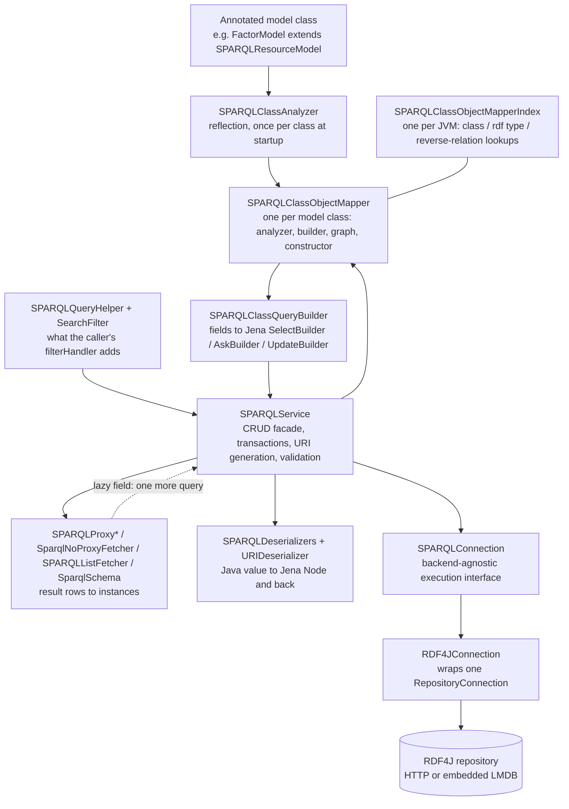
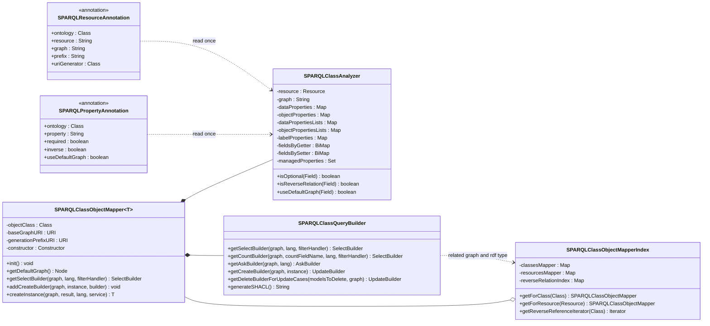
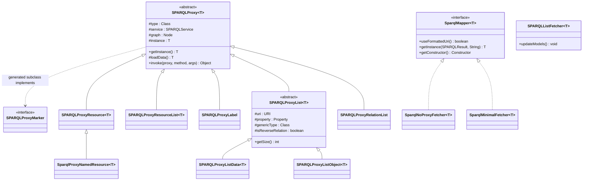
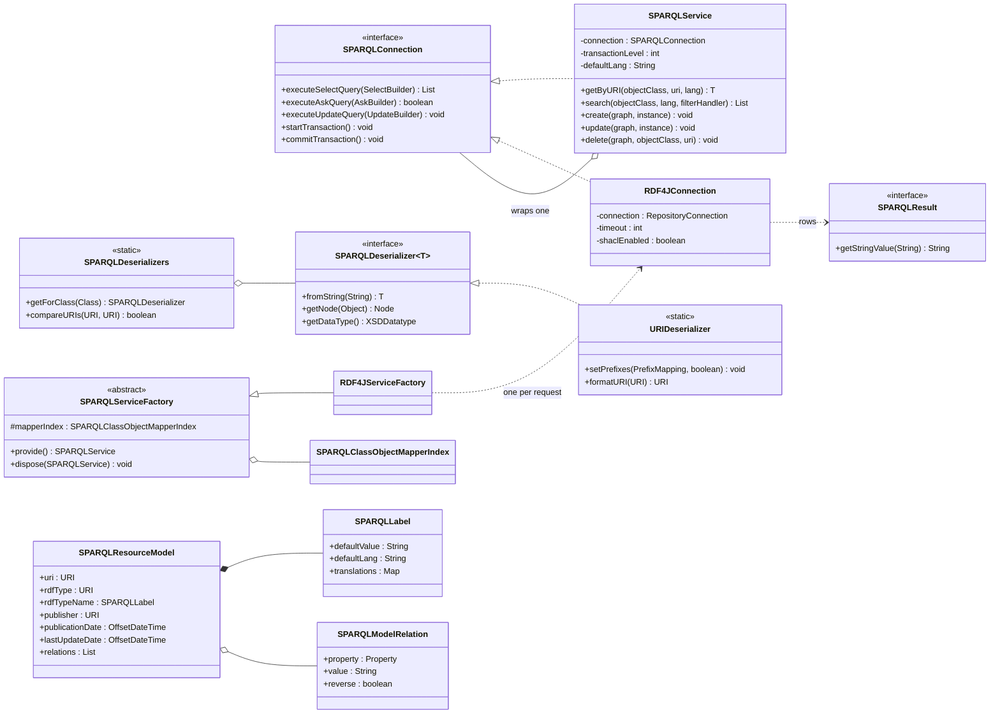
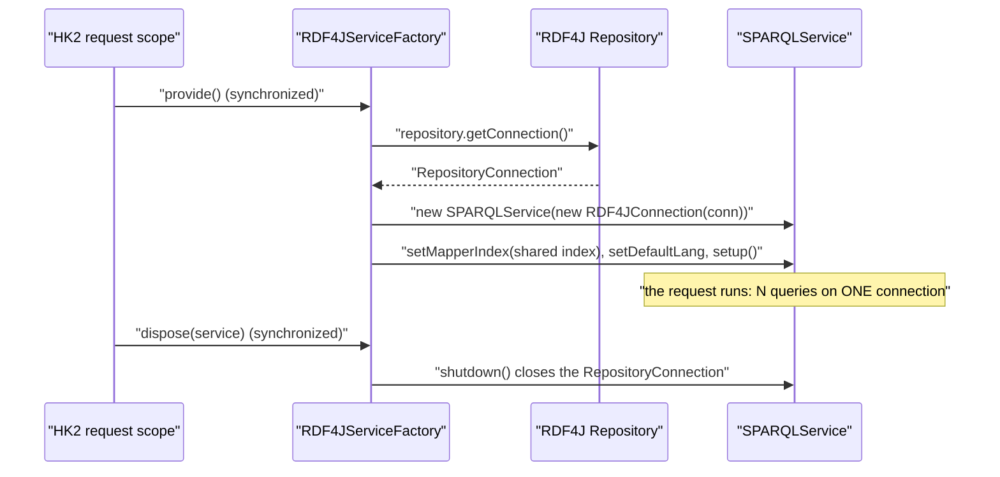
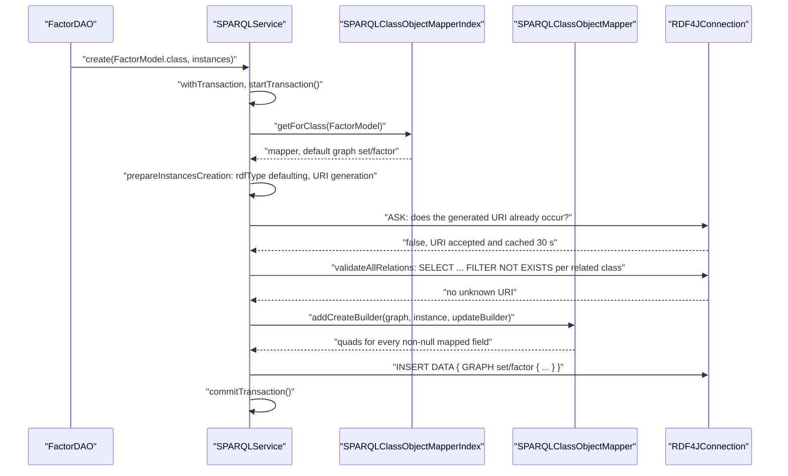
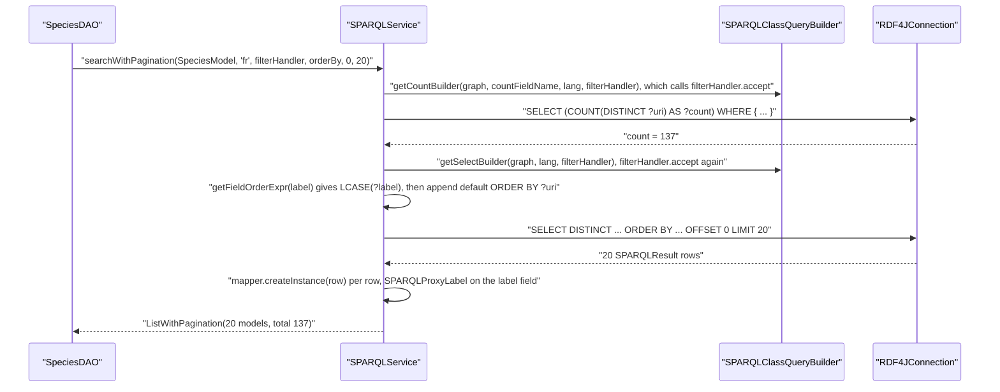
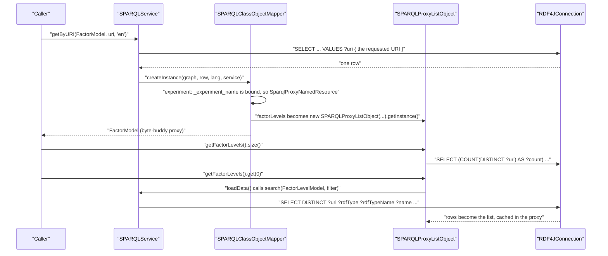

# Technical documentation : [`sparql`] The OpenSILEX SPARQL ORM

**Document history (please add a line when you edit the document)**

| Date       | Editor(s)        | OpenSILEX version | Comment           |
|------------|------------------|-------------------|-------------------|
| 2026-09-11 | Arnaud Charleroy | BUILD-SNAPSHOT    | Document creation |
| 2026-09-13 | Arnaud Charleroy | BUILD-SNAPSHOT    | Corrected proxy hierarchy, builder signatures and generated-query examples against the source |

## Table of contents

<!-- TOC -->
- [What this module is](#what-this-module-is)
- [The layered view](#the-layered-view)
- [The domain model of the ORM itself](#the-domain-model-of-the-orm-itself)
  - [Declaration and mapping](#declaration-and-mapping)
  - [Materialisation: proxies and fetchers](#materialisation-proxies-and-fetchers)
  - [Execution, types and model bases](#execution-types-and-model-bases)
- [Lifecycles](#lifecycles)
  - [JVM startup](#jvm-startup)
  - [Per request](#per-request)
  - [Per operation](#per-operation)
- [End-to-end walkthroughs](#end-to-end-walkthroughs)
  - [(a) Creating one model](#a-creating-one-model)
  - [(b) A paginated search with a filter and a multilingual label](#b-a-paginated-search-with-a-filter-and-a-multilingual-label)
  - [(c) Loading an object graph with a lazily-fetched relation list](#c-loading-an-object-graph-with-a-lazily-fetched-relation-list)
- [Concepts and vocabulary](#concepts-and-vocabulary)
- [Map of the code](#map-of-the-code)
- [Where to go next](#where-to-go-next)
- [Limitations and improvements](#limitations-and-improvements)
<!-- TOC -->

## What this module is

`opensilex-sparql` is an object/RDF mapper written from scratch inside OpenSILEX. A plain Java class
carrying [@SPARQLResource](../../../../../../opensilex-sparql/src/main/java/org/opensilex/sparql/annotations/SPARQLResource.java)
and a few [@SPARQLProperty](../../../../../../opensilex-sparql/src/main/java/org/opensilex/sparql/annotations/SPARQLProperty.java)
fields becomes a readable, writable, searchable RDF resource, and
[SPARQLService](../../../../../../opensilex-sparql/src/main/java/org/opensilex/sparql/service/SPARQLService.java)
is the single facade every DAO calls. No per-class query is hand-written anywhere: the forty-five
`@SPARQLResource` model classes in this repository's main sources — 31 in `opensilex-core`, 6 in
`opensilex-sparql`, 5 in `opensilex-security`, 2 in `opensilex-front` and 1 in
`opensilex-data-analysis`, more once third-party modules are on the classpath — share one code path.

There is no external mapping framework in the dependency tree. `opensilex-parent/pom.xml` pulls
exactly one Apache Jena artifact, `jena-querybuilder`, used purely as an *object model for building
SPARQL strings*; execution goes to RDF4J (`rdf4j-client`, `rdf4j-repository-http`,
`rdf4j-repository-sail`, `rdf4j-shacl`). Byte-buddy provides runtime subclassing for lazy loading.
Nothing else in the stack knows what a model class is.

**Why hand-rolled?** The code does not record the decision and no comment or ADR in the repository
explains it — that part is unknown. What the code *does* show is a set of requirements that are
unusual for a generic RDF mapper and that this ORM is built around:

- **One named graph per concept, resolved from the class.** `@SPARQLResource(graph = "factor")`
  makes every instance live in `BASE_URI + "set/factor"`, and every generated query is scoped to it
  (see [Graph organization](./graph-organization.md)). Cross-graph object properties are resolved
  from the *related* class's graph, not the subject's.
- **URIs are minted by the platform**, from a per-class generation prefix and a normalised
  human-readable path, with a collision-retry loop — not supplied by the client.
- **URIs exist in two interchangeable forms.** With `usePrefixes: true` a URI is held in memory as
  `dev:factor/za17.irrigation` or as the expanded IRI depending on which layer produced it, so
  `java.net.URI.equals` is unusable and the whole module compares through
  `SPARQLDeserializers.compareURIs`.
- **Every label is potentially multilingual**, and the requested language must fall back to the
  untagged literal rather than returning nothing.
- **The vocabulary is data.** Users create `owl:Class` and `owl:ObjectProperty` instances at
  runtime, so a large part of the module (`ontology/store`, `owl`, `csv`) maps the *runtime*
  ontology, not compile-time Java classes.

The cost is visible too, and worth knowing before changing anything: no query cache, no connection
pool of its own, no identity map, no dirty checking (an update is a delete followed by a re-insert),
and lazy loading that generates a fresh byte-buddy class per proxied field.

## The layered view

Each box names the class that owns the layer.



Two things to read off it. `SPARQLService` both *implements* and *wraps* [`SPARQLConnection`](../../../../../../opensilex-sparql/src/main/java/org/opensilex/sparql/service/SPARQLConnection.java)
(`SPARQLService.java:88`): it adds the prefix mapping, the DEBUG log line, the transaction counter
and the default language, then delegates. And the arrow back up from the materialisation layer is
the lazy-loading loop — a proxy holds the service that created it and re-enters the facade on first
dereference.

## The domain model of the ORM itself

Three diagrams; together they cover every type a developer changing the ORM will touch.

### Declaration and mapping

The two annotation boxes show the attributes this overview refers to; the remaining ones
(`ignoreValidation`, `allowBlankNode`, `handleCustomProperties`, `ignoreUpdateIfNull`,
`cascadeDelete`, `autoUpdate`) are documented in
[01 - annotations and class analysis](./orm/01-annotations-and-class-analysis.md).



Parameter lists in the `SPARQLClassQueryBuilder` box are abbreviated: the real `getSelectBuilder`,
`getCountBuilder` and `getAskBuilder` all take a trailing `Map<String, WhereHandler> customHandlerByFields`,
and `getCreateBuilder` takes `blankNode` and a `createExtension` callback as well. The names and the
parameter *order* shown are the real ones.

The relationship that matters most: **the annotations are read exactly once**, in
[`SPARQLClassObjectMapper`](../../../../../../opensilex-sparql/src/main/java/org/opensilex/sparql/mapping/SPARQLClassObjectMapper.java)`.init()` (`SPARQLClassObjectMapper.java:94`); afterwards every downstream
decision reads the maps of [`SPARQLClassAnalyzer`](../../../../../../opensilex-sparql/src/main/java/org/opensilex/sparql/mapping/SPARQLClassAnalyzer.java) and nothing looks at an annotation again. Two-phase construction
(all mappers constructed, then all `init()`-ed) exists because the model reference graph is cyclic:
analysing `FactorModel` must be able to ask whether `ExperimentModel` is mapped before that class's
own mapper exists.

### Materialisation: proxies and fetchers



[`SPARQLProxy`](../../../../../../opensilex-sparql/src/main/java/org/opensilex/sparql/mapping/SPARQLProxy.java) is an `InvocationHandler`; `getInstance()` asks byte-buddy to subclass the model type,
implement the empty marker `SPARQLProxyMarker` and route `ElementMatchers.any()` through the handler
— which is how [`SPARQLClassObjectMapperIndex`](../../../../../../opensilex-sparql/src/main/java/org/opensilex/sparql/mapping/SPARQLClassObjectMapperIndex.java)`.getConcreteClass` can walk
back up to the real model class. The two `SparqlMapper` implementations are the escape hatch: a plain instance straight from a
result row, no class generation and no lazy field, at the price of empty list fields that
[`SPARQLListFetcher`](../../../../../../opensilex-sparql/src/main/java/org/opensilex/sparql/mapping/SPARQLListFetcher.java) then fills in one extra `GROUP_CONCAT` query.

### Execution, types and model bases



`SPARQLService implements SPARQLConnection` *and* holds one: the service adds behaviour (prefixes,
logging, the re-entrant transaction counter) and forwards everything else. [`RDF4JConnection`](../../../../../../opensilex-sparql/src/main/java/org/opensilex/sparql/rdf4j/RDF4JConnection.java) is the
only implementation of the "backend-agnostic" interface, and the abstraction leaks —
`SPARQLConnection.executeSelectQuery` declares RDF4J's `MalformedQueryException` in its `throws`.

## Lifecycles

### JVM startup

`OpenSilex` runs `modules.setup`, then `services.setup`, then `services.startup`, then
`modules.startup`.

| Step | Owner | What happens |
|---|---|---|
| 1 | [`SPARQLModule`](../../../../../../opensilex-sparql/src/main/java/org/opensilex/sparql/SPARQLModule.java)`.setup()` | Reads `SPARQLConfig` (key `ontologies`): `baseURI`, `baseURIAlias`, `generationBaseURI`, `customPrefixes`. Computes `generationPrefixURI`. |
| 2 | [`RDF4JServiceFactory`](../../../../../../opensilex-sparql/src/main/java/org/opensilex/sparql/rdf4j/RDF4JServiceFactory.java) constructor | Builds the `HTTPRepository` and an Apache `PoolingHttpClientConnectionManager` with `defaultMaxPerRoute(20)`. |
| 3 | [`SPARQLServiceFactory`](../../../../../../opensilex-sparql/src/main/java/org/opensilex/sparql/service/SPARQLServiceFactory.java)`.startup()` (`SPARQLServiceFactory.java:77-120`) | Classpath scan `getAnnotatedClasses(SPARQLResource.class)`, then `new SPARQLClassObjectMapperIndex(...)`: **every mapper is constructed, then every `init()` runs the analyzer**. Every class-definition error in the platform surfaces here, at boot, not at query time. Then the static prefix table is filled and mirrored into `URIDeserializer.setPrefixes`. |
| 4 | `RDF4JServiceFactory.startup()` | Imports the triple store's own namespace table into the same static prefix map — which makes the prefix set installation-dependent. |
| 5 | `SPARQLModule.startup()` (`SPARQLModule.java:210-221`) | `factory.provide()`, then `initOntologyStore`: `DefaultOntologyStore` (three bulk queries into a RAM index) unless the profile is reserved/test or `enableOntologyStore` is false, in which case `NoOntologyStore` forwards to `OntologyDAO`. |

Note two consequences. The mapper index is **frozen** after step 3 — it is a set of plain `HashMap`s
with no synchronisation, and it is safe only because nothing writes to it afterwards. And the
service provided in step 5 is never disposed, so the ontology store holds one `RepositoryConnection`
for the life of the JVM.

### Per request

`SPARQLService` is bound in HK2 `RequestScoped` with a lazy proxy, so a request that never touches
SPARQL opens nothing.



Per JVM: the factory, the `Repository`, the HTTP connection manager, the mapper index, the static
prefix map, the ontology store, the 30-second generated-URI Caffeine cache. Per request: the
`RepositoryConnection`, the `RDF4JConnection`, the `SPARQLService`, the transaction counter and
**every proxy created during that request**. There is no service pool and no connection pool below
the 20-slot HTTP manager.

**The hard rule that follows**: a model built by the ORM must not outlive the request that loaded it.
Any lazily-loaded field touched later — from a cache, another thread, a late Jackson serialisation —
queries a closed connection, and nothing guards against it. See
[Proxies and lazy loading](./orm/04-proxies-and-lazy-loading.md).

### Per operation

Inside one `create` or one `search`, on an already-open connection:

| Operation | Sequence |
|---|---|
| `create(instance)` | default `rdfType` from the mapper, generate or validate the URI (one `ASK`), validate forward relations (one `SELECT` per related class), recurse into nested instances, build **one** `INSERT DATA` however deep the nesting, execute. Single-instance `create` opens no transaction; the `Collection` overloads wrap themselves in `withTransaction`. |
| `search(...)` | `mapper.getSelectBuilder(graph, lang, filterHandler, customHandlerByFields)` rebuilds the skeleton from scratch (**no query cache**), the caller's `filterHandler` runs, `ORDER BY`/`LIMIT`/`OFFSET` are appended, one `SELECT` is executed, each row becomes a model — proxied by default. |
| `searchWithPagination(...)` | the same skeleton is built **twice**: once as `COUNT`, once as the page query. A COUNT costs about what the search costs, `OPTIONAL` blocks included. |
| `update(...)` | inside one transaction: load the previous instances if any field is `@SPARQLProperty(autoUpdate = true)`, run `DELETE ... WHERE` for the URI (keeping `dc:publisher` and `dc:issued`), then re-insert. There is no dirty checking and no diff of data properties. |
| `delete(...)` | load the instance as an existence check, delete reverse cascade targets, reverse references, unmapped relations, the object itself, then direct cascade targets. |

## End-to-end walkthroughs

All SPARQL below is reconstructed faithfully from the builder code for the platform base URI
`http://opensilex.dev/`. Predicate IRIs are shown expanded because that is what is sent: the class
query builder never declares prefixes.

### (a) Creating one model

[FactorModel](../../../../../../opensilex-core/src/main/java/org/opensilex/core/experiment/factor/dal/FactorModel.java)
declares `graph = "factor"`, a `name` on `rdfs:label`, an object property `experiment` pointing at
`ExperimentModel` (graph `experiment`), and an inverse list `factorLevels` with
`cascadeDelete = true`. It implements `ClassURIGenerator`, so its generated URI path is
`experimentName + "." + factorName`, normalised.

```java
FactorModel factor = new FactorModel();
factor.setName("Irrigation");
factor.setExperiment(new ExperimentModel(URI.create("dev:experiment/za17")));
sparql.create(FactorModel.class, List.of(factor));
```



The URI check (`SPARQLService.java:1757`), for a generated URI, looks in **both** directions:

```sparql
ASK WHERE {
  { GRAPH <http://opensilex.dev/set/factor> { <http://opensilex.dev/factor/za17.irrigation> ?p_out ?o } }
  UNION
  { GRAPH <http://opensilex.dev/set/factor> { ?s ?p_in <http://opensilex.dev/factor/za17.irrigation> } }
}
```

A URI supplied by the caller is checked with the outgoing branch only — incoming links such as SKOS
references are tolerated. The relation check (`getUnknownUrisQuery`, `SPARQLService.java:2053`) then
runs once per related class, whatever the number of instances:

```sparql
SELECT * WHERE {
  VALUES ?uri { <http://opensilex.dev/experiment/za17> }
  FILTER NOT EXISTS { ?uri ?p ?o . ?rdfType rdfs:subClassOf* oeso:Experiment . ?uri a ?rdfType }
}
```

The projection is implicit — `getUnknownUrisQuery` never calls `addVar`, so the builder emits
`SELECT *` — and the URI list goes in through `SPARQLQueryHelper.addWhereUriValues`, which delegates
to `addWhereValueVar` (`SPARQLQueryHelper.java:360`) and therefore places the `VALUES` block *inside*
the `WHERE` braces, not at query level.

Finally the single write:

```sparql
INSERT DATA {
  GRAPH <http://opensilex.dev/set/factor> {
    <http://opensilex.dev/factor/za17.irrigation> <http://www.w3.org/1999/02/22-rdf-syntax-ns#type> <http://www.opensilex.org/vocabulary/oeso#Factor> .
    <http://opensilex.dev/factor/za17.irrigation> <http://www.w3.org/2000/01/rdf-schema#label> "Irrigation" .
    <http://opensilex.dev/factor/za17.irrigation> <http://purl.org/dc/terms/issued> "2026-09-11T10:12:33Z"^^<http://www.w3.org/2001/XMLSchema#dateTime> .
    <http://opensilex.dev/factor/za17.irrigation> <http://www.opensilex.org/vocabulary/oeso#studiedEffectIn> <http://opensilex.dev/experiment/za17> .
  }
}
```

Multi-valued properties are one triple per element: no RDF collection, no blank node. Nested
instances reachable through mapped object fields are created first, into *their own* default graph,
and join the same `UpdateBuilder` when a batch size is in force.

### (b) A paginated search with a filter and a multilingual label

[SpeciesModel](../../../../../../opensilex-core/src/main/java/org/opensilex/core/species/dal/SpeciesModel.java)
is the smallest model with a real translated field: `graph = "germplasm"` and a
`@SPARQLProperty(required = true)` `SPARQLLabel label` on `rdfs:label`.

```java
ListWithPagination<SpeciesModel> page = sparql.searchWithPagination(
        SpeciesModel.class, "fr",
        select -> select.addFilter(SPARQLQueryHelper.regexFilter(SpeciesModel.LABEL_FIELD, "ma")),
        List.of(new OrderBy("label=asc")), 0, 20);
```



The page query:

```sparql
SELECT DISTINCT  ?uri ?rdfType ?rdfTypeName ?label
WHERE
  { ?rdfType (<http://www.w3.org/2000/01/rdf-schema#subClassOf>)* <http://www.opensilex.org/vocabulary/oeso#Species>
    OPTIONAL
      { ?rdfType  <http://www.w3.org/2000/01/rdf-schema#label>  ?rdfTypeName
        FILTER langMatches(lang(?rdfTypeName), "fr")
      }
    OPTIONAL
      { ?rdfType  <http://www.w3.org/2000/01/rdf-schema#label>  ?rdfTypeName
        FILTER langMatches(lang(?rdfTypeName), "")
      }
    GRAPH <http://opensilex.dev/set/germplasm>
      { ?uri  a  ?rdfType ;
              <http://www.w3.org/2000/01/rdf-schema#label>  ?label
        FILTER ( langMatches(lang(?label), "fr") || langMatches(lang(?label), "") )
      }
    FILTER regex(?label, "ma", "i")
    FILTER ( ! isBlank(?uri) )
  }
ORDER BY ASC(lcase(?label)) ASC(?uri)
OFFSET 0 LIMIT 20
```

Abridged for readability: `getSelectBuilder` projects every data property, so the real query also
carries `?publisher`, `?publicationDate` and `?lastUpdateDate` with one `OPTIONAL` each, inherited
from `SPARQLResourceModel`.

Four points to take away. `DISTINCT` is always set, and `?rdfType rdfs:subClassOf* <Type>` sits
**outside** the `GRAPH` clause while `?uri a ?rdfType` sits **inside** it — the class hierarchy lives
in the ontology graph, the instances in the data graph. The label is `required = true`, so it gets a
single clause with the disjunctive `langFilterWithDefault` filter; an *optional* label would instead
be emitted as two `OPTIONAL` blocks binding the same variable, one on `"fr"` and one on `""`, which
guarantees at most one value — the required form can bind two literals and duplicate the row. The
default `ORDER BY ?uri` is appended because without a total order pagination is not stable across
pages. And list-valued fields never appear in this projection: they are proxied, filled afterwards by
`SPARQLListFetcher`, or planned explicitly with a `SparqlSchema`. The COUNT reuses that WHERE clause
verbatim, `OPTIONAL` blocks included.

### (c) Loading an object graph with a lazily-fetched relation list

```java
FactorModel factor = sparql.getByURI(FactorModel.class, uri, "en");   // query 1
String xpName    = factor.getExperiment().getName();                  // no query: inlined name
int levelCount   = factor.getFactorLevels().size();                    // query 2: COUNT
FactorLevelModel first = factor.getFactorLevels().get(0);              // query 3: the real SELECT
```



Query 1, from `SPARQLService.loadByURI` / `getByURI`, is the class skeleton plus a `VALUES` clause.
Because `experiment` is typed `ExperimentModel`, a `SPARQLNamedResourceModel`, the builder projects
`_experiment_name` and `_experiment_name_default` and resolves the label **inside** the field's own
clause, across the two graphs:

```sparql
SELECT DISTINCT  ?uri ?rdfType ?rdfTypeName ?name ?description ?category
                 ?experiment ?_experiment_name ?_experiment_name_default
WHERE
  { ?rdfType (<http://www.w3.org/2000/01/rdf-schema#subClassOf>)* <http://www.opensilex.org/vocabulary/oeso#Factor>
    # the same two rdfTypeName OPTIONAL blocks as in walkthrough (b)
    GRAPH <http://opensilex.dev/set/factor>
      { ?uri  a  ?rdfType
        OPTIONAL { ?uri <http://www.w3.org/2000/01/rdf-schema#label> ?name }
        # ... one OPTIONAL per remaining mono-valued field (description, category, ...)
        OPTIONAL
          { ?uri <http://www.opensilex.org/vocabulary/oeso#studiedEffectIn> ?experiment
            OPTIONAL { ?experiment <http://www.w3.org/2000/01/rdf-schema#label> ?_experiment_name
                       FILTER langMatches(lang(?_experiment_name), "en") }
            OPTIONAL { ?experiment <http://www.w3.org/2000/01/rdf-schema#label> ?_experiment_name
                       FILTER langMatches(lang(?_experiment_name), "") }
            GRAPH <http://opensilex.dev/set/experiment>
              { ?experiment <http://www.w3.org/2000/01/rdf-schema#label> ?_experiment_name_default
                FILTER ( langMatches(lang(?_experiment_name_default), "en") || langMatches(lang(?_experiment_name_default), "") ) }
          }
      }
    FILTER ( ! isBlank(?uri) )
  }
VALUES ?uri { <http://opensilex.dev/factor/za17.irrigation> }
```

Note that `?name` carries **no** language filter: it is a `String`, therefore a data property, and
data properties are handed `lang = null` by the builder. Only a `SPARQLLabel` field is translated.
Note also that the cross-graph `_experiment_name_default` block is *not* wrapped in an `OPTIONAL`
inside its parent `OPTIONAL` — if the experiment has no `rdfs:label` in its own graph, the whole
`?experiment` binding disappears. That is a real trap, documented in
[Query generation](./orm/03-query-generation.md).

Query 3, issued by `SPARQLProxyListObject.loadData()` on first dereference — `factorLevels` is
`inverse = true` and `useDefaultGraph` is left at its default, so the relation is looked up in
`FactorLevelModel`'s own graph (which happens to be the same `set/factor`):

```sparql
SELECT DISTINCT  ?uri ?rdfType ?rdfTypeName ?name
WHERE
  { ?rdfType (<http://www.w3.org/2000/01/rdf-schema#subClassOf>)* <http://www.opensilex.org/vocabulary/oeso#FactorLevel>
    # the same two rdfTypeName OPTIONAL blocks, then the FactorLevel skeleton
    GRAPH <http://opensilex.dev/set/factor> { ?uri a ?rdfType
        OPTIONAL { ?uri <http://www.w3.org/2000/01/rdf-schema#label> ?name } }
    # the only part the proxy adds, through the filterHandler:
    GRAPH <http://opensilex.dev/set/factor>
      { ?uri <http://www.opensilex.org/vocabulary/oeso#hasFactor> <http://opensilex.dev/factor/za17.irrigation> }
    FILTER ( ! isBlank(?uri) )
  }
```

There is no `ORDER BY`: `SPARQLService.search` appends the default order only when an `orderByList`
is passed, and the proxy passes none. Calling `.size()` before the list is loaded takes a separate
`COUNT` path that does **not** apply the graph scoping `loadData()` applies, so the two can disagree.

This is exactly the N+1 shape: one query per proxied list, per model. The three ways out —
`SparqlNoProxyFetcher` plus `SPARQLListFetcher`, a `SparqlSchema` fetch plan, or a
`SparqlMultiClassQuery` — are covered in [Proxies and lazy loading](./orm/04-proxies-and-lazy-loading.md)
and [Filters, query helpers and schema queries](./orm/07-filters-and-query-helpers.md).

## Concepts and vocabulary

| Term | What it means **in this module** |
|---|---|
| **graph** | Never the RDF abstract graph. In this code a "graph" is a `Node` passed to nearly every ORM method, naming the named graph a query or update is scoped to. `null` means "emit no `GRAPH` block", i.e. the store's default graph. |
| **named graph** | The IRI a concept's instances live in, derived from `@SPARQLResource(graph = ...)`: a relative value `x` becomes `BASE_URI + "set/" + x`; an absolute value is used verbatim; no value at all leaves the default graph `null`. Called the *default graph of the class*. See [Graph organization](./graph-organization.md). |
| **model** | A Java class extending [`SPARQLResourceModel`](../../../../../../opensilex-sparql/src/main/java/org/opensilex/sparql/model/SPARQLResourceModel.java) and annotated `@SPARQLResource`. "Model" never means an RDF `Model` here, except inside `generateSHACL`, which really does build a Jena `Model`. |
| **resource** | Overloaded, and the overload matters. In `@SPARQLResource(resource = "Factor")` it is the *local name* of the `owl:Class` in the ontology holder class. In `SPARQLClassObjectMapperIndex.getForResource(Resource)` it is the Jena `Resource` object for that rdf type. |
| **proxy** | A byte-buddy subclass of a model class, generated at runtime, implementing `SPARQLProxyMarker`, whose every method first runs a SPARQL query and then delegates. A "proxied model" is a model whose object, label and list fields are such proxies. |
| **mapper** | `SPARQLClassObjectMapper`: the per-class runtime object holding the analysis, the query builder, the constructor and the two graph URIs. Not a data mapper in the Fowler sense — it does not track identity. |
| **relation** | A [`SPARQLModelRelation`](../../../../../../opensilex-sparql/src/main/java/org/opensilex/sparql/model/SPARQLModelRelation.java): an *untyped* triple attached to a model, i.e. one whose predicate is not among the class's `@SPARQLProperty` predicates. Also called a dynamic or custom property. See [Metadata](./metadata.md). |
| **restriction** | An `owl:Restriction` found in the store, modelled as `OwlRestrictionModel` and enforced by `OwlRestrictionValidator` — runtime vocabulary, unrelated to the Java annotations. The annotation-side equivalent is the generated SHACL shape. |
| **prefix / short URI** | With `usePrefixes: true`, `URIDeserializer` holds a JVM-global `PrefixMapping` and every URI may be in short (`dev:factor/x`) or expanded form. Both forms denote the same resource, so comparison must go through `SPARQLDeserializers.compareURIs`, never `URI.equals`. |
| **filterHandler** | A `ThrowingConsumer<SelectBuilder, Exception>` the caller passes to a search. The ORM calls it once, after the model skeleton is built and before the blank-node filter. It is the only general extension point of a generated query. |

## Map of the code

Paths are relative to `opensilex-sparql/src/main/java/org/opensilex/sparql`.

| Package | Responsibility | Covered by |
|---|---|---|
| *(root)* | `SPARQLModule` (base URI, prefixes, ontology installation, ontology store) and `SPARQLConfig`. | [10 - connection and lifecycle](./orm/10-connection-and-lifecycle.md) |
| `annotations` | The seven runtime annotations that carry the whole mapping contract. | [01 - annotations and class analysis](./orm/01-annotations-and-class-analysis.md) |
| `cli` | `SPARQLCommands`: `reset-ontologies`, `rename-graph`, `shacl-enable`, `shacl-disable`. | [10 - connection and lifecycle](./orm/10-connection-and-lifecycle.md) |
| `csv`, `csv/error`, `csv/export`, `csv/header`, `csv/validation` | The generic CSV import/export pipeline driven by the ontology: a column header is a property URI. | [11 - CSV pipeline](./orm/11-csv-pipeline.md) |
| `deserializer` | `SPARQLDeserializer` and its registry; `URIDeserializer` owns the global prefix state. The registry defines what counts as a literal. | [08 - type system and deserializers](./orm/08-type-system-deserializers.md) |
| `exceptions` | The 16-entry exception catalogue, from `SPARQLInvalidClassDefinitionException` (boot) to `SPARQLValidationException` (SHACL). | [06 - transactions, URI and validation](./orm/06-transactions-uri-and-validation.md) |
| `extensions` | `SPARQLExtension` and `OntologyFileDefinition`: what a downstream module implements to ship an ontology. | [10 - connection and lifecycle](./orm/10-connection-and-lifecycle.md) |
| `mapping` | The core. Analyzer, mapper, index, query builder, the `SPARQLProxy*` family, the `SparqlMapper` fetchers, `SPARQLListFetcher`. | [01](./orm/01-annotations-and-class-analysis.md), [02](./orm/02-object-mapper-and-index.md), [03](./orm/03-query-generation.md), [04](./orm/04-proxies-and-lazy-loading.md) |
| `model`, `model/time` | The base classes a model extends: resource, named, tree, DAG, label, relation, `InstantModel`. | [12 - models and responses](./orm/12-models-and-responses.md) |
| `ontology/store`, `ontology/dal` | The runtime vocabulary: RAM index of classes, properties and restrictions, and the DAO for everything it cannot answer. | [09 - ontology store and OWL](./orm/09-ontology-store-and-owl.md) |
| `owl` | `OwlRestrictionValidator` and `ValidationContext`: per-cell OWL restriction checking, driven by the CSV pipeline. | [09 - ontology store and OWL](./orm/09-ontology-store-and-owl.md) |
| `rdf4j` | The only backend: `RDF4JConnection`, `RDF4JServiceFactory`, the embedded LMDB variant, `RDF4JResult`/`RDF4JStatement`, `RDF4JConfig`. | [10 - connection and lifecycle](./orm/10-connection-and-lifecycle.md) |
| `response` | Base DTOs and response envelopes, including the tree and DAG builders. | [12 - models and responses](./orm/12-models-and-responses.md) |
| `service` | `SPARQLService`, `SPARQLConnection`, `SPARQLServiceFactory`, `SPARQLQueryHelper`, `SearchFilter`, `SPARQLResult`/`SPARQLStatement`/`SPARQLLiteral`, `SPARQLPrefixMapping`. | [05](./orm/05-sparql-service-crud.md), [06](./orm/06-transactions-uri-and-validation.md), [07](./orm/07-filters-and-query-helpers.md), [08](./orm/08-type-system-deserializers.md) |
| `service/query` | "Do these N URIs exist, and in which graph?" answered in one query with a `VALUES` block and a `UNION` per accepted (type, graph) pair. | [07 - filters and query helpers](./orm/07-filters-and-query-helpers.md) |
| `service/schemaQuery` | `SparqlSchema`: an explicit, breadth-first fetch plan replacing lazy proxies — one search per type per level. | [07 - filters and query helpers](./orm/07-filters-and-query-helpers.md) |
| `utils` | `Ontology` (property paths such as `rdfs:subClassOf*`), `URIEquator`, `SHACL`, `JgraphtUtils`. | [08](./orm/08-type-system-deserializers.md), [09](./orm/09-ontology-store-and-owl.md) |

## Where to go next

**You are adding a model class.** Read
[01 - annotations and class analysis](./orm/01-annotations-and-class-analysis.md) for what the
annotations mean and which errors fire at boot, then
[12 - models and responses](./orm/12-models-and-responses.md) for the base class to extend and the
parent/children shadowing pattern, then [Graph organization](./graph-organization.md) and
[02 - object mapper and index](./orm/02-object-mapper-and-index.md) to choose your `graph` value.
Finish with [05 - SPARQLService CRUD](./orm/05-sparql-service-crud.md) and
[SPARQL property annotations](./sparql-property-annotation.md) for `@AutoUpdate`,
`@IgnoreUpdateIfNull` and cascade delete. Skip 03, 04 and 09 on a first pass.

**You are debugging a slow query.** Start at [03 - query generation](./orm/03-query-generation.md)
to read the generated SPARQL, then [07 - filters and query helpers](./orm/07-filters-and-query-helpers.md)
for what your DAO's `filterHandler` is actually adding. If the profile shows many small queries
rather than one large one, the answer is in [04 - proxies and lazy loading](./orm/04-proxies-and-lazy-loading.md)
(N+1 from list proxies, and the three ways out). If it shows one large one, check
`searchWithPagination`'s mandatory COUNT in [05 - SPARQLService CRUD](./orm/05-sparql-service-crud.md)
and the repository's index configuration in
[10 - connection and lifecycle](./orm/10-connection-and-lifecycle.md). Then read
[orm-optimizations.md](./orm-optimizations.md).

**You are extending the ORM itself.** Read 01, 02 and 03 in order — they are one story: annotations
produce an analysis, the analysis produces a mapper, the mapper produces queries. Then
[08 - type system and deserializers](./orm/08-type-system-deserializers.md), because the deserializer
registry is what decides whether a new field type is a literal or a reference, and
[04 - proxies and lazy loading](./orm/04-proxies-and-lazy-loading.md) for how a row becomes an
object. Then [10 - connection and lifecycle](./orm/10-connection-and-lifecycle.md) for what is
global, what is per request and what startup order is load-bearing. Read
[orm-bugs-and-memory-leaks.md](./orm-bugs-and-memory-leaks.md) before you assume any surprising
behaviour is intentional. Documents 09 and 11 are self-contained subsystems built *on* the ORM
rather than parts of it.

## Limitations and improvements

The ORM works, is exercised by the whole platform, and has sharp edges that a reader should know
about rather than rediscover. They are not repeated here:

- **Verified optimization opportunities** — the absent query cache, the per-call byte-buddy class
  generation, the double skeleton build of `searchWithPagination`, the single `spoc` triple index in
  the shipped repository template, the proxy N+1: [orm-optimizations.md](./orm-optimizations.md).
- **Verified bugs, resource leaks and memory-retention risks** — the ontology store's undisposed
  service, the unbalanced-commit hole in the transaction counter, proxies outliving their connection,
  the free variable in `addDeleteRelationsBuilder`: [orm-bugs-and-memory-leaks.md](./orm-bugs-and-memory-leaks.md).

Each sub-document also ends with its own "Gotchas and invariants" section, which is the right place
to look before changing behaviour in that subsystem.
