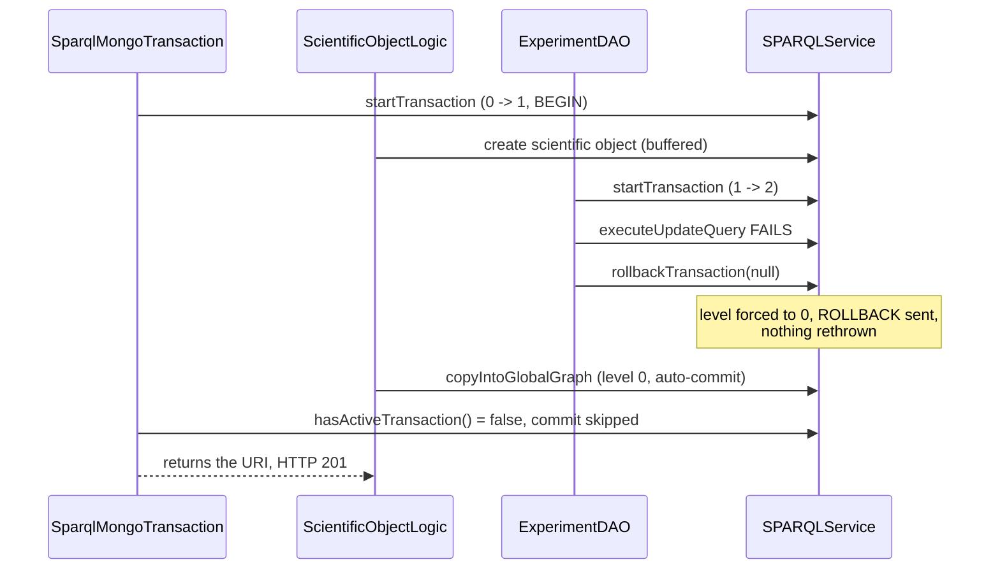

# Technical documentation : [`sparql`] ORM bugs, resource leaks and memory-retention risks

**Document history (please add a line when you edit the document)**

| Date       | Editor(s)        | OpenSILEX version | Comment           |
|------------|------------------|-------------------|-------------------|
| 2026-09-11 | Arnaud Charleroy | BUILD-SNAPSHOT    | Document creation |

## Table of contents

<!-- TOC -->
- [Status and confidence](#status-and-confidence)
- [Summary table](#summary-table)
- [Transaction and lifecycle defects](#transaction-and-lifecycle-defects)
- [Concurrency hazards](#concurrency-hazards)
- [Correctness defects](#correctness-defects)
- [Memory retention risks](#memory-retention-risks)
- [Resource leaks](#resource-leaks)
- [Defects in calling modules that the ORM API invites](#defects-in-calling-modules-that-the-orm-api-invites)
- [Examined and found sound](#examined-and-found-sound)
- [Suggested guard rails](#suggested-guard-rails)
- [See also](#see-also)
<!-- TOC -->

## Status and confidence

**This is a static reading of the code. Nothing below was reproduced against a running instance** —
no heap dump, no leak test, no integration test. Every line citation was re-checked against the
working tree while writing this document.

Each item was produced by an audit pass and then challenged by two independent reviewers whose
default position was that the claim is wrong. Only items neither reviewer refuted appear here, with
their corrections applied — which usually means a **narrower trigger and a lower severity** than the
original claim. Where a reviewer proved a trigger unreachable, the item is restated with the
reachable trigger or moved to [Examined and found sound](#examined-and-found-sound).

**Confidence**: `high` = the mechanism is in the code and the trigger is an ordinary path;
`medium` = the trigger needs a specific failure (store error, concurrency, unusual input) that
nothing in the tree demonstrates; `low` = a latent API trap with no caller today.

**Severity** is deliberately conservative. `high` is reserved for silent data loss or instance-wide
breakage. Nothing here takes a JVM down on its own.

What turns a risk into a confirmed bug:

| Item class | Experiment that settles it |
|---|---|
| Transaction counter (RISK-01, -05, -06, -18) | An integration test that fails an inner ORM call inside an outer transaction, then asserts the outer write is absent from the store. |
| Ontology store (RISK-02, -03, -10) | Two threads, one looping on `reload()`, one on `getClassModel`; count `SPARQLInvalidURIException` and `IllegalArgumentException`. |
| Proxy retention (RISK-09, -32, -33) | A heap dump after N requests filtered on `SPARQLService`: more than one live instance per in-flight request is the leak. |
| Result-set leaks (RISK-15, -16) | Sample `RDF4JConnection.connectionCount` and the RDF4J background-parser thread count while forcing the failure path. |
| Datatypes (RISK-04, -14) | A CSV fixture with `1` on an `xsd:boolean` restriction and a 15-digit `xsd:decimal`; read the stored literal back. |

## Summary table

Sorted by severity, then confidence.

| ID | Title | Kind | Severity | File | Confidence |
|----|-------|------|----------|------|------------|
| RISK-01 | An inner rollback zeroes the shared transaction counter | transaction | high | `SPARQLService.java:316` | high |
| RISK-02 | `ClassModel`'s copy constructor aliases three maps and pollutes the store | concurrency | high | `ClassModel.java:85` | high |
| RISK-03 | `reload()` clears the live ontology store in place, unlocked, without rollback | concurrency | high | `AbstractOntologyStore.java:124` | high |
| RISK-04 | Eight XSD numeric types collapse onto five Java classes | correctness | high | `SPARQLDeserializers.java:44` | medium |
| RISK-05 | `rollbackTransaction(ex)` is a total no-op at level 0, rethrow included | transaction | medium | `SPARQLService.java:317` | high |
| RISK-07 | The ontology store's service is never disposed and is driven from request threads | lifecycle | medium | `SPARQLModule.java:218` | high |
| RISK-08 | `install()` swallows an ontology-load failure and exits 0 | lifecycle | medium | `SPARQLModule.java:161` | high |
| RISK-09 | One generated class and one classloader per proxied field per row | memory | medium | `SPARQLProxy.java:43` | high |
| RISK-10 | `handleLang` rewrites the stored labels of a whole subtree | concurrency | medium | `AbstractOntologyStore.java:416` | high |
| RISK-14 | `xsd:boolean` in `1`/`0` lexical form deserializes to `false` | correctness | medium | `BooleanDeserializer.java:22` | high |
| RISK-06 | `deleteClass` swallows its failure and destroys the caller's transaction | transaction | medium | `OntologyDAO.java:175` | medium |
| RISK-11 | `generateUniqueURI` does check-then-act on a shared cache | concurrency | medium | `SPARQLService.java:1309` | medium |
| RISK-12 | A proxy whose row is missing caches a `null` delegate forever | correctness | medium | `SPARQLProxy.java:63` | medium |
| RISK-13 | The CSV validation cache is read-then-invalidated, not claimed | concurrency | medium | `CachedCsvImporter.java:89` | medium |
| RISK-15 | RDF4J result sets are closed after the loop, not in a `finally` | resource-leak | low | `RDF4JConnection.java:361` | high |
| RISK-16 | `checkUrisUniqueness` breaks out of a lazy stream's iterator | resource-leak | low | `AbstractCsvImporter.java:549` | high |
| RISK-17 | `RDF4JServiceFactory` never shuts down its repository or connection manager | resource-leak | low | `RDF4JServiceFactory.java:62` | high |
| RISK-18 | `commitTransaction()` decrements before it commits | transaction | low | `SPARQLService.java:308` | high |
| RISK-19 | `enableSHACL()` drives `begin`/`commit` on the raw RDF4J connection | transaction | low | `RDF4JConnection.java:423` | high |
| RISK-21 | `addClasses()` re-runs a non-idempotent `init()` on every mapper | lifecycle | low | `SPARQLClassObjectMapperIndex.java:89` | high |
| RISK-22 | The CSV validation cache is bounded by entry count, not by weight | memory | low | `CachedCsvImporter.java:65` | high |
| RISK-23 | Two proxies of the same URI are never equal | correctness | low | `SPARQLProxy.java:46` | high |
| RISK-24 | `SPARQLProxyListObject.getSize()` drops its own `GRAPH` scoping | correctness | low | `SPARQLProxyListObject.java:68` | high |
| RISK-25 | `getAncestorHierarchy` formats only the ancestor URI | correctness | low | `AbstractOntologyStore.java:318` | high |
| RISK-20 | Shutdown wipes the global prefix registry; two overloads have no null guard | lifecycle | low | `URIDeserializer.java:76` | medium |
| RISK-26 | Lazily-loaded relations carry no Java type and lose their direction | correctness | low | `SPARQLProxyRelationList.java:44` | low |
| RISK-27 | `ignoreUpdateIfNull` is read from a shadowed `Field` that is never written | correctness | low | `SPARQLClassQueryBuilder.java:409` | low |
| RISK-28 | A label read in an absent language is stamped with the requested language | correctness | low | `SPARQLProxyLabel.java:39` | low |
| RISK-29 | `deserializersMap` is published before it is filled | concurrency | informational | `SPARQLDeserializers.java:124` | high |
| RISK-30 | `installOntologies` closes its `FileInputStream` outside try-with-resources | resource-leak | informational | `SPARQLExtension.java:38` | high |
| RISK-31 | `SPARQLCommands` disposes one service twice and misses two `finally` blocks | resource-leak | informational | `SPARQLCommands.java:46` | high |

RISK-32 to RISK-35 live in other modules and are in
[their own section](#defects-in-calling-modules-that-the-orm-api-invites).

## Transaction and lifecycle defects

The whole transaction state of [SPARQLService](../../../../../../opensilex-sparql/src/main/java/org/opensilex/sparql/service/SPARQLService.java)
is one `int`, with no savepoints, no rollback-only flag and no owner:

```java
// SPARQLService.java:290-328
private int transactionLevel = 0;

public void startTransaction() throws SPARQLException {
    if (transactionLevel == 0) { connection.startTransaction(); }
    transactionLevel++;
}

public void commitTransaction() throws SPARQLException {
    transactionLevel--;
    if (transactionLevel == 0) { connection.commitTransaction(); }
}

public void rollbackTransaction(Exception ex) throws Exception {
    if (transactionLevel != 0) {
        transactionLevel = 0;                   // whatever the nesting depth
        connection.rollbackTransaction(ex);     // also the ONLY thing that rethrows ex
    }
}
```

Four of the five defects below follow from those twelve lines.
[Transactions, URI and validation](./orm/06-transactions-uri-and-validation.md) states the intended
contract.

### RISK-01 — an inner rollback zeroes the shared counter; the caller's commit becomes a no-op

`high` · confidence `high`

**Symptom.** `POST /core/scientific_objects` in an experimental context returns `201 Created` with a
URI, but the object is not in the experiment graph. Only the partial copy written *after* the
rollback (`rdf:type`, `rdfs:label`, plus `dcterms:publisher`/`issued`/`modified` when set) and the
MongoDB move event survive. The API layer reports nothing.

**Trigger.** Any `SPARQLException` from the three `executeUpdateQuery` calls in
`ExperimentDAO.updateExperimentSpeciesFromScientificObjects` (`ExperimentDAO.java:791-801`) while a
scientific object is created inside an experiment — a max-execution-time expiry, a store error, a
`MalformedQuery` on a custom vocabulary.

**Mechanism.** `SparqlMongoTransaction.execute` opens the transaction (level 1) and runs the creation
lambda. `ExperimentDAO` opens level 2, fails, and calls the no-arg rollback:

```java
// ExperimentDAO.java:791-801 (opensilex-core)
sparql.startTransaction();
try { ... sparql.commitTransaction(); }
catch (SPARQLException e) {
    LOGGER.error("Error while updating species of experiment " + experimentUri, e);
    sparql.rollbackTransaction();          // ex == null -> nothing is rethrown
}
```

That forces `transactionLevel = 0` and rolls back *the caller's* writes, then returns normally. The
rest of the lambda runs at level 0 and auto-commits. `SparqlMongoTransaction` gates its commit on
`sparql.hasActiveTransaction()` (`SparqlMongoTransaction.java:87`), which delegates to
`RepositoryConnection.isActive()` and is now `false`, so the commit is skipped and the URI is
returned as a success.



**Blast radius.** Every write path nesting DAO calls inside `SparqlMongoTransaction` or another DAO's
transaction. Silent on both the API and the log.

**Fix.** Mark the transaction rollback-only instead of zeroing the counter, and make
`commitTransaction()` throw when asked to commit a rollback-only transaction. Short term: forbid the
no-arg `rollbackTransaction()` in nested helpers, and let `SparqlMongoTransaction` commit on its own
counter rather than on `isActive()`.

**Confirm it.** Wrap a throwing DAO call in `new SparqlMongoTransaction(...).execute(...)` and `ASK`
for the outer write's triple: absent, while the endpoint returns 201.

### RISK-05 — `rollbackTransaction(ex)` is a total no-op at level 0, rethrow included

`medium` · confidence `high`

**Symptom.** `PUT /ontology/property` returns `200 OK` with the property URI when the update was
rejected and rolled back. The RAM store is then reloaded from the unchanged triple store, so the
front end shows the old definition with no error — a silent lost update on an admin-only endpoint.

**Trigger.** A domain, range or parent URI absent from the store
(`SPARQLInvalidUriListException`), or a property URI that is not stored
(`SPARQLNotExistingUriListException`).

**Mechanism.** The rethrow lives *inside* the level guard, and a two-level chain always reaches the
outer catch with the counter already at 0, because the inner ORM call zeroed it:

```java
// OntologyDAO.java:685-695
try {
    sparql.startTransaction();                 // 0 -> 1
    sparql.update(customGraph, property);      // 1 -> 2, fails; SPARQLService.java:1528-1531
                                               // rolls back (level -> 0) and rethrows
    updateRestrictionRangeOnProperty(...);
    sparql.commitTransaction();
} catch (Exception e) {
    sparql.rollbackTransaction(e);             // level == 0: whole body skipped, e never rethrown
}                                              // returns normally -> the API answers 200
```

`updateObjectProperty` (`:697-707`) has the same shape.

**Reviewer correction, applied.** The delete path of the original claim does **not** hold:
`deleteProperty` resolves the property first and throws `IllegalArgumentException` when it is
missing, and `SPARQLService.delete` raises `NotFoundURIException` from `loadByURI` *before* its own
`startTransaction`, so that catch still sees level 1 and does roll back and rethrow. Only the update
path is reachable.

**Fix.** Move the rethrow out of the level guard — a non-null `ex` must always be rethrown, and a
rollback with no transaction open should log loudly — and add the missing `throw e;`, or route these
methods through `withTransaction(...)`.

**Confirm it.** `PUT /ontology/property` with a non-existent `rdfs:domain`, then `ASK` whether the
property changed. A 200 with unchanged triples is the bug.

### RISK-06 — `deleteClass` swallows its failure and destroys the caller's transaction

`medium` · confidence `medium`

**Symptom.** `DELETE /vuejs/owl_extension/rdf_type/{uri}` answers `200 "Class deleted"` while the OWL
class and its restrictions are still stored; only the `VueClassExtensionModel` is removed, committed
on its own. The service is left at `transactionLevel == -1`, so further writes in that request run
with no transaction.

**Trigger.** Any store-level error inside the `try` — a failure or timeout on the restriction
`executeUpdateQuery`, or anything inside `SPARQLService.delete`'s cascade.

**Reviewer correction, applied.** "Delete the same custom type twice" is *not* reachable:
`VueOwlExtensionDAO.deleteClassWithExtension` resolves the extension class first and throws
`DisplayableBadRequestException` when it is null, before any transaction; and `deleteClass` passes
`graph == null`, so `NotFoundURIException` there is effectively unreachable.

**Mechanism.**

```java
// OntologyDAO.java:161-177
sparql.startTransaction();                      // caller already at level 1 -> level 2
try {
    sparql.executeUpdateQuery(deleteRestrictionOnClass);
    sparql.delete(null, ClassModel.class, classURI);
    sparql.commitTransaction();
} catch (Exception e) {
    sparql.rollbackTransaction();               // level forced to 0, nothing rethrown
}
```

The caller's next `sparql.delete(...)` starts from level 0 and commits its own transaction; the
caller's `commitTransaction()` then takes 0 to `-1`, the `if (transactionLevel == 0)` test fails, and
no commit and no error are produced. A later `startTransaction()` brings the counter back to 0
without calling `connection.startTransaction()`, so those writes auto-commit one by one.

**Blast radius.** One admin endpoint, and the negative counter for the rest of that request — the
service is request-scoped, so it does not outlive it.

**Fix.** `deleteClass` must rethrow, or manage no transaction and run inside the caller's.
Independently, make `commitTransaction()` throw `IllegalStateException` rather than drive the counter
negative. **Confirm it.** Point at a store that rejects the restriction `DELETE`; the OWL class
survives a 200 response.

### RISK-07 — the ontology store's `SPARQLService` is never disposed, and request threads share it

`medium` · confidence `high`

**Symptom.** One `RepositoryConnection` is leased at every application start and never returned.
Worse than the descriptor: that single connection is the one every ontology reload runs on, from
arbitrary Jersey threads. RDF4J documents `RepositoryConnection` as not thread-safe, so two
overlapping reloads give interleaved or aborted result rows, `RepositoryException`, or an
`IllegalArgumentException` ("URI already exist") from `AbstractOntologyStore.addAll`.

**Trigger.** Unconditional at startup for the connection. The concurrency half needs two overlapping
calls to the admin-only reload endpoints (`OntologyAPI.java:245, 251, 283, 288, 355, 358, 580`;
`VueOwlExtensionAPI.java:111, 138, 185`).

**Mechanism.** [SPARQLModule](../../../../../../opensilex-sparql/src/main/java/org/opensilex/sparql/SPARQLModule.java)
provides a service and hands it to the store, with no dispose and no `shutdown()` override:

```java
// SPARQLModule.java:218-219
SPARQLService sparql = factory.provide();
SPARQLModule.initOntologyStore(getOpenSilex(), sparql);
```

`AbstractOntologyStore` keeps it in a final field and rebuilds an `OntologyStoreLoader` around it on
every `load()` (`:127`); the store itself is `private static OntologyStore ontologyStore;`
(`SPARQLModule.java:51`). The two sibling paths in the same class get it right: `install()` disposes
in a `finally` (`:163`); `check()` disposes after the loop (`:176`, *not* in a `finally`, so a failing
`opensilex system check` leaks its connection too).

**Reviewer correction, applied.** The transaction counter of that service is **not** at risk —
everything the store does with it is read-only, so `transactionLevel` never leaves 0. The leak is
exactly one connection for the JVM's life, not a growing one: one slot out of the 20 configured per
route (`RDF4JServiceFactory.java:70-71`). The unsynchronised cross-thread use is the part that
matters.

**Fix.** Acquire a service from the factory inside `load()` and dispose it in a `finally` — which
also removes the cross-thread reuse — or keep the dedicated connection and close it from a
`SPARQLModule.shutdown()` override. Put the `check()` dispose in a `finally`.

**Confirm it.** The `RDF4JConnection.connectionCount` gauge (`:58`, `:73`, DEBUG) does not return to
0 across a start/stop cycle.

### RISK-08 — `install()` swallows an ontology-load failure and reports success

`medium` · confidence `high`

**Symptom.** `opensilex system install` creates the repository, fails to load one or more ontology
files, logs one line reading `Error while initializing SHACL` — which does not mention ontologies at
all — and exits 0. The deployment then starts against a repository whose vocabulary graphs are
missing or partial; the first visible symptom comes much later, when the store loads nothing and
every typed API call fails.

**Trigger.** Any exception from `installOntologies`: a missing or corrupt artifact, a Jena parse
error, or the store rejecting the single large `INSERT DATA` that `loadOntology` builds per file.
Each file is one statement, so a mid-run failure leaves earlier files loaded.

**Mechanism.** The generic catch was written for the SHACL step but covers the load too:

```java
// SPARQLModule.java:147-164
try {
    installOntologies(sparqlService, reset);
    if (sparqlConfig.enableSHACL()) { sparqlService.enableSHACL(); } else { sparqlService.disableSHACL(); }
}
catch (SPARQLValidationException ex) { LOGGER.warn(...); }
catch (Exception ex) { LOGGER.error("Error while initializing SHACL", ex); }
finally { sparqlFactory.dispose(sparqlService); }
```

`install()` returns normally, so `OpenSilex.install()`, which does rethrow, never sees a failure.
`check()` exists (`:168-177`) but is a separate CLI command that `install` never calls.

**Blast radius.** Automated installs and container entrypoints that branch on the exit code.

**Fix.** Move the SHACL block into its own `try`, let `installOntologies` propagate, and run the
equivalent of `checkOntologies` at the end of `install`. **Confirm it.** Truncate one `.owl` artifact
in the built jar and run the command: `echo $?` prints 0.

### RISK-18, RISK-19, RISK-20, RISK-21 — four lower-severity items on the same contracts

**RISK-18 — `commitTransaction()` decrements before it commits** (`low`, confidence `high`). When
`connection.commitTransaction()` throws, the counter is already 0, so every catch that calls
`rollbackTransaction(ex)` hits the level guard and issues no `ROLLBACK`. Triggers: a store error or
timeout at commit time, or a SHACL violation, which RDF4J reports at commit. *Reviewer correction,
applied:* "the transaction stays open forever" does not hold for request-scoped services —
`SPARQLService` is bound `RequestScoped` (`RestApplication.java:214-215`), so `dispose()` closes the
connection at the end of every request and RDF4J rolls an active transaction back there; and
`clearGraphs`, `renameTripleURI` and `withTransaction` all rethrow, so the *error* is not hidden,
only the explicit `ROLLBACK` is lost. The unbounded variant applies only to the never-disposed
service of RISK-07. **Fix:** commit first and decrement on success
(`if (transactionLevel == 1) { connection.commitTransaction(); } transactionLevel--;`), and make
`rollbackTransaction` fall back to `connection.hasActiveTransaction()` rather than the counter.

**RISK-19 — `enableSHACL()` drives `begin`/`commit` on the raw RDF4J connection** (`low`, confidence
`high`). [RDF4JConnection](../../../../../../opensilex-sparql/src/main/java/org/opensilex/sparql/rdf4j/RDF4JConnection.java)
opens and commits its own transaction directly (`:423-440`), so `SPARQLService.transactionLevel`
never sees it. `clearGraph(IRI)` converts store errors to `SPARQLException`, which does not match
`enableSHACL`'s `catch (RepositoryException ex)`, so nothing rolls the begun transaction back — and
`SPARQLCommands.shaclEnable` calls `factory.dispose(sparql)` as the last statement (`:82`), not in a
`finally`, so the connection is not closed either. Exposure is one admin CLI command whose process
exits immediately; the orphaned server-side transaction lives until the store's own timeout.
**Fix:** route it through the service's transaction methods, catch `Exception` with a rollback, and
use the `try`/`finally` shape `shaclDisable` (`SPARQLCommands.java:94-99`) already has.

**RISK-20 — shutdown wipes the global prefix registry, and two overloads have no null guard**
(`low`, confidence `medium`). `SPARQLServiceFactory.shutdown()` is two lines (`:124-127`) and both
wipe JVM-global statics. The read paths are asymmetric: `formatURI(URI)` guards `prefixes == null`
(`URIDeserializer.java:40`), the two `String` forms do not —
`return usePrefixes ? prefixes.shortForm(uri) : prefixes.expandPrefix(uri);`
(`URIDeserializer.java:76`) NPEs once the registry is cleared. *Reviewer correction, applied:* both
cross-test chains of the original claim are wrong — `SparqlUrisQueryTest` builds its own
`OpenSilexTestEnvironment` rather than the shared singleton, and `UserCommandsTest` runs in a
different surefire JVM from the `opensilex-core` tests. The surviving triggers are a second
OpenSilex start in one JVM, and a class whose static initializers call the unguarded overloads being
first loaded while the prefixes are null (`AbstractOntologyStore.java:61-62` does exactly that for
its two root URI constants). Requests in flight during a SIGTERM were going to fail anyway.
**Fix:** add the guard to both `String` overloads in `URIDeserializer` and `UriFormater` (return the
input unchanged), make the `AbstractOntologyStore` root URIs lazily computed, and longer term move
the prefix mapping onto the factory instance. See
[Type system and deserializers](./orm/08-type-system-deserializers.md).

**RISK-21 — `addClasses()` re-runs a non-idempotent `init()` on every mapper** (`low`, confidence
`high`, latent API trap). `SPARQLClassObjectMapperIndex.addClasses(Collection)` creates mappers for
the new classes, then iterates **all** of them (`:88-91`, `mapperUninit.init()`), and `init()`
derives the graph URIs from its own mutable fields:

```java
// SPARQLClassObjectMapper.java:106-113
if (classGraph.isAbsolute()) { generationPrefixURI = classGraph; baseGraphURI = classGraph; }
else {
    generationPrefixURI = new URI(generationPrefixURI + URIGenerator.URI_SEPARATOR + classGraph);
    baseGraphURI = new URI(baseGraphURI + DEFAULT_GRAPH_KEYWORD + URIGenerator.URI_SEPARATOR + classGraph);
}
```

A second pass therefore concatenates on top of the first for a **relative**
`@SPARQLResource(graph = ...)`: `.../set/organization` becomes `.../set/organization/organization`.
Absolute graphs are idempotent, which is why this is invisible for most models; the relative ones in
production are `OrganizationModel`, `ProjectModel` and `VariablesGroupModel`. *Reviewer correction,
applied:* there is **no production caller** — every second `addClasses` call in the tree is
test-fixture code, so this is a trap in the ORM's public API (a module registering a model class at
runtime would silently corrupt every relative graph), not a live corruption path. A second
consequence: `Arrays.asList(newClasses)` is fixed-size, so the `newClasses.removeIf(...)` at `:77`
throws `UnsupportedOperationException` if a `@SPARQLManualLoading` class reaches the varargs
overload. **Fix:** init only the mappers created in this call, or derive the graph URIs into
separate result fields; and pass a mutable list to the private overload. See
[Object mapper and index](./orm/02-object-mapper-and-index.md).

## Concurrency hazards

Nothing in `opensilex-sparql` is synchronized except `RDF4JServiceFactory`'s provide/dispose monitor.
`SPARQLService` and its connection are single-threaded by contract (one per request); the ontology
store is a JVM-global singleton read by every request thread. All four hazards live at that boundary.

### RISK-02 — `ClassModel`'s copy constructor aliases three maps and pollutes the store

`high` · confidence `high`

**Symptom.** A class silently accumulates its ancestors' data properties, object properties and OWL
restrictions for the rest of the JVM's life: the ontology editor shows a type with properties it does
not declare, and CSV restriction validation accepts or rejects the wrong columns. Under concurrency
the same line is an unsynchronized `HashMap.put` from several threads — lost entries, or a `get()`
returning null for a key just written.

**Trigger.** Any request asking for an `rdf_type` with a non-null ancestor. **The pollution half
needs no concurrency at all** — one request is enough, and the effect is permanent.

**Mechanism.** The store takes what it believes is a private working copy, then writes inherited
members into it:

```java
// AbstractOntologyStore.java:411-414
// compute a ClassModel which take care of parent and lang
ClassModel finalModel = new ClassModel(model);
inheritFromSuperClasses(ancestorURI, finalModel, true, true, true);
```

But the copy constructor aliases the three maps instead of copying them:

```java
// ClassModel.java:85-87
datatypeProperties = other.getDatatypeProperties();
objectProperties  = other.getObjectProperties();
restrictionsByProperties = other.getRestrictionsByProperties();
```

so `finalModel`'s maps **are** the stored model's maps, and the inheritance writes straight into the
store: `ancestorModel.getDatatypeProperties().values().forEach(property -> classModel.getDatatypeProperties().put(property.getUri(), property));`
(`AbstractOntologyStore.java:349`, and `:352`, `:358`). The maps are plain `new HashMap<>()`
(`ClassModel.java:51-53`) and no lock exists anywhere in the store.

**Blast radius.** The single static store, until the next successful reload.
`getLinkableDataProperties` and `getLinkableObjectProperties` (`:523`, `:548`) rely on the same copy.

**Fix.** One change fixes both halves — allocate fresh maps in the copy constructor:
`datatypeProperties = new HashMap<>(other.getDatatypeProperties());` and likewise for the other two.

**Confirm it.** Call `GET /ontology/rdf_type` for a child type with an `ancestor` twice, then once
*without* it: the inherited properties are still there.

### RISK-03 — `reload()` clears the live ontology store in place, unlocked and without rollback

`high` · confidence `high`

**Symptom.** While an administrator saves a class, property or restriction, concurrent requests
intermittently fail with `SPARQLInvalidURIException("owl:Class URI not found : ...")` on classes that
do exist, or get an empty or wrong class tree. The errors clear when the reload finishes, which makes
them look like random flakiness. If the reload query itself fails, the store stays empty and every
later CSV import, object creation and ontology-driven read fails until some later reload succeeds.

**Trigger.** Any admin-only endpoint ending with `SPARQLModule.getOntologyStoreInstance().reload()`,
issued while others browse. Two concurrent reloads additionally hit `IllegalArgumentException`
("URI already exist") from `addAll` — that variant is **not** self-healing and leaves the store
partial.

**Mechanism.** `reload()` is the interface default `clear(); load();` (`OntologyStore.java:45-48`),
and `load()` clears again at `:128`. The containers are explicitly non-thread-safe —
`DefaultOntologyStore.java:26` passes a `PatriciaTrie` and a `SimpleDirectedGraph` — and there is no
lock, no copy-on-write and no atomic swap:

```java
// AbstractOntologyStore.java:163-170
public void clear() {
    modelsByUris.clear();
    if (!modelsGraph.vertexSet().isEmpty()) {
        Set<String> vertexesCopy = new HashSet<>(modelsGraph.vertexSet());
        modelsGraph.removeAllVertices(vertexesCopy);
    }
}
```

Readers watch the store empty and refill. `load()`'s `catch (Exception e) { throw new SPARQLException(e); }`
(`:157-159`) leaves it cleared.

**Reviewer corrections, applied.** Readers do not mutate the trie or graph themselves, so the
`ConcurrentModificationException` symptom is dropped; the trigger needs an admin write, so the
overlap is occasional rather than routine; and "until the JVM is restarted" is wrong — any later
successful reload restores the store.

**Blast radius.** Instance-wide, for the duration of three SPARQL queries over the whole vocabulary
(hundreds of milliseconds to seconds, per the startup log line the same code emits). See
[Ontology store and OWL](./orm/09-ontology-store-and-owl.md).

**Fix.** Do not mutate the live store: build a fresh `DefaultOntologyStore` with its own trie and
graph, load it, then publish it with a single volatile assignment, so readers always see a complete
snapshot and a failed load changes nothing. A `ReentrantReadWriteLock` is the minimal alternative.

**Confirm it.** One thread looping on `reload()`, one on `getClassModel`; count the exceptions.

### RISK-10 — `handleLang` rewrites the stored labels of a whole subtree

`medium` · confidence `high`

**Symptom.** Labels come back in the wrong language, mixed languages in one response, or torn —
`setDefaultLang` and `setDefaultValue` are two separate non-atomic writes. The wrong value then
persists in the store until some other request re-languages it.

**Trigger.** Two users with different `Accept-Language` on any ontology-backed endpoint. **It is not
only a race**: `SPARQLRelationFetcher` (in `opensilex-core`) re-languages stored subtrees to the
default language on ordinary listings, and the `containsKey` guard leaves another request's language
in place when a translation is missing — both happen with no concurrency at all.

**Mechanism.** `handleLang` copies nothing; it calls the setters on `SPARQLLabel` objects that belong
to the store (`ClassModel.java:66` shares the label reference):

```java
// AbstractOntologyStore.java:371-375
SPARQLLabel label = model.getLabel();
if (label.getTranslations().containsKey(lang)) {
    label.setDefaultLang(lang);
    label.setDefaultValue(label.getTranslations().get(lang));
}
```

And line `:416` walks the **stored** subtree, not the copy:

```java
// AbstractOntologyStore.java:415-416
handleLang(lang, finalModel);
model.visit(descendant -> handleLang(lang, descendant));   // `model` is the stored instance
```

Same pattern at `:475` and `:574-575`.

**Fix.** Have `handleLang` return a resolved (value, language) pair that the per-request DTO consumes,
and drop the `model.visit(...)` walk — the caller only serializes the copy it was handed.

**Confirm it.** Request a class tree with `lang=fr`, then with `lang=en` for a class with no English
label: the French label comes back tagged `en`.

### RISK-11 — `generateUniqueURI` does check-then-act on a shared cache

`medium` · confidence `medium`

**Symptom.** Two objects created in the same instant share one URI. RDF has no uniqueness constraint,
so nothing fails: the triples merge into one resource and a later `GET` returns a single object
carrying both names and types.

**Trigger.** Two concurrent creations whose generated URI is identical — same class, same name: a
double-submitted form creating `plot-1` in one experiment, or two parallel CSV imports over
overlapping content. Both threads see the URI as free because neither has committed its INSERT.

**Mechanism.** The test and the claim are separate operations:

```java
// SPARQLService.java:1308-1316
if (checkUriExist) {
    boolean uriALreadyExists = generatedUriCache.getIfPresent(uri) != null || uriExists(graph, uri);
    while (uriALreadyExists) {
        uri = uriGenerator.generateURI(prefix, instance, ++retry);
        uriALreadyExists = generatedUriCache.getIfPresent(uri) != null || uriExists(graph, uri);
    }
}
instance.setUri(uri);
generatedUriCache.put(uri, Boolean.TRUE);
```

Caffeine is thread-safe but `getIfPresent`/`put` is not a compare-and-set, and `uriExists` only sees
committed triples. `generateUniqueUriIfNullOrValidateCurrent` takes the `uri == null` branch and so
skips the `SPARQLAlreadyExistingUriException` check — no second line of defence. The cache is also
`private static final` with a URI-only key (`:103-106`), so a URI reserved in one graph perturbs
generation in an unrelated graph for 30 seconds.

**Fix.** Claim atomically —
`while (generatedUriCache.asMap().putIfAbsent(uri, TRUE) != null || uriExists(graph, uri)) { ... }` —
and include the graph in the key. **Confirm it.** Two threads calling `create` with the same name
under a latch; assert two distinct URIs.

### RISK-13 — the CSV validation cache is read-then-invalidated, not claimed

`medium` · confidence `medium`

**Symptom.** Two overlapping imports of the same CSV content each run the full upsert, so the file is
imported twice (duplicate objects, or `SPARQLAlreadyExistingUriException` on the loser). The sharper
edge is a silent partial import: one thread calls `getObjects().clear()` while the other iterates the
same list.

**Trigger.** Two posts of the same CSV bytes with the same validation token inside the 5-minute TTL —
a double-clicked Import, a retried request, two users importing the same template.

**Mechanism.** The cache key is only the file's CRC32, so it is shared across users, endpoints and
model types; `getIfPresent` is a read, not a claim, so both threads proceed:

```java
// CachedCsvImporter.java:88-89, 124-129
String checksum = String.valueOf(TokenGenerator.getFileChecksum(file, new CRC32()));
CSVValidationModel validationModel = validationCache.getIfPresent(checksum);
...
validationCache.invalidate(checksum);
fallback.upsert(validationModel, (List<T>) validationModel.getObjects(),
                                 (List<T>) validationModel.getObjectsToUpdate());
validationModel.getObjects().clear();
validationModel.getObjectsToUpdate().clear();
```

**Reviewer correction, applied.** "A half-empty validation report is serialized" does not hold:
`getObjects()` and `getObjectsToUpdate()` are `@JsonIgnore` (`CSVValidationModel.java:33, 36`).

**Fix.** Claim the entry atomically —
`CSVValidationModel claimed = validationCache.asMap().remove(checksum);`, proceed only when non-null
— key the cache on the validation token (or token + account + checksum), and stop clearing the cached
model's lists in place. See [CSV pipeline](./orm/11-csv-pipeline.md).

### RISK-29 — `deserializersMap` is published before it is filled

`informational` · confidence `high` · latent

`SPARQLDeserializers.deserializersMap` is a non-volatile static read through a plain null check, and
`buildDeserializersMap` assigns the reference at `:124` and only then fills it at `:126-133`. A
concurrent reader could see a non-null but empty `HashBiMap` and throw
`SPARQLDeserializerNotFoundException` for an ordinary type.

**There is no reachable trigger today**, and that is worth stating plainly rather than dressing up:
`SPARQLClassObjectMapper`'s constructor calls `getForClass(OffsetDateTime.class)` for every model
class during the single-threaded factory startup, so the map is always built before any request
thread exists. The race is masked by call order, not by the code. Treat it as cheap hardening —
build into a local, assign once, make the field `volatile`. The sibling `datatypeClassMap` is a plain
`HashMap` with one startup-time mutator and deserves the same.

## Correctness defects

### RISK-04 — eight XSD numeric types collapse onto five Java classes

`high` · confidence `medium`

**Symptom.** Values stored with the wrong datatype and silently truncated: `3.14159265358979` on an
`xsd:decimal` restriction is persisted as `"3.1415927"^^xsd:float`. A 20-digit value on an
`xsd:integer` restriction passes validation — the API reports the rows as importable — then throws an
unchecked `NumberFormatException` out of `Integer.valueOf` during the INSERT.

**Trigger.** CSV import or a REST custom-relation payload on a property whose `owl:onDataRange` is
`xsd:decimal` (offered by the ontology editor as `VueDecimal`), or an `xsd:integer` value outside the
`int` range.

**Mechanism.** `datatypeClassMap` maps each XSD type onto a Java class
(`SPARQLDeserializers.java:44-55`), including `XSDdecimal -> Float.class` and
`XSDinteger -> Integer.class`. `getForDatatype` (`:101-109`) returns the deserializer registered for
that Java class, and `OwlRestrictionValidator` validates with **that deserializer's own**
`getDataType()`, not with the restriction's declared range. The literal written back carries the
deserializer's datatype too, so an `xsd:decimal` restriction ends up with an `xsd:float` literal in
the store. `BigIntegerDeserializer` declares `XSDinteger` but is unreachable, because the map already
routes `xsd:integer` to `Integer.class`.

**Reviewer correction, applied.** The original trigger list is too wide: `xsd:nonNegativeInteger`,
`positiveInteger`, `nonPositiveInteger`, `negativeInteger` and the four `unsigned*` types appear in
**no** `owl:onDataRange` in any shipped ontology and are not offered by the editor, so the
"out-of-range value accepted" and "legitimate value rejected" symptoms are latent. Reachable today:
decimal truncation and integer overflow.

**Fix.** Validate against `restriction.getOnDataRange()` rather than the deserializer's own
`getDataType()`, and register a deserializer per XSD type — at minimum reject values outside the
declared type's value space before handing them to the narrower Java parser. See
[Type system and deserializers](./orm/08-type-system-deserializers.md).

**Confirm it.** Import `3.14159265358979` on an `xsd:decimal` property and read the raw literal back.

### RISK-14 — `xsd:boolean` in `1`/`0` lexical form deserializes to `false`

`medium` · confidence `high`

Validation and deserialization use two different notions of a boolean.
[BooleanDeserializer](../../../../../../opensilex-sparql/src/main/java/org/opensilex/sparql/deserializer/BooleanDeserializer.java)
overrides no `validate()`, so the default `getDataType().isValid(value)` applies — and
`XSDDatatype.XSDboolean.isValid("1")` is `true`, since the XSD 1.0 boolean lexical space is
`{true, false, 1, 0}`. But:

```java
// BooleanDeserializer.java:22-24
public Boolean fromString(String value) throws Exception {
    return Boolean.valueOf(value);        // "1" -> FALSE
}
```

So `1` is accepted and stored as `"false"^^xsd:boolean`, with no error and no warning. The
inconsistency is symmetric: `isValid("TRUE")` is `false` so `TRUE` is rejected, while
`Boolean.valueOf("TRUE")` is `true`. Any pre-existing `"1"^^xsd:boolean` triple written by another
tool is read as `false`.

**Reviewer correction, applied.** Reachability is broader than CSV import:
`OntologyDAO.validateThenAddObjectRelationValue` (`OntologyDAO.java:472`) repeats the same
`validate()`/`fromString()` split and is the path used by every REST custom-relation payload.

**Fix.** Give `BooleanDeserializer` a `fromString` following the XSD lexical space and a matching
`validate()`, so the two agree on exactly the same accepted strings.

### RISK-12 — a proxy whose row is missing caches a `null` delegate forever

`medium` · confidence `medium`

**Symptom.** A plain getter on a nested model throws `NullPointerException` with a stack trace
containing only `Method.invoke`, `SPARQLProxy.invoke` and `net.bytebuddy...InvocationHandlerAdapter`
— no OpenSILEX frame names the missing URI. The proxy is then poisoned: `loaded` is `true`, so every
later call NPEs too, while `getUri()` still answers correctly, which makes it look alive.

**Trigger.** Any mono-valued object property whose target row does not come back — the referenced
resource was deleted without its inverse triples being cleaned, or the proxy's graph does not contain
the target.

**Mechanism.** `SPARQLService.loadByURI` returns `null` when the SELECT yields no row,
`SPARQLProxyResource.loadData` propagates it, and:

```java
// SPARQLProxy.java:63-79
protected T loadIfNeeded() throws Exception {
    if (!loaded) { instance = loadData(); loaded = true; }   // no null check
    return instance;
}
public Object invoke(Object proxy, Method method, Object[] args) throws Throwable {
    loadIfNeeded();
    return method.invoke(instance, args);                    // NPE on a null receiver
}
```

The eager entry point guards against this — `createInstance(Node, URI, ...)` calls `loadIfNeeded()`
first and returns null when the instance is null — but proxies built from a result row are never
pre-loaded.

**Fix.** Throw a typed exception from `loadIfNeeded()` when `loadData()` returns null, naming the
class, URI and graph. See [Proxies and lazy loading](./orm/04-proxies-and-lazy-loading.md).

### RISK-23 — two proxies of the same URI are never equal

`low` · confidence `high`

`getInstance()` intercepts every overridable method with `.method(ElementMatchers.any())`
(`SPARQLProxy.java:46`) — byte-buddy's default ignore matcher excludes only synthetic methods and
`Object.finalize()` — so `equals`, `hashCode` and `toString` run on the plain delegate.
`SPARQLResourceModel.equals` starts with an identity check on the class
(`SPARQLResourceModel.java:139`, `if (getClass() != obj.getClass()) { return false; }`). Inside the
proxy, `this` is the delegate while `obj` is another proxy of a randomly-named generated class (see
RISK-09), so proxy-vs-proxy is **never** equal, proxy-vs-plain is equal and plain-vs-proxy is not.
`hashCode` is URI-based and therefore consistent, so a `HashMap` keyed by models silently grows a
second entry instead of failing loudly.

**Reviewer correction, applied.** The one concrete consequence found is absorbed downstream:
`DataLogic.createMany` re-keys `DataCSVValidationModel.variablesToDevices` by `device.getUri()` and
unions the lists, so the import result is unaffected and no extra SPARQL query results. The cost is
one surplus map entry per distinct variable column.

**Fix.** Intercept only what the proxy must virtualise, so `equals`/`hashCode`/`toString` run on the
proxy itself, and change `SPARQLResourceModel.equals` to `!(obj instanceof SPARQLResourceModel)`.
Caching one generated class per model class (RISK-09) fixes the proxy-vs-proxy case on its own.

### RISK-24 — `SPARQLProxyListObject.getSize()` drops its own `GRAPH` scoping

`low` · confidence `high`

`loadData()` installs a graph-scoped pattern (`:41-44`, `select.addGraph(...)`) but `getSize()`
builds the unscoped form in both branches:

```java
// SPARQLProxyListObject.java:66-72
return service.count(graphNode, genericType, lang, (SelectBuilder select) -> {
    if (isReverseRelation) { select.addWhere(makeVar(mapper.getURIFieldName()), property, nodeURI); }
    else                   { select.addWhere(nodeURI, property, makeVar(mapper.getURIFieldName())); }
}, null);
```

`SPARQLProxyList.invoke` routes `size()` to `getSize()` only while the list is unloaded, so the first
`size()` counts over the union of all graphs and every later one returns the in-graph count — a value
that changes without the list changing. `SPARQLProxyListData` does not have this bug; both of its
branches build the same graph pattern.

**Reviewer correction, applied.** The canonical trigger is dead code:
`ScientificObjectNodeWithChildrenDTO.fromModel` has no caller, and the child-count endpoint uses an
explicit graph-scoped `GROUP BY` query in `ScientificObjectDAO.searchChildren`. No caller consumes
the divergent value semantically, hence `low`.

**Fix.** Factor the WHERE construction of `loadData()` into one consumer and pass the same instance to
`service.count()`; or drop the `size()` short-circuit, which saves one query at the price of an answer
that does not match the list.

### RISK-25 — `getAncestorHierarchy` formats only the ancestor URI

`low` · confidence `high`

```java
// AbstractOntologyStore.java:317-318
public LinkedHashSet<String> getAncestorHierarchy(URI classURI, URI ancestorUri){
    return JgraphtUtils.getVertexesFromAncestor(modelsGraph,
        URIDeserializer.formatURI(ancestorUri).toString(), classURI.toString(), MAX_GRAPH_PATH_LENGTH);
}
```

Graph vertices are inserted in **formatted** (short, since `usePrefixes` defaults to true) form, so an
expanded `classURI` never matches a vertex and `getVertexesFromAncestor` returns an empty set — which
the caller reports as `400 "The ancestor uri was never encountered..."`. Every other call site in the
class formats both ends (`:326-327`, `:592`, `:601`); this line is the outlier. The shipped front end
passes short URIs, so the practical impact is a confusing 400 for external clients using expanded
IRIs. **Fix:** format the second argument too.

### RISK-26, RISK-27, RISK-28 — latent mapping defects with no reachable caller

These hold in the code but nothing exercises them today. They are listed so nobody re-derives them,
and because each becomes live the moment a caller appears.

**RISK-26 — lazily-loaded relations carry no Java type and lose their direction.**
`SPARQLProxyRelationList.loadData` (`:44-74`) sets `property`, `reverse`, `value` and `graph` but
never `setType`, so the type stays null. Re-inserting such a model reaches
`SPARQLClassQueryBuilder.java:1098-1102` and `SPARQLDeserializers.getForClass(null)`, and
`SPARQLDeserializerNotFoundException`'s constructor NPEs on `clazz.getCanonicalName()` — an NPE
instead of a meaningful error. Separately, `addRelationsQuads` ignores the `reverse` flag and always
emits `Triple.create(uriNode, property, valueNode)`, and `addRelation` hard-codes `setReverse(false)`,
so nothing on the write path honours it. *No caller passes a proxy-loaded model back to
`create`/`update`*, and the direction defect is additionally masked behind the NPE. **Fix:** set the
type in `loadData` from the statement's object, null-guard the exception constructor, and honour
`getReverse()`.

**RISK-27 — `ignoreUpdateIfNull` is read from a shadowed `Field`.**
`getDeleteBuilderForUpdateCases` uses raw reflection — `Object fieldValue = field.get(model);`
(`SPARQLClassQueryBuilder.java:409`) — whereas every other consumer goes through the getter.
`ScientificObjectModel` redeclares `children` (shadowing `SPARQLTreeModel.children`) with
`ignoreUpdateIfNull = true` and declares no accessors, so the analyzer indexes the **subclass** field
while `setChildren`/`getChildren` use the **superclass** one. The subclass field is permanently null,
so the guard always fires. *No caller sets `children` before an update*, so nothing observes the stale
reverse triples. **The obvious fix is not neutral:** switching to the getter flips the guard
permanently *off*, because `SPARQLTreeModel.children` defaults to a non-null empty list. Rejecting or
warning on shadowed mapped field names in `SPARQLClassAnalyzer` is the safer change.

**RISK-28 — a label read in an absent language is stamped with the requested language.**
The SELECT deliberately accepts an untagged literal as a fallback, but neither reader checks which
branch matched: `SPARQLProxyLabel.loadData` builds `new SPARQLLabel(defaultValue, lang)`
(`SPARQLProxyLabel.java:39`) from the *requested* language, and `SparqlNoProxyFetcher` does the same;
`getAllTranslations()` then publishes that fabricated translation. *The write-back symptom is not
reachable*: no path re-persists a label loaded this way (germplasm update rebuilds it from the DTO),
and the only `getAllTranslations` consumers read ontology-store models built by `OntologyStoreLoader`,
which queries one variable per configured language and is correct. **Fix:** project the literal's own
language tag and set `defaultLang` from it, using `""` when the untagged fallback matched.

## Memory retention risks

### RISK-09 — one generated class and one classloader per proxied field per row

`medium` · confidence `high`

**Symptom.** Latency and class count grow linearly with result-set size on every mapping path without
a `resultHandler`: a page of N rows of a model with k proxied fields defines N×k classes and N×k class
loaders.

**Trigger.** Any `getByURI`, `loadByURI`, `loadListByURIs` or `search` **without** a `resultHandler`
or `SparqlNoProxyFetcher`.

**Mechanism.** `getInstance()` builds and loads a subclass unconditionally, with no cache:

```java
// SPARQLProxy.java:43-50
Class<? extends T> proxy = new ByteBuddy()
        .subclass(type)
        .implement(SPARQLProxyMarker.class)
        .method(ElementMatchers.any())
        .intercept(InvocationHandlerAdapter.of(this))
        .make()
        .load(OpenSilex.getClassLoader())
        .getLoaded();
```

`load(ClassLoader)` dispatches to `ClassLoadingStrategy.Default.WRAPPER` for a non-injection loader,
so each call also creates a throwaway `ByteArrayClassLoader`. `SPARQLClassObjectMapper.createInstance`
calls it once per object property, label property, data-list property, object-list property, plus
`typeLabel` and `relations`.

**This is not a permanent metaspace leak and must not be reported as one.** A reader measurement on
the pinned byte-buddy version (3000 generated proxies) showed ~0.5 ms and ~3.9 KB of class metadata
each while held, then 2999 of 3000 classes unloaded with both pools back to baseline once the
instances became unreachable. It is GC and Metaspace churn.

**The retention half is real but conditional.** The generated class declares
`public static volatile InvocationHandler invocationHandler$<id>`, which
`InvocationHandlerAdapter.of(this)` initialises to the `SPARQLProxy`, and `SPARQLProxy` holds
`protected final SPARQLService service` (`:36`). Any model kept beyond its request therefore pins its
class, its classloader, the service and the already-closed `RepositoryConnection` — which is exactly
what RISK-32 and RISK-33 do.

**Reviewer correction, applied.** The large-N paths do **not** build proxies: `VariableDAO.search`,
`ScientificObjectDAO.search`, `EventDAO`, `GermplasmSparqlDAO`, `FacilityDAO`, `SiteDAO`,
`BaseVariableDAO` and the security DAOs all pass a `resultHandler`. The endpoints still on the proxy
path pass none — `DocumentDAO.java:220`, `AnnotationDAO.java:183`, `ProjectDAO.java:101`,
`OrganizationDAO.java:176/180` — plus every `getByURI`/`loadByURI`. Those are page-sized (20-50 rows),
so the cost is hundreds of milliseconds per request, not the multi-second export originally claimed.

**Fix.** Generate one proxy class per model class and reuse it — a `net.bytebuddy.TypeCache` keyed on
the model `Class`, with the handler injected through a field rather than baked into the type. That
removes the generation cost, the per-instance classloader and the service pinning at once, and makes
proxy equality work (RISK-23). Where models must outlive a request, use `SparqlNoProxyFetcher`.

**Confirm it.** `-Xlog:class+load` or `jcmd GC.class_stats` across one paged request on
`/core/documents`; count generated `$ByteBuddy$` classes against rows × proxied fields.

### RISK-22 — the CSV validation cache is bounded by entry count, not by weight

`low` · confidence `high`

```java
// CachedCsvImporter.java:65-68
private static final Cache<String, CSVValidationModel> validationCache = Caffeine.newBuilder()
        .expireAfterWrite(Duration.ofMinutes(5))
        .maximumSize(1000)
        .build();
```

`maximumSize` counts entries, not weight, and there is no `maximumWeight`/`weigher`. On the
validate-only path the cached `CSVValidationModel` retains **one `SPARQLResourceModel` per row of the
CSV** (`:99`, `models.forEachOrdered(validation.getObjects()::add)`), for five minutes, unless the
matching import arrives and invalidates it. The class javadoc admits the hazard; nothing enforces a
limit. The key is a bare CRC32 shared across model types, users and endpoints.

**Reviewer corrections, applied.** Entries are also created for `validOnly == false` imports (the
`put` at `:106-112` is guarded only by `!hasErrors()`), but those are cheap because `getObjects()` is
filled only when `validOnly` is true. The realistic exposure is a handful of large validations held
five minutes past their response — not the 1000 × 100k worst case.

**Fix.** Use `maximumWeight` with a weigher proportional to `validation.getObjects().size()`, or
refuse to cache a validation above a configurable row count and re-validate on import.

## Resource leaks

Every leak here is bounded by the request-scoped `RepositoryConnection`, whose `close()` releases
whatever the request pinned — which is why none is rated above `low`. The exception is the two
never-disposed long-lived services (RISK-07, RISK-34): a leak landing on one of those is permanent.

### RISK-15 — RDF4J result sets are closed after the loop, not in a `finally`

`low` · confidence `high`

The three drain helpers in `RDF4JConnection` share one shape:

```java
// RDF4JConnection.java:349-363
private List<SPARQLResult> bindingSetsToSPARQLResultList(QueryResult<BindingSet> queryResults,
                                                         Consumer<SPARQLResult> resultHandler) {
    List<SPARQLResult> resultList = new ArrayList<>();
    while (queryResults.hasNext()) {
        RDF4JResult result = new RDF4JResult(queryResults.next());
        if (resultHandler != null) { resultHandler.accept(result); }
        resultList.add(result);
    }
    queryResults.close();                 // not a finally, not try-with-resources
    return resultList;
}
```

Identical at `:325-335` and `:337-347`. Normal completion is safe — RDF4J's `IterationWrapper`
self-closes when the wrapped iteration is exhausted — but any throw out of the loop bypasses both that
and the `close()`. The surrounding catches do not help: they catch only `RepositoryException`, while
`QueryEvaluationException` extends `RDF4JException` directly, so `HTTPQueryEvaluationException` and
`QueryInterruptedException` propagate untranslated and unclosed. A `RuntimeException` from the
caller's own `resultHandler` does the same.

**Reviewer corrections, applied.** Drop the "pool exhaustion, the 21st query blocks forever" claim:
the leak's lifetime is bounded by the request-scoped connection, whose `close()` force-closes RDF4J's
background result parsers, so no socket or thread accumulates across requests. Permanent accumulation
is possible only on the two never-disposed connections. Worth adding: on the embedded Sail/LMDB
backend an unclosed `RepositoryResult` makes `close()` throw "Connection closed before all iterations
were closed", which `dispose()` swallows and logs.

**Fix.** `try (QueryResult<BindingSet> results = queryResults) { ... }` — `QueryResult` is
`AutoCloseable` — and widen the catches to `RDF4JException` so a `QueryEvaluationException` becomes a
`SPARQLException` instead of escaping the abstraction.

### RISK-16 — `checkUrisUniqueness` breaks out of a lazy stream's iterator

`low` · confidence `high`

```java
// AbstractCsvImporter.java:549-559
Iterator<SPARQLResult> resultIt = sparql.executeSelectQueryAsStream(checkUrisQuery).iterator();
while (resultIt.hasNext()){
    ...
    if (validator.getNbError() >= errorNbLimit) { break; }
}
```

`Stream.iterator()` pulls through RDF4J's `CloseableIterationSpliterator`, which closes the underlying
iteration only when it is exhausted or when the pipeline action throws. A `break` does neither, and
`Stream.close()` — the only thing that would run the `onClose(iteration::close)` hook — is never
called, because the stream reference is not even kept.

The root cause is on the ORM side: RDF4J's `QueryResult.stream()` javadoc states the consumer must
close a partially consumed stream, but `SPARQLService.executeSelectQueryAsStream` documents nothing of
the sort, so callers are not told they own the resource.

**Reviewer correction, applied.** Drop the second trigger: the `VALUES`-based query returns exactly
one row per input URI, so the entry iterator cannot be exhausted early and the
`NoSuchElementException` path does not exist.

**Fix.** Hold the stream in a try-with-resources, and — more valuably — document ownership on
`executeSelectQueryAsStream` and `searchAsStream`.

### RISK-17 — `RDF4JServiceFactory` never shuts down its repository or connection manager

`low` in production, `medium` in CI · confidence `high`

The constructors take ownership of a `Repository` (`repo.init()` at `:77`, `this.repository.init()` at
`:88`) and, for the HTTP flavour, of a `PoolingHttpClientConnectionManager` (`:70-71`), but the class
overrides neither `shutdown()` nor `clean()`. The only implementation it inherits is:

```java
// SPARQLServiceFactory.java:124-127
public void shutdown() {
    SPARQLService.clearPrefixes();
    URIDeserializer.clearPrefixes();
}
```

`repository.shutDown()` appears nowhere in the module for the owned repository.

**Where it costs something is CI, not production.** At application stop the JVM exits and the
unclosed manager and repository cost nothing. But for the embedded LMDB backend used by every test
class, `LmdbStore` creates a `rdf4j-lmdb-tmp*` temp directory and deletes it only from
`shutDownInternal()`, reachable only from `Repository.shutDown()` — so a reused surefire fork
accumulates one live `LmdbStore`, its memory maps and its temp directory per test class. The "dir lock
never released" part is harmless: each store gets its own fresh directory. Note the
`CloseableHttpClient` reference is dropped — only `cm` is kept in a field — so a fix can close the
manager but not the client.

**Fix.** Override `shutdown()`: `super.shutdown()`, then `repository.shutDown()` and
`if (cm != null) cm.close()`, each in its own try/catch. Add the same to the test `@AfterClass` hooks.
See [Connection and lifecycle](./orm/10-connection-and-lifecycle.md).

### RISK-30, RISK-31 — two hygiene items

Both are real, both are one- or two-line fixes, and neither has an operational consequence.

**RISK-30 — `installOntologies` closes its stream outside try-with-resources.**
`SPARQLExtension.java:36-38` opens a `FileInputStream`, passes it to a method declared
`throws Exception`, and closes it on the next statement. A `RiotException` on a malformed artifact, or
a `SPARQLException` from the giant `INSERT DATA`, skips the close — one descriptor on an already-fatal
path. **Fix:** try-with-resources.

**RISK-31 — `SPARQLCommands` disposes one service twice and misses two `finally` blocks.**
`resetOntologies` has `finally { factory.dispose(sparql); }` at `:43-45` followed by a **second**
`factory.dispose(sparql);` at `:46`. `RepositoryConnection.close()` is idempotent, so the only effect
is that the static `RDF4JConnection.connectionCount` gauge is decremented twice for one connection and
drifts negative in a DEBUG log of a process about to exit. `renameGraph` (`:60-62`) and `shaclEnable`
(`:74-82`) call `dispose` as the last statement of the body, so a failing operation skips it.
**Fix:** delete the duplicate and use the `try`/`finally` shape of `shaclDisable` (`:94-99`).

## Defects in calling modules that the ORM API invites

These four live outside `opensilex-sparql`, but the trap is set by an ORM API contract.

### RISK-32 — `opensilex-core`: `OrganizationDAO` caches proxy-backed models in a static cache

`high` · confidence `high` · `opensilex-core/.../organisation/dal/OrganizationDAO.java:56, 167-198`

**ORM contract tripped over:** a model returned by `search`/`getByURI` without a `resultHandler`
carries proxies holding the *request-scoped* `SPARQLService`, and nothing in the API says so or
prevents the model from outliving its request.

**Symptom.** `GET /core/organisations` returns HTTP 500 for a user who previously hit
`GET /core/sites/with_location` in the same JVM, with a stack trace pointing at
`net.bytebuddy...InvocationHandlerAdapter` and no OpenSILEX frame. It is sticky for that user until an
organization write invalidates the cache.

**Mechanism.** `searchWithoutFilters` builds the models through the proxying path
(`sparql.search(OrganizationModel.class, ...)` at `:176`/`:180`, no `resultHandler`) and caches them
process-wide with no bound:

```java
// OrganizationDAO.java:56-57
private static final Cache<URI, Map<URI, OrganizationModel>> userOrganizationCache =
        Caffeine.newBuilder().build();          // no maximumSize, no expireAfterWrite
```

The `SPARQLListFetcher` at `:186-193` materialises only `CHILDREN_FIELD`; `parents`, `facilities`,
`sites`, `groups`, `experiments`, `relations` and `typeLabel` are still proxies when the models are
cached at `:195`. HK2 disposes the service at the end of that request, so the next request's
`list.stream()` runs `loadData()` against a closed connection. `SPARQLProxy` has no closed flag and
`SPARQLService` exposes no liveness predicate, so nothing catches it.

**Reviewer corrections, applied.** Eviction also happens in `OrganizationDAO.create`/`delete`/`update`
(`invalidateAll()` at `:243`, `:283`, `:302`), and growth is bounded by accounts × organizations — so
the heap number is not the headline; the dead-connection 500 and the stale permissions are. The same
endpoint called twice does *not* reproduce on `facilities` (that proxy is materialised during the
first request); the cross-endpoint order sites-then-organisations is what fails.

**Fix.** Never cache proxy-backed models: build them with a `resultHandler`/`SparqlNoProxyFetcher`, or
project them into an immutable value type first. Add `maximumSize` and `expireAfterWrite` regardless.
On the ORM side, give `SPARQLProxy` a liveness flag flipped by `SPARQLService.shutdown()` and an
explicit exception from `loadIfNeeded()`, so this fails with a diagnosable message.

### RISK-33 — `opensilex-security`: the login `AccountModel` keeps an unloaded favorites proxy

`high` · confidence `high` · `opensilex-security/.../AuthenticationService.java:181, 478`

**ORM contract tripped over:** the same as RISK-32 — a proxy-backed model escaping the request that
created it.

**Symptom.** Every call to the favorites endpoints after the authentication request fails from inside
`List.size()`/`List.iterator()` on `AccountModel.favorites`, with an RDF4J "connection closed" error
surfacing as HTTP 500. Not transient: the user keeps failing until the token expires.

**Mechanism.** `AuthenticationAPI` loads the account through `getByUniquePropertyValue`, i.e. the
proxying path, so `AccountModel.favorites` (a multi-valued data property, `AccountModel.java:143`) is
a `SPARQLProxyListData` holding that request's service. The account is then stored process-wide
(`private ConcurrentHashMap<URI, AccountModel> userRegistry` at `:181`, `userRegistry.put(userURI, user)`
at `:478`). Nothing during login touches `favorites`, so the proxy is never loaded. Later requests
pull the same model out of the registry and hand it to resources as `@CurrentUser`;
`UserAPI.getFavorites` calls `currentUser.getFavorites().size()`, which `SPARQLProxyList.invoke`
short-circuits into a query on the dead connection.

**Fix.** Store a detached copy — load with a `SparqlNoProxyFetcher`, or eagerly materialise
`favorites` and `linkedPerson` before `addUser()`. Cleanest is to re-read the account per request from
that request's own service; the registry only needs the URI, the token and the credential list.

### RISK-34 — `opensilex-core`: `ScheduleMetrics` shares one service between two threads

`medium` · confidence `medium` · `opensilex-core/.../metrics/schedule/ScheduleMetrics.java:44, 51, 83-85, 97-99`

**ORM contract tripped over:** `SPARQLService` wraps exactly one RDF4J `RepositoryConnection` and is
single-threaded by construction, but nothing on the class says so and `factory.provide()` looks like a
general-purpose accessor.

**Symptom.** The experiment-summary and system-summary jobs issue SPARQL through the same connection
from two pool threads: interleaved result rows, `RepositoryException`, or "connection is not open" —
each logged and swallowed by its Runnable's own catch, so metrics simply stop being produced for that
cycle with no other signal. The service is never disposed, including on `DESTROY_FINISHED`, and
`scheduler.shutdown()` returns immediately without awaiting running tasks.

**Trigger.** Both configs default `timeBeforeFirstMetric` to 1 DAY, so when metrics are enabled the
two tasks collide on their very first run. **Metrics are off by default** — `enableMetrics` defaults
to false and `CoreModule` only scans the schedule package when it is on — so a stock deployment never
runs this, which is why the severity is `medium` and the leak half negligible.

**Fix.** Provide and dispose a service inside each Runnable's `run()` in a try/finally, building the
`MetricDAO` per run — the pattern `TripleStoreHealthIndicator.probe()` already uses. On
`DESTROY_FINISHED`, `shutdownNow()` and `awaitTermination` before the services are torn down. On the
ORM side, document `SPARQLService` as single-threaded-use-only on the class javadoc.

### RISK-35 — `opensilex-core`: `DocumentDAO.createWithFile` swallows the `IOException`

`low` · confidence `high` · `opensilex-core/.../document/dal/DocumentDAO.java:96-118`

**ORM contract tripped over:** because the nesting counter gives a callee no way to know whether it
owns the transaction, DAOs carry a hand-written `withTransaction` flag — and here that flag ends up
deciding whether the *error is reported at all*.

```java
// DocumentDAO.java:101-115
if (withTransaction) { sparql.startTransaction(); }
sparql.create(instance);
try {
    fs.writeFile(FS_DOCUMENT_PREFIX, instance.getUri(), file);
    if (withTransaction) { sparql.commitTransaction(); }
} catch (IOException e) {
    if (withTransaction) { sparql.rollbackTransaction(e); }   // empty when false: no rollback,
}                                                             // no rethrow, no log
```

**Reviewer correction, applied.** "The document triples are committed immediately while the file is
missing" is wrong: the sole `withTransaction == false` caller (`DataImportLogic.saveDocumentWithFile`)
runs inside a `SparqlMongoTransaction`, so a transaction is already open at level 1 and
`sparql.create(instance)` joins it — the triples commit at the end of the import. The outcome is
unchanged only because the `IOException` is swallowed entirely, so the outer transaction reaches its
normal commit: the run logs "Document successfully saved" and links the batch history to a document
URI whose file was never written. The imported data is unaffected; the loss is one archival zip plus a
dangling document URI.

**Fix.** Always rethrow the `IOException` — the transaction flag must decide who commits, never
whether the error is reported. On the delete path (`:169-176`), commit the triples first and remove
the file afterwards, logging an orphan file rather than losing the reference.

## Examined and found sound

Things that look like defects and are not, or whose stated trigger does not survive reading the code.
Each entry is a conclusion somebody would otherwise re-derive.

**Rejected outright.**

- **Nested-creation URI removal with `URI.equals` instead of `compareURIs`**
  (`SPARQLService.java:2315-2322`). The claim was that a parent whose URI is in a different prefix
  form than the child's back-reference stays in `urisToCheck` and aborts the create. Refuted: there is
  exactly one parent-passing path (`updateAutoUpdateFields`), exactly one child model with a
  back-reference (`FactorLevelModel.factor`), and `FactorAPI` sets that back-reference to the *same
  object* that becomes the parent, so `URI.equals` always matches. A robustness nit. The neighbouring
  single-element expansion is genuinely dead weight, since `SPARQLQueryHelper.addWhereUriValues`
  already expands every URI it puts in the `VALUES` clause.

**Mechanisms that are real but whose worst case was overstated.**

- **Byte-buddy proxy generation is not a metaspace leak.** The generated classes and their wrapper
  loaders become collectable as soon as the proxies are unreachable — measured, 2999 of 3000 unloaded
  with both pools back to baseline. It is churn (RISK-09); retention happens only when a caller stores
  the model past its request.
- **Proxy generation does not affect the large search paths.** `VariableDAO`, `ScientificObjectDAO`,
  `EventDAO`, `GermplasmSparqlDAO`, `FacilityDAO`, `SiteDAO`, `BaseVariableDAO` and the security DAOs
  all pass a `resultHandler`, so no proxy is ever built there. Exports and large listings are not on
  the proxy path.
- **The result-set leak does not exhaust the HTTP connection pool.** The leaked result lives only as
  long as the request-scoped connection, whose `close()` force-closes RDF4J's background parsers.
- **`RDF4JServiceFactory`'s missing `shutdown()` costs nothing in production.** The process is
  exiting; the OS reclaims the sockets. The cost is a test-fork one.
- **`SPARQLDeserializers`' unsafe lazy init has no reachable trigger.** The mapper index builds every
  deserializer during single-threaded factory startup.
- **`addClasses()` has no production caller.** Every second `addClasses` call in the tree is
  test-fixture code, so RISK-21 is a latent API trap, not a live corruption path.
- **`loadRDF4JServices()` does not grow RDF4J's global registries unboundedly.** It is reached only
  from `createRepository`, i.e. install time.
- **`datatypeClassMap` is not a leak.** Bounded by the XSD type set plus one `registerDatatypeClass`
  call.
- **`SPARQLProxyListData` has no graph-scoping bug.** Both branches build the same graph pattern; only
  `SPARQLProxyListObject` diverges (RISK-24).
- **The CSV validation report is never serialized half-empty.** `getObjects()` and
  `getObjectsToUpdate()` are `@JsonIgnore`.

**Triggers that were checked and do not exist.**

- **`deleteProperty` with an unknown URI does not return 200.** It resolves the property first and
  throws `IllegalArgumentException`; and `SPARQLService.delete` raises `NotFoundURIException` from
  `loadByURI` *before* its own `startTransaction`, so the catch still sees level 1 and does roll back
  and rethrow. Only the update path swallows (RISK-05).
- **Deleting the same custom class twice does not reproduce RISK-06.**
  `VueOwlExtensionDAO.deleteClassWithExtension` throws `DisplayableBadRequestException` when the
  extension model is absent, before any transaction.
- **`clearGraphs`, `renameTripleURI` and `withTransaction` do rethrow.** RISK-18 costs the explicit
  `ROLLBACK`, not the error report.
- **The test-ordering prefix chains do not exist.** `SparqlUrisQueryTest` builds its own
  `OpenSilexTestEnvironment` rather than the shared singleton, and `UserCommandsTest`
  (`opensilex-security`) runs in a different surefire JVM from the `opensilex-core` tests.
- **`ScientificObjectNodeWithChildrenDTO.fromModel` is dead code.** The child-count endpoint uses an
  explicitly graph-scoped `GROUP BY` query, so nothing consumes the divergent `size()` of RISK-24.
- **The unsigned and range-restricted XSD types are unused.** `xsd:nonNegativeInteger`,
  `positiveInteger`, `nonPositiveInteger`, `negativeInteger` and the four `unsigned*` types appear in
  no `owl:onDataRange` in any shipped ontology and are not offered by the ontology editor, so two of
  the three symptoms of RISK-04 are latent.
- **The proxy-equality defect does not corrupt a CSV import.** `DataLogic.createMany` re-keys
  `variablesToDevices` by `device.getUri()` and unions the lists.
- **No caller re-persists a lazily-loaded relation list or label**, which is why RISK-26 and RISK-28
  are latent.

## Suggested guard rails

Ordered by how much of the list above each would have caught.

1. **A transaction invariant.** Make `commitTransaction()` throw `IllegalStateException` when the
   counter would go negative, and `rollbackTransaction(ex)` always rethrow a non-null `ex` and log
   when asked to roll back with nothing open. RISK-01, -05, -06 and -18 become loud instead of silent.
2. **An integration test for nested transactions.** Open a transaction, call a DAO that fails
   internally and swallows, assert the outer write is absent. No test in the tree nests two ORM
   transaction scopes today.
3. **A review rule: `catch (Exception e) { sparql.rollbackTransaction(e); }` with no `throw`.** Every
   occurrence is a silent lost update; a grep for `rollbackTransaction` not followed by `throw` within
   three lines finds them all and is cheap enough for CI.
4. **A review rule: no model from `search`/`getByURI` may be stored in a static field, a cache, or any
   object outliving the request** — unless built with a `resultHandler` or `SparqlNoProxyFetcher`.
   RISK-32 and RISK-33 are the same mistake twice.
5. **A liveness flag on `SPARQLService`**, set by `shutdown()` and checked by
   `SPARQLProxy.loadIfNeeded`. That converts the whole "dereferenced after its request ended" class
   from an RDF4J error inside a generated getter into a named exception.
6. **A concurrency test for the ontology store.** One thread looping on `reload()`, one on
   `getClassModel`, asserting no exception and a stable property count. Covers RISK-02, -03 and -10,
   all invisible to CI today because every test is single-threaded.
7. **Try-with-resources wherever a `QueryResult`, a stream from `executeSelectQueryAsStream`, or an
   `InputStream` is drained.** RISK-15, -16 and -30 are the same shape; a static-analysis rule on
   `AutoCloseable` locals keeps them fixed.
8. **A datatype round-trip test.** For every entry of `datatypeClassMap`: validate a value, store it,
   read it back, assert the lexical form and datatype are preserved. RISK-04 and RISK-14 fail it
   immediately.
9. **One HTTP-backed integration test.** Every test constructs the embedded LMDB factory, which is why
   the remote-backend behaviours in RISK-15 and RISK-17 are invisible to CI.

## See also

- [ORM architecture overview](./orm-architecture.md) — layers, lifecycle, end-to-end flows
- [ORM optimization opportunities](./orm-optimizations.md) — OPT-03, OPT-21 and OPT-23 straddle the
  line with this document; the fix is the same change
- [Annotations and class analysis](./orm/01-annotations-and-class-analysis.md) — RISK-27
- [Object mapper and index](./orm/02-object-mapper-and-index.md) — RISK-21
- [Query generation](./orm/03-query-generation.md) — RISK-26, RISK-27, RISK-28
- [Proxies and lazy loading](./orm/04-proxies-and-lazy-loading.md) — RISK-09, RISK-12, RISK-23,
  RISK-24, RISK-32, RISK-33
- [SPARQLService CRUD](./orm/05-sparql-service-crud.md) — RISK-09, RISK-12
- [Transactions, URI and validation](./orm/06-transactions-uri-and-validation.md) — RISK-01, RISK-05,
  RISK-06, RISK-11, RISK-18, RISK-19
- [Type system and deserializers](./orm/08-type-system-deserializers.md) — RISK-04, RISK-14, RISK-20,
  RISK-29
- [Ontology store and OWL](./orm/09-ontology-store-and-owl.md) — RISK-02, RISK-03, RISK-07, RISK-10,
  RISK-25
- [Connection and lifecycle](./orm/10-connection-and-lifecycle.md) — RISK-07, RISK-08, RISK-15,
  RISK-17, RISK-31
- [CSV pipeline](./orm/11-csv-pipeline.md) — RISK-13, RISK-16, RISK-22
- [Models and responses](./orm/12-models-and-responses.md) — RISK-23, RISK-26
