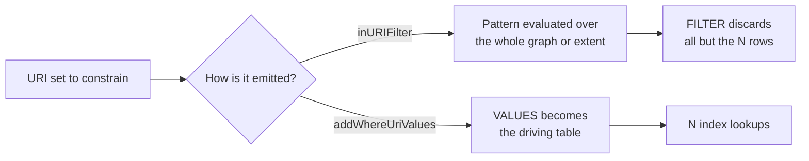
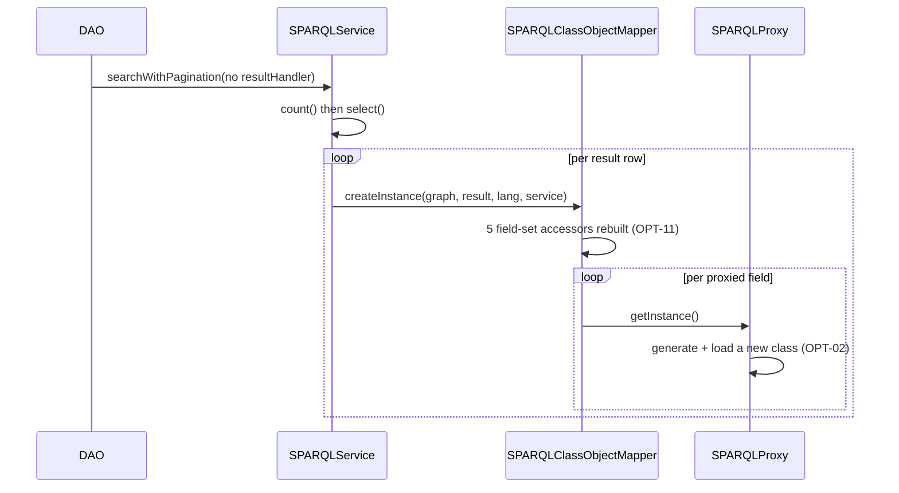

# Technical documentation : [`sparql`] ORM optimization opportunities

**Document history (please add a line when you edit the document)**

| Date       | Editor(s)        | OpenSILEX version | Comment           |
|------------|------------------|-------------------|-------------------|
| 2026-09-11 | Arnaud Charleroy | BUILD-SNAPSHOT    | Document creation |
| 2026-09-13 | Arnaud Charleroy | BUILD-SNAPSHOT    | Review pass: OPT-24 and OPT-14 corrections |

## Table of contents

<!-- TOC -->
- [How to read this document](#how-to-read-this-document)
- [Summary table](#summary-table)
- [Opportunities](#opportunities)
  - [Store and connection](#store-and-connection)
  - [Query shape](#query-shape)
  - [Round trips](#round-trips)
  - [Mapping cost per row](#mapping-cost-per-row)
  - [Caches and memory](#caches-and-memory)
- [Deliberately not recommended](#deliberately-not-recommended)
- [Out of scope for this module](#out-of-scope-for-this-module)
- [Measuring before optimizing](#measuring-before-optimizing)
- [See also](#see-also)
<!-- TOC -->

## How to read this document

Everything below is an **opportunity**, not a defect report. The ORM works; these are places where
the code does more work than the result requires. Genuine correctness problems live in
[ORM bugs and memory leaks](./orm-bugs-and-memory-leaks.md); three items here (OPT-03, OPT-21,
OPT-23) straddle the line and appear because the fix is the same change.

**Nothing here has been benchmarked against a running OpenSILEX instance.** A few items carry
micro-benchmarks of an isolated idiom (byte-buddy class generation, reflective lookup, prefix-map
rebuild), labelled as such. Every figure about a *request* is a reasoned estimate from the query
shape, not a measurement.

A benchmark that would settle these must measure three things separately, because they move
independently:

1. **Round trips per HTTP request** — the count, not the duration. Most large items here remove
   queries rather than make them faster.
2. **Store time per query shape** — the same logical result as `FILTER IN` versus `VALUES`, with
   and without the OPTIONAL skeleton, on a repository of a few million triples. A freshly
   installed instance shows nothing.
3. **JVM time per result row** — class generation, reflection, allocation — isolated from I/O by
   pointing the same workload at the embedded LMDB store.

[Measuring before optimizing](#measuring-before-optimizing) says how to instrument each with what
the module already has. Every item was proposed by an audit pass and then challenged by two
independent reviewers; their corrections are folded in. Where a reviewer showed a proposed fix is
unsafe as first written, the unsafe version is named so nobody re-derives it.

## Summary table

Sorted by expected gain per unit of effort, best first.

| ID | Opportunity | File | Expected gain | Effort | Risk |
|----|-------------|------|---------------|--------|------|
| OPT-01 | One triple index (`spoc`) instead of the template's six | `RDF4JServiceFactory.java:60` | Index-backed evaluation for every unbound-subject pattern | small | medium |
| OPT-02 | Cache the generated proxy class per type | `SPARQLProxy.java:42` | Milliseconds per row on every proxy-path search | medium | medium |
| OPT-03 | CSV class cache read short, written raw | `AbstractCsvImporter.java:633` | N ontology lookups become k | small | very low |
| OPT-04 | `getURILabels` filters an unbound BGP, 10 URIs at a time | `OntologyDAO.java:908` | N/10 full label scans become one bounded query | small | low |
| OPT-05 | Update-delete: post-UNION `FILTER IN` over wildcards | `SPARQLClassQueryBuilder.java:507` | Two full-graph scans per update become lookups | small | low |
| OPT-06 | Schema nested fetch uses `FILTER IN` on `?uri` | `SparqlSchemaNode.java:570` | Class-extent scan per level becomes N lookups | small | very low |
| OPT-07 | HTTP pool capped at 20, all timeouts infinite | `RDF4JServiceFactory.java:70` | A silent hang becomes a bounded failure | small | low |
| OPT-08 | `deleteCustomRelations` re-queries the ontology per instance | `SPARQLService.java:1432` | ~4 SELECTs per delete of a custom-property model | small | medium |
| OPT-09 | `getByURI` proxies an already-loaded model | `SPARQLClassObjectMapper.java:155` | One class generation per call; plain accessors | small | medium |
| OPT-10 | `size()` on an unloaded proxy list is not memoised | `SPARQLProxyList.java:47` | One COUNT per repeated `size()` | small | low |
| OPT-11 | Five field-set accessors allocate per call | `SPARQLClassAnalyzer.java:601` | 3-5 HashSets per result row | small | low |
| OPT-12 | Multi-valued URIs parsed three times | `SPARQLListFetcher.java:377` | Two of three URI parses per list element | small | low |
| OPT-13 | `shortForm` iterates `keySet()` and re-reads the map | `SPARQLPrefixMapping.java:38` | ~a third of the hottest string loop | small | low |
| OPT-14 | Managed-property URI set rebuilt per row | `SPARQLProxyRelationList.java:34` | One HashSet and one stream per row | small | low |
| OPT-15 | `getFieldValue` re-resolves the getter, swallows failures | `SPARQLClassAnalyzer.java:533` | Real error messages; ~93 ns per field read | small | low |
| OPT-16 | Nested constructor resolved per row in the fast fetcher | `SparqlNoProxyFetcher.java:138` | ~90 ns and one allocation per nested object | small | low |
| OPT-17 | Prefix mapping rebuilt on every query | `SPARQLService.java:178` | A few microseconds per query; drive-by | small | very low |
| OPT-18 | One ASK per OWL restriction when building a ClassModel | `OntologyDAO.java:411` | Tens of ASKs per create/validate/delete | medium | low |
| OPT-19 | COUNT carries the full OPTIONAL skeleton | `SPARQLClassQueryBuilder.java:264` | Removes the left-join skeleton from every count | medium | medium |
| OPT-20 | Generated URIs always cost one ASK each | `SPARQLService.java:1324` | Up to 3 ASKs per created event | medium | medium |
| OPT-21 | The ontology store mutates the models it caches | `AbstractOntologyStore.java:412` | Order-independent restrictions; a cacheable lookup | medium | medium |
| OPT-22 | Validation cache bounded by files, not retained models | `CachedCsvImporter.java:65` | A hard heap budget on the import endpoints | medium | low |
| OPT-23 | Cross-graph label block required inside an OPTIONAL | `SPARQLClassQueryBuilder.java:849` | Hardening: an object relation cannot vanish | small | low |
| OPT-24 | SELECT results negotiated as SPARQL Results XML | `RDF4JServiceFactory.java:69` | Removes an XML generate and parse per read; size of the gain unverified | small | low |
| OPT-25 | A streamed result is abandoned mid-iteration | `AbstractCsvImporter.java:549` | Releases one pooled connection per aborted import | small | low |
| OPT-26 | Handler-based select still fills a list | `RDF4JConnection.java:349` | API hygiene; one page-sized list per call | small | low |
| OPT-27 | Startup service never disposed, shared across threads | `SPARQLModule.java:218` | Removes the ORM's two cross-thread connections | medium | medium |
| OPT-28 | One ASK per object-valued CSV cell | `OntologyDAO.java:486` | O(rows) ASKs become O(target classes) SELECTs | large | medium |
| OPT-29 | Bulk delete is a per-URI loop | `SPARQLService.java:1646` | O(N x 3-4) round trips become a small constant | large | high |

## Opportunities

### Store and connection

#### OPT-01 The LMDB repository is created with one triple index instead of six

[RDF4JServiceFactory](../../../../../../opensilex-sparql/src/main/java/org/opensilex/sparql/rdf4j/RDF4JServiceFactory.java)`:60` hard-codes `private final static String TRIPLE_INDEXES = "spoc";`
and injects it into the repository-creation template at `:201`. The template's own default is the
six-index list `ns:tripleIndexes ""`
(`rdf4j-lmdb-repository-creation-template.ttl:18`). `git log -L 60,60` on that file shows the
six-index list was *added* by commit `8f7b91d7d1` ("install command now create a lmdb rdf4j
repository for improved performances") and cut to `spoc` inside the release merge `d38b544da6`,
with no rationale in the code or the commit message — it reads as a merge resolution, not a
decision.

**Cost.** An LMDB index can only serve a pattern whose bound terms form a prefix of the index
order, so with `spoc` alone every unbound-subject pattern falls back to a full scan. Those are on
the hot path: `SPARQLClassQueryBuilder.java:296` adds `?type rdfs:subClassOf* <RDFType>` to the
WHERE clause of **every** mapped search; `SPARQLService.getUriLinksWithOtherResources` (`:2800`)
and the ASK before every delete use `?s ?p <uri>`, unbound subject *and* predicate;
`RDF4JConnection.java:298` calls `getStatements(null, null, null, graphIRI)`, which wants a
c-first index.

**Change.** Remove the override, or make it a config key on `RDF4JConfig` (`tripleIndexes`,
defaulting to at least `spoc,posc,opsc`, which covers the three bound-term shapes the ORM emits)
and write down the trade-off next to it.

**Trap.** More indexes mean slower writes and a larger store — state that explicitly. This only
affects newly created repositories, but an existing one is not inert: `LmdbStore` compares the
requested index set against the one recorded in the store's properties and **reindexes** when they
differ. On a large repository that is long, I/O-heavy startup. Plan it as downtime. Verify by
timing `ASK { ?s ?p <someExistingUri> }` on a multi-million-triple store before and after.

#### OPT-07 The HTTP pool is capped at 20 and every HTTP timeout is infinite

The only pool is built in the `RDF4JServiceFactory(RDF4JConfig)` constructor: `:70`
`cm = new PoolingHttpClientConnectionManager();`, `:71` `cm.setDefaultMaxPerRoute(20);`, then
`HttpClients.custom().setConnectionManager(cm).build()` with **no** `setDefaultRequestConfig`. A
repository-wide grep for `RequestConfig`, `setSocketTimeout`, `setConnectTimeout`,
`setConnectionRequestTimeout` and `setMaxTotal` returns nothing.

**Cost.** httpclient 4.5.14's no-arg pool constructor hard-codes `CPool(factory, 2, 20, ...)`, so
raising `defaultMaxPerRoute` leaves the effective ceiling at 20 — and there is exactly one route.
With no request config, all three timeouts are `-1`. RDF4J parses tuple results in a background
thread that holds the response entity, hence the leased socket, for as long as the caller drains,
so concurrent *in-flight queries* consume pool slots. Past 20, request 21 parks in `CPool.lease()`
with no deadline; if the store accepts the TCP connection but stops answering, every worker
holding a socket blocks forever. The failure presents as a total hang, not an error. The one
existing knob does not help: `RDF4JConfig.timeout` feeds only `Query.setMaxExecutionTime`
(`RDF4JConnection.java:140-142`), defaults to 0 so it is never applied, and for an
`HTTPRepository` it is a server-side hint. Its `@ConfigDescription` also reads "RDF4J connectrion
timeout" — typo and wrong meaning.

**Change.** `cm.setMaxTotal(n); cm.setDefaultMaxPerRoute(n);` with `n` derived from the servlet
worker-thread count, plus
`setDefaultRequestConfig(RequestConfig.custom().setConnectionRequestTimeout(..).setConnectTimeout(..).setSocketTimeout(..).build())`,
all exposed in `RDF4JConfig` next to `timeout`.

**Trap.** Land `connectionRequestTimeout` and `connectTimeout` first — they are pure
hang-to-error conversions. A blanket `socketTimeout` is a semantic change: the ontology store
load, CSV import URI checks and large exports stream for minutes with the socket idle only between
packets, so a low value aborts them mid-stream. Make it generous and configurable. `setMaxTotal`
alone changes nothing until `n` exceeds 20, since there is one route; the timeouts are the
substantive half. `setValidateAfterInactivity` is already 2000 ms.

#### OPT-24 SELECT results are transferred as SPARQL Results XML

`RDF4JServiceFactory:69-77` creates and initialises the `HTTPRepository` without ever calling
`setPreferredTupleQueryResultFormat` or `setPreferredRDFFormat` — no call to either exists in the
repository. RDF4J therefore keeps its defaults: rdf4j-http-client 5.2.1 declares
`preferredTQRFormat = TupleQueryResultFormat.SPARQL` (`:183`) and
`preferredRDFFormat = RDFFormat.TURTLE` (`:187`), and `HTTPRepository.createHTTPClient()`
(`:328-346`) overrides them only when those setters were called. Every SELECT answer is therefore
negotiated as `application/sparql-results+xml` and parsed with the SAX parser, on every ORM read.
`rdf4j-client-5.2.1` already declares `rdf4j-queryresultio-binary` and `rdf4j-rio-binary`, so the
binary parsers are on the classpath and simply never selected.

**Change.** Before `repo.init()`, `repo.setPreferredTupleQueryResultFormat(TupleQueryResultFormat.BINARY)`
and `repo.setPreferredRDFFormat(RDFFormat.BINARY)`, driven by a config key
(`resultFormat: BINARY|XML|JSON`).

**Trap.** The gain is **asserted, not measured** — no benchmark accompanies this item; treat
"smaller on the wire" as a hypothesis. The change is safe: `sendTupleQueryViaHttp` (`:757-780`)
sends the whole accepted list with q-values, so a server without BINARY still answers in a mutually
accepted format. It affects the read side only (`HTTPRepositoryConnection` already uploads with
`RDFFormat.BINARY` hard-coded) and only the remote path — `RDF4JLMDBServiceFactory` is in-process.
The config key is not polish: `TupleQueryResultFormat.BINARY` is RDF4J-proprietary, and the key is
what keeps a non-RDF4J endpoint viable.

#### OPT-25 A streamed result is abandoned mid-iteration

[AbstractCsvImporter](../../../../../../opensilex-sparql/src/main/java/org/opensilex/sparql/csv/AbstractCsvImporter.java)`:549` takes an iterator off the stream returned by
`executeSelectQueryAsStream` and `break`s out at `:559` when `validator.getNbError() >=
errorNbLimit`. Nothing closes it, and none of the ~30 `executeSelectQueryAsStream` call sites in
the repository uses try-with-resources.

**Cost.** For the remote backend the result is a `BackgroundTupleResult` whose parser thread pushes
into a queue bounded at 10 and only closes the response entity when parsing completes. Abandon the
consumer with more than ten rows pending and the parser blocks on the full queue: the entity — and
the pooled socket behind it, from the pool of 20 in OPT-07 — stays held, plus a background thread
stays pinned, until the connection closes at the end of a long import request. Users hit this
routinely: any CSV with more errors than the limit.

**Change.** Wrap the stream in try-with-resources so the `break` releases it (`Iterations.stream()`
attaches an `onClose` that closes the iteration, and `Stream.map` preserves close handlers).
Document on `SPARQLService.executeSelectQueryAsStream` and `searchAsStream` that the returned
`Stream` is a resource the caller must close.

**Trap.** Two scope corrections. The empty-result early return at `RDF4JConnection.java:164-166`
is **not** a leak: `IterationWrapper.hasNext()` closes the iteration itself as soon as it reports
no more elements, and `BackgroundTupleResult`'s superclass is an `IterationWrapper`. Adding
`results.close()` there is a harmless no-op. By the same mechanism every call site that drains to
exhaustion is already safe, so the audit is narrow — abandoned-iteration sites only, and
`AbstractCsvImporter:549` is the only one. The test suite cannot see any of this: every test
constructs `RDF4JLMDBServiceFactory`.

#### OPT-27 The startup SPARQLService is never disposed and is shared across threads

[SPARQLModule](../../../../../../opensilex-sparql/src/main/java/org/opensilex/sparql/SPARQLModule.java)`.startup()` does `SPARQLService sparql = factory.provide();` (`:218`) then
`initOntologyStore(...)` (`:219`) with no dispose and no try/finally — compare `install()`
(`:145`/`:163`) and `check()` (`:172`/`:176`), which both dispose. `AbstractOntologyStore` keeps
that service as a final field (`:51`) plus an `OntologyDAO` built from it (`:77`).
`OntologyStore.reload()` is `clear(); load();` with no synchronisation (`grep -n synchronized` on
`AbstractOntologyStore.java` returns nothing), and `OntologyAPI` calls it from nine resource
methods (`:245, :251, :283, :288, :355, :358, :559, :580, :602`).

**Cost.** An RDF4J `RepositoryConnection` is documented single-threaded, and `SPARQLService` adds
a non-atomic `private int transactionLevel = 0;` (`:290`). Two admins editing the ontology
concurrently run two `reload()` calls on one connection from two Jersey workers. The exposure is
wider than reload: `searchSubClasses` (`:423`), `searchDataProperties` (`:484`) and
`searchObjectProperties` (`:504`) delegate to `new NoOntologyStore(ontologyDAO)` whenever the
caller supplies a `namePattern` — so two concurrent ontology **searches** already share one
connection today, with no reload involved. And nothing ever closes it: `RDF4JServiceFactory` does
not override `shutdown()`, so `repository.shutDown()` and `cm.close()` are never called and
`RDF4JConnection.connectionCount` (`:53`) never returns to zero.

**Change.** Have `AbstractOntologyStore` hold the factory and `provide()`/`dispose()` around
`load()`/`reload()` — **and** give the `OntologyDAO` path a per-call service, or the search-box
path stays broken. Serialise `reload()`, preferring an **atomic swap** of the built store over a
lock, because `clear()` empties `modelsByUris` and the jgrapht graph while other threads read them.
Add `shutdown()` to `RDF4JServiceFactory` calling `repository.shutDown()` and `cm.close()`.

**Trap.** "Lets a redeployed application release its sockets" overstates the HTTP case —
`HTTPRepositoryConnection` leases sockets per request — but the never-closed `SailConnection` on
the embedded factory is real, and the DEBUG connection gauge becomes meaningful again.
`ScheduleMetrics` has the same shape but lives in `opensilex-core`; see
[Out of scope](#out-of-scope-for-this-module).

### Query shape

All four items in this group are the same mistake: a URI set expressed as a trailing `FILTER IN`
instead of a `VALUES` block. `inURIFilter` (`SPARQLQueryHelper.java:247`) builds an ordinary
post-join filter, so the engine evaluates the pattern first and discards afterwards;
`addWhereUriValues` (`:342-364`) emits a `BindingSetAssignment` the join optimiser can drive from.
Both expand URIs through the same helper, so they are semantically equivalent on IRIs.



#### OPT-04 getURILabels filters an unbound BGP, ten URIs at a time

[OntologyDAO](../../../../../../opensilex-sparql/src/main/java/org/opensilex/sparql/ontology/dal/OntologyDAO.java)`.getURILabels` (`:908-975`) joins three fully unbound patterns
(`:944` label, `:947` `rdf:type`, `:948` type label — the last two required, not optional) and
narrows with `inURIFilter` at `:957`. The author already hit the wall: `:916` `int batchSize = 10;`
under the comment `//Do this request in batches of 10 as the uris filter was failing above 17 uris`.

**Cost.** The filter never becomes a driving table, so the engine enumerates every `rdfs:label`
triple in the repository — in the union of all named graphs when `context` is null — before
discarding all but ten rows. `DataDAO` calls this with the whole distinct target set of a data
export, so a 5 000-object export is 500 sequential full-label scans. The batch of ten is not a fix;
it only keeps each query under the store's timeout, which makes the "failing above 17 uris"
symptom itself diagnostic — it was the scan timing out, not the filter.

**Change.** Bind `?uri` first and make the type label optional so a type without a label stops
dropping the whole row:

```sparql
SELECT (GROUP_CONCAT(DISTINCT ?name ; separator=' | ') AS ?names) ?uri ?rdfType ?rdfTypeName
WHERE {
  VALUES ?uri { <u1> <u2> ... <uN> }
  ?uri rdfs:label ?name .
  ?uri rdf:type   ?rdfType .
  OPTIONAL {
    ?rdfType rdfs:label ?rdfTypeName .
    FILTER (langMatches(lang(?rdfTypeName), "en") || langMatches(lang(?rdfTypeName), ""))
  }
  FILTER (langMatches(lang(?name), "en") || langMatches(lang(?name), ""))
}
GROUP BY ?uri ?rdfType ?rdfTypeName
```

**Trap.** Making the type label optional only *adds* rows that are silently lost today. **Do not
drop batching to zero**: keep a large batch (500-1000 URIs per `VALUES`) so a 5 000-target export
does not build one enormous query string. The win comes from `VALUES`, not from a single round
trip. `OntologyApiUriLabelTest` covers the endpoint.

#### OPT-05 The update-delete query drives two wildcard patterns from a post-UNION FILTER

[SPARQLClassQueryBuilder](../../../../../../opensilex-sparql/src/main/java/org/opensilex/sparql/mapping/SPARQLClassQueryBuilder.java)`.getDeleteBuilder(List, ...)` builds all-variable
patterns in both directions (`:493-494`) and constrains them from **outside** the UNION:
`globalWhere.addFilter(SPARQLQueryHelper.inURIFilter(uriVar, urisToDelete));` (`:507`), with the
UNION attached afterwards at `:535`. The method's javadoc prints that shape verbatim. It is on the
write path of every update: `SPARQLService.update` → `deleteForUpdate` (`:1547`) →
`getDeleteBuilderForUpdate` → `getDeleteBuilderForUpdateCases` → here.

**Cost.** The filter applies to the solutions of the UNION, so both branches enumerate the target
graph first — and `?s ?p ?uriToDelete` is an unbound-subject-and-predicate scan. The graph is
always a named graph (the class default when the caller passes none), so for scientific objects
that is the whole experiment graph.

**Change.** Emit the URI set as a `VALUES` table **inside each branch**:

```sparql
DELETE { GRAPH <g> { ?uriToDelete ?p ?o . ?s ?p ?uriToDelete } }
WHERE {
  { VALUES ?uriToDelete { <u1> <u2> ... }
    GRAPH <g> { ?uriToDelete ?p ?o
                FILTER (?p NOT IN (dcterms:publisher, dcterms:issued)) } }
  UNION
  { VALUES ?uriToDelete { <u1> <u2> ... }
    GRAPH <g> { ?s ?p ?uriToDelete } }
}
```

`SPARQLQueryHelper.addWhereUriValues` takes a `WhereClause`, so both branches feed from one call
site.

**Trap.** The `VALUES` must be duplicated in **both** branches — forgetting one leaves that branch
unconstrained and it deletes too much. The `NOT EXISTS` sub-filters must still see `?uriToDelete`
bound, and the DELETE template must not change. Cover it with the update cases in
`SPARQLServiceTest`.

#### OPT-06 Schema-driven nested fetches use FILTER IN instead of VALUES

[SparqlSchemaNode](../../../../../../opensilex-sparql/src/main/java/org/opensilex/sparql/service/schemaQuery/SparqlSchemaNode.java)`.runBasicSearchFunction` (`:565-579`) fetches a set of
already-known URIs by running the full ORM SELECT skeleton for the child class and adding
`select.addFilter(inURIFilter(SPARQLResourceModel.URI_FIELD, uris...))` as its entire
filterHandler. That skeleton is not cheap: `?uri a ?rdfType`, `?rdfType rdfs:subClassOf* <T>`, one
OPTIONAL per mapped field and the rdfTypeName OPTIONALs. With `?uri` unbound, all of it is
evaluated over the whole class extent first. This runs once per distinct type per level of every
fetch plan — `FacilityDAO`, `GroupDAO`, `ExperimentDAO`, `ProjectDAO`, `DeviceDAO`, `FactorDAO`.

The right shape is in the module twice already: `SPARQLService.loadListByURIs` uses
`select.addValueVar(mapper.getURIFieldExprVar(), uriNodes)` (`:521`) for the identical operation,
and `runRelationFetchingFunction` two methods down uses `addWhereUriStringValues` (`:624`).

**Change.** One line:
`SPARQLQueryHelper.addWhereUriValues(select, SPARQLResourceModel.URI_FIELD, uris.stream().map(URI::create), uris.size())`.
No shared state, no signature change. A page of 20 facilities pulling addresses and organizations
goes from "all organizations in the store" to 20 lookups per nested query.

#### OPT-23 A cross-graph label block is emitted as required inside its parent OPTIONAL

`SPARQLClassQueryBuilder.addObjectPropertyName` (`:843-854`) builds a handler whose name says it is
optional, then adds it **unwrapped** in the optional branch —
`objectGraphClauseIntoRootHandler.addElement(objectNameDefaultOptionalHandler.getElement())`
(`:849`) — while the required branch one line below does the right thing,
`objectGraphHandler.addOptional(objectNameDefaultOptionalHandler)` (`:852`). For an optional field
the target group sits inside the `ElementOptional` that `initializeQueryBuilder` later builds, so
the emitted shape is an OPTIONAL containing a **mandatory** GRAPH block carrying a mandatory
`langFilterWithDefault`. If the related object has no matching label in its own default graph, the
inner pattern fails, the outer OPTIONAL fails, and the object field comes back unbound — the
relation disappears from the response although the triple exists.

**Change.** Symmetry:
`objectGraphClauseIntoRootHandler.addElement(new ElementOptional(objectNameDefaultOptionalHandler.getElement()))`.

**Trap — this is latent, not active.** The branch fires only when the object's graph differs from
the parent's. The obvious example does **not** apply: `EntityModel`, `CharacteristicModel`,
`MethodModel`, `UnitModel` and `InterestEntityModel` all declare `graph = VariableModel.GRAPH`, so
the block is never generated for a variable query and no French-only entity label can make a
variable lose its entity. Across `opensilex-core` and `opensilex-security` the one single-valued
optional named-resource field that actually fires it is `FactorModel.experiment` — and
`SPARQLNamedResourceModel.name` is a plain `String` stored untagged, which the empty-language
branch of `langFilterWithDefault` always matches, so the language-mismatch trigger does not apply
to it either. Treat this as hardening; it is presumably why `ScientificObjectModel.parent` and
`.experiment` carry `useDefaultGraph = false`. It changes result shape — rows that vanished now
appear with the default-name variable unbound — so check `createInstance`'s handling of a missing
default name and re-run the label cases in `SPARQLServiceTest`.

### Round trips

#### OPT-08 deleteCustomRelations re-derives the ClassModel from the triple store

*(Found by two lenses.)* For every model annotated `handleCustomProperties = true`,
[SPARQLService](../../../../../../opensilex-sparql/src/main/java/org/opensilex/sparql/service/SPARQLService.java)`.deleteCustomRelations` builds a fresh DAO and goes to the store:
`classModel = new OntologyDAO(this).getClassModel(instance.getType(), rootType, OpenSilex.DEFAULT_LANGUAGE);`
(`:1432`), called unconditionally from the single-URI delete at `:1615`.
`OntologyDAO.getClassModel` (`:274-305`) is a `loadByURI(ClassModel)` SELECT, then
`getOwlRestrictions` (one SELECT), then `buildDataAndObjectProperties` (two `getListByURIs`) — at
least four round trips, plus the per-restriction ASKs of OPT-18. Four model classes carry the
annotation: `ScientificObjectModel`, `EventModel`, `DeviceModel`, `FacilityModel`. Meanwhile
`AbstractOntologyStore.getClassModel(URI, URI, String)` (`:405-417`) answers from the in-memory
`modelsByUris` map with zero store access and is what every other consumer uses.

**Cost.** ~4 wasted SELECTs on every single-resource DELETE of one of those four types. It does
**not** multiply over a bulk delete in practice: the model actually deleted in bulk today is
`MoveModel`, which does not declare `handleCustomProperties`. Treat it as a constant per-request
cost, not an amplification.

**Change.** Either (1) call `SPARQLModule.getOntologyStoreInstance().getClassModel(...)`, keeping
the `SPARQLInvalidURIException` → `SPARQLInvalidModelException` translation — the store throws the
same exception type, and `NoOntologyStore.getClassModel` (`:65`) delegates back to `OntologyDAO`,
so store-less deployments are unaffected; or (2) hoist the lookup out of the list-delete loop by
grouping loaded instances by `rdf:type`, as `SPARQLRelationFetcher` and `AbstractCsvImporter`
already do.

**Trap.** Variant 1 is **not** behaviour-identical. `OntologyDAO.getOwlRestrictions` (`:342`)
collects restrictions over `Ontology.subClassAny` from the class up the **whole** ancestor chain
regardless of the `parentClass` argument, whereas `AbstractOntologyStore.inheritFromSuperClasses`
walks only from the supplied `ancestorURI` down. The store can therefore return a strictly smaller
restriction set and leave custom relations undeleted if a restriction lives above `rootType`.
Variant 2 is behaviour-preserving and is the one to land; it needs the private single-URI delete to
accept a per-call cache, because instances are loaded inside it. Also note the store's
`getClassModel` mutates shared cached maps (OPT-21), so variant 1 routes more concurrent traffic
through that until OPT-21 lands.

#### OPT-10 size() on a lazy proxy list is never memoised

[SPARQLProxyList](../../../../../../opensilex-sparql/src/main/java/org/opensilex/sparql/mapping/SPARQLProxyList.java)`.invoke` answers `size()` on an unloaded list with a dedicated COUNT:
`if (method.getName().equals("size") && noParameters && !this.isLoaded()) { return this.getSize(); }`
(`:47`). `getSize()` populates neither `instance` nor `loaded` — `loaded` is only ever set in
`SPARQLProxy.loadIfNeeded` (`:62-67`) — so two `size()` calls are two COUNT queries and a following
iteration is a third. Size-then-iterate is the common DTO idiom:
`VariablesGroupGetDTO.fromModel:54` does `new ArrayList<>(model.getVariablesList().size())` and
iterates the same list at `:56`, and `VariablesGroupDAO.getList` reaches the proxy branch of
`getListByURIs`, so `GET /variables_groups/by_uris` with N URIs costs 1 + 2N queries.

**Change.** Cache the value in an `Integer sizeCache` field on the proxy. The proxy is
per-instance and per-request, and once the list is loaded `invoke()` stops taking the size branch
at all, so a cached size can never be read back after a load.

**Trap.** A second fix was proposed and **must not** be applied: replacing
`SPARQLProxyListObject.getSize()`'s `service.count(...)` with a bare `SELECT (COUNT(DISTINCT ?uri))`
over the single relation triple, as `SPARQLProxyListData` does for literals. That is not the
equivalent query — `service.count` also constrains `?uri` by
`?uri rdf:type ?type . ?type rdfs:subClassOf* <T>`, by the graph, and by `appendBlankNodeFilter`.
Dropping those would count targets of the wrong type, targets outside the graph and blank nodes,
returning a size that disagrees with the list the next access loads. The useful version of that
idea is OPT-19.

#### OPT-18 addRestriction issues one ASK per OWL restriction

`OntologyDAO.buildProperties` loops over every restriction (`:436-438`) and `addRestriction`
decides class-versus-datatype with a synchronous ASK per restriction:
`sparql.uriExists(ClassModel.class, restriction.getOnClass())` (`:411`) and
`sparql.uriExists(ClassModel.class, someValueFrom)` (`:418`). `uriExists(Class, URI)`
(`SPARQLService.java:1859`) is one `executeAskQuery`, uncached. The candidate URIs are all in the
`restrictions` list before the loop, and the batched counterpart exists:
`getExistingUris(Class, Collection<URI>, boolean)` (`:1908`) builds one SELECT with a `VALUES`
clause.

**Change.** Split `buildProperties` into two passes — collect candidate class URIs (skipping those
`SPARQLDeserializers.existsForDatatype` resolves locally), resolve them in one query, then run the
existing `addRestriction` logic against that `Set`. Prefer `getCheckUriListExistQuery` over
`getExistingUris` for a literal behaviour match: `getUnknownUrisQuery` (`:2053`) adds a
`?uri ?p ?o` pattern on top of the type check, practically equivalent for `owl:Class` URIs but not
the same query as `getUriExistsQuery`.

**Trap — two assumed beneficiaries are wrong.** Ontology store loading at startup does **not** go
through this code: `AbstractOntologyStore` builds its own restriction index (`linkRestrictions` /
`linkDataProperty` / `linkObjectProperty`, `:272-290`) and never calls `buildProperties`. CSV
import is not per-row either: `AbstractCsvImporter` keeps a `localClassesCache` and
`AbstractEventCsvImporter` caches `classesByType`, so `getClassModel` runs once per distinct type
per file. The real beneficiaries are per-request create/validate paths (`DeviceDAO.initDevice`,
`ScientificObjectLogic.initObject`, `EventLogic.setEventRelations`, `GermplasmAPI`) plus the delete
path of OPT-08 — a handful of ASKs per request, tens at worst. `onDataRange` restrictions cost
nothing, because `existsForDatatype` is local.

#### OPT-19 The COUNT query carries the full OPTIONAL skeleton it never projects

*(Found by two lenses.)* `getCountBuilder` (`:249-272`) replaces only the projection and then calls
the identical `initializeQueryBuilder(countBuilder, graph, lang, customHandlerByFields)` (`:264`)
that `getSelectBuilder` calls at `:118`. That walks every mapped field through `addSelectProperty`
(`:699-719`), which allocates an OPTIONAL `WhereHandler` per optional field (`:767-772`), emits the
clause **twice** for translatable non-object fields (`:708-714`, once for the language and once for
the default) and pulls in the `addObjectPropertyName` and `addTimeTimeStamp` sub-joins; those are
attached as `ElementOptional` blocks at `:214-247`. `searchWithPaginationInnerCode` runs this COUNT
before **every page** of **every** paginated endpoint (`SPARQLService.java:795`). A `VariableModel`
count carries five object-field OPTIONALs with two language clauses each, plus the two rdfTypeName
OPTIONALs — about fifteen label joins per candidate variable, to produce one integer. The code
already knows the builder is over-specified: `SPARQLService:940-956` clears the leftover ORDER BY
and stray projected variables afterwards.

An OPTIONAL cannot change a `COUNT(DISTINCT ?uri)` result, so the target shape is:

```sparql
SELECT (COUNT(DISTINCT ?uri) AS ?count) WHERE {
  ?rdfType rdfs:subClassOf* vocabulary:Variable
  GRAPH <.../set/variables> { ?uri a ?rdfType ; rdfs:label ?name }
  FILTER ( ! isBlank(?uri) )
}
```

**Change.** Two variants, unequal in value. (1) *Conservative gate*: skip the optional handlers
when `filterHandler == null && customHandlerByFields == null` — cannot change any result, but **it
does not cover the paginated endpoints**, since most `searchWithPagination` callers pass a non-null
filterHandler. (2) *Variable analysis*: after `filterHandler.accept()` has run, collect the
variables the query mentions and drop every `ElementOptional` whose variables are disjoint. Only
variant 2 delivers the gain.

**Trap.** `filterHandler` is a `ThrowingConsumer` that mutates the builder directly, so the
referenced variables can only be discovered by applying it **first** and then inspecting the
result — which means restructuring `getCountBuilder` to apply the filter before deciding which
optional handlers to attach. Collect variables from filters, BINDs, sub-selects **and**
`NOT EXISTS` / `MINUS`, not just top-level filters: `VariableDAO`'s name regex ORs over
`?_entity_name`, `?alternativeName` and six other optional variables. Treat the
`customHandlerByFields` branch (`:180-203`) as "references optional vars" rather than dropping it.
Prune the COUNT builder only, never a builder shared per class+graph+lang. The headline "roughly
halves every paginated listing" is **unverified**; the safe claim is that it removes the left-join
skeleton from the COUNT when no filter touches an optional field.

#### OPT-20 Generated URIs are probed one ASK at a time even when the caller opted out

`generateUniqueUriIfNullOrValidateCurrent` takes a `checkUriExist` parameter and ignores it on the
null-URI branch — `generateUniqueURI(graph, instance, uriGenerator, true);` at `:1324`, a literal
`true` with the parameter in scope; the flag is honoured only on the else-if at `:1328`.
`generateUniqueURI` then runs
`generatedUriCache.getIfPresent(uri) != null || uriExists(graph, uri)` (`:1309`), an ASK whenever
the 30-second Caffeine cache misses. `prepareInstancesCreation` calls this per instance (`:1120`)
and again per nested sub-instance with a null URI (`:1129-1136`). `EventDAO.create(List)` passes
`false`, and every `EventModel` carries `start` and `end` `InstantModel`s built without a URI, so a
batch of N events issues up to 3N ASKs beside its single INSERT. (The ASK does not *always* fire:
`URIGenerator` output is name-derived and deterministic, so a repeated name inside the 30-second
window hits the cache.)

**Change.** Generate all URIs for the batch first, then issue **one**
`getExistingUris(mapper.getObjectClass(), generatedUris, true)` and re-generate only collisions.

**Trap.** The obvious fix — passing the flag through — **must be rejected**. That hard-coded `true`
is the only uniqueness guard for generated URIs *and* the only consumer of `generatedUriCache`
(the lookup lives inside the `if (checkUriExist)` block, while the `put` at `:1316` sits outside
it). Honouring the flag would disable both the store-side collision check and the in-batch dedup,
so two instances with the same name in one bulk create would silently receive the same URI and be
merged into one resource. The batched variant must therefore keep an in-batch duplicate check of
its own, which is why this is medium effort rather than small.

#### OPT-28 One ASK per object-valued CSV cell

`OntologyDAO.validateThenAddObjectRelationValue` checks an object-property target one URI at a
time: `if (sparql.uriExists(classURI, objectURI))` at `:486`, where `uriExists(URI rdfType, URI uri)`
(`SPARQLService.java:1937`) is a bare ASK with a `subClassOf*` type check, uncached. The call site
sits inside the per-cell loop of the event CSV importer: `AbstractEventCsvImporter.java:349`, in
the column loop at `:318`, in the row loop at `:255`. A 10 000-row event CSV with one
object-valued custom column produces 10 000 ASKs on top of the import's own batched queries — the
one place in the module where the cost is bounded only by input size.

**Scope it precisely.** Only columns whose restriction is an **object** property pay: datatype
cells return through the deserializer branch (`:470-479`) with no query, and empty or non-required
cells short-circuit at `:467`. The other call sites (`EventLogic:160`, `DeviceDAO:87`,
`FacilityLogic:548`, `RDFObjectDTO:97`) are per-request loops over a handful of relations and must
not be used to justify the effort.

**Change.** Add a list-oriented sibling that records `(classURI, objectURI, cell)` without
querying, resolves them with one `getCheckUriListExistQuery` (`SPARQLService.java:1983`) per
distinct `classURI` at the end of the batch, and emits the invalid-value errors then. Both
`AbstractCsvImporter` (`:415`, `:515`) and `OwlRestrictionValidator` (`:387`) already consume that
query, and the deferred-error bookkeeping exists in `CsvOwlRestrictionValidator`.

**Trap.** Per-cell errors move from inline to end-of-batch, so `CSVValidationModel` row and column
indexes must travel with each deferred check. The bigger one: the method both **validates and
mutates** (`object.addRelation`), so the deferred version must add the relation optimistically and
guarantee the batch is abandoned when a check returns false. That is safe in the importers, which
are two-phase, but **not** on a single-phase path. Make it additive — a new method — so the API
`opensilex-core` compiles against is unchanged.

#### OPT-29 Bulk delete is a per-URI loop

The list overload opens one transaction and calls the single-URI delete N times:
`for (URI uri : uris) { delete(graph, objectClass, uri); }` (`:1646`). The single-URI delete
(`:1559`) starts with a full mapper SELECT used only as an existence probe —
`T instance = loadByURI(graph, objectClass, uri, getDefaultLang());` — then issues one
`getRelationsURI` SELECT per `cascadeDelete` field (`:1577-1588`), allocates a **new**
`UpdateBuilder` inside the reverse-reference loop and runs one `executeDeleteQuery` per
reverse-referencing class (`:1598-1613`), calls `deleteCustomRelations` (`:1615`, see OPT-08), then
the instance DELETE (`:1618`) and a conditional relations DELETE (`:1623`).

**Cost, stated honestly.** Per URI the floor is one SELECT plus one DELETE — the relations DELETE
is skipped when `getDeleteRelationsBuilder` returns null — and the realistic cost is 3 + R, where R
is the number of classes holding a forward reference. Restate the magnitude as **O(N x 3-4)**:
`EventModel` declares no `cascadeDelete` field, and `MoveModel` — the model actually deleted in
bulk — does not set `handleCustomProperties`. There is also **no** batch `DELETE /events` endpoint;
`EventAPI` exposes only `DELETE {uri}` and `DELETE moves/{uri}`. The live bulk paths are
`MoveLogic.deleteList` → `EventDAO.deleteMany` → `sparql.delete(graph, MoveModel.class, uris)`,
invoked from `ScientificObjectCsvImporterLogic.handleUpdateMovesStep` on every SO CSV update
import, and `LocationObservationCollectionDAO.deleteMany` during move deletion.

Batched deletion is demonstrably expressible here: `deleteForUpdate` (`:1547`) already deletes N
models in one query, and `SPARQLClassQueryBuilder.getDeleteBuilder(List<URI>, ...)` (`:478`)
already deletes N URIs in one query.

**Change.** An additive list-aware fast path, leaving the single-URI method untouched: replace the
N `loadByURI` probes with one `getExistingUris(objectClass, uris, false)` throwing
`NotFoundURIException` on the first missing URI; build one `UpdateBuilder` per reverse-referencing
class across all URIs, binding `VALUES ?target { :u1 ... :un }`; accumulate the instance and
relation deletes into one builder per batch; hoist the `ClassModel` lookup out of the loop.

**Trap — the cross-graph one.** Do **not** simply reuse `getDeleteBuilder(List<URI>, URI graph, ...)`:
it is graph-scoped, deleting both directions inside **one** graph, whereas the current loop deletes
each reverse reference in the reverse mapper's **own** default graph (`reverseMapper.getDefaultGraph()`,
`:1604-1608`). A naive reuse would silently stop deleting cross-graph reverse references. Keep one
DELETE template per graph, with `VALUES` over the URIs. Delete ordering and cascade semantics must
also be preserved. This is the largest and riskiest change in the document.

### Mapping cost per row



#### OPT-02 Every proxied field of every result row generates a new JVM class

*(Found independently by three lenses.)*
[SPARQLProxy](../../../../../../opensilex-sparql/src/main/java/org/opensilex/sparql/mapping/SPARQLProxy.java)`.getInstance()` (`:42-59`) runs the full pipeline on every call, with
no cache of any kind:

```java
Class<? extends T> proxy = new ByteBuddy()
        .subclass(type)
        .implement(SPARQLProxyMarker.class)
        .method(ElementMatchers.any())
        .intercept(InvocationHandlerAdapter.of(this))   // bakes THIS handler into the class
        .make()
        .load(OpenSilex.getClassLoader())               // default WRAPPER: one ClassLoader each
        .getLoaded();
return proxy.getConstructor().newInstance();
```

`SPARQLClassObjectMapper.createInstance(Node, SPARQLResult, String, SPARQLService)` calls it once
for the rdf-type label (`:179`), once per bound object property (`:239`), once per label property
(`:251`), unconditionally per data-list field (`:260`), unconditionally per object-list field
(`:273`) and unconditionally for `relations` (`:277`). `ProjectModel` has five list fields, so a
project row costs seven generated classes — six of them the identical `List.class` shape.

**Cost.** Isolated micro-benchmarks against the pinned byte-buddy 1.14.18
(`opensilex-parent/pom.xml:70`) put one generation in the **1-3 ms** range (1.46 ms for `List`,
~1.0 ms for a model class in one run; 1.07 ms and 2.73 ms in an independent one) against ~0.8 us
per instance once the class is cached. This is the only item in this document whose per-row cost is
milliseconds. Reached per request, not at startup: `SPARQLService.searchAsStream:906-911` takes the
`mapper.createInstance` branch whenever `resultHandler` is null, which `ProjectDAO.java:101`,
`AnnotationDAO.java:183` and `GermplasmGroupDAO.java:93` do. (`FacilityDAO.java:114` and
`VariablesGroupDAO.java:103` do **not** — both pass a `SparqlNoProxyFetcher` handler.) The module's
own `SparqlNoProxyFetcher` exists to avoid this cost; its javadoc says so.

**Change.** Cache the generated **class**, keyed on `type` — a finite set fixed at startup (the
mapper index is built once in `SPARQLServiceFactory.startup()`), so no eviction and no
invalidation. Build each class once with
`.defineField("$$sparqlHandler", InvocationHandler.class, Visibility.PRIVATE)` and
`.intercept(InvocationHandlerAdapter.toField("$$sparqlHandler"))`, then per call `newInstance()`
plus a handler injection.

**Traps.**
- **Do not** use `ClassLoadingStrategy.Default.INJECTION`. This project targets JDK 17
  (`opensilex-parent/pom.xml:49`) and INJECTION needs `--add-opens java.base/java.lang` for
  reflective `ClassLoader.defineClass`. Keep WRAPPER: once cached, there is exactly one
  `ByteArrayClassLoader` per mapped type for the life of the JVM, which already removes the churn.
- The handler field is null between `newInstance()` and the setter, so any overridable method
  called from a model superclass constructor would NPE where it reaches the handler today.
- The setter must be excluded from the `ElementMatchers.any()` interception (use `defineMethod`
  plus `FieldAccessor`), or injecting the handler recurses. Use a `$$`-prefixed non-bean name so
  Jackson's introspection ignores it.
- Keep `.implement(SPARQLProxyMarker.class)`: `SPARQLClassObjectMapperIndex.getConcreteClass`
  (`:53-59`) tests for it — an `isAssignableFrom` check, not class identity, so sharing is safe.
- Equality is unchanged: the generated class delegates through `method.invoke(instance, args)`, so
  `equals` always runs on the real instance and `SPARQLResourceModel.equals`'s `getClass()` check
  compares real class against proxy class both before and after.
- Caching does **not** make a proxied getter fast — the call still goes through `SPARQLProxy.invoke`
  and `Method.invoke`. The win is class generation. Verify with `jcmd <pid> VM.class_stats` before
  and after a paged proxy-path listing: loaded-class count should stop growing with the row count.

#### OPT-09 getByURI wraps an already-loaded model in a generated proxy

[SPARQLClassObjectMapper](../../../../../../opensilex-sparql/src/main/java/org/opensilex/sparql/mapping/SPARQLClassObjectMapper.java)`.createInstance(Node, URI, String, boolean, SPARQLService)`
calls `proxy.loadIfNeeded()`, which has already run `loadByURI` and produced a fully populated
plain instance — and then discards that local and returns `proxy.getInstance()` (`:155`).
`createInstanceList` is identical (`:322-330`). `SPARQLService.getByURI` (`:397`) and
`getListByURIs` (`:440`, null-handler branch) are the only callers, and there are 58 `.getByURI(`
and 26 `.getListByURIs(` call sites in `opensilex-core` plus `opensilex-security`. The lazy-loading
rationale is dead on these paths: the load happened before the class was generated. The caller gets
a class generation (OPT-02) plus a reflective `Method.invoke` on every subsequent accessor.

**Change.** `return instance;` at `:155` and `return instances;` at `:326`.

**Trap — this changes an observable REST response.** The only behaviour `SPARQLProxyResource` adds
is the URI short-circuit in its `invoke()` (`:44-46`), which returns **the URI the caller passed
in**, whereas the loaded delegate carries `URIDeserializer.fromString`'s output, i.e. the canonical
short form. Returning the delegate therefore changes the URI spelling echoed back in every DTO
built from those 84 call sites, from "whatever the client sent" to "the canonical form". That needs
an explicit product decision, and calling `SPARQLDeserializers.formatURI` before returning does
**not** restore the old behaviour — it produces the canonical form too. Losing `SPARQLProxyMarker`
is safe: its only consumer is `getConcreteClass`, whose else-branch handles plain classes. If
OPT-02 lands first, the remaining saving is ~1 us per call and the case becomes hygiene (no
megamorphic reflective delegate, and 84 fewer sources of the asymmetric-`equals` trap described in
[Proxies and lazy loading](./orm/04-proxies-and-lazy-loading.md)).

#### OPT-11 The five property-field accessors rebuild a HashSet per row

[SPARQLClassAnalyzer](../../../../../../opensilex-sparql/src/main/java/org/opensilex/sparql/mapping/SPARQLClassAnalyzer.java) has five accessors with the identical body (`:601`, `:613`,
`:625`, `:637`, `:649`): allocate a `HashSet`, stream the backing map's `keySet()`, add
`getFieldFromName(...)` per entry, return. The backing maps are populated once in the constructor
and never mutated, so the result is constant per analyzer. `SPARQLClassObjectMapper.createInstance`
calls all five **per result row** (`:181, :198, :244, :256, :263`); `SparqlNoProxyFetcher` — the
path DAOs migrate to *for speed* — calls three per row (`:83, :99, :117`);
`executeOnInstanceTriples` calls all five per written instance
(`:958, :979, :1008, :1031, :1050`). An isolated benchmark put rebuilding a set of eight fields at
~154 ns against ~2 ns precomputed, so roughly 770 ns and five short-lived HashSets per proxied row.

**Change.** Build the five sets once at the end of the constructor and return
`Collections.unmodifiableSet(...)` — the class already does exactly that for
`getManagedProperties()` (`:683`). All 18 call sites only iterate and all are inside
`opensilex-sparql`.

**Trap.** Two claims made alongside this are wrong and should not be carried over: the current
iteration order is **not** unstable across JVM runs (`Field.hashCode()` is
`declaringClass.getName().hashCode() ^ name.hashCode()`, and String hashes are specified), and
switching to `LinkedHashSet` would **not** give declaration order, because the source `keySet()` is
a `HashMap`. Build from an ordered source if deterministic field order is ever wanted.

#### OPT-12 SPARQLListFetcher parses every multi-valued URI three times

[SPARQLListFetcher](../../../../../../opensilex-sparql/src/main/java/org/opensilex/sparql/mapping/SPARQLListFetcher.java)`:377`, inside the per-element loop of the per-row `update()`, does
`objectMapper.createInstance(new URI(SPARQLDeserializers.formatURI(strValue)))`.
`SPARQLDeserializers.formatURI(String)` is `URIDeserializer.formatURI(new URI(value)).toString()`,
and `URIDeserializer.formatURI(URI)` is `new URI(prefixes.shortForm(uri.toString()))` — so the
chain is parse, `toString`, `shortForm`, parse, `toString`, parse. `new URI(String)` scans and
validates scheme, authority, path, query and fragment. This runs for every element of every
GROUP_CONCAT cell of every row on every search that fetches list properties; at a page of 20 it is
sub-millisecond, and it only matters on exports and large fetches.

**Change.** `objectMapper.createInstance(new URI(URIDeserializer.formatURIAsStr(strValue)))`,
guarded for null and empty. `URIDeserializer` is already imported (`:24`) and used at `:203`/`:228`.

**Trap.** **Do not** use `URIDeserializer.formatURI(String)`, the obvious one-parse form. It
dereferences the static `prefixes` field with no null guard, whereas today's path goes through
`formatURI(URI)`, which returns the URI unchanged when `prefixes == null`. Swapping it in turns a
tolerated unconfigured-prefixes state (unit tests, Swagger generation, the `RepositoryException`
branch of `RDF4JServiceFactory.startup`) into an NPE. `formatURIAsStr` also preserves today's
throw-on-malformed behaviour instead of handing `createInstance` a null URI. `SPARQLListFetcherTest`
covers the path.

#### OPT-13 shortForm scans keySet and re-reads the map per entry

[SPARQLPrefixMapping](../../../../../../opensilex-sparql/src/main/java/org/opensilex/sparql/service/SPARQLPrefixMapping.java)`:38-40` iterates `map.keySet()` and then calls `map.get(key)`
for a key it is already iterating, plus two `uri.substring` allocations in the candidate comparison
(`:45`, `:47`). This is the most-called string routine in the mapping layer:
`URIDeserializer.formatURI(URI)`, `formatURI(String)`, `formatURIAsStr` and `getShortURI` all
funnel into it, and those run for the model URI and every object-property URI of every row
(`SparqlNoProxyFetcher.getNestedObject`, `SPARQLListFetcher` per model and per row,
`SPARQLService.searchUsingSchema` per row).

**Change.** Iterate `entrySet()`. Optionally compare `value.length()` instead of suffix lengths —
equivalent, because `uri.length()` is constant within the call — which removes the loser-candidate
`substring`.

**Trap.** `entrySet()` iterates the same table in the same order, so tie-breaking among
equal-length namespaces is unchanged and longest-namespace-wins is preserved. "Halves the map
work" overstates it: the retained `uri.startsWith(namespace)` compares a long IRI prefix and is the
dominant term, so expect roughly a third of the loop. If you also cache the entries as arrays, make
the field `final` or `volatile` — `cachedPrefixMap` is today a plain non-final, non-volatile field
written at startup and read from every request thread, and a new cache should not inherit that race.

#### OPT-14 SPARQLProxyRelationList rebuilds the managed-property set per row

[SPARQLProxyRelationList](../../../../../../opensilex-sparql/src/main/java/org/opensilex/sparql/mapping/SPARQLProxyRelationList.java)`:34` does
`propertiesToIgnore.stream().map(prop -> prop.getURI()).collect(Collectors.toSet())` in a
constructor that runs once per result row (`SPARQLClassObjectMapper:276-277`), producing an
identical set every time. `SPARQLClassAnalyzer` already keeps a derived string form next to the
`Property` set: `managedPropertiesUris` (`:71`), populated at `:340`, exposed at `:687`.

**Change.** Add a second precomputed set holding the **expanded** URIs and pass it through,
changing the constructor parameter from `Set<Property>` to `Set<String>`.

**Trap.** Do **not** reuse the existing `managedPropertiesUris` as it stands. It is populated with
`SPARQLDeserializers.formatURI(property.getURI())`, whose contract is to shorten, whereas the proxy
compares against `RDF4JStatement.getPredicate()` (`:29-30`), which returns the raw expanded IRI —
a set that really held short forms would silently stop filtering. Today it does not, and the code
settles it: `SPARQLDeserializers.formatURI(String)` (`:215-217`) delegates to
`URIDeserializer.formatURI(URI)`, which returns its argument unchanged whenever the static
`prefixes` field is `null` (`URIDeserializer.java:39-42`), and `prefixes` stays `null` until
`URIDeserializer.setPrefixes` runs at `SPARQLServiceFactory:120` — well after the analyzers are
built at `:86`. So `managedPropertiesUris` definitively holds expanded IRIs, but by startup order
rather than by contract; precompute the expanded set explicitly instead of leaning on that.
Note also that this allocation is one to two orders of magnitude below the class generation
happening on the very same line — fix OPT-02 first; this rides along.

#### OPT-15 getFieldValue re-resolves the getter and swallows every failure

`SPARQLClassAnalyzer:533-539`:

```java
public Object getFieldValue(Field field, Object instance) {
    try {
        return instance.getClass().getMethod(fieldsByGetter.inverse().get(field.getName()).getName()).invoke(instance);
    } catch (Exception ex) {
        return null;
    }
}
```

`fieldsByGetter.inverse().get(fieldName)` **is** the resolved `Method` — `getGetterFromField` two
lines above returns exactly it. The code takes that Method, extracts its name, and looks it up
again on the runtime class on every call; `Method.invoke` already dispatches virtually for public
instance methods, so the re-lookup buys nothing even for a byte-buddy subclass.

**Cost, and which half matters.** Throughput is the weaker half: an isolated benchmark put the
re-lookup at ~98 ns against ~5 ns for a cached `Method`, and the write path calls it in several
passes over every mapped field of every instance — ~2 us per written ScientificObject, so ~20 ms
on a 10 000-object import against a write path dominated by round trips. The half that justifies
the change is diagnostics: the catch-all turns any reflective failure — including an
`InvocationTargetException` from a lazily-loading proxy getter during a read-modify-write — into a
silent `null`, which `SPARQLClassQueryBuilder.java:964` reports as
`"Field value can't be null: " + field.getName()` with no cause attached.

**Change.** Look the getter up once from the BiMap, keep a null guard for a missing getter, and let
the reflective exception propagate (`throws ReflectiveOperationException`). All 11 call sites are
inside `opensilex-sparql` and already sit in `throws Exception` methods. Land the throw as a logged
warning first if surfacing latent failures is a concern. The allocation saving is one `Method` copy
plus one `Class[0]` per call, not two — the empty `Object[]` for the varargs invoke is allocated
either way.

#### OPT-16 SparqlNoProxyFetcher resolves the nested constructor per row

[SparqlNoProxyFetcher](../../../../../../opensilex-sparql/src/main/java/org/opensilex/sparql/mapping/SparqlNoProxyFetcher.java) caches the root constructor once (`:54`) but does
`fieldType.getConstructor().newInstance()` at `:138` and
`mapperIndex.getForClass(fieldType).getClassAnalyzer().getRdfTypeURI()` at `:150` on every call;
`setObjectProperties` (`:117-128`) calls it once per bound object-property field per row. The
`ClassModel` lookup just below (`:153`) is already memoised in the fetcher's `classesCache`, which
makes the two uncached lookups stand out. `Class.getConstructor()` scans the declared constructors
and returns a defensive copy — ~90 ns plus an allocation per nested object per row, on the path
`SPARQLService.searchUsingSchema` and ten DAOs use *for speed*. A rounding error next to a round
trip; worth doing because it is nearly free.

**Change.** Memoise a `Map<Field, Constructor<? extends SPARQLResourceModel>>` and a
`Map<Field, URI>` for the nested rdf type — **lazily**, with `computeIfAbsent` inside
`getNestedObject`.

**Trap.** Do **not** precompute eagerly in the constructor over `getObjectPropertyFields()`: that
calls `getConstructor()` on every object-property field type at fetcher-construction time, so a
mapped field whose type has no public no-arg constructor would start throwing
`NoSuchMethodException` for **every** search on that class, even when the field is never bound and
today's code never touches it. Same caution for the rdf-type map, which goes through
`mapperIndex.getForClass` and can throw `SPARQLMapperNotFoundException`. Adding per-fetcher state
changes no contract: `classesCache` is already a non-synchronised `PatriciaTrie` and a fetcher is
built per search. Note `:150` is a `mapperIndex` map lookup, not an ontology-store call.

#### OPT-17 The prefix mapping is rebuilt on every query

*(Found by two lenses.)* `SPARQLService.java:178-180` is
`return new SPARQLPrefixMapping().setNsPrefixes(prefixes);`, called fresh by both `addPrefixes`
overloads (`:183`, `:188`), which every query entry point invokes: ask `:200`, describe `:209`,
construct `:242`, select `:251`, selectAsStream `:260`, update `:269`, delete `:286`. Per call that
is a new mapping with two HashMaps, Jena's `setNsPrefixes(Map)` looping every entry through an
NCName validity scan plus two puts, then `SPARQLPrefixMapping.setNsPrefixes` taking a third full
copy into `cachedPrefixMap`. The irony: `SPARQLPrefixMapping` exists *specifically* to cache the
prefix map, and the object holding that cache is thrown away after one query. The static `prefixes`
map is written only by `addPrefix`, and every caller runs at boot (`SecurityModule:98`,
`CoreModule:179-181`, both factory `startup()` methods).

**Cost.** Measured on the project's own classes with a 40-prefix map: ~1.3 us in one run, ~4.6 us
in another, per query. Noise against a round trip. Listed because the fix is three lines.

**Change.** `private static volatile PrefixMapping prefixMapping = buildPrefixMapping();`, with
`addPrefix` and `clearPrefixes` **replacing** (not mutating) it. Every consumer is read-only:
Jena's `PrologHandler.addPrefixes` copies via `getNsPrefixMap()`, and the only long-lived holder,
`URIDeserializer`, only calls `shortForm` and `expandPrefix`.

**Trap.** **Do not** switch to `builder.addPrefixes(Map)` — that bypasses
`SPARQLPrefixMapping.shortForm`'s longest-match rule and changes which prefixes Jena picks when
serialising. And the saving is about *half* the work: `PrologHandler` still calls `setNsPrefixes`
on the query's own mapping, re-running the NCName scans and puts there.

### Caches and memory

#### OPT-03 The CSV importer's per-type ClassModel cache is read and written with different keys

[AbstractCsvImporter](../../../../../../opensilex-sparql/src/main/java/org/opensilex/sparql/csv/AbstractCsvImporter.java)`.readUriAndType`:

```java
String shortTypeStr = URIDeserializer.getShortURI(typeStr);   // :629
ClassModel classModel = localClassesCache.get(shortTypeStr);  // :633  read: short form
if (classModel == null) {
    classModel = ontologyStore.getClassModel(type, rootClassURI, null);
    localClassesCache.put(typeStr, classModel);               // :636  write: raw CSV cell
}
```

Whenever the `type` cell is a fully expanded URI rather than `vocabulary:Plot`, the keys differ,
the lookup never matches, and `getClassModel` runs once per row — which with the default in-memory
store is a jgrapht ancestor walk plus a full descendant-subtree visit per row (and it re-triggers
the OPT-21 mutation), or with `enableOntologyStore: false` four SPARQL round trips per row. The
map's javadoc at `:604` states its purpose. No test catches it: every scientific-object CSV fixture
writes the type column in short form, for which `getShortURI` is the identity.

**Change.** `localClassesCache.put(shortTypeStr, classModel);` — `shortTypeStr` is also what
`new URI(shortTypeStr)` and `model.setType(type)` use downstream. Add a fixture with an expanded
type URI. No invalidation concern: the map is local to one import call.

#### OPT-21 The ontology store mutates the cache it reads from

[AbstractOntologyStore](../../../../../../opensilex-sparql/src/main/java/org/opensilex/sparql/ontology/store/AbstractOntologyStore.java)`.getClassModel(URI, URI, String)` copies the live cached
entry (`:412` `ClassModel finalModel = new ClassModel(model);`), then calls
`inheritFromSuperClasses` and `handleLang` on it, then `model.visit(descendant -> handleLang(lang,
descendant))` (`:416`). But `ClassModel`'s copy constructor is shallow for exactly the fields that
are then written (`ClassModel.java:85-87` assigns `datatypeProperties`, `objectProperties` and
`restrictionsByProperties` by reference), and `inheritFromSuperClasses` `put()`s into those very
maps (`:349`, `:352`, `:358`) while `handleLang` calls `setDefaultLang`/`setDefaultValue` on the
**shared** `SPARQLLabel` (`:373-386`).

**Cost.** Two kinds. *Order dependence*: after one `getClassModel(X, ancestorA, lang)` the cached
model for X permanently carries ancestorA's properties and restrictions, so a later
`getClassModel(X, null, lang)` returns the enriched set. `load()` does not pre-propagate
restrictions down the hierarchy (`linkRestrictions` attaches each to its own domain class), so
these are genuinely new entries. `CsvOwlRestrictionValidator` and
`SPARQLService.deleteCustomRelations` (`:1441-1449`) both decide from that set, so results depend
on the order of previous unrelated requests — and these are unsynchronised `HashMap` puts on a
process-wide singleton from concurrent request threads. *Recomputation*: because the copy is not a
copy, the ancestor walk and the full-subtree `visit` are repeated work whose only lasting effect is
mutating the shared store.

**Change.** Give `ClassModel` a real copy constructor (`new HashMap<>(other.datatypeProperties)`
for the three maps). Once the store is read-only, the derived result becomes cacheable on
`(shortened classURI, shortened ancestorURI or "", lang)`, with invalidation riding on the store's
existing `load()`/`clear()`/`reload()`, which `OntologyAPI` already calls after every ontology
mutation.

**Trap.** **Keep** `model.visit(descendant -> handleLang(lang, descendant))` at `:416`. It looks
dead — it mutates descendants of the cached model, not `finalModel` — but the copy constructor also
shares `children` by reference, and `searchSubClasses` builds its `SPARQLTreeListModel` from
`rootModel.getNodes(false)`, i.e. from exactly those shared descendants; `ResourceTreeDTO` then
reads their names through `label.getDefaultValue()`, which is what `handleLang` sets. Removing the
visit would make every localized ontology subclass tree fall back to the default language. The
right sequence is: stop mutating shared labels **and** change the DTO layer to read
`label.getTranslations().get(lang)`, then add the derived cache — a cache cannot coexist with
per-request mutation of shared labels. Deep-copying costs an allocation per call until that cache
exists, and code that accidentally relies on inherited restrictions leaking into an
`ancestorURI == null` lookup changes behaviour, so regression-test the CSV and event validation
paths.

#### OPT-22 The CSV validation cache is bounded by files, not by retained models

[CachedCsvImporter](../../../../../../opensilex-sparql/src/main/java/org/opensilex/sparql/csv/validation/CachedCsvImporter.java)`:65-68` builds a Caffeine cache with
`expireAfterWrite(Duration.ofMinutes(5))` and `maximumSize(1000)` and no weigher. On a
validation-only call the importer collects **every** parsed model into the cached model
(`models.forEachOrdered(validation.getObjects()::add)`, `:99`) and stores it under the file's CRC32
(`:112`). `maximumSize` counts *entries*; one entry is a whole CSV file's models.

**Cost.** The two-step UI flow is the normal path — `ScientificObjectAPI.validateCSV` / `importCSV`,
and the same pair in `EventAPI` and `DeviceAPI` — and the validation-only step always collects. A
100 000-row validation pins 100 000 fully built models for five minutes whether or not the user
ever presses import, and Caffeine does not evict on memory pressure: it evicts at 1001 entries.
This is exactly the bound `AbstractCsvImporter.readBody` works to avoid — it processes in chunks of
`new ArrayList<>(batchSize)` (`:272-275`) so the importer never holds the whole file. The class
javadoc at `:41-43` already records the problem.

**Change.** `.maximumWeight(<model budget>)` plus
`.weigher((k, v) -> v.getObjects().size() + v.getObjectsToUpdate().size())`. Optionally refuse to
cache a validation above a configured object count, and shorten the TTL.

**Trap.** Count **both** lists: `getObjectsToUpdate()` is populated through `mapObjectsToUpdate`,
which subclasses override, regardless of `validOnly`. The weight is computed at put time, after the
collection loop, so Caffeine's constant-weight requirement holds; the `invalidate` at `:124`
happens before the lists are cleared at `:128-129`. A weight-evicted entry falls into the
`validationModel == null` branch and simply re-validates. Related, and worth filing as a bug rather
than fixing here: when `validOnly` is false the model is cached with a token but **no** objects
collected, so re-posting the same file with that token calls `fallback.upsert` with empty lists — a
silent no-op import.

#### OPT-26 The handler-based select materialises a list nobody reads

[RDF4JConnection](../../../../../../opensilex-sparql/src/main/java/org/opensilex/sparql/rdf4j/RDF4JConnection.java)`:349-363` calls `resultHandler.accept(result)` **and**
`resultList.add(result)` unconditionally, then returns the list. The two-argument overload exists so
a caller can consume rows without keeping them, and all six handler call sites use it that way and
discard the return value (`SPARQLService:2208`, `SPARQLProxyListData:60`,
`ScientificObjectDAO:132/663/981`, `MetricDAO:504`); each retained element holds a live
`BindingSet`.

**Cost — less than it looks.** This is API hygiene, not a memory problem. None of the six sites is
a large-result path: `getTranslations` returns one row per language, `searchChildren` is bounded by
the page of URIs it is given, the others return one row per type or per graph. The big read paths
use `searchAsStream` or the list-returning overload and are untouched.

**Change.** Add a `void executeSelectQuery(SelectBuilder, Consumer<SPARQLResult>)` overload to
`SPARQLConnection` and migrate the six call sites to it, leaving the list-returning overload alone.
Move `queryResults.close()` into a `finally` at the same time — today an exception raised while
draining leaves the `TupleQueryResult` open.

**Trap.** **Do not** make the existing overload return an empty list when a handler is supplied.
`executeSelectQuery(SelectBuilder, Consumer)` is declared on `SPARQLConnection` (`:41`) and
re-exposed on `SPARQLService` (`:247`) — public API that `opensilex-core` and out-of-tree modules
compile against — and an empty return is an observable change a future caller cannot discover from
the signature. `ResolutionService:342` passes an explicit null handler and *does* read the list, so
the overload genuinely has two users.

## Deliberately not recommended

Proposed, examined, rejected. Recorded so the next reader does not re-derive them.

**Caching the SPARQLClassQueryBuilder skeleton.** Memoise the WHERE skeleton per
`(class, graph, lang)` and hand out `clone()`s. *Rejected on cost, not mechanism.* The correctness
half holds — a disassembly of jena-querybuilder 5.6.0 confirms `clone()` is a deep rebuild through
an `ElementRewriter`, and `buildString()` of a cloned prototype was verified equal to a fresh
builder for all 43 model classes. But the base cost was measured against the real mapper index and
is small: the most expensive model in the codebase is `VariableModel` at 84 us, `ClassModel` 49 us,
`ScientificObjectModel` 37-51 us, `ExperimentModel` 6 us, with `clone()` itself at 4-20 us — a
ceiling of roughly **130 us per paginated search** against round trips measured in milliseconds.
The framing was also wrong on a fact: there is no reflection at query-build time.
`SPARQLClassAnalyzer` resolves everything once in `init()`; `getSelectBuilder` iterates precomputed
maps and allocates Jena elements, which `clone()` then has to re-allocate — hence a ratio of 2-4x
rather than an elimination. Against that, the proposal wants a mutable shared prototype that must
never escape un-cloned, a carve-out for `customHandlerByFields`, and a new invalidation obligation
on `SPARQLClassObjectMapperIndex.reset()`.

**Dropping the synchronized modifiers on the service factory.** Remove `synchronized` from
`getNewService()` (`:124`) and `closeService()` (`:147`) plus the two `synchronized (this)` blocks
in the constructors, because every request acquires that monitor twice. *Rejected.* The critical
section is entirely in-process: `HTTPRepository.getConnection()` builds a session object and sets
parser-config flags — no socket, no I/O, no lease from the pool — and `SPARQLService.setup()` is
three field assignments. The held region is on the order of a microsecond in front of millisecond
round trips, and no profile or thread dump was offered. The fix is also not a pure removal: `cm` is
a **non-final** field written in one constructor and read in `getNewService()`, and the
constructor's `synchronized(this)` release paired with the synchronized method's acquire is
currently the only happens-before edge publishing it safely. If done at all, do it as tidying —
make `cm` final, then drop the constructor blocks and the method modifiers together — and do not
rank it beside OPT-01 or OPT-07.

**Justifying the handler-based select fix by peak heap.** Return `Collections.emptyList()` when a
handler is supplied, because it cuts peak heap from O(rows) to O(1). *Rejected as stated.* The
example carrying the argument is wrong: the "one row per scientific object having children,
potentially tens of thousands" call is `ScientificObjectDAO.searchChildren`, whose query adds
`inURIFilter(uriVar, resultsUri)` where `resultsUri` holds the URIs of the page just returned — so
it is bounded by the page. Every other cited site is similarly tiny. And an `emptyList()` return is
a silent change to a public interface contract. What survives is OPT-26.

**Replacing Field.get with the resolved getter in the update builder.**
`SPARQLClassQueryBuilder.java:409` reads `field.get(model)` directly (as does
`updateAutoUpdateFields` at `:1366`/`:1383`), and because `ScientificObjectModel` redeclares
`parent` and `children` without redeclaring their accessors, the mapped `Field` is a shadow nothing
ever writes, so it reads as permanently null. *The mechanism is real; both halves fail.* The cost
does not materialise: `ScientificObjectModel` is the only class in the repository that shadows an
annotated field, `parent` carries neither `ignoreUpdateIfNull` nor `autoUpdate`, and the only
`autoUpdate` fields anywhere are in `FactorModel`, `FactorLevelModel` and `GroupModel` — none
shadowed. The single effect is that `oeso:isPartOf` is always added to
`reversePredicatesToIgnoreByUri` for scientific objects, i.e. reverse child links are always
preserved; nothing calls `setChildren` before an update, and both SO update paths re-fetch and
re-insert the links anyway. *And the fix would cause data loss.* `SPARQLTreeModel` initialises
`protected List<T> children = new ArrayList<>()`, so `getChildren()` is non-null by construction;
routing the check through the accessor makes `ignoreUpdateIfNull` a permanent no-op, and
`getDeleteBuilderForUpdateCases` then stops excluding reverse `oeso:isPartOf` while
`getDeleteBuilder` explicitly deletes the inverse pattern `?s ?p ?uriToDelete`. Every SO update
would strip its children's links and the re-insert would read the same empty list and put nothing
back; `ScientificObjectDAO.update` masks it, but the global-context branch of
`ScientificObjectLogic.updateMultiple` skips the fetch-and-restore, so a global bulk update would
silently orphan every child. *What is safe:* the constructor-time validation alone — log (do not
reject) a mapped field whose declaring class differs from its resolved accessor's. It would flag
exactly two fields today. The likely reason they were shadowed is that `SPARQLTreeModel` declares
them with a type variable (`List<T>`), which `ClassUtils.getGenericTypeFromField` cannot resolve to
a concrete model class, so the validation must offer a supported way to express that or it will
just be suppressed.

**Rewriting checkURIsTypes as two VALUES clauses.** `OntologyDAO.checkURIsTypes` (`:985-1012`)
emits k independent OPTIONAL blocks over an unbound driving pattern, narrowed by a trailing
`FILTER IN`; replace it with `VALUES` for URIs and `VALUES` for types. *Rejected.* The scaling story
has no caller behind it: the endpoint (`OntologyAPI:726-733`) has one consumer in the repository, a
document detail page sending a hard-coded k = 5 and a handful of URIs. More importantly the rewrite
is not behaviour-preserving: today the mandatory `?_uri rdf:type ?type` plus k OPTIONALs returns a
row for every requested URI that is typed at all, so a target matching none of the candidate types
still comes back with an empty type list; the proposed inner join drops it, and the front end
iterates the result to render one link per target. If rewritten at all, keep the
row-per-requested-URI contract — `VALUES ?_uri` plus an `OPTIONAL` wrapping the type join — and
write a test first, because the endpoint has none.

**Turning the germplasm URI regex filter into a VALUES lookup.** *Rejected, and out of scope.* The
premise is wrong: the API documents that parameter as a regex pattern for filtering by URI, and the
same search already offers an exact path (`appendURIsFilter`), so substring case-insensitive
matching is the contract and `VALUES` would break it. `STRSTARTS` changes substring into prefix
matching and its index benefit is asserted, not shown. The cost does not materialise either — the
only front-end caller passes no `uri`. This is also caller-module code: the ORM exposes both
correct primitives and `GermplasmSparqlDAO` chose `regexFilterOnURI`. The one defensible sub-point
is the empty `catch` at `GermplasmSparqlDAO.java:405-407`, which lets an unparseable input fall
through to a regex on the raw string — a robustness nit, not a query-shape optimisation.

## Out of scope for this module

Real, but not caused by the ORM's code or API. Fix them where they live.

- **`EventDAO.java:196`** resolves `clazz.getDeclaredConstructor()` inside the per-result lambda,
  once per returned event. Hoisting the `Constructor` out is a two-line local change; nothing in
  the result-handler signature forces the current shape.
- **`ScheduleMetrics`** calls `factory.provide()` once at application start, wraps it in one
  `MetricDAO` and hands that to two `scheduleAtFixedRate` tasks on a two-thread pool; destroy only
  shuts the scheduler down. Same shape as OPT-27, but in `opensilex-core`.
- **`ProjectDAO.java:75-84`** builds the same unanchored case-insensitive URI regex as the
  germplasm DAO. Note `ProjectDAO.search(URI uri, ...)` is `@Deprecated` and has no caller.

## Measuring before optimizing

**Counting round trips per request.** Every query entry point in `SPARQLService` logs the generated
query at DEBUG behind an `isDebugEnabled()` guard: ASK `:198`, DESCRIBE `:207`, CONSTRUCT `:240`,
SELECT `:249` and `:258`, UPDATE `:267` and `:276`, DELETE `:284`, with transaction boundaries at
`:300` and `:310`. Set `org.opensilex.sparql.service.SPARQLService` to DEBUG, issue exactly one HTTP
request, and `grep -c '^SPARQL '` the log: that is the round-trip count, with the query text
attached. This is the measurement for OPT-08, OPT-10, OPT-18, OPT-20, OPT-28 and OPT-29, all of
which are about the *number* of queries.

**Watching the connection gauge.** `RDF4JConnection` keeps a static `AtomicInteger`
`connectionCount` (`:53`) and logs acquire/release at DEBUG (`:58`, `:73`). Under load it should
oscillate around the request concurrency and return to zero when idle. It does not (OPT-27), which
is itself the signal.

**Timing a query shape in isolation.** Take a generated query out of the DEBUG log and run it
directly against the store, once as written and once rewritten. This is the only honest way to
evaluate OPT-04, OPT-05, OPT-06 and OPT-19, because the difference is in the store's join planning,
and it only appears on a repository of a few million triples.

**Isolating JVM cost from I/O.** Point the same workload at the embedded store the tests use
(`RDF4JLMDBServiceFactory`, constructed directly in `RDF4JConnectionTest`, `RDF4JSHACLTest`,
`SPARQLMetadataTest`). With the network gone, what remains per row is mapping cost: class
generation (OPT-02, OPT-09), reflection (OPT-15, OPT-16), allocation (OPT-11 to OPT-14). Attach an
allocation profiler, or use `jcmd <pid> VM.class_stats` before and after a paged search to watch
the loaded-class count grow with the row count.

**Repeatable workloads.** `SPARQLServiceTest` exercises create, search, update and delete against
the embedded store and is the natural place for a query-count assertion — a test-only `Consumer`
counting calls at the `SPARQLConnection` boundary would pin OPT-08, OPT-20 and OPT-29 against
regression. `SPARQLListFetcherTest` covers the multi-valued fetch (OPT-12), `SPARQLClassAnalyzerTest`
the analyzer (OPT-11, OPT-15), `SparqlUrisQueryTest` and `SPARQLQueryHelperTest` URI shortening and
filter construction (OPT-13 and the `VALUES` rewrites). `opensilex system install` against a
configured store is the workload for OPT-01 — the index set it writes is visible in the created
repository's configuration. The CSV validate-then-import endpoints are the workload for OPT-03,
OPT-22, OPT-25 and OPT-28; build one fixture with expanded type URIs and one with more errors than
the error limit, because neither shape exists today, which is why none of those four is caught.

**What is missing.** There is no HTTP-backed integration test anywhere in the tree — every test
constructs the embedded factory. That is why OPT-07, OPT-24 and OPT-25 are invisible to CI; a
single `HTTPRepository` smoke test would make the whole remote-backend class of defect observable.

## See also

- [ORM architecture overview](./orm-architecture.md) and [ORM bugs and memory leaks](./orm-bugs-and-memory-leaks.md)
- [Annotations and class analysis](./orm/01-annotations-and-class-analysis.md) — OPT-11, OPT-14, OPT-15
- [Object mapper and index](./orm/02-object-mapper-and-index.md) — OPT-02, OPT-09
- [Query generation](./orm/03-query-generation.md) — OPT-05, OPT-19, OPT-23
- [Proxies and lazy loading](./orm/04-proxies-and-lazy-loading.md) — OPT-02, OPT-09, OPT-10, OPT-16
- [SPARQLService CRUD](./orm/05-sparql-service-crud.md) — OPT-26, OPT-29
- [Transactions, URI and validation](./orm/06-transactions-uri-and-validation.md) — OPT-08, OPT-20, OPT-29
- [Filters and query helpers](./orm/07-filters-and-query-helpers.md) — OPT-04, OPT-05, OPT-06
- [Type system and deserializers](./orm/08-type-system-deserializers.md) — OPT-12, OPT-13, OPT-17
- [Ontology store and OWL](./orm/09-ontology-store-and-owl.md) — OPT-08, OPT-18, OPT-21, OPT-28
- [Connection and lifecycle](./orm/10-connection-and-lifecycle.md) — OPT-01, OPT-07, OPT-24, OPT-25, OPT-27
- [CSV pipeline](./orm/11-csv-pipeline.md) — OPT-03, OPT-22, OPT-25, OPT-28
- [Models and responses](./orm/12-models-and-responses.md) — OPT-21
