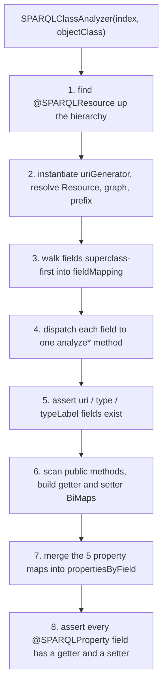
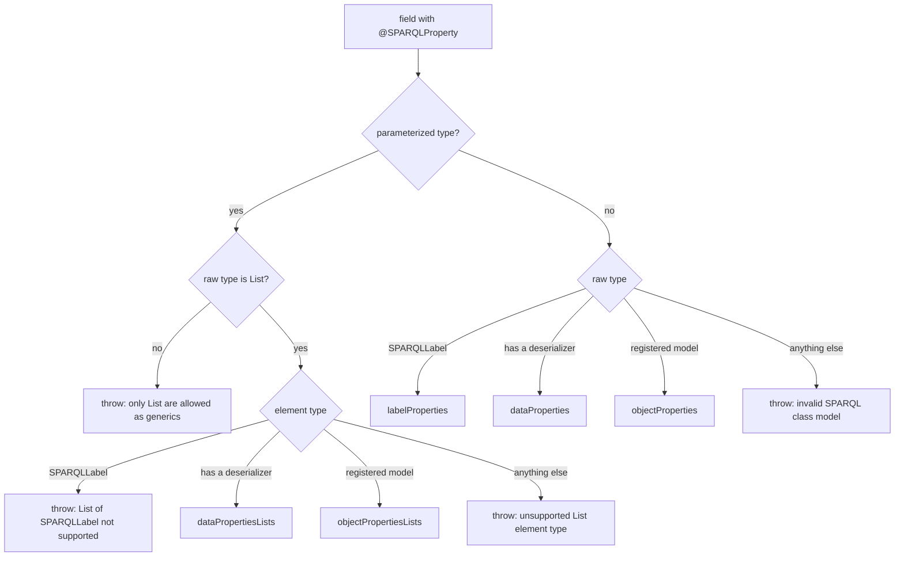

# Technical documentation : [`sparql`] Annotations and class analysis

**Document history (please add a line when you edit the document)**

| Date       | Editor(s)        | OpenSILEX version | Comment           |
|------------|------------------|-------------------|-------------------|
| 2026-09-11 | Arnaud Charleroy | BUILD-SNAPSHOT    | Document creation |
| 2026-09-13 | Arnaud Charleroy | BUILD-SNAPSHOT    | Re-anchored validation-table citations, corrected handleCustomProperties and SparqlMapper |

## Table of contents

<!-- TOC -->
- [Purpose](#purpose)
- [Key classes](#key-classes)
- [Annotation reference](#annotation-reference)
  - [@SPARQLResource](#sparqlresource)
  - [@SPARQLProperty](#sparqlproperty)
  - [@SPARQLResourceURI, @SPARQLTypeRDF, @SPARQLTypeRDFLabel](#sparqlresourceuri-sparqltyperdf-sparqltyperdflabel)
  - [@SPARQLIgnore](#sparqlignore)
  - [@SPARQLManualLoading](#sparqlmanualloading)
- [How it works](#how-it-works)
  - [Phase 1 — class-level annotation](#phase-1--class-level-annotation)
  - [Phase 2 — collecting the fields](#phase-2--collecting-the-fields)
  - [Phase 3 — classifying each field](#phase-3--classifying-each-field)
  - [Phase 4 — the three structural fields](#phase-4--the-three-structural-fields)
  - [Phase 5 — getter/setter resolution](#phase-5--gettersetter-resolution)
- [The derived metadata](#the-derived-metadata)
- [Validation and exceptions](#validation-and-exceptions)
- [What you must write on a model class](#what-you-must-write-on-a-model-class)
- [Worked example](#worked-example)
- [SparqlMapper](#sparqlmapper)
- [Extension points](#extension-points)
- [Gotchas and invariants](#gotchas-and-invariants)
- [See also](#see-also)
<!-- TOC -->

## Purpose

This is the declarative front door of the ORM. A developer describes an RDF resource by writing a
plain Java class, annotating the class with `@SPARQLResource` and its fields with
`@SPARQLProperty`; [SPARQLClassAnalyzer](../../../../../../../opensilex-sparql/src/main/java/org/opensilex/sparql/mapping/SPARQLClassAnalyzer.java)
reflects over that class once, at startup, and turns the annotations into a set of in-memory maps
(field name to Jena `Property`, field name to getter, field name to flags). Every other part of the
ORM — query generation, proxies, CRUD, SHACL generation — reads those maps and never touches an
annotation again. The analyzer is also the only validation gate: a model class that cannot be mapped
fails here, at boot, with an `SPARQLInvalidClassDefinitionException`, not at query time.

## Key classes

| Class | File | Role |
|---|---|---|
| `SPARQLResource` | [SPARQLResource.java](../../../../../../../opensilex-sparql/src/main/java/org/opensilex/sparql/annotations/SPARQLResource.java) | Class-level: which `rdf:type`, which graph, which URI generator |
| `SPARQLProperty` | [SPARQLProperty.java](../../../../../../../opensilex-sparql/src/main/java/org/opensilex/sparql/annotations/SPARQLProperty.java) | Field-level: which predicate, plus 6 behaviour flags |
| `SPARQLResourceURI` | [SPARQLResourceURI.java](../../../../../../../opensilex-sparql/src/main/java/org/opensilex/sparql/annotations/SPARQLResourceURI.java) | Marks the field holding the subject URI |
| `SPARQLTypeRDF` | [SPARQLTypeRDF.java](../../../../../../../opensilex-sparql/src/main/java/org/opensilex/sparql/annotations/SPARQLTypeRDF.java) | Marks the field holding the concrete `rdf:type` |
| `SPARQLTypeRDFLabel` | [SPARQLTypeRDFLabel.java](../../../../../../../opensilex-sparql/src/main/java/org/opensilex/sparql/annotations/SPARQLTypeRDFLabel.java) | Marks the field holding the translated type name |
| `SPARQLIgnore` | [SPARQLIgnore.java](../../../../../../../opensilex-sparql/src/main/java/org/opensilex/sparql/annotations/SPARQLIgnore.java) | Un-maps a field inherited from a parent model |
| `SPARQLManualLoading` | [SPARQLManualLoading.java](../../../../../../../opensilex-sparql/src/main/java/org/opensilex/sparql/annotations/SPARQLManualLoading.java) | Excludes a class from automatic registration |
| `SPARQLClassAnalyzer` | [SPARQLClassAnalyzer.java](../../../../../../../opensilex-sparql/src/main/java/org/opensilex/sparql/mapping/SPARQLClassAnalyzer.java) | The reflection pass; holds all derived metadata |
| `SparqlMapper` | [SparqlMapper.java](../../../../../../../opensilex-sparql/src/main/java/org/opensilex/sparql/mapping/SparqlMapper.java) | Interface for hand-written, reflection-free result mappers |

All seven annotations are `@Retention(RUNTIME)`, `@Documented` and `@Inherited`. `@Inherited` only
has an effect on the two `@Target(TYPE)` annotations (`@SPARQLResource`, `@SPARQLManualLoading`) —
Java never inherits field annotations, so it is decorative on the five field-level ones.

## Annotation reference

### @SPARQLResource

`@Target(TYPE)`. Mandatory on every mapped class. Read at `SPARQLClassAnalyzer.java:103` through
`ClassUtils.findClassAnnotationRecursivly`, which walks up the superclass chain and returns the
first one found — so a subclass that does not redeclare it inherits its parent's type, graph and
prefix.

| Attribute | Type | Default | What the analyzer does with it |
|---|---|---|---|
| `ontology` | `Class<?>` | *(required)* | The vocabulary holder class, e.g. `Oeso.class`, `OWL2.class`. `ontology().getField(resource())` is read reflectively at `SPARQLClassAnalyzer.java:124` |
| `resource` | `String` | *(required)* | Name of a `public static Resource` field inside `ontology`. Its value becomes `getRDFType()` and `getRdfTypeURI()` |
| `uriGenerator` | `Class<? extends URIGenerator>` | `DefaultURIGenerator.class` | Instantiated once via its no-arg constructor (`SPARQLClassAnalyzer.java:114`). **Skipped entirely — `uriGenerator` stays `null` — when the model class itself implements `URIGenerator`** |
| `graph` | `String` | `""` | Empty means "no own graph". Non-empty is stored raw in `getGraph()`; `SPARQLClassObjectMapper.init()` turns it into the default graph URI (absolute value used as-is, relative value appended to the platform base URI) |
| `prefix` | `String` | `""` | Empty means "no prefix". Otherwise exposed as `getResourceGraphPrefix()` and registered as a SPARQL prefix alias by `SPARQLService.addPrefix` (`SPARQLServiceFactory.java:94`) when `usePrefixes` is on |
| `ignoreValidation` | `boolean` | `false` | Inverted into `hasValidation()`. When `true`, `SPARQLClassObjectMapper.generateSHACL()` returns `null` and no SHACL shape is produced for the class |
| `allowBlankNode` | `boolean` | `false` | When `false`, `SPARQLClassQueryBuilder.appendBlankNodeFilter` adds `FILTER(!isBlank(?uri))` to every SELECT/COUNT/ASK. Set to `true` on `OwlRestrictionModel` and `VueClassExtensionModel`, whose instances are genuinely blank nodes |
| `handleCustomProperties` | `boolean` | `false` | When `true`, `SPARQLService.deleteCustomRelations` compares the ontology restrictions of the instance's concrete type against `getManagedPropertiesUris()` and deletes the leftover relations on delete (`SPARQLService.delete`, `SPARQLService.java:1615`). Used by `ScientificObjectModel`, `DeviceModel`, `EventModel`, `FacilityModel` |

The `ontology`/`resource` split exists because Jena vocabulary classes expose their terms as static
fields, and an annotation attribute cannot hold a `Resource` instance — only a class literal and a
string. The cost is that a typo in `resource` is a runtime failure, not a compile error.

### @SPARQLProperty

`@Target(FIELD)`. Declares one predicate for one field. Handled by `analyzeSPARQLPropertyField`
(`SPARQLClassAnalyzer.java:259`).

| Attribute | Type | Default | What the analyzer does with it |
|---|---|---|---|
| `ontology` | `Class<?>` | *(required)* | Same pattern as `@SPARQLResource`: holder class for the predicate |
| `property` | `String` | *(required)* | Name of a `public static Property` field in `ontology`. Resolved at `SPARQLClassAnalyzer.java:262-267` |
| `required` | `boolean` | `false` | When `false` the field name is pushed into `optionalFields`; the query builder then wraps its triple pattern in an `OPTIONAL`. Also drives `sh:minCount` in SHACL generation |
| `inverse` | `boolean` | `false` | Pushes the field into `reverseRelationFields` after `checkAllowedReverseField`. The triple is generated as `?object ?predicate ?uri` instead of `?uri ?predicate ?object` |
| `ignoreUpdateIfNull` | `boolean` | `false` | Pushes the field into `ignoreUpdateIfNullFields`, consumed by `SPARQLClassQueryBuilder.getDeleteBuilderForUpdateCases` (`SPARQLClassQueryBuilder.java:404`) to exclude the predicate from the delete half of an update when the new value is `null` |
| `cascadeDelete` | `boolean` | `false` | **Only honoured on object properties and object lists** (`SPARQLClassAnalyzer.java:282` and `:303`). Records `field name -> target model class` in `cascadeDeleteClassesField`, consumed by `SPARQLService.java:1576` |
| `autoUpdate` | `boolean` | `false` | **Only honoured on object properties and object lists.** Single-valued fields go to `autoUpdateFields`, lists to `autoUpdateListFields`; both are read by `SPARQLService.updateFields` |
| `useDefaultGraph` | `boolean` | `true` | When `true` the field name is added to `defaultGraphFields`, meaning "the related object lives in *its own* class default graph". When `false`, the object is looked up in the *subject's* graph instead |

`useDefaultGraph = false` is what makes an experiment-scoped scientific object work: in
`ScientificObjectModel`, `parent`, `experiment` and `children` all set it, because those objects are
stored in the experiment graph, not in the global `scientific-object` graph. See
[graph organization](../graph-organization.md).

The behavioural trio `ignoreUpdateIfNull` / `autoUpdate` / `cascadeDelete` is described from the
*user's* point of view in [sparql-property-annotation.md](../sparql-property-annotation.md); this
document only covers what the analyzer records.

### @SPARQLResourceURI, @SPARQLTypeRDF, @SPARQLTypeRDFLabel

`@Target(FIELD)`, no attributes. These three mark the structural fields every mapped instance has:
the subject URI, the concrete `rdf:type` of the instance (which may be a subclass of the class-level
`resource`), and the translated label of that type. Each must appear **exactly once** in the
hierarchy; the analyzer stores them in `fieldURI`, `fieldType` and `fieldTypeLabel` and refuses a
second occurrence.

In practice you never write them yourself: they are declared once on
[SPARQLResourceModel](../../../../../../../opensilex-sparql/src/main/java/org/opensilex/sparql/model/SPARQLResourceModel.java)
(`uri`, `rdfType`, `rdfTypeName`) and inherited by every model. `@SPARQLTypeRDF` is the only place
where `RDF.type` is added to `managedProperties` (`SPARQLClassAnalyzer.java:407`).

### @SPARQLIgnore

`@Target(FIELD)`, no attributes. Removes a field from the mapping. Because the hierarchy walk goes
superclass-first, redeclaring an inherited field in a subclass and annotating it `@SPARQLIgnore`
drops the parent's mapping. The canonical use is `GermplasmModel`, which replaces the single-language
`name : String` of `SPARQLNamedResourceModel` with a multilingual `label : SPARQLLabel` on the same
`rdfs:label` predicate:

```java
// opensilex-core GermplasmModel.java:58
@SPARQLIgnore
protected String name;

@SPARQLProperty(ontology = RDFS.class, property = "label", required = true)
protected SPARQLLabel label;
```

`ClassModel`, `ObjectPropertyModel` and `DatatypePropertyModel` use the same trick.

### @SPARQLManualLoading

`@Target(TYPE)`, no attributes. The analyzer itself ignores it; it is read one level up, by
`SPARQLClassObjectMapperIndex.addClasses` (`SPARQLClassObjectMapperIndex.java:78`), which drops every
annotated class from the set of models to register. Two consequences worth knowing:

- the class gets no mapper, so `SPARQLService` cannot create, search or load it;
- because `existsForClass` consults that same mutated set, **another model that declares a field of
  that type is rejected** with `refer to an invalid SPARQL class model`.

It exists so a deliberately broken class can be compiled into the test sources without breaking
startup — `NoGetterClass` and `NoSetterClass` in `opensilex-sparql/src/test` are its only users.

## How it works

The analyzer is constructed once per model class, from `SPARQLClassObjectMapper.init()`, which is
itself called by the mapper index after every mapper object has been created. That ordering matters:
by the time any analyzer runs, the index already knows the full set of model classes, so
`mapperIndex.existsForClass(...)` can answer for classes whose own analysis has not happened yet.



### Phase 1 — class-level annotation

`ClassUtils.findClassAnnotationRecursivly(objectClass, SPARQLResource.class)` walks up superclasses
until it finds the annotation; `null` means the class is not mappable and the constructor throws
immediately (`SPARQLClassAnalyzer.java:105`).

`ignoreValidation`, `allowBlankNode` and `handleCustomProperties` are copied into final fields. The
URI generator is built next: if the model class implements `URIGenerator` itself, `uriGenerator` is
deliberately left `null` (`SPARQLClassAnalyzer.java:111`), and `SPARQLClassObjectMapper.getUriGenerator(instance)`
then returns the *instance* as its own generator. That is how `ClassURIGenerator` models such as
`SPARQLNamedResourceModel` build a URI from their own name.

Finally, `resource` is resolved to a Jena `Resource` and `graph`/`prefix` are normalised: an empty
string becomes `null`, so downstream code can test for absence with a null check.

### Phase 2 — collecting the fields

```java
// SPARQLClassAnalyzer.java:152
ClassUtils.executeOnClassFieldsRecursivly(objectClass, (parentClass, field) -> {
    SPARQLIgnore ignoreProperty = field.getDeclaredAnnotation(SPARQLIgnore.class);
    if (ignoreProperty != null) {
        fieldMapping.remove(field.getName());
    } else {
        if (field.getAnnotation(SPARQLProperty.class) != null
                || field.getAnnotation(SPARQLResourceURI.class) != null
                || field.getAnnotation(SPARQLTypeRDF.class) != null
                || field.getAnnotation(SPARQLTypeRDFLabel.class) != null) {
            fieldMapping.put(field.getName(), field);
        }
    }
}, SPARQLResourceModel.class);
```

`executeOnClassFieldsRecursivly` recurses into the superclass *before* iterating the declared fields
of the current class, and stops at the `rootClass` argument — here `SPARQLResourceModel`, whose own
fields are still visited. So the visit order is `SPARQLResourceModel`, then each intermediate class,
then the concrete class. `fieldMapping` is keyed by **simple field name**, which gives the
override semantics: a subclass field of the same name replaces the parent's entry, and a subclass
`@SPARQLIgnore` erases it.

Unannotated fields are silently skipped — that is how `SPARQLResourceModel.relations` and
`SPARQLTreeModel.parent`/`children` stay out of the mapping until a subclass annotates them.

### Phase 3 — classifying each field

Each surviving field gets `setAccessible(true)` (`SPARQLClassAnalyzer.java:167`) and is dispatched on
its annotation. `@SPARQLProperty` fields go to `analyzeSPARQLPropertyField`, which decides the
field's category from its **generic type** alone:



"Has a deserializer" means `SPARQLDeserializers.existsForClass(type)` — the registry in
[SPARQLDeserializers](../../../../../../../opensilex-sparql/src/main/java/org/opensilex/sparql/deserializer/SPARQLDeserializers.java)
covering `String`, the boxed numerics, `Boolean`, `Character`, `LocalDate`, `OffsetDateTime`,
`BigInteger`, `URI` and `InternetAddress`. "Registered model" means
`mapperIndex.existsForClass(type)`. Note the precedence: `URI` is a *data* property, so a field typed
`URI` is stored as a literal-style value and is the only data type allowed to carry `inverse = true`.

After classification, the same method records the flags (`SPARQLClassAnalyzer.java:312-340`): unique
property, optional, default graph, inverse, ignore-update-if-null, then the annotation itself, the
field, and the predicate in `managedProperties` (raw URI) and `managedPropertiesUris` (URI passed
through `SPARQLDeserializers.formatURI`, i.e. prefixed form when prefixes are enabled).

`checkAllowedReverseField` (`SPARQLClassAnalyzer.java:343`) runs *before* the field is added to
`reverseRelationFields` and rejects three cases: a non-`URI` data property, a `List` of non-`URI`
literals, and a `SPARQLLabel`. The reason is mechanical — a literal cannot be the subject of a
triple, so `?literal ?p ?uri` is not expressible.

### Phase 4 — the three structural fields

`analyzeSPARQLResourceURIField`, `analyzeSPARQLTypeField` and `analyzeSPARQLTypeLabelField` each
assign a single field and throw if the slot is already taken. After the loop, the constructor asserts
all three were found (`SPARQLClassAnalyzer.java:196-206`). Note that these three fields land in
`fieldsByName` but **not** in `propertiesByField`, `annotationsByField` or any of the five property
maps — they are addressed through `getURIField()`, `getTypeFieldName()` and
`getTypeLabelFieldName()`.

### Phase 5 — getter/setter resolution

`objectClass.getMethods()` returns all public methods including inherited ones. Abstract methods are
skipped (`SPARQLClassAnalyzer.java:215`) because an abstract declaration plus its implementation
would insert the same field name twice into the `BiMap` and throw `IllegalArgumentException`.

- `isGetter`: name starts with `get` and the return type is not `void`; or name starts with `is` and
  the return type is `boolean`/`Boolean`.
- `isSetter`: name starts with `set` and the return type is `void`.
- `findFieldByGetter` strips the prefix, lowercases the first letter, looks the name up in
  `fieldsByName`, and accepts the pair only if
  `returnType.equals(fieldType) || returnType.isAssignableFrom(fieldType)`.
- `findFieldBySetter` does the same and requires exactly one parameter whose type
  `isAssignableFrom(fieldType)`.

The `isAssignableFrom` relaxation is what makes generic hierarchies work: `SPARQLTreeModel.getParent()`
erases to a return type of `SPARQLTreeModel`, while the shadowing field in `ScientificObjectModel` is
typed `ScientificObjectModel` — assignable, so the pair is accepted.

Both maps are Guava `BiMap`s, so the analyzer can go `Method -> field name` and `field name -> Method`.
The final loop (`SPARQLClassAnalyzer.java:238-252`) re-walks the `@SPARQLProperty` fields and throws
if either accessor is missing. The URI/type/typeLabel fields are **not** checked, which is why a class
would still initialise without `getUri()` — in practice `SPARQLResourceModel` always provides them.

## The derived metadata

| Field of the analyzer | Type | Keyed by | Filled from | Main consumer |
|---|---|---|---|---|
| `dataProperties` | `Map<String, Property>` | field name | literal-typed `@SPARQLProperty` | SELECT/INSERT triple generation, SHACL `sh:datatype` |
| `objectProperties` | `Map<String, Property>` | field name | model-typed `@SPARQLProperty` | proxy creation, SHACL `sh:class` |
| `dataPropertiesLists` | `Map<String, Property>` | field name | `List` of literals | `SPARQLProxyListData`, `SPARQLListFetcher` |
| `objectPropertiesLists` | `Map<String, Property>` | field name | `List` of models | `SPARQLProxyListObject` |
| `labelProperties` | `Map<String, Property>` | field name | `SPARQLLabel`-typed field | multilingual label triples |
| `propertiesByField` | `Map<String, Property>` | field name | union of the five above | `getFieldProperty(field)` |
| `fieldsByName` | `Map<String, Field>` | field name | every mapped field, structural ones included | every `getFieldFromName` lookup |
| `fieldsByUniqueProperty` | `Map<Property, String>` | Jena `Property` | properties used by exactly one field | `SPARQLService.java:578` and `:612`, relation-to-field resolution |
| `managedProperties` | `Set<Property>` | — | every mapped predicate plus `RDF.type` | `SPARQLProxyRelationList`, dynamic-relation filtering |
| `managedPropertiesUris` | `Set<String>` | — | same, `formatURI`-normalised | custom-property deletion, CSV import |
| `fieldsByGetter` / `fieldsBySetter` | `BiMap<Method, String>` | `Method` | public accessors | reading/writing instance values |
| `relatedModelsFields` | `Map<Class, Set<String>>` | target model class | object properties and object lists | reverse-relation index, cascade delete of incoming links |
| `annotationsByField` | `Map<String, SPARQLProperty>` | field name | `@SPARQLProperty` fields | `getFieldAnnotation` |
| `optionalFields` | `List<String>` | — | `required = false` | `OPTIONAL` wrapping |
| `defaultGraphFields` | `List<String>` | — | `useDefaultGraph = true` | graph choice for nested objects |
| `reverseRelationFields` | `List<String>` | — | `inverse = true` | triple direction |
| `cascadeDeleteClassesField` | `Map<String, Class>` | field name | `cascadeDelete = true` | `SPARQLService.delete` |
| `autoUpdateFields` / `autoUpdateListFields` | `List<String>` | — | `autoUpdate = true` | `SPARQLService.updateFields` |
| `ignoreUpdateIfNullFields` | `List<String>` | — | `ignoreUpdateIfNull = true` | delete-for-update predicate exclusion |

Everything is stored **by field name, not by `Field` object**, and re-resolved through `fieldsByName`
on the way out (`getAutoUpdateFields()`, `getCascadeDeleteClassesField()`, and the `forEach*`
methods all do this). That is deliberate: it keeps a single canonical `Field` instance per name even
when a subclass shadows a parent field.

The `forEach*` methods (`forEachDataProperty`, `forEachObjectProperty`, `forEachDataPropertyList`,
`forEachObjectPropertyList`, `forEachLabelProperty`) are the iteration API used by
`SPARQLClassQueryBuilder` for both query generation and SHACL shape generation. The four `protected`
helpers `getFieldDatatype`, `getFieldListDatatype`, `getFieldRDFType` and `getFieldListRDFType` exist
only for SHACL: they resolve a field to its `XSDDatatype` or to the target class's `rdf:type`, and
**log-and-return-null** rather than throwing on failure.

## Validation and exceptions

Every failure mode is an `SPARQLInvalidClassDefinitionException`
([source](../../../../../../../opensilex-sparql/src/main/java/org/opensilex/sparql/exceptions/SPARQLInvalidClassDefinitionException.java)),
whose `getMessage()` prefixes the class name. All of them fire during module startup.

| Line | Message | Trigger |
|---|---|---|
| `:105` | `annotation not found: ...SPARQLResource` | no `@SPARQLResource` anywhere up the hierarchy |
| `:117` | `uri generator must have an empty constructor` | `uriGenerator` class has no no-arg constructor |
| `:119` | `Technical error while creating uri generator` | generator constructor threw, or is not accessible |
| `:144` | `Resource type X does not exists in ontology: Y` | `resource` names no static field of `ontology` |
| `:146` | `Technical error while reading annotation` | the named field is not a `Resource`, or is not static/public |
| `:197` / `:201` / `:205` | `... annotation not found` | none of the three structural fields was found |
| `:246` | `no getter found for the field: X` | a `@SPARQLProperty` field with no matching public getter |
| `:250` | `no setter found for the field: X` | same for the setter |
| `:266` | `Property type X does not exists in ontology: Y` | `property` names no static `Property` field |
| `:275` | `List<SPARQLLabel> are not supported` | multilingual lists are not implemented |
| `:289` | `List<X> is not supported` | list element type is neither deserializable nor a registered model |
| `:292` | `only List are allowed as generics` | any parameterized field type other than `List` (a `Map` or a `Set`, for instance) |
| `:309` | `refer to an invalid SPARQL class model` | field type is neither deserializable nor a registered model — the usual cause is a forgotten `@SPARQLResource`, or a `@SPARQLManualLoading` target |
| `:346` / `:351` / `:354` | `... not allowed to be a reverse property` | `inverse = true` on a non-`URI` literal, a list of non-`URI` literals, or a `SPARQLLabel` |
| `:371` | `SPARQLResourceURI annotation must be unique` | two `@SPARQLResourceURI` fields |
| `:385` | `SPARQLTypeRDF annotation must be unique` | two `@SPARQLTypeRDFLabel` fields — the message names the wrong annotation (copy-paste in `analyzeSPARQLTypeLabelField`) |
| `:399` | `SPARQLTypeRDF annotation must be unique` | two `@SPARQLTypeRDF` fields |

## What you must write on a model class

The minimum contract for a class to be picked up and mapped:

1. **Extend `SPARQLResourceModel`** (directly or through `SPARQLNamedResourceModel` /
   `SPARQLTreeModel`). This supplies the `@SPARQLResourceURI`, `@SPARQLTypeRDF` and
   `@SPARQLTypeRDFLabel` fields, which are mandatory and which you should not redeclare.
2. **Annotate the class with `@SPARQLResource`**, giving at least `ontology` and `resource`. Add
   `graph` and `prefix` if the resource has its own named graph.
3. **Provide a public no-argument constructor.** Checked by `SPARQLClassObjectMapper.init()`, not by
   the analyzer, with the message `Impossible to find constructor with no parameters`.
4. **Annotate each mapped field with `@SPARQLProperty`**, with a field type that is either
   deserializable, a registered model, `SPARQLLabel`, or a `List` of one of the first two.
5. **Write a public getter and a public setter** for every `@SPARQLProperty` field, following the
   JavaBean naming convention. `isX()` is accepted for `boolean`/`Boolean` only.
6. **Make sure the class is on the classpath of an OpenSILEX module** —
   `SPARQLServiceFactory.java:82` discovers models by scanning for `@SPARQLResource`, there is no
   registration list to update.

Conventionally each model also declares a `public static final String X_FIELD = "x";` constant per
field, because query helpers and DAOs address fields by name.

## Worked example

The test model `B`
([B.java](../../../../../../../opensilex-sparql/src/test/java/org/opensilex/sparql/model/B.java))
exercises most categories in a few lines:

```java
@SPARQLResource(
        ontology = TEST_ONTOLOGY.class,
        resource = "B",
        graph = TEST_ONTOLOGY.GRAPH_SUFFIX      // "test_data"
)
public class B extends SPARQLResourceModel {

    @SPARQLProperty(ontology = TEST_ONTOLOGY.class, property = "hasRelationToB", inverse = true)
    private A a;

    @SPARQLProperty(ontology = TEST_ONTOLOGY.class, property = "hasFloat", required = true)
    private Float floatVar;

    @SPARQLProperty(ontology = TEST_ONTOLOGY.class, property = "hasString")
    private String stringVar;

    @SPARQLProperty(ontology = TEST_ONTOLOGY.class, property = "hasStringList")
    private List<String> stringList;

    @SPARQLProperty(ontology = TEST_ONTOLOGY.class, property = "hasAList")
    private List<A> aList;

    // ... getters and setters for every field above
}
```

What the analyzer derives (abridged — `B` also declares `integer`, `longVar`, `bool`, `doubleVar`,
`charVar`, `shortVar`, `byteVar`):

| Derived item | Value |
|---|---|
| `resource` / `rdfTypeURI` | `http://test.opensilex.org/B` |
| `graph` | `"test_data"` (relative, so the mapper resolves it against the platform base URI) |
| `graphPrefix` | `null` |
| `uriGenerator` | a `DefaultURIGenerator` instance |
| `fieldURI` / `fieldType` / `fieldTypeLabel` | `uri`, `rdfType`, `rdfTypeName`, all inherited |
| `dataProperties` | `floatVar`, `doubleVar`, `charVar`, `shortVar`, `byteVar`, `stringVar`, `integer`, `longVar`, `bool`, plus the inherited `publisher`, `publicationDate`, `lastUpdateDate` |
| `objectProperties` | `a -> test:hasRelationToB` |
| `dataPropertiesLists` | `stringList -> test:hasStringList` |
| `objectPropertiesLists` | `aList -> test:hasAList` |
| `labelProperties` | *(empty)* — `hasLabelProperty()` returns `false` |
| `optionalFields` | everything except `floatVar`, `doubleVar`, `charVar`, `shortVar` |
| `reverseRelationFields` | `[a]` |
| `defaultGraphFields` | every `@SPARQLProperty` field (none sets `useDefaultGraph = false`) |
| `relatedModelsFields` | `{ A.class -> {a, aList} }` |
| `managedProperties` | `rdf:type`, `dcterms:publisher`, `dcterms:issued`, `dcterms:modified` and the twelve `test:has*` predicates |
| `fieldsByUniqueProperty` | one entry per predicate — all are used once here |
| `cascadeDeleteClassesField`, `autoUpdateFields`, `ignoreUpdateIfNullFields` | all empty |

Contrast with `ScientificObjectModel`, which declares **two** fields on `oeso:isPartOf` (`parent`,
and `children` with `inverse = true`). The second one removes the entry
(`SPARQLClassAnalyzer.java:312`), so `getFieldFromUniqueProperty(Oeso.isPartOf)` returns `null` for
that model — which is the intended meaning of "unique", but a silent one.

## SparqlMapper

[SparqlMapper](../../../../../../../opensilex-sparql/src/main/java/org/opensilex/sparql/mapping/SparqlMapper.java)
is a small interface that sits *beside* the annotation machinery rather than inside it. It describes
a hand-written mapper: given a `SPARQLResult` row and a language, build a model instance. Only
`getConstructor()` is abstract; `useFormattedUri()`, `getInstance(...)` and `setUriAndType(...)` carry
real default bodies (`SparqlMapper.java:15-40`) and the six other `setXxx` steps are empty defaults.
`getInstance` calls them in a fixed order:

```java
T instance = getConstructor().newInstance();
setUriAndType(instance, result, lang);
setLabel(instance, result, lang);
setLabelProperties(instance, result, lang);
setDataProperties(instance, result, lang);
setObjectProperties(instance, result, lang);
setDataListProperties(instance, result, lang);
setObjectListProperties(instance, result, lang);
```

`setUriAndType` is the only one of the seven steps with a body: it reads the `uri` and `rdfType` columns by the
constants `SPARQLResourceModel.URI_FIELD` / `TYPE_FIELD` and optionally runs them through
`UriFormater.formatURI` when `useFormattedUri()` is overridden to `true`. The default is `false`,
with a `#TODO all mapper should use formatted URI` note in the source — so URI shortening behaviour
is inconsistent by design, and the reason is not documented further. The point of the interface is to
let a hot path skip reflection entirely; see
[proxies and lazy loading](./04-proxies-and-lazy-loading.md) for `SparqlNoProxyFetcher`, which does
the equivalent work driven by the analyzer.

## Extension points

- **Declaring a model** — annotate and put it on the classpath. Classpath scanning at
  `SPARQLServiceFactory.java:82` does the rest; no registry edit needed. A downstream module gets its
  models mapped simply by depending on `opensilex-sparql`.
- **Custom URI shapes** — either implement `ClassURIGenerator<T>` on the model (the analyzer then
  leaves `uriGenerator` null and the instance generates its own URI from `getInstancePathSegments`),
  or write a stateless `URIGenerator` implementation with a no-arg constructor and point
  `@SPARQLResource(uriGenerator = ...)` at it. `UriGeneratedTestModel` in the test sources is the
  minimal example of the first form.
- **Extending an existing model** — subclass it. `@SPARQLResource` is `@Inherited`, so the subclass
  keeps the parent's type/graph/prefix unless it redeclares the annotation; the field walk picks up
  both the parent's and the subclass's annotated fields.
- **Replacing an inherited field's mapping** — redeclare it with `@SPARQLIgnore` and add the
  replacement field (the `GermplasmModel` pattern). Read the first gotcha below before doing this.
- **Adding a new field category** — this is the invasive change. A new category means a new map in
  the analyzer, a branch in `analyzeSPARQLPropertyField`, a `forEach*` accessor, and matching cases in
  `SPARQLClassQueryBuilder` (SELECT, INSERT, DELETE and SHACL) and in `SPARQLClassObjectMapper`.
- **Registering a new literal type** — do not touch the analyzer: add a `SPARQLDeserializer` instead,
  and the new class automatically becomes a valid data-property type. See
  [type system and deserializers](./08-type-system-deserializers.md).

## Gotchas and invariants

- **Field shadowing splits a field in two.** When a subclass redeclares an inherited field (the
  `@SPARQLIgnore` pattern, and `ScientificObjectModel`'s `parent`/`children` over
  `SPARQLTreeModel`'s), the analyzer indexes the *subclass* `Field` object, but the inherited getter
  and setter still read and write the *superclass* field. Code that goes through
  `getFieldValue(field, instance)` (which invokes the getter) sees the right value; code that calls
  `field.get(instance)` directly sees the shadow, which the ORM never writes. Three call sites do the
  latter: `SPARQLClassQueryBuilder.java:409` (the `ignoreUpdateIfNull` check) and
  `SPARQLService.java:1366` / `:1383` (the `autoUpdate` reads). For `ScientificObjectModel.children`,
  annotated `ignoreUpdateIfNull = true`, `field.get(model)` is therefore always `null` and the
  predicate is always excluded from the update's delete step. If you redeclare a field, redeclare its
  accessors too.
- **`fieldsByUniqueProperty` is not a count.** The logic is "contains then remove, else put"
  (`SPARQLClassAnalyzer.java:312-316`). With two fields on one predicate the entry disappears, as
  intended — but with *three*, the third `put` restores it, and which field wins depends on
  `HashMap` iteration order. No model currently does this; a model that did would get
  non-deterministic behaviour from `SPARQLService.getByUniqueProperty`.
- **Two accessors for the same field throw an unchecked exception.** `fieldsByGetter` and
  `fieldsBySetter` are `HashBiMap`s, so inserting a second method for the same field name raises
  `IllegalArgumentException`, not `SPARQLInvalidClassDefinitionException`. Declaring both `getBool()`
  and `isBool()` for one `Boolean` field is enough to trigger it. The abstract-method skip at
  `SPARQLClassAnalyzer.java:215` exists for exactly this reason and says so in its comment.
- **`cascadeDelete` and `autoUpdate` are silently ignored on data properties.** Both are only read
  inside the object-property and object-list branches. Putting them on a `String` or a
  `List<String>` compiles, passes analysis, and does nothing.
- **The `@SPARQLIgnore` re-check in the second loop is dead code.** `SPARQLClassAnalyzer.java:169-172` (the `continue` on a re-read `@SPARQLIgnore`)
  re-tests the annotation, but the walk at `:153-155` never puts an ignored field into `fieldMapping` in
  the first place.
- **`analyzeSPARQLTypeLabelField` reports the wrong annotation name.** A duplicate
  `@SPARQLTypeRDFLabel` produces a message naming `SPARQLTypeRDF` (`SPARQLClassAnalyzer.java:385`).
- **`getFieldValue` swallows every exception** and returns `null` (`SPARQLClassAnalyzer.java:533`).
  A getter that throws is indistinguishable from a null value. `getURI(instance)` wraps it and logs
  `should never happend`.
- **Accessor names are derived with regexes.** `findFieldByGetter`/`findFieldBySetter` use
  `fieldName.replaceFirst(firstLetter, firstLetter.toLowerCase())`, where `firstLetter` is compiled
  as a regular expression and used as a replacement string. A field whose name starts with `$` — legal
  Java — would break this. No model does, but do not assume the name handling is literal.
- **`isNullIgnorableUpdateField(Field)` and `getFieldAnnotation(Field)` have no callers** anywhere in
  the repository, and the first one NPEs on the URI/type/typeLabel fields since they have no entry in
  `annotationsByField`. Treat them as unused API.
- **`SPARQLManualLoading` is transitive by omission.** Marking a class manual does not just skip its
  mapper: any other model referencing it by type now fails analysis with `refer to an invalid SPARQL
  class model`, because `existsForClass` consults the same set the annotation removed it from.
- **The analyzer is built once and never refreshed.** It holds `Field` and `Method` objects with
  `setAccessible(true)` for the lifetime of the `SPARQLServiceFactory`. It is read-only after
  construction and therefore thread-safe, but nothing guards the maps: do not mutate them from a
  subclass.
- **The unit test for this class is entirely commented out.** `SPARQLClassAnalyzerTest` contains only
  disabled tests referring to a removed `SPARQLClassObjectMapper.includeResourceClass` API, so
  `NoGetterClass` and `NoSetterClass` currently assert nothing.

## See also

- [ORM architecture overview](../orm-architecture.md) — where the declarative layer sits.
- [Object mapper and index](./02-object-mapper-and-index.md) — `SPARQLClassObjectMapper`, the
  registration lifecycle, and how `graph`/`prefix` become a default graph URI.
- [Query generation](./03-query-generation.md) — how the five property maps become triple patterns
  and SHACL shapes.
- [Proxies and lazy loading](./04-proxies-and-lazy-loading.md) — what `useDefaultGraph` and
  `inverse` mean at fetch time.
- [SPARQLService CRUD](./05-sparql-service-crud.md) and
  [transactions, URI and validation](./06-transactions-uri-and-validation.md) — consumers of
  `cascadeDelete`, `autoUpdate`, `uriGenerator` and `handleCustomProperties`.
- [Type system and deserializers](./08-type-system-deserializers.md) — the registry that decides
  data property versus object property.
- [sparql-property-annotation.md](../sparql-property-annotation.md) — the behavioural story of
  `@IgnoreUpdateIfNull`, `@AutoUpdate` and `@CascadeDelete`, including their recursion warnings.
- [sparql-update.md](../sparql-update.md) — how updates use those flags.
- [Graph organization](../graph-organization.md) and
  [graph storage](../../architecture/sparql/graph-storage.md) — what `graph` and `prefix` select.
- [Metadata](../metadata.md) — `SPARQLModelRelation` and the properties *not* covered by
  `managedProperties`.
