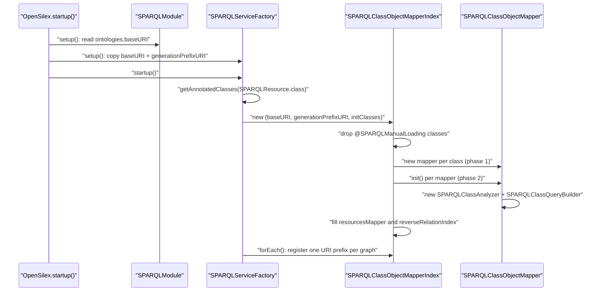
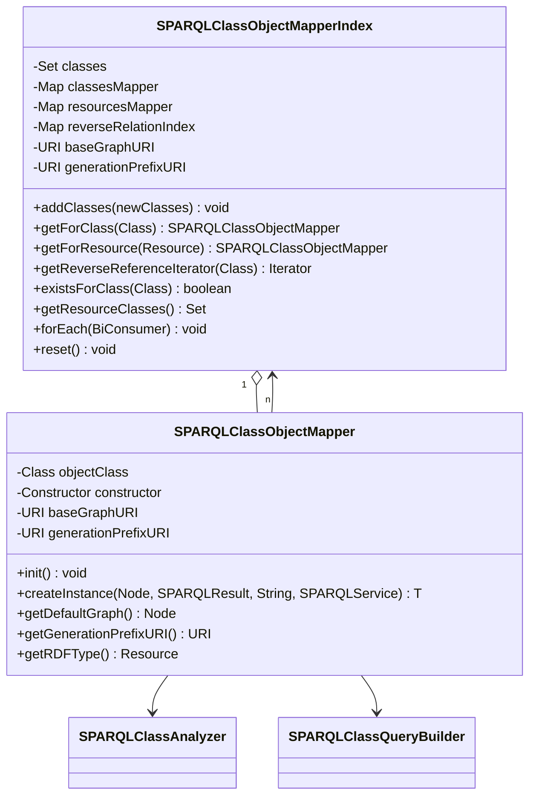
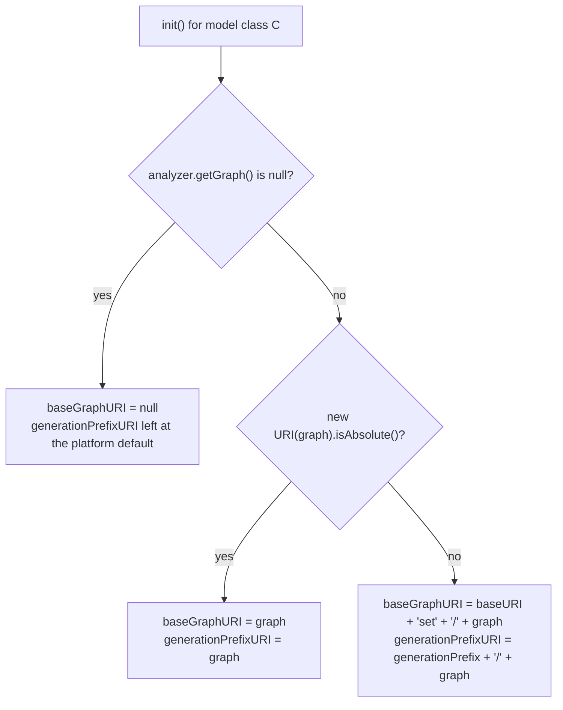

# Technical documentation : [`sparql`] Object mappers and the mapper index

**Document history (please add a line when you edit the document)**

| Date       | Editor(s)        | OpenSILEX version | Comment           |
|------------|------------------|-------------------|-------------------|
| 2026-09-11 | Arnaud Charleroy | BUILD-SNAPSHOT    | Document creation |
| 2026-09-13 | Arnaud Charleroy | BUILD-SNAPSHOT    | Corrected createInstance loading semantics, added the graph-choice recipe |

## Table of contents

<!-- TOC -->
- [Purpose](#purpose)
- [Key classes](#key-classes)
- [How it works](#how-it-works)
  - [When the index is built](#when-the-index-is-built)
  - [Two-phase construction](#two-phase-construction)
  - [What a mapper caches](#what-a-mapper-caches)
- [The four lookup tables](#the-four-lookup-tables)
  - [classesMapper: lookup by Java class](#classesmapper-lookup-by-java-class)
  - [resourcesMapper: lookup by rdf type](#resourcesmapper-lookup-by-rdf-type)
  - [reverseRelationIndex: who points at me](#reverserelationindex-who-points-at-me)
  - [classes: the "will be registered" set](#classes-the-will-be-registered-set)
- [Graph resolution rules](#graph-resolution-rules)
  - [Choosing a graph for a new concept](#choosing-a-graph-for-a-new-concept)
- [Excluding a class with @SPARQLManualLoading](#excluding-a-class-with-sparqlmanualloading)
- [From a SPARQLResult to a model instance](#from-a-sparqlresult-to-a-model-instance)
- [From a model back to triples](#from-a-model-back-to-triples)
- [Inheritance between model classes](#inheritance-between-model-classes)
- [Mutability and thread-safety](#mutability-and-thread-safety)
- [Extension points](#extension-points)
- [Gotchas and invariants](#gotchas-and-invariants)
- [See also](#see-also)
<!-- TOC -->

## Purpose

`SPARQLClassObjectMapper` is the per-model-class runtime object of the ORM: one instance per
annotated model class, holding the analysis of that class (its `SPARQLClassAnalyzer`), its query
builder, its no-argument constructor, and the two URIs derived from its `@SPARQLResource(graph=...)`
declaration — the named graph its instances live in, and the prefix under which their URIs are
generated. `SPARQLClassObjectMapperIndex` owns every mapper instance and is the only legitimate way
to obtain one: it is built once at service-factory startup from the set of classes discovered by the
annotation scan, and it answers three questions — "which mapper for this Java class", "which mapper
for this rdf type", and "which classes hold a reference to this class". Everything above (the CRUD
facade, the proxies, the CSV pipeline) reaches the mapper through the index, never by constructing
one.

## Key classes

| Class | File | Role |
|-------|------|------|
| `SPARQLClassObjectMapper` | [SPARQLClassObjectMapper.java](../../../../../../../opensilex-sparql/src/main/java/org/opensilex/sparql/mapping/SPARQLClassObjectMapper.java) | Per-class mapper: instantiation from results, graph/URI resolution, delegation to the query builder. Protected constructor. |
| `SPARQLClassObjectMapperIndex` | [SPARQLClassObjectMapperIndex.java](../../../../../../../opensilex-sparql/src/main/java/org/opensilex/sparql/mapping/SPARQLClassObjectMapperIndex.java) | Registry of every mapper, plus the reverse-relation index. |
| `SPARQLClassAnalyzer` | [SPARQLClassAnalyzer.java](../../../../../../../opensilex-sparql/src/main/java/org/opensilex/sparql/mapping/SPARQLClassAnalyzer.java) | Reflection pass over the annotated class; see [Annotations and class analysis](./01-annotations-and-class-analysis.md). |
| `SPARQLClassQueryBuilder` | [SPARQLClassQueryBuilder.java](../../../../../../../opensilex-sparql/src/main/java/org/opensilex/sparql/mapping/SPARQLClassQueryBuilder.java) | SELECT/COUNT/ASK/INSERT/DELETE generation; see [Query generation](./03-query-generation.md). |
| `SPARQLServiceFactory` | [SPARQLServiceFactory.java](../../../../../../../opensilex-sparql/src/main/java/org/opensilex/sparql/service/SPARQLServiceFactory.java) | Builds the index in `startup()` and hands it to every `SPARQLService` it provides. |
| `SPARQLMapperNotFoundException` | [SPARQLMapperNotFoundException.java](../../../../../../../opensilex-sparql/src/main/java/org/opensilex/sparql/exceptions/SPARQLMapperNotFoundException.java) | Thrown on a lookup miss, by class or by `Resource`. |
| `SPARQLManualLoading` | [SPARQLManualLoading.java](../../../../../../../opensilex-sparql/src/main/java/org/opensilex/sparql/annotations/SPARQLManualLoading.java) | Marker annotation excluding a class from automatic registration. |
| `SPARQLProxyMarker` | [SPARQLProxyMarker.java](../../../../../../../opensilex-sparql/src/main/java/org/opensilex/sparql/mapping/SPARQLProxyMarker.java) | Empty interface implemented by every ByteBuddy proxy; the hook `getConcreteClass` uses to unwrap. |

## How it works

### When the index is built

Exactly once per OpenSILEX instance, inside `SPARQLServiceFactory.startup()`
(`SPARQLServiceFactory.java:77-86`). The ordering in `OpenSilex.startup()`
(`OpenSilex.java:518-539`) matters and is the reason `SPARQLModule` must publish the base URIs
during `setup()`:

1. every module gets `setOpenSilex()`, then `OpenSilex.setup()` runs;
2. every service gets `setup()` — `SPARQLServiceFactory.setup()` reads `baseURI` and
   `generationPrefixURI` from `SPARQLModule` (`SPARQLModule.java:65-103`);
3. every service gets `startup()` — this is where the index is built;
4. only then do the modules get `startup()`.

The class set comes from `getOpenSilex().getAnnotatedClasses(SPARQLResource.class)`, a Reflections
scan over every loaded module. So the content of the index is "every `@SPARQLResource`-annotated
class on the classpath of the active profile", not a hand-maintained list.



The last step is the only other use of the index at startup: when `usePrefixes()` is on, the factory
walks `resourcesMapper` and registers `baseURIAlias + resourceGraphPrefix` as a prefix for
`resourceGraphNamespace() + "#"` — that is, the model's `@SPARQLResource(prefix=...)` mapped onto its
resolved default graph.

### Two-phase construction

`addClasses(Collection)` (`SPARQLClassObjectMapperIndex.java:72-116`) deliberately splits mapper
creation in two loops, and the split is load-bearing:

1. **Loop 1** constructs every `SPARQLClassObjectMapper` and puts it in `classesMapper`. The
   constructor does almost nothing — it stores the class, the index, the two URIs, and resolves the
   `DateTimeDeserializer` once (`SPARQLClassObjectMapper.java:81-92`). No reflection on fields yet.
2. **Loop 2** calls `init()` on every mapper, which builds the `SPARQLClassAnalyzer` and the
   `SPARQLClassQueryBuilder`, then resolves the graph URIs, and registers the mapper in
   `resourcesMapper` under its rdf type.
3. **Loop 3** builds `reverseRelationIndex` from the analyzers produced in loop 2.

The reason for the split is visible in `SPARQLClassAnalyzer.java:278` and `:298`: while analysing a
field the analyzer asks `mapperIndex.existsForClass(fieldType)` to decide whether the field is an
object property or an unsupported type. That question must be answerable for classes whose own
mapper has not been initialized yet — the model graph is cyclic (model `A` points at `B`, `B` points
back at `A`). `existsForClass` therefore consults the plain `classes` set, not `classesMapper`,
which is why the set is kept as a separate field.

### What a mapper caches

Per mapper, for the whole life of the process:

| Field | Built in | Content |
|-------|----------|---------|
| `objectClass` | constructor | the model class |
| `constructor` | `init()` | the no-argument constructor; a class without one fails with `SPARQLInvalidClassDefinitionException` (`SPARQLClassObjectMapper.java:95-99`) |
| `classAnalyzer` | `init()` | the full reflection result |
| `classQueryBuilder` | `init()` | a thin wrapper over the analyzer — it caches **nothing**, every `getSelectBuilder` call rebuilds a Jena builder from scratch |
| `baseGraphURI` | `init()` | the resolved default graph, or `null` |
| `generationPrefixURI` | `init()` | the prefix under which new URIs of this class are generated |
| `timeDeserializer` | constructor | the shared `DateTimeDeserializer`, used by the `InstantModel` fast path |

There is no per-instance or per-query cache in the mapper. The only static state is
`DEFAULT_ORDER_BY` (order by `uri` ascending) and `DEFAULT_GRAPH_KEYWORD = "set"`.

## The four lookup tables



### classesMapper: lookup by Java class

`getForClass(Class)` (`SPARQLClassObjectMapperIndex.java:119-127`) first calls the private
`getConcreteClass`:

```java
private <T> Class<? super T> getConcreteClass(Class<T> objectClass) {
    if (SPARQLProxyMarker.class.isAssignableFrom(objectClass)) {
        return getConcreteClass(objectClass.getSuperclass());
    } else {
        return objectClass;
    }
}
```

Lazy loading is implemented with ByteBuddy: `SPARQLProxy.getInstance()` builds
`subclass(type).implement(SPARQLProxyMarker.class)`, so a proxied `ExperimentModel` is a runtime
subclass of `ExperimentModel` that also implements `SPARQLProxyMarker`. Any code that calls
`getForClass(instance.getClass())` — and there is a lot of it, for instance
`SPARQLClassObjectMapper.getRelationsUrisByMapper` — would otherwise miss. `getConcreteClass` walks
up one superclass at a time until it leaves the marker, which is why it is recursive rather than a
single `getSuperclass()` call. See [Proxies and lazy loading](./04-proxies-and-lazy-loading.md).

On a miss, `SPARQLMapperNotFoundException` is thrown with the *unwrapped* class name. Note that the
unwrapping only strips proxies: a model subclass that was never registered does **not** fall back to
its registered superclass's mapper.

### resourcesMapper: lookup by rdf type

Keyed by the Jena `Resource` produced by the analyzer from `@SPARQLResource(ontology=..., resource=...)`.
It answers "I read an rdf type out of a result, which model class is that?". The two real callers
are `SPARQLService.getDefaultGraphURI(URI rdfType)` (`SPARQLService.java:2244-2252`), which maps a
type URI to a storage graph and rewraps the miss as a `NotFoundException`, and
`SPARQLClassQueryBuilder.java:745`, which resolves the graph of a nested object field from its
declared rdf type.

### reverseRelationIndex: who points at me

Type: a map from model class to (map from model class to `Field`). Read it as: *for class `R`,
which classes hold a forward object property whose value is an `R`, and through which field*. It is
filled at `SPARQLClassObjectMapperIndex.java:93-115`:

```java
Set<Field> fields = mapperInit.classAnalyzer.getFieldsRelatedTo(relatedObjectClass);
fields.forEach(field -> {
    if (!mapperInit.isReverseRelation(field)) {
        relatedMap.put(currentObjectClass, field);
    }
});
```

Only non-inverse fields are indexed: an `@SPARQLProperty(inverse = true)` field already stores its
triple with the *other* resource as subject, so it is not a dangling forward reference. The single
consumer is `SPARQLService.delete` (`SPARQLService.java:1595-1611`), which iterates the entry set and
emits, for each referencing class, a `DELETE { ?uri <prop> <deletedUri> }` restricted to that class's
default graph. This is what keeps the triplestore from retaining references to a deleted resource.

`getReverseReferenceIterator` does **not** unwrap proxies and does **not** guard against a missing
key: passing an unregistered class throws `NullPointerException`, not
`SPARQLMapperNotFoundException`.

### classes: the "will be registered" set

The raw `Set` of model classes, kept separately so `existsForClass` can answer during the analysis
phase, before `classesMapper` is usable (see [Two-phase construction](#two-phase-construction)). It
is also the set the constructor filters in place — see the next section.

## Graph resolution rules

All of it happens in `SPARQLClassObjectMapper.init()` (`SPARQLClassObjectMapper.java:101-116`), from
the single `graph` attribute of `@SPARQLResource`:



With `ontologies.baseURI: http://opensilex.dev/` and the default
`generationBaseURIAlias: id`, so `generationPrefixURI` starts at `http://opensilex.dev/id`:

| Declaration | `getDefaultGraphURI()` | `getGenerationPrefixURI()` |
|-------------|------------------------|----------------------------|
| `graph = "experiment"` (relative, [ExperimentModel](../../../../../../../opensilex-core/src/main/java/org/opensilex/core/experiment/dal/ExperimentModel.java)) | `http://opensilex.dev/set/experiment` | `http://opensilex.dev/id/experiment` |
| `graph = "user"` ([AccountModel](../../../../../../../opensilex-security/src/main/java/org/opensilex/security/account/dal/AccountModel.java)) | `http://opensilex.dev/set/user` | `http://opensilex.dev/id/user` |
| `graph = "http://www.opensilex.org/vocabulary/oeso"` (absolute, [MotivationModel](../../../../../../../opensilex-core/src/main/java/org/opensilex/core/annotation/dal/MotivationModel.java)) | `http://www.opensilex.org/vocabulary/oeso` | same |
| no `graph` attribute ([AddressModel](../../../../../../../opensilex-core/src/main/java/org/opensilex/core/address/dal/AddressModel.java)) | `null` | `http://opensilex.dev/id` |

The relative case is what [UriGenerationTest](../../../../../../../opensilex-core/src/test/java/org/opensilex/core/UriGenerationTest.java) asserts class by class
(`testDefaultGraphs`, with `graphPrefix = baseURI + "set/"`), and the generated-URI half is asserted
by `testUser`, which expects `http://opensilex.dev/id/user/account.<mail>`.

`getDefaultGraph()` is just `getDefaultGraphURI()` wrapped in a Jena `Node`, returning `null` when
there is no graph. A `null` graph node is meaningful everywhere downstream: the query and update
builders then emit patterns with no `GRAPH` block, so the statements land in — and are read from —
the repository's unnamed default graph rather than the union of named graphs. The prefix-registration
loop in the factory skips such classes, because `getResourceGraphNamespace()` returns `null`.

Full rationale, including the `useDefaultGraph` attribute of `@SPARQLProperty` that decides where a
*nested* object goes, is in [graph-storage](../../architecture/sparql/graph-storage.md) and
[graph organization](../graph-organization.md).

### Choosing a graph for a new concept

The `graph` attribute is a single decision with three possible outcomes, and it settles both where
the instances are stored and how their URIs are generated. Make it once, deliberately:

1. **Relative name** (`graph = "myconcept"`) — the usual choice for a new business concept. Instances
   land in `baseURI + "set/" + name` and their URIs are generated under `baseURI + "id/" + name`
   (`SPARQLClassObjectMapper.java:105-113`). The attribute therefore moves the *generated URIs* too,
   not just the storage graph.
2. **Absolute IRI** (`graph = "http://www.opensilex.org/vocabulary/oeso"`) — used verbatim for both
   the storage graph and the generation prefix. Reserve it for concepts that belong to an existing
   vocabulary graph rather than to their own set.
3. **Attribute omitted** — `baseGraphURI` is `null`, the builders emit no `GRAPH` block (statements go
   to the unnamed default graph), the generation prefix stays at the platform default
   (`http://opensilex.dev/id`), and the class is skipped by the factory's prefix-registration loop
   because `getResourceGraphNamespace()` returns `null`. Appropriate for a value object that is always
   reached through its owner, such as `AddressModel`.

Before picking a name, check [graph organization](../graph-organization.md) for the graph an existing
concept already uses — reusing one is often the right answer.

Changing the attribute on a deployed instance is **not** a code-only change: the triples already
written stay in the old graph and the URIs already generated keep the old prefix. Plan a migration
(see [migration command](../../../how-to/migration_command.md)); the `sparql rename-graph <old> <new>`
CLI command described in [connections and lifecycle](./10-connection-and-lifecycle.md) moves the
graph, but nothing rewrites already-generated URIs.

## Excluding a class with @SPARQLManualLoading

`@SPARQLManualLoading` is an empty `TYPE` marker. In `addClasses` it removes the class from the
collection before any mapper is built:

```java
newClasses.removeIf((Class<?> resource) -> {
    SPARQLManualLoading manualAnnotation = resource.getAnnotation(SPARQLManualLoading.class);
    return (manualAnnotation != null);
});
```

Three consequences worth knowing:

- The removal happens **on the caller's collection**. In the constructor path the collection is the
  very `initClasses` set that was assigned to `this.classes`, so the exclusion is consistently
  reflected in `existsForClass`. This aliasing is not accidental but it is not documented either.
- `getAnnotation` is used, and `@SPARQLManualLoading` is declared `@Inherited`, so a subclass of an
  excluded class is excluded too — even if it never declares the annotation itself.
- The only production use in this repository is none: the annotation is used by the two deliberately
  broken test fixtures `NoGetterClass` and `NoSetterClass`, which exist to be rejected by the
  analyzer and must therefore not be picked up by the startup scan.

## From a SPARQLResult to a model instance

`createInstance(Node graph, SPARQLResult result, String lang, SPARQLService service)`
(`SPARQLClassObjectMapper.java:163-278`) is the row-to-object step of every search and load. It runs
in this order:

1. read the `uri` binding through the URI deserializer, then `createInstance(uri)` — a
   `constructor.newInstance()` plus the URI setter;
2. read the `rdfType` binding and store the **real** type on the instance, normalized through
   `SPARQLDeserializers.formatURI`. The mapper's own `getRDFType()` is the *declared* type; the model
   keeps the concrete one found in the store;
3. wrap the `rdfTypeName` binding in a `SPARQLProxyLabel` so the type label can be re-resolved in
   another language on demand;
4. **data properties**: for each field, look up the binding by field name and deserialize it. A field
   whose type has no registered deserializer throws at this point, not at analysis time
   (`SPARQLClassObjectMapper.java:192`);
5. **object properties**: build a `SPARQLProxyResource` per field, with two fast paths that avoid a
   round trip — a `SPARQLNamedResourceModel` field whose name is already bound in the result becomes
   a `SparqlProxyNamedResource`, and an `InstantModel` field is built outright by
   `buildInstantModelWithoutProxy` from the `timestamp` binding, with no proxy at all;
6. **label properties**: one `SPARQLProxyLabel` per `SPARQLLabel` field;
7. **data lists / object lists**: one `SPARQLProxyListData` or `SPARQLProxyListObject` per field —
   always lazy, never resolved from the current row;
8. finally, `instance.setRelations(new SPARQLProxyRelationList(...).getInstance())`, seeded with
   `classAnalyzer.getManagedProperties()` so the proxy can later fetch the *unmanaged* relations. See
   [metadata](../metadata.md).

The graph passed to a nested proxy is not always the subject's graph: for a reverse relation, and for
a list field declared with `useDefaultGraph`, it is replaced by the *target class's* default graph
(`SPARQLClassObjectMapper.java:205-207` and `:267-271`).

The other two entry points are thin: `createInstance(Node, URI, lang, useDefaultGraph, service)`
returns an *eagerly-loaded* `SPARQLProxyResource` — `loadIfNeeded()` runs before `getInstance()`
(`SPARQLClassObjectMapper.java:151-158`), so the proxy wrapper is pure overhead at that point (see
[Proxies and lazy loading](./04-proxies-and-lazy-loading.md)) — and `createInstanceList(...)` a
`SPARQLProxyResourceList`, loaded the same way, which throws `SPARQLInvalidUriListException` if any
URI fails to load. A caller who wants none of
this indirection uses `SparqlNoProxyFetcher` instead of the mapper — same result rows, no proxies,
no multi-valued fields.

## From a model back to triples

The mapper does not generate INSERT/DELETE itself; `getCreateBuilder`, `addCreateBuilder`,
`getDeleteBuilder` and `getDeleteBuilderForUpdate` all delegate to `SPARQLClassQueryBuilder`
([Query generation](./03-query-generation.md)). What it *does* own is the graph bookkeeping around
those calls:

- **`getNestedInstancesByGraph(URI subjectGraph, T instance)`** (`SPARQLClassObjectMapper.java:549-570`)
  walks every object field and object-list field, keeps the values whose URI is still `null` (i.e.
  not yet persisted), and groups them by the graph they must be written to: the target class's own
  default graph when the field declares `useDefaultGraph`, otherwise the subject's graph. The map key
  is nullable. `SPARQLService.create` consumes it at `SPARQLService.java:1129-1138` to recurse into
  sub-instances before writing the parent.
- **`getRelationsUrisByMapper` / `getReverseRelationsUrisByMapper`** collect, per target mapper, the
  set of URIs an instance references. They feed the existence checks of
  [transactions, URI generation and validation](./06-transactions-uri-and-validation.md).
- **`getUriGenerator(T instance)`** returns the generator declared in
  `@SPARQLResource(uriGenerator=...)`, or the instance itself when the model class implements
  `URIGenerator` (the analyzer sets the cached generator to `null` in that case, so the fallback in
  the mapper is the one that fires).
- **`addDeleteRelationsBuilder`** (`SPARQLClassObjectMapper.java:678-717`) builds the update that
  erases the relations between the deleted resource and the classes it is mutually related to. Read
  the gotcha about it below before touching it.

## Inheritance between model classes

There is no mapper inheritance. Every registered class gets its own, independent mapper; a subclass
does not reuse or extend its parent's. Inheritance is resolved entirely inside the analyzer, and it
is resolved by *copying*:

- `ClassUtils.findClassAnnotationRecursivly` walks up the superclass chain until it finds a
  `@SPARQLResource`, so a subclass that declares no annotation silently inherits its parent's
  ontology, resource, graph, prefix and URI generator;
- `ClassUtils.executeOnClassFieldsRecursivly(objectClass, handler, SPARQLResourceModel.class)` walks
  the hierarchy from the root down, filling a `Map` keyed by field name — so a subclass field shadows
  a parent field of the same name, and `@SPARQLIgnore` on a subclass field removes an inherited one;
- consequently two mappers for a parent and its child share nothing but the shape of their analysis.
  Changing the parent re-analyses the child only because both are re-analysed at startup.

At query time, subtype polymorphism is *not* expressed by the mapper: a SELECT generated for class
`C` binds `?rdfType` through an `rdfs:subClassOf*` walk from `C`'s declared rdf type, so rows for
subclasses come back through the parent's mapper, and step 2 of `createInstance` stores the concrete
type on the returned parent-typed instance.

## Mutability and thread-safety

This is the part a modifier must internalize.

- The three maps (`classesMapper`, `resourcesMapper`, `reverseRelationIndex`) are plain `HashMap`.
  The `classes` field is whatever `Set` the caller passed in. Nothing is synchronized, nothing is
  concurrent, nothing is immutable.
- After `SPARQLServiceFactory.startup()` returns, the index is effectively immutable, and *that* is
  what makes it safe: one index instance is shared by every `SPARQLService` handed out by
  `RDF4JServiceFactory.getNewService()` (`RDF4JServiceFactory.java:141`), i.e. by every concurrent
  HTTP request. Reads of a `HashMap` that is never written are safe; the safe publication comes from
  the single-threaded startup sequence.
- `addClasses(Class...)` is nevertheless **public**. Its only callers are the test fixtures:
  `OpenSilexTestEnvironment` (`addClasses(A.class, B.class, C.class)`), `SPARQLMetadataTest`,
  `RDF4JConnectionTest`, `RDF4JSHACLTest` and, in another module, `MongoReadWriteDaoTest`
  (`MongoReadWriteDaoTest.java:150`) — five call sites, all inside a `@BeforeClass`, before any
  service is used. Calling it at runtime would (a) structurally modify three `HashMap`s while other threads read
  them, which can corrupt a `HashMap` or spin forever on a lookup, and (b) re-run `init()` on every
  already-registered mapper, which is not idempotent — see the first gotcha below.
- `reset()` nulls `classes` and replaces the three maps. It has **no caller anywhere in the
  repository**. Calling it would make `existsForClass` throw `NullPointerException` and every lookup
  fail; if it is ever needed it should probably be removed instead.
- A `SPARQLClassObjectMapper` is itself immutable after `init()` and holds no per-request state, so
  sharing one across threads is fine. The `SPARQLService` it is handed in `createInstance` is a
  parameter, never a field.

## Extension points

- **Registering a model.** Annotate the class with `@SPARQLResource` and make sure it is on the
  classpath of a loaded module. There is nothing else to do — no registry file, no service loader.
  The class must have a public no-argument constructor and must extend `SPARQLResourceModel`.
- **Opting out.** Add `@SPARQLManualLoading` (remember it is `@Inherited`).
- **Choosing storage.** `@SPARQLResource(graph = "...")` — relative for a generated
  `baseURI + set/ + name` graph, absolute to pin an existing one, absent for the unnamed graph.
- **Custom URI generation.** `@SPARQLResource(uriGenerator = MyGenerator.class)` with a public
  no-argument constructor, or implement `URIGenerator` on the model class itself.
- **Getting a mapper from application code.** `sparql.getMapperIndex().getForClass(X.class)`, or the
  shorthand `sparql.getForClass(X.class)`. Both are used in the DAO layer, e.g.:

```java
// opensilex-security GroupDAO.getUserGroups
SPARQLClassObjectMapper<GroupModel> mapper = sparql.getForClass(GroupModel.class);
return sparql.search(GroupModel.class, null, (SelectBuilder select) -> {
    select.addWhere(mapper.getURIFieldVar(), SecurityOntology.hasUserProfile, userProfilesVar);
    select.addWhere(userProfilesVar, SecurityOntology.hasUser, SPARQLDeserializers.nodeURI(userURI));
});
```

- **Adding a class in a test.** `factory.getMapperIndex().addClasses(MyTestModel.class)` in a
  `@BeforeClass`, before `factory.provide()`. Pass every test class in a single call (see the next
  section for why).

## Gotchas and invariants

- **`addClasses` is not idempotent, and it re-initializes classes it was not given.** The second loop
  iterates `classesMapper.values()` — *all* mappers, not the new ones — and calls `init()` on each
  (`SPARQLClassObjectMapperIndex.java:88-91`). For a class with a relative graph, `init()` recomputes
  `baseGraphURI` from the current value of the field, which is already the resolved graph. A second
  pass therefore yields `http://opensilex.dev/set/test_dataset/test_data` instead of
  `http://opensilex.dev/set/test_data`, and likewise doubles the generation prefix. The absolute and
  no-graph cases are idempotent. Tests survive this because writes and reads both use the same
  corrupted value, but it is a live trap: `OpenSilexTestEnvironment.addTestClasses` calls `addClasses`
  once per class in a loop, so passing two classes already corrupts the first one's graph.
- **`addClasses` throws `UnsupportedOperationException` on a `@SPARQLManualLoading` argument.** The
  public overload wraps the varargs in `Arrays.asList` (`SPARQLClassObjectMapperIndex.java:66`), and
  the private overload calls `removeIf` on it. `Arrays.asList` returns a fixed-size list whose
  iterator refuses `remove()`, so the exclusion path blows up instead of skipping. The same overload
  also adds the class to `this.classes` *before* filtering, so even without the exception the set and
  the mapper map would disagree.
- **`resourcesMapper` silently collapses classes that share an rdf type.** `SPARQLResourceModel`
  itself and `ClassModel` both declare `owl:Class`; `AddressModel`, `FacilityAddressModel` and
  `SiteAddressModel` all declare `vcard:Address`. Which mapper survives at
  `SPARQLClassObjectMapperIndex.java:90` depends on `HashMap` iteration order over `classesMapper`.
  Any code path going through `getForResource` — `SPARQLService.getDefaultGraphURI(URI rdfType)`,
  nested-field graph resolution in the query builder — can therefore resolve to a sibling class.
  Never assume `getForResource(getForClass(X).getRDFType())` returns `X`.
- **A model class with no `@SPARQLResource` of its own is not an error.** Because the annotation is
  `@Inherited` and `SPARQLResourceModel` carries
  `@SPARQLResource(ontology = OWL2.class, resource = "Class", ignoreValidation = true)`, an
  unannotated subclass is happily registered as an `owl:Class` with no graph. It will be stored in
  the unnamed graph under a type that means nothing. Always declare the annotation explicitly.
- **A field typed with an unregistered model class fails the whole startup.** The analyzer's decision
  chain ends in a `throw new SPARQLInvalidClassDefinitionException(...)` — "has an unsupported type"
  for a `List` field (`SPARQLClassAnalyzer.java:289`), "refer to an invalid SPARQL class model" for a
  single-valued one (`SPARQLClassAnalyzer.java:309`). So excluding a class with
  `@SPARQLManualLoading` while another registered model still references it breaks the platform at
  boot, not at first use.
- **`addDeleteRelationsBuilder` uses a free variable where the deleted URI is expected.** At
  `SPARQLClassObjectMapper.java:684-714`, `uriVar` is `?uri` and the deleted resource is `uriNode`;
  `?uri` appears in the DELETE template and in the first WHERE triple, but only `uriNode` is a
  constant. For model `A` deleted from graph `<...set/test_data>`, with `B.a` declared
  `@SPARQLProperty(property = "hasRelationToB", inverse = true)`, the builder produces (reconstructed
  from the code, not captured from a run):

```sparql
DELETE {
  GRAPH <http://opensilex.dev/set/test_data> { ?_obj1 ?_prop1 ?uri }
}
WHERE {
  ?_obj1 ?_prop1 ?uri .
  ?_obj1 <http://test.opensilex.org/hasRelationToB> <http://opensilex.dev/id/a/a1> .
}
```

  Nothing constrains `?uri` to the deleted resource, so this removes *every* triple of every subject
  that referenced it, not just the reference. Two further oddities in the same method: the WHERE
  triples carry no `GRAPH` block while the DELETE template does, and `?uri` collides with the
  conventional URI variable name used everywhere else in the ORM. Treat this as a bug and cross-check
  with [bugs and memory leaks](../orm-bugs-and-memory-leaks.md) before relying on it.

- **Two forward fields to the same class, one index entry.** `reverseRelationIndex` stores a single
  `Field` per (target class, source class) pair; if a source class declares two non-inverse fields
  pointing at the same model, the second overwrites the first and the deletion sweep misses one
  property.
- **`getReverseReferenceIterator` and `existsForClass` do not unwrap proxies.** Only `getForClass`
  does. Passing `instance.getClass()` of a lazily loaded model to either gives a `NullPointerException`
  or a wrong `false`.
- **`getDefaultGraph()` returning `null` is a supported state, not a failure.**
  [graph-storage](../../architecture/sparql/graph-storage.md) states that a model without a `graph`
  attribute is stored in `http://opensilex.dev/` (the base URI); the code sets `baseGraphURI = null`
  (`SPARQLClassObjectMapper.java:115`), which produces queries and updates with no `GRAPH` block at
  all. The document and the code disagree; the code is what runs.
- **`SPARQLClassObjectMapperIndex.forEach` and `existsForClass` declare
  `throws SPARQLInvalidClassDefinitionException` but never throw it.** Harmless, but it forces
  try/catch noise on callers.
- **`getResourceClasses()` returns an unmodifiable *view* of `classesMapper.keySet()`, not a copy.**
  It reflects later `addClasses` calls, and a concurrent `addClasses` during iteration would raise
  `ConcurrentModificationException` in the consumer — today the only consumer is
  `RDF4JConnection.enableSHACL()` (`RDF4JConnection.java:426`), which iterates it at startup, so the
  risk is theoretical as long as the invariant "no `addClasses` after startup" holds.

## See also

- [Annotations and class analysis](./01-annotations-and-class-analysis.md) — what
  `SPARQLClassAnalyzer` extracts, and every attribute of `@SPARQLResource` / `@SPARQLProperty`.
- [Query generation](./03-query-generation.md) — what `SPARQLClassQueryBuilder` does with the
  analyzer.
- [Proxies and lazy loading](./04-proxies-and-lazy-loading.md) — the `SPARQLProxy*` family that
  `createInstance` wires up, and the no-proxy fetchers.
- [SPARQLService as CRUD facade](./05-sparql-service-crud.md) and
  [transactions, URI and validation](./06-transactions-uri-and-validation.md) — the callers of almost
  every mapper method listed here.
- [Connection and lifecycle](./10-connection-and-lifecycle.md) — `SPARQLServiceFactory`,
  `SPARQLModule` and the configuration that feeds the two base URIs.
- [graph-storage](../../architecture/sparql/graph-storage.md) and
  [graph organization](../graph-organization.md) — the storage layout the graph rules implement.
- [metadata](../metadata.md) — the `SPARQLModelRelation` list `createInstance` attaches last.
- [sparql-property-annotation](../sparql-property-annotation.md) and
  [sparql-update](../sparql-update.md) — `@CascadeDelete`, `@AutoUpdate` and `@IgnoreUpdateIfNull`,
  surfaced by the mapper as `getCascadeDeleteClassesField()`, `getAutoUpdateFields()` and
  `getIgnoreUpdateIfNullFields()`.
- [architecture overview](../orm-architecture.md) — where this subsystem sits in the whole ORM.
