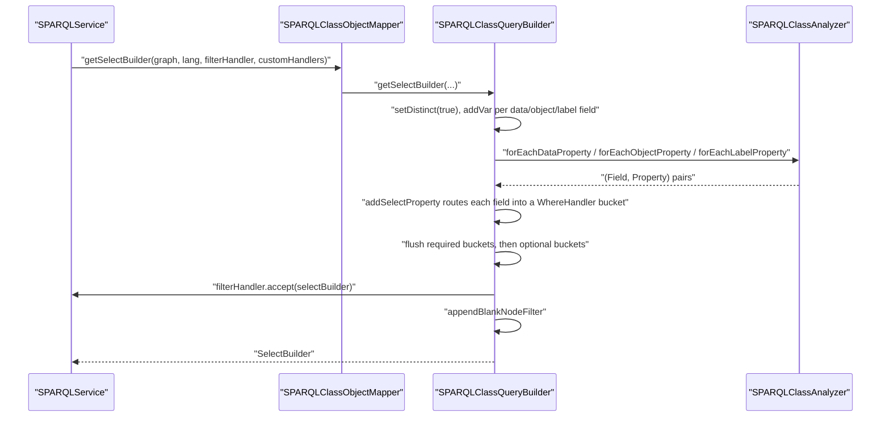
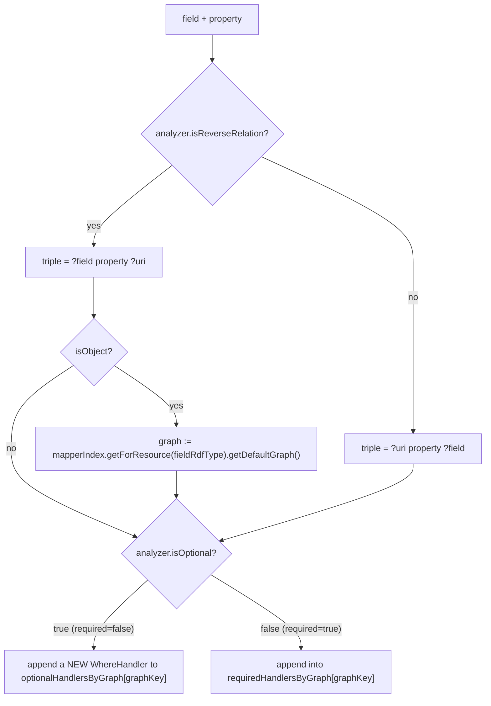

# Technical documentation : [`sparql`] Query generation

**Document history (please add a line when you edit the document)**

| Date       | Editor(s)        | OpenSILEX version | Comment           |
|------------|------------------|-------------------|-------------------|
| 2026-09-11 | Arnaud Charleroy | BUILD-SNAPSHOT    | Document creation |
| 2026-09-13 | Arnaud Charleroy | BUILD-SNAPSHOT    | Re-anchored drifted citations, marked abridged examples, fixed @SPARQLIgnore attribution |

## Table of contents

<!-- TOC -->
- [Purpose](#purpose)
- [Key classes](#key-classes)
- [How it works](#how-it-works)
  - [The handler bucket algorithm](#the-handler-bucket-algorithm)
  - [Assembling the buckets into the builder](#assembling-the-buckets-into-the-builder)
- [SPARQL variable naming convention](#sparql-variable-naming-convention)
- [Generated SPARQL](#generated-sparql)
  - [SELECT skeleton, no named graph](#select-skeleton-no-named-graph)
  - [SELECT skeleton with a named graph](#select-skeleton-with-a-named-graph)
  - [SELECT for a single URI](#select-for-a-single-uri)
  - [Object properties: inlined name and timestamp](#object-properties-inlined-name-and-timestamp)
  - [Language-tagged labels](#language-tagged-labels)
  - [COUNT](#count)
  - [ASK](#ask)
  - [INSERT DATA (create)](#insert-data-create)
  - [DELETE DATA (delete one instance)](#delete-data-delete-one-instance)
  - [DELETE ... WHERE (delete for update)](#delete--where-delete-for-update)
- [Where the caller gets to intervene](#where-the-caller-gets-to-intervene)
  - [filterHandler](#filterhandler)
  - [customHandlerByFields](#customhandlerbyfields)
  - [Ordering and pagination](#ordering-and-pagination)
- [SHACL shape generation](#shacl-shape-generation)
- [Cost, caching and thread-safety](#cost-caching-and-thread-safety)
- [Extension points](#extension-points)
- [Gotchas and invariants](#gotchas-and-invariants)
- [See also](#see-also)
<!-- TOC -->

## Purpose

[SPARQLClassQueryBuilder](../../../../../../../opensilex-sparql/src/main/java/org/opensilex/sparql/mapping/SPARQLClassQueryBuilder.java)
turns the static description of a model class — produced by `SPARQLClassAnalyzer` — into Jena ARQ
query builders: `SelectBuilder` for search and load, `SelectBuilder` again for COUNT, `AskBuilder`
for existence checks, and `UpdateBuilder` for `INSERT DATA` / `DELETE DATA` / `DELETE ... WHERE`.
It is the single place in the ORM where a Java field becomes a triple pattern. It is package-private:
everything outside `org.opensilex.sparql.mapping` reaches it through `SPARQLClassObjectMapper`.

## Key classes

| Class | File | Role |
|-------|------|------|
| `SPARQLClassQueryBuilder` | [SPARQLClassQueryBuilder.java](../../../../../../../opensilex-sparql/src/main/java/org/opensilex/sparql/mapping/SPARQLClassQueryBuilder.java) | The subject of this document. Package-private, two final fields (`analyzer`, `mapperIndex`), no other state. |
| `SPARQLClassAnalyzer` | [SPARQLClassAnalyzer.java](../../../../../../../opensilex-sparql/src/main/java/org/opensilex/sparql/mapping/SPARQLClassAnalyzer.java) | Supplies the field/property maps, the optional/reverse/default-graph flags and the rdf type. Read-only collaborator. |
| `SPARQLClassObjectMapper` | [SPARQLClassObjectMapper.java](../../../../../../../opensilex-sparql/src/main/java/org/opensilex/sparql/mapping/SPARQLClassObjectMapper.java) | Owns one query builder instance (`SPARQLClassObjectMapper.java:103`) and re-exports every public method of it. |
| `SPARQLClassObjectMapperIndex` | [SPARQLClassObjectMapperIndex.java](../../../../../../../opensilex-sparql/src/main/java/org/opensilex/sparql/mapping/SPARQLClassObjectMapperIndex.java) | Used to resolve the default graph and the rdf type of a *related* model when a field points at another model. |
| `SPARQLQueryHelper` | [SPARQLQueryHelper.java](../../../../../../../opensilex-sparql/src/main/java/org/opensilex/sparql/service/SPARQLQueryHelper.java) | Static `Expr` factory: `makeVar`, `langFilter`, `langFilterWithDefault`, `inURIFilter`, `notInUrisFilter`, `getSelectOrCreateGraphElementGroup`. |
| `SPARQLService` | [SPARQLService.java](../../../../../../../opensilex-sparql/src/main/java/org/opensilex/sparql/service/SPARQLService.java) | The only production caller: adds `VALUES`, `ORDER BY`, `LIMIT`/`OFFSET` on top of what is generated here, then executes. |
| `Ontology` | [Ontology.java](../../../../../../../opensilex-sparql/src/main/java/org/opensilex/sparql/utils/Ontology.java) | Holds the `subClassAny` property path (`rdfs:subClassOf*`) used by the type constraint. |
| `SHACL` | [SHACL.java](../../../../../../../opensilex-sparql/src/main/java/org/opensilex/sparql/utils/SHACL.java) | Vocabulary constants consumed by `generateSHACL()`. |

## How it works

Every public entry point (`getSelectBuilder`, `getCountBuilder`, `getAskBuilder`) delegates the WHERE
clause to the same method: `initializeQueryBuilder` (`SPARQLClassQueryBuilder.java:152`). Only the
projection differs.



### The handler bucket algorithm

`initializeQueryBuilder` never writes directly into the builder while walking the fields. It fills
two indexes keyed by *graph* and flushes them at the end:

- `requiredHandlersByGraph` — `Map` of graph IRI (or `null`) to a single `WhereHandler`;
- `optionalHandlersByGraph` — `Map` of graph IRI (or `null`) to a `List` of `WhereHandler`, one per
  optional field.

The `null` key means "no named graph", i.e. the pattern is emitted at the top level of the WHERE
clause. The root handler for the query's own graph is seeded first (`SPARQLClassQueryBuilder.java:162`).

1. `addQueryBuilderModelWhereProperties` (`:280`) adds the two constant patterns. `?uri rdf:type ?rdfType`
   goes into the **root** handler, therefore inside the graph clause; `?rdfType rdfs:subClassOf* <Type>`
   goes into the builder's own where handler, therefore **outside** any graph clause. That asymmetry is
   deliberate: the class hierarchy lives in the ontology graph, not in the data graph.
2. The three `forEach*` iterations call `addSelectProperty` (`:699`) once per field. Note the lambdas
   passed at `:168-176`: data properties are given `lang = null`, label properties are given `lang`,
   object properties are given `lang` plus `isObject = true`.
3. `addSelectPropertyWithLangFilter` (`:726`) builds the `TriplePath`, picks the bucket, and appends
   the field-specific extras.



`isOptional` is the negation of the `required` attribute of `@SPARQLProperty`, which defaults to
`false` — so **every property is OPTIONAL unless explicitly marked `required = true`**
(`SPARQLClassAnalyzer.java:318-320`).

### Assembling the buckets into the builder

The flush happens at `SPARQLClassQueryBuilder.java:205-245`:

- a required bucket with a non-null graph key becomes an `ElementNamedGraph` added to the builder's
  clause — `GRAPH <g> { ... }`;
- a required bucket with a `null` key is merged into the builder's handler block — top level;
- an optional bucket with a non-null graph key is inserted **inside** the already-created
  `ElementGroup` of that graph when the required bucket for the same graph exists, so that the
  `OPTIONAL` blocks share the graph clause instead of repeating it; when it does not exist, a
  `GRAPH <g> { ... }` wrapped in a single `ElementOptional` is created and every optional handler is
  nested inside it;
- an optional bucket with a `null` key produces one top-level `OPTIONAL { ... }` per handler.

Finally `appendBlankNodeFilter` (`:144`) adds `FILTER (!isBlank(?uri))` unless the class is annotated
`@SPARQLResource(allowBlankNode = true)`.

## SPARQL variable naming convention

Variables are the **Java field names**, verbatim — `makeVar(field.getName())`. The ORM then adds a
few derived variables whose names are produced by string concatenation
(`SPARQLClassQueryBuilder.java:74-94`):

| Helper | Pattern | Bound to |
|--------|---------|----------|
| `getObjectNameVarName(f)` | `_<f>_name` | `rdfs:label` of an object field whose type extends `SPARQLNamedResourceModel`, filtered on the requested language |
| `getObjectDefaultNameVarName(f)` | `_<f>_name_default` | the same label looked up in the *related model's own default graph*, requested language or default language |
| `getTimeStampVarName(f)` | `_<f>__timestamp` (two underscores) | `time:inXSDDateTimeStamp` of an `InstantModel` field |

These three helpers are re-exported as statics by `SPARQLClassObjectMapper` so DAOs can build filters
and `ORDER BY` expressions on them — see
[VariableDAO](../../../../../../../opensilex-core/src/main/java/org/opensilex/core/variable/dal/VariableDAO.java) (`:62-66`),
[AnnotationDAO](../../../../../../../opensilex-core/src/main/java/org/opensilex/core/annotation/dal/AnnotationDAO.java) (`:60-61`) and
[EventDAO](../../../../../../../opensilex-core/src/main/java/org/opensilex/core/event/dal/EventDAO.java) (`:111-112`).

The ORM's own reserved variable names are `uri`, `rdfType` and `rdfTypeName`, taken from the field
names declared on `SPARQLResourceModel` (`URI_FIELD`, `TYPE_FIELD`, `TYPE_NAME_FIELD`).

## Generated SPARQL

Every block below was produced by calling the builder on a real model class and printing
`buildString()`. Predicate IRIs are shown in full because that is exactly what is sent to the store —
the builder never declares prefixes.

### SELECT skeleton, no named graph

Model: the test class `A` (no `graph` attribute on `@SPARQLResource`, so the default graph is `null`),
`lang = "en"`. Only four of the nineteen optional properties — `A`'s sixteen declared ones plus the three inherited
from `SPARQLResourceModel` — are kept here for readability.

```sparql
SELECT DISTINCT  ?uri ?rdfType ?rdfTypeName ?string ?publisher ?a ?b
WHERE
  { ?rdfType (<http://www.w3.org/2000/01/rdf-schema#subClassOf>)* <http://test.opensilex.org/A>
    OPTIONAL
      { ?rdfType  <http://www.w3.org/2000/01/rdf-schema#label>  ?rdfTypeName
        FILTER langMatches(lang(?rdfTypeName), "en")
      }
    OPTIONAL
      { ?rdfType  <http://www.w3.org/2000/01/rdf-schema#label>  ?rdfTypeName
        FILTER langMatches(lang(?rdfTypeName), "")
      }
    ?uri  a  ?rdfType
    OPTIONAL
      { ?uri  <http://test.opensilex.org/hasString>  ?string}
    OPTIONAL
      { ?uri  <http://purl.org/dc/terms/publisher>  ?publisher}
    OPTIONAL
      { ?uri  <http://test.opensilex.org/hasRelationToA>  ?a}
    OPTIONAL
      { ?uri  <http://test.opensilex.org/hasRelationToB>  ?b}
    FILTER ( ! isBlank(?uri) )
  }
```

Three things to note. `DISTINCT` is always set (`:99`); a `SPARQLServiceTest` case documents why —
without it, a model matching a multi-valued filter twice appears twice in the result list. The type
constraint is a property path `rdfs:subClassOf*`, so a search on a parent class returns instances of
every subclass. And **list-valued fields never appear**: `getSelectBuilder` only walks
`forEachDataProperty`, `forEachObjectProperty` and `forEachLabelProperty`, so `List` fields are left
to the proxies or to `SPARQLListFetcher`.

### SELECT skeleton with a named graph

Model: the test class `B` (`graph = "test_data"`, so the default graph is
`http://opensilex.test/set/test_data`). `B` declares `required = true` on `hasFloat`, `hasDouble`,
`hasChar` and `hasShort`, and one **inverse** object property `a` pointing at `A`. Abridged for
readability: the optional bucket really also carries `hasInt`, `hasLong`, `hasBoolean`, `hasByte` and
the three properties inherited from `SPARQLResourceModel` (`dcterms:publisher`, `dcterms:issued`,
`dcterms:modified`), which `getSelectBuilder` projects like any other data property (`:102-104`).

```sparql
SELECT DISTINCT  ?uri ?rdfType ?rdfTypeName ?stringVar ?floatVar ?doubleVar ?charVar ?shortVar ?a
WHERE
  { ?rdfType (<http://www.w3.org/2000/01/rdf-schema#subClassOf>)* <http://test.opensilex.org/B>
    OPTIONAL
      { ?rdfType  <http://www.w3.org/2000/01/rdf-schema#label>  ?rdfTypeName
        FILTER langMatches(lang(?rdfTypeName), "en")
      }
    OPTIONAL
      { ?rdfType  <http://www.w3.org/2000/01/rdf-schema#label>  ?rdfTypeName
        FILTER langMatches(lang(?rdfTypeName), "")
      }
    GRAPH <http://opensilex.test/set/test_data>
      { ?uri  a                     ?rdfType ;
              <http://test.opensilex.org/hasFloat>  ?floatVar ;
              <http://test.opensilex.org/hasDouble>  ?doubleVar ;
              <http://test.opensilex.org/hasChar>  ?charVar ;
              <http://test.opensilex.org/hasShort>  ?shortVar
        OPTIONAL
          { ?uri  <http://test.opensilex.org/hasString>  ?stringVar}
      }
    OPTIONAL
      { ?a  <http://test.opensilex.org/hasRelationToB>  ?uri}
    FILTER ( ! isBlank(?uri) )
  }
```

The four `required = true` properties are folded into the same basic graph pattern as `?uri a ?rdfType`
because they all landed in the same required bucket. The inverse relation `?a hasRelationToB ?uri` is
emitted **outside** the graph clause: for an object field, `addSelectPropertyWithLangFilter` replaces
the graph by the related model's default graph (`:741-750`), and `A` has none, so the bucket key
becomes `null`.

When the related model *does* have its own graph, the optional bucket for that graph produces a nested
`GRAPH` inside an `OPTIONAL` — here `InverseModel` (graph `test_data`) with an inverse field pointing
at `ModelInAnotherGraph` (graph `another_graph`):

```sparql
    OPTIONAL
      { GRAPH <http://opensilex.test/set/another_graph>
          { OPTIONAL
              { ?anotherModel  <http://test.opensilex.org/hasLabel>  ?uri}}}
```

### SELECT for a single URI

The builder produces no URI restriction of its own. `SPARQLService.loadByURI` (`SPARQLService.java:470-475`)
takes the skeleton and appends a `VALUES` clause:

```java
SelectBuilder select = mapper.getSelectBuilder(graph, lang, filterHandler, customHandlerByFields);
select.addValueVar(mapper.getURIFieldExprVar(), SPARQLDeserializers.nodeURI(uri));
```

which serialises to `VALUES ?uri { <http://...> }` appended to the WHERE clause. `loadListByURIs`
(`SPARQLService.java:515-519`) does the same with an array of nodes. More than one row for a single URI
raises `SPARQLMultipleObjectException` carrying `select.buildString()`.

### Object properties: inlined name and timestamp

When an object field's type extends `SPARQLNamedResourceModel`, the builder projects `_<f>_name` and
`_<f>_name_default` and adds the corresponding clauses inside the field's own handler
(`addObjectPropertyName`, `:820`). When the type is an `InstantModel`, it projects `_<f>__timestamp`
and adds one required triple (`addTimeTimeStamp`, `:859`). Both exist to avoid a proxy round trip:
`SPARQLClassObjectMapper.createInstance` reads those variables and builds a `SparqlProxyNamedResource`
or a plain `InstantModel` without issuing a second query (`SPARQLClassObjectMapper.java:215-231`
and `:291`).

For a model in graph `event` with an optional `unit` field of type `UnitModel` (graph `variable`) and an
optional `start` field of type `InstantModel`:

```sparql
SELECT DISTINCT  ?uri ?rdfType ?rdfTypeName ?label ?unit ?_unit_name ?_unit_name_default ?start ?_start__timestamp
WHERE
  { ...
    GRAPH <http://opensilex.test/set/event>
      { ?uri  a  ?rdfType ;
              <http://www.w3.org/2000/01/rdf-schema#label>  ?label
        OPTIONAL
          { ?uri  <http://test.opensilex.org/hasRelationToA>  ?unit
            OPTIONAL
              { ?unit  <http://www.w3.org/2000/01/rdf-schema#label>  ?_unit_name
                FILTER langMatches(lang(?_unit_name), "en")
              }
            OPTIONAL
              { ... the same triple filtered on the default language "" ... }
            GRAPH <http://opensilex.test/set/variable>
              { ?unit  <http://www.w3.org/2000/01/rdf-schema#label>  ?_unit_name_default
                FILTER ( langMatches(lang(?_unit_name_default), "en") || langMatches(lang(?_unit_name_default), "") )
              }
          }
        OPTIONAL
          { ?uri    <http://test.opensilex.org/hasRelationToB>  ?start .
            ?start  <http://www.w3.org/2006/time#inXSDDateTimeStamp>  ?_start__timestamp}
      }
  }
```

Both nested blocks are **not** optional inside their parent `OPTIONAL` — see
[Gotchas](#gotchas-and-invariants).

### Language-tagged labels

The language handling is entirely driven by which lambda a field was routed through:

| Field kind | `lang` passed to `addSelectProperty` | Effect |
|------------|--------------------------------------|--------|
| data property (`String`, `Integer`, `OffsetDateTime`, `URI`, …) | `null` (`:169`) | **no language filter at all** |
| object property | the requested lang, `isObject = true` (`:172`) | no filter on the field variable; the lang is used only for the `_name` sub-clauses |
| label property (field typed `SPARQLLabel`) | the requested lang, `isObject = false` (`:175`) | language filter applied |

For a label property, `addSelectProperty` (`:699`) branches on optionality:

- **optional** label: the clause is duplicated — one `OPTIONAL` filtered on the requested language and
  one filtered on the default language (empty tag). At most one of the two binds a value per language.
- **required** label: a single clause with the combined filter
  `langFilterWithDefault`, i.e. `FILTER (langMatches(lang(?x), "fr") || langMatches(lang(?x), ""))`,
  which can bind **two** rows when both translations exist.

Test class `D` (a required and an optional `SPARQLLabel`), `lang = "fr"`:

```sparql
    ?uri  a                     ?rdfType ;
          <http://test.opensilex.org/requiredLabel>  ?requiredLabel
    FILTER ( langMatches(lang(?requiredLabel), "fr") || langMatches(lang(?requiredLabel), "") )
    ...
    OPTIONAL
      { ?uri  <http://test.opensilex.org/optionalLabel>  ?optionalLabel
        FILTER langMatches(lang(?optionalLabel), "fr")
      }
    OPTIONAL
      { ?uri  <http://test.opensilex.org/optionalLabel>  ?optionalLabel
        FILTER langMatches(lang(?optionalLabel), "")
      }
```

`SPARQLServiceTest.testMultipleLabelsOptional` pins that contract: with `lang = "en"` and only a French
and a default translation stored, the optional label resolves to the default one. The javadoc of
`addOptionalLangClauseOrDefault` (`:933`) states the invariant explicitly: at most one value.

The `rdfTypeName` variable always uses the two-`OPTIONAL` form, whatever the model
(`:301`).

### COUNT

`getCountBuilder` (`:249`) reuses `initializeQueryBuilder` verbatim and replaces the projection by one
aggregate. The aggregate is built with `AggregatorFactory.createCountExpr(true, ...)` and then
**serialised to a String** and handed to `SelectBuilder.addVar(String, Var)`, which re-parses it
(`:256-262`) — the one place in the file where a SPARQL fragment travels as text rather than as an
object graph. The reason is not documented in the code.

```sparql
SELECT  (COUNT(DISTINCT ?uri) AS ?count)
WHERE
  { ?rdfType (<http://www.w3.org/2000/01/rdf-schema#subClassOf>)* <http://test.opensilex.org/B>
    ... exactly the same WHERE clause as the SELECT ...
    FILTER ( ! isBlank(?uri) )
  }
```

The WHERE clause is identical to the SELECT one, `OPTIONAL` blocks included, which is why a COUNT
costs about as much as the search it counts. `SPARQLService.count` (`SPARQLService.java:938-958`) then
strips any `ORDER BY` and any extra projected variable the caller's filterHandler may have introduced.

### ASK

`getAskBuilder` (`:132`) is the same WHERE clause with no projection at all. Its only production caller
is `SPARQLService.existsByUniquePropertyValue` (`SPARQLService.java:611-616`), which binds the value
with `ask.setVar(field.getName(), node)`:

```sparql
ASK
WHERE
  { ?rdfType (<http://www.w3.org/2000/01/rdf-schema#subClassOf>)* <http://test.opensilex.org/B>
    ... exactly the same WHERE clause, blank-node filter included ...
  }
```

### INSERT DATA (create)

`getCreateBuilder` / `addCreateBuilder` (`:335`, `:344`) walk the *instance*, not the class, through
`executeOnInstanceTriples` (`:938`). The traversal order is fixed: rdf type, data properties, object
properties, label properties (one triple per translation), data-list properties, object-list properties.
Each produces a Jena `Quad`; `addCreateBuilder` then decides the target graph:

1. input `graph` is `null` → insert the bare triple (default graph);
2. the quad already carries a graph (set for reverse object relations from the related model's default
   graph) → insert that quad;
3. otherwise → insert the triple into the input graph.

A `null` value on a field with `required = true` throws a plain `Exception` (marked `TODO change
exception type` at `:964`, `:985`, `:1013`). `fieldsToExclude` lets the update path skip
`publisher` and `publicationDate` (`SPARQLService.java:1152`). Finally `addRelationsQuads` (`:1091`)
appends the free-form `SPARQLModelRelation` triples carried by the instance, each in
`relation.getGraph()` when set.

For a `B` instance with a string list, an inverse object property and an object list:

```sparql
INSERT DATA {
  GRAPH <http://opensilex.test/set/test_data> {
    <http://opensilex.test/b/1> <http://www.w3.org/1999/02/22-rdf-syntax-ns#type> <http://test.opensilex.org/B> .
    <http://opensilex.test/b/1> <http://test.opensilex.org/hasFloat> "1.5"^^<http://www.w3.org/2001/XMLSchema#float> .
    <http://opensilex.test/b/1> <http://test.opensilex.org/hasString> "hello" .
    <http://opensilex.test/a/1> <http://test.opensilex.org/hasRelationToB> <http://opensilex.test/b/1> .
    <http://opensilex.test/b/1> <http://test.opensilex.org/hasStringList> "v1" .
    <http://opensilex.test/b/1> <http://test.opensilex.org/hasStringList> "v2" .
    <http://opensilex.test/b/1> <http://test.opensilex.org/hasAList> <http://opensilex.test/a/1> .
  }
}
```

Multi-valued properties are simply one triple per element — there is no RDF list, no blank node
collection. `blankNode = true` replaces the subject by `NodeFactory.createBlankNode()` (`:944`).

### DELETE DATA (delete one instance)

`getDeleteBuilder(Node, T)` (`:369`) runs the exact same traversal and emits `DELETE DATA` with the same
quads. It therefore deletes only what the *in-memory instance* says exists — a triple present in the
store but absent from the loaded model survives. That is why `SPARQLService.delete` loads the instance
first (`SPARQLService.java:1562`) and complements this query with
`SPARQLClassObjectMapper.getDeleteRelationsBuilder` and an explicit reverse-reference sweep.

### DELETE ... WHERE (delete for update)

`getDeleteBuilderForUpdateCases` (`:397`) is the query behind "update = delete then re-insert". It
deletes **every** triple in which the URI appears as subject or as object, except:

- `dc:publisher` and `dc:issued`, hard-coded at `:398-401`, so publication metadata survives an update;
- the predicates of fields annotated `ignoreUpdateIfNull = true` whose value is `null` on the incoming
  model — collected per URI at `:407-419` into `predicatesToIgnoreByUri` (direct relations) and
  `reversePredicatesToIgnoreByUri` (inverse relations).

The exclusions are expressed as a `NOT IN` filter and a `FILTER NOT EXISTS` over an OR of
`(?uriToDelete = S && ?p = P)` pairs, built by `buildNotExistsFilterForUriAndPredicateCouples` (`:623`).
For one `A` instance whose `ignoreUpdateIfNullProperty` is `null`:

```sparql
DELETE {
  GRAPH <http://opensilex.test/graph> {
    ?uriToDelete ?p ?o .
    ?s ?p ?uriToDelete .
  }
}
WHERE
  { FILTER ( ?uriToDelete IN (<http://opensilex.test/a/2>) )
      { GRAPH <http://opensilex.test/graph>
          { ?uriToDelete  ?p  ?o
            FILTER ( ?p NOT IN (<http://purl.org/dc/terms/publisher>, <http://purl.org/dc/terms/issued>) )
            FILTER NOT EXISTS { GRAPH <http://opensilex.test/graph>
                { ?uriToDelete ?p ?o
                  FILTER ( ( ?uriToDelete = <http://opensilex.test/a/2> ) && ( ?p = <http://test.opensilex.org/rename/ignoreUpdateIfNullProperty> ) ) } }
          }}
    UNION
      { GRAPH <http://opensilex.test/graph>
          { ?s  ?p  ?uriToDelete}}
  }
```

The variable names here are literals: `uriToDelete`, `s`, `p`, `o` (`:488-491`). `graph = null` removes
both `GRAPH` wrappers and the query then targets the default graph only. Predicate URIs are expanded to
their long form before comparison (`:631-640`) so that a short URI in the model still matches a long URI
in the store.

The whole update cycle is then: `deleteForUpdate` runs this query, `updateFields` diffs the
`@AutoUpdate` fields against the previously loaded instances, and `createForUpdate` re-inserts
everything minus `publisher` and `publicationDate` (`SPARQLService.java:1515`, `:1523` and `:1526`). See
[SPARQL update](../sparql-update.md) and [sparql-property-annotation](../sparql-property-annotation.md).

## Where the caller gets to intervene

### filterHandler

A `ThrowingConsumer<SelectBuilder, Exception>` invoked **after** the whole model skeleton is in place
and **before** the blank-node filter (`:119-122`). It receives the live builder, so it can add
`FILTER`, `VALUES`, extra triples, even extra projected variables. Everything the handler can usefully
call is documented in [Filters, query helpers and schema queries](./07-filters-and-query-helpers.md).

### customHandlerByFields

A `Map` of field name to `WhereHandler`, merged *at the point where the field's own clause is built*
instead of at the end of the query. This is the only way to constrain a field from **inside** its
`OPTIONAL` or inside its graph clause. Three keys are special-cased before the field walk (`:303-313`):
`uri`, `rdfType` and `rdfTypeName` are merged into the builder's root handler, outside any graph clause.
Other keys are merged into the matching field handler at `:782-788`.

The canonical use is the type filter of
[EventDAO](../../../../../../../opensilex-core/src/main/java/org/opensilex/core/event/dal/EventDAO.java) (`:304-311`):

```java
protected void appendTypeFilter(Map<String, WhereHandler> customHandlerByFields, URI type) throws Exception {
    if (type != null) {
        WhereHandler handler = new WhereHandler();
        handler.addWhere(new TriplePath(makeVar(SPARQLResourceModel.TYPE_FIELD), Ontology.subClassAny,
                SPARQLDeserializers.nodeURI(type)));
        customHandlerByFields.put(SPARQLResourceModel.TYPE_FIELD, handler);
    }
}
```

which produces a second `?rdfType rdfs:subClassOf* <requestedType>` line next to the class-level one,
narrowing the search to a subtree of the hierarchy.

### Ordering and pagination

Neither is done here. `SPARQLService.getSelectBuilder` (`SPARQLService.java:691-727`) applies them on the
returned builder: each `OrderBy` is mapped through `SPARQLClassObjectMapper.getFieldOrderExpr`
(`SPARQLClassObjectMapper.java:485-496`), which returns `LCASE(?field)` for a `String` or `SPARQLLabel`
field, a bare `ExprVar` for anything else, and — for a name it does not recognise as a field — an
`ExprVar` on the raw name. That last fallback is what lets a DAO sort on a generated variable such as
`_entity_name`; `VariableDAO.appendSpecificOrderBy` (`VariableDAO.java:158-175`) builds
`LCASE(STR(?_entity_name))` itself and says in a comment that it works "only because we known how
`getObjectNameVarName()` works".

`DEFAULT_ORDER_BY` (`uri` ascending) is appended unless the caller already ordered on `uri`, to make
pagination deterministic; `setOffset`/`setLimit` are applied only when both are non-null.

## SHACL shape generation

`generateSHACL()` (`:1118`) is the odd method out: it emits no SPARQL at all. It builds a Jena `Model`
holding one `sh:NodeShape` targeting the class rdf type, with one `sh:property` `Seq` per non-inverse
field, and serialises it to Turtle through a `StringWriter`. The shape name is a string concatenation:
`analyzer.getRDFType() + "_ShapeSHACL"` (`:1121`). Constraints emitted:

| Field kind | Constraints |
|------------|-------------|
| data property | `sh:path`, `sh:datatype` (or `sh:nodeKind sh:IRI` for `xsd:anyURI`), `sh:maxCount 1`, `sh:minCount 0` or `1` |
| object property | `sh:path`, `sh:class`, `sh:maxCount 1`, `sh:minCount 0` or `1` |
| label property | `sh:path`, `sh:uniqueLang true`, `sh:minCount 0` or `1` |
| data list / object list | same minus `sh:maxCount` |

Inverse fields are skipped everywhere. The entry point is
[SHACL.generateSHACL](../../../../../../../opensilex-sparql/src/main/java/org/opensilex/sparql/utils/SHACL.java) (`:383`),
called from `RDF4JConnection` (`:428`) when SHACL validation is enabled;
`SPARQLClassObjectMapper.generateSHACL` returns `null` for classes annotated
`@SPARQLResource(ignoreValidation = true)`.

## Cost, caching and thread-safety

There is **no query cache**. One `SPARQLClassQueryBuilder` is created per model class in
`SPARQLClassObjectMapper.init()` (`SPARQLClassObjectMapper.java:103`) and lives as long as the mapper
index; but every call to `getSelectBuilder`, `getCountBuilder` or `getAskBuilder` re-walks the analyzer
maps and allocates a fresh `SelectBuilder`, fresh `WhereHandler` instances and fresh `TriplePath`
objects. A `searchWithPagination` therefore builds the skeleton twice — once for the COUNT, once for the
SELECT.

The comment "get pre-build SelectBuilder for the objectClass" in `SPARQLService.loadListByURIs`
(`SPARQLService.java:514`) is stale: nothing is pre-built.

The builder itself holds no mutable state, so it is safe to call from several threads; the objects it
returns are not shared and belong to the caller.

## Extension points

- **Add a property to a query**: annotate a field with `@SPARQLProperty`. The projection, the
  `OPTIONAL`/required decision, the graph placement and the INSERT/DELETE triples all follow. See
  [Annotations and class analysis](./01-annotations-and-class-analysis.md).
- **Force a property into the basic graph pattern**: `required = true`. It is the only supported way to
  make a triple non-optional, and it also drives `sh:minCount` and the null check on create.
- **Place a related object's triples in its own graph**: `useDefaultGraph = true` (the default).
  Setting it to `false` keeps the relation in the subject's graph and makes `addObjectPropertyName` skip
  the cross-graph name lookup (`:843`).
- **Constrain a field from inside its own clause**: a `customHandlerByFields` entry keyed by the field
  name — or by `uri` / `rdfType` / `rdfTypeName` to reach the root.
- **Everything else** (extra filters, `VALUES`, sub-queries, aggregates): the `filterHandler` lambda. To
  reach a specific graph group inside the generated query, use
  `SPARQLQueryHelper.getSelectOrCreateGraphElementGroup(select.getWhereHandler().getClause(), graph)`,
  as `EventDAO`, `ScientificObjectDAO` and `SPARQLRelationFetcher` do.
- Subclassing `SPARQLClassQueryBuilder` is not supported: the class is package-private and instantiated
  directly by `SPARQLClassObjectMapper`.

## Gotchas and invariants

- **`lang = null` makes the query fail at build time.** `addOptionalLangClauseOrDefault` is always
  applied to `rdfTypeName` (`:301`) and `SPARQLQueryHelper.langFilter` turns a `null` language into
  `Expr.NONE`; `buildString()` then throws
  `org.apache.jena.atlas.lib.InternalErrorException: Visit Expr.NONE`. Every `SPARQLService` entry point
  replaces `null` by `getDefaultLang()` first — except `loadListByURIs`, which passes its `lang`
  parameter straight to `mapper.getSelectBuilder(graph, lang)` at `SPARQLService.java:516`. Pass `""`,
  not `null`, when you want the default language.
- **A `String` field mapped to `rdfs:label` is not language filtered.** Data properties are handed
  `lang = null` (`:169`), so `SPARQLNamedResourceModel.name` matches any translation and you get whichever
  one the store returns first. Models that need real translation use a `SPARQLLabel` field instead —
  `VocabularyModel` declares the `SPARQLLabel label` field and overrides `getName()`, and its concrete
  subclasses `ClassModel` (`:33`), `ObjectPropertyModel` (`:33`) and `DatatypePropertyModel` (`:39`)
  redeclare the inherited `name` with `@SPARQLIgnore`.
- **The cross-graph name lookup of an OPTIONAL object field is required inside its `OPTIONAL`.**
  In `addObjectPropertyName`, the `isOptional` branch adds `objectNameDefaultOptionalHandler.getElement()`
  directly to the graph element group (`:849`) without wrapping it in an `ElementOptional`, while the
  required branch uses `addOptional` (`:852`). Consequence: if the related object has no `rdfs:label` in
  its own graph, the whole outer `OPTIONAL` fails to match and the object field comes back unbound. The
  local variable name says the intent was the opposite.
- **A `customHandlerByFields` entry on an optional list field is silently dropped.** At `:192` the code
  is `optionalHandlersByGraph.computeIfAbsent(graphKey, k -> Collections.singletonList(customHandler))`.
  The key is almost always already present (any optional property of the same graph created it), so
  `computeIfAbsent` does nothing and the handler never reaches the query — verified on a model with one
  optional `List<String>` field: the custom triple simply does not appear in the generated SPARQL.
  On the rare path where the key is absent, the value stored is an **immutable** `singletonList`.
- **The COUNT query can project a stray variable.** `addTimeTimeStamp` projects `_<f>__timestamp`
  whenever `select instanceof SelectBuilder` (`:865`), and the COUNT builder *is* a `SelectBuilder`.
  A model with an `InstantModel` field therefore yields
  `SELECT (COUNT(DISTINCT ?uri) AS ?count) ?_start__timestamp` with no `GROUP BY`.
  `SPARQLService.count` repairs this by clearing and rebuilding the projection — but only
  `if (filterHandler != null)` (`SPARQLService.java:940-956`). A COUNT with no filter handler on such a
  model is emitted as-is.
- **`?uri rdf:type ?rdfType` is inside the graph clause, `?rdfType rdfs:subClassOf* <Type>` is outside.**
  Moving either one makes searches miss subclass instances or scan the whole store.
- **Variable names are Java field names.** Renaming a field renames a SPARQL variable, which silently
  breaks every DAO that referenced it through `makeVar("oldName")` and every `OrderBy` sent by the front
  end. `getFieldOrderExpr` falls back to a bare `ExprVar` for unknown names, so a stale order-by does not
  fail — it just orders on an unbound variable.
- **Projection and `OPTIONAL` order are `HashMap` iteration order.** The analyzer stores properties in
  `HashMap` (`SPARQLClassAnalyzer.java:54-62`), so the generated query does not follow field declaration
  order. Do not diff generated queries across JVM or class changes expecting a stable order.
- **The inverse branch of the update-delete query ignores `excludedPredicates`.** `getDeleteBuilder`
  passes `null` for that parameter when building `inverseSubquery` (`:520-529`, the `null` is on `:527`), so a
  `?s dc:publisher ?uriToDelete` triple would be deleted. In practice `publisher`/`issued` are never
  inverse relations.
- **`DELETE DATA` for an instance deletes only the loaded triples.** Anything written outside the model
  must be removed by `getDeleteRelationsBuilder` or by the caller.
- [../sparql-update.md](../sparql-update.md) says the exclusion list is applied in
  `SPARQLClassQueryBuilder#getDeleteBuilder` and `SPARQLService#create`, and calls the `dc:issued` field
  `creationDate`. In the current code the method is `getDeleteBuilderForUpdateCases` (`:397`), the
  creation-side exclusion is in `SPARQLService#createForUpdate` (`SPARQLService.java:1152`), and the field
  is `SPARQLResourceModel.publicationDate` / `PUBLICATION_DATE_FIELD`.

## See also

- [Annotations and class analysis](./01-annotations-and-class-analysis.md) — where `isOptional`,
  `isReverseRelation` and `useDefaultGraph` come from.
- [Object mapper and index](./02-object-mapper-and-index.md) — who owns the query builder, and how the
  default graph of a class is computed.
- [Proxies and lazy loading](./04-proxies-and-lazy-loading.md) — how the list fields omitted here are
  fetched afterwards.
- [SPARQLService CRUD](./05-sparql-service-crud.md) — the facade that executes these builders.
- [Filters, query helpers and schema queries](./07-filters-and-query-helpers.md) — everything a
  `filterHandler` can add.
- [ORM architecture overview](../orm-architecture.md) and [Graph organization](../graph-organization.md).
- [SPARQL update](../sparql-update.md) and
  [SPARQL property annotations](../sparql-property-annotation.md) — the update cycle and
  `@IgnoreUpdateIfNull` / `@AutoUpdate` / `@CascadeDelete`.
- [Metadata](../metadata.md) — `SPARQLModelRelation`, source of the quads added by `addRelationsQuads`.
- [Data fetching](../../architecture/sparql/DataFetching.md) — the many-to-many `VALUES` strategy.
