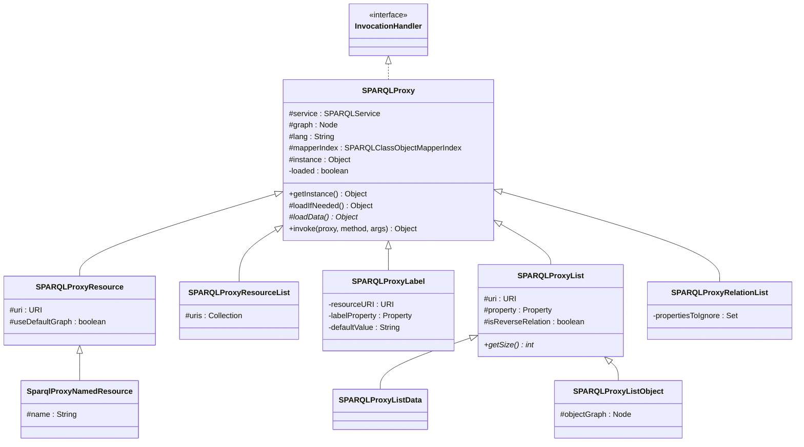
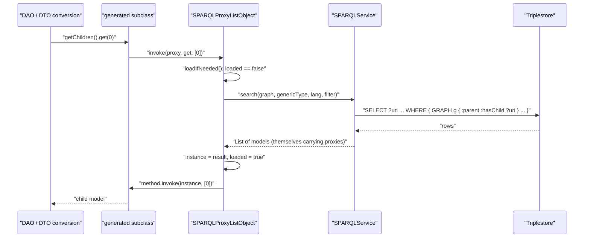
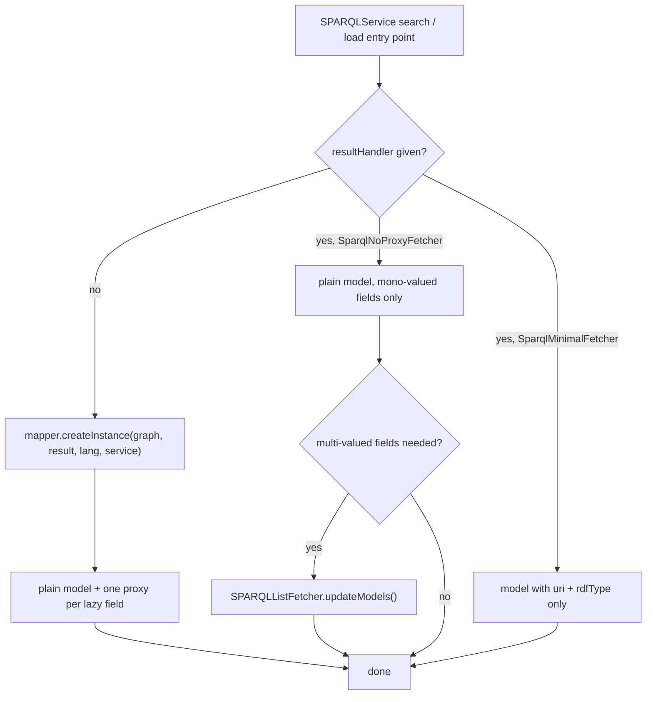

# Technical documentation : [`sparql`] Proxies and lazy loading

**Document history (please add a line when you edit the document)**

| Date       | Editor(s)        | OpenSILEX version | Comment           |
|------------|------------------|-------------------|-------------------|
| 2026-09-11 | Arnaud Charleroy | BUILD-SNAPSHOT    | Document creation |
| 2026-09-13 | Arnaud Charleroy | BUILD-SNAPSHOT    | Corrected the SiteDAO snippet, fetcher overrides and provenance query classes |

## Table of contents

<!-- TOC -->
- [Purpose](#purpose)
- [Key classes](#key-classes)
- [How it works](#how-it-works)
  - [The byte-buddy mechanism](#the-byte-buddy-mechanism)
  - [The proxy family](#the-proxy-family)
  - [Which proxy is built for which field](#which-proxy-is-built-for-which-field)
  - [What happens on the first dereference](#what-happens-on-the-first-dereference)
- [Proxy subtypes in detail](#proxy-subtypes-in-detail)
- [The three fetching strategies](#the-three-fetching-strategies)
- [SPARQLListFetcher: batch fetching of multi-valued fields](#sparqllistfetcher-batch-fetching-of-multi-valued-fields)
- [Lifetime: what a proxy holds and when it breaks](#lifetime-what-a-proxy-holds-and-when-it-breaks)
- [equals, hashCode, toString and Jackson](#equals-hashcode-tostring-and-jackson)
- [Extension points](#extension-points)
- [Gotchas and invariants](#gotchas-and-invariants)
- [See also](#see-also)
<!-- TOC -->

## Purpose

A SELECT generated from an annotated model class only brings back mono-valued columns (see
[Query generation](./03-query-generation.md)). Everything else — nested objects, translated labels,
multi-valued data and object properties, dynamic relations — is not in the result row. This
subsystem is the ORM's answer to that gap: it substitutes a generated subclass for each missing
value, and runs the SPARQL query that fills it only when someone calls a method on it. The same
package also holds the two escape hatches from proxying (`SparqlNoProxyFetcher`,
`SparqlMinimalFetcher`) and the batch fetcher (`SPARQLListFetcher`) that exists because lazy
loading of multi-valued fields is an N+1 generator.

## Key classes

| Class | File | Role |
|-------|------|------|
| `SPARQLProxy` | [SPARQLProxy.java](../../../../../../../opensilex-sparql/src/main/java/org/opensilex/sparql/mapping/SPARQLProxy.java) | Package-private abstract `InvocationHandler`. Builds the generated subclass, holds the load-once flag, delegates every call to the loaded delegate. |
| `SPARQLProxyMarker` | [SPARQLProxyMarker.java](../../../../../../../opensilex-sparql/src/main/java/org/opensilex/sparql/mapping/SPARQLProxyMarker.java) | Empty marker interface implemented by every generated class; the only way to recognise a proxy at runtime. |
| `SPARQLProxyResource` | [SPARQLProxyResource.java](../../../../../../../opensilex-sparql/src/main/java/org/opensilex/sparql/mapping/SPARQLProxyResource.java) | Proxy for a single `SPARQLResourceModel`. Answers the URI getter without loading. |
| `SparqlProxyNamedResource` | [SparqlProxyNamedResource.java](../../../../../../../opensilex-sparql/src/main/java/org/opensilex/sparql/mapping/SparqlProxyNamedResource.java) | Specialisation of the above for `SPARQLNamedResourceModel`: also answers `getName()` without loading. |
| `SPARQLProxyResourceList` | [SPARQLProxyResourceList.java](../../../../../../../opensilex-sparql/src/main/java/org/opensilex/sparql/mapping/SPARQLProxyResourceList.java) | Proxy for a `List` built from an explicit URI collection (`loadListByURIs`). |
| `SPARQLProxyLabel` | [SPARQLProxyLabel.java](../../../../../../../opensilex-sparql/src/main/java/org/opensilex/sparql/mapping/SPARQLProxyLabel.java) | Proxy for a `SPARQLLabel`: the default-language value is known, the other translations are not. |
| `SPARQLProxyList` | [SPARQLProxyList.java](../../../../../../../opensilex-sparql/src/main/java/org/opensilex/sparql/mapping/SPARQLProxyList.java) | Abstract base of the two multi-valued proxies; adds the `size()` short-circuit. |
| `SPARQLProxyListData` | [SPARQLProxyListData.java](../../../../../../../opensilex-sparql/src/main/java/org/opensilex/sparql/mapping/SPARQLProxyListData.java) | Multi-valued *data* property: a list of literals deserialized one by one. |
| `SPARQLProxyListObject` | [SPARQLProxyListObject.java](../../../../../../../opensilex-sparql/src/main/java/org/opensilex/sparql/mapping/SPARQLProxyListObject.java) | Multi-valued *object* property: delegates to `SPARQLService.search` on the related class. |
| `SPARQLProxyRelationList` | [SPARQLProxyRelationList.java](../../../../../../../opensilex-sparql/src/main/java/org/opensilex/sparql/mapping/SPARQLProxyRelationList.java) | The `relations` field: a DESCRIBE of the resource minus the properties the mapper already manages. |
| `SparqlMapper` | [SparqlMapper.java](../../../../../../../opensilex-sparql/src/main/java/org/opensilex/sparql/mapping/SparqlMapper.java) | Interface for the non-proxy strategies: a template `getInstance(result, lang)` made of seven overridable `setXxx` steps. |
| `SparqlNoProxyFetcher` | [SparqlNoProxyFetcher.java](../../../../../../../opensilex-sparql/src/main/java/org/opensilex/sparql/mapping/SparqlNoProxyFetcher.java) | Builds a plain model from a result row: labels, mono-valued data and object properties. Multi-valued fields are left untouched. |
| `SparqlMinimalFetcher` | [SparqlMinimalFetcher.java](../../../../../../../opensilex-sparql/src/main/java/org/opensilex/sparql/mapping/SparqlMinimalFetcher.java) | Builds a model carrying only `uri` and `rdfType`, with formatted (short) URIs. |
| `SPARQLListFetcher` | [SPARQLListFetcher.java](../../../../../../../opensilex-sparql/src/main/java/org/opensilex/sparql/mapping/SPARQLListFetcher.java) | One extra `GROUP_CONCAT` query that fills the multi-valued fields of an already-fetched result list. |

## How it works

### The byte-buddy mechanism

The library is **byte-buddy** (`net.bytebuddy`, version pinned in
[opensilex-parent/pom.xml](../../../../../../../opensilex-parent/pom.xml) as `bytebuddy.version`).
It is used in exactly one place in the whole repository, `SPARQLProxy.getInstance()`
(`SPARQLProxy.java:42-59`):

```java
Class<? extends T> proxy = new ByteBuddy()
        .subclass(type)
        .implement(SPARQLProxyMarker.class)
        .method(ElementMatchers.any())
        .intercept(InvocationHandlerAdapter.of(this))
        .make()
        .load(OpenSilex.getClassLoader())
        .getLoaded();

return proxy.getConstructor().newInstance();
```

Four consequences follow directly from those lines, and every gotcha in this document derives from
one of them:

1. **`type` is a class, not an interface** — except for the list proxies, which subclass
   `java.util.List` itself. So the proxied model class must have a public no-argument constructor,
   and the generated class is a *subclass*, not a sibling.
2. **`ElementMatchers.any()` intercepts every virtual method, including `equals`, `hashCode` and
   `toString` inherited from `Object`.** This was verified against byte-buddy 1.14.18: only `final`
   methods such as `getClass()` escape. `SPARQLProxyLabel` relies on it, since it intercepts
   `toString` explicitly (`SPARQLProxyLabel.java:52`).
3. **`SPARQLProxyMarker` is added to every generated class.** It carries no member; its only use is
   `SPARQLClassObjectMapperIndex.getConcreteClass` (`SPARQLClassObjectMapperIndex.java:53-59`),
   which walks up `getSuperclass()` while the class implements the marker, so that
   `getForClass(proxy.getClass())` resolves to the mapper of the real model class. Without the
   marker, every mapper lookup on a proxied object would throw `SPARQLMapperNotFoundException`.
4. **A brand-new class is generated on every single `getInstance()` call.** Nothing is cached — not
   per model class, not per service. Measured on byte-buddy 1.14.18 with a trivial class, a warm
   JVM spends roughly 1.5 ms per generated proxy, and `load(ClassLoader)` uses byte-buddy's default
   *wrapper* strategy, so each proxy also gets its own throwaway `ByteArrayClassLoader` (the class
   is therefore collectable once the proxy is unreachable — this is a cost problem, not a permanent
   metaspace leak). This single fact is the reason `SparqlNoProxyFetcher` exists.

### The proxy family



Only `SPARQLProxyListObject` is `public`; everything else in the family is package-private. A
downstream module cannot instantiate a proxy, and is not meant to: proxies are produced exclusively
by [SPARQLClassObjectMapper](../../../../../../../opensilex-sparql/src/main/java/org/opensilex/sparql/mapping/SPARQLClassObjectMapper.java).

### Which proxy is built for which field

`SPARQLClassObjectMapper.createInstance(graph, result, lang, service)` is the single place where
the decision is made. It walks the field categories computed by `SPARQLClassAnalyzer` (see
[annotations and class analysis](./01-annotations-and-class-analysis.md)) and, for each one,
instantiates a handler and calls the setter with `proxy.getInstance()`:

| Source | Condition | Proxy built | Line |
|--------|-----------|-------------|------|
| `getByURI(...)` | always | `SPARQLProxyResource` (eagerly loaded, see below) | `SPARQLClassObjectMapper.java:152` |
| `getListByURIs(...)` without a result handler | always | `SPARQLProxyResourceList` (eagerly loaded) | `SPARQLClassObjectMapper.java:323` |
| rdf type label (`rdfTypeName`) | always | `SPARQLProxyLabel` on `rdfs:label` of the real type, graph `null` | `SPARQLClassObjectMapper.java:178` |
| object property field | the field type is a `SPARQLNamedResourceModel` and a name column is bound | `SparqlProxyNamedResource` | `:220` / `:226` |
| object property field | the field type is an `InstantModel` | **no proxy** — built from the `_field__timestamp` column | `:233` |
| object property field | otherwise | `SPARQLProxyResource` | `:228` / `:235` |
| label property field (`SPARQLLabel`) | the row has a value | `SPARQLProxyLabel` | `:250` |
| data list field | always | `SPARQLProxyListData` | `:259` |
| object list field | always | `SPARQLProxyListObject` | `:272` |
| `relations` | always | `SPARQLProxyRelationList` | `:277` |

Two of those rows deserve attention. The `InstantModel` branch and the named-resource branch are
*optimizations already applied inside the proxy path*: the query builder projects an extra column
(`_field_name`, `_field__timestamp`) precisely so that the common accessor does not need a
round trip. The named-resource case still builds a proxy, but one that answers `getName()` from the
column; the `InstantModel` case builds a plain `InstantModel` and no proxy at all.

Note that a search result row is never itself a proxy: `createInstance(uri)`
(`SPARQLClassObjectMapper.java:306`) builds a plain instance and only its *fields* are proxied.
The exceptions are `getByURI` and `getListByURIs`, where the top-level object returned to the
caller **is** a generated class (both call `loadIfNeeded()` before returning, so the data is
already there — the wrapper is pure overhead at that point).

### What happens on the first dereference



`loadIfNeeded()` (`SPARQLProxy.java:63-70`) is a plain non-synchronised boolean flag. The loaded
delegate is stored in `instance` and reused for every subsequent call; it is never invalidated. A
proxy is therefore a one-shot cache, not a live view — a concurrent write to the triplestore is
invisible to an already-dereferenced proxy, and two proxies of the same resource load
independently.

## Proxy subtypes in detail

**`SPARQLProxyResource`** holds `uri`, the target `type`, the `graph` and a `useDefaultGraph` flag.
Its `invoke` short-circuits the URI getter by comparing `method.getName()` with
`mapper.getURIMethod().getName()` (`SPARQLProxyResource.java:45`) — so reading the URI of a nested
object costs nothing. `loadData()` calls `service.loadByURI(graph, type, uri, lang)` when a graph is
set and `useDefaultGraph` is false, otherwise `service.loadByURI(type, uri, lang, null)`, which
resolves the model class's own default graph.

**`SparqlProxyNamedResource`** adds one more short-circuit, on `getName()` with zero parameters and
a non-null name (`SparqlProxyNamedResource.java:27`). This is what makes "list of experiments with
the name of their species" a single query instead of one query per row.

**`SPARQLProxyLabel`** never queries for the default value: it receives it from the result row and
answers `getDefaultValue()`, `getDefaultLang()` and `toString()` locally
(`SPARQLProxyLabel.java:46-56`). Anything else — `getTranslations()`, `getAllTranslations()`,
`addTranslation(...)` — triggers `SPARQLService.getTranslations(resourceURI, labelProperty,
reverseRelation)`, an ungraphed SELECT over `?value` and `lang(?value)`, and then removes the
current language from the map so that the default value is not duplicated.

**`SPARQLProxyList`** overrides `invoke` so that `size()` on a *not yet loaded* list runs a COUNT
instead of materialising the list (`SPARQLProxyList.java:47`). Every other `List` method — including
`isEmpty()`, `iterator()`, `contains(...)`, `stream()` — loads everything.

- `SPARQLProxyListData.getSize()` runs `SELECT (COUNT(DISTINCT ?value) AS ?count)`; if the result
  set does not contain exactly one row it falls back to `loadData().size()` and **throws the loaded
  list away** (`SPARQLProxyListData.java:98`), so the next access queries again.
- `SPARQLProxyListObject.loadData()` delegates to `SPARQLService.search` on the related model class,
  which means every element of the list is itself a fully proxied model. Its `getSize()` uses
  `SPARQLService.count` but does **not** reproduce the graph scoping of `loadData()` (compare
  `SPARQLProxyListObject.java:40-52` with `:66-72`), so `size()` and the actual list length can
  disagree when the relation triple lives in a named graph.

**`SPARQLProxyRelationList`** runs `SPARQLService.describe(graph, uri)` and converts every returned
statement whose predicate is not one of `classAnalyzer.getManagedProperties()` into a
`SPARQLModelRelation`, flagging it reverse when the model URI appears as the object
(`SPARQLProxyRelationList.java:55`). Because it is installed unconditionally on every model built
from a result row, a loop calling `getRelations()` over a page of results is a DESCRIBE per row.

## The three fetching strategies



| Strategy | Entry point | What it fills | What it leaves out | Cost |
|----------|-------------|---------------|--------------------|------|
| Proxy fetching | any `SPARQLService` method called **without** a `resultHandler` | everything, on demand | nothing, but each field costs a query on first touch | one generated class per lazy field per row |
| `SparqlNoProxyFetcher` | passed as the `resultHandler` by the DAO | type label, label properties, mono-valued data properties, mono-valued object properties (uri + name + type + type label) | data lists, object lists, `relations` (left as the field default) | reflection only |
| `SparqlMinimalFetcher` | passed as the `resultHandler` by the DAO | `uri` and `rdfType`, formatted as short URIs | everything else | one constructor call |

**Who selects which.** The ORM never chooses a no-proxy strategy on its own; the DAO does, by
passing a `ThrowingFunction<SPARQLResult, T, Exception>` to
`SPARQLService.search(...)`/`searchWithPagination(...)`/`loadListByURIs(...)`. The single exception
is `SPARQLService.searchUsingSchema` (`SPARQLService.java:867`), which *always* builds a
`SparqlNoProxyFetcher` because the whole point of a `SparqlSchema` is to replace lazy loading by an
explicit fetch plan — see
[filters and query helpers](./07-filters-and-query-helpers.md#serviceschemaquery-declarative-nested-fetching).

Real usage, from
[SiteDAO](../../../../../../../opensilex-core/src/main/java/org/opensilex/core/organisation/dal/site/SiteDAO.java)
(the javadoc there says plainly "Use `SparqlNoProxyFetcher` to improve performance"):

```java
SparqlNoProxyFetcher<SiteModel> customFetcher = new SparqlNoProxyFetcher<>(SiteModel.class, sparql);

ListWithPagination<SiteModel> models = sparql.searchWithPagination(
        sparql.getDefaultGraph(SiteModel.class),
        SiteModel.class,
        currentUser.getLanguage(),
        select -> organizationSPARQLHelper.addSiteAccessClause(select, makeVar(SiteModel.URI_FIELD), userOrganizations, currentUser.getUri()),
        Collections.emptyMap(),
        result -> customFetcher.getInstance(result, currentUser.getLanguage()),
        null,
        0,
        0);
```

`SparqlMapper.getInstance` (`SparqlMapper.java:19-32`) is the template both fetchers implement:
`setUriAndType`, `setLabel`, `setLabelProperties`, `setDataProperties`, `setObjectProperties`,
`setDataListProperties`, `setObjectListProperties`. `SparqlNoProxyFetcher` inherits the default
`setUriAndType` (`SparqlMapper.java:34`) unchanged, gives real bodies to `setLabel`,
`setLabelProperties`, `setDataProperties` and `setObjectProperties` (`:71`, `:81`, `:97`, `:115`), and
overrides the last two with empty bodies on purpose (`:161`, `:166`) — its own javadoc lists them as
"can not handle".
`SparqlMinimalFetcher` overrides `getInstance` itself and calls only `setUriAndType`.

The `useFormattedUri()` flag decides between `UriFormater.formatURI(uri)` (short, prefixed form) and
`URI.create(uri)` (the raw IRI returned by the store). `SparqlMinimalFetcher` returns `true`;
`SparqlNoProxyFetcher` returns whatever the constructor was given, and defaults to `false`. The
interface carries a `// #TODO all mapper should use formatted URI` comment, so the inconsistency is
known.

`SparqlMinimalFetcher` is used where only existence and type matter. Its single caller today is
[DataValidation](../../../../../../../opensilex-core/src/main/java/org/opensilex/core/data/bll/DataValidation.java)
(`DataValidation.java:263`), which builds one `SparqlMinimalFetcher` for `SPARQLResourceModel` and
reuses it as the result handler of a `SparqlMultiClassQuery` resolving provenance agents
(`DataValidation.java:267`) and a `SparqlMultiGraphQuery` resolving activities (`:275`) before a data
import — `SparqlMultiClassQuery` extends `SparqlMultiGraphQuery`, which extends
`AbstractSparqlUrisQuery`.

## SPARQLListFetcher: batch fetching of multi-valued fields

`SPARQLListFetcher` closes the hole left by `SparqlNoProxyFetcher`. Given a list of models already
fetched (by any strategy) and the *names of the Java fields* to fill, it runs **one** additional
query using `GROUP_CONCAT` and a `VALUES` clause, then writes the parsed values back into the
models through their setters. The strategy itself is specified in
[many-to-many data fetching](../../architecture/sparql/DataFetching.md); this section documents the
implementation.

Constructor checks (`SPARQLListFetcher.java:122-180`), all `IllegalArgumentException`:

- `initialResults` must be non-null and strictly smaller than `MAX_RESULTS_SIZE` (65536);
- `fieldsToFetch` must be non-empty;
- every name must resolve to a field of the model, and that field must be a data-list or
  object-list property.

For each field it records the setter, the getter, and either a `SPARQLClassObjectMapper` (when the
list generic type is a known SPARQL model — values are URIs and become empty model instances) or a
`SPARQLDeserializer` (when it is a literal type).

`updateModels()` (`:189-237`) then:

1. Returns immediately on an empty result list.
2. Builds the query via `getSelect()`.
3. Indexes the models by formatted URI in a `PatriciaTrie`, throwing
   `IllegalArgumentException("Multiple results with the same URI ...")` on a duplicate — the two
   queries must range over the same unique key.
4. While indexing, initialises every target field to `Collections.emptyList()` **if the getter
   currently returns null**, so a model with no matching triple ends up with an empty list rather
   than null.
5. Streams the result rows and, for each, looks the model up by `?uri` and calls `update(...)`,
   which splits the concatenated string on `,` and deserializes each token.

`getSelect()` (`:289-351`) does not reuse the initial `SelectBuilder`; it builds a fresh one:

```sparql
SELECT DISTINCT ?uri (GROUP_CONCAT(DISTINCT ?targets ; separator=',') AS ?targets__opensilex__concat)
WHERE {
  GRAPH <http://www.opensilex.org/set/event> {
    OPTIONAL { ?uri oeev:concerns ?targets }
  }
  ?rdfType rdfs:subClassOf* oeev:Event .
  ?uri rdf:type ?rdfType .
  VALUES ?uri { <http://.../event_1> <http://.../event_2> }
}
GROUP BY ?uri
```

Three details of that generation are easy to get wrong when modifying the class:

- The two type triples (`:310-311`) exist only to guarantee at least one non-optional pattern; the
  code comment says a bug appeared otherwise. They are added to the **root** clause, not to the
  graph element group, because `getSelectOrCreateGraphElementGroup` was called first.
- A field is wrapped in `OPTIONAL` when `classAnalyzer.isOptional(field)` is true, which is the
  default for any `@SPARQLProperty` that does not declare `required = true`.
- The concat variable name is `field.getName() + "__opensilex__concat"` (`CONCAT_VAR_SUFFIX`,
  private), and the separator is a comma with **no escaping**. A literal value containing a comma is
  split into several values.

Callers pass either a field-name collection straight to `SPARQLService.loadListByURIs`
(which builds the fetcher for you, `SPARQLService.java:554`) or build it themselves after a search.
[EventDAO](../../../../../../../opensilex-core/src/main/java/org/opensilex/core/event/dal/EventDAO.java)
does the latter (`EventDAO.java:203`):

```java
SPARQLListFetcher<T> listFetcher = new SPARQLListFetcher<>(
        sparql, clazz, graph,
        Collections.singleton(EventModel.TARGETS_FIELD),
        results.getList()
);
listFetcher.updateModels();
```

[SPARQLListFetcherTest](../../../../../../../opensilex-sparql/src/test/java/org/opensilex/sparql/mapping/SPARQLListFetcherTest.java)
encodes the contract: data lists, object lists, both at once, failure on an empty or unknown field
set, failure on duplicate URIs, and correctness when the initial select already carried a `VALUES`
clause or pagination.

## Lifetime: what a proxy holds and when it breaks

Each `SPARQLProxy` stores four references for the rest of its life (`SPARQLProxy.java:35-39`):

| Field | What it is | Why it is a problem |
|-------|-----------|---------------------|
| `service` | the very `SPARQLService` instance that produced the row | it wraps one RDF4J `RepositoryConnection` |
| `graph` | a Jena `Node`, or null | fixes the graph the lazy query will run in |
| `lang` | the language resolved **at load time** | a proxy loaded for `fr` will never answer `en` |
| `mapperIndex` | the process-wide mapper index | harmless, it is a singleton per factory |

`SPARQLService` is bound to HK2's `RequestScoped` in
[RestApplication](../../../../../../../opensilex-main/src/main/java/org/opensilex/server/rest/RestApplication.java)
(`RestApplication.java:214-215`), and
[RDF4JServiceFactory](../../../../../../../opensilex-sparql/src/main/java/org/opensilex/sparql/rdf4j/RDF4JServiceFactory.java)
opens a fresh `RepositoryConnection` in `provide()` and closes it in `dispose()` →
`SPARQLService.shutdown()` → `RDF4JConnection.shutdown()` → `rdf4JConnection.close()`
(`RDF4JConnection.java:72-75`). Therefore:

- **Within a request, a proxy is fine.** Transactions do not matter for reads: `commitTransaction`
  and `rollbackTransaction` do not close the connection, so a proxy dereferenced after a commit
  still works (it will simply see committed data).
- **After the request ends, the proxy is dead.** Any lazy field touched later — from a cache, a
  static map, a `@Singleton` field, a thread started by the request, or a Jackson serializer running
  after the resource method returned — calls `prepareTupleQuery` on a closed RDF4J connection.
- **Nothing prevents it.** There is no closed/disposed flag on `SPARQLProxy`, no check in
  `loadIfNeeded()`, and `SPARQLService` exposes no "is still usable" predicate. The only protection
  is the convention that models are converted to DTOs inside the resource method.

The failure is also badly shaped. RDF4J signals a closed connection with an `IllegalStateException`,
which is not a `RepositoryException` and so escapes the `catch (RepositoryException ex)` in
`RDF4JConnection.executeSelectQueryAsStream`. And because byte-buddy's `InvocationHandlerAdapter`
does not wrap checked exceptions the way JDK dynamic proxies do (verified on 1.14.18), a
`SPARQLException` raised inside `loadData()` propagates unchanged out of a getter whose signature
declares no exception at all.

## equals, hashCode, toString and Jackson

`SPARQLResourceModel.equals` (`SPARQLResourceModel.java:132-145`) starts with
`if (getClass() != obj.getClass()) return false;` and only then compares URIs with
`SPARQLDeserializers.compareURIs`. A generated proxy class is never equal to the model class, so:

- `proxy.equals(plainModel)` → **true** (the call is intercepted, the proxy loads, and the
  *delegate* — a plain instance — runs `equals`; the class check passes).
- `plainModel.equals(proxy)` → **false** (no interception, the class check fails).

Equality is asymmetric, which breaks the `Object.equals` contract. In practice it means
`list.contains(proxy)` and `set.contains(proxy)` behave differently from `list.contains(plain)`
depending on which side is stored and which side is the argument. Two proxies are never equal to
each other either, since each `getInstance()` call produces a *different* generated class.

`hashCode()` and `toString()` are intercepted as well, so both trigger a full load. A debugger
stepping over a model, a logger calling `String.valueOf(model)`, or dropping a model into a `HashSet`
each issue SPARQL queries. `SPARQLProxyLabel` is the only one that avoids this, by answering
`toString()` with the default value.

**Jackson.** OpenSILEX converts models to DTOs before returning them, so a proxy rarely reaches the
serializer directly — and it must not. If it does:

- Jackson introspects the *runtime* class, i.e. the generated subclass. Every getter it calls is a
  potential SPARQL query, so a list of 20 proxied models with 5 lazy fields is 100 queries issued
  during response serialization.
- Serialization happens **after** the resource method returns but, being part of the same request,
  usually before `dispose()`. A streamed or asynchronous response moves it after, and the
  serialization then fails mid-document, with the HTTP status already sent.
- `SPARQLProxyRelationList` makes `getRelations()` a DESCRIBE, and `SPARQLProxyLabel` makes
  `getTranslations()` a SELECT — the two getters a naive DTO mapper is most likely to call.

There is no Jackson module, mixin or `@JsonIgnore` anywhere that is aware of `SPARQLProxyMarker`.
The protection is entirely by convention.

## Extension points

- **A new model class needs nothing.** Proxying is driven by `SPARQLClassAnalyzer`; annotate the
  fields (see [annotations and class analysis](./01-annotations-and-class-analysis.md)) and the
  right proxy is installed. The only hard requirement is a public no-argument constructor, because
  both `SPARQLProxy.getInstance()` and `SparqlMapper.getConstructor()` call it.
- **A DAO opts out of proxying** by passing a `resultHandler` built on `SparqlNoProxyFetcher` (or
  `SparqlMinimalFetcher` for existence checks), and completes it with a `SPARQLListFetcher` for the
  multi-valued fields it actually needs. This is the pattern to copy for any new search endpoint.
- **A custom fetcher** is written by implementing `SparqlMapper` and overriding only the `setXxx`
  steps that matter. `SparqlMapper` is a public interface with defaults for every step except
  `getConstructor()`, so a two-method implementation is viable.
- **Proxy behaviour itself is closed.** `SPARQLProxy` and all its subclasses but
  `SPARQLProxyListObject` are package-private and instantiated only from
  `SPARQLClassObjectMapper.createInstance`. Adding a new lazy field kind means editing that method.
- **Recognising a proxy** from downstream code is possible with
  `model instanceof SPARQLProxyMarker`, but the interface is in the `mapping` package and no caller
  in `opensilex-core`, `opensilex-security` or `opensilex-phis` uses it today.

## Gotchas and invariants

- **Proxy creation is not free and is not cached.** A new class is generated and loaded on every
  `getInstance()` call (`SPARQLProxy.java:43-50`); roughly 1.5 ms each on a warm JVM. A page of 20
  models with 5 lazy fields pays about 100 class generations before any DTO conversion starts. This
  is the whole justification of `SparqlNoProxyFetcher`, and it is the first thing to look at when a
  search endpoint is unexpectedly slow.
- **`getByURI` and `getListByURIs` return an already-loaded proxy.**
  `createInstance(graph, uri, lang, useDefaultGraph, service)` calls `loadIfNeeded()` and only then
  `getInstance()` (`SPARQLClassObjectMapper.java:152-155`); `createInstanceList` does the same
  (`:323-327`). The wrapper buys nothing at that point but costs a class generation and makes the
  returned object unequal to a plain model. The reason for keeping the wrapper is not documented in
  the code.
- **`equals` is asymmetric** (see the section above). Never put proxied and non-proxied instances of
  the same model in the same `Set` or use one as a `Map` key against the other.
- **`toString()`, `hashCode()` and `equals()` hit the database.** Logging a model at DEBUG level
  changes the number of SPARQL queries a request makes.
- **A checked exception escapes an unchecked signature.** `SPARQLProxy.invoke` declares
  `throws Throwable`, and byte-buddy re-throws as-is, so `model.getStringList()` can throw
  `SPARQLException` even though `getStringList()` declares nothing. Conversely, an exception thrown
  by the *delegate* comes out wrapped in `java.lang.reflect.InvocationTargetException`, because
  `invoke` uses `method.invoke(instance, args)` (`SPARQLProxy.java:79`).
- **`loadIfNeeded()` is not thread-safe.** `loaded` is a plain field with no synchronisation. Two
  threads sharing a model can both run `loadData()`; one of the two results is silently discarded.
  Models are request-scoped in practice, so this has not bitten yet.
- **`lang` is frozen at creation.** The proxy stores the language of the query that produced the
  row. A lazily loaded nested object is fetched in that language, not in the language of whoever
  dereferences it.
- **`size()` and the list content can disagree.** `SPARQLProxyListObject.getSize()` omits the
  graph scoping that `loadData()` applies (`SPARQLProxyListObject.java:66-72`), and
  `SPARQLProxyListData.getSize()` discards the list it loaded in its fallback branch (`:98`).
- **`SparqlProxyNamedResource` hard-codes `useDefaultGraph = false` in one branch.** When the name
  is found under the primary variable `_field_name`, `SPARQLClassObjectMapper.java:220` passes
  `false`; the sibling branch at `:226` passes the computed `useDefaultGraph`. If that proxy is ever
  loaded for another field, it queries a different graph than the analyzer asked for.
- **`SparqlNoProxyFetcher` does not read the fallback name variable.** `getNestedObject` only looks
  at `_field_name` (`SparqlNoProxyFetcher.java:143`), while the proxy path also tries
  `_field_name_default`. A nested object whose name is only bound by the default-language pattern
  comes back with a null name under the no-proxy strategy.
- **`SparqlNoProxyFetcher` types nested objects from the declaration, not from the data.**
  `nestedObject.setType(mapperIndex.getForClass(fieldType).getClassAnalyzer().getRdfTypeURI())`
  (`:150`) sets the *declared* field type's rdf type. A subclass instance is reported as its parent
  type. It then asks the ontology store for the type label, cached per fetcher instance in a
  `PatriciaTrie` — so a fetcher must not be shared across threads.
- **URIs are not formatted the same way by the two fetchers.** `SparqlMinimalFetcher` returns short
  URIs, `SparqlNoProxyFetcher` returns expanded IRIs unless its three-argument constructor is used.
  Compare URIs with `SPARQLDeserializers.compareURIs`, never with `String.equals`. See
  [type system and deserializers](./08-type-system-deserializers.md).
- **`SPARQLListFetcher` splits on a bare comma.** `GROUP_CONCAT_SEPARATOR` is `","` and nothing is
  escaped, so a literal containing a comma silently becomes two values. The same hazard is noted for
  `SPARQLQueryHelper.appendGroupConcatAggregator` in
  [filters and query helpers](./07-filters-and-query-helpers.md#gotchas-and-invariants).
- **The `SPARQLListFetcher` class javadoc contradicts the code.** It claims the class "reuse the
  initial query body" instead of re-sending the URIs. The current `getSelect()` does the opposite:
  it builds a fresh SELECT and appends a `VALUES` clause with every result URI
  (`SPARQLListFetcher.java:343-349`). Read the code, not the header comment.
- **A result row whose URI is not in the model index yields a NullPointerException.**
  `updateModels()` passes the `modelsByUris.get(rowUri)` lookup straight to `update(...)`
  (`:230-231`), which invokes a setter on it. The `VALUES` clause normally makes this impossible;
  a URI-formatting mismatch would not.
- **`relations` is replaced even when nothing needs it.** The field is initialised to an
  `ArrayList` in `SPARQLResourceModel`, but `createInstance` overwrites it with a
  `SPARQLProxyRelationList` for every row (`SPARQLClassObjectMapper.java:277`). Under
  `SparqlNoProxyFetcher` it keeps the empty `ArrayList` instead — code that reads `getRelations()`
  therefore behaves differently depending on the fetching strategy, silently.

## See also

- [ORM architecture overview](../orm-architecture.md) — where proxying sits in the read pipeline.
- [Annotations and class analysis](./01-annotations-and-class-analysis.md) — the field categories
  that drive the proxy choice.
- [Object mapper and index](./02-object-mapper-and-index.md) — `createInstance`, graph resolution,
  and the `getConcreteClass` marker unwrapping.
- [Query generation](./03-query-generation.md) — the `_field_name` and `_field__timestamp` columns
  that let two proxy kinds answer without a query.
- [SPARQLService CRUD](./05-sparql-service-crud.md) — which entry point takes a `resultHandler`.
- [Filters and query helpers](./07-filters-and-query-helpers.md) — `SparqlSchema`, the declarative
  alternative to lazy loading, and the `VALUES` helpers used here.
- [Type system and deserializers](./08-type-system-deserializers.md) — URI formatting.
- [Connection and lifecycle](./10-connection-and-lifecycle.md) — the request-scoped connection whose
  lifetime bounds every proxy.
- [Many-to-many data fetching](../../architecture/sparql/DataFetching.md) — the strategy
  `SPARQLListFetcher` implements.
- [Graph organization](../graph-organization.md) and
  [graph storage](../../architecture/sparql/graph-storage.md) — which named graph a lazy query uses.
- [Metadata](../metadata.md) — `publisher`, `issued` and `modified`, filled like any other
  mono-valued data property.
