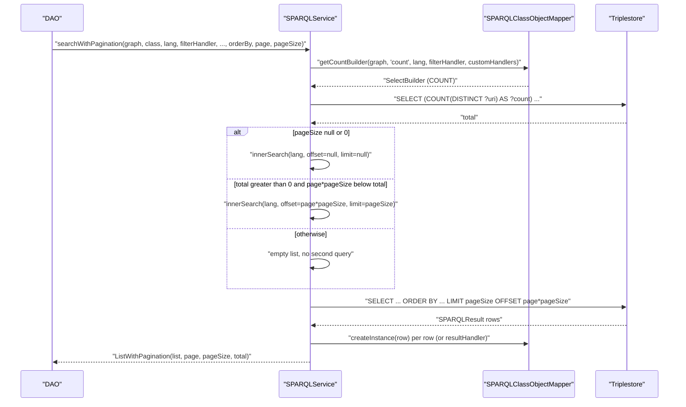
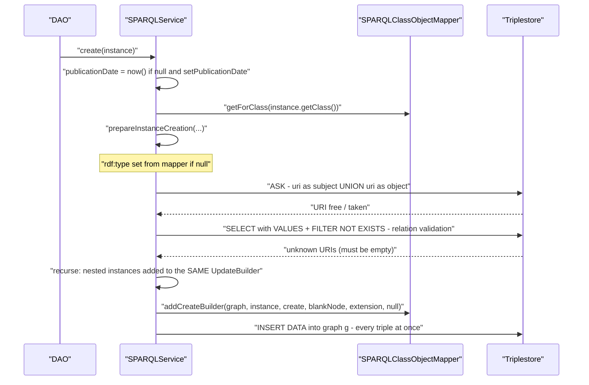
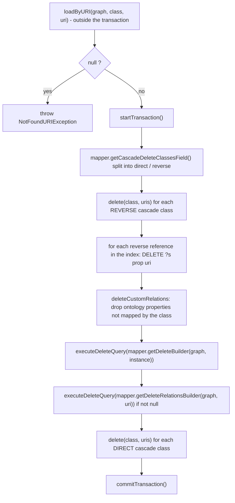

# Technical documentation : [`sparql`] SPARQLService: the CRUD facade

**Document history (please add a line when you edit the document)**

| Date       | Editor(s)        | OpenSILEX version | Comment           |
|------------|------------------|-------------------|-------------------|
| 2026-09-11 | Arnaud Charleroy | BUILD-SNAPSHOT    | Document creation |
| 2026-09-13 | Arnaud Charleroy | BUILD-SNAPSHOT    | Review pass: corrected line citations, `rollbackTransaction` guard, `uriListExists` short-circuits and `searchResourceTree` callers; added the read decision table, raw query entry points, URI-level helpers and type/label lookups |

## Table of contents

<!-- TOC -->
- [Purpose](#purpose)
- [Key classes](#key-classes)
- [How it works](#how-it-works)
- [Which read method should I call](#which-read-method-should-i-call)
- [Reading a single object: getByURI vs loadByURI](#reading-a-single-object-getbyuri-vs-loadbyuri)
- [Reading a list: getListByURIs vs loadListByURIs](#reading-a-list-getlistbyuris-vs-loadlistbyuris)
- [From SPARQLResult to a model: proxy, no-proxy, schema](#from-sparqlresult-to-a-model-proxy-no-proxy-schema)
- [search, searchAsStream and count](#search-searchasstream-and-count)
- [searchWithPagination](#searchwithpagination)
- [searchResourceTree](#searchresourcetree)
- [create](#create)
- [Creating a list: batching and query reuse](#creating-a-list-batching-and-query-reuse)
- [update](#update)
- [delete and cascade delete](#delete-and-cascade-delete)
- [Raw query entry points](#raw-query-entry-points)
- [Existence checks and their cost](#existence-checks-and-their-cost)
- [URI-level helpers](#uri-level-helpers)
- [Type and label lookups by URI](#type-and-label-lookups-by-uri)
- [The lang parameter](#the-lang-parameter)
- [Transaction awareness](#transaction-awareness)
- [Extension points](#extension-points)
- [Gotchas and invariants](#gotchas-and-invariants)
- [Not covered here](#not-covered-here)
- [See also](#see-also)
<!-- TOC -->

## Purpose

[SPARQLService](../../../../../../../opensilex-sparql/src/main/java/org/opensilex/sparql/service/SPARQLService.java)
is the single entry point every DAO in every module uses to read and write annotated models. It owns
no query-generation logic of its own: it resolves a model class to a
`SPARQLClassObjectMapper`, asks that mapper for a pre-built Jena builder, hands the builder to the
caller's filter lambda, executes it through the wrapped `SPARQLConnection`, and turns the raw
`SPARQLResult` rows back into model instances. Everything this document describes is that glue —
the ordering of the steps, the flags, and what each family of methods actually costs in round trips.

## Key classes

| Class | File | Role |
|-------|------|------|
| `SPARQLService` | [SPARQLService.java](../../../../../../../opensilex-sparql/src/main/java/org/opensilex/sparql/service/SPARQLService.java) | The facade. 2822 lines, roughly half CRUD/loading (this document), half transactions, URI generation and validation (document 06). |
| `SPARQLConnection` | [SPARQLConnection.java](../../../../../../../opensilex-sparql/src/main/java/org/opensilex/sparql/service/SPARQLConnection.java) | Interface the service delegates every `execute*Query` to. `SPARQLService` implements it too, so it can be nested. |
| `SPARQLClassObjectMapper` | [SPARQLClassObjectMapper.java](../../../../../../../opensilex-sparql/src/main/java/org/opensilex/sparql/mapping/SPARQLClassObjectMapper.java) | Per-model-class builder factory and instance factory. The service never touches a model field directly. |
| `SPARQLClassObjectMapperIndex` | [SPARQLClassObjectMapperIndex.java](../../../../../../../opensilex-sparql/src/main/java/org/opensilex/sparql/mapping/SPARQLClassObjectMapperIndex.java) | Class-to-mapper registry, plus the reverse-reference iterator used by cascade delete. |
| `SPARQLResult` | [SPARQLResult.java](../../../../../../../opensilex-sparql/src/main/java/org/opensilex/sparql/service/SPARQLResult.java) | One result row, addressed by variable name. |
| `SparqlNoProxyFetcher` | [SparqlNoProxyFetcher.java](../../../../../../../opensilex-sparql/src/main/java/org/opensilex/sparql/mapping/SparqlNoProxyFetcher.java) | Alternative row-to-model converter that builds plain objects instead of proxies. |
| `SPARQLListFetcher` | [SPARQLListFetcher.java](../../../../../../../opensilex-sparql/src/main/java/org/opensilex/sparql/mapping/SPARQLListFetcher.java) | Bulk-fetches multi-valued fields for an already-loaded result list. |
| `SPARQLTreeListModel` | [SPARQLTreeListModel.java](../../../../../../../opensilex-sparql/src/main/java/org/opensilex/sparql/model/SPARQLTreeListModel.java) | Parent/children double index built by `searchResourceTree`. |
| `ListWithPagination` | [ListWithPagination.java](../../../../../../../opensilex-main/src/main/java/org/opensilex/utils/ListWithPagination.java) | Result of every `searchWithPagination`: list + page + pageSize + total. |

## How it works

Every CRUD method follows the same five steps; only steps 3 and 5 differ between families.

1. **Resolve the graph.** Overloads without a `Node graph` parameter call
   `getDefaultGraph(modelClass)` (`SPARQLService.java:2254`) — the graph declared by
   `@SPARQLResource(graph = ...)`. A `null` graph means "the whole repository, default graph
   included"; see [graph organization](../graph-organization.md).
2. **Resolve the language.** `if (lang == null) lang = getDefaultLang()`, repeated verbatim in
   every public method.
3. **Get the mapper and the builder.** `getMapperIndex().getForClass(objectClass)`, then one of
   `getSelectBuilder` / `getCountBuilder` / `getAskBuilder` / `addCreateBuilder` /
   `getDeleteBuilder`. All generation lives in [query generation](./03-query-generation.md).
4. **Execute.** `executeSelectQuery`, `executeSelectQueryAsStream`, `executeAskQuery`,
   `executeUpdateQuery` or `executeDeleteQuery` — each adds the global prefix mapping
   (`addPrefixes`, `SPARQLService.java:182-189`), logs the query at DEBUG level, then delegates to
   the connection.
5. **Convert.** Rows become models through the mapper (proxied), a `SparqlNoProxyFetcher`, or a
   caller-supplied `resultHandler`.

## Which read method should I call

The seven read families differ on four axes. Each row links to the section that explains it; the
proxy column is the one that decides whether you pay for lazy queries later.

| Family | Returns proxies? | Round trips | Honours pagination | Fetch plan | Typical caller |
|--------|------------------|-------------|--------------------|------------|----------------|
| [`getByURI`](#reading-a-single-object-getbyuri-vs-loadbyuri) | yes | 1 SELECT + 1 per proxied field touched | n/a | no | a detail endpoint for one resource |
| [`loadByURI`](#reading-a-single-object-getbyuri-vs-loadbyuri) | no | 1 SELECT | n/a | no | internal checks, cascade delete |
| [`getListByURIs`](#reading-a-list-getlistbyuris-vs-loadlistbyuris) | yes | 1 SELECT + lazy queries per element | n/a | no | small known URI sets |
| [`loadListByURIs`](#reading-a-list-getlistbyuris-vs-loadlistbyuris) | no | 1 SELECT | n/a | no | validation, bulk reads |
| [`search` / `searchAsStream`](#search-searchasstream-and-count) | yes unless you pass a `resultHandler` | 1 SELECT (+ lazy queries if proxied) | only if you pass `offset`/`limit` | no | DAO search without a page wrapper |
| [`searchWithPagination`](#searchwithpagination) | as above | 1 SELECT + **1 mandatory COUNT** | yes | no | every paginated REST endpoint |
| [`searchResourceTree`](#searchresourcetree) | yes | 1 SELECT + 1 per ancestor outside the result set | no | no | `OntologyDAO` class and property trees |

The fetch-plan alternative — one query per nested type instead of one per object — is
`searchUsingSchema`, documented with the rest of `service/schemaQuery` in
[filters and query helpers](./07-filters-and-query-helpers.md#serviceschemaquery-declarative-nested-fetching).
The proxy mechanics behind the first column are in
[proxies and lazy loading](./04-proxies-and-lazy-loading.md).

## Reading a single object: getByURI vs loadByURI

Two families exist for "give me one object by its URI" and they are **not** equivalent.

| Method | Line | Graph used | Returns | On absence |
|--------|------|------------|---------|------------|
| `getByURI(Class, URI, String lang)` | `SPARQLService.java:383` | `getDefaultGraph(objectClass)`, with `useDefaultGraph = true` | a **proxy** wrapping the loaded instance | `null` |
| `getByURI(Node, Class, URI, String lang)` | `SPARQLService.java:387` | the given graph, `useDefaultGraph = false` | a **proxy** | `null` |
| `getByURI(Node, Class, URI, String, boolean useDefaultGraph)` | `SPARQLService.java:391` | given graph or the class default depending on the flag | a **proxy** | `null` |
| `loadByURI(Class, URI, String, filterHandler)` | `SPARQLService.java:455` | class default graph | a **plain instance** | `null` |
| `loadByURI(Node, Class, URI, String)` | `SPARQLService.java:459` | the given graph | a **plain instance** | `null` |
| `loadByURI(Node, Class, URI, String, filterHandler, customHandlerByFields)` | `SPARQLService.java:463` | the given graph | a **plain instance** | `null` |

`getByURI` delegates to `mapper.createInstance(graph, uri, lang, useDefaultGraph, this)`, which
builds a `SPARQLProxyResource`, calls `loadIfNeeded()` immediately (so the SELECT *is* executed
eagerly, and a missing URI still returns `null`), then returns `proxy.getInstance()` — a ByteBuddy
subclass whose every method call is routed through the invocation handler. `loadByURI` runs the
same SELECT itself and returns the object the mapper built from the row.

`loadByURI` throws `SPARQLMultipleObjectException` when the query returns more than one row
(`SPARQLService.java:479`); `getByURI` inherits that behaviour through the proxy. More than one row
for a single `?uri` binding means a cardinality bug in the model mapping (a single-valued field
matched twice), not a duplicate resource.

`createInstance` issues exactly one eager SELECT; every proxied field then costs one more query on
first access. That "one SELECT plus N lazy queries" shape is why most DAOs in `opensilex-core` use
`getByURI` for a single detail page and never inside a loop.

## Reading a list: getListByURIs vs loadListByURIs

```java
// ProjectDAO.java:202 - default behaviour, proxied models, class default graph
return sparql.getListByURIs(ProjectModel.class, uris, user.getLanguage());

// BaseVariableDAO.java:174 - explicit graph, no-proxy fetcher, eager multi-valued fields
return sparql.getListByURIs(
        defaultGraph,
        objectClass,
        uris,
        lang,
        result -> fetcher.getInstance(result, lang),
        fieldsToFetch);
```

`getListByURIs(Node, Class, Collection, String, ThrowingFunction resultHandler, Set listFieldsToFetch)`
(`SPARQLService.java:424`) branches on `resultHandler`:

- `resultHandler == null` (the common case): `mapper.createInstanceList(...)`, which wraps the whole
  list in a `SPARQLProxyResourceList`, eagerly loads it, and returns a proxied `List`. Note that
  `listFieldsToFetch` is **silently ignored** on this branch.
- `resultHandler != null`: straight delegation to `loadListByURIs(...)` with `listFieldsToFetch`
  honoured.

`loadListByURIs` (`SPARQLService.java:504`) is the real workhorse:

1. Empty input returns `Collections.emptyList()` — no query.
2. The URI collection is de-duplicated into a `HashSet`, then injected as
   `VALUES ?uri { :u1 :u2 ... }` via `select.addValueVar(mapper.getURIFieldExprVar(), uriNodes)`.
3. The stream is mapped through `resultHandler` if provided, else `mapper.createInstance(graph,
   result, lang, this)`.
4. **Completeness is enforced.** If fewer rows come back than unique URIs went in, the method
   computes the missing set by short-URI comparison and throws `SPARQLInvalidUriListException`
   carrying the unknown URIs (`SPARQLService.java:550`). This is the contract
   `SPARQLServiceTest.testLoadByUrisFail` pins down: an unknown URI in the list fails the whole
   call, it does not silently shrink the result.
5. If `listFieldsToFetch` is non-empty, a `SPARQLListFetcher` runs one extra query per field group
   and patches the already-built models (`SPARQLService.java:561`).

Generated shape, reconstructed from the builder code (the real SELECT projects every mapped field
of the class):

```sparql
SELECT DISTINCT ?uri ?type ?type_name ?name ...
WHERE {
  GRAPH <http://opensilex.dev/set/variables> {
    ?uri rdf:type ?type . ?type rdfs:subClassOf* vocabulary:Variable . ?uri rdfs:label ?name . ...
  }
  VALUES ?uri { <...u1> <...u2> <...u3> }
}
```

## From SPARQLResult to a model: proxy, no-proxy, schema

Three converters exist. Which one runs is decided entirely by what the caller passes.

The default path (`SPARQLClassObjectMapper.createInstance`, mapper line 163) deserializes scalar
data fields straight from the row, then substitutes a proxy for everything else: object fields get
a `SPARQLProxyResource` or a `SparqlProxyNamedResource`, label fields a `SPARQLProxyLabel`, list
fields a `SPARQLProxyListData` / `SPARQLProxyListObject`, and `getRelations()` a
`SPARQLProxyRelationList`. Each of those issues its own SELECT the first time a getter is called —
correct, but N extra queries on a list of N results; see
[proxies and lazy loading](./04-proxies-and-lazy-loading.md).

The no-proxy path is opted into by passing a `resultHandler`. `searchUsingSchema`
(`SPARQLService.java:855`) does exactly that and nothing else:

```java
SparqlNoProxyFetcher<T> customFetcher = new SparqlNoProxyFetcher<>(objectClass, this);
List<T> basicSearchResult = search(graph, objectClass, lang, filterHandler, customHandlerByFields,
        (SPARQLResult result) -> {
            T nextRes = customFetcher.getInstance(result, lang);
            nextRes.setUri(URI.create(SPARQLDeserializers.getShortURI(nextRes.getUri())));
            return nextRes;
        },
        orderByList, offset, limit);
return modelBuilderSchema.resolveSchema(this, basicSearchResult, lang);
```

`SparqlNoProxyFetcher` cannot handle multi-valued data or object properties (its own javadoc says
so), which is why the `resolveSchema` pass is mandatory for anything with a list field. The schema
mechanism itself is documented in [filters and query helpers](./07-filters-and-query-helpers.md).

## search, searchAsStream and count

`searchAsStream` (`SPARQLService.java:889`) is the single implementation — parameters `graph`,
`objectClass`, `lang`, `filterHandler`, `customHandlerByFields`, `resultHandler`, `orderByList`,
`offset`, `limit` — and `search` is a collector over it, sized with `limit` when one is given
(`SPARQLService.java:744`). `getSelectBuilder` (`SPARQLService.java:691`) applies ordering after
the filter handler has run and appends `SPARQLClassObjectMapper.DEFAULT_ORDER_BY` (`?uri`
ascending) unless the caller already ordered on `uri`; that is detailed in the sibling document.

`count(Node, Class, String, filterHandler, customHandlerByFields)` (`SPARQLService.java:932`) asks
the mapper for a COUNT builder, then, **only when a filterHandler was supplied**, repairs the query
the handler may have broken:

- it clears any `ORDER BY` the handler added to the aggregation query — an `ORDER BY` on a
  non-grouped variable makes the COUNT invalid;
- if the handler added projected variables (`selectCount.getVars().size() > 1`), it wipes the
  projection and restores only the saved `COUNT` expression.

The result is read as `Integer.valueOf(resultSet.get(0).getStringValue("count"))`
(`SPARQLService.java:962`); anything other than exactly one row throws
`SPARQLException("Invalid count query")`.

## searchWithPagination



All pagination variants funnel through the private `searchWithPaginationInnerCode`
(`SPARQLService.java:782`), which takes the inner search as a `Function`; the two public entry
points supplying it are `searchWithPagination` (plain `search`) and `searchWithPaginationUsingSchema`
(`searchUsingSchema`). Three consequences: the COUNT **always** runs, even when the caller then
asks for the whole list — there is no "skip count" flag here; the COUNT is built from the same
`filterHandler` and `customHandlerByFields` as the page query, so a filter added to only one of the
two silently desynchronises `total` from `list`; and the inner lambda wraps checked exceptions in a
`RuntimeException`, so whatever a filter handler throws reaches the caller as a `RuntimeException`
with the real cause attached, not as its original type.

## searchResourceTree

`searchResourceTree(Node, Class, String lang, URI root, boolean excludeRoot, filterHandler, customHandlerByFields)`
(`SPARQLService.java:651`) is a thin wrapper, not a recursive query. It runs a plain `search(...)`
with no pagination — the *whole* matching set comes back flat — builds a `SPARQLTreeListModel` from
that list plus the root URI and the `excludeRoot` flag (`SPARQLService.java:660`), then calls
`tree.addTree(item)` for every item (`SPARQLService.java:663`).

The parent/child linkage comes from the `parent` field of `SPARQLTreeModel`, which the search has
already loaded as a proxy. `SPARQLTreeListModel.addTreeWithParent` walks up through
`addTree(parent)` when the parent is not yet indexed, so ancestors outside the result set are
pulled in through that proxy — one extra query each. The only callers are three methods of
[OntologyDAO](../../../../../../../opensilex-sparql/src/main/java/org/opensilex/sparql/ontology/dal/OntologyDAO.java)
— `searchSubClasses` (`:310`), `searchProperties` (`:514`) and `getLinkableProperties` (`:592`) —
all three passing `graph = null` with the comment "don't specify a graph, since multiple graph can
contain a class definition".

There is **no DAG counterpart in `SPARQLService`**: `SPARQLDagModel` and `ResourceDagDTOBuilder`
build the parent/children index on the DTO side from a flat model list, which belongs to
[models and responses](./12-models-and-responses.md).

## create



The single-instance overloads (`SPARQLService.java:1008-1036`) all converge on the protected
`create(Node, T, SPARQLResourceModel parent, UpdateBuilder, boolean checkUriExist, boolean setPublicationDate, boolean blankNode, BiConsumer createExtension)`
at `SPARQLService.java:1049`. Its body is eight lines and the ordering is the whole story:
`publicationDate` is stamped with `OffsetDateTime.now()` when the field is null and
`setPublicationDate` is true; `useNewBuilder = (updateBuilder == null)`, so a fresh `UpdateBuilder`
is allocated only at the top of the recursion; `prepareInstanceCreation(...)`
(`SPARQLService.java:1067`) does type defaulting, URI assignment, relation validation and recursion
into nested instances, all appending to that *same* builder; `mapper.addCreateBuilder(...)`
(`:1068`) appends the instance's own triples; and only the frame that allocated the builder calls
`executeUpdateQuery(create)` (`:1071`).

So **one `create(instance)` call produces exactly one INSERT**, however deep the nesting — but also
one ASK per URI and one SELECT per distinct related model class *before* that INSERT.

### The create-then-validate ordering

`prepareInstancesCreation` (`SPARQLService.java:1104`) runs in this order:

```
for each instance:  set rdf:type if null; generateUniqueUriIfNullOrValidateCurrent(...)
validateAllRelations(instances, parent)                       // line 1124
for each instance:  for each nested instance: create(..., parent = instance, sameBuilder, ...)
```

URIs are assigned **before** validation because validation needs them, and validation happens
**before** the INSERT is executed because it queries the triplestore for the referenced URIs. The
subtlety is the `parent` argument: a nested instance references its parent, but the parent is only
in the `UpdateBuilder`, not yet in the store. `validateRelations` therefore removes the parent URI
from the set to check (`SPARQLService.java:2317`, with the reason spelled out in the code comment just above).
Any other unknown URI raises `SPARQLInvalidUriListException`.

### Blank nodes and createExtension

`create(Node, T, boolean checkUriExist, boolean setPublicationDate, boolean blankNode, BiConsumer<UpdateBuilder, Node> createExtension)`
(`SPARQLService.java:1028`) exists for resources that have no URI of their own. The only caller in
the repository is `OntologyDAO.addClassPropertyRestriction`:

```java
// OntologyDAO.java:780
sparql.create(customGraph, restriction, false, false, true, (create, node) -> {
    create.addInsert(customGraph, SPARQLDeserializers.nodeURI(classURI), RDFS.subClassOf, node);
});
```

With `blankNode = true`, `generateUniqueUriIfNullOrValidateCurrent` is skipped entirely and the
query builder emits `NodeFactory.createBlankNode()` as the subject. The `createExtension` lambda
receives that node so the caller can attach the anonymous resource to something.

## Creating a list: batching and query reuse

`createWithoutTransaction(Node, Collection, Integer maxInstancePerQuery, boolean checkUriExist, boolean setPublicationDate, List fieldsToExclude, SPARQLResourceModel parent)`
(`SPARQLService.java:1188`) is the batching implementation; the public `create(...)` list overloads
(`SPARQLService.java:1277`) wrap it in `withTransaction`.

- `maxInstancePerQuery == null` means `reuseSameQuery = false`, which `splitListInBatches`
  (`SPARQLService.java:1247`) turns into batches of one — **one INSERT per instance**.
- `maxInstancePerQuery > 0` groups instances into batches of that size, one INSERT each;
  `SPARQLService.DEFAULT_MAX_INSTANCE_PER_QUERY` is `1000`. A value `<= 0` throws
  `IllegalArgumentException`.
- `fieldsToExclude` is forwarded to `mapper.addCreateBuilder`; `createForUpdate`
  (`SPARQLService.java:1146`) uses it to keep `dc:publisher` and `dc:issued` out of the re-insert.

Real callers pick the batch size explicitly:

```java
// AbstractCsvImporter.java:822 - one INSERT for the whole CSV chunk
sparql.create(NodeFactory.createURI(SPARQLDeserializers.getExpandedURI(graph)),
        modelsToCreate, modelsToCreate.size(), false, true);
```

## update

There is no SPARQL `UPDATE` generation here: an update is a **delete followed by a re-create**,
inside one transaction. `update(List, Node, SPARQLResourceModel parent)`
(`SPARQLService.java:1488`) is the only implementation; `update(T)`, `update(Node, T)` and
`update(List, parent)` all funnel into it.

1. `startTransaction()`, then `validateAllRelations(instances, parent)` (`SPARQLService.java:1503`).
2. `getExistingUris(objectClass, uris, false)` returns the URIs that do **not** exist; a non-empty
   result throws `SPARQLNotExistingUriListException` (`:1507`). Updating an unknown URI is an
   error, not an upsert.
3. Graph defaults to the class default graph if `null` (`:1510`).
4. `loadOnlyOldNeededInstances(...)` (`:1513`) reloads the previous state **only if the class has
   `@AutoUpdate` fields**; otherwise it returns an empty list without any query.
5. `deleteForUpdate(...)` (`:1515`) runs `mapper.getDeleteBuilderForUpdate(...)`, which excludes
   `dc:publisher` and `dc:issued` and ignores `@CascadeDelete`.
6. For each reloaded old instance, `updateFields` runs `updateAutoUpdateFields` (`:1359`): it diffs
   old and new values of `@AutoUpdate` fields, deletes the dropped ones through
   `deleteURIClassMap` and recursively updates the kept ones.
7. `createForUpdate(instances, graph, parent)` re-inserts, stamping `lastUpdateDate` and excluding
   the publisher/publication-date fields.
8. `commitTransaction()`, or `rollbackTransaction(ex)` and rethrow.

`@IgnoreUpdateIfNull` is honoured by the *delete* builder, not here — see
[sparql-update.md](../sparql-update.md) and
[sparql-property-annotation.md](../sparql-property-annotation.md). `SPARQLServiceTest.testUpdateWithIgnoreUpdateIfNullProperty`
pins the observable behaviour: a null value on an `@IgnoreUpdateIfNull` field leaves the old triple
in place, while a null on a plain field deletes it.

## delete and cascade delete

`delete(Node graph, Class, URI)` (`SPARQLService.java:1559`) is the deepest CRUD method. Note that
step 1 runs **outside** the transaction.



Points a modifier must keep:

- **The instance is loaded first purely as an existence check**, and that loaded model is what
  `getDeleteBuilder` uses — so the DELETE removes the triples *as they were read*, with the
  language and graph of that read.
- Cascade targets come from `@CascadeDelete` on model fields. Reverse cascades are deleted
  **before** the object, direct cascades **after** it (`SPARQLService.java:1590` and `:1625`). The
  recursive call is `delete(Class, List)`, which resolves the graph as the *target class's* default
  graph, not the graph passed to the outer delete.
- `deleteCustomRelations` (`SPARQLService.java:1615`, implementation at `:1419`) only acts on
  models whose analyzer reports `isHandleCustomProperties()`: it loads the `ClassModel` from
  `OntologyDAO` and deletes every restricted property the Java class does not map. With no
  `ClassModel` for the instance type it throws `SPARQLInvalidModelException` telling you to add the
  class definition or drop the annotation.
- `getDeleteRelationsBuilder` returns `null` when the class has no related resources; the call site
  guards on that (`:1620`).

`delete(Node, Class, List<URI>)` (`SPARQLService.java:1641`) opens its own transaction and calls
the single-URI delete in a loop; the transaction counter makes the nesting harmless.

## Raw query entry points

Below the mapper sits a thin pass-through layer. Every one of these methods does the same three
things — add the global prefix mapping (`addPrefixes`, `SPARQLService.java:182-189`), log the query
at DEBUG level, delegate to the `SPARQLConnection` — and nothing else. A DAO that needs a query
shape the ORM cannot generate builds a Jena builder by hand and calls one of them.

| Method | Line | Takes | Returns | Notes |
|--------|------|-------|---------|-------|
| `executeAskQuery(AskBuilder)` | `196` | `AskBuilder` | `boolean` | |
| `executeSelectQuery(SelectBuilder, Consumer)` | `247` | `SelectBuilder` | `List<SPARQLResult>` | the single-argument overload is the `SPARQLConnection` default |
| `executeSelectQueryAsStream(SelectBuilder)` | `256` | `SelectBuilder` | `Stream<SPARQLResult>` | the stream holds the connection open — consume it inside the same scope |
| `executeDescribeQuery(DescribeBuilder)` | `205` | `DescribeBuilder` | `List<SPARQLStatement>` | |
| `executeConstructQuery(ConstructBuilder)` | `238` | `ConstructBuilder` | `List<SPARQLStatement>` | used by the schema-query relation pass |
| `executeUpdateQuery(UpdateBuilder)` | `265` | `UpdateBuilder` | `void` | |
| `executeUpdateQuery(String)` | `274` | raw SPARQL text | `void` | the one exception: **no** `addPrefixes`, so the string must declare its own |
| `executeDeleteQuery(UpdateBuilder)` | `282` | `UpdateBuilder` | `void` | same code path as the update overload, separate for readability |

Two convenience wrappers build the builder for you:

- `describe(Node graph, URI uri)` (`SPARQLService.java:220`) runs `DESCRIBE ?uri` with `?uri` bound
  to the expanded form of `uri`, scoped with `FROM graph` when a graph is given. It is what
  `SPARQLProxyRelationList` uses to load dynamic relations (see
  [proxies and lazy loading](./04-proxies-and-lazy-loading.md)), but nothing stops a DAO calling it
  directly to dump every triple a resource appears in.
- `getGraphStatement(URI graph)` (`SPARQLService.java:232`) returns every statement of one named
  graph. It does not go through a builder and therefore adds no prefixes.

## Existence checks and their cost

| Method | Line | Query | Cost |
|--------|------|-------|------|
| `uriExists(Node, URI)` | `1836` | ASK with a subject-pattern UNION object-pattern | 1 ASK |
| `uriExists(Node, URI, boolean checkOut, boolean checkIn)` | `1757` | same, restricted to the requested directions | 1 ASK |
| `uriExists(Class, URI)` | `1859` | ASK on `?uri a ?type . ?type rdfs:subClassOf* :Class` | 1 ASK |
| `uriExists(URI rdfType, URI uri)` | `1937` | ASK typed by an arbitrary rdf:type | 1 ASK |
| `uriListExists(Class, Collection)` | `1913` | short-circuits first: empty/null returns `false`, a single URI delegates to `uriExists(Class, URI)`; otherwise one SELECT projecting an `EXISTS` per URI | 0 queries if empty, 1 ASK if size == 1, else 1 SELECT |
| `getExistingUris(Class, Collection, boolean checkExist)` | `1908` | SELECT + `VALUES` + `FILTER (NOT) EXISTS` | 1 SELECT |
| `getExistingUriStream(Class, Stream, int, boolean, Node)` | `1878` | same, streamed and graph-scoped | 1 SELECT |
| `checkTripleURIExists(URI)` | `2511` | ASK over six UNIONed slot/graph combinations | 1 ASK |

Three methods return the **builder** instead of running it, for callers that want to embed the
check in a larger query or to stream the result themselves. They are easy to confuse:

| Builder method | Line | `VALUES` binding | What it projects |
|----------------|------|------------------|------------------|
| `getCheckUriListExistQuery(Stream<String>, int, String type, Node graph)` | `1983` | `addWhereUriStringValues`, URIs as strings, expanded | one `?existing` boolean per URI, typed by an optional `type` string and scoped to an optional graph |
| `getUriListExistQuery(Class, Stream, int)` / `(Class, Collection)` | `2016`, `2041` | `addWhereUriValues`, URIs as `URI` | the same `?existing` boolean, but the type comes from the **mapper** of `objectClass`; a `null` class degrades to "has any triple". No graph parameter |
| `getUnknownUrisQuery(Class, Stream, int, boolean checkExist, Node graph)` | `2053` | `addWhereUriValues` | `?uri` rows rather than booleans — the URIs that exist, or those that do not, depending on `checkExist` |

`uriListExists` runs the second, `getExistingUriStream` and `getExistingUris` run the third.

The generated ASK for `uriExists(graph, uri, true, true)` is given verbatim in the method javadoc:

```sparql
ASK WHERE {
     GRAPH test:my_graph { <my_uri> ?p_out ?o }
     UNION
     { GRAPH test:my_graph { ?s ?p_in <my_uri> } }
}
```

`getExistingUris` returns **expanded** URIs regardless of the form you passed in —
`SPARQLServiceTest.testUriListExistsAll` asserts against `SPARQLDeserializers.getExpandedURI(uri)`.

### What create actually pays

`generateUniqueUriIfNullOrValidateCurrent` (`SPARQLService.java:1320`) splits into two very
different branches:

```java
if (uri == null) {
    generateUniqueURI(graph, instance, uriGenerator, true);   // checkUriExist FORCED to true
} else if (checkUriExist && uriExists(graph, uri, true, false)) {
    throw new SPARQLAlreadyExistingUriException(uri);
}
```

A **generated** URI costs one `uriExists(graph, uri)` per attempt, checking incoming *and* outgoing
relations and retrying with an incremented counter until free; the `checkUriExist` argument you
passed is ignored, so `create(..., checkUriExist = false)` still pays one ASK per created instance.
A **supplied** URI is checked only for *outgoing* relations — the code comment gives the reason: a
URI may legitimately already be the object of an incoming relation (a `skos` mapping, say) without
the resource itself existing. `SPARQLServiceTest.testCreateWithGeneratedURI` and
`testCreateWithFixedURI` encode exactly that asymmetry. A static Caffeine cache
(`SPARQLService.java:103`, 30 s TTL, 10 000 entries) short-circuits the ASK for URIs generated
moments earlier, so a tight generation loop does not re-query the store for candidates it just
handed out.

## URI-level helpers

Methods that work on URIs rather than on models. They are all one query, they never build a proxy,
and none of them opens a transaction.

| Method | Line | What it does |
|--------|------|--------------|
| `searchURIs(Class, String lang)` and three overloads | `620-632` | The same SELECT `search` would build, but it streams the rows and keeps only `?uri`. Use it when you need identity, not state — it skips every proxy and every nested field. |
| `getRelationsURI(Class, Class, Field, URI)` | `1673` | The URIs of everything linked to `objectURI` through one mapped field, honouring `@Inverse` — it swaps subject and object and scopes the pattern to the *relation* class's default graph when the field is a reverse relation. Implemented on top of `searchURIs`. |
| `existInstanceOf(URI classURI)` | `1698` | `ASK` that the class is an `owl:Class` **and** that some instance of it, or of a subclass, exists. Used before deleting an ontology class. |
| `anyPropertyValue(URI property)` | `1712` | `ASK { ?instance <property> ?value }` — is this predicate used anywhere at all. The ontology counterpart of the previous one. |
| `deleteByURI(Node graph, URI uri)` | `2480` | `DELETE { ?s ?p ?o } WHERE { ... }` for every triple of one URI in one graph, with no model, no mapper and no cascade. It is the blunt instrument; `delete(Class, URI)` is what you normally want. |
| `getNamedResourceModelContextMap(URI, Collection<URI> allowedTypes)` | `2709` | One SELECT returning, per graph that mentions the URI, the label and the type it carries *there*. Used by the favourites feature, where the same URI may be typed differently in two experiments. |
| `describe(Node, URI)` | `220` | Every triple the URI appears in — see [raw query entry points](#raw-query-entry-points). |

## Type and label lookups by URI

| Method | Line | Returns | Caveat |
|--------|------|---------|--------|
| `getRDFType(Class)` / `getRDFTypeURI(Class)` | `2264`, `2268` | the `@SPARQLResource` type of a mapped class, as a Jena `Resource` or as a string | no query at all: it reads the mapper |
| `getRdfTypes(URI, Node graph)` | `2421` | every `rdf:type` of a URI | plain `rdf:type`, **no** `rdfs:subClassOf*` walk |
| `getFavoriteRdfTypeFromURI(URI, List<URI> allowedTypes)` | `2627` | the single type of a URI, restricted to `allowedTypes` and resolved through `rdf:type/rdfs:subClassOf*` | throws a plain `java.lang.Exception` — not a `SPARQLException` — when the SELECT returns more than one row; returns `null` when it returns none |
| `getFavoriteNameFromURI(URI)` | `2652` | the `rdfs:label` of a URI | same contract: plain `Exception` on more than one row, `null` on none. No language filter, so a multilingual label set will trip it |

## The lang parameter

`lang` is threaded through every read method and resolved at one point per method:
`if (lang == null) lang = getDefaultLang()`. `defaultLang` is an instance field initialised to
`OpenSilex.DEFAULT_LANGUAGE` and overwritten per service instance by
`RDF4JServiceFactory.getNewService()` with the platform default language. The value reaches `mapper.getSelectBuilder(graph, lang, ...)`, where it becomes a
`langMatches(lang(?var), "xx") || langMatches(lang(?var), "")` filter on every label variable, and
it is carried into every proxy built from a row so lazily-loaded nested labels use the same
language. `""` is meaningful and distinct from `null`: it selects the untagged literal —
`SPARQLServiceTest.testMultipleLabels` calls `loadByURI(null, ClassModel.class, aURI, "", null, null)`
for exactly that. A language with no translation falls back to the untagged literal rather than
dropping the row (`testLabel` asserts a search in `"ru"` still returns two results). `count(...)`
takes `lang` too, so a label-language filter that excludes rows is reflected in the total.

## Transaction awareness

`startTransaction` / `commitTransaction` are re-entrant through the `transactionLevel` counter
(`SPARQLService.java:290-328`): only the outermost pair touches the connection. Each injected
`SPARQLService` wraps its own `RDF4JConnection` (`RDF4JServiceFactory.java:139`), so the counter is
per request, not shared.

| Method family | Opens its own transaction? |
|---------------|----------------------------|
| every read method (`getByURI`, `loadByURI`, `getListByURIs`, `loadListByURIs`, `search*`, `count`, `searchURIs`, `uriExists*`, `getExistingUris*`, `searchResourceTree`) | no |
| `create(T)` and all single-instance overloads | **no** — a single INSERT, plus un-transacted ASK/SELECT checks before it |
| `create(Collection)` and all list overloads | yes, via `withTransaction` (`SPARQLService.java:1277`) |
| `createWithoutTransaction(...)` | no, by contract |
| `createForUpdate(...)` | yes (delegates to the transactional list `create`) |
| `update(...)`, all overloads | yes (`SPARQLService.java:1488`) |
| `delete(Class, URI)`, `delete(Node, Class, URI)` | yes (`SPARQLService.java:1559`) |
| `delete(Class, List)`, `delete(Node, Class, List)` | yes, plus one nested transaction per URI |
| `withTransaction(supplier)`, `clearGraphs(String...)`, `renameTripleURI(URI, URI)` | yes |
| `deleteURIClassMap(Map)` (private, the `@AutoUpdate` cleanup path) | yes (`SPARQLService.java:1657`) |
| the relation-level helpers (`insertPrimitive`, `updateObjectRelations`, `deletePrimitives`, `deleteRelations`, `deleteByURI`) | no |
| the raw query entry points (`executeSelectQuery`, `executeUpdateQuery`, …) | no |

This is the caller's view of the same inventory as "Where the ORM opens transactions itself" in
[transactions, URI generation and validation](./06-transactions-uri-and-validation.md#where-the-orm-opens-transactions-itself),
which lists it method by method from the implementation side.

Methods that do not open a transaction still join one opened by the caller, so the common DAO
pattern is a manual `startTransaction()` / `commitTransaction()` / `rollbackTransaction(e)` triple
around a multi-step operation (`ExperimentDAO.java:791`, `DocumentDAO.java:102`,
`OntologyAPI.java:783`). `withTransaction(ThrowingSupplier)` (`SPARQLService.java:1172`) is the
same thing without the boilerplate and should be preferred in new code; at the time of writing
nothing outside `SPARQLService` itself calls it.

## Extension points

- **A new DAO**: hold a `SPARQLService` and call the facade — no subclassing, no registration. See
  [ProjectDAO](../../../../../../../opensilex-core/src/main/java/org/opensilex/core/project/dal/ProjectDAO.java)
  for the minimal shape.
- **Change what a search returns without changing the query**: pass a `resultHandler`. This is the
  supported way to bypass proxying; combine it with `SparqlNoProxyFetcher` and, for models with
  list fields, a `SparqlSchema`.
- **Eagerly fetch multi-valued fields**: pass `listFieldsToFetch` to `loadListByURIs` or to the
  six-argument `getListByURIs` — it only takes effect when a `resultHandler` is also given.
- **Attach extra triples at creation time**: the `createExtension` `BiConsumer` receives the
  `UpdateBuilder` and the subject node, the only way to reference a blank-node subject.
- **Exclude fields from a re-insert**: `fieldsToExclude` on the list `create`; `createForUpdate` is
  the reference use, preserving `dc:publisher` and `dc:issued` across an update.
- **A new model class**: annotate it with `@SPARQLResource` and the mapper index picks it up at
  startup — nothing here changes. See
  [annotations and class analysis](./01-annotations-and-class-analysis.md).

## Gotchas and invariants

- **`getByURI` returns a proxy, not your model.** `SPARQLProxy.getInstance()` generates a fresh
  ByteBuddy subclass **on every call** and loads it into the classloader. Calling `getByURI` in a
  loop therefore grows metaspace. Prefer `loadByURI` or `loadListByURIs` when you already know you
  want the data. Details in [proxies and lazy loading](./04-proxies-and-lazy-loading.md).
- **`getListByURIs` silently drops `listFieldsToFetch`** when `resultHandler` is null
  (`SPARQLService.java:437-440`): the proxied branch never reaches the `SPARQLListFetcher`.
- **`create(..., checkUriExist = false)` does not skip the existence ASK** when the URI is null —
  `generateUniqueUriIfNullOrValidateCurrent` hardcodes `true` (`SPARQLService.java:1324`). The flag
  only governs supplied URIs.
- **Relations are validated twice on the list path.** `createWithoutTransaction` calls
  `validateAllRelations` once for the whole collection (`SPARQLService.java:1206`) and
  `prepareInstancesCreation` calls it again per batch (`SPARQLService.java:1124`). On a large
  import that is a doubled SELECT cost.
- **The first batch of a non-reusing list create behaves differently from the rest.** With
  `maxInstancePerQuery == null`, `subInstanceUpdateBuilder` starts as `null`, so nested instances of
  the first instance execute their own INSERT; at the end of every batch iteration the variable is
  reassigned to the new builder (`SPARQLService.java:1234`) regardless of `reuseSameQuery`, so from
  the second instance on the nested triples are merged into the batch query instead. The reason is
  not documented in the code and it looks unintentional.
- **`loadOnlyOldNeededInstances` ignores its `graph` argument** (`SPARQLService.java:1342`): it
  always reloads from `getDefaultGraph(mapper.getObjectClass())`, even when `update` was given an
  explicit graph. Models with `@AutoUpdate` fields stored outside their class default graph will
  reload nothing.
- **`searchWithPagination` throws NPE on a null `page`** — `ListWithPagination` takes `long page`,
  so `new ListWithPagination<>(list, page, pageSize, total)` (`SPARQLService.java:815`) unboxes it.
  A null `pageSize` is handled; a null `page` is not. It also always runs the COUNT, including when
  `pageSize` is null and the whole list comes back anyway.
- **`delete` loads before it opens the transaction** (`SPARQLService.java:1562`), so the existence
  check is outside the atomic unit; and the recursive `delete(Class, List)` used for cascades
  resolves the *target* class's default graph, so a cascade never inherits the graph you passed to
  the outer call.
- **`rollbackTransaction` resets `transactionLevel` to 0 regardless of nesting depth**
  (`SPARQLService.java:315-324`) — but only when a transaction is actually open: the whole body sits
  inside `if (transactionLevel != 0)`, so a rollback with the counter already at 0 does nothing and
  swallows the exception (see [document 06](./06-transactions-uri-and-validation.md)). An inner
  failure aborts the outer transaction too — which is the intent — but any outer
  `commitTransaction()` that still runs will drive the counter negative.
  Always rethrow after a rollback, as the facade itself does.
- **`validateRelations` expands only the first URI of each set** before checking
  (`SPARQLService.java:2321-2322`): it takes `urisToCheck.stream().iterator().next()`, expands it
  and adds the expanded form back to the set. Whether the remaining short URIs match depends on the
  deserializer's normalisation. This is validation territory — see document 06.

## Not covered here

Belonging to [transactions, URI generation and validation](./06-transactions-uri-and-validation.md)
and deliberately left out here: the internals of `startTransaction` / `commitTransaction` /
`rollbackTransaction` and the `transactionLevel` contract; `generateUniqueURI` and the
`URIGenerator` contract; `validateRelations` / `validateReverseRelations` and the SHACL interaction
(`validateAllRelations` skips the manual relation check when SHACL is enabled,
`SPARQLService.java:2288`); and the relation-level helpers `insertPrimitive`,
`updateObjectRelations`, `updateSubjectRelations`, `deletePrimitives`, `deleteRelations`,
`searchPrimitives`, `getTranslations`, `renameGraph` and `renameTripleURI`. Query construction is in
[query generation](./03-query-generation.md), the filter lambdas callers pass in are in
[filters and query helpers](./07-filters-and-query-helpers.md), and connection acquisition and
lifecycle are in [connection and lifecycle](./10-connection-and-lifecycle.md).

## See also

- [ORM architecture overview](../orm-architecture.md)
- [Object mapper and index](./02-object-mapper-and-index.md)
- [Query generation](./03-query-generation.md)
- [Proxies and lazy loading](./04-proxies-and-lazy-loading.md)
- [Transactions, URI generation and validation](./06-transactions-uri-and-validation.md)
- [Filters and query helpers](./07-filters-and-query-helpers.md)
- [Models and responses](./12-models-and-responses.md)
- [Graph organization](../graph-organization.md)
- [SPARQL property annotations](../sparql-property-annotation.md) — `@IgnoreUpdateIfNull`, `@AutoUpdate`, `@CascadeDelete`
- [How updates are generated](../sparql-update.md)
- [Data fetching with VALUES](../../architecture/sparql/DataFetching.md)
