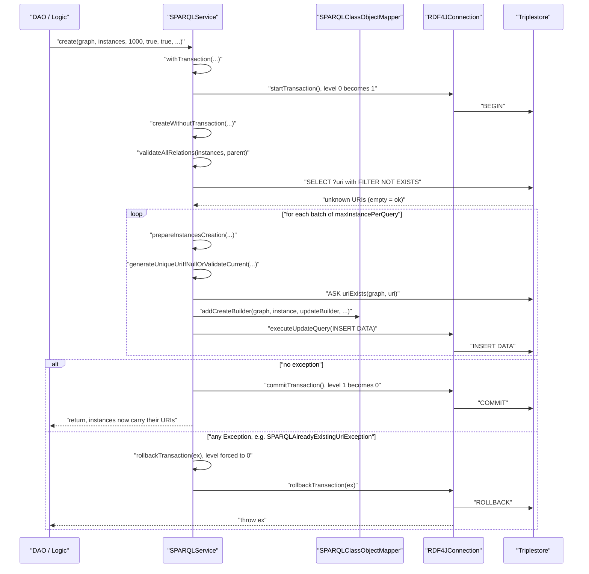

# Technical documentation : [`sparql`] Transactions, URI generation, validation and relations

**Document history (please add a line when you edit the document)**

| Date       | Editor(s)        | OpenSILEX version | Comment           |
|------------|------------------|-------------------|-------------------|
| 2026-09-11 | Arnaud Charleroy | BUILD-SNAPSHOT    | Document creation |
| 2026-09-13 | Arnaud Charleroy | BUILD-SNAPSHOT    | Review pass: fixed the `SPARQLUnknownFieldException` row and two line citations; added the 4-argument `renameTripleURI` and `createForUpdate`, and cross-linked the transaction inventory with document 05 |

## Table of contents

<!-- TOC -->
- [Purpose](#purpose)
- [Key classes](#key-classes)
- [Transactions](#transactions)
  - [The nesting counter](#the-nesting-counter)
  - [withTransaction](#withtransaction)
  - [Where the ORM opens transactions itself](#where-the-orm-opens-transactions-itself)
  - [A transactional multi-model write, with the rollback path](#a-transactional-multi-model-write-with-the-rollback-path)
  - [How a caller in opensilex-core uses it](#how-a-caller-in-opensilex-core-uses-it)
- [URI generation](#uri-generation)
  - [The generator interface](#the-generator-interface)
  - [Which generator a model uses](#which-generator-a-model-uses)
  - [The generation prefix](#the-generation-prefix)
  - [Collision handling and retry](#collision-handling-and-retry)
- [Validation before a write](#validation-before-a-write)
  - [Relation validation](#relation-validation)
  - [Generated validation SPARQL](#generated-validation-sparql)
  - [The SHACL hand-off](#the-shacl-hand-off)
  - [The OWL restriction hand-off](#the-owl-restriction-hand-off)
- [Relations and metadata](#relations-and-metadata)
  - [SPARQLModelRelation](#sparqlmodelrelation)
  - [Generic relation read and write helpers](#generic-relation-read-and-write-helpers)
- [The static prefix registry](#the-static-prefix-registry)
- [Exception catalogue](#exception-catalogue)
- [Extension points](#extension-points)
- [Gotchas and invariants](#gotchas-and-invariants)
- [See also](#see-also)
<!-- TOC -->

## Purpose

[SPARQLService](../../../../../../../opensilex-sparql/src/main/java/org/opensilex/sparql/service/SPARQLService.java)
is two things stacked in one 2822-line class. The CRUD facade is documented in
[SPARQLService CRUD](./05-sparql-service-crud.md); this document covers the other half — the
cross-cutting machinery every write goes through before a single triple reaches the triplestore:
opening and closing a transaction on the underlying connection, giving a new model a URI nobody
else owns, checking that everything the model points at actually exists, and reading or writing the
untyped relations that the annotated model class does not cover. It also covers the JVM-global
prefix registry that lives, for historical reasons, as static state on `SPARQLService`, and the
full exception catalogue of the module.

## Key classes

| Class | File | Role |
|-------|------|------|
| `SPARQLService` | [SPARQLService.java](../../../../../../../opensilex-sparql/src/main/java/org/opensilex/sparql/service/SPARQLService.java) | The facade. Owns `transactionLevel`, the URI-generation entry points, relation validation, and the static prefix map. |
| `SPARQLConnection` | [SPARQLConnection.java](../../../../../../../opensilex-sparql/src/main/java/org/opensilex/sparql/service/SPARQLConnection.java) | The interface `SPARQLService` delegates to: query execution, `startTransaction`/`commitTransaction`/`rollbackTransaction`, SHACL on/off, graph operations. |
| `RDF4JConnection` | [RDF4JConnection.java](../../../../../../../opensilex-sparql/src/main/java/org/opensilex/sparql/rdf4j/RDF4JConnection.java) | The only real implementation. Wraps one RDF4J `RepositoryConnection`; converts `ShaclSailValidationException` into `SPARQLValidationException`. |
| `SPARQLServiceFactory` | [SPARQLServiceFactory.java](../../../../../../../opensilex-sparql/src/main/java/org/opensilex/sparql/service/SPARQLServiceFactory.java) | Builds the mapper index at startup and populates the static prefix registry. |
| `SPARQLPrefixMapping` | [SPARQLPrefixMapping.java](../../../../../../../opensilex-sparql/src/main/java/org/opensilex/sparql/service/SPARQLPrefixMapping.java) | Jena `PrefixMappingImpl` subclass that caches the prefix map and picks the longest-matching namespace in `shortForm`. |
| `URIGenerator` | [URIGenerator.java](../../../../../../../opensilex-main/src/main/java/org/opensilex/uri/generation/URIGenerator.java) | The generation contract: `generateURI(prefix, instance, retryCount)`, `getInstanceUriPath`, `normalize`. |
| `ClassURIGenerator` | [ClassURIGenerator.java](../../../../../../../opensilex-main/src/main/java/org/opensilex/uri/generation/ClassURIGenerator.java) | Sub-interface: a model supplies `getInstancePathSegments`, the default `normalize(String[])` joins them with `.`. |
| `DefaultURIGenerator` | [DefaultURIGenerator.java](../../../../../../../opensilex-main/src/main/java/org/opensilex/uri/generation/DefaultURIGenerator.java) | Empty implementation; the fallback when `@SPARQLResource` declares no generator. Its path is `normalize(instance.toString())`. |
| `SPARQLModelRelation` | [SPARQLModelRelation.java](../../../../../../../opensilex-sparql/src/main/java/org/opensilex/sparql/model/SPARQLModelRelation.java) | One untyped triple attached to a model: graph, property, value type, string value, reverse flag. |
| `SPARQLProxyRelationList` | [SPARQLProxyRelationList.java](../../../../../../../opensilex-sparql/src/main/java/org/opensilex/sparql/mapping/SPARQLProxyRelationList.java) | Lazy loader of a model's untyped relations, via a SPARQL `DESCRIBE`. |
| `OwlRestrictionValidator` | [OwlRestrictionValidator.java](../../../../../../../opensilex-sparql/src/main/java/org/opensilex/sparql/owl/OwlRestrictionValidator.java) | Ontology-driven validation of relations (cardinality, datatype, domain). Used by the CSV pipeline, *not* by `SPARQLService`. |
| `SPARQLException` and subclasses | [exceptions/](../../../../../../../opensilex-sparql/src/main/java/org/opensilex/sparql/exceptions) | 16 checked exception classes; see the [catalogue](#exception-catalogue). |

## Transactions

### The nesting counter

There is no transaction manager and no thread-local. The whole mechanism is one `int` field on the
service instance (`SPARQLService.java:290`) and three methods:

```java
private int transactionLevel = 0;

@Override
public void startTransaction() throws SPARQLException {
    if (transactionLevel == 0) {
        LOGGER.debug("SPARQL TRANSACTION START");
        connection.startTransaction();
    }
    transactionLevel++;
}

@Override
public void commitTransaction() throws SPARQLException {
    transactionLevel--;
    if (transactionLevel == 0) {
        LOGGER.debug("SPARQL TRANSACTION COMMIT");
        connection.commitTransaction();
    }
}

@Override
public void rollbackTransaction(Exception ex) throws Exception {
    if (transactionLevel != 0) {
        if (ex != null) {
            LOGGER.error("SPARQL TRANSACTION ROLLBACK: {}", ex.getMessage());
        }
        transactionLevel = 0;
        connection.rollbackTransaction(ex);
    }
}
```

Consequences a modifier must keep in mind:

1. **Reentrancy is counting, not savepoints.** Only the outermost `startTransaction` reaches the
   connection; only the outermost `commitTransaction` commits. The triplestore sees exactly one
   transaction whatever the nesting depth. There is no partial rollback of an inner block.
2. **Rollback is always total.** `rollbackTransaction` resets `transactionLevel` to `0` and rolls
   the connection back regardless of depth (`SPARQLService.java:321`). An inner method that rolls
   back therefore destroys the outer caller's work too, and the outer `commitTransaction()` that
   runs afterwards will decrement the counter to `-1` and silently do nothing.
3. **`rollbackTransaction(ex)` rethrows `ex` for you**, both in the `SPARQLConnection` interface
   default — which only rethrows and rolls nothing back — and in `RDF4JConnection`, the only real
   implementation (`SPARQLConnection.java:71-75`, `RDF4JConnection.java:241-246`), so the `throw ex;` that
   follows most call sites is unreachable. The no-arg `rollbackTransaction()`
   (`SPARQLService.java:326`) rolls back without rethrowing.
4. **…but it swallows `ex` when no transaction is open.** The whole body is behind
   `if (transactionLevel != 0)`, rethrow included.
5. **`hasActiveTransaction()` does not read the counter.** It delegates straight to
   `connection.hasActiveTransaction()` (`SPARQLService.java:293`), i.e. RDF4J's
   `RepositoryConnection.isActive()`. Counter and connection can disagree after an unbalanced
   call sequence.

### withTransaction

`SPARQLService.java:1172` wraps the three calls in the only helper the module provides:

```java
public <R> R withTransaction(ThrowingSupplier<R, Exception> operation) throws Exception {
    try {
        startTransaction();
        R result = operation.get();
        commitTransaction();
        return result;
    } catch (Exception e) {
        rollbackTransaction(e);
        throw e;
    }
}
```

It is used exactly once inside the module, by the batch `create` overload
(`SPARQLService.java:1285`), which delegates the real work to
`createWithoutTransaction(...)` (`SPARQLService.java:1188`). That split is the pattern the rest of
the class is missing: several methods carry a `@TODO` comment saying "like for
create/createWithException, allow to run this method without direct transaction handling and add
another method" (`SPARQLService.java:1497`, `:1569`, `:1644`, `:1660`).

### Where the ORM opens transactions itself

This is the same inventory as the "Transaction awareness" table in
[the CRUD facade](./05-sparql-service-crud.md#transaction-awareness), read from the implementation
side: one row per method that actually contains a `startTransaction` (or a `withTransaction`),
rather than one row per method family a caller reaches for.

| Method | Line | Notes |
|--------|------|-------|
| `create(Node, Collection, Integer, boolean, boolean, List, SPARQLResourceModel)` | 1277 | Via `withTransaction`; the only one that does. |
| `update(List, Node, SPARQLResourceModel)` | 1488 | Explicit try/commit/rollback. |
| `delete(Node, Class, URI)` | 1559 | Explicit; recurses into `delete(Class, List)` for cascade deletes, so nesting is normal here. |
| `delete(Node, Class, List)` | 1641 | Explicit; loops over `delete(..., uri)`. |
| `deleteURIClassMap(Map)` | 1657 | Explicit; private, used by `@AutoUpdate` cleanup. |
| `createForUpdate(Collection, Node, SPARQLResourceModel)` | 1146 | By delegation: it stamps `lastUpdateDate` and hands the batch to the transactional list `create` (`:1153`). |
| `clearGraphs(String...)` | 2379 | Explicit; uses the no-arg `rollbackTransaction()`. |
| `renameTripleURI(URI, URI)` | 2533 | Explicit; six sub-updates in one transaction. |

Note what is **not** in the list: the single-instance `create(Node, T, ...)`
(`SPARQLService.java:1049`) runs no transaction of its own. It issues one `INSERT DATA`, which the
triplestore makes atomic anyway, but any surrounding invariant (a model plus its side effects) is
the caller's responsibility.

### A transactional multi-model write, with the rollback path

This is the real sequence of `create(graph, instances, maxInstancePerQuery, true, true, null, null)`
for a batch of models, including the failure branch.



Two details worth spelling out. First, `validateAllRelations` runs **inside** the transaction, so a
validation failure rolls back whatever earlier batches already inserted. Second, the URIs assigned
by `generateUniqueUriIfNullOrValidateCurrent` are written into the Java objects and are **not**
undone by the rollback — after a failed create, the caller's models keep the URIs the ORM invented
for them.

### How a caller in opensilex-core uses it

The idiom is explicit try/catch around business steps that must succeed together. From
`VariableCopyLogic` (`opensilex-core/.../variable/bll/VariableCopyLogic.java:108-133`):

```java
try {
    sparql.startTransaction();

    result.setEntityUris(new ArrayList<>(createIfMissing(
            EntityModel.class, EntityDetailsDTO.class, entityUris, service, EntityAPI.PATH)));
    // ... four more createIfMissing calls ...
    createBaseVariable(VariableModel.class, variableDetailsList.getList(), service);

    sparql.commitTransaction();
    return result;
} catch (Exception e) {
    sparql.rollbackTransaction();
    throw e;
}
```

This is the correct shape: the no-arg `rollbackTransaction()` does not rethrow, so the explicit
`throw e` preserves the original stack trace. Each `createIfMissing` calls `sparql.create(...)`,
which opens its own nested level; only the outer `commitTransaction()` reaches the store.

When a MongoDB write must happen in the same operation, the two transactions are started and
committed side by side and rolled back side by side — there is no distributed transaction, only
two independent ones closed in sequence (`opensilex-core/.../event/api/EventAPI.java:162-179`
does `sparql.startTransaction(); nosql.startTransaction(); ...; sparql.commitTransaction();
nosql.commitTransaction();` with both rollbacks in the `catch`). A failure between the two
commits leaves the triplestore committed and MongoDB rolled back. The reason this is accepted
is not documented in the code.

## URI generation

### The generator interface

`URIGenerator<T>` is a functional-style interface with defaults only:

```java
default URI generateURI(String prefix, T instance, int retryCount) throws URISyntaxException {
    String path = getInstanceUriPath(instance);
    if (retryCount == 0) {
        return new URI(prefix + URI_SEPARATOR + path);
    }
    return new URI(prefix + URI_SEPARATOR + path + URI_SEPARATOR + retryCount);
}
```

`URI_SEPARATOR` is `/`. `getInstanceUriPath` defaults to `normalize(instance.toString())`.
`normalize(String)` strips everything matching `[^\w -]+`, lower-cases, trims, replaces remaining
spaces by `_`, and finally applies `Normalizer.Form.NFD`. `ClassURIGenerator` overrides
`getInstanceUriPath` to `normalize(getInstancePathSegments(instance))`, which normalises each
segment and joins them with `.` (`NORMALIZING_JOIN_CHARACTER`).

So a `VariableModel` whose generator returns `{"Plant", "Height", "Image analysis"}` produces the
path `plant.height.image_analysis`.

### Which generator a model uses

Resolution happens in two places and has one surprising rule
(`SPARQLClassAnalyzer.java:111-114` and `SPARQLClassObjectMapper.java:503-509`):

```java
// SPARQLClassAnalyzer
if (URIGenerator.class.isAssignableFrom(objectClass)) {
    uriGenerator = null;                                   // the model IS its own generator
} else {
    uriGenerator = resourceAnnotation.uriGenerator().getConstructor().newInstance();
}
```

A model class that implements `URIGenerator` (in practice `ClassURIGenerator`) is its own
generator, and the `uriGenerator` attribute of `@SPARQLResource` is ignored for it. Otherwise the
annotation's `uriGenerator` class is instantiated once through its no-argument constructor; the
default is `DefaultURIGenerator`, whose path is `instance.toString()` normalised. The generator
instance is created at index-build time, so **it must be stateless and have a public no-arg
constructor** — a missing constructor raises `SPARQLInvalidClassDefinitionException` at startup.

The test model shows the common shape
([UriGeneratedTestModel.java](../../../../../../../opensilex-sparql/src/test/java/org/opensilex/sparql/model/UriGeneratedTestModel.java)):

```java
@SPARQLResource(ontology = TEST_ONTOLOGY.class, resource = "A")
public class UriGeneratedTestModel extends A implements ClassURIGenerator<A> {
    @Override
    public String[] getInstancePathSegments(A instance) {
        return new String[]{instance.getString()};
    }
}
```

### The generation prefix

The `prefix` argument is `getDefaultGenerationURI(modelClass)` (`SPARQLService.java:2272`), which
returns `SPARQLClassObjectMapper.getGenerationPrefixURI()`. That value starts as the platform-wide
`generationPrefixURI` computed by `SPARQLModule.setup()` — `SPARQLConfig.generationBaseURI()` if
set, otherwise `baseURI` with `generationBaseURIAlias()` (default `id`) appended — and is then
extended per class by the `graph` attribute of `@SPARQLResource`
(`SPARQLClassObjectMapper.java:105-113`): an absolute `graph` replaces it, a relative one is
appended with `/`. Data graphs get the extra `set/` segment there, generation URIs do not; see
[graph organization](../graph-organization.md).

### Collision handling and retry

`generateUniqueURI` (`SPARQLService.java:1300`) is the whole algorithm:

```java
public <T extends SPARQLResourceModel> void generateUniqueURI(Node graph, T instance,
        URIGenerator<T> uriGenerator, boolean checkUriExist) throws SPARQLException, URISyntaxException {
    URI uri = instance.getUri();
    if (uri == null) {
        int retry = 0;
        String prefix = getDefaultGenerationURI(instance.getClass()).toString();
        uri = uriGenerator.generateURI(prefix, instance, retry);

        if (checkUriExist) {
            boolean uriALreadyExists = generatedUriCache.getIfPresent(uri) != null || uriExists(graph, uri);
            while (uriALreadyExists) {
                uri = uriGenerator.generateURI(prefix, instance, ++retry);
                uriALreadyExists = generatedUriCache.getIfPresent(uri) != null || uriExists(graph, uri);
            }
        }
        instance.setUri(uri);
        generatedUriCache.put(uri, Boolean.TRUE);
    }
}
```

The retry counter is simply appended as a path segment, so successive attempts are
`.../id/variable/plant.height`, `.../id/variable/plant.height/1`, `.../id/variable/plant.height/2`.

`generatedUriCache` (`SPARQLService.java:103`) is a static Caffeine cache, 30-second expiry, 10 000
entries max. It exists because the existence check is a SPARQL `ASK`: inside one batch insert the
models are not yet committed, so the triplestore would answer "free" for a URI a previous model in
the same batch has already claimed. The cache closes that window. Being `static`, it is shared by
every `SPARQLService` in the JVM and by every repository they point at.

The call the ORM actually makes is one level up, `generateUniqueUriIfNullOrValidateCurrent`
(`SPARQLService.java:1320`):

```java
URIGenerator<T> uriGenerator = mapper.getUriGenerator(instance);
URI uri = instance.getUri();
if (uri == null) {
    generateUniqueURI(graph, instance, uriGenerator, true);
    // only ensure that the URI hasn't some outgoing relation
    // the URI can have some in relations without problem (ex : skos or other in-coming relation)
} else if (checkUriExist && uriExists(graph, uri, true, false)) {
    throw new SPARQLAlreadyExistingUriException(uri);
}
```

The asymmetry is deliberate and is covered by two tests in
[SPARQLServiceTest](../../../../../../../opensilex-sparql/src/test/java/org/opensilex/sparql/SPARQLServiceTest.java)
(`testCreateWithGeneratedURI`, `testCreateWithFixedURI`):

- **Generated URI** — `uriExists(graph, uri)` checks *both* directions, so a candidate that is only
  the object of an incoming triple is still considered taken and the generator retries.
- **Caller-supplied URI** — `uriExists(graph, uri, true, false)` checks *outgoing* relations only.
  A URI that some other resource already points at (a `skos:broader` link, a reverse relation) can
  still be used; a URI that already describes something cannot, and
  `SPARQLAlreadyExistingUriException` is raised.

`checkUriExist` reaches `generateUniqueUriIfNullOrValidateCurrent` from the public `create`
overloads and defaults to `true`. Note that it only gates the *supplied-URI* branch: the generation
branch hard-codes `generateUniqueURI(graph, instance, uriGenerator, true)`
(`SPARQLService.java:1324`), so `create(instance, false)` still performs one `ASK` per generated
URI.

## Validation before a write

Three independent things are called "validation" in this module. Only the first is executed by
`SPARQLService` on every write.

### Relation validation

`validateAllRelations` (`SPARQLService.java:2288` for one instance, `:2301` for a collection) is
called by `prepareInstancesCreation` (`:1124`), `createWithoutTransaction` (`:1206`) and
`update` (`:1503`). It answers one question: *does every URI this model points at already exist in
the triplestore, as an instance of the expected class?*

```java
public <T extends SPARQLResourceModel> void validateAllRelations(Collection<T> instances,
                                                                 SPARQLResourceModel parent) throws Exception {
    if (!this.isShaclEnabled()) {
        validateRelations(instances, parent);
    }
    validateReverseRelations(instances, parent);
}
```

The URIs to check are collected by the mapper, grouped by the mapper of the *target* class:
`getRelationsUrisByMapper` walks the object-property fields and object-list fields of the model
(`SPARQLClassObjectMapper.java:620-660`), keeping the forward relations; `getReverseRelationsUrisByMapper`
is the same walk with the `@SPARQLProperty(inverse = true)` fields instead. Untyped
`SPARQLModelRelation` values are **not** part of this check — they are validated, if at all, by the
OWL restriction validator.

The `parent` argument exists for nested creation: when `prepareInstancesCreation` recurses into
sub-instances, the parent model is not in the store yet, so its URI is removed from the set before
the existence query (`SPARQLService.java:2316-2318`).

### Generated validation SPARQL

`validateRelations` ends in `getExistingUris(objectClass, urisToCheck, false)`, i.e.
`getUnknownUrisQuery` with `checkExist = false` (`SPARQLService.java:2053`). For a set of two
`EntityModel` URIs the generated query is:

```sparql
PREFIX rdf:  <http://www.w3.org/1999/02/22-rdf-syntax-ns#>
PREFIX rdfs: <http://www.w3.org/2000/01/rdf-schema#>

SELECT ?uri
WHERE {
  VALUES ?uri { <http://opensilex.test/id/variable/plant> <http://opensilex.test/id/variable/leaf> }
  FILTER NOT EXISTS {
    ?uri  ?p         ?o .
    ?type rdfs:subClassOf* vocabulary:Entity .
    ?uri  rdf:type   ?type .
  }
}
```

Every row that comes back is a URI that does **not** exist, and the method throws
`SPARQLInvalidUriListException` listing them. The message carries the target class simple name but,
as the in-code `#TODO` at `SPARQLService.java:2325` says, not the property that referenced it.

The existence check performed for a caller-supplied URI is the `ASK` built by
`uriExists(Node, URI, boolean, boolean)` (`SPARQLService.java:1757`), documented with its generated
form in the javadoc:

```sparql
ASK WHERE {
  GRAPH test:my_graph { <my_uri> ?p_out ?o }
}
```

with a `UNION { GRAPH test:my_graph { ?s ?p_in <my_uri> } }` added when `checkInRelations` is true.

### The SHACL hand-off

When `isShaclEnabled()` returns true, forward-relation validation is skipped: the triplestore is
expected to enforce the shapes instead. The shapes are generated from the model annotations by
`SPARQLClassQueryBuilder.generateSHACL()` and loaded into RDF4J's
`RDF4J.SHACL_SHAPE_GRAPH` by `RDF4JConnection.enableSHACL()` (`RDF4JConnection.java:421`). A
violation surfaces as an RDF4J `ShaclSailValidationException` wrapped in a `RepositoryException`;
every method of `RDF4JConnection` catches it and converts the SHACL report model into a
`SPARQLValidationException` through `convertRDF4JSHACLException` (`RDF4JConnection.java:365`),
which walks `sh:focusNode`, `sh:resultPath`, `sh:sourceConstraintComponent` and `sh:value` into the
nested `Map<URI, Map<URI, Map<URI, String>>>` the exception prints in `getMessage()`.

Reverse-relation validation is **never** skipped — SHACL shapes are generated per class for its own
properties and cannot express "the model I point back at must exist".

See [ontology store and OWL](./09-ontology-store-and-owl.md) for the shape generation itself.

### The OWL restriction hand-off

`OwlRestrictionValidator` is the ontology-driven validator: it reads `ClassModel` restrictions from
the [ontology store](../ontology-ram-storage-optimization.md) and checks datatype properties, object
properties, cardinalities and required values on a model's `SPARQLModelRelation` list. It is
**not** invoked by `SPARQLService` — the CSV pipeline
([csv pipeline](./11-csv-pipeline.md)) drives it through `CsvOwlRestrictionValidator`, and
`OntologyDAO.validateThenAddObjectRelationValue` drives it for single-relation API calls. A write
that goes straight through `sparql.create(model)` with hand-built relations gets no OWL validation
at all.

The one place `SPARQLService` touches the ontology is `deleteCustomRelations`
(`SPARQLService.java:1419`), called from `delete` (`:1615`) for models whose `@SPARQLResource`
declares `handleCustomProperties = true`. It loads the `ClassModel` for the instance's concrete
type, computes the restriction properties that the Java class does *not* manage, and deletes those
triples. If no `ClassModel` exists for the type it raises `SPARQLInvalidModelException` with the
message "Add the corresponding ClassModel definition into your triplestore or remove the
handleCustomProperties annotation on your model".

## Relations and metadata

### SPARQLModelRelation

Every `SPARQLResourceModel` carries a `List<SPARQLModelRelation>` (`SPARQLResourceModel.java:65`).
A relation is five fields — `graph`, `property`, `type` (the Java class used to pick a
deserializer), `value` (always a `String`), and `reverse`.

**Write path.** `SPARQLClassQueryBuilder.addRelationsQuads` (`SPARQLClassQueryBuilder.java:1091`)
turns each relation into one quad during `addCreateBuilder`:

```java
Node valueNode = SPARQLDeserializers.getForClass(valueType).getNodeFromString(relation.getValue());
Triple relationTriple = Triple.create(uriNode, SPARQLDeserializers.nodeURI(relation.getProperty()), valueNode);
Node relationGraph = relation.getGraph() != null ? SPARQLDeserializers.nodeURI(relation.getGraph()) : graph;
```

Relations with an empty value are skipped silently, and `reverse` is **ignored on write** — the
model URI is always the subject. `SPARQLResourceModel.addRelation(...)` even hard-codes
`r.setReverse(false)` (`SPARQLResourceModel.java:159`).

**Read path.** `SPARQLClassObjectMapper.createInstance` attaches a lazy
`SPARQLProxyRelationList` (`SPARQLClassObjectMapper.java:277`) built from the set of properties the
class already manages. On first access the proxy runs `SPARQLService.describe(graph, uri)`
(`SPARQLService.java:220`), keeps every statement whose predicate is not managed, and — here
`reverse` *is* meaningful — sets `reverse = true` plus `value = subject` when the described URI
appears as the object. The non-proxy paths do the same from a pre-fetched statement list
(`SparqlSchema.java:99`, `SparqlSchemaNode.java:235`).

The publisher / publication-date / last-update triples are *not* relations in this sense: they are
declared fields of `SPARQLResourceModel` handled by the normal mapper. See
[metadata](../metadata.md) for that story, and
[sparql property annotation](../sparql-property-annotation.md) for the annotations that decide
which properties are "managed" and therefore excluded from the relation list.

### Generic relation read and write helpers

`SPARQLService` exposes a small untyped API for code that manipulates triples directly rather than
models:

| Method | Line | Generated update |
|--------|------|------------------|
| `insertPrimitive(Node, URI, Property, Object)` | 2086 | `INSERT DATA { GRAPH g { s p "v" } }`; silently does nothing if no deserializer exists for the value class. |
| `insertPrimitive(Node, List<URI>, Property, Object)` | 2104 | Same, one triple per subject, one query. |
| `updateObjectRelations(Node, URI, Property, List)` | 2131 | `DELETE { GRAPH g { s p ?o } } INSERT { GRAPH g { s p v1 ... vn } } WHERE { OPTIONAL { s p ?o } }` — replaces all values of one property. |
| `updateSubjectRelations(Node, List<URI>, Property, Object)` | 2167 | The mirror image: replaces all subjects linked to one object by one property. |
| `deletePrimitives(Node, URI, Property)` | 2396 | `DELETE { GRAPH g { uri p ?value } } WHERE { uri p ?value }`. |
| `deleteRelations(Node, URI, Set<URI>)` | 2404 | Deletes every triple of `uri` whose predicate is in the set, using `SPARQLQueryHelper.inURIFilter`. |
| `searchPrimitives(Node, URI, Property, Class)` | 2449 | `SELECT ?value` with `FILTER(datatype(?value) = xsd:...)`; a value that fails to deserialize is logged as a warning and dropped. |
| `getTranslations(URI, Property, boolean)` | 2191 | `SELECT ?value (lang(?value) AS ?lang)`; returns a `Map` of language tag to label. |
| `getRdfTypes(URI, Node)` | 2421 | `SELECT DISTINCT ?type`. |
| `getUriLinksWithOtherResources(URI, List)` | 2795 | Lists incoming triples, used to explain a `ConflictException`. |
| `requireUriIsNotLinkedWithOtherResourcesInRDF(URI, List)` | 2764 | `ASK { ?s ?p <uri> }` with optional predicate exclusions; throws `ConflictException` — a JAX-RS exception, not a `SPARQLException`. |
| `renameTripleURI(URI, URI)` | 2533 | Six `DELETE/INSERT/WHERE` updates in one transaction, one per (subject, predicate, object) × (named graph, default graph). |
| `renameTripleURI(URI, URI, TupleSlot, boolean inNamedGraph)` | 2558 | One of those six. `TupleSlot` picks the position (`SUBJECT`, `PREDICATE`, `OBJECT`) through `SPARQLQueryHelper.buildUriTriple`, `inNamedGraph` picks named-graph or default-graph scope. It opens **no** transaction of its own, so calling it directly leaves the other five slots stale unless you wrap them yourself. |

## The static prefix registry

`SPARQLService.java:156-192` holds the prefix table as **JVM-global mutable static state**:

```java
private static HashMap<String, String> prefixes = getDefaultPrefixes();  // rdfs, foaf, dc, owl, xsd

public static void addPrefix(String prefix, String namespace) { prefixes.put(prefix, namespace); }
public static Map<String, String> getPrefixes()               { return prefixes; }
public static PrefixMapping getPrefixMapping()  { return new SPARQLPrefixMapping().setNsPrefixes(prefixes); }
public static void clearPrefixes()              { prefixes = getDefaultPrefixes(); }
```

Every query the service executes goes through the private `addPrefixes(builder)` overloads
(`:182`, `:187`), which stamp `getPrefixMapping()` onto the Jena builder before handing it to the
connection. Note the two exceptions: `executeUpdateQuery(String)` (`:274`) does not add prefixes —
a raw update string must carry its own — and `getGraphStatement` bypasses the builder entirely.

**Who writes it, and when.** Only at module startup, never per request:

| Writer | Line | What it adds |
|--------|------|--------------|
| `SPARQLServiceFactory.startup()` | `SPARQLServiceFactory.java:88` | one prefix per mapped class graph, `baseURIAlias`, `generationBaseURIAlias`, `SPARQLModule.getCustomPrefixes()`, and the prefix of every `OntologyFileDefinition` of every `SPARQLExtension` module. |
| `RDF4JServiceFactory.startup()` | `RDF4JServiceFactory.java:107` | every namespace already declared *in the repository itself*. |
| `SecurityModule.setup()` | `SecurityModule.java:98` | `SecurityOntology`. |
| `CoreModule.setup()` | `CoreModule.java:179-181` | `Oeso`, `Oeev`, `Time`. |
| `SPARQLServiceFactory.shutdown()` | `SPARQLServiceFactory.java:125` | resets to the five defaults. |

Immediately after populating it, each factory pushes the resulting mapping into the URI
deserializer with `URIDeserializer.setPrefixes(SPARQLService.getPrefixMapping(), usePrefixes)`,
which is what makes `SPARQLDeserializers.getShortURI` / `getExpandedURI` work (see
[type system and deserializers](./08-type-system-deserializers.md)). If
`SPARQLConfig.usePrefixes()` is false, `SPARQLServiceFactory.startup()` calls `clearPrefixes()`
instead and everything is written in long form.

**What that implies.**

- **Two factories share one table.** An installation that declares a second SPARQL service (a
  second repository, a shared-resource-instance mirror) gets the union of both prefix sets, and the
  last `startup()` wins on any conflicting prefix. Nothing detects the conflict.
- **`getPrefixes()` returns the live map.** It is not a copy and not unmodifiable;
  `OntologyAPI.java:745` hands it straight to the REST layer. A caller that mutates it mutates the
  registry.
- **Tests must be ordered or isolated.** `clearPrefixes()` on one factory's `shutdown()` wipes the
  prefixes another still-running factory added. `SPARQLServiceTest.testPrefixInRepositoryExists`
  asserts on the global table and therefore depends on `RDF4JConnectionTest.setupSPARQL()` having
  run first.
- **`SPARQLPrefixMapping.shortForm` picks the longest match.** It iterates the cached map and keeps
  the candidate leaving the shortest remainder, so overlapping namespaces (`.../id/` inside
  `.../`) shorten to the more specific prefix. The cache is refreshed only in `setNsPrefixes`, so a
  `PrefixMapping` obtained before an `addPrefix` call does not see the new entry — which is
  harmless only because `addPrefixes(builder)` builds a fresh mapping per query.

## Exception catalogue

All of these extend `SPARQLException extends Exception` (checked).

| Exception | Thrown by | Meaning | Typical caller reaction |
|-----------|-----------|---------|-------------------------|
| `SPARQLException` | `RDF4JConnection` for any non-SHACL `RepositoryException`; `checkTripleURIExists`; `getByUniquePropertyValue` on multiple hits | Generic failure of a SPARQL operation | Let it bubble to the JAX-RS layer (HTTP 500) |
| `SPARQLValidationException` | `RDF4JConnection.convertRDF4JSHACLException` (`RDF4JConnection.java:365`), from any query when the SHACL sail rejects the transaction | SHACL shapes violated; `getValidationErrors()` maps object → property → constraint → value | `SPARQLModule.installOntologies` and `SPARQLCommands.shaclEnable` log it and disable SHACL; an API should turn it into a 400 |
| `SPARQLInvalidModelException` | `deleteCustomRelations` (`SPARQLService.java:1434`) | `handleCustomProperties` is set but no `ClassModel` exists for the instance type | Fix the ontology or remove the annotation; not recoverable at runtime |
| `SPARQLAlreadyExistingUriException` | `generateUniqueUriIfNullOrValidateCurrent` (`SPARQLService.java:1329`) | The caller supplied a URI that already has outgoing triples | Caught by most `create` endpoints and returned as HTTP 409 `CONFLICT` (e.g. `EntityAPI.java:103`) |
| `SPARQLAlreadyExistingUriListException` | Business code, e.g. `EventLogic.java:310` | Batch equivalent; carries the URI collection and the offending field name | HTTP 409 with the field name so the front end can highlight it |
| `SPARQLNotExistingUriListException` | `update(List, Node, parent)` (`SPARQLService.java:1507`) | Some instance to update has a URI that is not in the store | HTTP 404 / 400 listing the URIs |
| `SPARQLInvalidUriListException` | `loadListByURIs` (`:550`), `validateRelations` (`:2326`), `AbstractSparqlUrisQuery` (`:97`, `:127`) | One or more referenced URIs do not exist; `getStrUris()` renders them | HTTP 404, e.g. `EntityAPI.java:169` |
| `SPARQLInvalidURIException` | `renameGraph` (`:347`, `:354`), `updateFields` (`:1471`), `AbstractOntologyStore`, `OntologyDAO.getClassModel` | A single URI is syntactically invalid or unknown | HTTP 400/404 |
| `SPARQLMultipleObjectException` | `loadByURI` (`:479`) | More than one row for a single URI — usually the same resource declared in two graphs | Data inconsistency; log and investigate, the query text is in the message |
| `SPARQLMapperNotFoundException` | `SPARQLClassObjectMapperIndex.getForClass` / `getForResource` (`:125`, `:138`) | No `@SPARQLResource` class registered for that Java class or RDF resource | Programming error; register the class or fix the type |
| `SPARQLInvalidClassDefinitionException` | `SPARQLClassObjectMapper.init`, `SPARQLClassAnalyzer` constructor | The annotated model class cannot be mapped (no default constructor, bad generator, unknown ontology field) | Startup failure; fix the model |
| `SPARQLUnknownFieldException` | `SPARQLClassObjectMapper.getFieldExprVar` (`:471`) | A field *name* passed to the mapper does not resolve to a mapped field on the model | Programming error |
| `SPARQLIllegalStateException` | `FavoriteGetDTO.fromNamedResourceModelContextMap` (`FavoriteGetDTO.java:38`) | The stored triples contradict a business invariant (here: one URI with two incompatible types across graphs) | HTTP 500; the data must be repaired |
| `SPARQLQueryException` | *nowhere* | Was meant to attach the offending Jena `Query` to a message | — |
| `SPARQLTransactionException` | *nowhere* | Declared, never instantiated; transaction errors surface as plain `SPARQLException` | — |
| `SPARQLUnkownKeyException` | *nowhere* | Declared, never instantiated; its constructor also drops its `key` argument | — |

`ConflictException` and `NotFoundURIException` (from `opensilex-server`) are also thrown by
`SPARQLService` — `requireUriIsNotLinkedWithOtherResourcesInRDF` (`:2779`) and
`delete(Node, Class, URI)` (`:1564`) respectively. They are unchecked JAX-RS exceptions, so they
cross the ORM boundary without appearing in any `throws` clause.

## Extension points

- **A custom URI scheme for a model**: implement `ClassURIGenerator<YourModel>` on the model itself
  and return the path segments from `getInstancePathSegments`. This is the common case and needs no
  annotation change. If the model cannot implement the interface (it is shared, or the path depends
  on something other than the instance), write a stateless `URIGenerator` with a public no-arg
  constructor and name it in `@SPARQLResource(uriGenerator = ...)`.
- **A custom URI prefix for a family of models**: set `@SPARQLResource(graph = "...")` — the same
  attribute drives both the data graph and the generation prefix
  (`SPARQLClassObjectMapper.java:105-113`), so changing it moves generated URIs as well as storage.
- **A module-level prefix**: call `SPARQLService.addPrefix(prefix, namespace)` from your module's
  `setup()` (as `CoreModule` and `SecurityModule` do) or declare an `OntologyFileDefinition` from
  `SPARQLExtension.getOntologiesFiles()` and let `SPARQLServiceFactory.startup()` register it. Do
  not call `addPrefix` at request time.
- **Transactional business logic**: prefer `sparql.withTransaction(() -> { ...; return null; })`
  over hand-rolled try/catch — it cannot forget the rollback. When you must write the try/catch
  (because you also drive a Mongo transaction), use the no-arg `rollbackTransaction()` followed by
  your own `throw`.
- **Extra validation on write**: there is no hook in `SPARQLService`. Add the check in the DAO or
  Logic class before calling `create`/`update`, or — for ontology-driven checks — subclass
  `OwlRestrictionValidator` the way `CsvOwlRestrictionValidator` does and run it yourself.
- **A different backend**: implement `SPARQLConnection` and a `SPARQLServiceFactory`. The
  transaction contract you must honour is "`startTransaction` begins, `commitTransaction` commits,
  `rollbackTransaction(ex)` rolls back *and rethrows `ex` when it is non-null*"; the counting is
  done above you. See [connection and lifecycle](./10-connection-and-lifecycle.md).

## Gotchas and invariants

- **`rollbackTransaction(ex)` rethrows.** The `SPARQLConnection` interface default and
  `RDF4JConnection` both end with `throw ex`
  (`SPARQLConnection.java:71-75`, `RDF4JConnection.java:241-246`), so almost every call site in
  the repository follows it with a `throw ex;` that can never run.
- **…unless no transaction is open, in which case it swallows.** `if (transactionLevel != 0)` wraps
  the entire body (`SPARQLService.java:317`). `catch (Exception e) { sparql.rollbackTransaction(e); }`
  with no trailing `throw` loses the exception whenever the counter happens to be zero. `DocumentDAO`
  has exactly this shape behind a `withTransaction` boolean
  (`opensilex-core/.../document/dal/DocumentDAO.java:111-115`).
- **Unbalanced calls poison the counter permanently.** `commitTransaction()` decrements *before*
  testing, so a commit without a matching start leaves `transactionLevel = -1`; the next
  `startTransaction()` brings it back to `0` **without opening a transaction on the
  connection**, and every later write runs outside any transaction. One `SPARQLService` lives
  for one injection scope (`RDF4JServiceFactory.provide()` builds a fresh one every time), so
  the damage is bounded by the request — but it is silent.
- **An inner rollback kills the outer transaction.** `rollbackTransaction` forces the level to `0`.
  A nested `sparql.delete(...)` that fails and rolls back inside a caller's transaction discards
  the caller's earlier writes and leaves the caller's later `commitTransaction()` doing nothing.
- **`SPARQLService` is not thread-safe.** `transactionLevel` and `defaultLang` are plain instance
  fields with no synchronisation. One service instance per thread / per request is the rule, and
  `RDF4JServiceFactory.provide()` enforces it by handing out a new one every time.
- **`isShaclEnabled()` is per-connection and starts `false`.** `RDF4JConnection.shaclEnabled`
  (`RDF4JConnection.java:403`) is an instance field set only by `enableSHACL()`/`disableSHACL()` on
  that same connection. A connection freshly obtained from the factory always reports `false`, even
  when the repository really has shapes loaded. In practice this means the
  `if (!this.isShaclEnabled())` guard in `validateAllRelations` (`SPARQLService.java:2289`, `:2302`)
  is effectively always taken during normal request handling, and forward-relation validation runs
  in addition to whatever SHACL does.
- **Generated URIs survive a rollback.** `generateUniqueURI` calls `instance.setUri(uri)` and
  fills `generatedUriCache` before any insert, and neither is undone. Retrying the same models
  re-uses the same URIs, since they are no longer null.
- **The URI cache is global, the existence check is per-graph.** `generatedUriCache` is `static`
  and keyed by `URI` only. Two `SPARQLService` instances pointing at different repositories share
  it, so a URI reserved against repository A is considered taken in repository B for 30 seconds.
- **`checkUriExist = false` does not disable the existence `ASK` for generated URIs.**
  `generateUniqueUriIfNullOrValidateCurrent` hard-codes `true` when it delegates
  (`SPARQLService.java:1324`); the flag only affects the caller-supplied-URI branch.
- **`validateRelations` re-adds an expanded copy of one arbitrary URI.**
  `SPARQLService.java:2321-2322` takes `urisToCheck.stream().iterator().next()` — an arbitrary
  element of a `HashSet` — expands it and adds it back, so exactly one URI is checked in both
  its short and long form while the others are checked as stored. The reason is not documented
  in the code.
- **Parent-URI exclusion compares URIs literally.** `urisToCheck.remove(parent.getUri())`
  (`:2317`) is `Set.remove`, i.e. `URI.equals`, not `SPARQLDeserializers.compareURIs`. A parent
  whose URI is stored in short form while the child holds the long form is not removed, and nested
  creation fails with `SPARQLInvalidUriListException` on a URI that is about to be created.
- **Untyped relations bypass relation validation.** `getRelationsUrisByMapper` only walks annotated
  object-property fields. Anything added with `model.addRelation(...)` is inserted as-is; the URI it
  points at is never checked by `SPARQLService`.
- **`reverse` is write-ignored, read-meaningful.** `addRelationsQuads` always makes the model URI
  the subject, and `SPARQLResourceModel.addRelation` always sets `reverse = false`. Only
  `SPARQLProxyRelationList.loadData` sets it to `true`. Round-tripping a model — read it, then
  re-create it — turns its incoming relations into outgoing ones.
- **`insertPrimitive` fails silently on an unknown type.** Both overloads are wrapped in
  `if (SPARQLDeserializers.existsForClass(value.getClass()))` (`:2090`, `:2108`) with no `else`: an
  unsupported value class means no query and no error.
- **`searchPrimitives` drops values it cannot parse.** A deserialization failure is logged at WARN
  ("your database may be inconsistent") and the value is skipped (`:2474`).
- **`renameGraph` toggles SHACL around the move** (`:357-364`) and restores it only on the success
  path; an exception inside `connection.renameGraph` leaves SHACL disabled on that connection.
- **`getRepositoryConnection()` is a hard cast to `RDF4JConnection`** (`:2239`). It is
  `@Deprecated` and will `ClassCastException` on any other backend.
- **Three exception classes are dead code.** `SPARQLQueryException`, `SPARQLTransactionException`
  and `SPARQLUnkownKeyException` are never instantiated anywhere in the repository, and
  `SPARQLUnkownKeyException`'s constructor discards its argument without calling `super(key)`.

## See also

- [ORM architecture overview](../orm-architecture.md) — where this subsystem sits in the pipeline.
- [SPARQLService CRUD](./05-sparql-service-crud.md) — the create / update / delete entry points
  that call everything documented here.
- [Object mapper and index](./02-object-mapper-and-index.md) — `getUriGenerator`,
  `getGenerationPrefixURI`, `getRelationsUrisByMapper`.
- [Query generation](./03-query-generation.md) — `addRelationsQuads` and `generateSHACL`.
- [Filters and query helpers](./07-filters-and-query-helpers.md) — the `service/query` package that
  shares the URI-existence machinery.
- [Type system and deserializers](./08-type-system-deserializers.md) —
  `URIDeserializer.setPrefixes`, short/long URI forms.
- [Ontology store and OWL](./09-ontology-store-and-owl.md) — `OwlRestrictionValidator`, SHACL shape
  generation, `ClassModel` restrictions.
- [Connection and lifecycle](./10-connection-and-lifecycle.md) — `SPARQLServiceFactory`,
  `RDF4JServiceFactory`, and the module startup order that decides prefix-registry population.
- [Metadata](../metadata.md) — publisher, publication date and last-update date, and why the update
  delete/re-create cycle preserves them.
- [SPARQL property annotation](../sparql-property-annotation.md) — `@IgnoreUpdateIfNull`,
  `@AutoUpdate`, `@CascadeDelete`, which drive the transactional `update` and `delete` flows;
  [SPARQL update](../sparql-update.md) — how the update queries themselves are generated.
- [Graph organization](../graph-organization.md) and
  [graph storage](../../architecture/sparql/graph-storage.md) — the `set/` data graph versus the
  `id/` generation prefix.
