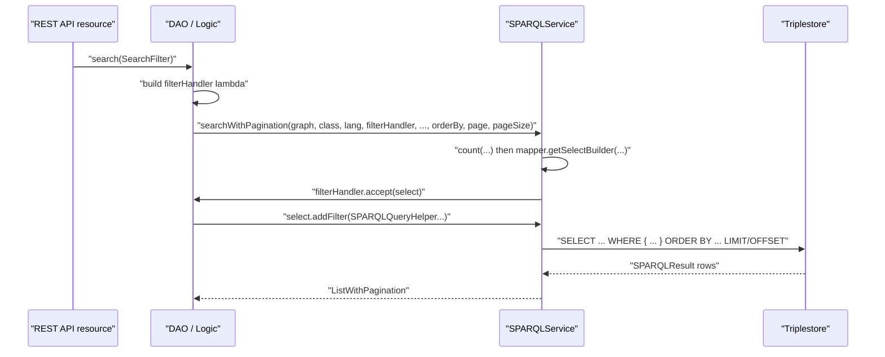
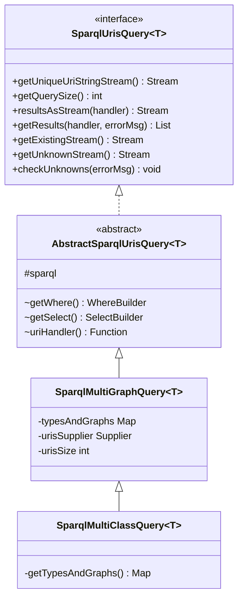
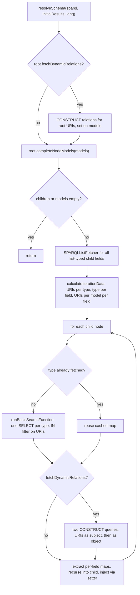

# Technical documentation : [`sparql`] Filters, query helpers and schema queries

**Document history (please add a line when you edit the document)**

| Date       | Editor(s)        | OpenSILEX version | Comment           |
|------------|------------------|-------------------|-------------------|
| 2026-09-11 | Arnaud Charleroy | BUILD-SNAPSHOT    | Document creation |
| 2026-09-13 | Arnaud Charleroy | BUILD-SNAPSHOT    | Review pass: removed a non-existent code-comment citation, corrected four line citations and the NOT IN pair, fixed the schemaQuery ORDER BY claim and `setRdfTypes`; added the hand-built fetch plan and the missing TOC entries |

## Table of contents

<!-- TOC -->
- [Purpose](#purpose)
- [Key classes](#key-classes)
- [How it works](#how-it-works)
- [SPARQLQueryHelper reference](#sparqlqueryhelper-reference)
  - [Boolean combinators](#boolean-combinators)
  - [Regex filters](#regex-filters)
  - [Equality, IN and NOT IN](#equality-in-and-not-in)
  - [VALUES clauses](#values-clauses)
  - [Date and interval filters](#date-and-interval-filters)
  - [Language filters](#language-filters)
  - [Graph element-group navigation](#graph-element-group-navigation)
  - [Ordering](#ordering)
  - [Aggregation](#aggregation)
  - [URI existence triples](#uri-existence-triples)
- [SearchFilter](#searchfilter)
- [service/query: URI-list queries](#servicequery-uri-list-queries)
  - [The problem](#the-problem)
  - [Algorithm](#algorithm)
  - [Generated SPARQL](#generated-sparql)
  - [Batch-size behaviour](#batch-size-behaviour)
  - [Real usage](#real-usage)
- [service/schemaQuery: declarative nested fetching](#serviceschemaquery-declarative-nested-fetching)
  - [What a SparqlSchema is](#what-a-sparqlschema-is)
  - [How a node tree becomes queries](#how-a-node-tree-becomes-queries)
  - [How it is invoked](#how-it-is-invoked)
  - [Building a plan by hand](#building-a-plan-by-hand)
- [Worked example: a multi-criteria variable search](#worked-example-a-multi-criteria-variable-search)
- [Extension points](#extension-points)
- [Gotchas and invariants](#gotchas-and-invariants)
- [See also](#see-also)
<!-- TOC -->

## Purpose

The ORM generates the skeleton of every SELECT/COUNT query from the annotated model class (see
[Query generation](./03-query-generation.md)). This subsystem covers everything a caller adds *on
top of* that skeleton: the static expression builders of `SPARQLQueryHelper`, the `SearchFilter`
DTO base class that carries search criteria from the REST layer down to a DAO, the `service/query`
package which answers "do these N URIs exist, and where?" in a single round trip, and the
`service/schemaQuery` package which replaces lazy proxies with an explicit, breadth-first fetch
plan. None of it is ORM machinery in the strict sense: it is the vocabulary a DAO uses to say what
it wants.

## Key classes

| Class | File | Role |
|-------|------|------|
| `SPARQLQueryHelper` | [SPARQLQueryHelper.java](../../../../../../../opensilex-sparql/src/main/java/org/opensilex/sparql/service/SPARQLQueryHelper.java) | Static factory of Jena `Expr`/`Triple`/`VALUES` fragments. No state, private constructor. |
| `SearchFilter` | [SearchFilter.java](../../../../../../../opensilex-sparql/src/main/java/org/opensilex/sparql/service/SearchFilter.java) | Abstract base for search criteria DTOs: URIs, rdf types, order-by, page, page size, lang. |
| `SparqlUrisQuery` | [SparqlUrisQuery.java](../../../../../../../opensilex-sparql/src/main/java/org/opensilex/sparql/service/query/SparqlUrisQuery.java) | Interface: the four use cases of a "query driven by a URI list". |
| `AbstractSparqlUrisQuery` | [AbstractSparqlUrisQuery.java](../../../../../../../opensilex-sparql/src/main/java/org/opensilex/sparql/service/query/AbstractSparqlUrisQuery.java) | Template implementation; subclasses supply `getWhere()`, `getSelect()`, `uriHandler()`. |
| `SparqlMultiGraphQuery` | [SparqlMultiGraphQuery.java](../../../../../../../opensilex-sparql/src/main/java/org/opensilex/sparql/service/query/SparqlMultiGraphQuery.java) | Concrete query over a `Map` of (rdf type, graph) pairs, OR semantics. |
| `SparqlMultiClassQuery` | [SparqlMultiClassQuery.java](../../../../../../../opensilex-sparql/src/main/java/org/opensilex/sparql/service/query/SparqlMultiClassQuery.java) | Same, but derives the (type, graph) map from a collection of model classes. |
| `SparqlSchema` | [SparqlSchema.java](../../../../../../../opensilex-sparql/src/main/java/org/opensilex/sparql/service/schemaQuery/SparqlSchema.java) | Entry point: holds a root node, resolves it against an already-fetched result list. |
| `SparqlSchemaNode` | [SparqlSchemaNode.java](../../../../../../../opensilex-sparql/src/main/java/org/opensilex/sparql/service/schemaQuery/SparqlSchemaNode.java) | One node of the fetch plan = one field of a model; holds the recursion. |
| `SparqlSchemaRootNode` | [SparqlSchemaRootNode.java](../../../../../../../opensilex-sparql/src/main/java/org/opensilex/sparql/service/schemaQuery/SparqlSchemaRootNode.java) | Readability subclass for the top of the tree (no field name, always the default graph). |
| `SparqlSchemaSimpleNode` | [SparqlSchemaSimpleNode.java](../../../../../../../opensilex-sparql/src/main/java/org/opensilex/sparql/service/schemaQuery/SparqlSchemaSimpleNode.java) | `(class, fieldName)` pair; the leaf-only shorthand a root node can complete itself. |

## How it works

A search in OpenSILEX is always the same four-step pipeline. Steps 1 and 4 belong to the caller,
steps 2 and 3 to the ORM.



1. The API resource builds a `SearchFilter` subclass from its query parameters and hands it to a
   DAO. Nothing in `SearchFilter` knows about SPARQL.
2. The DAO turns the filter into a `ThrowingConsumer<SelectBuilder, Exception>` — the
   *filterHandler*. This lambda is the single extension point of the generated query: the ORM calls
   it with the `SelectBuilder` it has just populated from the model annotations, and the lambda adds
   `FILTER`, `VALUES`, extra triple patterns and extra `ORDER BY` clauses. Every helper described
   below exists to be called from inside such a lambda.
3. `SPARQLService.getSelectBuilder` (`SPARQLService.java:691`) applies ordering and pagination
   *after* the filterHandler has run: each `OrderBy` is mapped to an `Expr` by
   `SPARQLClassObjectMapper.getFieldOrderExpr` (lower-cased `str()` for `String`/`SPARQLLabel`
   fields, a bare `ExprVar` otherwise), then `setOffset`/`setLimit`.
4. The result rows are turned into models — by proxies, by a no-proxy fetcher, or by a
   `SparqlSchema` (see below).

Note that the ORM *always* appends `SPARQLClassObjectMapper.DEFAULT_ORDER_BY` (`uri` ascending) to
the order-by list unless the caller already ordered on `uri` (`SPARQLService.java:703-712`). The
code comment states the reason: without a total order, two rows that compare equal can come back in
any order from the triplestore, which breaks pagination.

## SPARQLQueryHelper reference

`SPARQLQueryHelper` is a stateless utility class (private constructor, `SPARQLQueryHelper.java:45`)
around a single shared `ExprFactory` exposed by `getExprFactory()`. Every method below is static.
Most of them return `null` — not an empty expression — when their input is absent, which is what
lets a DAO write `select.addFilter(helperCall(...))` only under an explicit null check.

### Boolean combinators

`or(Expr...)`, `or(Collection<Expr>)`, `or(Expr[], Expr...)` and `and(Expr...)` fold their
arguments into a left-leaning `E_LogicalOr`/`E_LogicalAnd` tree, **skipping every null argument**
and returning `null` if all arguments were null. This is the idiom that makes optional criteria
composable: build an array of possibly-null expressions and fold it. The three-argument
`or(Expr[] expressions, Expr... extensions)` overload exists so a caller can concatenate a computed
array with a few literal expressions without allocating an intermediate array —
[VariableDAO](../../../../../../../opensilex-core/src/main/java/org/opensilex/core/variable/dal/VariableDAO.java) uses
exactly that.

### Regex filters

| Method | Emits |
|--------|-------|
| `regexFilter(String varName, String pattern)` | `FILTER regex(?varName, "pattern", "i")` |
| `regexFilter(String varName, String pattern, String flag)` | same, with the given flag |
| `regexFilter(Expr varExpr, String pattern, String flag)` | the real implementation; the others delegate |
| `regexStrFilter(String varName, String pattern)` | `FILTER regex(str(?varName), "pattern", "i")` |
| `regexFilterOnURI(String varName, String pattern, String flag)` | `FILTER regex(str(?varName), "pattern", "flag")` |

Three behaviours are worth knowing. A null or empty pattern returns `null` (`SPARQLQueryHelper.java:80`).
A null flag is replaced by `"i"`, so **OpenSILEX regex search is case-insensitive by default**.
And a pattern Jena cannot compile is caught and re-wrapped: the `ExprEvalException` becomes a
`DisplayableResponseException` carrying the i18n key `component.common.errors.regex.invalid-regex`
and the list of characters listed in `FORBIDDEN_SPARQL_REGEX_CHARACTERS` — `(`, `)`, `[`, `{`,
`\`, `*`, `+` — so the front end can render a translated message instead of a stack trace.

`regexStrFilter` and `regexFilterOnURI` wrap the variable in `str()`, which is mandatory when the
variable binds an IRI: `regex()` on an IRI term raises a type error in SPARQL, while `str()` of an
IRI is its lexical form. [PersonDAO](../../../../../../../opensilex-security/src/main/java/org/opensilex/security/person/dal/PersonDAO.java)
uses `regexStrFilter` on the ORCID field for this reason.

### Equality, IN and NOT IN

```java
// FILTER(?entity = <http://opensilex.org/vocabulary/oeso#Plant>)
SPARQLQueryHelper.eq(VariableModel.ENTITY_FIELD_NAME,
        NodeFactory.createURI(SPARQLDeserializers.getExpandedURI(filter.getEntity().toString())));
```

`eq(String varName, Node)` is the primitive; `eq(String, Object)` and `eq(Var, Object)` resolve a
`SPARQLDeserializer` for the value's runtime class and call `getNode(object)` on it, so any type the
deserializer registry knows about (dates, numbers, e-mail addresses, URIs...) can be compared
directly. See [Type system and deserializers](./08-type-system-deserializers.md).

| Method | Emits |
|--------|-------|
| `inURIFilter(Var\|String, Collection<URI>)` | `FILTER(?var IN (<u1>, <u2>))`, or `null` if the collection is null/empty |
| `notInURIFilter(Var\|String, Collection<URI>)` | `FILTER(?var NOT IN (<u1>, <u2>))`, or `null` |
| `notInUrisFilter(List<URI> uris, Var var)` | `FILTER(?var NOT IN (<u1>, <u2>))` — never returns null |
| `inURI(AbstractQueryBuilder, String, Collection<URI>)` | builds `inURIFilter` and adds it to the builder's where handler |
| `bound(Var)` | `BOUND(?var)` |

All three URI variants run every URI through `SPARQLDeserializers.getExpandedURI`, so a short form
such as `vocabulary:Plant` is expanded to its full IRI before it reaches the query. That is
required for correctness: SPARQL term equality is lexical, and a stored full IRI does not match a
prefixed short form.

### VALUES clauses

`VALUES` is the ORM's preferred way to inject a set of known URIs, because a triplestore can use it
as a driving table instead of scanning. Four entry points:

```java
// VALUES ?uri { <http://.../var1> <http://.../var2> }
SPARQLQueryHelper.addWhereUriValues(select, "uri", uriCollection);
SPARQLQueryHelper.addWhereUriValues(select, "uri", uriStream, size);
SPARQLQueryHelper.addWhereUriStringValues(select, "uri", stringStream, /*expandUri*/ true, size);
SPARQLQueryHelper.appendValueStream(builder, makeVar("name"), valueStream);
```

- `addWhereUriStringValues` is the real implementation: it allocates a `Node[]` of exactly `size`
  entries, fills it from the stream (expanding each URI when `expandUri` is true), and calls
  Jena's `addWhereValueVar`. It returns immediately when `size == 0`.
- `addWhereValues(WhereClause, String varName, Collection<?> values)` is the typed variant: it goes
  through `SPARQLDeserializers.getForClass(object.getClass()).getNodeFromString(object.toString())`,
  so it works for strings, numbers, booleans, bytes, chars, dates and e-mails — all exercised in
  [SPARQLQueryHelperTest](../../../../../../../opensilex-sparql/src/test/java/org/opensilex/sparql/service/SPARQLQueryHelperTest.java).
- `appendValueStream` exists purely to avoid an intermediate array: it calls
  `builder.makeValueNodes(stream.iterator())` and pushes the resulting collection straight into the
  values handler, whereas Jena's own `addValueVar(Object, Object...)` needs a varargs array. The
  `@apiNote` on `SPARQLQueryHelper.java:711` says so explicitly.
- `addWhereValues(SelectBuilder, Map<String, List<?>> varValuesMap)` is the multi-variable variant
  and it *switches strategy on list sizes*. If every list has the same size it emits a single
  correlated `VALUES` block; otherwise it falls back to one `FILTER` per variable:

```sparql
# varValuesMap = { var1: [v1, v2], var2: [v3, v4] }  -> equal sizes
VALUES (?var1 ?var2) { (v1 v3) (v2 v4) }

# varValuesMap = { var1: [v1, v2], var2: [v3, v4, v5] }  -> unequal sizes
FILTER(?var1 = v1 || ?var1 = v2)
FILTER(?var2 = v3 || ?var2 = v4 || ?var2 = v5)
```

The correlated form is much more selective, but it means something different: it constrains the
*tuples*, not each variable independently. A caller that passes two equal-length lists expecting
independent constraints will silently get tuple semantics. The reason for the heuristic is not
documented in the code.

### Date and interval filters

```java
// FILTER((?start >= "2020-01-06"^^xsd:date) && (?end <= "2020-02-05"^^xsd:date))
Expr e = SPARQLQueryHelper.dateRange("start", startDate, "end", endDate);
```

`dateRange(String, LocalDate, String, LocalDate)` returns `null` when both bounds are null, an
`E_GreaterThanOrEqual` when only the start is given, an `E_LessThanOrEqual` when only the end is
given, and an `E_LogicalAnd` of both otherwise. The exact serialization is pinned by
`SPARQLQueryHelperTest.testDateRange`.

`intervalDateRange(String, LocalDate, String, LocalDate)` answers a different question: *does the
entity's own lifetime intersect the requested window?* It returns `null` unless **both** bounds are
given, and emits a three-branch disjunction — end inside the window, entity spanning the window, or
no end date at all:

```sparql
FILTER (
    (   ( (?endDate   <= "2020-12-31"^^xsd:date) && (?endDate   >= "2020-01-01"^^xsd:date) )
     || ( (?endDate   >= "2020-12-31"^^xsd:date) && (?startDate <= "2020-12-31"^^xsd:date) ) )
  || (   (?startDate <= "2020-12-31"^^xsd:date) && (! bound(?endDate)) )
)
```

This is what [ProjectDAO](../../../../../../../opensilex-core/src/main/java/org/opensilex/core/project/dal/ProjectDAO.java)
(`ProjectDAO.java:190`) and [ExperimentDAO](../../../../../../../opensilex-core/src/main/java/org/opensilex/core/experiment/dal/ExperimentDAO.java)
(`ExperimentDAO.java:315`) use for their date filters.

`eventsIntervalDateRange(String, OffsetDateTime, String, OffsetDateTime)` is the event-specific
variant, used by [EventDAO](../../../../../../../opensilex-core/src/main/java/org/opensilex/core/event/dal/EventDAO.java)
at `EventDAO.java:323`. An event is either *instant* (no start timestamp, only an end) or has a
duration, so each of the three cases (only end given, only start given, both given) produces a
disjunction of a `! bound(?start)` branch and a `bound(?start)` branch:

```sparql
# start = null, end = "2021-01-22T23:00:00Z"
FILTER (
     ( (! bound(?_start__timestamp)) && (?_end__timestamp   <= "2021-01-22T23:00:00Z"^^xsd:dateTime) )
  || (    bound(?_start__timestamp)  && (?_start__timestamp <= "2021-01-22T23:00:00Z"^^xsd:dateTime) )
)
```

### Language filters

```java
// FILTER langMatches(lang(?name), "en")
SPARQLQueryHelper.langFilter(makeVar("name"), "en");

// FILTER (langMatches(lang(?name), "en") || langMatches(lang(?name), ""))
SPARQLQueryHelper.langFilterWithDefault("name", "en");
```

`langFilter` is exclusive — pass the empty string to select untagged literals. `langFilterWithDefault`
keeps at most two values per variable: the requested language *and* the untagged literal, which is
how a label that was never translated still shows up in a search. Its javadoc warns not to use it
when exactly one language is wanted. This is the filter applied by
`SPARQLClassQueryBuilder.java:880` for every translated field, and re-applied by hand in
`OntologyDAO`, `AbstractCsvExporter`, `AnnotationDAO`, `UriSearchSparqlDao` and
`ScientificObjectDAO` when they build a label clause themselves.

### Graph element-group navigation

```java
ElementGroup rootElementGroup = select.getWhereHandler().getClause();
ElementGroup eventGraphGroupElem =
        SPARQLQueryHelper.getSelectOrCreateGraphElementGroup(rootElementGroup, graph);
eventGraphGroupElem.addElementFilter(new ElementFilter(descriptionRegexFilter));
```

`getSelectOrCreateGraphElementGroup(ElementGroup, Node graph)` walks the root element group looking
for an `ElementNamedGraph` whose graph node equals `graph`, and returns its inner `ElementGroup`;
if none exists it creates and registers one. This matters because `select.addFilter(...)` adds the
filter to the *root* group, which is wrong for a variable bound only inside a `GRAPH { }` block or
inside an `OPTIONAL`. `EventDAO` resolves the event graph group this way at `EventDAO.java:242`
before appending any of its filters, for exactly that reason: the filter has to be added to the
same clause as the triple pattern that binds the variable.
`appendRelationFilter(SelectBuilder, String graph, Node subject, Property, Object value)` builds on
it: it resolves (or creates) the graph group, deserializes `value` to a node and adds the
`subject property value` triple pattern there. `DeviceDAO.java:154` uses it to constrain devices on
`vocabulary:measures`.

### Ordering

`computeCustomOrderByList(initialOrderByList, orderByListWithoutCustomOrders, specificOrderMap, specificExprMapping)`
splits an incoming `List<OrderBy>` into two buckets:

- field names present in `specificExprMapping` produce one or several `Expr` (via the mapped
  `Function<String, Stream<Expr>>`) and land in `specificOrderMap` as `(Expr, Order)` entries the
  caller passes to `select.addOrderBy(Expr, Order)`;
- everything else is copied into `orderByListWithoutCustomOrders` and handed to the ORM, which will
  resolve it through the class mapper.

[AnnotationDAO](../../../../../../../opensilex-core/src/main/java/org/opensilex/core/annotation/dal/AnnotationDAO.java)
(`AnnotationDAO.java:181`) is the reference caller: sorting on `motivation` must sort on the
motivation *label* (two expressions: the translated name and the default name), and sorting on
`published` must sort on the publication-date variable, neither of which is a plain model field.

### Aggregation

```java
// SELECT ... (GROUP_CONCAT(DISTINCT ?variable ; separator=',') AS ?variable__opensilex__concat)
SPARQLQueryHelper.appendGroupConcatAggregator(query, variableVar, true);
...
String joined = result.getStringValue(SPARQLQueryHelper.getConcatVarName("variable"));
String[] keys = joined.split(SPARQLQueryHelper.GROUP_CONCAT_SEPARATOR);
```

`appendGroupConcatAggregator(SelectBuilder, Var, boolean distinct)` builds an `AggGroupConcat` (or
`AggGroupConcatDistinct`) with `GROUP_CONCAT_SEPARATOR` = `","` and projects it as
`?<var>__opensilex__concat` — the suffix is the private constant `CONCAT_VAR_SUFFIX`, and
`getConcatVarName(varName)` is the only supported way to recompute that name on the reading side.
This is the aggregation half of the many-to-many fetching strategy described in
[DataFetching](../../architecture/sparql/DataFetching.md) and implemented by `SPARQLListFetcher`;
`VariableDAO.fetchSpecies` is a hand-written instance of the same pattern.

`countEqExpr(Var, boolean distinct, Object value)` builds a COUNT aggregator over the variable and
compares it to a typed literal, for use in a `HAVING` clause:

```java
select.addGroupBy(orgURIVar);
select.addHaving(SPARQLQueryHelper.countEqExpr(group, true, 0));
// HAVING (COUNT(DISTINCT ?_group_) = "0"^^xsd:integer)
```

`OrganizationSPARQLHelper.java:144` uses it to find organizations attached to no group: an
`OPTIONAL` binds `?_group_`, the query groups by organization, and the `HAVING` keeps the groups
whose count is zero. The literal's datatype comes from
`SPARQLDeserializers.getForClass(value.getClass()).getDataType()`, so an `Integer` produces
`xsd:integer`.

### URI existence triples

`buildUriTriple(Var s, Var p, Var o, URI uri, TupleSlot slot)` returns a triple with `uri`
substituted into the subject, predicate or object position; passing `TupleSlot.GRAPH` throws
`IllegalArgumentException`.

`addTripleWhereClause(WhereClause, Triple, Object namedGraph)` adds that triple either inside
`GRAPH <namedGraph> { }`, or — when `namedGraph` is null — in the default graph *and* excludes every
named graph:

```sparql
<uri> ?_p ?_o .
FILTER NOT EXISTS { GRAPH ?_g { <uri> ?_p ?_o } }
```

The `NOT EXISTS` is not decoration: in RDF4J the default query graph is the union of all graphs, so
matching "only the unnamed graph" has to be expressed by subtracting the named ones.
`buildURIExistsClause(URI, TupleSlot, boolean inNamedGraph)` packages both into a `WhereBuilder`;
`SPARQLService.checkTripleURIExists` (`SPARQLService.java:2514-2519`) unions the six combinations
(subject/predicate/object x named/default) into one ASK, and `SPARQLService.java:2614` reuses
`addTripleWhereClause` for URI renaming.

## SearchFilter

`SearchFilter` is an abstract DTO base class, not a query builder. It holds what every search has
in common and nothing else:

| Field | Default | Notes |
|-------|---------|-------|
| `includedUris` | empty list | restrict the result to this URI set |
| `rdfTypes` | `null` (not initialised by the constructor) | type restriction |
| `orderByList` | empty list | serialized as `order_by`, example `name=asc` |
| `page` | `0` | setter rejects a negative value |
| `pageSize` | `DEFAULT_PAGE_SIZE` = `20` | setter rejects a negative value |
| `lang` | `OpenSilex.DEFAULT_LANGUAGE` | `@JsonIgnore`, never comes from the client body |

All setters except `setRdfTypes` — which returns `void` (`SearchFilter.java:103-105`) — return
`this`, so subclasses are used fluently. Subclasses live in the module that owns
the concept — `VariableSearchFilter`, `ScientificObjectSearchFilter`, `EventSearchFilter`,
`FacilitySearchFilter`, `OrganizationSearchFilter`, `GermplasmSearchFilter`, `DeviceSearchFilter`,
`ExperimentSearchFilter` in `opensilex-core`, and `MongoSearchFilter` in `opensilex-nosql` (the
class is deliberately storage-agnostic).

`validate()` is a small reflective contract check: for every method **declared on the concrete
class** that carries `javax.validation.constraints.NotNull`, it invokes the method and throws
`IllegalArgumentException` if the result is null. `SiteSearchFilter` shows the intended extension —
override `validate()`, call `super.validate()` first, then add cross-field rules:

```java
@Override
public void validate() throws IllegalArgumentException, InvocationTargetException, IllegalAccessException {
    super.validate();
    if (getSkipUserOrganizationFetch() && Objects.isNull(getUserOrganizations())) {
        throw new IllegalArgumentException("`skipUserOrganizationFetch` requires `userOrganizations` to be defined");
    }
}
```

`validate()` is **not** called by the framework. It is called explicitly by the DAO or Logic layer
— `FacilityDAO.java:82`, `FacilityLogic.java:198` and `:216`, `SiteLogic.java:181`. Most DAOs never
call it at all.

How a filter is consumed: the DAO reads the concept-specific fields inside its filterHandler lambda
and passes the three generic ones — `getOrderByList()`, `getPage()`, `getPageSize()` — straight to
`SPARQLService.searchWithPagination`. `includedUris` conventionally becomes a `VALUES ?uri { ... }`
block. `lang` is passed as the `lang` argument so the ORM can build its label filters.

## service/query: URI-list queries

### The problem

Validating a bulk import means answering, for a few thousand URIs at once: *do they all exist, and
are they instances of one of the types I accept, in the graph where that type is stored?* Doing it
with one query per URI is the N+1 problem; doing it with an unconstrained `?uri ?p ?o` is a full
repository scan. This package answers it with one query, one `VALUES` block and a `UNION` per
accepted (type, graph) pair.



### Algorithm

1. `SparqlMultiGraphQuery` holds three things: a `Map<Node, Node> typesAndGraphs` (rdf type to
   graph), a `Supplier<Stream<String>>` of URIs and an `int urisSize`. The supplier — not a
   collection — is deliberate: the stream is consumed twice (once for the query, once to compute the
   unknowns) and the indirection lets a caller keep its URIs in whatever structure it already has,
   as `String` or as `URI`, without a conversion pass. The constructor rejects `urisSize <= 0`.
2. `getWhere()` builds the WHERE clause. With an empty or null map it degenerates to
   `?uri rdf:type ?type` — every typed resource in the repository, which the javadoc explicitly
   flags as a performance risk. Otherwise it adds one `UNION` branch per entry, each branch pairing
   a subclass-closure test on the type with a graph-scoped type assertion.
3. `getSelect()` is `SELECT DISTINCT ?uri ?type`.
4. `AbstractSparqlUrisQuery` combines them per use case and, in all three cases, appends the
   `VALUES` block with `SPARQLQueryHelper.addWhereUriStringValues(select, "uri", stream, true, size)`.
5. `SparqlMultiClassQuery` only adds a convenience: `getTypesAndGraphs(sparql, classes)` looks up
   each class in the mapper index and builds the map from `mapper.getRDFType()` and
   `mapper.getDefaultGraph()`.

### Generated SPARQL

`resultsAsStream` / `getExistingStream` (the javadoc of `SparqlMultiGraphQuery` carries this
example verbatim):

```sparql
SELECT DISTINCT ?uri ?type WHERE {
  {
    ?type rdfs:subClassOf* vocabulary:Germplasm .
    GRAPH <http://opensilex.dev/set/germplasm> { ?uri a ?type }
  }
  UNION
  {
    ?type rdfs:subClassOf* vocabulary:Method .
    GRAPH <http://opensilex.dev/set/variable> { ?uri a ?type }
  }
}
VALUES ?uri {
  vocabulary:standard_method
  <http://aims.fao.org/aos/agrovoc/c_291281>
}
```

`getUnknownStream` reuses the same WHERE, but negated and with no `?type` projection, so the query
returns exactly the input URIs that matched nothing:

```sparql
SELECT DISTINCT ?uri WHERE {
  FILTER NOT EXISTS { ...the same UNION block... }
}
VALUES ?uri { ... }
```

`getExistingStream` is the positive counterpart (`SELECT DISTINCT ?uri` with the plain WHERE).

### Batch-size behaviour

There is none: the whole URI list goes into a single `VALUES` block, in a single query. The only
size-related contract is `getQuerySize()`, which must equal the number of URIs the supplier yields,
because:

- `addWhereUriStringValues` pre-allocates `new Node[size]` and fills it from the stream. A stream
  longer than `size` raises `ArrayIndexOutOfBoundsException`; a shorter one leaves null entries in
  the array.
- `getResults` compares `results.size()` against `getQuerySize()` to decide whether anything is
  missing, then recomputes the difference by re-reading the supplier.

Batching over the URI list, if a repository ever chokes on a large `VALUES` block, is the caller's
responsibility. For comparison, the write path *does* batch: `SPARQLService.splitListInBatches`
(`SPARQLService.java:1247`) chunks instance creation by `maxInstancePerQuery`.

### Real usage

[DataValidation](../../../../../../../opensilex-core/src/main/java/org/opensilex/core/data/bll/DataValidation.java)
is the main caller, and it uses all three shapes:

```java
// One query per experiment: a target must be a scientific object of the experiment graph
// OR a facility of the facility graph.
new SparqlMultiGraphQuery<>(sparql, Map.of(osType, xpGraph, facilityType, facilityGraph),
        targetByUri.keySet())
    .checkUnknowns(String.format(NO_TARGET_FOUND_ERROR_MSG, xp));

// A provenance agent must be a Device or an Account; classes -> (type, graph) resolved by the ORM.
new SparqlMultiClassQuery<>(agentClasses, agentByUri.keySet(), sparql)
    .getResults(result -> fetcher.getInstance(result, null), NO_AGENT_FOUND_ERROR_MSG);

// Activities can live anywhere in the repository: empty map = no graph constraint.
new SparqlMultiGraphQuery<>(sparql, Collections.emptyMap(), activitiesByUri.keySet())
    .resultsAsStream(result -> fetcher.getInstance(result, null));
```

`SparqlUrisQueryTest` creates 1000 `B` and 1000 `ModelInAnotherGraph` instances in two graphs and
asserts that all three query flavours (multi-class, multi-graph, no-graph) return exactly the 2000
input URIs, and that `getUnknownStream()` is empty.

## service/schemaQuery: declarative nested fetching

### What a SparqlSchema is

A `SparqlSchema` is an explicit fetch plan: a tree of nodes where each node names *one field of one
model class* that must be materialised. It is the alternative to the proxy mechanism described in
[Proxies and lazy loading](./04-proxies-and-lazy-loading.md). The class javadoc states the
motivation: instead of semi-loading fields behind a proxy, the caller declares what it needs, and
the resolver performs **one search per type per level** — usually faster than proxy resolution,
which risks one query per model per field.

A node carries:

| Attribute | Meaning |
|-----------|---------|
| `objectClass` | the model class of the field's value (the generic type for a list field) |
| `fieldName` | the Java field name on the *parent* model |
| `childNodes` | the next level of the plan |
| `isListField` | whether the field is a `List` (drives the list fetcher and the setter call) |
| `fetchDynamicRelations` | whether to also load the non-managed (metadata) relations of these models |
| `graph` | optional explicit graph; defaults lazily to `sparql.getDefaultGraph(objectClass)` |

`SparqlSchemaRootNode` is the same class with `fieldName = null` and `isListField = false`, and it
offers a second constructor that accepts a list of `SparqlSchemaSimpleNode` (just `(class, field)`)
and completes them itself: it asks the `SPARQLClassAnalyzer` whether each field
`isObjectListField` or `isObjectPropertyField` and sets `isListField` accordingly. That shorthand
**forces `fetchDynamicRelations = false` on every child** and silently drops any field that is
neither an object list nor an object property.

### How a node tree becomes queries



The walk-through, method by method:

1. `SparqlSchema.resolveSchema` short-circuits on an empty result list. If the root node asks for
   dynamic relations it calls the static
   `SparqlSchemaNode.getRelationsAndCreateUriRelationsMap(SparqlSchemaNode<?> node, HashSet<String> uris, SPARQLService sparql)`
   — `public static` precisely so `SparqlSchema` can reach it for the root — and assigns the
   result to each model with `setRelations`, substituting an empty list when a model has none
   (the comment says the DTO layer would NPE otherwise). Root relations are handled here rather
   than in the node so that all relations of one type can be fetched in a single pass.
2. `completeNodeModels(uncastNodeModels, sparql, lang)` is the recursive step. It first collects
   the field names of all list-typed children and hands them to a single
   `SPARQLListFetcher` (see [DataFetching](../../architecture/sparql/DataFetching.md)) so that the
   parent models carry the URIs of their list members before anything else happens.
3. `calculateIterationData` builds four maps in one pass over (child node x parent model), using
   the class analyzer's getter for each field: `distinctUrisPerTypeName`, `typeNamePerFieldName`,
   `uriValuesPerModelUriPerField` and `distinctUrisToDescribePerTypeName`. All URIs are normalised
   with `SPARQLDeserializers.getShortURI` — the short form is the join key throughout this package.
   For a list field the element type comes from `ClassUtils.getGenericTypeFromField`, for a
   single-valued field from `field.getType()`; if neither resolves the node throws
   `IllegalArgumentException("Unknown custom field ...")`.
4. `performSearchesOnTypeAndExtractForField` is where the "one search per type" promise is kept:
   `loadModelsOfTypeIfUnvisited` and `loadRelationsOfTypeIfUnvisited` are guarded by
   `containsKey(typeName)` on per-type caches local to the current `completeNodeModels` call, so two
   sibling fields of the same class (for example `administrative_contacts` and
   `scientific_contacts`, both `PersonModel`) cost one query, not two.
5. `runBasicSearchFunction` performs that query. It uses a `SparqlNoProxyFetcher` and calls
   `sparql.search(...)` with an `inURIFilter` on the URI field, no caller-supplied ordering and no
   pagination. The `orderByList` it passes is `Collections.emptyList()`, not `null`
   (`SparqlSchemaNode.java:554-580`), so `getSelectBuilder` still takes its ordering branch and
   appends `SPARQLClassObjectMapper.DEFAULT_ORDER_BY`; `offset` and `limit` are both `0`, which
   Jena maps to no limit:

```sparql
# one per distinct type, for a set of already-known URIs
SELECT ?uri ?name ... WHERE {
  GRAPH <http://opensilex.dev/set/persons> {
    ?uri rdf:type ?type .
    ?type rdfs:subClassOf* foaf:Person .
    OPTIONAL { ?uri foaf:lastName ?last_name }
  }
  FILTER(?uri IN (<http://.../person/a>, <http://.../person/b>))
}
ORDER BY ASC(?uri)
```

6. `runRelationFetchingFunction` fetches the dynamic (non-managed) relations with a `CONSTRUCT`,
   twice — once with the URIs bound as subjects, once as objects, so that inverse relations are
   captured — and filters out every predicate listed in
   `classAnalyzer.getManagedProperties()`, since those are already mapped to model fields:

```sparql
CONSTRUCT { ?s ?p ?o } WHERE {
  GRAPH <http://opensilex.dev/set/persons> { ?s ?p ?o }
  VALUES ?s { <http://.../person/a> <http://.../person/b> }
}
```

`addToRelationsPerUri` turns each surviving statement into a `SPARQLModelRelation` with
`reverse = true` for the object-side pass, keyed by the URI that was *not* the wildcard side. See
[metadata](../metadata.md) for what `SPARQLModelRelation` means downstream.
7. `performRecursiveCallAndSetRelations` recurses into the child with the freshly built model list,
   then attaches the relations.
8. `injectCalculatedModels` resolves the field's setter through
   `mapper.getClassAnalyzer().getSetterFromField(field)` and invokes it with either the list or
   `modelsToSet.get(0)` depending on `isListField`.

### How it is invoked

`SPARQLService.searchUsingSchema` / `searchWithPaginationUsingSchema` (`SPARQLService.java:855-886`,
`:972`) run the ordinary paginated search with a `SparqlNoProxyFetcher`, normalise each result URI
to its short form, and then call `schema.resolveSchema(this, basicSearchResult, lang)`. The COUNT
query used for pagination is the plain one — the schema affects fetching only, never the result
count.

### Building a plan by hand

A plan is built leaf first, because every node takes its children in its constructor. The two
`SparqlSchemaNode` constructors are `(objectClass, fieldName, childNodes, isListField,
fetchDynamicRelations)` and the same with an explicit `Node graph` inserted after `fieldName`;
`fieldName` is the field **on the parent model** that this node fills. This is `GroupDAO.search`,
a three-level plan, abridged:

```java
// leaves first
SparqlSchemaNode<ProfileModel> profileNode = new SparqlSchemaNode<>(
        ProfileModel.class, GroupUserProfileModel.PROFILE_FIELD,
        new ArrayList<>(), false, false);

SparqlSchemaNode<PersonModel> personNode = new SparqlSchemaNode<>(
        PersonModel.class, AccountModel.LINKED_PERSON_FIELD,
        new ArrayList<>(), false, false);

SparqlSchemaNode<AccountModel> accountNode = new SparqlSchemaNode<>(
        AccountModel.class, GroupUserProfileModel.USER_FIELD,
        Collections.singletonList(personNode), false, false);

// the list field of the root model
SparqlSchemaNode<GroupUserProfileModel> groupUserProfileNode = new SparqlSchemaNode<>(
        GroupUserProfileModel.class, GroupModel.USER_PROFILES_FIELD,
        List.of(profileNode, accountNode), true, false);   // isListField = true

SparqlSchemaRootNode<GroupModel> rootNode = new SparqlSchemaRootNode<>(
        GroupModel.class, Collections.singletonList(groupUserProfileNode), false);

ListWithPagination<GroupModel> models = sparql.searchWithPaginationUsingSchema(
        sparql.getDefaultGraph(GroupModel.class), GroupModel.class, lang,
        filterHandler, Collections.emptyMap(),
        new SparqlSchema<>(rootNode), orderByList, page, pageSize);
```

Three things decide correctness here. `fieldName` must be the constant of the **parent** model, not
of the node's own class — `GroupUserProfileModel.PROFILE_FIELD` sits on the parent of
`profileNode`. `isListField` must match the declared Java type, because
`injectCalculatedModels` chooses between the setter's list form and `modelsToSet.get(0)` from it.
And the root node passes `null` as its field name, which is the whole difference between
`SparqlSchemaRootNode` and `SparqlSchemaNode`.

For a plan that is only one level deep, the second `SparqlSchemaRootNode` constructor
`(SPARQLService, Class, List<SparqlSchemaSimpleNode<?>>, boolean fetchDynamicRelations)` takes
`(class, fieldName)` pairs and derives `isListField` from the class analyzer itself — at the price
of forcing `fetchDynamicRelations = false` on every child. `FacilityDAO` uses that form.

Real plans in the repository:

- [GroupDAO](../../../../../../../opensilex-security/src/main/java/org/opensilex/security/group/dal/GroupDAO.java)
  builds the three-level plan shown above by hand.
- [FacilityDAO](../../../../../../../opensilex-core/src/main/java/org/opensilex/core/organisation/dal/facility/FacilityDAO.java)
  uses the `SparqlSchemaSimpleNode` shorthand with `fetchDynamicRelations = true` on the root, and
  lets the caller pass a narrower `nodesToFetch` list to fetch less.
- `ProjectDAO`, `ExperimentDAO`, `DeviceDAO` and `FactorDAO` follow the same shape; `ExperimentDAO`
  builds its child list conditionally from boolean flags (`fetchProjects`, `fetchScientificSupervisors`,
  `fetchTechnicalSupervisors`).

## Worked example: a multi-criteria variable search

`VariableDAO.search(VariableSearchFilter)` is the densest real example: it uses regex folding,
typed equality, `VALUES`, `IN`, a `NOT EXISTS` sub-clause and a custom ORDER BY.

```java
VariableSearchFilter filter = new VariableSearchFilter()
        .setNamePattern("leaf")
        .setEntity(URI.create("vocabulary:Plant"))
        .setSpecies(List.of(URI.create("vocabulary:Zea_mays")))
        .setNotIncludedInGroup(URI.create("test:variables/group/deprecated"));
filter.setLang("en");
filter.setOrderByList(List.of(new OrderBy("name=asc")));

ListWithPagination<VariableModel> page = new VariableDAO(sparql, nosql, fs, user).search(filter);
```

Inside `addFilter` (`VariableDAO.java:378`):

- the name pattern is applied to five pre-computed label variables (entity, entity of interest,
  characteristic, method, unit), plus `name`, `alternativeName` and `str(?uri)`, folded with
  `SPARQLQueryHelper.or(regexExprArray, ...)`;
- `entity` becomes an `eq` on an expanded URI node;
- `notIncludedInGroup` becomes `FILTER NOT EXISTS { <group> rdfs:member ?uri }`
  (`includedInGroup` is instead a plain triple pattern, not a filter);
- `includedUris` becomes `VALUES ?uri { ... }`;
- `species` adds the `vocabulary:hasSpecies` triple pattern *and* an `inURIFilter` on it.

The resulting query, with the ORM's own skeleton elided to the relevant parts (reconstructed from
the builder code; the real query also projects every mapped field):

```sparql
SELECT DISTINCT ?uri ?name ?_entity ?_entity_name ?_characteristic ?_method ?_unit ...
WHERE {
  GRAPH <http://opensilex.dev/set/variables> {
    ?uri rdf:type ?type .
    ?type rdfs:subClassOf* vocabulary:Variable .
    ?uri rdfs:label ?name .
    ?uri vocabulary:hasEntity ?_entity .
    ?uri vocabulary:hasCharacteristic ?_characteristic .
    OPTIONAL { ?uri vocabulary:hasAlternativeName ?alternative_name }
    ?uri vocabulary:hasSpecies ?species
  }
  GRAPH <http://opensilex.dev/set/variables> {
    ?_entity rdfs:label ?_entity_name .
    FILTER (langMatches(lang(?_entity_name), "en") || langMatches(lang(?_entity_name), ""))
  }

  FILTER ( regex(?_entity_name, "leaf", "i")
        || regex(?_entity_of_interest_name, "leaf", "i")
        || regex(?_characteristic_name, "leaf", "i")
        || regex(?_method_name, "leaf", "i")
        || regex(?_unit_name, "leaf", "i")
        || regex(?name, "leaf", "i")
        || regex(?alternative_name, "leaf", "i")
        || regex(str(?uri), "leaf", "i") )

  FILTER (?_entity = <http://www.opensilex.org/vocabulary/oeso#Plant>)
  FILTER (?species IN (<http://www.opensilex.org/vocabulary/oeso#Zea_mays>))
  FILTER NOT EXISTS { <http://opensilex.dev/set/variables/group/deprecated> rdfs:member ?uri }
}
ORDER BY ASC(lcase(str(?name))) ASC(?uri)
LIMIT 20 OFFSET 0
```

Two details of that output come from the helpers rather than from the DAO: the trailing
`ASC(?uri)` is the default order appended by `getSelectBuilder`, and `lcase(str(?name))` is
`getFieldOrderExpr`'s treatment of a `String` field. The custom order on entity/characteristic/...
labels is added by `VariableDAO.appendSpecificOrderBy`, which builds `lcase(str(?_entity_name))`
expressions by hand — the same job `computeCustomOrderByList` does for `AnnotationDAO`.

## Extension points

- **Add a criterion to an existing search**: add a field to the `SearchFilter` subclass and one
  `if (...) select.addFilter(SPARQLQueryHelper....)` block to the DAO's filterHandler. Guard on
  emptiness yourself — the helpers return `null` and `addFilter(null)` is not safe.
- **Add a new search**: subclass `SearchFilter`, annotate the mandatory getters with
  `javax.validation.constraints.NotNull` (public getters only — `validate()` uses
  `getDeclaredMethods()`), override `validate()` for cross-field rules and call `super.validate()`
  first, and call `filter.validate()` explicitly from the DAO or Logic layer.
- **A new URI-list query shape**: extend `AbstractSparqlUrisQuery` and implement `getWhere()`,
  `getSelect()` and `uriHandler()`. The contract is that the generated query binds
  `SPARQLService.URI_VAR` (`?uri`) for the URIs being looked up; the base class handles the
  `VALUES` injection, the `NOT EXISTS` negation and the missing-URI bookkeeping.
- **A new fetch plan**: build a `SparqlSchemaRootNode` and pass it to
  `searchWithPaginationUsingSchema`. Prefer the `SparqlSchemaSimpleNode` constructor for a
  single-level plan (it derives `isListField` from the class analyzer); use the explicit
  `SparqlSchemaNode` constructors when you need more than one level or
  `fetchDynamicRelations = true` on a child. Pass a `Node graph` to the six-argument constructor
  when the nested models are not in their class's default graph.
- **A helper that is missing**: add a static method to `SPARQLQueryHelper` returning an `Expr`, and
  follow the house conventions — return `null` for absent input, expand URIs with
  `SPARQLDeserializers.getExpandedURI`, and resolve values through the deserializer registry rather
  than formatting literals by hand.

## Gotchas and invariants

- **Null-returning helpers.** `regexFilter`, `inURIFilter`, `notInURIFilter`, `dateRange`,
  `intervalDateRange`, `eventsIntervalDateRange`, `or` and `and` all return `null` when their input
  is absent or entirely null. `GroupDAO` shows the required idiom (`if (nameFilter != null)`).
  `notInUrisFilter` is the exception: it never returns null and will build
  `FILTER(?var NOT IN ())` from an empty list.
- **Two NOT IN methods with swapped parameters.** `notInURIFilter(Var, Collection<URI>)` and
  `notInUrisFilter(List<URI>, Var)` do the same thing with the arguments in the opposite order
  (`SPARQLQueryHelper.java:266` and `:234`). Read the signature before calling.
- **`intervalDateRange` needs both bounds.** It returns `null` if either is null, unlike
  `dateRange`, which handles one-sided ranges. A caller that passes only a start date gets no
  filter at all and therefore *more* results, not fewer.
- **`addWhereValues(WhereClause, varName, Collection)` goes through `getNodeFromString(obj.toString())`,**
  whereas the FILTER branch of `addWhereValues(SelectBuilder, Map)` uses `getNode(obj)`. For values
  whose `toString()` is not the lexical form the deserializer expects, the two paths are not
  equivalent.
- **`size` must match the stream.** `addWhereUriStringValues` pre-allocates `new Node[size]`
  (`SPARQLQueryHelper.java:353`). Too many elements throws `ArrayIndexOutOfBoundsException`; too
  few leaves nulls in the `VALUES` block.
- **`getUniqueUriStringStream()` must be duplicate-free.** `AbstractSparqlUrisQuery.getResults`
  compares `results.size()` with `getQuerySize()`; a duplicated input URI makes the counts disagree
  and raises a spurious `SPARQLInvalidUriListException`. The test uses a `Set`, and `DataValidation`
  passes `Map.keySet()`.
- **More results than inputs is treated as an error.** If a URI is declared in two of the graphs
  listed in `typesAndGraphs`, the `DISTINCT ?uri ?type` projection yields more rows than inputs,
  `results.size() == getQuerySize()` is false, and `getResults` throws
  `SPARQLInvalidUriListException` with a *possibly empty* URI set — a confusing error for a
  duplicate-declaration problem. The javadoc of `SparqlMultiGraphQuery` acknowledges the
  over-return; the exception path does not distinguish it from a missing URI.
- **An empty `typesAndGraphs` map means "the whole repository".** `getWhere()` degenerates to
  `?uri rdf:type ?type` with no graph. `DataValidation` uses it deliberately for provenance
  activities; anything larger should not.
- **`SearchFilter.validate()` is never called for you.** Only four call sites in the whole
  repository invoke it. A `@NotNull` getter on a filter nobody validates is documentation, not a
  constraint. It also only inspects `getDeclaredMethods()` of the concrete class, so an annotated
  getter inherited from an intermediate superclass is not checked.
- **`SearchFilter.rdfTypes` is not initialised.** The constructor sets `includedUris` and
  `orderByList` to empty lists but leaves `rdfTypes` null, so consumers must null-check it.
- **The regex javadoc and the thrown exception disagree.** `regexFilter`'s `@throws` clause names
  `DisplayableBadRequestException`, but the code throws `DisplayableResponseException`
  (`SPARQLQueryHelper.java:100`). Catch the latter.
- **`select.addFilter` targets the root group.** For a variable bound inside a `GRAPH { }` or an
  `OPTIONAL`, use `getSelectOrCreateGraphElementGroup` and `addElementFilter`, as `EventDAO`,
  `AnnotationDAO`, `DocumentDAO` and `MoveEventDAO` do. Putting the filter at the root silently
  changes the semantics of an `OPTIONAL` (it becomes mandatory) or evaluates an unbound variable.
- **`appendGroupConcatAggregator` round-trips through the SPARQL parser.** It calls
  `select.addVar(groupConcat.toString(), concatVar)`, i.e. it serialises the aggregator and lets
  Jena re-parse it, which is why callers such as `VariableDAO.fetchSpecies` must declare
  `throws ParseException`. The reason for not using a typed API is not documented in the code.
- **Never recompute the concat variable name by hand.** `CONCAT_VAR_SUFFIX` is private; use
  `getConcatVarName(varName)` and split on `GROUP_CONCAT_SEPARATOR`. A URI containing a comma would
  break the split — there is no escaping.
- **`SparqlSchemaNode.graph` is lazily memoised and mutable.** `getPassedOrDefaultGraph` assigns
  `this.graph` on first use (`SparqlSchemaNode.java:636-638`), so a node instance is not thread-safe and
  should not be shared across `SPARQLService` instances bound to different repositories. In
  practice every DAO builds its plan per call.
- **The simple-node shorthand drops information silently.** `SparqlSchemaRootNode.getChildNodes`
  keeps a field only if the analyzer reports `isObjectListField` or `isObjectPropertyField`; a
  misspelled or data-property field produces no node and no error, and the field simply stays
  unfetched. It also forces `fetchDynamicRelations = false` on every child — its own javadoc warns
  about this.
- **A schema node fetches by URI, in one graph.** `runBasicSearchFunction` scopes the search to
  `getPassedOrDefaultGraph(sparql)`. A nested model stored outside its class's default graph is not
  found and the field is left null; pass an explicit graph node in that case. See
  [graph organization](../graph-organization.md) and
  [object mapper and index](./02-object-mapper-and-index.md) for how the default graph is resolved.
- **`injectCalculatedModels` skips empty results.** When `modelsToSet` is empty it `continue`s
  without calling the setter, so the field keeps whatever the basic search left there (usually a
  model holding only a URI, or null) rather than being reset to an empty list.

## See also

- [ORM architecture overview](../orm-architecture.md) — where this subsystem sits in the pipeline.
- [Query generation](./03-query-generation.md) — the SELECT/COUNT skeleton the filterHandler
  receives.
- [Proxies and lazy loading](./04-proxies-and-lazy-loading.md) — `SPARQLListFetcher`,
  `SparqlNoProxyFetcher`, and the proxy approach `SparqlSchema` competes with.
- [SPARQLService CRUD](./05-sparql-service-crud.md) and
  [transactions, URI and validation](./06-transactions-uri-and-validation.md) — the search entry
  points and the URI-existence checks that use `buildURIExistsClause`.
- [Type system and deserializers](./08-type-system-deserializers.md) — `SPARQLDeserializers`,
  URI expansion, and the `getNode`/`getNodeFromString` distinction.
- [Many-to-many data fetching](../../architecture/sparql/DataFetching.md) — the `VALUES` +
  `GROUP_CONCAT` strategy that `appendGroupConcatAggregator` implements.
- [Graph organization](../graph-organization.md) and
  [graph storage](../../architecture/sparql/graph-storage.md) — which named graph holds what, which
  determines the `typesAndGraphs` map and a schema node's graph.
- [Metadata](../metadata.md) — what the dynamic relations fetched by `fetchDynamicRelations` become.
