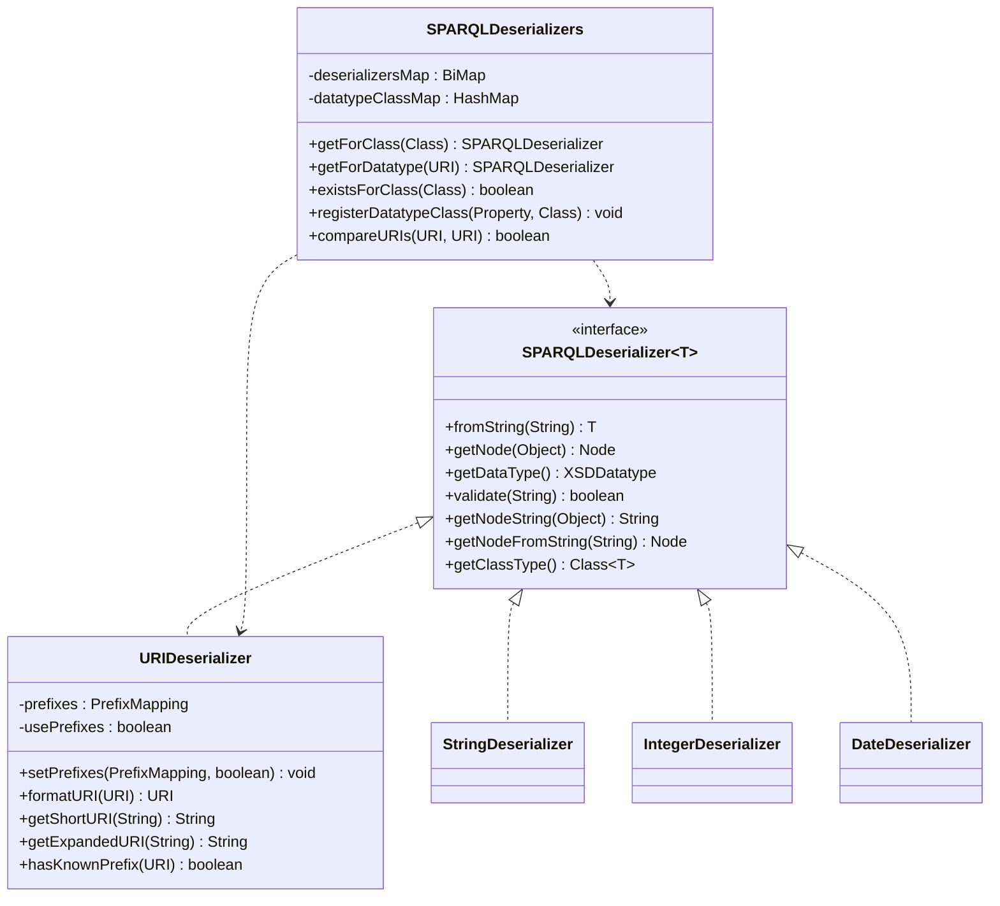
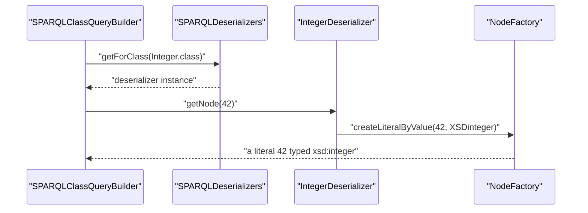
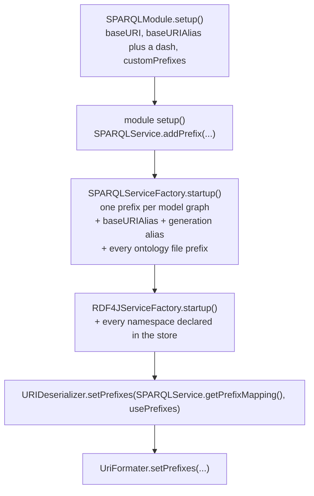
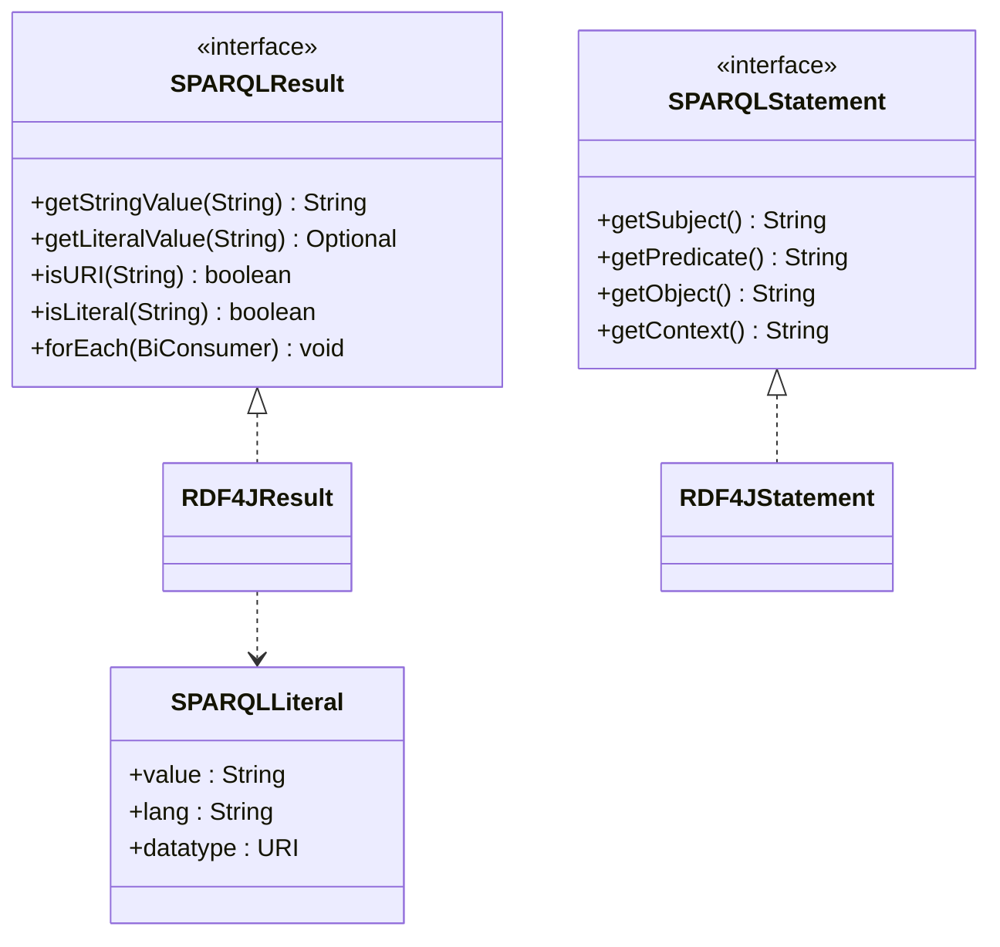

# Technical documentation : [`sparql`] The type system: deserializers, URIs and prefixes

**Document history (please add a line when you edit the document)**

| Date       | Editor(s)        | OpenSILEX version | Comment           |
|------------|------------------|-------------------|-------------------|
| 2026-09-11 | Arnaud Charleroy | BUILD-SNAPSHOT    | Document creation |
| 2026-09-13 | Arnaud Charleroy | BUILD-SNAPSHOT    | Review pass: corrected the generated-INSERT example for test model `A`, the `typeSubClassAny` call sites, the factory count and one line citation |

## Table of contents

<!-- TOC -->
- [Purpose](#purpose)
- [Key classes](#key-classes)
- [How it works](#how-it-works)
  - [The registry, step by step](#the-registry-step-by-step)
  - [Write path: Java value to Jena Node](#write-path-java-value-to-jena-node)
  - [Read path: lexical string to Java value](#read-path-lexical-string-to-java-value)
- [Built-in deserializers](#built-in-deserializers)
- [The XSD datatype to Java class map](#the-xsd-datatype-to-java-class-map)
- [Generated literals](#generated-literals)
- [URIDeserializer, prefixes and normalization](#urideserializer-prefixes-and-normalization)
  - [Where the prefix mapping comes from](#where-the-prefix-mapping-comes-from)
  - [SPARQLPrefixMapping.shortForm](#sparqlprefixmappingshortform)
  - [The formatting entry points](#the-formatting-entry-points)
  - [Comparing URIs, and why URIEquator exists](#comparing-uris-and-why-uriequator-exists)
  - [URI traps](#uri-traps)
- [SPARQLResult, SPARQLStatement, SPARQLLiteral](#sparqlresult-sparqlstatement-sparqlliteral)
- [Ontology: property paths and resource factories](#ontology-property-paths-and-resource-factories)
- [Silent failures and null returns](#silent-failures-and-null-returns)
- [Thread-safety](#thread-safety)
- [Extension points](#extension-points)
- [Gotchas and invariants](#gotchas-and-invariants)
- [See also](#see-also)
<!-- TOC -->

## Purpose

This subsystem is the ORM's answer to one question: *is this Java type a literal, and if so which
one?* A `SPARQLDeserializer<T>` converts one Java type to a Jena `Node` (write) and one lexical
string back to that Java type (read). The registry that holds them, `SPARQLDeserializers`, is
consulted by [SPARQLClassAnalyzer](../../../../../../../opensilex-sparql/src/main/java/org/opensilex/sparql/mapping/SPARQLClassAnalyzer.java)
at `SPARQLClassAnalyzer.java:276` and `:296` to decide whether an annotated field is a **data
property** or an **object property** — so the set of registered deserializers literally defines
what the ORM considers a literal. `URIDeserializer` is a member of that family but carries a second
job: it owns the global prefix mapping, and therefore every short/long URI decision in the whole
application.

## Key classes

| Class | File | Role |
|-------|------|------|
| `SPARQLDeserializer<T>` | [SPARQLDeserializer.java](../../../../../../../opensilex-sparql/src/main/java/org/opensilex/sparql/deserializer/SPARQLDeserializer.java) | The contract: `fromString`, `getNode`, `getDataType`, plus three default methods. |
| `SPARQLDeserializers` | [SPARQLDeserializers.java](../../../../../../../opensilex-sparql/src/main/java/org/opensilex/sparql/deserializer/SPARQLDeserializers.java) | Static registry (two maps) + the URI comparison/formatting helpers used everywhere. |
| `SPARQLDeserializerNotFoundException` | [SPARQLDeserializerNotFoundException.java](../../../../../../../opensilex-sparql/src/main/java/org/opensilex/sparql/deserializer/SPARQLDeserializerNotFoundException.java) | Checked exception, two constructors (by class, by datatype URI). |
| `URIDeserializer` | [URIDeserializer.java](../../../../../../../opensilex-sparql/src/main/java/org/opensilex/sparql/deserializer/URIDeserializer.java) | `URI` deserializer **and** holder of the static `PrefixMapping` + `usePrefixes` flag. |
| `StringDeserializer`, `BooleanDeserializer`, `ByteDeserializer`, `ShortDeserializer`, `IntegerDeserializer`, `LongDeserializer`, `BigIntegerDeserializer`, `FloatDeserializer`, `DoubleDeserializer`, `CharDeserializer` | same package | One primitive/wrapper type each. |
| `DateDeserializer`, `DateTimeDeserializer` | same package | `LocalDate` / `OffsetDateTime`. |
| `EmailDeserializer` | [EmailDeserializer.java](../../../../../../../opensilex-sparql/src/main/java/org/opensilex/sparql/deserializer/EmailDeserializer.java) | `javax.mail.internet.InternetAddress`; also extends Jackson's `JsonDeserializer`. |
| `SPARQLPrefixMapping` | [SPARQLPrefixMapping.java](../../../../../../../opensilex-sparql/src/main/java/org/opensilex/sparql/service/SPARQLPrefixMapping.java) | Jena `PrefixMappingImpl` with a cached map and a rewritten `shortForm`. |
| `SPARQLResult` | [SPARQLResult.java](../../../../../../../opensilex-sparql/src/main/java/org/opensilex/sparql/service/SPARQLResult.java) | One row of a SELECT, addressed by variable name. |
| `SPARQLLiteral` | [SPARQLLiteral.java](../../../../../../../opensilex-sparql/src/main/java/org/opensilex/sparql/service/SPARQLLiteral.java) | `record (String value, String lang, URI datatype)`. |
| `SPARQLStatement` | [SPARQLStatement.java](../../../../../../../opensilex-sparql/src/main/java/org/opensilex/sparql/service/SPARQLStatement.java) | One quad of a DESCRIBE/CONSTRUCT, as four strings. |
| `RDF4JResult`, `RDF4JStatement` | [RDF4JResult.java](../../../../../../../opensilex-sparql/src/main/java/org/opensilex/sparql/rdf4j/RDF4JResult.java), [RDF4JStatement.java](../../../../../../../opensilex-sparql/src/main/java/org/opensilex/sparql/rdf4j/RDF4JStatement.java) | The only implementations of the two interfaces above. |
| `URIEquator` | [URIEquator.java](../../../../../../../opensilex-sparql/src/main/java/org/opensilex/sparql/utils/URIEquator.java) | Apache Commons `Equator<URI>` delegating to `compareURIs`. |
| `Ontology` | [Ontology.java](../../../../../../../opensilex-sparql/src/main/java/org/opensilex/sparql/utils/Ontology.java) | Static Jena property paths (`rdfs:subClassOf*` and friends) and `Resource`/`Property` factories. |



## How it works

### The registry, step by step

`SPARQLDeserializers` holds two static maps and nothing else (`SPARQLDeserializers.java:32-70`):

1. `datatypeClassMap` (`:34`) — a plain `HashMap<String, Class<?>>` from **expanded** XSD datatype
   URI to Java class. It is filled by a static initializer (`:36-58`), so it is ready as soon as
   the class is loaded, and it is mutable at runtime through `registerDatatypeClass` (`:88`).
2. `deserializersMap` (`:32`) — a Guava `BiMap<Class<?>, SPARQLDeserializer<?>>`, **null until
   first use**. `getDeserializerMap()` (`:60-66`) lazily calls `buildDeserializersMap()`.

`buildDeserializersMap()` (`:118-134`) is a `ServiceLoader` scan:

```java
ServiceLoader.load(SPARQLDeserializer.class, OpenSilex.getClassLoader())
        .forEach(deserializers::add);
deserializersMap = HashBiMap.create(deserializers.size());
for (SPARQLDeserializer<?> deserializer : deserializers) {
    Class<?> key = parameterizedClass(deserializer, SPARQLDeserializer.class, 0);
    deserializersMap.put(key, deserializer);
}
```

`OpenSilex.getClassLoader()` is `Thread.currentThread().getContextClassLoader()`
(`OpenSilex.java:759`). The `META-INF/services/org.opensilex.sparql.deserializer.SPARQLDeserializer`
file is **not** in the sources: it is generated at build time by `serviceloader-maven-plugin`,
configured in `opensilex-sparql/pom.xml:61-77` for this module and in `opensilex-module/pom.xml:158-186`
for every downstream module. After a build, `opensilex-sparql/target/classes/META-INF/services/…`
lists the 14 implementations, in plugin scan order — not source order.

The map **key** is recovered by reflection: `parameterizedClass` (`:136-156`) walks
`root.getGenericInterfaces()`, finds the `ParameterizedType` whose raw type is
`SPARQLDeserializer`, and loads the class named by its first type argument. If it is not found on
the class itself it recurses through `root.getInterfaces()` — **never through the superclass
chain**. See [Extension points](#extension-points) for why that matters.

Lookups:

- `existsForClass(Class)` / `getForClass(Class)` (`:72-86`) — by Java type; `getForClass` throws
  `SPARQLDeserializerNotFoundException` when absent.
- `existsForDatatype(...)` / `getForDatatype(URI)` (`:92-109`) — by RDF datatype: the argument is
  run through `URIDeserializer.getExpandedURI` first, then `datatypeClassMap` gives a Java class,
  then `getForClass` gives the instance. So the datatype path is strictly a redirection onto the
  class path, and *the same instance* is returned for `xsd:int`, `xsd:integer` and
  `xsd:unsignedInt`.
- `getDeserializerClass(deserializer)` (`:111-116`) — the inverse direction, which is the only
  reason the map is a `BiMap`. It backs the `getClassType()` default method of the interface, used
  by [OwlRestrictionValidator](../../../../../../../opensilex-sparql/src/main/java/org/opensilex/sparql/owl/OwlRestrictionValidator.java)
  to decide the Java type of a validated relation (`OwlRestrictionValidator.java:297`).

### Write path: Java value to Jena Node



Real call sites: `SPARQLClassQueryBuilder.java:968` and `:1038` for field and list values,
`:1102` for a `SPARQLModelRelation` (`getForClass(relation.getType()).getNodeFromString(...)`),
`SPARQLQueryHelper.java:206`/`:326`/`:429` for filters and `VALUES` clauses, and
`SPARQLDeserializers.nodeURI(...)` wherever a bare IRI node is needed.

`getNodeFromString(String)` is the default composition `getNode(fromString(value))` (`:35-37` of
the interface) — parse then re-serialize. `URIDeserializer` overrides it to
`getNode(new URI(value))` (`URIDeserializer.java:34-37`), skipping the shortening that `fromString`
would do, because `getNode` expands again anyway.

### Read path: lexical string to Java value

A SELECT row arrives as a `SPARQLResult`; the mapper asks for the **variable named after the Java
field** and hands the raw string to the deserializer chosen from the **field type**, not from the
RDF datatype:

```java
// SPARQLClassObjectMapper.java:184-194
String strValue = result.getStringValue(field.getName());
if (strValue != null) {
    if (SPARQLDeserializers.existsForClass(field.getType())) {
        Object objValue = SPARQLDeserializers.getForClass(field.getType()).fromString(strValue);
        setter.invoke(instance, objValue);
    } else {
        //TODO change exception type
        throw new Exception("No deserializer for field: " + field.getName());
    }
}
```

[SparqlNoProxyFetcher](../../../../../../../opensilex-sparql/src/main/java/org/opensilex/sparql/mapping/SparqlNoProxyFetcher.java)
repeats the same block at `:100-110` (with `IllegalArgumentException` instead). The consequence is
central: **the datatype stored in the triple store is never consulted on read**. A field declared
`Integer` will be parsed with `Integer.valueOf` whatever the triple actually says, and a triple
typed `xsd:date` read into a `String` field yields the lexical form verbatim.

## Built-in deserializers

Fourteen implementations. "Guards empty" means `fromString("")` returns `null` instead of throwing.

| Java type | `getDataType()` | Class | Notes and edge cases |
|-----------|-----------------|-------|----------------------|
| `String` | `xsd:string` | `StringDeserializer` | `fromString` is the identity. `getNode` builds a **plain** literal (`NodeFactory.createLiteral(String)`) — never a language tag, never an explicit datatype. |
| `Boolean` | `xsd:boolean` | `BooleanDeserializer` | `Boolean.valueOf(value)`: anything other than `"true"` (case-insensitive) becomes `false`, silently. `validate` uses `XSDboolean.isValid`, which accepts `"0"`/`"1"` — so `"1"` validates then deserializes to `false`. |
| `Byte` | `xsd:byte` | `ByteDeserializer` | Guards empty. |
| `Short` | `xsd:short` | `ShortDeserializer` | **Does not** guard empty: `fromString("")` throws `NumberFormatException`, unlike every sibling. |
| `Integer` | `xsd:integer` | `IntegerDeserializer` | Guards empty. Note the datatype is `xsd:integer`, not `xsd:int` — an `Integer` field is written as an unbounded integer literal. |
| `Long` | `xsd:long` | `LongDeserializer` | Guards empty. |
| `BigInteger` | `xsd:integer` | `BigIntegerDeserializer` | Guards empty; builds the node through `NodeValueInteger`. Declares the *same* datatype as `IntegerDeserializer`, and `xsd:integer` maps to `Integer.class`, so this one is unreachable via `getForDatatype`. |
| `Float` | `xsd:float` | `FloatDeserializer` | Guards empty. Also the target of `xsd:decimal` (see next table) — decimal values are therefore narrowed to 32-bit float. |
| `Double` | `xsd:double` | `DoubleDeserializer` | Guards empty. |
| `Character` | `xsd:string` | `CharDeserializer` | `fromString` is `value.charAt(0)` — throws `StringIndexOutOfBoundsException` on `""`. `getNode` truncates to the first character and maps `null` to the empty literal. `validate` accepts `null` and any string of length 1 or more. |
| `LocalDate` | `xsd:date` | `DateDeserializer` | Accepts four patterns, tried in order: `yyyy-MM-d`, `yyyy/MM/d`, `d-MM-yyyy`, `d/MM/yyyy`. On total failure it re-parses with the first pattern so the thrown `DateTimeParseException` always names `yyyy-MM-d`, whatever the caller passed. Allocates four `DateTimeFormatter` per call. `getNode` is broken for `String` input (see Gotchas). |
| `OffsetDateTime` | `xsd:dateTime` | `DateTimeDeserializer` | Strictly `DateTimeFormatter.ISO_OFFSET_DATE_TIME` — a `dateTime` literal without an offset does not parse. `validate` is a try/catch around `fromString`. |
| `InternetAddress` | `xsd:string` | `EmailDeserializer` | Lower-cases on both directions. `getNode` emits a plain literal. Doubles as a Jackson `JsonDeserializer<InternetAddress>`, but nothing registers it on the Jackson side — `AccountAPI` parses emails by hand (`AccountAPI.java:105`), so that half is dead code. Backs `AccountModel.email`. |
| `URI` | `xsd:anyURI` | `URIDeserializer` | Its own section below. `getNode` produces an **IRI node**, not a literal, and always the expanded form. |

Three of the default methods of the interface are worth remembering:

- `validate(String)` defaults to `getDataType().isValid(value)` — Jena's XSD lexical check.
  `DateDeserializer`, `DateTimeDeserializer`, `CharDeserializer` and `URIDeserializer` override it.
- `getNodeString(Object)` is `getNode(value).toString()`, used nowhere in the module today.
- `getClassType()` is the reverse-map lookup described above.

## The XSD datatype to Java class map

`datatypeClassMap` (`SPARQLDeserializers.java:36-58`), keyed by the fully expanded datatype URI:

| Datatype URI | Java class | Comment |
|--------------|-----------|---------|
| `xsd:boolean` | `Boolean` | |
| `xsd:byte`, `xsd:unsignedByte` | `Byte` | `unsignedByte` ranges 0..255 and does not fit a signed `Byte`. |
| `xsd:short`, `xsd:unsignedShort` | `Short` | same narrowing problem. |
| `xsd:int`, `xsd:integer`, `xsd:unsignedInt`, `xsd:negativeInteger`, `xsd:nonNegativeInteger`, `xsd:positiveInteger`, `xsd:nonPositiveInteger` | `Integer` | `xsd:integer` is unbounded in XSD; `validate` accepts arbitrary precision (Jena's check) but `fromString` then throws `NumberFormatException`. |
| `xsd:long`, `xsd:unsignedLong` | `Long` | |
| `xsd:float`, `xsd:decimal` | `Float` | `xsd:decimal` is arbitrary precision in XSD. |
| `xsd:double` | `Double` | |
| `xsd:date` | `LocalDate` | |
| `xsd:dateTime` | `OffsetDateTime` | |
| `xsd:string` | `String` | |
| `xsd:anyURI` | `URI` | |

Notably **absent**: `xsd:time`, `xsd:duration`, `xsd:gYear`, `xsd:base64Binary`,
`xsd:normalizedString`, `xsd:token` and `rdf:langString`. A value whose declared range is one of
those is rejected by the OWL restriction validator with an "invalid datatype" error
(`OwlRestrictionValidator.java:306-309`), and an `owl:onDataRange` naming one is dropped from the
class model's datatype-property list (`OntologyDAO.java:406-410`).

`CoreModule` adds one entry: `SPARQLDeserializers.registerDatatypeClass(Oeso.longString, String.class)`
(`CoreModule.java:183`), which is how the custom `oeso:longString` datatype becomes usable in an
OWL restriction.

## Generated literals

Reconstructed from the `getNode` implementations, for the test model
[A](../../../../../../../opensilex-sparql/src/test/java/org/opensilex/sparql/model/A.java) which
declares one field per built-in type. The lexical form of numeric literals is whatever Jena's
`XSDDatatype` unparse produces:

`A` declares no `graph` on its `@SPARQLResource`, so there is no data graph of its own to wrap the
triples in:

```sparql
INSERT DATA {
  <http://opensilex.test/a/x> rdf:type      test:A ;
                              test:hasString   "some text" ;
                              test:hasChar     "V" ;
                              test:hasBoolean  "true"^^xsd:boolean ;
                              test:hasInt      "42"^^xsd:integer ;
                              test:hasLong     "82"^^xsd:long ;
                              test:hasShort    "0"^^xsd:short ;
                              test:hasByte     "3"^^xsd:byte ;
                              test:hasFloat    "45.0"^^xsd:float ;
                              test:hasDouble   "0.0"^^xsd:double ;
                              test:hasDate     "2026-03-07"^^xsd:date ;
                              test:hasDateTime "2026-03-07T10:15:30+01:00"^^xsd:dateTime .
}
```

The thing to read off this: `hasString` and `hasChar` are **plain** literals with no datatype and
no language tag (RDF 1.1 types them `xsd:string` implicitly). URI-valued fields are not in this
list because `A` declares none as a data property — its URI-valued mapped fields are the object
properties `a` (`hasRelationToA`) and `b` (`hasRelationToB`), whose values go through
`URIDeserializer.getNode` and come out as fully expanded IRIs even when the in-memory model held a
prefixed form.

## URIDeserializer, prefixes and normalization

### Where the prefix mapping comes from

The mapping lives in two static fields — `prefixes` and `usePrefixes` (`URIDeserializer.java:110-111`)
— shared by the whole JVM. `setPrefixes` (`:113-117`) also pushes them into
[UriFormater](../../../../../../../opensilex-main/src/main/java/org/opensilex/server/rest/serialization/uri/UriFormater.java),
the REST-layer twin used by `UriJsonDeserializer` so that a URI arriving in a JSON body is
normalized the same way. `UriFormater` duplicates the six formatting methods of `URIDeserializer`
almost line for line; the two copies exist because `opensilex-main` cannot depend on
`opensilex-sparql`.



Contributors, in lifecycle order:

1. `SPARQLService.getDefaultPrefixes()` (`SPARQLService.java:156-166`) seeds a static `HashMap` with
   exactly five entries: `rdfs`, `foaf`, `dc` (DCTerms), `owl`, `xsd`. **`rdf` is not among them.**
2. Module `setup()` methods add their vocabulary: `SPARQLService.addPrefix(Oeso.PREFIX, Oeso.NS)`
   and two more in `CoreModule.java:179-181`, `SecurityModule.java:98` for the security ontology.
3. `SPARQLServiceFactory.startup()` (`SPARQLServiceFactory.java:88-120`) adds one prefix per model
   graph (`baseURIAlias + mapper.getResourceGraphPrefix()` mapped to `graphNamespace + "#"`,
   `:94`), the platform `baseURIAlias`, the URI-generation alias, the configured
   `customPrefixes`, and the prefix of every `OntologyFileDefinition` declared by a
   `SPARQLExtension`. Note `SPARQLModule.setup()` appends a `-` to the configured alias
   (`SPARQLModule.java:68`), so a `baseURIAlias: test` yields graph prefixes like `test-set`.
4. `RDF4JServiceFactory.startup()` (`RDF4JServiceFactory.java:100-113`) adds every namespace the
   repository itself declares, then calls `setPrefixes` again. This is where `rdf` usually enters —
   from the store's namespace table, not from OpenSILEX. It is wrapped in a `catch (RepositoryException ignored)`
   because there is no repository during Swagger generation.
5. `shutdown()` calls `SPARQLService.clearPrefixes()` and `URIDeserializer.clearPrefixes()`
   (`SPARQLServiceFactory.java:124-127`), which resets `prefixes` to `null` and `usePrefixes` to
   `false`.

Everything is gated by the `usePrefixes` config flag (`SPARQLConfig.java:42-46`, default `true`,
under the `ontologies:` config key). When it is `false`, `formatURI` **expands** instead of
shortening: the flag chooses which of the two canonical forms the application uses in memory.

### SPARQLPrefixMapping.shortForm

`SPARQLService.getPrefixMapping()` (`SPARQLService.java:178-180`) returns a **new**
`SPARQLPrefixMapping` on every call, built from the static prefix map. `SPARQLPrefixMapping`
overrides two methods of Jena's `PrefixMappingImpl`:

- `setNsPrefixes(Map)` also stores the result of `getNsPrefixMap()` into `cachedPrefixMap`.
- `shortForm(String uri)` (`:32-61`) iterates that cached map, keeps every prefix whose namespace
  is a `startsWith` match, and returns the one leaving the **shortest local part** — i.e. the
  longest matching namespace. Ties keep the first candidate found, which is `HashMap` iteration
  order. If nothing matches, the URI is returned unchanged.

The comment at `:37` states the reason for the override: the base implementation calls
`getNsPrefixMap()`, which copies the map on every call.

`expandPrefix` is inherited unchanged: it turns `prefix:local` into `namespace + local` when the
prefix is known, and returns its input untouched otherwise.

### The formatting entry points

| Method | `prefixes == null` | `usePrefixes == true` | `usePrefixes == false` | On `URISyntaxException` |
|--------|--------------------|-----------------------|------------------------|--------------------------|
| `fromString(String)` (`:26`) | raw `new URI(value)` | short form | **raw `new URI(value)`** (the `!usePrefixes` guard short-circuits) | propagates |
| `formatURI(URI)` (`:39`) | returns the argument | short form | expanded | returns `null` |
| `formatURI(String)` (`:56`) | **NPE** (no guard) | short form | expanded | returns `null` |
| `formatURIAsStr(String)` (`:73`) | **NPE** (no guard) | short form | expanded | n/a (returns a `String`) |
| `getShortURI(String)` (`:81`) | returns the argument | short form | short form | n/a |
| `getExpandedURI(String)` (`:95`) | returns the argument | expanded | expanded | n/a |
| `getNode(Object)` (`:103`) | `createURI(value.toString())` | **expanded** IRI node | expanded IRI node | n/a |

Read that table twice. Three facts follow from it:

- `fromString` and `formatURI` **disagree** when `usePrefixes` is `false`: `fromString` leaves the
  URI alone, `formatURI` expands it.
- `getNode` always expands, so the store only ever sees long IRIs while the models in memory hold
  whatever `formatURI` produced. That asymmetry is deliberate and is the whole reason the
  comparison helpers exist.
- The `String` overloads have no null-prefix guard. `AbstractOntologyStore.java:61-62` calls
  `URIDeserializer.formatURI(String)` in **static field initializers**; loading that class before
  the factory has called `setPrefixes` throws inside the static block.

`validate(String)` is overridden to `validateURI` (`:139-149`): `null` is **valid**, and a
non-null value must parse *and* be absolute. A prefixed form such as `test:unknownUri1` is
absolute in `java.net.URI` terms (it has a scheme), which is why it passes — see
`SPARQLServiceTest.testUriListExistsNone`.

`hasKnownPrefix(URI)` (`:159-164`) answers "does the mapping know this namespace?" by comparing the
expanded and the short form: if they are equal, neither direction matched.

### Comparing URIs, and why URIEquator exists

Because a URI can be in memory in either form, `URI.equals` is useless across layers. The whole
codebase therefore compares through `SPARQLDeserializers`:

```java
// SPARQLDeserializers.java:235-253
public static boolean compareURIs(String uri1, String uri2) {
    return getExpandedURI(uri1).equals(getExpandedURI(uri2));
}
public static boolean containsURI(Collection<URI> uris, URI uri) {
    return uris.stream().anyMatch(u -> compareURIs(u, uri));
}
```

Four overloads cover every `String`/`URI` combination, all normalizing to the **expanded** form.
`containsURI` is a linear scan that expands both sides for every element.

`URIEquator` lifts that into the Apache Commons `Equator<URI>` interface so that collection
comparisons work:

```java
// real usage, AnnotationAccessAPITest.java:154-158
assertTrue(CollectionUtils.isEqualCollection(
        List.of(publicAnnotationUri),
        annotationUris,
        new URIEquator()
));
```

Its two methods normalize differently on purpose and by accident: `equate` delegates to
`compareURIs` (expanded form), `hash` returns `SPARQLDeserializers.formatURI(uri).hashCode()`
(short form when `usePrefixes` is `true`). Both are deterministic functions of the expanded form,
so the `Equator` contract holds — but `hash` inherits `formatURI`'s ability to return `null`, and
then throws `NullPointerException`.

### URI traps

- **Trailing slash.** `http://ex.org/ns` and `http://ex.org/ns/` are different strings, expand to
  different strings, and therefore never compare equal. The prefix match in `shortForm` is a plain
  `startsWith`, so registering a namespace without its terminating `/` or `#` produces short forms
  whose local part begins with the separator.
- **Case.** Every comparison ends in `String.equals`. `HTTP://Ex.org/x` and `http://ex.org/x` are
  different URIs to this code, even though they are the same resource per RFC 3986.
- **Short versus long form.** A model's `getUri()` is short when `usePrefixes` is `true`; a URI that
  came from a DESCRIBE statement, from `getNode`, or from `getExistingUris` is expanded. Never use
  `equals`, `List.contains`, `Map.get` or `Set.contains` on URIs that crossed that boundary —
  `SPARQLServiceTest.testUriListExistsAll` has to write
  `new URI(SPARQLDeserializers.getExpandedURI(uri))` before calling `existingUris.contains(...)`.
- **`null` is not handled uniformly.** `URIDeserializer.getExpandedURI(URI)` guards `null`
  (`:88-93`), but `SPARQLDeserializers.getExpandedURI(URI)` does not — it calls `value.toString()`
  directly (`:199-201`). So `SPARQLDeserializers.compareURIs(null, someUri)` throws
  `NullPointerException` while `URIDeserializer.getExpandedURI(null)` returns `null`.
- **Prefix set depends on the triple store.** Because step 4 above imports the repository's
  namespaces, the same URI can shorten differently on two installations, and `rdf:type` passed
  through `getNode` becomes the bare IRI `<rdf:type>` if the store declares no `rdf` namespace.

## SPARQLResult, SPARQLStatement, SPARQLLiteral

These three interfaces are the ORM's insulation from the triple-store client. Everything above the
`SPARQLConnection` boundary speaks them; only the `rdf4j` package knows about RDF4J's
`BindingSet` and `Statement`.



- `SPARQLResult` is one SELECT row, addressed by variable name (which, per doc
  [Query generation](./03-query-generation.md), is the Java field name). `getStringValue` returns
  `Value::stringValue` or `null` for an unbound variable (`RDF4JResult.java:33-37`) — the
  **lexical form only**: the datatype and the language tag are dropped. That is why the read path
  picks its deserializer from the Java field type.
- `getLiteralValue` (`:40-51`) is the only way to recover the full literal, as a `SPARQLLiteral`
  record; it returns `Optional.empty()` for an unbound or non-literal binding. `isURI` and
  `isLiteral` (`:54-65`) answer the node-kind question, defaulting to `false` when unbound.
- `forEach(BiConsumer<String, String>)` iterates `(variable name, lexical value)` pairs for callers
  that do not know the column set statically; `RDF4JResult` implements it over
  `BindingSet.forEach` (`:68-71`). Note that `bind.getValue().stringValue()` is called
  unconditionally, so an unbound binding would NPE — RDF4J's `BindingSet` only iterates bound
  bindings, which is why it does not.
- **Four of the five `SPARQLResult` methods have no caller in the repository today**:
  `getLiteralValue`, `isURI`, `isLiteral` and `forEach`. Everything reads rows through
  `getStringValue`. Treat the other four as untested API surface.
- `SPARQLStatement` is one quad from a DESCRIBE, CONSTRUCT or whole-graph read, as four plain
  strings. `RDF4JStatement.getObject()` is `statement.getObject().stringValue()`, so a statement
  cannot distinguish the literal `"42"` from the IRI `<http://…/42>` and cannot report a datatype
  at all. `getContext()` returns `null` for a triple in the default graph.
  [SPARQLProxyRelationList](../../../../../../../opensilex-sparql/src/main/java/org/opensilex/sparql/mapping/SPARQLProxyRelationList.java)
  is the main consumer: it turns each statement into a `SPARQLModelRelation`, detecting reverse
  relations by `compareURIs(uri, statement.getObject())` (`:55`).
- Both are materialized, never streamed. `RDF4JConnection.bindingSetsToSPARQLResultList`
  (`RDF4JConnection.java:349-363`) calls the caller's `resultHandler` row by row **and** keeps
  every row in an `ArrayList` it returns, so passing a consumer does not bound memory.

## Ontology: property paths and resource factories

[Ontology](../../../../../../../opensilex-sparql/src/main/java/org/opensilex/sparql/utils/Ontology.java)
is an abstract class used purely as a namespace. It holds four Jena `Path` constants, built once in
a static block (`:33-38`):

| Constant | SPARQL equivalent | Used by |
|----------|-------------------|---------|
| `subClassAny` | `rdfs:subClassOf*` | the type clause of every generated SELECT (`SPARQLClassQueryBuilder.java:296`), `SPARQLListFetcher.java:310`, most of `OntologyDAO`, `SparqlMultiGraphQuery.java:167` |
| `typeSubClassAny` | `rdf:type/rdfs:subClassOf*` | `getFavoriteRdfTypeFromURI` (`SPARQLService.java:2633`), `OrganizationDAO.java:108`, `FacilityDAO.java:178`, `ExperimentDAO.java:784`, `Faidarev1StudyDTOBuilder.java:163`. Note this is *not* how `getRdfTypes` (`SPARQLService.java:2421`) works — that one uses plain `rdf:type` |
| `subClassStrict` | `rdfs:subClassOf+` | `ScientificObjectDAO.java:975`, `MetricDAO.java:494` — proper subclasses only |
| `subPropertyAny` | `rdfs:subPropertyOf*` | `GermplasmSparqlDAO.java:222-226`, `:423` |

Plus `Ontology.SPARQLResourceModel`, a pseudo-resource
`https://www.opensilex.org/abstract#SPARQLResourceModel` used as the RDF type placeholder of the
abstract base model, and the five `resource(...)` / `property(...)` factories that wrap
`ResourceFactory`. `Ontology.property(String)` is how `SPARQLProxyRelationList` and
`SparqlSchemaNode` turn a predicate string from a statement back into a Jena `Property`.

## Silent failures and null returns

Every place in scope where a type-system failure does not reach the caller:

| Location | What is swallowed | Result |
|----------|-------------------|--------|
| `SPARQLDeserializers.java:163-168` `nodeOffsetDateTime` | any `Exception` | returns `null` — a `null` Jena `Node` handed to a query builder |
| `SPARQLDeserializers.java:171-177` `nodeURI(URI)` | any `Exception` | returns `null` |
| `SPARQLDeserializers.java:179-185` `nodeURI(String)` | any `Exception` | returns `null` |
| `SPARQLDeserializers.java:187-193` `nodeURI(Property)` | `URISyntaxException` | returns `null` |
| `SPARQLDeserializers.java:130-132` `buildDeserializersMap` | `ClassNotFoundException` | logs `"should never happend"`, the deserializer is skipped |
| `SPARQLDeserializers.java:215-221` `formatURI(String)` | `URISyntaxException` | returns the input unchanged (so the *string* overload fails soft where the `URI` overload returns `null`) |
| `URIDeserializer.java:49-53` and `:66-70` `formatURI` | `URISyntaxException` | returns `null`; the code says `// TODO log error` and logs nothing |
| `URIDeserializer.java:143-148` `validateURI` | any `Exception` | returns `false` |
| `SPARQLDeserializer.java:22-26` default `validate` | any `Exception` | returns `false` |
| `SPARQLProxyListData.java:62-66` | any `Exception` from `fromString` | logs a warning, **drops that element** from the list |
| `SPARQLClassAnalyzer.java:711-748` `getFieldDatatype`, `getFieldListDatatype` | `SPARQLDeserializerNotFoundException` | logs an error, returns `null` datatype |
| `OntologyDAO.java:472-480` | `SPARQLDeserializerNotFoundException` | logs `"should never happend"`, the relation is reported invalid |
| `RDF4JServiceFactory.java:111-113` | `RepositoryException` | store namespaces are not imported and `setPrefixes` is never reached on that path |

`nodeURI` returning `null` is the one to watch: it is called several hundred times across the
codebase, usually inline inside a `SelectBuilder`/`UpdateBuilder` call, and a `null` node surfaces
much later as a confusing Jena error or as a query that quietly matches nothing.

## Thread-safety

Neither map is synchronized, and both are static.

- `datatypeClassMap` is a plain `HashMap` filled by a static initializer, so it is safely published
  for readers. `registerDatatypeClass` mutates it afterwards. In practice the only caller is
  `CoreModule.setup()`, which runs single-threaded during startup, so the unsynchronized write
  never races a read. A module that called it from a REST handler would be corrupting a `HashMap`
  under concurrent readers.
- `deserializersMap` is lazily initialized with no lock and stored in a **non-volatile** field
  (`SPARQLDeserializers.java:32`, `:60-66`, `:112-114`). Two threads racing on the first call can
  both run `buildDeserializersMap`, and a thread can observe a non-null but still-incomplete map,
  in which case `existsForClass` returns `false` and `getForClass` throws
  `SPARQLDeserializerNotFoundException` for a type that is in fact registered. What saves it today
  is that the first touch happens during single-threaded startup:
  `SPARQLServiceFactory.startup()` builds the `SPARQLClassObjectMapperIndex`, whose
  `SPARQLClassObjectMapper` constructor calls
  `SPARQLDeserializers.getForClass(OffsetDateTime.class)` (`SPARQLClassObjectMapper.java:88`). The
  registry is therefore always warm before the first request. Do not rely on that if you move the
  index construction.
- `URIDeserializer.prefixes` / `usePrefixes` are static, mutable, non-volatile and rewritten
  several times during startup. They make **one prefix mapping per JVM** a hard architectural
  limit: two SPARQL repositories with different base URIs cannot coexist in one process. The code
  that does need a foreign mapping —
  [SharedResourceInstanceService](../../../../../../../opensilex-core/src/main/java/org/opensilex/core/external/opensilex/SharedResourceInstanceService.java)
  at `:165` — builds its own `SPARQLPrefixMapping` instance and never touches the static one.
- `SPARQLService.prefixes` is a static `HashMap` too, and `getPrefixMapping()` builds a fresh
  `SPARQLPrefixMapping` from it on every call — including once per generated query, since
  `addPrefixes(builder)` calls it (`SPARQLService.java:183-188`).

## Extension points

**Register a new deserializer.** Implement `SPARQLDeserializer<T>` in your module; the
`serviceloader-maven-plugin` execution inherited from `opensilex-module/pom.xml:158-186` generates
the `META-INF/services` entry at build time — there is nothing to declare by hand. Two constraints:

1. Your class must declare the parameterized interface **directly** (or on an interface it
   implements). `parameterizedClass` never walks the superclass chain, so
   `class MyDeser extends AbstractBase` where only `AbstractBase implements SPARQLDeserializer<Foo>`
   resolves to a `null` key; Guava's `HashBiMap` accepts it, the deserializer is inserted under
   `null`, and `getForClass(Foo.class)` still throws. Write
   `class MyDeser extends AbstractBase implements SPARQLDeserializer<Foo>`.
2. A key collision is silent. Two deserializers claiming the same Java type both `put` on the same
   key; the last one in `ServiceLoader` order wins, and that order is the generated services file,
   which is plugin scan order. Registering a second deserializer for `URI` to "customize URI
   handling" is a coin flip, not an override.

Once registered, a field of that type becomes a legal `@SPARQLProperty` data property —
`SPARQLClassAnalyzer.java:276`/`:296` tests `existsForClass` *before* the mapper index, so a
deserializer registered for a class that is also a `SPARQLResourceModel` would turn that field into
a data property.

**Register a custom RDF datatype.** `SPARQLDeserializers.registerDatatypeClass(Property, Class)`
maps an arbitrary datatype URI onto an existing deserializer. Call it from your module's `setup()`,
as `CoreModule.java:183` does for `oeso:longString`. This is the hook that makes an
`owl:onDataRange` restriction validate against a non-XSD datatype.

**Add prefixes.** Three ways, in increasing order of locality: the `customPrefixes` map in the
`ontologies:` config block, the `prefix`/`prefixUri` of an `OntologyFileDefinition` returned by
your `SPARQLExtension`, or a direct `SPARQLService.addPrefix(prefix, namespace)` in your module's
`setup()`. In all three cases the mapping only reaches `URIDeserializer` when
`SPARQLServiceFactory.startup()` re-runs `setPrefixes`, so adding a prefix after startup has no
effect on URI formatting until the next `setPrefixes` call.

**Support another triple store.** Implement `SPARQLResult` and `SPARQLStatement` over your client's
row and statement types, plus `SPARQLConnection`. `RDF4JResult`/`RDF4JStatement` are 76 and 47
lines respectively and are the whole of the adapter for the result side.

## Gotchas and invariants

- **`DateDeserializer.getNode` cannot accept a `String`.** The body is
  `LocalDate date = (LocalDate) value; if (value instanceof String) { date = fromString(...); }`
  (`DateDeserializer.java:53-60`). The cast executes first, so a `String` argument throws
  `ClassCastException` and the `instanceof String` branch is unreachable. The intent was clearly
  the opposite. Callers must go through `getNodeFromString`.
- **`validate` and `fromString` do not agree.** `validate` defaults to Jena's lexical check on the
  declared XSD type, `fromString` to a `java.lang` parser. `"1"` validates as `xsd:boolean` and
  deserializes to `false`; `"99999999999999999999"` validates as `xsd:integer` and then throws
  `NumberFormatException` in `Integer.valueOf`. Anything that validates a CSV cell or an OWL
  restriction value (see [CSV pipeline](./11-csv-pipeline.md)) inherits this gap.
- **`getForClass(null)` throws `NullPointerException`, not `SPARQLDeserializerNotFoundException`.**
  `existsForClass(null)` is a legal `HashBiMap` lookup returning `false`, and then the exception
  constructor calls `clazz.getCanonicalName()` (`SPARQLDeserializerNotFoundException.java:22`).
  This is reachable: `SPARQLModelRelation.type` defaults to `null`, and
  `SPARQLProxyRelationList.loadData` never sets it — relations rebuilt from a `describe()` carry a
  value and a property but no Java type, so re-inserting such a model through
  `SPARQLClassQueryBuilder.addRelationsQuads` (`:1102`) fails with an NPE rather than a typed error.
- **Relation values lose their datatype on a read-modify-write round trip.** `SPARQLStatement`
  exposes only the lexical form, so the datatype a relation was stored with cannot be recovered;
  the write path re-types it from `relation.getType()`. See [metadata](../metadata.md) for what
  that means for `SPARQLModelRelation`.
- **`URIDeserializer.formatURI(String)` and `formatURIAsStr(String)` NPE before startup.** Neither
  has the `prefixes == null` guard that the `URI` overload has (`:56-79`). Any static initializer
  that calls them — `AbstractOntologyStore.java:61-62` does — is order-dependent on
  `setPrefixes`.
- **`CoreModule.setup()` hard-codes `usePrefixes = true`.** `URIDeserializer.setPrefixes(SPARQLService.getPrefixMapping(), true)`
  at `CoreModule.java:182` ignores the configuration. It is corrected later by
  `SPARQLServiceFactory.startup()` (`:120`), which passes the real `sparqlConfig.usePrefixes()`.
  Anything that formats a URI between those two points uses the wrong mode.
- **`SPARQLPrefixMapping.cachedPrefixMap` is only refreshed by `setNsPrefixes(Map)`.** Calling the
  inherited `setNsPrefix(prefix, uri)` on an existing instance updates the parent's state but not
  the cache, so `shortForm` ignores the new prefix; and calling `shortForm` on an instance that
  never received `setNsPrefixes` throws `NullPointerException` on the `map.keySet()` at `:39`.
  `SPARQLService.getPrefixMapping()` always chains the two calls, which is what keeps this safe.
- **`xsd:decimal` narrows to `Float` and `xsd:integer` narrows to `Integer`.** Both are
  arbitrary-precision types in XSD. A store holding `"3.14159265358979"^^xsd:decimal` returns a
  `Float` through the datatype path. `BigIntegerDeserializer` exists but is unreachable from
  `getForDatatype` because `xsd:integer` is already claimed by `Integer.class`.
- **Unsigned XSD types map to signed Java types.** `xsd:unsignedByte` to `Byte`,
  `xsd:unsignedShort` to `Short`, `xsd:unsignedInt` to `Integer`, `xsd:unsignedLong` to `Long`. The
  top half of each unsigned range overflows.
- **The `META-INF/services` file is generated, not committed.** If you run OpenSILEX from
  freshly-compiled classes without the `serviceloader-maven-plugin` having run, `ServiceLoader`
  finds nothing, `deserializersMap` is empty, and every annotated model fails class analysis with
  `SPARQLInvalidClassDefinitionException: Field … has an unsupported type`. The cause is a missing
  generated resource, not a broken model.
- **`String` fields never carry a language tag.** `StringDeserializer.getNode` emits a plain
  literal. Multilingual values must use `SPARQLLabel`, which the analyzer routes outside the
  deserializer registry entirely (`SPARQLClassAnalyzer.java:294-295`). Doc
  [Query generation](./03-query-generation.md) documents the read-side consequence.
- **`isURI`, `isLiteral`, `getLiteralValue` and `forEach` are unused.** They are part of
  `SPARQLResult` and implemented by `RDF4JResult`, but no caller exists in `opensilex-sparql`,
  `opensilex-core`, `opensilex-security` or `opensilex-phis`. Only `getStringValue` is exercised.
- **`EmailDeserializer`'s Jackson half is dead.** It extends `JsonDeserializer<InternetAddress>`,
  but nothing registers it with an `ObjectMapper` and no field carries
  `@JsonDeserialize(using = EmailDeserializer.class)`. Its private inner exception class
  `EmailDeserializationException` is consequently never thrown.

## See also

- [ORM architecture overview](../orm-architecture.md) — where this subsystem sits.
- [Annotations and class analysis](./01-annotations-and-class-analysis.md) — how `existsForClass`
  decides data property versus object property.
- [Query generation](./03-query-generation.md) — where `getNode` and `getNodeFromString` are called
  and what the resulting SPARQL looks like.
- [Proxies and lazy loading](./04-proxies-and-lazy-loading.md) — `SPARQLProxyListData` and the
  swallowed `fromString` failure.
- [SPARQLService CRUD](./05-sparql-service-crud.md) — the `SPARQLResult` consumers.
- [Transactions, URI generation and validation](./06-transactions-uri-and-validation.md) — URI
  generation, which produces the URIs this document normalizes.
- [Ontology store and OWL](./09-ontology-store-and-owl.md) — `getForDatatype` and
  `OwlRestrictionValidator`.
- [Connection and lifecycle](./10-connection-and-lifecycle.md) — `SPARQLServiceFactory` /
  `RDF4JServiceFactory` startup, where `setPrefixes` is called.
- [Graph organization](../graph-organization.md) — the graph namespaces that become prefixes.
- [Metadata and SPARQLModelRelation](../metadata.md) — untyped relation values.
