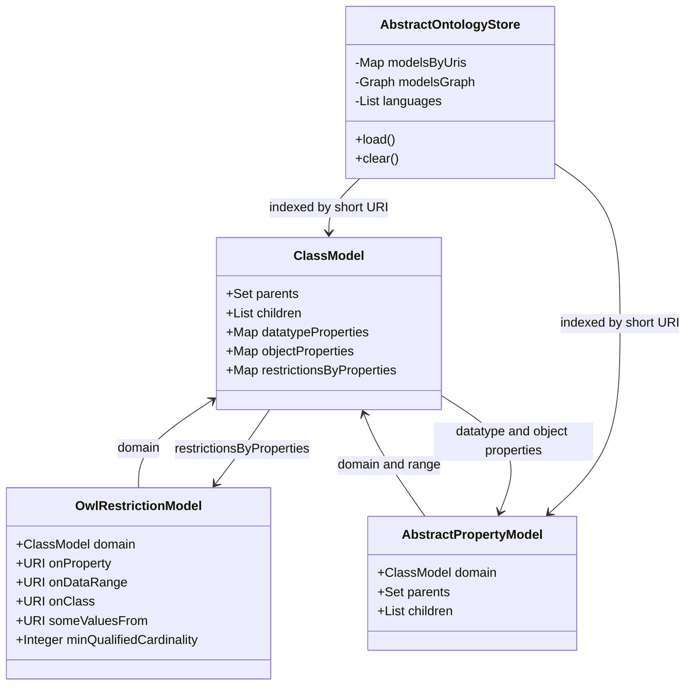
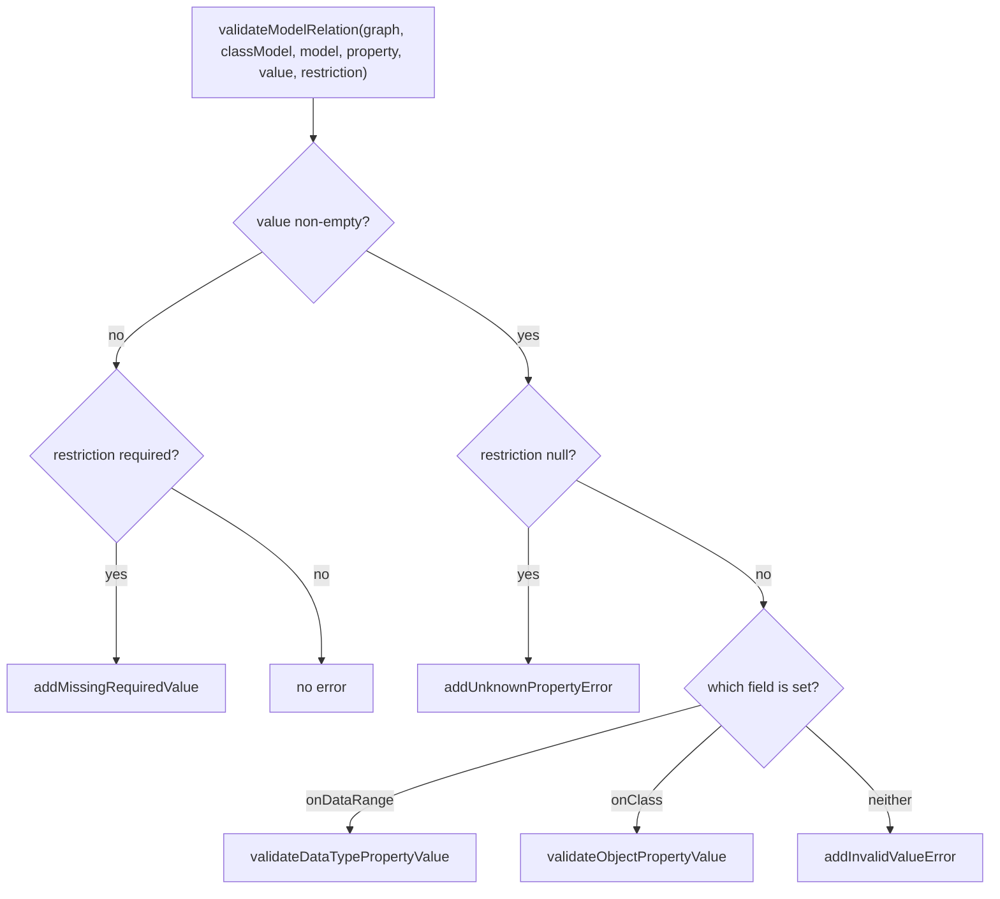
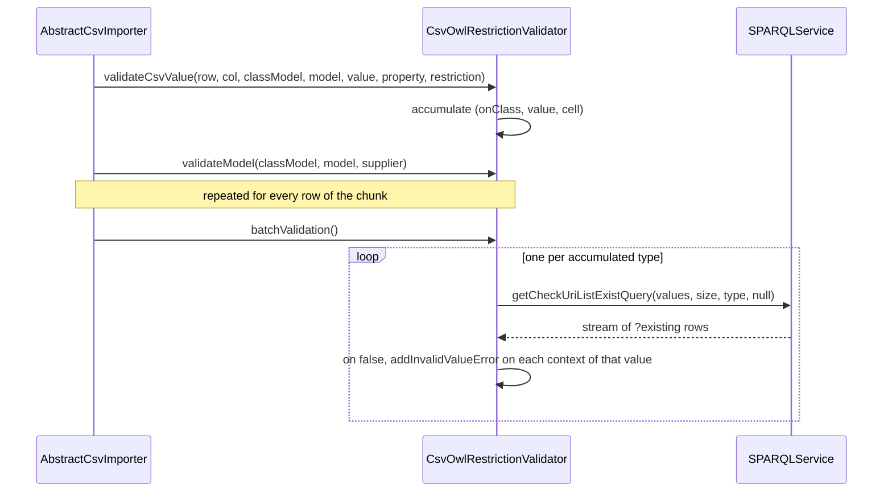

# Technical documentation : [`sparql`] Ontology store and OWL restriction validation

**Document history (please add a line when you edit the document)**

| Date       | Editor(s)        | OpenSILEX version | Comment           |
|------------|------------------|-------------------|-------------------|
| 2026-09-11 | Arnaud Charleroy | BUILD-SNAPSHOT    | Document creation |

## Table of contents

<!-- TOC -->
- [Purpose](#purpose)
- [Key classes](#key-classes)
- [How the store is loaded](#how-the-store-is-loaded)
  - [The three loading queries](#the-three-loading-queries)
  - [Row folding](#row-folding)
  - [Wiring the object graph](#wiring-the-object-graph)
- [In-memory data structures](#in-memory-data-structures)
- [Queries answered without touching the triple store](#queries-answered-without-touching-the-triple-store)
  - [Ancestor lookups](#ancestor-lookups)
  - [Inheritance and the ancestor parameter](#inheritance-and-the-ancestor-parameter)
  - [Language handling](#language-handling)
- [Default vs No implementation, and the config flag](#default-vs-no-implementation-and-the-config-flag)
- [Reload semantics and memory footprint](#reload-semantics-and-memory-footprint)
- [Does the code still match the pre-existing note?](#does-the-code-still-match-the-pre-existing-note)
- [What OntologyDAO still queries directly](#what-ontologydao-still-queries-directly)
- [OWL restriction validation](#owl-restriction-validation)
  - [From OwlRestrictionModel to a check](#from-owlrestrictionmodel-to-a-check)
  - [The validation flow](#the-validation-flow)
  - [Batch validation](#batch-validation)
  - [Rules actually enforced](#rules-actually-enforced)
- [The SHACL utility](#the-shacl-utility)
- [Extension points](#extension-points)
- [Gotchas and invariants](#gotchas-and-invariants)
- [See also](#see-also)
<!-- TOC -->

## Purpose

Everything else in this module maps *Java classes* declared at compile time to RDF. This subsystem
maps the *runtime vocabulary*: the `owl:Class`, `owl:DatatypeProperty`, `owl:ObjectProperty` and
`owl:Restriction` triples an instance of OpenSILEX actually contains, including the ones a user
created through the web client. Two layers do the work — an in-RAM store
([OntologyStore](../../../../../../../opensilex-sparql/src/main/java/org/opensilex/sparql/ontology/store/OntologyStore.java))
answering schema questions without a SPARQL round-trip, and a validator
([OwlRestrictionValidator](../../../../../../../opensilex-sparql/src/main/java/org/opensilex/sparql/owl/OwlRestrictionValidator.java))
turning the OWL restrictions the store holds into per-value checks during import. A DAO
([OntologyDAO](../../../../../../../opensilex-sparql/src/main/java/org/opensilex/sparql/ontology/dal/OntologyDAO.java))
sits underneath for what the store cannot answer: every write, and every question about instances
rather than about the vocabulary. Schema reads go to RAM, schema writes go to SPARQL, and after each
write the caller reloads the entire store — nothing is invalidated incrementally.

## Key classes

| Class | File | Role |
|-------|------|------|
| `OntologyStore` | [OntologyStore.java](../../../../../../../opensilex-sparql/src/main/java/org/opensilex/sparql/ontology/store/OntologyStore.java) | The read contract: 11 abstract methods plus 4 defaults (`reload`, `getOwlRestrictionsUris`, `getDataProperty`, `getObjectProperty`). Read-only — no write method. |
| `AbstractOntologyStore` | [AbstractOntologyStore.java](../../../../../../../opensilex-sparql/src/main/java/org/opensilex/sparql/ontology/store/AbstractOntologyStore.java) | The in-RAM implementation: owns `modelsByUris`, `modelsGraph`, the language list and the four synthetic root models. 614 lines. |
| `DefaultOntologyStore` | [DefaultOntologyStore.java](../../../../../../../opensilex-sparql/src/main/java/org/opensilex/sparql/ontology/store/DefaultOntologyStore.java) | 28 lines. Picks the containers: `PatriciaTrie` index, `SimpleDirectedGraph` hierarchy. |
| `NoOntologyStore` | [NoOntologyStore.java](../../../../../../../opensilex-sparql/src/main/java/org/opensilex/sparql/ontology/store/NoOntologyStore.java) | Same interface, every call forwarded to `OntologyDAO`. `load()` and `clear()` are no-ops. |
| `OntologyStoreLoader` | [OntologyStoreLoader.java](../../../../../../../opensilex-sparql/src/main/java/org/opensilex/sparql/ontology/store/OntologyStoreLoader.java) | Package-private. Three bulk queries plus the result-to-model folding. 422 lines. |
| `OntologyDAO` | [OntologyDAO.java](../../../../../../../opensilex-sparql/src/main/java/org/opensilex/sparql/ontology/dal/OntologyDAO.java) | SPARQL-backed vocabulary DAO: all CRUD on classes / properties / restrictions plus instance-level helpers. 1134 lines. |
| `ClassModel` | [ClassModel.java](../../../../../../../opensilex-sparql/src/main/java/org/opensilex/sparql/ontology/dal/ClassModel.java) | `@SPARQLResource(owl:Class)`. Adds three maps to the tree model: `datatypeProperties`, `objectProperties`, `restrictionsByProperties`. |
| `PropertyModel` | [PropertyModel.java](../../../../../../../opensilex-sparql/src/main/java/org/opensilex/sparql/ontology/dal/PropertyModel.java) | Tiny interface: `getUri`, `getName`, `getDomain`, `getRangeURI`, `getTypeRestriction`. |
| `AbstractPropertyModel` | [AbstractPropertyModel.java](../../../../../../../opensilex-sparql/src/main/java/org/opensilex/sparql/ontology/dal/AbstractPropertyModel.java) | Holds the `rdfs:domain` field and the `typeRestriction` scratch field; declares `DOMAIN_FIELD` / `RANGE_FIELD`. |
| `DatatypePropertyModel` | [DatatypePropertyModel.java](../../../../../../../opensilex-sparql/src/main/java/org/opensilex/sparql/ontology/dal/DatatypePropertyModel.java) | `@SPARQLResource(owl:DatatypeProperty)`. Its `range` is a `URI` (an XSD datatype). |
| `ObjectPropertyModel` | [ObjectPropertyModel.java](../../../../../../../opensilex-sparql/src/main/java/org/opensilex/sparql/ontology/dal/ObjectPropertyModel.java) | `@SPARQLResource(owl:ObjectProperty)`. Its `range` is a `ClassModel`. |
| `OwlRestrictionModel` | [OwlRestrictionModel.java](../../../../../../../opensilex-sparql/src/main/java/org/opensilex/sparql/ontology/dal/OwlRestrictionModel.java) | `@SPARQLResource(owl:Restriction, allowBlankNode = true)`. Eight mapped fields plus `isList`, `isOptional`, `isRequired`, `getSubjectURI`. |
| `URITypesModel` | [URITypesModel.java](../../../../../../../opensilex-sparql/src/main/java/org/opensilex/sparql/ontology/dal/URITypesModel.java) | Plain `SPARQLModel` pair: one URI, the list of types found for it. Not annotated, never persisted. |
| `ClassSpecificDeleteVerificationAskQueryProvider` | [ClassSpecificDeleteVerificationAskQueryProvider.java](../../../../../../../opensilex-sparql/src/main/java/org/opensilex/sparql/ontology/dal/ClassSpecificDeleteVerificationAskQueryProvider.java) | `ServiceLoader` hook letting a downstream module veto a class deletion with its own ASK query. |
| `OwlRestrictionValidator` | [OwlRestrictionValidator.java](../../../../../../../opensilex-sparql/src/main/java/org/opensilex/sparql/owl/OwlRestrictionValidator.java) | Abstract, generic over the error-context type. Per-relation checks, per-model cardinality checks, one batched existence query per target type. 432 lines. |
| `ValidationContext` | [ValidationContext.java](../../../../../../../opensilex-sparql/src/main/java/org/opensilex/sparql/owl/ValidationContext.java) | Three getter/setter pairs: `value`, `property`, `message`. The only coupling between validator and calling format. |
| `SHACL` | [SHACL.java](../../../../../../../opensilex-sparql/src/main/java/org/opensilex/sparql/utils/SHACL.java) | The SHACL vocabulary as Jena `Resource` / `Property` constants, plus a one-line `generateSHACL` bridge to the mapper. |
| `JgraphtUtils` | [JgraphtUtils.java](../../../../../../../opensilex-sparql/src/main/java/org/opensilex/sparql/utils/JgraphtUtils.java) | One static method: every vertex on any directed path from an ancestor to a descendant. |

## How the store is loaded

`AbstractOntologyStore.load()` (`AbstractOntologyStore.java:124`) is three phases, each timed and
logged at INFO as `"{} {} loaded [OK] time: {} ms"`:

1. `clear()`, then `addAll(storeLoader.getClasses())`.
2. `addAll(storeLoader.getProperties())`, then `linkPropertiesWithClasses(properties)`.
3. `linkRestrictions(storeLoader.getRestrictions())` — restrictions are **not** indexed, only
   attached to the `ClassModel` they restrict.

The order is mandatory: properties resolve their domain against classes already indexed, and
restrictions resolve both a class and a property. Any failure is wrapped into a `SPARQLException`.

`OntologyStoreLoader` exists to make this cheap, and its class javadoc names the two tricks: all
classes in one query, all properties in one query, and **no proxying** — every translation is a
column of the SELECT instead of a lazy per-label query, and parent/child links are built while
reading the result stream instead of by a fetcher. See
[proxies and lazy loading](./04-proxies-and-lazy-loading.md) for what is being avoided.

The language list is `ServerConfig.availableLanguages()` (default `["en", "fr"]`) plus the empty
string `NO_LANG` appended at `AbstractOntologyStore.java:83` — three languages by default, hence six
OPTIONAL label/comment blocks per query.

### The three loading queries

`buildGetAllClassesQuery()` (`OntologyStoreLoader.java:364`), reconstructed from the builder calls:

```sparql
SELECT DISTINCT ?uri ?parent
       ?name_en ?name_fr ?name_no_lang ?comment_en ?comment_fr ?comment_no_lang
       ?publisher ?publicationDate ?lastUpdateDate
WHERE {
  ?uri rdf:type owl:Class .
  FILTER ( isIRI(?uri) )
  OPTIONAL { ?uri rdfs:subClassOf ?parent . ?parent rdf:type owl:Class . FILTER ( isIRI(?parent) ) }
  OPTIONAL { ?uri rdfs:label   ?name_en    . FILTER ( langMatches(lang(?name_en), "en") ) }
  OPTIONAL { ?uri rdfs:comment ?comment_en . FILTER ( langMatches(lang(?comment_en), "en") ) }
  # ... same pair for "fr" (?name_fr, ?comment_fr) and for "" (?name_no_lang, ?comment_no_lang)
  OPTIONAL { ?uri dcterms:publisher ?publisher }
  OPTIONAL { ?uri dcterms:issued    ?publicationDate }
  OPTIONAL { ?uri dcterms:modified  ?lastUpdateDate }
}
ORDER BY ?uri
```

No `GRAPH` clause: a class definition may live in any named graph (an embedded ontology graph, or
the read-write `set/properties` graph — see [graph organization](../graph-organization.md)). The
`isIRI` filters drop blank-node class expressions (`owl:unionOf` and friends) that the store has no
representation for. `ORDER BY ?uri` is what makes row folding possible. Variable names come from
`getLangVar(field, lang)` (`:106`): `name_en`, `name_no_lang`, and so on; the metadata triplet is the
one described in [metadata](../metadata.md).

`buildGetAllPropertiesQuery()` (`:386`) is the same shape with `rdfs:subPropertyOf`, plus
`rdfs:domain` / `rdfs:range` (both OPTIONAL and `isIRI`-filtered) and a type restriction:

```sparql
SELECT DISTINCT ?uri ?propertyType ?parent ?range ?domain   # + the same 9 label/metadata vars
WHERE {
  VALUES ?propertyType { owl:ObjectProperty owl:DatatypeProperty }
  ?uri rdf:type ?propertyType .
  FILTER ( isIRI(?uri) )
  OPTIONAL { ?uri rdfs:subPropertyOf ?parent . ?parent rdf:type ?propertyType . FILTER ( isIRI(?parent) ) }
  OPTIONAL { ?uri rdfs:domain ?domain . FILTER ( isIRI(?domain) ) }
  OPTIONAL { ?uri rdfs:range  ?range  . FILTER ( isIRI(?range) ) }
}
ORDER BY ?uri
```

`?propertyType` decides the Java class (`getProperties()`, `:265`): a `DatatypePropertyModel` when
the bound type is `owl:DatatypeProperty`, an `ObjectPropertyModel` otherwise. Because `?parent` must
carry the *same* `?propertyType`, a data property can never get an object property as parent.

Restrictions are the only part of the load that goes through the normal ORM (`getRestrictions()`,
`:292`): `sparql.searchAsStream` on `OwlRestrictionModel.class` with a custom result handler, so the
SELECT comes from `SPARQLClassQueryBuilder` ([query generation](./03-query-generation.md)) and
proxying is bypassed. The only added filter is `isIRI(?onProperty) && isIRI(?domain)`. `domain` is
mapped as an **inverse required** `rdfs:subClassOf`, so the pattern is `?domain rdfs:subClassOf ?uri`
— the restriction is the object; `allowBlankNode = true` is what lets `?uri` bind to the blank nodes
OWL restrictions normally are.

One line of `fromResult(SPARQLResult, OwlRestrictionModel)` (`:161`) is worth knowing (`:199`):

```java
String cardinality = result.getStringValue(OwlRestrictionModel.CARDINALITY_FIELD);
if (!StringUtils.isEmpty(cardinality)) {
    model.setMaxQualifiedCardinality(SPARQLDeserializers.getForClass(Integer.class).fromString(cardinality));
}
```

`owl:qualifiedCardinality` is written into `maxQualifiedCardinality`, **not** into
`qualifiedCardinality` — the field `isRequired()` consults first, and the one `isList()` consults
second (after its both-null branch), is therefore always null on a store-loaded restriction.

### Row folding

`getModels` (`:210`) turns an ordered result stream into one model per URI:

```java
String uri = URIDeserializer.getShortURI(result.getStringValue(SPARQLResourceModel.URI_FIELD));
if (!uri.equals(lastURI.get())) {          // first row for this URI
    model = modelConstructor.apply(result);
    model.setUri(URI.create(uri));
    fromResult(result, model);
    models.add(model);
    lastURI.set(uri);
} else {                                   // same URI as previous row
    model = models.get(models.size() - 1);
}
```

Each row's `?parent`, when bound, is added to `model.getParents()` as a **stub carrying only a URI**,
to be resolved by `linkWithParent`. Multiple inheritance produces several adjacent rows per URI,
which is what `ORDER BY ?uri` guarantees.

### Wiring the object graph

`addAll(Collection)` (`:176`) does two passes: build a local URI-to-model map, throwing
`IllegalArgumentException("Duplicate URI ...")` on a collision; then `linkWithParent` and insert
into `modelsByUris`, throwing `IllegalArgumentException("URI already exist : ...")` if it is already
there.

`linkWithParent` (`:201`) replaces each stub parent with the real model — local map first, then
`modelsByUris`, then `IllegalArgumentException("Parent URI is unknown : ...")`. It then adds both
URIs as vertices of `modelsGraph` with one directed edge parent → child
(`addEdgeBetweenParentAndClass`), adds the child to `resolvedParent.getChildren()`, and finishes
with `setParents(newParents)` plus `setParent(parents.iterator().next())` — an arbitrary element of a
`HashSet` when a class has several parents.

`linkPropertiesWithClasses` (`:243`) swaps each property's stub domain for the indexed `ClassModel`,
registers the property in that class's `datatypeProperties` or `objectProperties` map, and for an
object property resolves the range to a real `ClassModel`; an unknown domain or range URI raises
`SPARQLInvalidURIException`.

`linkRestrictions` (`:285`) resolves the restriction's domain, asks `getProperty` what kind of
property it is, and stores the restriction in `domainClass.getRestrictionsByProperties()` — but only
through two guarded helpers, `linkDataProperty` and `linkObjectProperty` (`:272-283`), whose bodies
are a single `if (restriction.getOnDataRange() != null)` / `if (restriction.getOnClass() != null)`
around the `put`. A restriction carrying only `owl:someValuesFrom`, or only a cardinality with
neither of those two fields, is therefore **silently dropped** — the same two fields the validator
branches on.

## In-memory data structures



Two containers, both injected by the constructor so a subclass can swap them:

- **`modelsByUris`** — `Map` from formatted (short) URI string to `VocabularyModel`. In
  `DefaultOntologyStore` it is an Apache Commons `PatriciaTrie`, a radix tree keyed on the URI
  string; the reason for a trie rather than a `HashMap` is not documented in the code (its
  prefix-scan ability is unused, and its keys must be non-empty). It holds classes **and** properties
  in one namespace, which is why `getClassModel` and `getProperty` both `instanceof`-check what they
  found and raise `SPARQLInvalidURIException("URI is not a Class URI : ")` /
  `("URI is not a property URI : ")`.
- **`modelsGraph`** — a jgrapht `SimpleDirectedGraph` of URI strings, edges parent → child, covering
  both `rdfs:subClassOf` and `rdfs:subPropertyOf`. Only URIs in at least one parent/child relation
  become vertices, so an isolated class is indexed but absent from the graph.

Restrictions live only in `ClassModel.restrictionsByProperties`, never indexed by their own
blank-node URI. The four `public static final` root models (`AbstractOntologyStore.java:64-67`) are
*synthetic*: they are never inserted into the index, and serve only as the source of the
`rdfType` / `typeLabel` the loader stamps on every model — which is how a loaded `ClassModel` gets
`rdf:type = rdfs:Class` and a type label with no triple saying so.

## Queries answered without touching the triple store

| Method | Structure used | Cost |
|--------|----------------|------|
| `classExist(uri, null)` | `modelsByUris.containsKey` | O(len(uri)) |
| `classExist(uri, ancestor)` | index + `AllDirectedPaths` | path enumeration |
| `getClassModel(uri, ancestor, lang)` | index + graph + in-place label mutation | shallow copy + ancestor walk |
| `getAncestorHierarchy(uri, ancestor)` | `AllDirectedPaths` | path enumeration |
| `searchSubClasses(uri, null, lang, excludeRoot)` | `children` links via `SPARQLTreeModel.getNodes` | O(subtree) |
| `getProperty` / `getDataProperty` / `getObjectProperty` | `modelsByUris` | O(len(uri)) |
| `searchDataProperties` / `searchObjectProperties` (no pattern) | `ClassModel` property maps walked down `children` | O(subtree) |
| `getLinkableDataProperties` / `getLinkableObjectProperties` | same, minus already-restricted properties | O(properties on domain) |
| `getOwlRestrictionsUris(uri, includeNested)` | `restrictionsByProperties` + `visit` over descendants | O(subtree) |

Three calls fall back to SPARQL. `searchSubClasses`, `searchDataProperties` and
`searchObjectProperties` each begin with

```java
if (!StringUtils.isEmpty(namePattern)) {
    return new NoOntologyStore(ontologyDAO).searchDataProperties(domain, namePattern, lang, includeSubClasses, filter);
}
```

(`AbstractOntologyStore.java:423`, `:484`, `:504`). Regex filtering on labels was never implemented
in RAM, so any request carrying a `name` query parameter costs a full DAO tree query — and, via
`NoOntologyStore`, silently loses the `includeSubClasses` flag and the `filter` predicate.

### Ancestor lookups

`classExist(uri, ancestor)` and `getAncestorHierarchy` both delegate to
`JgraphtUtils.getVertexesFromAncestor(graph, ancestor, descendant, MAX_GRAPH_PATH_LENGTH)`, with
`MAX_GRAPH_PATH_LENGTH = 20` (`AbstractOntologyStore.java:56`). The helper runs
`AllDirectedPaths.getAllPaths(ancestor, descendant, true, 20)`, unions the vertex lists of every path
and removes the descendant; an empty result means "not a subclass of", and is also what you get when
either vertex is absent.

Using *all* paths rather than one is deliberate: with multiple inheritance there can be several
routes to an ancestor and the callers want every intermediate class, because they collect inherited
restrictions along each route.
[JgraphtUtilsTest.java](../../../../../../../opensilex-sparql/src/test/java/org/opensilex/sparql/utils/JgraphtUtilsTest.java)
encodes exactly that on a diamond graph: `getVertexesFromAncestor(graph, "root", "c2", 100)` must
contain `root, c0, c01, c1, c02` — five vertices reached by three paths.

The cost is the catch: the bound is on path *length*, not path *count*, and this runs on every
`getClassModel(type, ancestor, lang)` — once per distinct type in a CSV import, once per type per
search in `SPARQLRelationFetcher`.

### Inheritance and the ancestor parameter

`inheritFromSuperClasses(ancestorURI, classModel, addRestrictions, addDataProperties, addObjectProperties)`
(`:321`) walks every class on every path between a class and one of its ancestors and copies their
`datatypeProperties`, `objectProperties` and `restrictionsByProperties` entries into the target's
maps. A null ancestor means no inheritance; an ancestor equal to the class returns immediately; an
unknown ancestor throws `SPARQLInvalidURIException("Unknown ancestor ...")` and a non-ancestor
`SPARQLInvalidURIException("... is not a ... parent or ancestor . ")`.

`getClassModel(classURI, ancestorURI, lang)` (`:406`) is then four lines:

```java
ClassModel model = getClassModel(classURI);
ClassModel finalModel = new ClassModel(model);
inheritFromSuperClasses(ancestorURI, finalModel, true, true, true);
handleLang(lang, finalModel);
model.visit(descendant -> handleLang(lang, descendant));
return finalModel;
```

`new ClassModel(model)` looks like a defensive copy, but the copy constructor
(`ClassModel.java:62-88`) assigns `datatypeProperties`, `objectProperties`,
`restrictionsByProperties`, `children`, `parents`, `label` and `comment` **by reference**
(`:85-87`), so `inheritFromSuperClasses` mutates the *stored* model. See
[Gotchas](#gotchas-and-invariants).

`getOwlRestrictionsUris(classURI, includeNestedRestrictions)` — the one default method with real
logic (`OntologyStore.java:75`) — collects a class's restriction property URIs and, with the flag
set, those of all its **descendants**. That is the opposite of OWL inheritance, and intentional. It
has two callers, both passing `includeNestedRestrictions = true`:
[AbstractCsvExporter](../../../../../../../opensilex-sparql/src/main/java/org/opensilex/sparql/csv/export/AbstractCsvExporter.java)`.getHeader`
(`:99`), which needs the union of every column any subtype in the export might use, and
[OntologyAPI](../../../../../../../opensilex-core/src/main/java/org/opensilex/core/ontology/api/OntologyAPI.java)`.getPropertiesByDomainHierarchyUsingRestrictions`
(`OntologyAPI.java:467`), which feeds the result into the `BiPredicate` filters at `:470-475`.

### Language handling

`handleLang(lang, model)` (`:365`) builds nothing. For each of `label`, `comment` and `typeLabel` it
checks whether the requested language is among the stored translations and, if so, points that
label's `defaultLang` / `defaultValue` at it. The strategy is: store every translation once at load
time, then aim the "default" at the requested one on the way out.

Because `SPARQLLabel` is mutable and shared, this mutates the store. `getClassModel` deliberately
runs `model.visit(descendant -> handleLang(lang, descendant))` over the **stored** subtree;
`computeProperties` does the same for properties (`:475`) and `getProperty` for a property and all
its descendants (`:574`). There is no per-request copy and no lock, so two concurrent requests in
different languages race on the same `SPARQLLabel` objects.

## Default vs No implementation, and the config flag

The choice is made once at startup, in `SPARQLModule.initOntologyStore`
([SPARQLModule.java:182](../../../../../../../opensilex-sparql/src/main/java/org/opensilex/sparql/SPARQLModule.java)):

```java
boolean useStore = (! openSilex.isReservedProfile() && ! openSilex.isTest()) && sparqlConfig.enableOntologyStore();
if (useStore) {
    ontologyStore = new DefaultOntologyStore(sparql, openSilex);
} else {
    ontologyStore = new NoOntologyStore(new OntologyDAO(sparql));
}
ontologyStore.load();
```

| Condition | Why |
|-----------|-----|
| `!openSilex.isReservedProfile()` | During a build phase (Swagger, Maven) there is no real RDF4J connection — the comment at `SPARQLModule.java:190`. |
| `!openSilex.isTest()` | Test profiles run against a fresh in-memory repository; the store would load before the fixtures exist. |
| `enableOntologyStore()` | The config switch, in the `ontologies` section — [SPARQLConfig.java:63](../../../../../../../opensilex-sparql/src/main/java/org/opensilex/sparql/SPARQLConfig.java), `defaultBoolean = true`. |

The instance lives in a **`private static` field** reached everywhere through
`SPARQLModule.getOntologyStoreInstance()` — 58 call sites across `opensilex-sparql`,
`opensilex-core`, `opensilex-front`, `opensilex-brapi`, `opensilex-graphql` and `opensilex-dataverse`.
It is JVM-global, not request-scoped, and there is no injection point.

`NoOntologyStore` is not a drop-in equivalent. Beyond the lost `includeSubClasses` / `filter`
arguments: `getAncestorHierarchy` throws `NotImplementedException` outright
(`NoOntologyStore.java:70`); the interface javadoc carries a `TODO` on both `classExist` and
`getClassModel` stating the subclass check "is done in the DefaultOntologyStore but not in the
NoOntologyStore (used for tests)" — the DAO does add a `?parent rdfs:subClassOf* :ancestor` pattern,
but attached to the `parent` field, which is optional in the generated query; and `getProperty`
ignores the requested `type`, trying data-then-object and raising
`SPARQLException("URI not found : ...")` when neither matches.

## Reload semantics and memory footprint

`reload()` is a default method: `clear(); load();`. There is no incremental update path, and
[ontology-ram-storage-optimization.md](../ontology-ram-storage-optimization.md) already flags this as
a known naive strategy kept because a surgical update is hard to get right. Every vocabulary write
reloads — nine call sites in
[OntologyAPI](../../../../../../../opensilex-core/src/main/java/org/opensilex/core/ontology/api/OntologyAPI.java)
(create/update/delete of a class, of a property, of a class-property restriction) and three more in
`VueOwlExtensionAPI`, always in the same shape:

```java
OntologyDAO dao = new OntologyDAO(sparql);
dao.createDataProperty(model);
SPARQLModule.getOntologyStoreInstance().reload();
return new CreatedUriResponse(model.getUri()).getResponse();
```

`clear()` (`:163`) empties the index and removes every vertex of the graph, copying the vertex set
first because `removeAllVertices` would otherwise mutate the set it iterates. Between `clear()` and
the end of `load()` the store answers as if the vocabulary were empty: no lock, no double-buffering,
no read barrier.

What is retained, per entry: one `ClassModel` per IRI-named `owl:Class` (three `HashMap`s, often
empty, a `LinkedList` of children, a `HashSet` of parents, two `SPARQLLabel` objects each holding up
to three translations); one property model per property, same shape; one `OwlRestrictionModel` per
restriction, referenced from its domain class's map — and, after any `getClassModel(type, ancestor, …)`
call, from the maps of the descendants that inherited it; one trie node chain per URI string; one
graph vertex per URI in a hierarchy plus one `DefaultEdge` per `subClassOf` / `subPropertyOf` pair.

Nothing in the repository measures this. The improvement list of the pre-existing note asks for "some
micro-benchmark about read/write performances and RAM usage"; the only test that tried,
[OntologyStoreCoreTest.java](../../../../../../../opensilex-phis/src/test/java/org/opensilex/phis/ontology/OntologyStoreCoreTest.java),
is entirely commented out including its `@Before`, so the class is an empty test today. Treat any
figure you hear about the store's footprint as unverified. The structural point stands: the store is
sized by the *vocabulary*, not by the data — which is exactly the original motivation.

## Does the code still match the pre-existing note?

[ontology-ram-storage-optimization.md](../ontology-ram-storage-optimization.md) is still an accurate
description of the two data structures, the loading strategy, the language strategy, the
inherited-restriction rule and the `NoOntologyStore` fallback. Three divergences:

1. **The default flipped.** The note ends with "Note that this optimized storage is **disabled** by
   default." `SPARQLConfig.enableOntologyStore()` is annotated `defaultBoolean = true`; the RAM store
   is on unless a deployment turns it off.
2. **The interface grew.** `getAncestorHierarchy` and the `BiPredicate` filter arguments of
   `searchDataProperties` / `searchObjectProperties` post-date the note and its UML picture
   (`OntologyStoreUMLClassDiagramm.png`), and `getOwlRestrictionsUris` is not mentioned at all.
3. **"Breadth-first" is wrong.** The javadoc of `getOwlRestrictionsUris` says descendants are visited
   breadth-first; `SPARQLTreeModel.visit(consumer, includeThis)` recurses into `child.visit(consumer)`,
   i.e. depth-first pre-order. Nothing depends on the order, but do not trust the comment.

## What OntologyDAO still queries directly

The store has no write API and knows only the vocabulary. `OntologyDAO` covers both gaps.

**Writes (all of them).** `create` / `update` for a `ClassModel`, `createDataProperty`,
`createObjectProperty`, `updateDataProperty`, `updateObjectProperty`, `addClassPropertyRestriction`,
`updateClassPropertyRestriction`, `deleteClassPropertyRestriction`, `deleteClass`, `deleteProperty`.
All target one graph, `customGraph`, built in the constructor as `<baseURI>/set/properties`
(`CUSTOM_TYPES_AND_PROPERTIES_GRAPH = "properties"`, `OntologyDAO.java:71`); the javadoc there states
the split — user-defined classes and properties are read-write in that graph, while classes and
properties embedded from the OpenSILEX ontologies live in their own ontology graph and are read-only.

`getDeleteRestrictionUpdate(classURI, propertyURI)` (`:237`) builds one `DELETE WHERE` removing both
the `?class rdfs:subClassOf ?restriction` link and every `?restriction ?p ?o` triple, with either end
optionally pinned. `deleteClass` must run it **before** deleting the class, because deleting the
`ClassModel` removes its `rdfs:subClassOf` relations, after which restrictions attached through that
same predicate are unreachable. `deleteClass` also refuses to proceed when the class has instances
(`sparql.existInstanceOf`), children, or data/object properties whose domain it is, or when any
`ClassSpecificDeleteVerificationAskQueryProvider` found via `ServiceLoader` answers true
(`checkSpecificClassDeletionRule`, `:183`) — each refusal a `DisplayableBadRequestException` with a
translation key.

**Vocabulary reads the store delegates**: the label-pattern variants of `searchSubClasses`,
`searchDataProperties`, `searchObjectProperties`, and the linkable-property queries under
`NoOntologyStore`. `appendPropertyNotRestrictedFilter` (`:567`) is the SPARQL twin of the in-RAM
"linkable" filter, expressed as a `MINUS`:

```sparql
MINUS {
  ?restriction      owl:onProperty   ?uri .
  ?restricted_class rdfs:subClassOf  ?restriction .
  :domain           rdfs:subClassOf* ?restricted_class .
}
```

**Instance-level reads the store cannot answer**, holding no instance data: `getURILabel`,
`getURILabels` (batched by 10 with a `GROUP_CONCAT` of names — the comment at `:918` says the URI
filter "was failing above 17 uris"), `getSuperClassesByURI`, `checkURIsTypes`, `getRdfType`,
`getByName`, `getTargetByNameOrURI`. Their callers are `DataDAO`, `DataLogic`, `UriSearchLogic`, the
BrAPI module and `OntologyAPI`'s URI-label endpoints.

**Relation validation.** `validateThenAddObjectRelationValue(graph, classModel, propertyURI, value, object)`
(`:454`) is the older, per-value cousin of `OwlRestrictionValidator`: it looks the restriction up in
the `ClassModel`, validates a datatype value with a deserializer or an object value with
`sparql.uriExists`, and appends the relation on success. It returns a bare `boolean` and
logs-and-swallows deserializer or URI failures. Five callers still use it — `RDFObjectDTO`,
`FacilityLogic`, `EventLogic`, `DeviceDAO`, `AbstractEventCsvImporter` — which is why the codebase
has two validation implementations rather than one.

## OWL restriction validation

`OwlRestrictionValidator<T extends ValidationContext>` is abstract and reporting-agnostic. It never
throws on a validation failure: it calls one of seven `addXxxError` hooks, each of which increments
`nbError` and does nothing else in the base class. The only subclass is
[CsvOwlRestrictionValidator](../../../../../../../opensilex-sparql/src/main/java/org/opensilex/sparql/csv/CsvOwlRestrictionValidator.java),
95 lines of delegation forwarding each hook to a `CSVValidationModel` and adding
`addInvalidRowSizeError`; its context type `CsvCellValidationContext` extends `CSVCell`, so an error
carries a row and a column index. The validator is used only by the CSV pipeline (see
[CSV pipeline](./11-csv-pipeline.md)); `SPARQLService`'s own pre-write validation is a different
mechanism, documented in
[transactions, URI and validation](./06-transactions-uri-and-validation.md).

### From OwlRestrictionModel to a check

No OWL reasoner is involved. Four predicates on `OwlRestrictionModel` (`:159-215`) reduce the
cardinality triples to booleans:

| Predicate | Rule as coded |
|-----------|---------------|
| `isRequired()` | `qualifiedCardinality >= 1`, else `minQualifiedCardinality >= 1`, else `false`. |
| `isOptional()` | `minQualifiedCardinality == 0` if set, else `!isRequired()`. |
| `isList()` | `true` when both min and max are null; else `qualifiedCardinality > 1`; else `maxQualifiedCardinality > 1`; else `minQualifiedCardinality > 1 || max == null`; else `someValuesFrom != null`. |
| `getSubjectURI()` | first non-null of `onDataRange`, `onClass`, `someValuesFrom`. |

Note the first branch of `isList()` (`:162`): **a restriction with no cardinality at all is a list**,
which is the default for a hand-written restriction stating only `owl:onProperty` plus
`owl:someValuesFrom`.

Whether a restriction describes a datatype or an object property is decided by which field is
populated, not by the property's declared type: `onDataRange` routes to
`validateDataTypePropertyValue`, `onClass` to `validateObjectPropertyValue`, and anything else to
`addInvalidValueError` with the message
`"Can't determine if the property is a data or object property"` (`:266-275`).

### The validation flow



`validateDataTypePropertyValue` (`:288`) resolves a `SPARQLDeserializer` from
`restriction.getOnDataRange()` and calls `deserializer.validate(value)`. On success it does two
things beyond validating: it **appends the relation to the model**
(`model.addRelation(graph, property, deserializer.getClassType(), value)`) and, when the property is
`rdfs:label` and the model is a `SPARQLNamedResourceModel`, sets the model's `name`. On a parse
failure (`:292`) or a missing deserializer (`:306`) it reports
`addInvalidDatatypeError(context, onDataRange)`. The validator is therefore also the *binder*: an
invalid value is simply never added, and a caller ignoring `isValid()` silently persists an
incomplete model.

`validateObjectPropertyValue` (`:327`) special-cases `Time.InstantURI` first — the value is parsed
with `OffsetDateTime.parse` and stored as an `InstantModel` relation, because the generic path would
read it as a URI. Otherwise the value must parse as a `URI` and be absolute
(`addInvalidURIError` with `"Not a valid and absolute URI"` at `:337`, `URISyntaxException` at
`:340`, `DateTimeParseException` at `:344`). Existence is *not* checked here: the (type, value,
context) triple is accumulated and the relation added optimistically.

`validateModel(classModel, model, contextSupplier)` (`:187`) runs once per row, after all its cells.
It groups the model's relations by property into a `PatriciaTrie` and walks
`classModel.getRestrictionsByProperties().values()`, applying two rules: required restriction with no
value collected → `addMissingRequiredValue` with the class URI as message (`:203`); non-list
restriction with more than one value → `addInvalidValueError` with
`"Property is mono-valued : only one value is accepted"` (`:220`). There is no third rule — the
min/max cardinality check for lists exists only as a commented-out block (`:212-218`).

### Batch validation

Deferring object-property existence checks replaces N queries with one query per target type. The
accumulator is

```java
protected Map<String, Map<String, List<T>>> validationByTypesAndValues;   // type -> value -> contexts
```

a `PatriciaTrie` of `PatriciaTrie` of `ArrayList`, so a URI referenced from twenty cells is one key
with twenty contexts. The code carries its own `#TODO find a way to not store full context` (`:361`):
one context object per object-property cell is the memory cost of being able to name the failing cell
later.



The query comes from `SPARQLService.getCheckUriListExistQuery` (`SPARQLService.java:1983`):

```sparql
SELECT (EXISTS { ?uri rdf:type ?type . ?type rdfs:subClassOf* vocabulary:Facility } AS ?existing)
WHERE {
  VALUES ?uri { <http://.../facility/f1> <http://.../facility/f2> }
}
```

Results are matched back to values **positionally**, through an iterator over the map's entry set.
The comment is explicit about the assumption (`:392`):

> this iteration assume that each result of the SPARQL query are returned by the repository in the
> same order as incoming URI from VALUES clause

Nothing enforces it; a store that reordered `VALUES` results would attribute errors to the wrong
cells — a silent misreport, not a crash. Error accounting is doubled on top of that: each
`addInvalidValueError(validation)` (`:409`) already increments `nbError`, and the loop then also does
`nbError += validations.size()` (`:416`), so a batch of failures counts twice against
`nbErrorLimit` (`csvMaxErrorNb`, default 100).

### Rules actually enforced

| Rule | Where | Hook |
|------|-------|------|
| Value present for a property with no restriction on the type | `validateModelRelation:255` | `addUnknownPropertyError` |
| Required restriction with no value (per cell) | `validateModelRelation:260` | `addMissingRequiredValue` |
| Required restriction with no value (per row) | `validateModel:203` | `addMissingRequiredValue` |
| Several values for a non-list restriction | `validateModel:220` | `addInvalidValueError` |
| Datatype value not parseable as `owl:onDataRange` | `validateDataTypePropertyValue:292` | `addInvalidDatatypeError` |
| No deserializer registered for `owl:onDataRange` | `validateDataTypePropertyValue:306` | `addInvalidDatatypeError` |
| Object value relative, or not a valid URI | `validateObjectPropertyValue:337`, `:340` | `addInvalidURIError` |
| `Time:Instant` value not an ISO offset date-time | `validateObjectPropertyValue:344` | `addInvalidDatatypeError` |
| Object value URI absent, or present without the required type | `batchValidation:409` | `addInvalidValueError` |
| Restriction with neither `onDataRange` nor `onClass` | `validateModelRelation:272` | `addInvalidValueError` |

Not enforced: `owl:minQualifiedCardinality` above 1, `owl:maxQualifiedCardinality` as an upper bound
on a list, `rdfs:domain` (only the restriction's own domain is used), and the property's `rdfs:range`
(only the restriction's `onDataRange` / `onClass` is consulted). `addAlreadyExistingURIError` and
`addInvalidDateError` have no caller inside the validator; they exist for subclasses and for
importer-level checks such as `ScientificObjectCsvImporterLogic.checkUrisUniqueness`.

## The SHACL utility

[SHACL.java](../../../../../../../opensilex-sparql/src/main/java/org/opensilex/sparql/utils/SHACL.java)
is not part of the ontology store. It is a 387-line transcription of the W3C SHACL vocabulary
(version of 2017-07-20) into Jena `Resource` and `Property` constants built through
`Ontology.resource(NAMESPACE, name)` / `Ontology.property(NAMESPACE, name)`, plus namespace constants
and one behavioural method, `generateSHACL(concept, mapperIndex)`, whose whole body is
`mapperIndex.getForClass(concept).generateSHACL()`. Two naming details when using the constants:
`classProperty` is `sh:class`, and `thisProeprty` is `sh:this` (the typo is in the source).

Its role is the *compile-time* half of validation, and it validates Java-declared models rather than
the runtime vocabulary. `RDF4JConnection.enableSHACL()` (`RDF4JConnection.java:421`) iterates every
class of the mapper index, calls `SHACL.generateSHACL`, and loads the resulting Turtle into RDF4J's
`SHACL_SHAPE_GRAPH`; the shapes themselves come from `SPARQLClassQueryBuilder.generateSHACL()`
(`:1118`), which emits `sh:nodeKind`, `sh:datatype`, `sh:class`, `sh:minCount`, `sh:maxCount` and
`sh:uniqueLang` from the analyzer's field categories. The two validation stacks are disjoint:

| | Source of truth | Enforced by | Reported as |
|-|-----------------|-------------|-------------|
| SHACL | `@SPARQLProperty` annotations on Java models | the RDF4J `ShaclSail`, on write | `SPARQLValidationException` |
| OWL restrictions | `owl:Restriction` triples in the repository | `OwlRestrictionValidator`, before write | accumulated `ValidationContext` list |

SHACL is off by default (`SPARQLConfig.enableSHACL()`, `defaultBoolean = false`, labelled
"Experimental"), and the only thing exercising it is
[SHACLTest.java](../../../../../../../opensilex-sparql/src/test/java/org/opensilex/sparql/utils/SHACLTest.java)
(abstract; concrete subclass `RDF4JSHACLTest`), which loads a deliberately broken ontology and
asserts the constraint components reported per resource and per property — making it the best
available specification of which shapes the generator emits.

## Extension points

- **Add an ontology and the store picks it up.** A module contributes classes and properties by
  implementing `SPARQLExtension` and loading its ontology file at install time (see
  [connection and lifecycle](./10-connection-and-lifecycle.md)). Nothing is registered with the
  store: the loader queries `?uri rdf:type owl:Class` across all graphs.
- **Subclass `OwlRestrictionValidator`** for a new import format: provide a `ValidationContext`
  carrying whatever locates an error in your format, and override the `addXxxError` hooks.
  `CsvOwlRestrictionValidator` is the reference.
- **Post-filter properties** with the `BiPredicate` argument of `searchDataProperties` /
  `searchObjectProperties`. `OntologyAPI.getPropertiesByDomainHierarchyUsingRestrictions`
  (`OntologyAPI.java:437`) uses it to keep only properties some restriction mentions:
  `property.getRangeURI() != null && restrictionUris.contains(SPARQLDeserializers.getShortURI(property.getUri()))`.
  The predicate receives the `ClassModel` it was found on, so it can be domain-dependent. It is
  ignored under `NoOntologyStore`.
- **Veto a class deletion** by implementing `ClassSpecificDeleteVerificationAskQueryProvider` and
  registering it in `META-INF/services`. `deleteClass` loads every implementation with `ServiceLoader`
  and throws a `DisplayableBadRequestException` carrying your `getErrorTranslationKey()` if the ASK
  returns true. The interface's method name, `getFactorCategoryDeleteVerificationAskQuery`, betrays
  its single current use and is not generic.
- **Swap the containers** by extending `AbstractOntologyStore` and passing a different `Map` and
  `Graph` to `super(...)` — the only purpose of `DefaultOntologyStore`. Note that
  `SPARQLModule.initOntologyStore` hard-codes `DefaultOntologyStore`, so a third implementation also
  needs a change there.

## Gotchas and invariants

- **`getClassModel` mutates the store.** `ClassModel(ClassModel other)` copies the three maps by
  reference (`ClassModel.java:85-87`) and `inheritFromSuperClasses` then writes into them. After one
  `getClassModel(type, ancestor, lang)` call, the *stored* model for `type` permanently carries the
  ancestor's properties and restrictions: `getOwlRestrictionsUris(type, false)` starts returning
  inherited properties, `ClassModel.isInherited(restriction)` becomes the only way to tell them apart
  (it compares the restriction's domain URI to the class URI), and `getLinkableDataProperties` —
  whose filter excludes already-restricted properties — returns fewer properties than before the
  first call. A reload resets it.
- **Labels are shared and mutated in place.** `handleLang` sets `defaultLang`/`defaultValue` on the
  store's own `SPARQLLabel` instances, and `getClassModel` walks the whole descendant subtree doing
  so. No synchronisation anywhere in the store; concurrent requests in different languages interfere.
- **`reload()` has no read barrier.** `clear()` then `load()`, on a store dozens of request threads
  read through a static field. During a reload — triggered by any ontology write through the API —
  readers can get `SPARQLInvalidURIException("owl:Class URI not found : ")` for a class that exists.
  `PatriciaTrie` and `SimpleDirectedGraph` are not thread-safe, so an interleaved reader is formally
  unsafe, not merely stale.
- **The store assumes `usePrefixes: true`.** `OntologyStoreLoader.getModels` sets model URIs with
  `URIDeserializer.getShortURI` (always shortens), while `addAll`, `linkWithParent` and
  `getAncestorHierarchy` key the index and the graph with `formatURI`, which **expands** when
  `usePrefixes` is false (`URIDeserializer.java:39-54`). With prefixes disabled, model URIs and index
  keys disagree and `inheritFromSuperClasses` starts rejecting legitimate ancestors. `usePrefixes`
  defaults to `true`; do not turn it off without re-testing the store.
- **`getAncestorHierarchy` formats only one of its two arguments.** `AbstractOntologyStore.java:318`
  passes `URIDeserializer.formatURI(ancestorUri).toString()` but a raw `classURI.toString()`. A
  caller passing an expanded class URI gets an empty set, which `OntologyAPI` reports as
  `BadRequestException("The ancestor uri was never encountered from one of the domainUris and up.")`
  — a message pointing at the wrong cause.
- **`getProperty` ignores its `type` and `domain` arguments.** The type check is commented out
  (`:442-444`) and `domain` is never read, so `getDataProperty(objectPropertyUri, …)` finds the
  property, skips the check, and fails with a `ClassCastException` on the cast in
  `AbstractOntologyStore.getDataProperty` (`:581-583`), which overrides the interface default,
  rather than with a `SPARQLInvalidURIException`.
- **`owl:qualifiedCardinality` is loaded into the wrong field.** `OntologyStoreLoader.java:199`
  writes it to `maxQualifiedCardinality`, while `isRequired()` tests `qualifiedCardinality` first
  and `isList()` tests it second, after its both-null branch. The DAO path (`buildProperties`) does populate
  `qualifiedCardinality`, so the two store implementations disagree on whether such a property is
  required.
- **Restrictions with only `someValuesFrom` are dropped at load and rejected at validation.**
  `linkDataProperty` / `linkObjectProperty` require `onDataRange` or `onClass`
  (`AbstractOntologyStore.java:272-283`), and `validateModelRelation` answers
  `"Can't determine if the property is a data or object property"` for anything else. Such a
  restriction is invisible to the store and unusable in an import.
- **A restriction with no cardinality triples is a list** (`OwlRestrictionModel.java:162`), so the
  mono-valued check in `validateModel` never fires for it.
- **`setParent` picks an arbitrary parent.** `setParent(classModel.getParents().iterator().next())`
  (`AbstractOntologyStore.java:230`) takes the first element of a `HashSet`, so everything reading the
  single-valued `parent` field — `SPARQLTreeListModel`, hence every tree DTO — sees one
  non-deterministic parent of a multiply-inherited class.
- **`batchValidation` double-counts errors** (`:416`) and relies on the repository preserving
  `VALUES` order when mapping results back to contexts (`:392`).
- **`deleteClass` swallows its own failure.** Its catch block is
  `catch (Exception e) { sparql.rollbackTransaction(); }` (`OntologyDAO.java:175`) — the no-argument
  overload, which passes `null` and rethrows nothing. A failed deletion returns normally and the API
  answers 200. `deleteProperty` uses `rollbackTransaction(e)` and does propagate.
- **`OntologyDAO.getSubclassRdfTypes` is dead and broken.** No caller anywhere in the repository, and
  its `while (!trees.isEmpty())` loop reassigns `trees` inside a for-each over `trees`
  (`:1030-1050`), so it only ever descends the last branch.
- **`ObjectPropertyModel` has an empty copy constructor.**
  `ObjectPropertyModel(ObjectPropertyModel other, boolean readChildren)` has an empty body
  (`ObjectPropertyModel.java:69-71`) and the one-argument copy constructor delegates to it, so
  copying an object property yields a blank object. Nothing calls it today; do not start.
- **The store's only test is commented out.** `OntologyStoreCoreTest` contains no active code, so
  there is no regression net for any of the above. Verify changes against the callers listed in
  [Default vs No implementation](#default-vs-no-implementation-and-the-config-flag).

## See also

- [ORM architecture overview](../orm-architecture.md) — where the store sits in the request lifecycle.
- [Annotations and class analysis](./01-annotations-and-class-analysis.md) — `@SPARQLResource`,
  `@SPARQLProperty(inverse = true)` and `allowBlankNode`, all three used by `OwlRestrictionModel`.
- [Query generation](./03-query-generation.md) — the SELECT `getRestrictions()` relies on, and the
  SHACL generator living in the same builder.
- [Proxies and lazy loading](./04-proxies-and-lazy-loading.md) — what the loader avoids, and
  `SparqlNoProxyFetcher`'s use of the store for type labels.
- [SPARQLService CRUD](./05-sparql-service-crud.md) — `existInstanceOf`, `uriExists`,
  `anyPropertyValue`: the guards the deletion rules are built on.
- [Transactions, URI and validation](./06-transactions-uri-and-validation.md) — the *other*
  validation path, the one every `SPARQLService` write runs.
- [Filters and query helpers](./07-filters-and-query-helpers.md) — `langFilter` and the `VALUES`
  construction of `getCheckUriListExistQuery`.
- [Type system and deserializers](./08-type-system-deserializers.md) — `getForDatatype`, and why
  `formatURI` and `getShortURI` differ when `usePrefixes` is false.
- [Connection and lifecycle](./10-connection-and-lifecycle.md) — `SPARQLModule.startup`,
  `enableSHACL`, and how ontologies are installed before the store loads them.
- [CSV pipeline](./11-csv-pipeline.md) — the only consumer of `OwlRestrictionValidator`.
- [Models and responses](./12-models-and-responses.md) — `SPARQLTreeModel`, `SPARQLTreeListModel`,
  `SPARQLLabel`, `VocabularyModel`, `ResourceTreeDTO`.
- [Ontology RAM storage optimization](../ontology-ram-storage-optimization.md) — the original design
  note; see [the divergences](#does-the-code-still-match-the-pre-existing-note).
- [Graph organization](../graph-organization.md),
  [graph storage](../../architecture/sparql/graph-storage.md) and [metadata](../metadata.md) — why the
  loader queries no graph while the DAO writes to `set/properties`, and the `publisher` / `issued` /
  `modified` columns of both loader queries.
