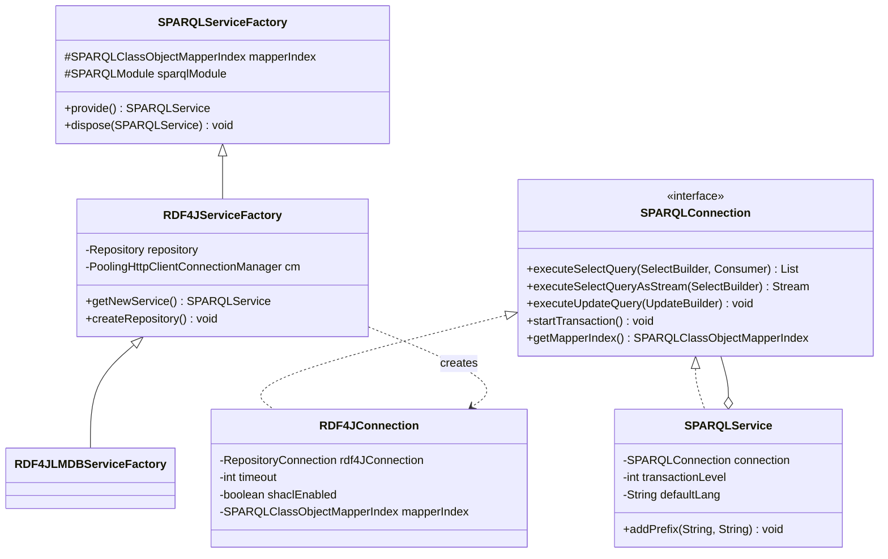
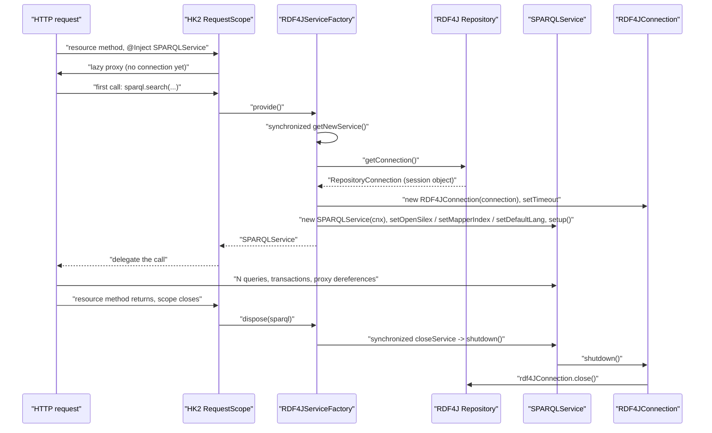
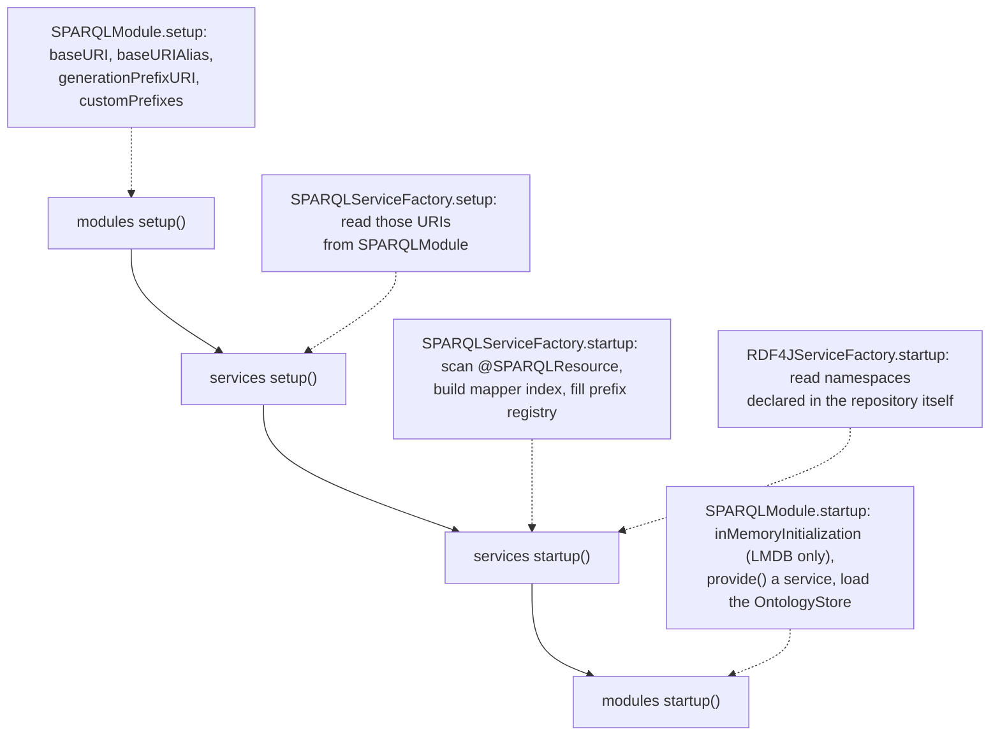

# Technical documentation : [`sparql`] Connections, the RDF4J backend and module lifecycle

**Document history (please add a line when you edit the document)**

| Date       | Editor(s)        | OpenSILEX version | Comment           |
|------------|------------------|-------------------|-------------------|
| 2026-09-11 | Arnaud Charleroy | BUILD-SNAPSHOT    | Document creation |

## Table of contents

<!-- TOC -->
- [Purpose](#purpose)
- [Key classes](#key-classes)
- [How it works](#how-it-works)
- [Executing a query](#executing-a-query)
- [Sending an update](#sending-an-update)
- [Obtaining and releasing a service](#obtaining-and-releasing-a-service)
- [Is there a connection pool?](#is-there-a-connection-pool)
- [Per-request versus per-JVM](#per-request-versus-per-jvm)
- [The embedded LMDB variant](#the-embedded-lmdb-variant)
- [Testing against the ORM](#testing-against-the-orm)
- [Repository creation and the .ttl template](#repository-creation-and-the-ttl-template)
- [Configuration reference](#configuration-reference)
- [Module lifecycle](#module-lifecycle)
- [Ontology files and SPARQLExtension](#ontology-files-and-sparqlextension)
- [CLI commands](#cli-commands)
- [Extension points](#extension-points)
- [Gotchas and invariants](#gotchas-and-invariants)
- [See also](#see-also)
<!-- TOC -->

## Purpose

This is the plumbing under the ORM: the thing that turns a built Jena query object into an actual
round trip to a triple store, and the thing that decides when that connection is opened and closed.
Two indirections do the work — `SPARQLConnection`, a backend-agnostic execution interface, and
`SPARQLServiceFactory`, an HK2 factory that hands one `SPARQLService` per HTTP request and closes
its connection when the request ends. Only one backend is implemented, RDF4J, in two flavours: a
remote HTTP repository and an embedded LMDB store used by the unit tests. This document also covers
the `SPARQLModule` lifecycle hooks (`setup`, `install`, `check`, `startup`), because that is where
the mapper index, the prefix registry, the ontology graphs and the ontology store are populated.

## Key classes

| Class | File | Role |
|-------|------|------|
| `SPARQLConnection` | [SPARQLConnection.java](../../../../../../../opensilex-sparql/src/main/java/org/opensilex/sparql/service/SPARQLConnection.java) | The execution contract: `execute*Query`, transactions, graph operations, SHACL toggles, mapper-index holder. 113 lines, of which five `default` methods. |
| `SPARQLService` | [SPARQLService.java](../../../../../../../opensilex-sparql/src/main/java/org/opensilex/sparql/service/SPARQLService.java) | Implements `SPARQLConnection` *and* wraps one. Adds prefixes and DEBUG logging, then delegates. See [SPARQLService CRUD](./05-sparql-service-crud.md). |
| `SPARQLServiceFactory` | [SPARQLServiceFactory.java](../../../../../../../opensilex-sparql/src/main/java/org/opensilex/sparql/service/SPARQLServiceFactory.java) | Abstract HK2 `Factory<SPARQLService>`. Owns the mapper index and the startup population of the static prefix registry. |
| `RDF4JServiceFactory` | [RDF4JServiceFactory.java](../../../../../../../opensilex-sparql/src/main/java/org/opensilex/sparql/rdf4j/RDF4JServiceFactory.java) | The only concrete factory. Holds the RDF4J `Repository` and the Apache HTTP connection manager; implements `provide`/`dispose` and repository creation/deletion. |
| `RDF4JLMDBServiceFactory` | [RDF4JLMDBServiceFactory.java](../../../../../../../opensilex-sparql/src/main/java/org/opensilex/sparql/rdf4j/RDF4JLMDBServiceFactory.java) | 44-line subclass that swaps the HTTP repository for `SailRepository(ShaclSail(LmdbStore))` and installs the ontologies at startup. |
| `RDF4JConnection` | [RDF4JConnection.java](../../../../../../../opensilex-sparql/src/main/java/org/opensilex/sparql/rdf4j/RDF4JConnection.java) | Wraps exactly one RDF4J `RepositoryConnection`. Every method has the same shape: prepare, apply timeout, evaluate, convert a SHACL failure. |
| `RDF4JResult` | [RDF4JResult.java](../../../../../../../opensilex-sparql/src/main/java/org/opensilex/sparql/rdf4j/RDF4JResult.java) | `SPARQLResult` over an RDF4J `BindingSet`. One row, read by variable name. |
| `RDF4JStatement` | [RDF4JStatement.java](../../../../../../../opensilex-sparql/src/main/java/org/opensilex/sparql/rdf4j/RDF4JStatement.java) | `SPARQLStatement` over an RDF4J `Statement`; subject/predicate/object/context as strings. |
| `RDF4JConfig` | [RDF4JConfig.java](../../../../../../../opensilex-sparql/src/main/java/org/opensilex/sparql/rdf4j/RDF4JConfig.java) | Three config keys: `serverURI`, `repository`, `timeout`. |
| `SPARQLServiceConfig` | [SPARQLServiceConfig.java](../../../../../../../opensilex-sparql/src/main/java/org/opensilex/sparql/service/SPARQLServiceConfig.java) | One key, `connection`. Never used by any configuration in the repository (see [Configuration reference](#configuration-reference)). |
| `SPARQLModule` | [SPARQLModule.java](../../../../../../../opensilex-sparql/src/main/java/org/opensilex/sparql/SPARQLModule.java) | The OpenSILEX module: base URIs, custom prefixes, ontology installation, ontology-store creation. |
| `SPARQLConfig` | [SPARQLConfig.java](../../../../../../../opensilex-sparql/src/main/java/org/opensilex/sparql/SPARQLConfig.java) | The `ontologies:` config section. |
| `SPARQLExtension` | [SPARQLExtension.java](../../../../../../../opensilex-sparql/src/main/java/org/opensilex/sparql/extensions/SPARQLExtension.java) | Interface a downstream module implements to declare and install ontology files. |
| `OntologyFileDefinition` | [OntologyFileDefinition.java](../../../../../../../opensilex-sparql/src/main/java/org/opensilex/sparql/extensions/OntologyFileDefinition.java) | Immutable descriptor: graph URI, classpath file, Jena `Lang`, prefix, prefix URI, staple flag. |
| `SPARQLCommands` | [SPARQLCommands.java](../../../../../../../opensilex-sparql/src/main/java/org/opensilex/sparql/cli/SPARQLCommands.java) | The `opensilex sparql ...` picocli subcommands. |

## How it works

Three layers sit between a DAO and the triple store, and each one adds exactly one thing.



- `SPARQLService` adds the prefix mapping and the DEBUG log line, keeps the nesting transaction
  counter and the default language, and delegates. It implements the same interface it wraps, so
  services can be nested in principle; in practice the wrapped instance is always an
  `RDF4JConnection` (`RDF4JServiceFactory.java:139`).
- `RDF4JConnection` adds nothing but translation: Jena builder to query string, RDF4J result to
  `SPARQLResult`/`SPARQLStatement`, `ShaclSailValidationException` to `SPARQLValidationException`.
  It holds no cache and no state beyond the timeout, the SHACL flag and the mapper index.
- `RDF4JServiceFactory` owns the `Repository` — the only object with real per-JVM cost.

`SPARQLConnection` provides five `default` implementations so a new backend has less to write:
`executeSelectQuery(select)` forwards to the two-argument form with a `null` handler
(`SPARQLConnection.java:43-45`), `executeSelectQueryAsStream` **materializes the whole list then
streams it** (`:47-49`), `rollbackTransaction(ex)` only rethrows (`:71-75`), and the two
`loadOntology` overloads parse the file with Jena and build one giant insert (`:83-107`).
`RDF4JConnection` overrides the streaming one and `rollbackTransaction(ex)` — its override
actually calls `rdf4JConnection.rollback()` before rethrowing (`RDF4JConnection.java:241-255`) —
and `SPARQLService` overrides `rollbackTransaction` too (`SPARQLService.java:315-324`), resetting
the nesting counter before delegating. Nothing overrides `executeSelectQuery(select)` or the two
`loadOntology` defaults.

## Executing a query

Every read method of `RDF4JConnection` is the same four lines plus a `catch`. Using SELECT
(`RDF4JConnection.java:137-154`) as the reference:

```java
TupleQuery selectQuery = rdf4JConnection.prepareTupleQuery(QueryLanguage.SPARQL, select.buildString());
if (getTimeout() > 0) {
    selectQuery.setMaxExecutionTime(getTimeout());
}
TupleQueryResult results = selectQuery.evaluate();
return bindingSetsToSPARQLResultList(results, resultHandler);
```

1. **The query is a string.** `select.buildString()` serializes the Jena builder; RDF4J re-parses
   it. No algebra object crosses the boundary, which is why the ORM can generate SPARQL freely
   without caring about the backend's API — and why a malformed generated query surfaces as an
   RDF4J `MalformedQueryException`.
2. **The timeout is an execution-time limit in seconds**, applied per query, and only when
   `timeout() > 0`. It is not a socket or connection timeout, despite the config description.
3. **Results are materialized by default.** `bindingSetsToSPARQLResultList` (`:349-363`) drains the
   `TupleQueryResult` into an `ArrayList<SPARQLResult>`, calling `resultHandler.accept(result)` on
   each row as it goes, then calls `queryResults.close()` and returns the list. The `resultHandler`
   therefore does **not** save memory — the list is built regardless. The same pattern exists for
   DESCRIBE/CONSTRUCT results (`statementsToSPARQLResultList`, `:325`) and for
   `getGraphStatement` (`repoStatementsToSPARQLResultList`, `:337`).
4. **Only `executeSelectQueryAsStream` truly streams** (`:157-177`). It returns
   `results.stream().map(RDF4JResult::new)`; RDF4J's `Iterations.stream` registers an `onClose` that
   closes the underlying iteration, and the iteration also closes itself when fully consumed. A
   stream abandoned half-way (`findFirst`, `limit`) and never closed keeps the result set open until
   the connection is closed at the end of the request.
5. **ASK** (`:78-94`) returns `askQuery.evaluate()` directly.

The `catch` is identical in all of them: an RDF4J `RepositoryException` whose cause is a
`ShaclSailValidationException` becomes a `SPARQLValidationException` built by
`convertRDF4JSHACLException` (`:365-396`); anything else becomes
`new SPARQLException(ex.getMessage())` — **message only, cause dropped**. Note that
`executeUpdateQuery(String)` (`:185-200`) catches plain `Exception` while every read method catches
only `RepositoryException`, so a `QueryEvaluationException` raised during iteration of a read
escapes untranslated.

## Sending an update

`executeUpdateQuery(UpdateBuilder)` and `executeDeleteQuery(UpdateBuilder)` are the same method:
both call `update.buildRequest().toString()` and forward to `executeUpdateQuery(String)`
(`:180-205`). There is no DELETE-specific handling; the distinction exists only for readability at
the call site.

Graph-level operations bypass SPARQL entirely and use the RDF4J API: `clearGraph` calls
`rdf4JConnection.clear(graph)` (`:262-273`), `clear()` calls `rdf4JConnection.clear()` (`:312-323`),
`getGraphStatement` calls `getStatements(null, null, null, graphIRI)` (`:296-309`). None of these
three applies the timeout. The one hand-written query string in the whole class is the graph rename
(`:276-293`):

```sparql
MOVE GRAPH <http://opensilex.dev/set/variable> TO <http://opensilex.dev/set/variables>
```

`loadOntology` (the `default` method, `SPARQLConnection.java:83-102`) reads the file into a Jena
`Model`, iterates every statement and adds it to a single `UpdateBuilder` with no WHERE clause,
then calls `executeUpdateQuery(insertQuery)`. That builder is serialized by
`buildRequest().toString()` in `RDF4JConnection.executeUpdateQuery(UpdateBuilder)` (`:180-182`),
which — having no WHERE clause — produces a single `INSERT DATA` request holding every triple of
the file:

```sparql
INSERT DATA {
  GRAPH <http://www.opensilex.org/vocabulary/oeso> {
    <http://www.opensilex.org/vocabulary/oeso#Variable> a owl:Class .
    ...       # one line per triple in the file, in a single request
  }
}
```

That is why installing `oeso-core.owl` is one very large HTTP POST rather than a batched load.

## Obtaining and releasing a service

`SPARQLServiceFactory` extends `ServiceFactory<SPARQLService>`, which extends HK2's
`Factory<SPARQLService>`. In
[RestApplication](../../../../../../../opensilex-main/src/main/java/org/opensilex/server/rest/RestApplication.java)
every registered `ServiceFactory` is bound as

```java
bindFactory(factory).to(factory.getServiceClass())
        .proxy(true).proxyForSameScope(false).in(RequestScoped.class);
```

(`RestApplication.java:214-215`). So `@Inject private SPARQLService sparql;` in an API class
injects a lazily-initialising proxy; the real `SPARQLService` — and therefore the RDF4J connection —
is created on the **first method call**, and `dispose()` runs when the request scope is destroyed.



`getNewService()` (`RDF4JServiceFactory.java:124-145`) does, in order: open the RDF4J connection,
log the Apache pool statistics at DEBUG, wrap the connection, set the timeout from the config, build
the `SPARQLService`, inject the `OpenSilex` instance, the **shared** mapper index and the default
language, then call `setup()`. The order matters: `SPARQLService.setup()` (`SPARQLService.java:130`)
reads `getMapperIndex()`, which is itself delegated to the connection, so the index must be set
first. `dispose()` (`:164-171`) calls `closeService()` → `sparql.shutdown()` →
`connection.shutdown()` → `rdf4JConnection.close()` and **swallows any exception with a log line**.

If the request dies while a transaction is open, RDF4J's `HTTPRepositoryConnection.close()` rolls it
back and logs `Rolling back transaction due to connection close` with a stack trace. That WARN in
the logs means "a request threw between `startTransaction` and `commitTransaction`", not an RDF4J
bug.

## Is there a connection pool?

**There is no pool of `SPARQLService` or of `RepositoryConnection`.** Every `provide()` opens a new
one and every `dispose()` closes it. What is pooled is one level lower: HTTP sockets.

```java
HTTPRepository repo = new HTTPRepository(config.serverURI(), config.repository());
cm = new PoolingHttpClientConnectionManager();
cm.setDefaultMaxPerRoute(20);
CloseableHttpClient httpClient = HttpClients.custom().setConnectionManager(cm).build();
repo.setHttpClient(httpClient);
repo.init();
```

(`RDF4JServiceFactory.java:65-81`.) Apache HttpClient 4.5.14 defaults the manager to
*max 2 per route, max 20 total*; this code raises the per-route limit to 20, so the effective cap is
**20 concurrent HTTP round trips to the triple store**, because there is only one route. `maxTotal`
is left at its default and no `RequestConfig` connection-request timeout is set, so the 21st
concurrent query **blocks waiting for a pooled socket, with no deadline**.

The important consequence is that an `HTTPRepository` `RepositoryConnection` is a lightweight session
object — `HTTPRepository.getConnection()` performs no network call — and HTTP sockets are borrowed
per query, not per connection. So thousands of open `RDF4JConnection` objects cost almost nothing,
while more than 20 simultaneously *executing* queries queue up.

Concurrency notes:

- `getNewService()` and `closeService()` are both `synchronized` on the factory instance
  (`:124`, `:147`), so opening and closing connections is serialized across all request threads.
  The critical section is short (object construction plus a session creation), but it is a global
  monitor on the hot path of every request.
- The `synchronized (this)` blocks inside the two constructors (`:68`, `:86`) guard nothing: no
  other thread can hold a reference to `this` yet. The reason is not documented in the code.
- One `RDF4JConnection` must stay on one thread. RDF4J `RepositoryConnection` is not thread-safe,
  and neither is the nesting `transactionLevel` counter in `SPARQLService`. Sharing a provided
  service between threads is a bug — and
  [ScheduleMetrics](../../../../../../../opensilex-core/src/main/java/org/opensilex/core/metrics/schedule/ScheduleMetrics.java)
  does exactly that (`ScheduleMetrics.java:51-85`): it calls `provide()` once at
  `INITIALIZATION_APP_FINISHED`, builds one `MetricDAO` from it, hands it to two
  `scheduleAtFixedRate` tasks, and never disposes it.
- `RDF4JConnection.connectionCount` (`:53`) is a static `AtomicInteger` used only in the two DEBUG
  log lines of the constructor and `shutdown()`. It is an open-connection gauge, and it drifts
  permanently whenever a connection is leaked or disposed twice.

## Per-request versus per-JVM

| Lives per JVM (one instance for the whole application) | Lives per `provide()` (per HTTP request, per CLI command, per test class) |
|---|---|
| `RDF4JServiceFactory` — one per `sparql:` entry in the configuration | `RepositoryConnection` (RDF4J) |
| The RDF4J `Repository` (`HTTPRepository` or `SailRepository`) | `RDF4JConnection` — with its own `timeout`, `shaclEnabled` flag and mapper-index reference |
| `PoolingHttpClientConnectionManager` and its `CloseableHttpClient` | `SPARQLService` — with its own `defaultLang` and `transactionLevel` |
| `SPARQLClassObjectMapperIndex` and every mapper, analyzer and query builder — see [object mapper and index](./02-object-mapper-and-index.md) | Every `SPARQLProxy` created during the request, each holding the service — see [proxies and lazy loading](./04-proxies-and-lazy-loading.md) |
| The static prefix map in `SPARQLService` (`SPARQLService.java:168`) | |
| The static `generatedUriCache` (Caffeine, 30 s, 10 000 entries, `SPARQLService.java:103`) | |
| The `OntologyStore`, a static field of `SPARQLModule` (`SPARQLModule.java:51`) | |
| `RDF4JConnection.connectionCount` | |

Nothing in the per-request column may be cached, stored in a static field, or handed to a thread
that outlives the request.

## The embedded LMDB variant

`RDF4JLMDBServiceFactory` is the whole file:

```java
public RDF4JLMDBServiceFactory() { super(getLMDBRepository()); }

public static Repository getLMDBRepository() {
    LmdbStore lmdbStore = new LmdbStore();
    ShaclSail shacl = new ShaclSail(lmdbStore);
    SailRepository repository = new SailRepository(shacl);
    repository.init();
    return repository;
}
```

It uses the `RDF4JServiceFactory(Repository)` constructor, which passes `null` as the config. That
single fact drives most of its behaviour: `getConfig()` is null, so `getTimeout()` returns 0
(`RDF4JServiceFactory.java:116-122`) and `createRepository()` / `deleteRepository()` are no-ops
because both are guarded by `if (getImplementedConfig() != null)`. There is no HTTP client, so `cm`
stays null and the pool statistics are not logged.

Despite the historical name (`RDF4JInMemoryServiceFactory`, still visible as a commented-out line in
`opensilex-dev-tools/src/main/resources/config/opensilex.yml:5`), **this is not an in-memory store**.
`new LmdbStore()` with no data directory makes RDF4J create a temporary directory named
`rdf4j-lmdb-tmp*` on first `init()` and delete it in `shutDownInternal()`. Since nothing in
OpenSILEX ever calls `Repository.shutDown()` outside
[InstallTest](../../../../../../../opensilex-dev-tools/src/test/java/org/opensilex/dev/InstallTest.java),
those directories accumulate across test runs.

It also overrides `startup()` to install the ontologies into the fresh store, because an embedded
store starts empty and no `opensilex system install` has run against it:

```java
public void startup() throws Exception {
    super.startup();
    SPARQLService sparql = this.provide();
    getOpenSilex().getModuleByClass(SPARQLModule.class).installOntologies(sparql, false);
    this.dispose(sparql);
}
```

The second piece of embedded-only wiring is in `SPARQLModule.startup()` (`:212-216`): when the
factory `instanceof RDF4JLMDBServiceFactory`, every `SPARQLExtension` module gets
`inMemoryInitialization()`. Only
[SecurityModule](../../../../../../../opensilex-security/src/main/java/org/opensilex/security/SecurityModule.java)
implements it (`SecurityModule.java:257`), to create the default super-admin account that the tests
log in with.

This is the factory the test configuration uses
(`opensilex-main/src/main/resources/config/test/opensilex.yml`), and the tests also instantiate it
directly:

```java
// RDF4JConnectionTest.java:32-50 — the canonical manual wiring of the ORM
factory = new RDF4JLMDBServiceFactory();
factory.setOpenSilex(opensilex);
factory.setup();
factory.startup();
factory.getMapperIndex().addClasses(A.class, B.class, C.class, D.class, /* ... */);
sparql = factory.provide();
```

## Testing against the ORM

`opensilex-sparql/src/test` holds 21 Java sources and 7 fixture files. Nine of the Java sources are
the module's **model-under-test set**; the rest are the test classes and one bootstrap helper. There
is no test against a remote HTTP repository anywhere in the module: every test that touches a store
goes through `RDF4JLMDBServiceFactory`, because the remote flavour would need a running RDF4J server.

### Getting an instance

Two bootstraps exist, and they do the same thing at different granularities.

[AbstractUnitTest](../../../../../../../opensilex-main/src/test/java/org/opensilex/unit/test/AbstractUnitTest.java)
(`opensilex-main`) builds one `OpenSilex` in `@BeforeClass` with
`PROFILE_ID_ARG_KEY = TEST_PROFILE_ID` and `NO_CACHE_ARG_KEY = "true"`, and shuts it down in
`@AfterClass`. It exposes the instance as the static `opensilex` field but **no** `SPARQLService`:
a subclass wires its own factory. That is what `RDF4JConnectionTest`, `RDF4JSHACLTest` and
`SPARQLMetadataTest` do, with the manual sequence shown above — `new RDF4JLMDBServiceFactory()`,
`setOpenSilex`, `setup()`, `startup()`, `getMapperIndex().addClasses(...)`, `provide()`.

[OpenSilexTestEnvironment](../../../../../../../opensilex-sparql/src/test/java/org/opensilex/sparql/utils/OpenSilexTestEnvironment.java)
wraps the same thing one level higher: the constructor builds the `OpenSilex` instance with the same
two arguments, looks the configured `SPARQLServiceFactory` up in the service registry — which under
the test profile *is* the LMDB one — registers `A`, `B` and `C`, and calls `provide()`. `getSparql()`
returns that service, `addTestClasses(List)` registers more, and `stopOpenSilex()` shuts the instance
down. `getInstance()` memoizes a single environment in a static field, so tests that share it also
share the triple store; `SparqlUrisQueryTest` deliberately calls the constructor instead, to get a
mapper index it can extend without affecting anyone else.

Either way, the one sanctioned runtime use of the public `addClasses` is here: test-only models are
not discovered by the classpath scan, so they must be registered by hand before the first query. See
[object mappers and the mapper index](./02-object-mapper-and-index.md).

### The fixture models

| Model | Registered by | What it is for |
|-------|---------------|----------------|
| `A` | every test class | The plain case: `SPARQLResourceModel`, no `graph` on `@SPARQLResource`, so it lands in the default graph. |
| `B` | every test class | The same, but with `graph = TEST_ONTOLOGY.GRAPH_SUFFIX` — the named-graph case, and the list-fetch subject. |
| `C` | every test class | Labels and the metadata fields; `SPARQLMetadataTest` registers it alone to exercise publisher and publication date. |
| `D` | `RDF4JConnectionTest` | Carries a `required = true` property — the validation case. |
| `InverseModel` | `RDF4JConnectionTest` | `inverse = true` relations. |
| `ModelInAnotherGraph` | `RDF4JConnectionTest`, `SparqlUrisQueryTest` | A second named graph, for cross-graph queries. |
| `UriGeneratedTestModel` | `RDF4JConnectionTest` | Extends `A` and implements `ClassURIGenerator`, for URI generation. |
| `NoGetterClass`, `NoSetterClass` | none — analyzed directly | Malformed models `SPARQLClassAnalyzerTest` expects to be rejected. |

`TEST_ONTOLOGY` is not a model but the vocabulary they share: the namespace constants, the graph
suffixes, and the classpath `Path` plus RDF `Lang` of every fixture file.

### The fixture files

All live under `opensilex-sparql/src/test/resources/ontologies/` and are read through
`OpenSilex.getResourceAsStream` with `sparql.loadOntology`.

| File | Loaded into | By |
|------|-------------|-----|
| `test.owl` | the base URI graph | `SPARQLServiceTest.initialize` and `SHACLTest.initialize` — the schema for `A`/`B`/`C`/`D`. |
| `test_data.ttl` | `B`'s default graph | `SPARQLServiceTest.before`, once per test method; also `SHACLTest.testSHACLGeneration`, into the `data` graph. |
| `test_data_rename_default.ttl` | the default graph | `SPARQLServiceTest.before` — the `renameGraph` case with a null graph. |
| `test_data_rename_in_graph.ttl` | `TEST_ONTOLOGY.RENAME_DATA_GRAPH_URI` | `SPARQLServiceTest.before` — the same case in a named graph. |
| `test_data_multiple_labels.ttl` | `TEST_ONTOLOGY.MULTIPLE_LABEL_DATA_GRAPH_URI` | `SPARQLServiceTest.before` — several `rdfs:label` translations on one resource. |
| `test_shacl_fail.ttl` | the `data` graph | `SHACLTest.testSHACLGeneration`, which asserts that the load throws `SPARQLValidationException` and inspects the per-URI error map. |
| `sparql_list_fetcher.ttl` | nothing | **Unreferenced.** `SPARQLListFetcherTest` builds its `A`/`B` graph in Java instead. |

`SPARQLServiceTest` reads the four data files once in `initialize()` and keeps them as `byte[]`, then
replays them from a `ByteArrayInputStream` in `@Before` and clears the graphs in `@After`: each test
method starts from the same data without re-reading the disk.

## Repository creation and the .ttl template

`createRepository()` (`RDF4JServiceFactory.java:216-256`) is what `opensilex system install` runs
against a remote RDF4J server. It is a five-step sequence:

1. `RepositoryProvider.getRepositoryManager(serverURI)` — a *remote* manager for an `http(s)` URI.
2. Read
   [rdf4j-lmdb-repository-creation-template.ttl](../../../../../../../opensilex-sparql/src/main/resources/rdf4j-lmdb-repository-creation-template.ttl)
   from the classpath (`readRepositoryCreationTemplateFile`, `:177-188`).
3. Render it with `ConfigTemplate`, substituting `Repository ID` and `Repository title` with
   `config.repository()` and merging `getCustomRepositorySettings()` (`:197-204`), which sets
   `Triple indexes` to `spoc`.
4. `loadRDF4JServices()` (`:261-276`) walks `ServiceLoader` for every `RepositoryFactory` and
   `SailFactory` on `OpenSilex.getClassLoader()` and registers them in `RepositoryRegistry` /
   `SailRegistry`. Without this, `RepositoryConfig.create` cannot resolve `rdf4j:LmdbStore` from a
   module classloader — that is the reason for the explicit loading.
5. `addRepositoryConfig(repConfig)`, then `repositoryManager.shutDown()`.

The template uses RDF4J's `` syntax, where the **first** alternative
is the default. Rendered for a repository named `opensilex`, it is:

```turtle
@prefix rdfs: <http://www.w3.org/2000/01/rdf-schema#>.
@prefix config: <tag:rdf4j.org,2023:config/>.
@prefix ns: <http://rdf4j.org/config/sail/lmdb#> .

[] a config:Repository ;
   config:rep.id "opensilex" ;
   rdfs:label "opensilex" ;
   config:rep.impl [
      config:rep.type "openrdf:SailRepository" ;
      config:sail.impl [
         config:sail.type "rdf4j:LmdbStore" ;
         config:sail.defaultQueryEvaluationMode "STRICT";
         ns:tripleIndexes "spoc";
      ]
   ].
```

Two things are worth knowing about the rendered result. `Query Evaluation Mode` is never overridden,
so it stays `STRICT`. And the template's own default is the six-index list
`cspo,cpos,cops,spoc,psoc,opsc`, which `getCustomRepositorySettings()` replaces with the single
index `spoc` — a deliberate choice (the code comments link the RDF4J configuration reference) whose
rationale is not documented further. A single `spoc` index means a triple pattern with an unbound
subject, such as the reverse-relation lookups in
`requireUriIsNotLinkedWithOtherResourcesInRDF`, has no index to use.

`deleteRepository()` (`:279-288`) is the symmetric `removeRepository(config.repository())`, invoked
by `SPARQLModule.install(reset = true)` and by `InstallTest`'s cleanup.

## Configuration reference

The service lives under the `ontologies:` module section (`SPARQLModule.getConfigId()`), and its
name in the service registry is the config method name — `SPARQLConfig.sparql()`, hence
`SPARQLService.DEFAULT_SPARQL_SERVICE = "sparql"`
(see `OpenSilexModuleManager.registerServices`, `OpenSilexModuleManager.java:421-449`).

### RDF4JConfig — the `ontologies.sparql.config` block

| Key | Type | Default | Effect |
|-----|------|---------|--------|
| `serverURI` | `String` | `http://localhost:8080/rdf4j-server/` | Base URL of the RDF4J server. Used for the `HTTPRepository` and for `RepositoryProvider.getRepositoryManager` in `createRepository`/`deleteRepository`. |
| `repository` | `String` | `opensilex` | Repository id on that server; also becomes the repository label at creation time. |
| `timeout` | `Integer` | `0` | Passed to `Query.setMaxExecutionTime(int)` in **seconds** for ASK/SELECT/DESCRIBE/CONSTRUCT/UPDATE and for the graph rename, and only when strictly positive. It is a *query execution* limit, not a socket timeout — the config description ("RDF4J connectrion timeout", typo included) is misleading. No configuration in this repository sets it. |

### SPARQLServiceConfig

| Key | Type | Default | Effect |
|-----|------|---------|--------|
| `connection` | `SPARQLConnection` | none | Would let a `SPARQLService` be declared directly in the configuration with a nested `connection:` service, through `SPARQLService(SPARQLServiceConfig)` (`SPARQLService.java:108`). No configuration file in the repository does this, and the constructor has no caller: the live path always builds a `SPARQLService` in Java from an `RDF4JConnection`. |

### The `ontologies:` keys this subsystem reads

| Key | Type | Default | Read by |
|-----|------|---------|---------|
| `sparql` | service | implementation `RDF4JServiceFactory` | `SPARQLModule.install` (`:139`), and the whole service registry. The implementation class is overridden with `implementation:`. |
| `baseURI` | `String` | `http://installation.domain.org/` | `SPARQLModule.setup` (`:69`), then copied into `SPARQLServiceFactory.setup` and the mapper index. |
| `baseURIAlias` | `String` | `local` | `SPARQLModule.setup` stores it with a trailing `-`; used as the prefix alias for every model graph. |
| `generationBaseURI` | `String` | `""` | `SPARQLModule.setup` (`:93`); when empty, `generationBaseURIAlias` is appended to `baseURI` instead. |
| `generationBaseURIAlias` | `String` | `id` | Same, via `UriBuilder.fromUri(baseURI).path(alias)`. |
| `usePrefixes` | `boolean` | `true` | `SPARQLServiceFactory.startup` and `RDF4JServiceFactory.startup`. When false, `SPARQLService.clearPrefixes()` is called and every URI is written in long form. |
| `customPrefixes` | `Map` | empty | `SPARQLModule.setup` validates each URI with `URIDeserializer.validateURI` and **throws a `RuntimeException` at startup** on an invalid one (`:70-80`). |
| `enableSHACL` | `boolean` | `false` | `SPARQLModule.install` only. Marked "(Experimental)" in `SPARQLConfig`. |
| `enableOntologyStore` | `boolean` | `true` | `SPARQLModule.initOntologyStore` (`:191`); see [ontology RAM storage](../ontology-ram-storage-optimization.md). |

`csvBatchSize` and `csvMaxErrorNb` also live in this section but belong to the
[CSV pipeline](./11-csv-pipeline.md).

A realistic configuration, adapted from `opensilex-dev-tools/src/main/resources/config/opensilex.yml`:

```yaml
ontologies:
    baseURI: http://opensilex.dev/
    baseURIAlias: dev
    generationBaseURIAlias: id
    usePrefixes: true
    enableSHACL: false
    enableOntologyStore: true
    customPrefixes:
        sixtine: http://www.inrae.fr/sixtine/vocabulary#
    sparql:
        # omit "implementation" for the remote RDF4J server (the default),
        # or use org.opensilex.sparql.rdf4j.RDF4JLMDBServiceFactory for an embedded store
        config:
            serverURI: http://localhost:8667/rdf4j-server/
            repository: opensilex
            timeout: 0
```

## Module lifecycle

`OpenSilex.startup()` (`OpenSilex.java:500-539`) runs four phases in a fixed order, and the split
between "service" and "module" hooks is what makes the ORM work:



- **`SPARQLModule.setup()`** (`:64-104`) only computes URIs. It runs before any service exists, which
  is why `SPARQLServiceFactory.setup()` can read `getBaseURI()` and `getGenerationPrefixURI()`
  safely.
- **`SPARQLServiceFactory.startup()`** (`:76-121`) builds the mapper index from a Reflections scan
  and then populates the JVM-global prefix registry — model graph prefixes, `baseURIAlias`,
  `generationBaseURIAlias`, `customPrefixes`, and one entry per `OntologyFileDefinition` of every
  `SPARQLExtension` module — before pushing the result into `URIDeserializer.setPrefixes`. Detailed
  in [transactions, URI and validation](./06-transactions-uri-and-validation.md).
- **`RDF4JServiceFactory.startup()`** (`:97-114`) adds the namespaces the *repository* already
  declares, by iterating `connection.getNamespaces()`. The `catch (RepositoryException ignored)` with
  the comment "No repository connection to establish. That is the case for example during Swagger
  generation" is what lets the build-time profiles start without a triple store.
- **`SPARQLModule.startup()`** (`:209-220`) creates the ontology store: `DefaultOntologyStore` when
  `enableOntologyStore` is on and the profile is neither reserved nor test, `NoOntologyStore`
  otherwise, then `ontologyStore.load()`.
- **Shutdown** runs in the reverse grouping: `OpenSilex.shutdown()` calls every module's
  `shutdown()`, *then* every service's `shutdown()`, then `clean()`. `SPARQLModule` overrides none
  of them. `SPARQLServiceFactory.shutdown()` (`:123-127`) is two lines:
  `SPARQLService.clearPrefixes()` and `URIDeserializer.clearPrefixes()`.

`install(boolean reset)` (`SPARQLModule.java:135-166`) is the `opensilex system install` path:
optionally `deleteRepository()`, then `createRepository()`, then `provide()` one service, then
`installOntologies(service, reset)`, then enable or disable SHACL according to the config, and
`dispose()` in a `finally`. A `SPARQLValidationException` while enabling SHACL is logged at WARN and
swallowed — an install does not fail because the shapes do not validate the existing data.

`check()` (`:168-177`) is `opensilex system check`: provide a service, call `checkOntologies` on
every `SPARQLExtension` module, dispose. `SPARQLExtension.checkOntologies` throws as soon as one
declared graph is empty, with the message "is missing data into your triple store, did you execute
`opensilex system setup` command ?".

## Ontology files and SPARQLExtension

A module declares its ontologies by implementing `SPARQLExtension.getOntologiesFiles()` and returning
`OntologyFileDefinition` instances. `installOntologies` then loads each of them, optionally clearing
the target graph first:

```java
// SPARQLExtension.java:31-40
for (OntologyFileDefinition ontologyDef : getOntologiesFiles()) {
    if (reset) {
        sparql.clearGraph(ontologyDef.getUri());
    }
    InputStream ontologyStream = new FileInputStream(
            ClassUtils.getFileFromClassArtifact(getClass(), ontologyDef.getFilePath()));
    sparql.loadOntology(ontologyDef.getUri(), ontologyStream, ontologyDef.getFileType());
    ontologyStream.close();
}
```

`OntologyFileDefinition` (`:32-48`) strips every `#` from the URI it is given and stores the result
as the **graph URI**, while `prefixUri` defaults to that stripped URI plus `#`. So
`new OntologyFileDefinition("http://www.opensilex.org/vocabulary/oeso#", "ontologies/oeso-core.owl", Lang.RDFXML, "vocabulary", null, true)`
means: graph `<http://www.opensilex.org/vocabulary/oeso>`, prefix `vocabulary:` bound to
`<http://www.opensilex.org/vocabulary/oeso#>`. The last flag, `addToStaple`, is read only by
[StapleApiUtils](../../../../../../../opensilex-graphql/src/main/java/org/opensilex/graphql/staple/StapleApiUtils.java)
(`StapleApiUtils.java:96-108`) to decide which ontologies feed the GraphQL schema; the ORM ignores
it.

Real declarations, for reference: `CoreModule.getOntologiesFiles()` (`CoreModule.java:156-175`)
returns `peco_factors.owl` and `oeso-core.owl`; `PhisWsModule` adds its own; `SecurityModule`
declares none and instead registers its prefix in `setup()`.

`SPARQLModule.installOntologies` (`:126-133`) calls `sparql.disableSHACL()` **before** delegating to
the modules — loading an ontology into a SHACL-validating sail would validate the ontology itself.
The `// #TODO clean cache` comment on the first line is unresolved.

## CLI commands

`SPARQLCommands` registers four subcommands under `opensilex sparql`. All four follow the same
pattern: look the factory up by name, `provide()`, act, `dispose()`.

| Command | What it does |
|---------|--------------|
| `sparql reset-ontologies` | `SPARQLModule.installOntologies(sparql, true)` — clears every declared ontology graph and reloads it from the module artifacts. |
| `sparql rename-graph <old> <new>` | `MOVE GRAPH`, via `SPARQLService.renameGraph`, which toggles SHACL around the move. |
| `sparql shacl-enable` | `sparql.enableSHACL()`; on `SPARQLValidationException` it prints the report and calls `disableSHACL()`. |
| `sparql shacl-disable` | `sparql.disableSHACL()` — clears `RDF4J.SHACL_SHAPE_GRAPH`. |

## Extension points

- **A new backend** means implementing `SPARQLConnection` and extending `SPARQLServiceFactory` with
  `provide()`, `dispose()`, `createRepository()` and `deleteRepository()`, then pointing
  `ontologies.sparql.implementation` at it. Two obstacles are visible in the current code:
  `SPARQLConnection.executeSelectQuery` declares RDF4J's `MalformedQueryException` and
  `HTTPQueryEvaluationException` in its `throws` clause (`SPARQLConnection.java:16-17`, `:41`), and
  `SPARQLService.getRepositoryConnection()` hard-casts to `RDF4JConnection`
  (`SPARQLService.java:2239`).
- **A variant of the RDF4J backend** should extend `RDF4JServiceFactory` and pass a `Repository` to
  the protected constructor, as `RDF4JLMDBServiceFactory` does. Override
  `getCustomRepositorySettings()` to change the repository template parameters, and
  `readRepositoryCreationTemplateFile()` to supply a different template altogether — both are
  `protected` for exactly that.
- **A module that owns ontologies** implements `SPARQLExtension` on its `OpenSilexModule` and
  returns `OntologyFileDefinition`s from `getOntologiesFiles()`. Registering the prefix is *not*
  needed: `SPARQLServiceFactory.startup()` (`:110-114`) does it. Overriding
  `installOntologies`/`checkOntologies` is only needed for non-file initialisation, as
  `PhisWsModule.insertDefaultSpecies` does.
- **A module that needs raw RDF4J access** can cast the factory to `RDF4JServiceFactory` and call
  `getRepository()` (`:290-292`), which is `final` and public. `InstallTest` and the monitoring
  statistics reader use it. Prefer this over the `@Deprecated`
  `RDF4JConnection.getRepositoryConnectionImpl()` (`:398-401`).
- **Startup work that needs a service** belongs in a module's `startup()`, never in a service's,
  because services start first. Always `provide()` and `dispose()` in a `try`/`finally`.

## Gotchas and invariants

- **`SPARQLModule.startup()` leaks a connection for the life of the JVM.** `:218-219` calls
  `factory.provide()` and hands the service to `initOntologyStore` without ever disposing it. The
  `DefaultOntologyStore` keeps that same `SPARQLService` — and its `RepositoryConnection` — as a
  field, which is deliberate for a store that reloads itself, but it means the connection is never
  closed and never returned to anything.
- **`provide()` without `dispose()` is a real pattern in the codebase, not just a hazard.**
  `CoreModule.insertDefaultVariablesGroup`, `insertDefaultMethod` and `insertDefaultInterestEntities`
  (`CoreModule.java:245`, `:266`, `:283`) each provide a service and never dispose it; so does
  `PhisWsModule.insertDefaultSpecies` (`PhisWsModule.java:72`) and `ScheduleMetrics` (`:51`). The
  first four run only under `opensilex system install`, which exits afterwards; `ScheduleMetrics`
  runs in the server.
- **`SPARQLCommands.resetOntologies` disposes twice** — once in the `finally` (`:44`) and once after
  it (`:46`). `RepositoryConnection.close()` is idempotent, but `connectionCount` is decremented
  twice, so the DEBUG gauge goes negative. `renameGraph` and `shaclEnable` (`:54-63`, `:70-83`) have
  no `try`/`finally` at all and leak on failure.
- **Nothing ever shuts the `Repository` or the HTTP connection manager down.**
  `RDF4JServiceFactory` does not override `shutdown()`, so `repository.shutDown()` and
  `cm.close()` are never called in production; the JVM exit cleans up the sockets, and for the LMDB
  variant the temporary data directory is left on disk.
- **`SPARQLException` loses the cause.** Every `catch` in `RDF4JConnection` builds
  `new SPARQLException(ex.getMessage())`. A triple store that is down, a 404 on the repository name
  and a syntax error in a generated query all arrive as a bare message with no stack trace below it.
- **Read methods only catch `RepositoryException`.** A `QueryEvaluationException` thrown while
  draining the result (`:328`, `:352`) escapes as an unchecked RDF4J exception, and the
  `queryResults.close()` at the end of the converter is *not* in a `finally`, so the result set
  leaks until the connection closes.
- **`executeSelectQueryAsStream` returns `Stream.empty()` without closing the result** when
  `results.hasNext()` is false (`:164-166`). The `TupleQueryResult` is left to the iteration's own
  end-of-data self-close.
- **`shaclEnabled` is per-connection and starts `false`** (`:403`). A request-scoped connection
  therefore reports `isShaclEnabled() == false` no matter what is in the shape graph, which makes
  `SPARQLService.validateAllRelations` (`SPARQLService.java:2289`) always run the Java-side relation
  validation. That is the safe outcome, but it is an accident of the flag's lifetime, not a decision.
- **The shipped repository template declares no `ShaclSail`.** A repository created by
  `opensilex system install` is `SailRepository(LmdbStore)`, whereas `RDF4JLMDBServiceFactory` wraps
  the store in a `ShaclSail` explicitly. Shapes written by `sparql shacl-enable` land in
  `RDF4J.SHACL_SHAPE_GRAPH` either way, but on such a repository there is no validating sail to
  enforce them. `enableSHACL` defaults to `false` and is documented as experimental, so this is
  consistent with the feature's status; the reason is not documented in the code.
- **`RDF4JLMDBServiceFactory` silently ignores a `config:` block.** `ServiceDefinition`
  `getDefaultConfigClass` reads `@ServiceDefaultDefinition` from the *implementation* class, and that
  annotation is not `@Inherited`. The subclass does not carry it, so `ConfigProxyHandler` falls back
  to the no-argument constructor (`ConfigProxyHandler.java:548-555`) and any `serverURI`/`repository`
  under it is dropped — as happens in
  `opensilex-dev-tools/src/test/resources/configs/opensilex_rdf4j_in_memory_install_test.yml`.
- **`SPARQLServiceFactory.shutdown()` resets the JVM-global prefix map to its five defaults**
  (`rdfs`, `foaf`, `dc`, `owl`, `xsd`) and clears the `URIDeserializer` mapping. With two SPARQL
  services configured, the first factory to shut down wipes the prefixes the other still needs; in
  tests it wipes prefixes a still-running factory registered. Module `shutdown()` hooks run *before*
  service `shutdown()`, so a module may still use short URIs during its own shutdown, but anything
  running after that point — a JVM shutdown hook, a lingering executor — will produce long URIs or
  fail to expand a short one. The full story is in
  [transactions, URI and validation](./06-transactions-uri-and-validation.md).
- **`SPARQLService.setup()` sets the mapper index on the connection from the connection.**
  `getMapperIndex()` delegates to `connection.getMapperIndex()` (`SPARQLService.java:2370`), so line
  `:132` is a self-assignment. The index must already have been set by the factory
  (`RDF4JServiceFactory.java:141`) before `setup()` runs; the call order in `getNewService()` is
  load-bearing.
- **`RDF4JConnection` is a `BaseService` whose config is always `null`** (`super(null)`, `:56`).
  Do not call `getConfig()` on it.
- **Do not rely on `dispose()` throwing.** It logs "Error while closing RDF4J service
  connectioninstance instance" (sic) and returns, so a failed close is invisible to the caller.

## See also

- [ORM architecture overview](../orm-architecture.md) — where this subsystem sits in the pipeline.
- [Object mapper and index](./02-object-mapper-and-index.md) — what
  `SPARQLServiceFactory.startup()` builds, and why the index is shared by every connection.
- [SPARQLService CRUD](./05-sparql-service-crud.md) — the facade that sits on top of every
  `SPARQLConnection` method documented here.
- [Transactions, URI generation and validation](./06-transactions-uri-and-validation.md) — the
  nesting transaction counter, and the static prefix registry in full.
- [Proxies and lazy loading](./04-proxies-and-lazy-loading.md) — why a model must not outlive the
  request whose connection loaded it.
- [Type system and deserializers](./08-type-system-deserializers.md) — `SPARQLResult`,
  `SPARQLStatement` and `URIDeserializer.setPrefixes`.
- [Ontology store and OWL](./09-ontology-store-and-owl.md) — what
  `SPARQLModule.initOntologyStore` creates, and SHACL shape generation.
- [Ontology RAM storage optimization](../ontology-ram-storage-optimization.md) — why
  `enableOntologyStore` exists.
- [Graph organization](../graph-organization.md) and
  [graph storage](../../architecture/sparql/graph-storage.md) — which named graph holds what, and
  therefore what `clearGraph` and `renameGraph` act on.
