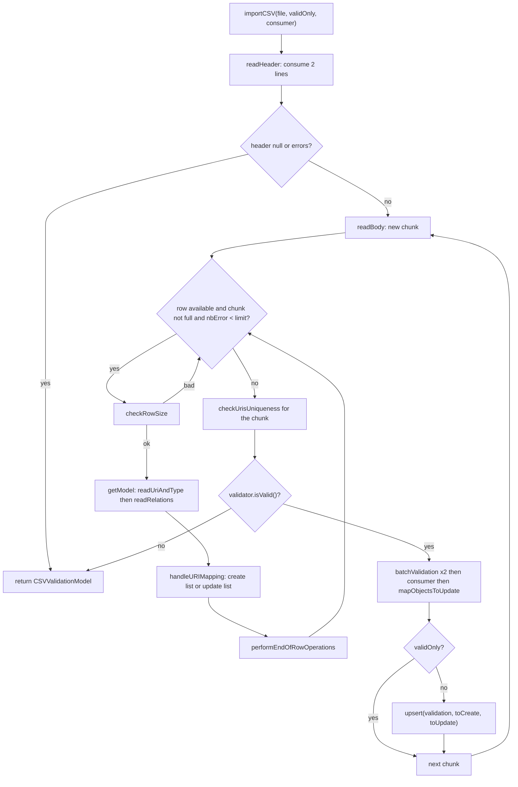
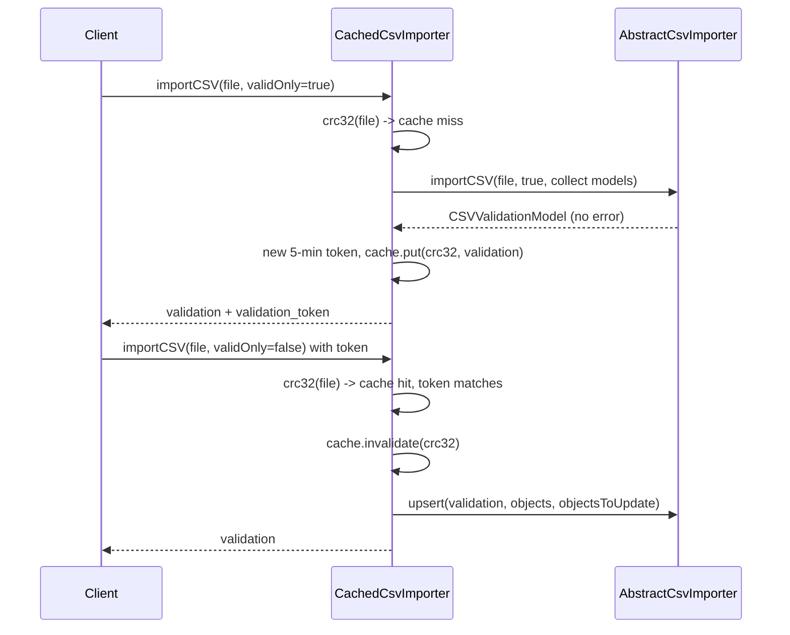

# Technical documentation : [`sparql`] The generic CSV import and export pipeline

**Document history (please add a line when you edit the document)**

| Date       | Editor(s)        | OpenSILEX version | Comment           |
|------------|------------------|-------------------|-------------------|
| 2026-09-11 | Arnaud Charleroy | BUILD-SNAPSHOT    | Document creation |

## Table of contents

<!-- TOC -->
- [Purpose](#purpose)
- [Key classes](#key-classes)
- [The expected CSV shape](#the-expected-csv-shape)
- [How the import works](#how-the-import-works)
  - [The template method, step by step](#the-template-method-step-by-step)
  - [Header parsing](#header-parsing)
  - [One row, one model](#one-row-one-model)
  - [URI handling and uniqueness](#uri-handling-and-uniqueness)
  - [Generated SPARQL](#generated-sparql)
  - [Batching and the transaction boundary](#batching-and-the-transaction-boundary)
- [The validation model and the error taxonomy](#the-validation-model-and-the-error-taxonomy)
- [The caching wrapper](#the-caching-wrapper)
- [The export side](#the-export-side)
- [Configuration reference](#configuration-reference)
- [Extension points](#extension-points)
- [Gotchas and invariants](#gotchas-and-invariants)
- [See also](#see-also)
<!-- TOC -->

## Purpose

This package turns a spreadsheet into RDF without any per-class import code. A CSV column header is
an RDF property URI; the ontology store says which properties a type accepts and with what range;
the OWL restriction validator checks every cell against that; and the ORM writes the resulting
`SPARQLResourceModel` instances. A subclass of
[AbstractCsvImporter](../../../../../../../opensilex-sparql/src/main/java/org/opensilex/sparql/csv/AbstractCsvImporter.java)
only has to say how *its* domain differs — extra non-RDF columns, business validation, an update
path. The export side is the mirror image: given a list of models and a root class, it asks the
ontology store which columns exist and writes one cell per relation. Nothing here is specific to
scientific objects, devices or germplasm, even though those are the only callers today.

## Key classes

| Class | File | Role |
|-------|------|------|
| `CsvImporter<T>` | [CsvImporter.java](../../../../../../../opensilex-sparql/src/main/java/org/opensilex/sparql/csv/CsvImporter.java) | The contract: `importCSV(file, validOnly, modelsConsumer)` plus `upsert(validation, toCreate, toUpdate)`. Its javadoc states the transaction rule: an implementation must **not** open transactions. |
| `AbstractCsvImporter<T>` | [AbstractCsvImporter.java](../../../../../../../opensilex-sparql/src/main/java/org/opensilex/sparql/csv/AbstractCsvImporter.java) | 825 lines. The whole algorithm, as a template method. `importCSV` is `final`; twelve `protected` hooks are the extension surface. |
| `DefaultCsvImporter<T>` | [DefaultCsvImporter.java](../../../../../../../opensilex-sparql/src/main/java/org/opensilex/sparql/csv/DefaultCsvImporter.java) | 31 lines, a constructor and nothing else: default graph for the class, no extra columns. Used as-is by `DeviceAPI`. |
| `CsvHeader` | [CsvHeader.java](../../../../../../../opensilex-sparql/src/main/java/org/opensilex/sparql/csv/header/CsvHeader.java) | The parsed header: ordered column list, column index → property URI, header → list of indexes, and the set of columns that are *not* properties. |
| `CSVValidationModel` | [CSVValidationModel.java](../../../../../../../opensilex-sparql/src/main/java/org/opensilex/sparql/csv/CSVValidationModel.java) | The single accumulator: thirteen error collections, the parsed models, a free-form metadata map, the row count and the validation token. Serialized straight to the client. |
| `CSVCell` | [CSVCell.java](../../../../../../../opensilex-sparql/src/main/java/org/opensilex/sparql/csv/CSVCell.java) | Row index, column index, header, value, message. The unit of error reporting. |
| `CsvOwlRestrictionValidator` | [CsvOwlRestrictionValidator.java](../../../../../../../opensilex-sparql/src/main/java/org/opensilex/sparql/csv/CsvOwlRestrictionValidator.java) | 95 lines of delegation: forwards each `OwlRestrictionValidator` error hook into a `CSVValidationModel`, and adds `addInvalidRowSizeError`. |
| `CsvCellValidationContext` | [CsvCellValidationContext.java](../../../../../../../opensilex-sparql/src/main/java/org/opensilex/sparql/csv/validation/CsvCellValidationContext.java) | `CSVCell` + `ValidationContext`. Maps the interface's `property` onto the cell's `header`. |
| `CustomCsvValidation<T>` | [CustomCsvValidation.java](../../../../../../../opensilex-sparql/src/main/java/org/opensilex/sparql/csv/validation/CustomCsvValidation.java) | A (property, `applyDefaultValidation`, action) triple registered with `addCustomValidation`. |
| `CustomCsvValidationAction<T>` | [CustomCsvValidationAction.java](../../../../../../../opensilex-sparql/src/main/java/org/opensilex/sparql/csv/validation/CustomCsvValidationAction.java) | The functional interface: `accept(model, value, validator, contextSupplier)`. |
| `CachedCsvImporter<T>` | [CachedCsvImporter.java](../../../../../../../opensilex-sparql/src/main/java/org/opensilex/sparql/csv/validation/CachedCsvImporter.java) | Decorator caching a successful validation under the file's CRC32, so the later import call skips parsing and validation. |
| `CSVDatatypeError` | [CSVDatatypeError.java](../../../../../../../opensilex-sparql/src/main/java/org/opensilex/sparql/csv/error/CSVDatatypeError.java) | `CSVCell` + the expected `owl:onDataRange` datatype. |
| `CSVDuplicateURIError` | [CSVDuplicateURIError.java](../../../../../../../opensilex-sparql/src/main/java/org/opensilex/sparql/csv/error/CSVDuplicateURIError.java) | `CSVCell` + `previousRow`, the row that already used the URI. |
| `CSVURINotFoundError` | [CSVURINotFoundError.java](../../../../../../../opensilex-sparql/src/main/java/org/opensilex/sparql/csv/error/CSVURINotFoundError.java) | `CSVCell` + `rdfType` + `objectURI`. Never produced by this package (see Gotchas). |
| `CsvExporter<T>` | [CsvExporter.java](../../../../../../../opensilex-sparql/src/main/java/org/opensilex/sparql/csv/export/CsvExporter.java) | `exportCSV()`, `getExportOptions()`, `customRelationWrite(columnURI, writer)`. |
| `AbstractCsvExporter<T>` | [AbstractCsvExporter.java](../../../../../../../opensilex-sparql/src/main/java/org/opensilex/sparql/csv/export/AbstractCsvExporter.java) | 239 lines. Column discovery, the two header lines, the body, the multi-valued cell. |
| `CsvExportOption<T>` | [CsvExportOption.java](../../../../../../../opensilex-sparql/src/main/java/org/opensilex/sparql/csv/export/CsvExportOption.java) | Fluent option bag: results, class URI, lang, explicit columns, extra columns, multi-value separator. |
| `CsvExportHeader` | [CsvExportHeader.java](../../../../../../../opensilex-sparql/src/main/java/org/opensilex/sparql/csv/export/CsvExportHeader.java) | The two parallel sequences: column URIs and their translated names. |

## The expected CSV shape

Two header lines, then data. Line 1 is machine-readable, line 2 is for humans and is discarded, and
the first data row is physical line 3 — which is why errors are reported with
`CSV_HEADER_HUMAN_READABLE_ROW_OFFSET = 3` (`AbstractCsvImporter.java:62`).

```csv
uri,type,rdfs:label,vocabulary:hasCreationDate,vocabulary:isPartOf
Object URI,Object type,Name,Creation date,Parent object
test:id/csv_import_os_sample1,vocabulary:Sample,Sample1,2024-04-01,
,vocabulary:Sample,Sample2,,test:id/csv_import_os_sample1
,,Sample3,,
```

Column rules, all enforced in `readHeader` (`:176`) and `CsvHeader.addColumn` (`:64`):

- **Column 0 must be `uri`, column 1 must be `type`** — by position, not by name. The constants
  `CSV_URI_KEY` / `CSV_TYPE_KEY` (`:44`, `:47`) are used for error labels and by the exporter, but
  nothing ever compares the first two cells of line 1 against them.
- **`uri` empty** → a URI is generated from the model (see below). **`uri` filled** → it is taken as
  is; whether that means "insert with this URI" or "update this object" is the subclass's decision
  (`handleURIMapping`).
- **`type` empty** → the importer's root type is used (`rootClassURI`, derived from
  `@SPARQLResource` on the model class). **`type` filled** → it must resolve through the ontology
  store *and* be a subclass of the root type, otherwise `"Unknown type : …"`.
- **Every column from index 2 on is an RDF property URI**, short or expanded; it is normalised to its
  prefixed form with `URIDeserializer.formatURI`. The exception is a column whose exact title is in
  the importer's `extraColumnsToExpect` set, which is passed to `readExtraStringColumn` as a plain
  string.
- **Duplicate property columns are allowed** — `new CsvHeader(true, false)` (`:190`) — so
  `rdfs:comment` can appear three times for a multi-valued property. Duplicate *extra* columns are
  rejected. The delimiter is auto-detected among `, ; \t |` from the first line, quotes are
  detected, and all values are trimmed (`ClassUtils.getCSVParserDefaultSettings`).

The exporter writes exactly this shape back: line 1 `uri,type,<property URIs>`, line 2
`uri,type,<rdfs:label of each property in the requested language>`.

## How the import works



### The template method, step by step

`importCSV` is declared `final` (`:731`) — the algorithm is fixed, only the hooks move.

1. **Build the accumulator.** A `CsvOwlRestrictionValidator` is created with
   `(sparql, ontologyStore, graph, errorNbLimit)`; it owns a fresh `CSVValidationModel`, which is
   also the value returned at the end. Validator and validation model are the same state seen from
   two angles: the validator counts errors and decides when to stop, the model holds them for the
   client.
2. **Open the file.** A `BufferedInputStream` inside try-with-resource, wrapped in a univocity
   `CsvParser` iterator. The file is streamed, never fully materialised.
3. **`readHeader`** consumes line 1 and line 2 and returns a `CsvHeader` — or `null`.
4. **Guard.** `null` header → `addEmptyHeader(0)` and return. Any header error → return without
   reading a single data row. Otherwise the header is stored on the validation model (the client
   needs `realCsvHeaderLength` to render row-size errors) and `readBody` runs.
5. **`readBody`** (`:253`) loops over chunks. Per chunk it allocates two `ArrayList` of `batchSize`
   (`modelChunkToCreate`, `modelChunkToUpdate`) and two `PatriciaTrie` mapping URI → row index
   (filled URIs, generated URIs). The inner loop stops on chunk full, error limit reached, or end of
   file.
6. **Per row**: `checkRowSize` → `getModel` → `handleURIMapping` → `performEndOfRowOperations`. A row
   whose size is wrong is skipped entirely — no model is built for it.
7. **Per chunk, after the rows**: `checkUrisUniqueness` (one or two SPARQL queries), then — only if
   the validator is still valid — `batchValidation` on the create list and again on the update list,
   then `modelsConsumer.accept(validationModel, createStream)`, then `mapObjectsToUpdate`.
8. **Write.** `allOk = validator.isValid()`; if `allOk && !validOnly`, `upsert(validationModel,
   modelChunkToCreate, modelChunkToUpdate)`. A `false` here also ends the outer loop: the rest of the
   file is never read. On full success, `setNbObjectImported(rowIndex)` (`:318`) records the number
   of data rows read, which the API exposes as `nb_lines_imported`.

What a subclass may override, in call order:

| Hook | Line | Default behaviour |
|------|------|-------------------|
| `readHeader` | `:176` | Two lines, columns from index 2 on. |
| `readRelations` | `:660` | Loop the columns, default OWL validation plus registered custom validations. |
| `readExtraStringColumn` | `:792` | Empty. The only way to consume a non-property column. |
| `handleURIMapping` | `:338` | Everything goes to `modelChunkToCreate`; generate a URI if absent. Returns `false` = not an update. |
| `performEndOfRowOperations` | `:799` | Empty. Called once per row, after the URI decision. |
| `checkUrisUniqueness` | `:358` | Run both uniqueness checks when still valid. |
| `checkGeneratedUrisUniqueness` | `:437` | Ask the store whether any generated URI already exists, regenerate and re-query until a round finds none. |
| `getCheckUrisUniquenessQuery` | `:514` | `getCheckUriListExistQuery(uris, size, rootClassURI, graphNode)`. |
| `getCheckGeneratedUrisUniquenessQuery` | `:414` | Same query. |
| `generateLocallyUniqueUri` | `:577` | Retry `generateURI(prefix, model, retryCount++)` until locally unused. |
| `customBatchValidation` | `:377` | Empty. The place for per-chunk queries. |
| `mapObjectsToUpdate` | `:322` | Empty — the update list is *not* copied into the validation model. |
| `upsert` | `:813` | `sparql.create(graph, modelsToCreate, size, false, true)`; **ignores the update list**. |

### Header parsing

`readHeader` returns `null` in two different situations, which the caller cannot tell apart: a header
shorter than two columns (an error is registered first) and a header of *exactly* two columns
(`:186-188`, no error registered). Both end up as `addEmptyHeader(0)` at `:749`, so a file with only
`uri,type` is rejected as "header with empty column".

For each remaining cell, `CsvHeader.addColumn(header, absoluteIndex, isExtraCol)` either

- parses it as a URI, normalises it with `URIDeserializer.formatURI` and stores
  `uriColumns[absoluteIndex] = shortURI`, or
- (extra column) stores the raw title in `extraColumns`.

In both cases the title lands in the ordered `columns` list and in `columnIndexes` (title → list of
absolute indexes), and `realCsvHeaderLength` is incremented. A `URISyntaxException` becomes
`addInvalidHeaderURI`, an `IllegalArgumentException` becomes `addInvalidDuplicateHeader`; an empty
title becomes `addEmptyHeader`. The two-argument `getColumn(realIndexInCsv, indexFromUniqueColumns)`
resolves a physical column back to either a property URI or a plain title — note that the parameter
names are swapped with respect to what the caller passes (`:103`, see Gotchas).

### One row, one model

`getModel` (`:714`) is three lines: construct through `objectConstructor` (a `Supplier<T>` given at
build time, typically `DeviceModel::new`), `readUriAndType`, then `readRelations`.

`readUriAndType` (`:609`) parses cell 0 into `model.setUri` and cell 1 into a `ClassModel`. The type
lookup goes through `ontologyStore.getClassModel(type, rootClassURI, null)` — passing the root class
as the *ancestor* argument is what enforces "must be a subclass of the root type"; an unrelated type
raises `SPARQLInvalidURIException` and is reported as an invalid value on the `type` column. Resolved
types are memoised in a `PatriciaTrie` (`localClassesCache`, `:266`) that lives for the whole file,
so a 50 000-row file with three types costs three store lookups.

`readRelations` (`:660`) walks the physical columns from index 2 to `row.length`. For a property
column:

- if no custom validation is registered for that property, or the registered one asks for
  `applyDefaultValidation`, the cell goes to
  `CsvOwlRestrictionValidator.validateCsvValue(rowIdx, colIdx, classModel, model, value, property, restriction)`,
  with `restriction = classModel.getRestrictionsByProperties().get(property)` — a `null` restriction
  means "this property is not declared for this type" and produces an unknown-property error;
- then, if a custom validation exists, its action runs with the model, the raw value, the validator
  and a `Supplier` that builds the `CsvCellValidationContext` lazily.

For a non-property column, `readExtraStringColumn` is called instead. After the last column,
`validateModel(classModel, model, …)` runs the per-row rules (required properties with no value,
several values for a mono-valued property).

The important consequence: **the validator is also the binder**. `validateDataTypePropertyValue` and
`validateObjectPropertyValue` call `model.addRelation(...)` only when the value is acceptable, and
`rdfs:label` additionally sets `name` on a `SPARQLNamedResourceModel`. A cell that fails validation
leaves no trace on the model. The mechanism lives in
[OwlRestrictionValidator](../../../../../../../opensilex-sparql/src/main/java/org/opensilex/sparql/owl/OwlRestrictionValidator.java)
and is documented in [Ontology store and OWL validation](./09-ontology-store-and-owl.md); this
document does not repeat it.

### URI handling and uniqueness

Three different uniqueness questions, three different mechanisms:

1. **Locally unique generated URIs.** `generateLocallyUniqueUri` (`:577`) calls
   `model.generateURI(generationPrefix, model, retryCount++)` — the `ClassURIGenerator` contract,
   which appends `/retryCount` when `retryCount != 0` — until the candidate is absent from
   `generatedUrisToIndexes`. No query: this only resolves collisions *inside the current chunk*.
2. **Globally unique generated URIs.** `checkGeneratedUrisUniqueness` (`:437`) then asks the triple
   store, in a loop: build an existence query over the whole candidate set, regenerate every URI that
   already exists, and re-query the regenerated ones. The loop ends when a round produces no
   duplicate. The retry counter is kept per row in `duplicateCountByRowIdx`, starting at 1.
3. **User-supplied URIs must not already exist.** `checkUrisUniqueness` (`:532`) runs the same query
   over `filledUrisToIndexesInChunk` and reports `addAlreadyExistingURIError` for every hit, stopping
   at `errorNbLimit`.

Both (2) and (3) match query results back to input URIs **positionally**, through an iterator over
the set or map that produced the `VALUES` clause. Both also assert that the query actually projects
`SPARQLService.EXISTING_VAR`, throwing `IllegalArgumentException` otherwise — the guard exists
because subclasses are expected to replace the query.

### Generated SPARQL

Both uniqueness checks delegate to `SPARQLService.getCheckUriListExistQuery(uris, size, type, graph)`
(`SPARQLService.java:1983`). With the CSV importer's own arguments — the root class URI and the
target graph — it produces one row of `true`/`false` per input URI, in `VALUES` order:

```sparql
SELECT (EXISTS {
    ?type rdfs:subClassOf* <http://www.opensilex.org/vocabulary/oeso#ScientificObject> .
    GRAPH <http://opensilex.test/set/scientific-object> { ?uri rdf:type ?type }
  } AS ?existing)
WHERE {
  VALUES ?uri {
    <http://opensilex.test/id/scientific-object/so1>
    <http://opensilex.test/id/scientific-object/so2>
  }
}
```

`getCheckUriListExistQuery` expands every URI of the `VALUES` clause, and drops the `GRAPH` wrapper
when the graph argument is `null`. `ScientificObjectCsvImporterLogic` overrides both query hooks for
exactly that reason: inside an experiment, generated URIs must be unique *globally*, so it queries
the global scientific-object graph rather than the experiment graph
(`ScientificObjectCsvImporterLogic.java:652-683`).

### Batching and the transaction boundary

`csvBatchSize` (default 4096) rows are parsed, validated, URI-checked and written, then the buffers
are dropped and the next chunk starts. The trade-off is stated in the config description: a small
value costs more round-trips, a large one more RAM.

`CsvImporter`'s javadoc is explicit that **the importer must not manage transactions**, and
`AbstractCsvImporter` obeys: the only write is `sparql.create(...)`, which opens and commits its own
transaction through `withTransaction`. The consequence is that the atomicity of a large import is
decided entirely by the caller:

- [DeviceAPI](../../../../../../../opensilex-core/src/main/java/org/opensilex/core/device/api/DeviceAPI.java)
  (`:509-535`) calls `importCSV` with no surrounding transaction. Each chunk is its own transaction,
  so a file failing in chunk 7 leaves chunks 1 to 6 committed.
- [ScientificObjectAPI](../../../../../../../opensilex-core/src/main/java/org/opensilex/core/scientificObject/api/ScientificObjectAPI.java)
  (`:513-533`) wraps the whole call in `SparqlMongoTransaction`, so the file is all-or-nothing across
  both stores.

Neither behaviour is a property of this package. If you write a new importer, decide which one you
want and wrap accordingly. See [Transactions, URI and validation](./06-transactions-uri-and-validation.md)
for the nesting counter that makes the inner `sparql.create` a no-op commit when a transaction is
already open.

## The validation model and the error taxonomy

`CSVValidationModel` is a plain bean serialized as the `errors` field of `CSVValidationDTO`.
Thirteen error collections: eleven maps keyed by **1-based** row index, each holding a list of
`CSVCell` or a `CSVCell` subclass, plus the header-level `missingHeaders` (a `List`) and
`emptyHeaders` (a `Set`). `hasErrors()` (`:157-171`) is the disjunction of all thirteen being empty
— there is no severity, no warning level, and no count.

| JSON field | Payload | Registered by | User-facing meaning |
|------------|---------|---------------|---------------------|
| `missingHeaders` | `List<String>` | `addMissingHeaders` — **never called by this package** | "Missing column headers". Produced only by the core data and event importers. |
| `emptyHeaders` | `Set<Integer>` | `readHeader:181`, `:197`, `importCSV:749` | "Header with empty column" — a blank title in line 1, or a header with fewer than three columns. |
| `invalidHeaderURIs` | `Map<Integer,String>` | `readHeader:204` | "Invalid header URI" — the column title does not parse as a URI. |
| `invalidDuplicateHeaderByIndexes` | `Map<Integer,String>` | `readHeader:206` | "An extra text based header is duplicated" — only reachable for extra (non-property) columns. |
| `invalidRowSizeErrors` | `Map<Integer,List<CSVCell>>` | `CsvOwlRestrictionValidator.addInvalidRowSizeError` | "Invalid row size: N. Row size for this line must be equal to the CSV header size: M". The row has more or fewer cells than the header. |
| `missingRequiredValueErrors` | `Map<Integer,List<CSVCell>>` | `OwlRestrictionValidator` (per cell and per row) | "Missing required value" — an `owl:Restriction` with cardinality `>= 1` and no value. |
| `datatypeErrors` | `Map<Integer,List<CSVDatatypeError>>` | `addInvalidDatatypeError` | "Data type error" — the value does not parse as the property's `owl:onDataRange`. Carries the expected datatype. |
| `invalidDateErrors` | `Map<Integer,List<CSVCell>>` | `addInvalidDateError` | The message is shown verbatim. No caller in this package: it exists for subclasses that parse dates themselves (`ScientificObjectCsvImporterLogic` uses it for the move start/end columns). |
| `invalidURIErrors` | `Map<Integer,List<CSVCell>>` | `addInvalidURIError`, `generateLocallyUniqueUri:593`, `checkGeneratedUrisUniqueness:499` | "Invalid URI" — an object-property value that is not a valid absolute URI, or a URI generation failure. |
| `invalidValueErrors` | `Map<Integer,List<CSVCell>>` | `addInvalidValueError` **and** `addUnknownPropertyError` | "Invalid value" — the catch-all: unknown property for the type, unknown type, several values on a mono-valued property, a referenced URI that does not exist, and every custom validation failure. |
| `alreadyExistingURIErrors` | `Map<Integer,List<CSVCell>>` | `checkUrisUniqueness:556` | "URI already existing" — the `uri` cell names an object that already exists in the target graph. |
| `duplicateURIErrors` | `Map<Integer,List<CSVDuplicateURIError>>` | `addDuplicateURIError` — **never called anywhere** | "Duplicate URI … identical with row N". Dead: importers report in-file duplicates as `invalidValueErrors` instead. |
| `uriNotFoundErrors` | `Map<Integer,List<CSVURINotFoundError>>` | `addURINotFoundError` — **never called anywhere** | "URI not found". Dead in this package; the front still renders it. |

Beyond errors, the model carries three pieces of payload: `objects` and `objectsToUpdate` (the parsed
models, `@JsonIgnore`), and `objectsMetadata`, a `Map<String,Object>` used as an untyped side channel
between a custom validation and `upsert`. `ScientificObjectCsvImporterLogic` puts four entries in
it — the moves to create (under `GEOMETRY_STUFF_METADATA_KEY`, whose name no longer matches its
payload), the moves to update, the geometries and the hosting facilities — and removes all four
again in `cleanValidationModel` at the end of `upsert`
(`ScientificObjectCsvImporterLogic.java:1156-1159`).

## The caching wrapper

The client validates first and imports second, which would mean parsing and validating the same file
twice. `CachedCsvImporter` is the decorator that avoids it.



Design points worth knowing:

- The cache key is **the CRC32 of the file content only** — not the model class, not the user, not
  the experiment. Renaming or moving the file is transparent; editing one byte is a new entry. The
  cache is `static`, so it is shared by every importer in the JVM.
- `expireAfterWrite(5 minutes)`, `maximumSize(1000)`. The token is a JWT with the same lifetime, but
  only its string equality is checked — expiry is enforced by the cache entry disappearing.
- On the validation pass, the consumer collects the created models into `validation.getObjects()`.
  **It only does so when `validOnly` is true** (`:98-100`) — the direct-import path keeps nothing.
- The import pass calls `fallback.upsert(...)` directly, bypassing parsing, validation *and* the
  chunking loop: one `upsert` for the whole file.
- The class documents its own limitation: a large validated file is a large object graph held in RAM
  for five minutes.

## The export side

`AbstractCsvExporter.exportCSV()` (`:50`) is four steps.

1. **Which columns?** `getHeader` (`:82`) uses `options.getUriColumnsAsStrings()` if non-empty,
   otherwise asks the ontology store for every property applicable to the root class *and all its
   subclasses*: `getOwlRestrictionsUris(classURI, true)` (`:99`). The extra non-property columns are
   appended afterwards. This is why the same exporter produces 3 columns outside an experiment and 22
   inside one (`ScientificObjectCsvExportTest`): out of an experiment `ScientificObjectCsvExporter`
   passes an explicit one-element column set, inside one it passes an empty set and lets the ontology
   decide.
2. **Column names.** `getHeaderNames` (`:115`) runs one SPARQL query for the whole header:
   ```sparql
   SELECT ?name WHERE {
     ?uri rdfs:label ?name .
     FILTER (langMatches(lang(?name), "en") || langMatches(lang(?name), ""))
     VALUES ?uri { <...hasCreationDate> <...isPartOf> }
   }
   ```
   The results are collected into a `List<String>` and used positionally. The `#TODO` on the method
   says it should use the ontology store instead.
3. **Two header lines.** `writeHeader` (`:132`) builds one `String[]` of `columns.size() + 2`, fills
   `uri`, `type` and the column URIs, writes it, then overwrites cells 2 and up with the names and
   writes it again. The array is reused, which is why cells 0 and 1 of line 2 also read `uri` and
   `type`.
4. **One row per model.** `writeBody` (`:156`) reuses a single `lineBuffer` and a single
   `StringBuilder`. For each column, `writeRelations` (`:194`) picks one of three paths: an extra
   column goes to `writeExtraStringColumnValue`; a property with a registered
   `customRelationWrite(columnURI, fn)` uses that function; otherwise the model's
   `SPARQLModelRelation` list is scanned and **every** relation whose property matches the column is
   appended into the same cell, separated by `multiValuedCellSeparator` (a space by default). The
   O(models × columns × relations) cost of that scan is flagged by a `#TODO` in the code.

The separator of the file itself is `;` when the requested language is `fr`, `,` otherwise (`:63`) —
a concession to Excel's locale-dependent CSV parsing. Real registration pattern, from
[ScientificObjectCsvExporter](../../../../../../../opensilex-core/src/main/java/org/opensilex/core/scientificObject/dal/ScientificObjectCsvExporter.java):

```java
// rdfs:label -> write object name instead of scanning relations
customRelationWrite(RDFS.label.getURI(), SPARQLNamedResourceModel::getName);

// oeso:isPartOf -> write the parent URI, shortened
customRelationWrite(Oeso.isPartOf.getURI(), object ->
        object.getParent() != null ? SPARQLDeserializers.formatURI(object.getParent().getUri()).toString() : null
);
```

A custom writer is the only way to export a value that lives in a typed field rather than in the
generic relation list — which is every field the ORM mapped onto a Java property.

## Configuration reference

Both values come from `SPARQLConfig` (`opensilex-sparql`, `SPARQLConfig.java:65-76`) and are read in
the `AbstractCsvImporter` constructor, which throws `IllegalArgumentException` if either is `<= 0`.

| Key | Default | Effect |
|-----|---------|--------|
| `csvBatchSize` | 4096 | Rows per chunk. Bounds RAM and the size of every `VALUES` clause. |
| `csvMaxErrorNb` | 100 | Reading stops once the validator has counted this many errors. |

Both are top-level keys of the `ontologies:` module section — `SPARQLModule.getConfigId()` returns
`"ontologies"` — and *not* of the nested `ontologies.sparql.config` block, which is `RDF4JConfig`
(`serverURI` / `repository` / `timeout`, see
[connections and lifecycle](./10-connection-and-lifecycle.md)):

```yaml
ontologies:
    csvBatchSize: 4096
    csvMaxErrorNb: 100
```

## Extension points

- **The cheap path: `DefaultCsvImporter`.** A complete import service for any model that is both a
  `SPARQLResourceModel` and a `ClassURIGenerator`, wrapped in a `CachedCsvImporter`. That is all
  `DeviceAPI` does, for both of its endpoints:
  ```java
  CsvImporter<DeviceModel> csvImporter = new CachedCsvImporter<>(
          new DefaultCsvImporter<>(sparql, DeviceModel.class, DeviceModel::new, currentUser.getUri()),
          importDTO.getValidationToken()
  );
  CSVValidationModel validationModel = csvImporter.importCSV(file, false);
  ```
- **Per-property business rules: `addCustomValidation`.** Call it from your constructor, never later
  — it is `protected final` and the index it writes to is read for every row.
  `applyDefaultValidation = false` means "my action replaces the OWL check for this property",
  `true` means "run both". The action receives the model, so it can bind a relation itself:
  ```java
  addCustomValidation(new CustomCsvValidation<>(
          Oeso.hasFactorLevel.getURI(),
          false, // bypass the default OWL check: existence is checked here
          (model, value, validator, contextSupplier) -> {
              if (StringUtils.isEmpty(value)) {
                  return;
              }
              if (!uniqueFactorLevels.contains(URIDeserializer.formatURIAsStr(value))) {
                  CsvCellValidationContext ctx = contextSupplier.get();
                  ctx.setMessage("Unknown factor level from experiment factors");
                  validator.addInvalidValueError(ctx);
              } else {
                  model.addRelation(experiment, hasFactorLevelURI, URI.class, value);
              }
          }));
  ```
- **Non-RDF columns.** Pass the exact column titles as `extraColumnsToExpect` to the constructor and
  override `readExtraStringColumn`. Anything accumulated across the cells of one row should be
  finalised in `performEndOfRowOperations` — that is how `ScientificObjectCsvImporterLogic` turns
  eight location columns into one `MoveModel`.
- **Update instead of insert.** Override `handleURIMapping` to route a model to `modelChunkToUpdate`
  and return `true`, override `mapObjectsToUpdate` if the update list must survive into the
  validation model (the caching wrapper needs it), and override `upsert` — the default implementation
  silently ignores the update list.
- **Per-chunk queries: `customBatchValidation`.** The place for any validation that is cheaper for N
  rows than for one, such as "do these 4096 names already exist". You get the chunk, the offset of
  its first row and a flag saying whether it is the update chunk.
- **A different uniqueness scope.** Override `getCheckUrisUniquenessQuery` and
  `getCheckGeneratedUrisUniquenessQuery`. The returned `SelectBuilder` **must** project
  `SPARQLService.EXISTING_VAR` and must return one row per input URI, in input order.
- **Export.** Extend `AbstractCsvExporter`, return a fully populated `CsvExportOption` from
  `getExportOptions()`, register `customRelationWrite` for mapped fields, and override
  `writeExtraStringColumnValue` for non-property columns.

## Gotchas and invariants

- **`generateLocallyUniqueUri` reports its error to the wrong object.** Its catch block calls
  `validation.addInvalidURIError(...)` on the `CSVValidationModel` (`:593`) instead of
  `validator.addInvalidURIError(...)`, so `nbError` is not incremented. `readBody` then sees
  `validator.isValid() == true`, calls `upsert`, whose default implementation checks
  `validation.hasErrors()` and writes nothing — and finally sets `nbObjectImported` to the full row
  count. A URI generation failure therefore reports "N lines imported" while creating nothing. The
  sibling catch in `checkGeneratedUrisUniqueness` (`:499`) does go through the validator.
- **The offset passed to `customBatchValidation` is off by one.** `batchValidation(validator, chunk,
  rowIndex - chunkRowIdx, …)` (`:301-302`) is computed after the `chunkRowIdx++` that broke the inner
  loop, so for the first chunk it is `-1`, not `0`. Subclasses use it as the row number of the
  chunk's first row: `ScientificObjectCsvImporterLogic.addDuplicateNameErrors` does `int i = offset;
  … new CsvCellValidationContext(i + CSV_HEADER_HUMAN_READABLE_ROW_OFFSET, …)`
  (`ScientificObjectCsvImporterLogic.java:1060-1085`), so a duplicate on the first data row is
  reported as row 2 instead of row 3.
- **The offset is meaningless as soon as creates and updates are mixed.** `modelChunkToCreate` and
  `modelChunkToUpdate` are two lists filled from one row sequence, so `offset + indexInList` is not
  the row number of that model. `checkGeneratedUrisUniqueness` works around the same problem with an
  explicit URI → model map and the comment *"the length of models is not necessarily the same as the
  row length of csv"* (`:444`).
- **Column indexes in errors are not on one convention.** `readRelations` and `validateCsvValue` add
  `CSV_HEADER_HUMAN_READABLE_COLUMN_OFFSET`, so the reported column is 1-based; `readUriAndType`
  reports raw `CSV_URI_INDEX` / `CSV_TYPE_INDEX` (0 and 1); `generateLocallyUniqueUri` reports
  `CSV_URI_INDEX + 1`. Row indexes *are* consistent (always `+ 3`). On top of that, a row-size
  error's `colIndex` is not a column at all: `checkRowSize` (`:227`) stores `row.length` there, and
  the front reads it as `row_size` against `csvHeader.realCsvHeaderLength` — do not "fix" it without
  changing the client.
- **An invalid type URI is reported on the `uri` column.** The `URISyntaxException` branch of the
  type block uses `CSV_URI_INDEX` / `CSV_URI_KEY` (`:642`) — copy-paste from the block above. Only
  the "Unknown type" branch (`:645`) names the `type` column.
- **`CSVCell`'s copy constructor drops the message.** `CSVCell(CSVCell cell)` copies row, column,
  header and value but not `msg` (`CSVCell.java:36-41`). Every error built from that constructor —
  `CSVDatatypeError`, `CSVDuplicateURIError`, `CSVURINotFoundError` — therefore reaches the client
  with a `null` message. The front's datatype message happens not to use it.
- **`getObjects()` and `getObjectsToUpdate()` lie when there is an error.** Both return a *new empty*
  `ArrayList` if `hasErrors()` (`:126`, `:138`), so `validation.getObjects().add(x)` is a silent
  no-op and `validation.getObjects().clear()` clears a throwaway list. `CachedCsvImporter` only
  collects while the validation is clean, so it is not affected — but
  `DataCSVValidationModel.merge`, in opensilex-core, does `this.getObjects().addAll(other.getObjects())`.
- **A direct import poisons the cache for the next five minutes.** `importCSV(file, false)` caches
  its successful validation (`CachedCsvImporter:110-112`) even though it collected no models. A
  second import of byte-identical content then hits the cache and either throws
  `IllegalArgumentException("Bad validation token : null")` — instead of the duplicate-URI errors
  the user expects — or, if the client does present that token, runs
  `fallback.upsert(validation, emptyList, emptyList)`: a successful, empty import reporting the
  original row count.
- **The validation cache is keyed on a 32-bit checksum, globally.** Two different endpoints
  submitting the same bytes share the entry, and CRC32 is a collision-detection code, not a hash.
  The `static` field means the 1000-entry budget is shared JVM-wide.
- **`CsvHeader.getColumn`'s parameter names are swapped.** The first parameter, named
  `realIndexInCsv`, indexes the `columns` list (which excludes `uri` and `type`); the second, named
  `indexFromUniqueColumns`, is the absolute CSV index used as the `uriColumns` key (`:103-110`). The
  single caller passes `(colIdx - 2, colIdx)`, which is correct — the names are not.
- **`allowPropertiesRepeat` is dead in the import path.** `readHeader` always constructs
  `new CsvHeader(true, false)` (`:190`), so the duplicate-property branch of `addColumn` (`:73`) can
  never fire. The duplicate-header error only ever concerns extra string columns.
- **`nbObjectImported` counts rows, not objects.** It is set to `rowIndex` (`:318`), regardless of
  how many models were created or updated, and it is set only on a fully successful run.
- **`CSV_NAME_INDEX = 2` is a convention, not a check.** Nothing in this package uses it; only
  opensilex-core does, to point name errors at the third column. If a caller's template puts
  `rdfs:label` elsewhere, those errors point at the wrong cell.
- **Export loses every non-Latin-1 character.** `exportCSV` ends with
  `writer.toString().getBytes(StandardCharsets.ISO_8859_1)` (`AbstractCsvExporter.java:75`),
  justified by a comment about accents. Accented French characters survive; anything outside
  ISO-8859-1 becomes `?`. The `flush()`/`close()` calls come *after* the bytes are taken (`:76-77`),
  which is harmless only because opencsv writes straight through to the `StringWriter`.
- **The second export header line is aligned by luck.** `getHeaderNames` returns whatever the label
  query produced, in query order, with no join back to the column URI, and
  `langFilterWithDefault` accepts both the requested language *and* untagged labels. A property with
  no label in that language shifts every following name by one; a property with two matching labels
  shifts them the other way; more names than columns is an `ArrayIndexOutOfBoundsException` in
  `writeHeader`. A column with no name keeps the property URI written by the first line, because the
  buffer is reused (`:132-153`).
- **`writeExtraStringColumnValue` must always assign its cell.** `lineBuffer` is reused across rows
  and only the generic path resets it to `null` (`:230`). An override that returns early without
  writing leaves the previous row's value in the cell —
  `ScientificObjectCsvExporter.writeExtraStringColumnValue` does exactly that when a move has no
  start date.
- **`CsvExportOption` has two fields with no default.** `uriColumnsAsStrings` and `extraColumns` are
  `null` until set, and `getHeader`/`writeRelations` dereference both. A new exporter that forgets
  `setExtraColumns(Collections.emptySet())` fails with an NPE, not a helpful message.
- **`mapObjectsToUpdate` re-declares `T`** (`:322`), shadowing the class's own type parameter. It
  compiles by inference, and the single override copies the shadowing.
- **There is a second, unrelated CSV pipeline in opensilex-core.**
  `AbstractEventCsvImporter` does not implement `CsvImporter` and does not extend
  `AbstractCsvImporter`; it reuses only `CSVCell` and `CSVValidationModel` and re-implements header
  parsing, batching and validation. The data (measurement) import in `DataImportLogic` is a third.
  Changes here do not reach either.
- **No test covers this package inside `opensilex-sparql`.** The contract is pinned only by
  integration tests in opensilex-core —
  [ScientificObjectCsvImportTest](../../../../../../../opensilex-core/src/test/java/org/opensilex/core/scientificObject/bll/ScientificObjectCsvImportTest.java)
  and
  [ScientificObjectCsvExportTest](../../../../../../../opensilex-core/src/test/java/org/opensilex/core/scientificObject/api/ScientificObjectCsvExportTest.java),
  both of which need a triple store and a MongoDB. Run them before changing anything in
  `readBody`.

## See also

- [ORM architecture overview](../orm-architecture.md) — where the CSV layer sits relative to the
  mapper and the service.
- [Ontology store and OWL restriction validation](./09-ontology-store-and-owl.md) — `OntologyStore`,
  `getClassModel`, `OwlRestrictionValidator` and `batchValidation`: the machinery this pipeline
  drives, including the double error counting and the `VALUES`-order assumption.
- [Transactions, URI and validation](./06-transactions-uri-and-validation.md) — the transaction
  nesting counter, `ClassURIGenerator` and the `SPARQLService` validation that runs *after* the CSV
  one.
- [SPARQLService CRUD](./05-sparql-service-crud.md) — the `create(graph, collection,
  maxInstancePerQuery, checkUriExist, setPublicationDate)` overload `upsert` calls.
- [Filters and query helpers](./07-filters-and-query-helpers.md) — `addWhereUriStringValues` and
  `langFilterWithDefault`, used by the uniqueness and header-name queries.
- [The type system: deserializers, URIs and prefixes](./08-type-system-deserializers.md) —
  `URIDeserializer.formatURI`, which normalises every header, type and URI cell.
- [Models and responses](./12-models-and-responses.md) — `SPARQLResourceModel.addRelation` and
  `SPARQLModelRelation`, the representation both the validator and the exporter read.
- [Metadata / SPARQLModelRelation](../metadata.md) — how the relations built from CSV cells are
  persisted; [Graph organization](../graph-organization.md) — which named graph an importer's
  `graph` argument should be.
