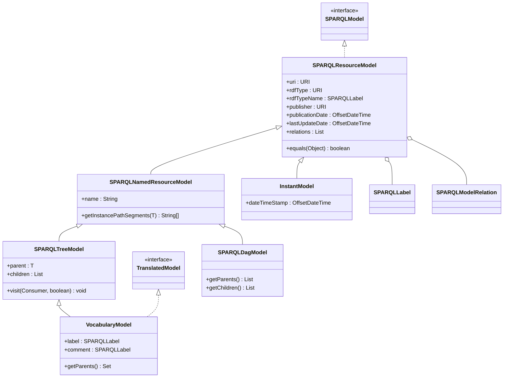
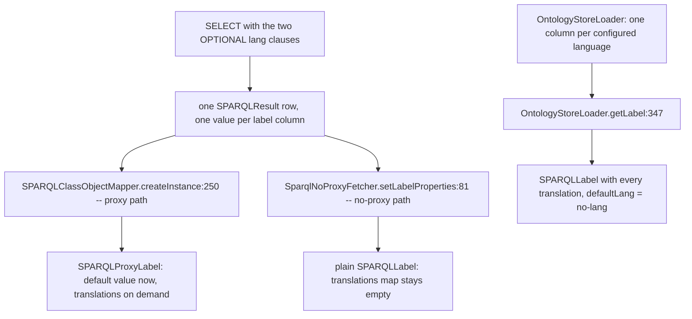
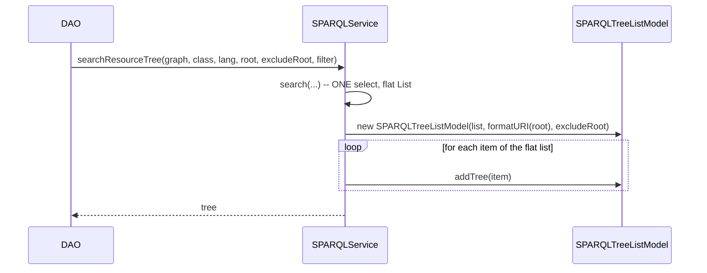
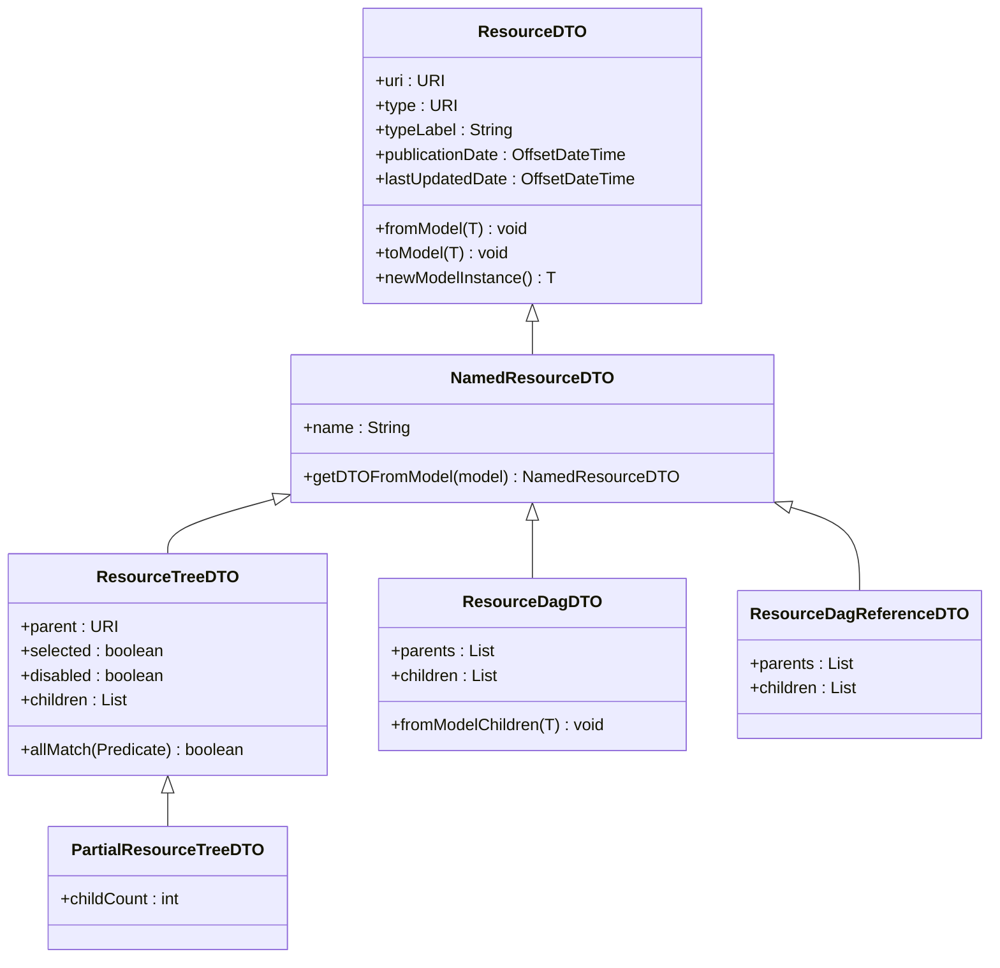
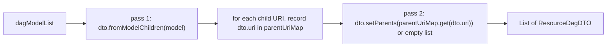

# Technical documentation : [`sparql`] Models and response DTOs

**Document history (please add a line when you edit the document)**

| Date       | Editor(s)        | OpenSILEX version | Comment           |
|------------|------------------|-------------------|-------------------|
| 2026-09-11 | Arnaud Charleroy | BUILD-SNAPSHOT    | Document creation |

## Table of contents

<!-- TOC -->
- [Purpose](#purpose)
- [Key classes](#key-classes)
- [The model hierarchy](#the-model-hierarchy)
  - [What each base class gives you and demands of you](#what-each-base-class-gives-you-and-demands-of-you)
  - [The parent/children shadowing pattern](#the-parentchildren-shadowing-pattern)
  - [equals and hashCode](#equals-and-hashcode)
- [SPARQLLabel and the translation mechanism](#sparqllabel-and-the-translation-mechanism)
  - [Storage](#storage)
  - [The two-OPTIONAL trick](#the-two-optional-trick)
  - [The three read paths](#the-three-read-paths)
  - [The write path](#the-write-path)
  - [String name versus SPARQLLabel](#string-name-versus-sparqllabel)
- [Trees and DAGs](#trees-and-dags)
  - [From a flat result list to a tree](#from-a-flat-result-list-to-a-tree)
  - [Roots, excludeRoot and selection](#roots-excluderoot-and-selection)
  - [Complexity](#complexity)
  - [The partial tree](#the-partial-tree)
  - [DAGs and the jgrapht graph](#dags-and-the-jgrapht-graph)
- [The response package](#the-response-package)
  - [From model to DTO](#from-model-to-dto)
  - [Tree DTOs](#tree-dtos)
  - [ResourceDagDTOBuilder](#resourcedagdtobuilder)
  - [Response envelopes](#response-envelopes)
  - [JSON naming convention](#json-naming-convention)
- [Extension points](#extension-points)
- [Gotchas and invariants](#gotchas-and-invariants)
- [See also](#see-also)
<!-- TOC -->

## Purpose

This is the part of the ORM a developer touches every day: the base classes an annotated model
extends, and the base DTOs an API resource returns. The `model` package defines what "a mapped RDF
resource" means in Java — a URI, an `rdf:type`, three metadata fields, a bag of untyped relations —
plus three specialisations for shapes the platform keeps re-encountering: a named resource, a tree
node and a DAG node. The `response` package defines the reverse translation: how a model becomes
JSON with stable field names, and how a hierarchy of models becomes the nested JSON the front-end
tree components consume directly.

## Key classes

| Class | File | Role |
|---|---|---|
| `SPARQLModel` | [SPARQLModel.java](../../../../../../../opensilex-sparql/src/main/java/org/opensilex/sparql/model/SPARQLModel.java) | Empty marker interface; the only thing all mapped classes share nominally |
| `SPARQLResourceModel` | [SPARQLResourceModel.java](../../../../../../../opensilex-sparql/src/main/java/org/opensilex/sparql/model/SPARQLResourceModel.java) | The root model: `uri`, `rdfType`, `rdfTypeName`, the three DCTerms metadata fields, `relations`, `equals`/`hashCode` |
| `SPARQLNamedResourceModel` | [SPARQLNamedResourceModel.java](../../../../../../../opensilex-sparql/src/main/java/org/opensilex/sparql/model/SPARQLNamedResourceModel.java) | Adds a mono-lingual `name` on `rdfs:label` and a default URI-generation strategy |
| `SPARQLTreeModel` | [SPARQLTreeModel.java](../../../../../../../opensilex-sparql/src/main/java/org/opensilex/sparql/model/SPARQLTreeModel.java) | A single-parent / many-children node, plus `visit` and `getNodes` |
| `SPARQLDagModel` | [SPARQLDagModel.java](../../../../../../../opensilex-sparql/src/main/java/org/opensilex/sparql/model/SPARQLDagModel.java) | A many-parents / many-children node; abstract accessors only, no fields |
| `SPARQLTreeListModel` | [SPARQLTreeListModel.java](../../../../../../../opensilex-sparql/src/main/java/org/opensilex/sparql/model/SPARQLTreeListModel.java) | Turns a flat `List` of tree nodes into a navigable parent/children index |
| `SPARQLPartialTreeListModel` | [SPARQLPartialTreeListModel.java](../../../../../../../opensilex-sparql/src/main/java/org/opensilex/sparql/model/SPARQLPartialTreeListModel.java) | Same, but loads children on demand and remembers the *total* child count |
| `SPARQLLabel` | [SPARQLLabel.java](../../../../../../../opensilex-sparql/src/main/java/org/opensilex/sparql/model/SPARQLLabel.java) | A multilingual literal: one default value plus a lang-to-value map |
| `SPARQLModelRelation` | [SPARQLModelRelation.java](../../../../../../../opensilex-sparql/src/main/java/org/opensilex/sparql/model/SPARQLModelRelation.java) | One untyped triple attached to a model (graph, property, Java type, string value, reverse flag) |
| `TranslatedModel` | [TranslatedModel.java](../../../../../../../opensilex-sparql/src/main/java/org/opensilex/sparql/model/TranslatedModel.java) | Interface: "this model carries a `SPARQLLabel` label and comment" |
| `VocabularyModel` | [VocabularyModel.java](../../../../../../../opensilex-sparql/src/main/java/org/opensilex/sparql/model/VocabularyModel.java) | A tree node whose name *is* a translated label; base of `ClassModel` and the property models |
| `Time` | [Time.java](../../../../../../../opensilex-sparql/src/main/java/org/opensilex/sparql/model/time/Time.java) | Jena-style vocabulary holder for OWL-Time (`time:Instant`, `time:hasBeginning`, …) |
| `InstantModel` | [InstantModel.java](../../../../../../../opensilex-sparql/src/main/java/org/opensilex/sparql/model/time/InstantModel.java) | The only concrete model in the `model` package: a `time:Instant` with an `xsd:dateTimeStamp` |
| `ResourceDTO` | [ResourceDTO.java](../../../../../../../opensilex-sparql/src/main/java/org/opensilex/sparql/response/ResourceDTO.java) | Abstract base DTO; `fromModel` / `toModel` / `newModelInstance` |
| `NamedResourceDTO` | [NamedResourceDTO.java](../../../../../../../opensilex-sparql/src/main/java/org/opensilex/sparql/response/NamedResourceDTO.java) | Adds `name`; the DTO most API resources extend |
| `ObjectNamedResourceDTO` | [ObjectNamedResourceDTO.java](../../../../../../../opensilex-sparql/src/main/java/org/opensilex/sparql/response/ObjectNamedResourceDTO.java) | A second, unrelated `uri` + `name` DTO with no model-conversion contract |
| `ResourceTreeDTO` | [ResourceTreeDTO.java](../../../../../../../opensilex-sparql/src/main/java/org/opensilex/sparql/response/ResourceTreeDTO.java) | Nested tree-node DTO plus the recursive `fromResourceTree` builders |
| `PartialResourceTreeDTO` | [PartialResourceTreeDTO.java](../../../../../../../opensilex-sparql/src/main/java/org/opensilex/sparql/response/PartialResourceTreeDTO.java) | `ResourceTreeDTO` plus `child_count` |
| `ResourceDagDTO` | [ResourceDagDTO.java](../../../../../../../opensilex-sparql/src/main/java/org/opensilex/sparql/response/ResourceDagDTO.java) | DAG-node DTO carrying parents and children as plain URI lists |
| `ResourceDagReferenceDTO` | [ResourceDagReferenceDTO.java](../../../../../../../opensilex-sparql/src/main/java/org/opensilex/sparql/response/ResourceDagReferenceDTO.java) | Same, but parents and children are full `NamedResourceDTO` objects |
| `ResourceDagDTOBuilder` | [ResourceDagDTOBuilder.java](../../../../../../../opensilex-sparql/src/main/java/org/opensilex/sparql/response/ResourceDagDTOBuilder.java) | Builds a whole list of `ResourceDagDTO` and derives `parents` in memory |
| `ResourceTreeResponse` | [ResourceTreeResponse.java](../../../../../../../opensilex-sparql/src/main/java/org/opensilex/sparql/response/ResourceTreeResponse.java) | Envelope: `result` is a `List` of `ResourceTreeDTO`, no metadata |
| `PartialResourceTreeResponse` | [PartialResourceTreeResponse.java](../../../../../../../opensilex-sparql/src/main/java/org/opensilex/sparql/response/PartialResourceTreeResponse.java) | Same for `PartialResourceTreeDTO` |
| `NamedResourcePaginatedListResponse` | [NamedResourcePaginatedListResponse.java](../../../../../../../opensilex-sparql/src/main/java/org/opensilex/sparql/response/NamedResourcePaginatedListResponse.java) | Envelope: converts a `ListWithPagination` of models straight into `NamedResourceDTO` |
| `CreatedUriResponse` | [CreatedUriResponse.java](../../../../../../../opensilex-sparql/src/main/java/org/opensilex/sparql/response/CreatedUriResponse.java) | HTTP 201 envelope that warns when the created URI uses an unknown prefix |

## The model hierarchy



About 100 files in the repository declare `extends SPARQLResourceModel` and 21 declare
`extends SPARQLNamedResourceModel`. Only three extend `SPARQLTreeModel` outside this module
(`ScientificObjectModel`, `FacilityModel`, `DeviceModel`) and exactly one extends `SPARQLDagModel`
(`OrganizationModel`).

### What each base class gives you and demands of you

| Base class | Gives you | Demands of you |
|---|---|---|
| `SPARQLResourceModel` | `uri` (`@SPARQLResourceURI`), `rdfType` (`@SPARQLTypeRDF`), `rdfTypeName` (`@SPARQLTypeRDFLabel`), `publisher`/`publicationDate`/`lastUpdateDate` on `dcterms:publisher`, `dcterms:issued`, `dcterms:modified`, the `relations` bag, `equals`/`hashCode` on the URI | A `@SPARQLResource` class annotation and a public no-arg constructor. Nothing else |
| `SPARQLNamedResourceModel` | `name` mapped to `rdfs:label` with `ignoreUpdateIfNull = true`, and `ClassURIGenerator` wired so the generated URI path segment is the name | Nothing, unless you want a different URI shape — then override `getInstancePathSegments` |
| `SPARQLTreeModel` | `parent`, `children` (initialised to an empty `ArrayList`), `visit`, `getNodes` | **Redeclare `parent` and `children` in the subclass carrying a `@SPARQLProperty`**; the base fields are deliberately unannotated |
| `SPARQLDagModel` | Two field-name constants and four abstract accessors | Declare the `parents` and `children` fields yourself, annotate them, implement the accessors |
| `VocabularyModel` | `label` and `comment` as `SPARQLLabel` on `rdfs:label` / `rdfs:comment`, and a `getName()` returning the label's default value (or the URI as a last resort) | Implement `getParents()`/`setParents()` over a `Set`, and `@SPARQLIgnore` the inherited `name` so two mappings do not fight over `rdfs:label` — `ClassModel.java:33-34` is the reference |

`SPARQLResourceModel` is itself annotated
`@SPARQLResource(ontology = OWL2.class, resource = "Class", ignoreValidation = true)`. That
annotation exists so the class is mappable at all (see
[annotations and class analysis](./01-annotations-and-class-analysis.md)); it is inherited by any
subclass that forgets to declare its own, which silently maps that subclass to `owl:Class`.

`SPARQLDagModel` declares no fields on purpose: `parents` and `children` are the same RDF predicate
read in the two directions, and only the subclass knows which. `OrganizationModel.java:36-48` shows
the pattern — `oeso:hasPart` with `inverse = true` for `parents`, without it for `children`.

### The parent/children shadowing pattern

`SPARQLTreeModel.parent` and `SPARQLTreeModel.children` carry **no** `@SPARQLProperty`, because the
predicate linking a node to its parent differs per concept: `rdfs:subClassOf` for `ClassModel`,
`rdfs:subPropertyOf` for `DatatypePropertyModel` and `ObjectPropertyModel`, `oeso:isPartOf` for
`ScientificObjectModel`. Those are the subclasses that actually follow the pattern: each redeclares
a field with the same name and annotates it:

```java
// ScientificObjectModel.java:30-35 and :46-53
@SPARQLProperty(ontology = Oeso.class, property = "isPartOf", useDefaultGraph = false)
protected ScientificObjectModel parent;

@SPARQLProperty(ontology = Oeso.class, property = "isPartOf", inverse = true,
                ignoreUpdateIfNull = true, useDefaultGraph = false)
protected List<ScientificObjectModel> children;
```

Java field hiding means there are now **two** `children` fields on one object. It works because
neither subclass overrides `getChildren()`/`setChildren()`, so the analyzer's setter lookup resolves
to the inherited accessor and the *inherited* field is the one actually populated; the shadow field
only holds the annotation. `ClassModel` is the exception: it needs its own `List` type, so its
constructor aliases the two explicitly with `super.children = children` (`ClassModel.java:58`). A
new subclass that reads `this.children` instead of `getChildren()` will read the empty shadow field.

Extending `SPARQLTreeModel` does not by itself make a hierarchy loadable. `FacilityModel` and
`DeviceModel` extend it but redeclare neither `parent` nor `children` and carry no `@SPARQLProperty`
on either, so their hierarchy is never read or written. (`oeso:isHosted` does appear on
`FacilityModel`, at `FacilityModel.java:45-50`, but on an unrelated
`List<OrganizationModel> organizations` field mapped with `inverse = true` — it is not a parent
link.)

### equals and hashCode

`SPARQLResourceModel.java:124-147`:

```java
@Override public int hashCode() {
    int hash = 3;
    hash = 43 * hash + Objects.hashCode(this.uri);
    return hash;
}

@Override public boolean equals(Object obj) {
    if (this == obj) return true;
    if (obj == null) return false;
    if (getClass() != obj.getClass()) return false;
    final SPARQLResourceModel other = (SPARQLResourceModel) obj;
    if (this.uri == null || other.uri == null) return false;
    return SPARQLDeserializers.compareURIs(this.uri, other.uri);
}
```

Three consequences:

1. **`equals` is prefix-insensitive, `hashCode` is not.** `compareURIs` expands both sides through
   the Jena `PrefixMapping` before comparing, so `so:o1` equals `http://…/so#o1`; `hashCode` hashes
   the raw `URI.toString()`, so those two objects land in different buckets. Models are therefore
   **not safe in a `HashSet` or as `HashMap` keys** unless every URI already went through
   `SPARQLDeserializers.formatURI`. `SPARQLTreeListModel.addInMapIfExists` exists to work around it.
2. **Two unsaved models are never equal**, because a null URI short-circuits to `false`.
3. **`getClass() != obj.getClass()`** makes equality asymmetric between a lazily-proxied model and a
   plain one; that side of the story is in
   [proxies and lazy loading](./04-proxies-and-lazy-loading.md).

## SPARQLLabel and the translation mechanism

`SPARQLLabel` holds a `defaultValue`, the `defaultLang` that value was selected for, and a
`translations` map of the *other* languages. `getAllTranslations()` merges the two by copying
`translations` then adding `defaultLang -> defaultValue` on top (`SPARQLLabel.java:72-79`) — the
default pair wins on conflict. `toString()` returns `defaultValue`, which is what lets a label be
used wherever a `String` was expected.

### Storage

No reification, no auxiliary resource: one language is one triple with a language-tagged literal.

```turtle
test:c1 test:hasLabel "testCreateFR"@fr .
test:c1 test:hasLabel "testCreateEN"@en .
```

A field is a *label property* — as opposed to a data property — purely because its Java type is
`SPARQLLabel`; `SPARQLClassAnalyzer.java:294` classifies it. Two shapes are rejected outright: a
`List<SPARQLLabel>` (`SPARQLClassAnalyzer.java:274`) and a label on a reverse relation
(`SPARQLClassAnalyzer.java:354`). The generated SHACL shape adds `sh:uniqueLang true` for every
label property (`SPARQLClassQueryBuilder.java:1169-1175`), so the store itself enforces at most one
literal per language.

### The two-OPTIONAL trick

A single `FILTER langMatches(lang(?x), "fr")` returns nothing when only an untagged literal exists.
`SPARQLClassQueryBuilder.addSelectProperty` (`SPARQLClassQueryBuilder.java:703-720`) therefore emits
the clause **twice** when a language is requested for an *optional* non-object field: once filtered
on the requested language, once on the empty language. Both bind the same variable and both are
`OPTIONAL`, so at most one row comes back, preferring the requested language. The same shape is
produced for the `rdfTypeName` column by `addOptionalLangClauseOrDefault`
(`SPARQLClassQueryBuilder.java:933-936`).

Reconstructed from the builder, `sparql.search(C.class, "fr")` on the test model
[C.java](../../../../../../../opensilex-sparql/src/test/java/org/opensilex/sparql/model/C.java)
produces:

```sparql
SELECT DISTINCT ?uri ?rdfType ?rdfTypeName ?label
WHERE {
  ?rdfType rdfs:subClassOf* test:C .
  OPTIONAL { ?rdfType rdfs:label ?rdfTypeName . FILTER (langMatches(lang(?rdfTypeName), "fr")) }
  OPTIONAL { ?rdfType rdfs:label ?rdfTypeName . FILTER (langMatches(lang(?rdfTypeName), "")) }
  # C declares graph = "test_data", resolved against the platform base URI
  GRAPH <BASE_URI/test_data> {
    ?uri rdf:type ?rdfType .
    OPTIONAL { ?uri test:hasLabel ?label . FILTER (langMatches(lang(?label), "fr")) }
    OPTIONAL { ?uri test:hasLabel ?label . FILTER (langMatches(lang(?label), "")) }
  }
  FILTER (!isBlank(?uri))
}
```

When the field is **required**, the duplication is skipped in favour of a single disjunctive filter,
`FILTER (langMatches(lang(?x), "fr") || langMatches(lang(?x), ""))`, built by
`SPARQLQueryHelper.langFilterWithDefault` (`SPARQLQueryHelper.java:292-294`) and applied at
`SPARQLClassQueryBuilder.java:877-881`. That filter can match *two* literals, so a required label
holding both a French and an untagged value duplicates the result row. `testMultipleLabelsOptional`
in [SPARQLServiceTest.java](../../../../../../../opensilex-sparql/src/test/java/org/opensilex/sparql/SPARQLServiceTest.java)
pins the observable behaviour: `getOptionalLabel()` follows the requested language,
`getRequiredLabel()` returns the untagged value whatever the language asked for.

### The three read paths



1. **Proxy path** (default). `SPARQLClassObjectMapper.createInstance` wraps the bound value in a
   `SPARQLProxyLabel`. `getDefaultValue()`, `getDefaultLang()` and `toString()` are answered from
   memory; anything else (`getTranslations()`, `getAllTranslations()`) triggers
   `SPARQLService.getTranslations` (`SPARQLService.java:2191-2215`), a
   `SELECT ?value (lang(?value) AS ?lang)` over the one predicate, after which the requested
   language is *removed* from the map so `translations` really holds "the others"
   (`SPARQLProxyLabel.java:37-40`).
2. **No-proxy path.** `SparqlNoProxyFetcher.setLabelProperties` builds a plain
   `new SPARQLLabel(value, lang)` and never fills `translations`. Code needing the full map must not
   use this fetcher.
3. **Ontology store path.** `OntologyStoreLoader` ignores the per-field mechanism: it adds one
   variable per configured platform language (`name_fr`, `name_en`, `name_no_lang`, `comment_fr`, …)
   to a single query and assembles the complete label in `getLabel`
   (`OntologyStoreLoader.java:347-360`). This is how `ClassModel` serves every translation with no
   extra query — see [ontology RAM storage optimization](../ontology-ram-storage-optimization.md).

On top of path 3, `AbstractOntologyStore.handleLang` (`AbstractOntologyStore.java:365-388`) is what
actually applies the `lang` parameter: for `label`, `comment` and `typeLabel` it promotes
`translations.get(lang)` into `defaultValue`/`defaultLang` **only if that language is present**,
leaving the no-lang value in place otherwise. That one method is why `ClassModel.getName()` returns
the right translation.

### The write path

`SPARQLClassQueryBuilder.executeOnInstanceTriples` (`SPARQLClassQueryBuilder.java:1007-1027`)
iterates `label.getAllTranslations()` and emits one quad per entry with
`NodeFactory.createLiteral(value, lang)`:

```sparql
INSERT DATA {
  GRAPH <BASE_URI/test_data> {
    test:c1 test:hasLabel "testCreateFR"@fr .
    test:c1 test:hasLabel "testCreateEN"@en .
  }
}
```

The language keys come from the map, so writing a label means writing *every* language you hold — a
partially-loaded label silently drops the translations it does not carry. `SPARQLLabel.fromMap`
(`SPARQLLabel.java:94-99`) is the intended way to build a label from a client payload
(`RDFPropertyDTO.java:227-228`): it fills only `translations`, leaving `defaultValue`/`defaultLang`
null, which round-trips correctly through `getAllTranslations()` even though `toString()` returns
`null` on such a label.

### String name versus SPARQLLabel

The module maps `rdfs:label` in two incompatible ways, and picking the wrong one is the most common
modelling mistake here:

- `SPARQLNamedResourceModel.name` is a **`String`** data property. Data properties are queried with
  `lang = null` (`SPARQLClassQueryBuilder.java:168`), i.e. **with no language filter at all**. A
  resource with two `rdfs:label` literals in different languages therefore produces two result rows,
  and `DISTINCT` cannot collapse them because the `name` column differs. Instance names in
  OpenSILEX are mono-lingual free text by convention, which is why this has never bitten; the reason
  the filter is omitted is not documented in the code.
- `VocabularyModel.label` is a **`SPARQLLabel`** label property, queried with the machinery above.
  Ontology terms are genuinely multilingual, so they use this.

A class must not use both on the same predicate: `ClassModel` inherits `name` and neutralises it
with `@SPARQLIgnore` (`ClassModel.java:33-34`), re-deriving `getName()` from the label.

## Trees and DAGs

### From a flat result list to a tree

`SPARQLTreeListModel` is not a node type: it is an *index* built over an already-fetched flat list.
It holds `modelsByParent` (parent URI to child set, the `null` key holding the roots) and
`parentByModel`, and never queries anything.



`addTreeWithParent` (`SPARQLTreeListModel.java:95-122`) is the whole algorithm:

1. Format the instance URI. If `modelsByParent` already has a bucket keyed by it, return — the node
   was inserted earlier by the recursion in step 4, and owning a bucket is the "already processed"
   flag.
2. If the instance has no parent, or *is* the declared root, insert it under the `null` key (unless
   `excludeRoot` is set and a parent exists).
3. Otherwise format the parent URI; if the parent is the root and `excludeRoot` is set, rewrite that
   key to `null`, so the children of the excluded root become the new roots.
4. If no bucket exists for the parent yet, **recurse into `addTree(parent)` first**, then create the
   bucket. This lets a child pull in an ancestor the flat result list did not contain — the `parent`
   field of a loaded model is a proxy carrying at least a URI.
5. Insert through `addInMapIfExists`, which linearly scans the sibling bucket comparing
   `SPARQLDeserializers.compareURIs` rather than relying on `HashSet.contains`. That loop is the
   deduplication guarantee, and it exists because `SPARQLResourceModel.hashCode` is prefix-sensitive
   while `equals` is not.

Step 4 has **no cycle detection**. A cyclic parent chain — which RDF permits and nothing on the
loading path rejects — recurses until the stack overflows.

`SPARQLTreeModel` offers the complementary in-memory traversal: `visit(consumer, includeThis)` walks
the `children` lists depth-first and `getNodes(false)` flattens the subtree. The
`SPARQLTreeListModel(T rootModel, …)` constructor uses exactly that to invert the relationship —
flatten an already-linked model tree, then re-index it — which is how `AbstractOntologyStore` serves
`searchSubClasses` without touching the triple store (`AbstractOntologyStore.java:421-427`).

### Roots, excludeRoot and selection

`listRoots(handler)` is `listChildren(null, handler)`, `getRootsCount()` is `getChildCount(null)`,
and `traverse(handler)` is a DFS over the index — used by `OntologyDAO.searchSubClasses` to apply a
per-node handler after the tree is built.

`excludeRoot = true` means "return the sub-forest below the root", implemented by rewriting the
root's children onto the `null` parent key rather than by removing the root afterwards.
`OntologyAPI.getSubClassesOf` exposes it as the `ignoreRootClasses` query parameter.

`selectionList` and `isSelected` serve the front-end's "pre-checked nodes" case. The constructor
stores **formatted** URIs (`SPARQLTreeListModel.java:34`) but `isSelected` looks up the **raw** URI
through `List.contains`, i.e. exact `URI.equals` (`SPARQLTreeListModel.java:138-140`), so it only
works when the caller's URIs are already canonical. No caller in `opensilex-core`,
`opensilex-security` or `opensilex-phis` passes `enableSelection = true` today.

### Complexity

| Operation | Cost |
|---|---|
| `new SPARQLTreeListModel(list, …)` | O(n) |
| `addTree` over the whole list | O(n · s) `compareURIs` calls, s being the largest sibling count; O(n²) for a flat hierarchy, and each `compareURIs` expands both prefixes |
| `traverse` / `ResourceTreeDTO.fromResourceTree` | O(n), recursion depth equal to the tree depth |
| `SPARQLPartialTreeListModel.loadChildren` | one SELECT per visited node |
| `PartialResourceTreeDTO.fromResourceTree` | one COUNT per node, memoised per URI |

One SELECT plus an O(n²)-worst-case in-memory index was chosen over a recursive SPARQL property
path; the reason is not documented in the code, but the index is also what makes `excludeRoot` and
the arbitrary per-field filters of `searchResourceTree` possible.

### The partial tree

"Partial" means the index deliberately holds a *bounded slice* of the hierarchy, while each node
still reports how many children it has in the store. `SPARQLPartialTreeListModel` takes two lambdas
— a `searchHandler` returning the direct children of a URI and a `countHandler` returning their
number — and `loadChildren(candidate, parent, maxDepth)` descends `maxDepth` levels, one search per
node. `getTotalChildCount` memoises the count in `countCache`, and `PartialResourceTreeDTO`
serialises it as `child_count`, so the front-end can draw an expandable node with the right badge
and fetch the subtree later.

**This family is dead code.** `SPARQLPartialTreeListModel`, `PartialResourceTreeDTO` and
`PartialResourceTreeResponse` have no caller anywhere in the repository — not in the back end, not
in the generated front-end clients. It is a complete, coherent lazy-tree API that nothing uses.
Note also that the constructor hard-codes `excludeRoot = false` and an empty selection list, so
`isSelected` is always `false` and the `enableSelection` flag of
`PartialResourceTreeDTO.fromResourceTree` has no effect.

### DAGs and the jgrapht graph

Two different mechanisms answer to the word "DAG", and they do not meet.

**`SPARQLDagModel`** is the API-facing one. A DAG node simply exposes both directions of one
predicate as lists; nothing in the model package validates acyclicity or closes the graph. All the
graph logic lives in `ResourceDagDTOBuilder`, in memory, at DTO-building time.

**jgrapht** is used only by the ontology store, over URI strings rather than models.
`DefaultOntologyStore` instantiates a `SimpleDirectedGraph<String, DefaultEdge>`
(`DefaultOntologyStore.java:26`) — a plain directed graph, *not* jgrapht's `DirectedAcyclicGraph`, so
a cyclic `rdfs:subClassOf` is structurally accepted.
`AbstractOntologyStore.addEdgeBetweenParentAndClass` adds one edge per parent link, and
[JgraphtUtils](../../../../../../../opensilex-sparql/src/main/java/org/opensilex/sparql/utils/JgraphtUtils.java)`.getVertexesFromAncestor`
answers the only question ever asked of it: "which vertices lie on some path from this ancestor down
to this class?". It does so with `AllDirectedPaths.getAllPaths(ancestor, descendant, true, maxPathLength)`,
which enumerates **every** path and unions their vertex lists — exponential in a densely
multi-inheriting hierarchy, bounded in practice only by `MAX_GRAPH_PATH_LENGTH = 20`
(`AbstractOntologyStore.java:56`). It returns the ancestor and drops the descendant.

The bridge between the real DAG and `SPARQLTreeModel`'s single `parent` field is one line:

```java
// AbstractOntologyStore.java:229-230
classModel.setParents(newParents);
classModel.setParent(classModel.getParents().iterator().next());
```

A class with several `rdfs:subClassOf` parents keeps them all in `parents` (a `Set`), but its
`parent` — the field every tree response is built from — is an arbitrary element of a `HashSet`
iterator. Class trees rendered by the front-end are therefore a **non-deterministic spanning tree**
of the real class DAG. That is the deepest reason the response package needs both a tree DTO family
and a DAG DTO family.

## The response package

### From model to DTO



`ResourceDTO` fixes the three-method contract every OpenSILEX DTO follows:

- `fromModel(model)` — model to DTO. The base copies `uri`, `type`, the *default value* of the type
  label, and the two dates when non-null. Flattening `rdfTypeName` to a single `String`
  (`ResourceDTO.java:86-88`) is where multilinguality is lost: the generic DTOs never expose a
  translation map. Endpoints needing one declare it explicitly, e.g.
  `RDFTypeTranslatedDTO.name_translations`.
- `toModel(model)` — DTO to model. It copies **only** `uri` and `type`; `NamedResourceDTO` adds
  `name`. The metadata dates are deliberately not copied back, since the server owns them (see
  [metadata](../metadata.md)).
- `newModelInstance()` — abstract factory, called by `newModel()` before `toModel`. Every concrete
  DTO must override it: `NamedResourceDTO`'s own implementation returns a bare
  `new SPARQLNamedResourceModel()` cast to `T` (`NamedResourceDTO.java:39-41`), which throws a
  `ClassCastException` at the call site if a subclass forgets.

Real subclass, from `opensilex-core`:

```java
public class ScientificObjectNodeDTO extends NamedResourceDTO<ScientificObjectModel> {
    @JsonProperty("creation_date")
    private LocalDate creationDate;

    @Override
    public ScientificObjectModel newModelInstance() { return new ScientificObjectModel(); }

    public static ScientificObjectNodeDTO getDTOFromModel(ScientificObjectModel model) {
        ScientificObjectNodeDTO dto = new ScientificObjectNodeDTO();
        dto.fromModel(model);                       // uri, rdf_type, rdf_type_name, name, dates
        dto.setCreationDate(model.getCreationDate());
        return dto;
    }
}
```

The `static getDTOFromModel` convention matters beyond style: it is the method reference
`ListWithPagination.convert` needs, and `NamedResourcePaginatedListResponse` hard-wires
`NamedResourceDTO::getDTOFromModel`.

`ObjectNamedResourceDTO` is a parallel, simpler family: `uri` + `name`, an explicit `@JsonProperty`
on both, a model-taking constructor instead of `fromModel`, and no `rdf_type`. It is what a DTO
extends when it must stay small — `BaseVariableGetDTO`, `FacilityNamedDTO` — and it shares no
supertype with `ResourceDTO`.

### Tree DTOs

`ResourceTreeDTO.fromResourceTree` walks a `SPARQLTreeListModel` and mirrors it into nested DTOs
(`ResourceTreeDTO.java:132-151`): one DTO per node, `parent` set to the parent's URI by the caller of
the recursion, `children` filled from `tree.listChildren`. An optional
`BiConsumer<T, ResourceTreeDTO>` handler runs **after** the children are attached, which is how
`opensilex-core` enriches nodes (setting `disabled`, for instance) without subclassing. The overload
taking a `Collection` of trees lets `OntologyAPI` merge the data-property and object-property trees
into one response. `allMatch` and `visit` are recursive helpers for callers, not for the ORM;
`OntologyAPI.java:478-487` uses them to deduplicate properties across RDF types.

The typical endpoint is three lines:

```java
// OntologyAPI.java:112-115
SPARQLTreeListModel<ClassModel> treeList = ontologyStore.searchSubClasses(
        parentClass, stringPattern, currentUser.getLanguage(), ignoreRootClasses);
List<ResourceTreeDTO> treeDto = ResourceTreeDTO.fromResourceTree(treeList);
return new ResourceTreeResponse(treeDto).getResponse();
```

### ResourceDagDTOBuilder

A DAG cannot be mirrored the way a tree can, because a node has several parents and the JSON must
stay acyclic. The builder's answer: serialise nodes **flat**, with parents and children as URI
lists, and derive the parent lists in memory.



`fromModelChildren` (`ResourceDagDTO.java:43-52`) reads `model.getChildren()` and nothing else, so
the builder touches **one** lazy collection per node instead of two and never resolves a parent's
name — that is the efficiency claim in its javadoc. The consequence is semantic, not only
performance: `parents` is computed exclusively from the children edges *present in the submitted
list*, so a filtered search returns a DAG closed over its own result set, and a parent excluded by
the filter simply does not appear in its child's `parents`.

Subclassing is the intended way to emit a richer node type; the single hook is `instanciateDto()`
(note the spelling):

```java
public class OrganizationDagDTOBuilder extends ResourceDagDTOBuilder<OrganizationModel> {
    public OrganizationDagDTOBuilder(List<OrganizationModel> dagModelList) { super(dagModelList); }

    @Override
    protected ResourceDagDTO<OrganizationModel> instanciateDto() { return new OrganizationDagDTO(); }
}
```

Neither DAG DTO writes its edges back: `ResourceDagDTO` does not override `toModel`, so the
inherited one copies `uri`, `rdf_type` and `name` only. Turning a `parents` URI list into models is
each API's own job — `OrganizationDTO.toModel` is the reference implementation.

`ResourceDagReferenceDTO` is the opposite trade-off: `parents` and `children` are full
`NamedResourceDTO` objects, so the client gets names without a second round-trip, at the cost of
dereferencing every neighbour. It backs the single-organisation GET (`OrganizationGetDTO`), never a
list.

### Response envelopes

| Envelope | Body | Metadata |
|---|---|---|
| `ResourceTreeResponse` | `result` is a `List` of `ResourceTreeDTO` | none |
| `PartialResourceTreeResponse` | `result` is a `List` of `PartialResourceTreeDTO` | none |
| `NamedResourcePaginatedListResponse` | `result` is a `List` of `NamedResourceDTO`, converted from a `ListWithPagination` of models | `pagination` (page size, page, total) |
| `CreatedUriResponse` | HTTP 201, `result` is the created URI or URI list | a `WARNING` status when the URI's prefix is unknown |

`CreatedUriResponse` is the only envelope here with real logic. For each created URI it calls
`URIDeserializer.hasKnownPrefix`; if the prefix is unregistered **and** the URI has no authority
(i.e. it really is `prefix:local`, not `http://…`), it appends a translatable warning keyed
`server.warnings.unknown-prefix` (`CreatedUriResponse.java:50-58`) telling the operator they
probably forgot a namespace declaration in the triple store, or need to restart the instance — the
prefix map is loaded once at startup. 26 files in the repository use it.

The tree responses extend `JsonResponse` directly rather than `PaginatedListResponse`: a tree has no
meaningful page, so the envelope has no `metadata` block at all. Front-end code must not expect one.

### JSON naming convention

The wire format is **snake_case**, but it is not produced by a global Jackson naming strategy — there
is none in the repository. Each multi-word field carries a hand-written `@JsonProperty`; single-word
fields are serialised under their Java name unchanged.

| Java field | JSON name | Declared in |
|---|---|---|
| `uri` | `uri` | `ResourceDTO` (no annotation) |
| `type` | `rdf_type` | `ResourceDTO.java:23` |
| `typeLabel` | `rdf_type_name` | `ResourceDTO.java:26` |
| `publicationDate` | `publication_date` | `ResourceDTO.java:29` |
| `lastUpdatedDate` | `last_updated_date` | `ResourceDTO.java:32` |
| `name` | `name` | `NamedResourceDTO` (no annotation) |
| `parent`, `selected`, `disabled`, `children` | same | `ResourceTreeDTO` (no annotation) |
| `childCount` | `child_count` | `PartialResourceTreeDTO.java:21` |
| `parents`, `children` | same | `ResourceDagDTO`, `ResourceDagReferenceDTO` (no annotation) |

The generated TypeScript client is the authoritative check:

```typescript
// opensilex-core/front/src/lib/model/resourceTreeDTO.ts -- generated from the Swagger schema
export interface ResourceTreeDTO {
    uri?: string;
    name?: string;
    parent?: string;
    selected?: boolean;
    disabled?: boolean;
    children?: Array<ResourceTreeDTO>;
    rdf_type?: string;
    rdf_type_name?: string;
    publication_date?: Date;
    last_updated_date?: Date;
}
```

So the rule for a new field is: **keep the Java field camelCase and add `@JsonProperty` with the
snake_case name** whenever the name has more than one word. Renaming a Java field without touching
its `@JsonProperty` is a no-op on the wire; the reverse silently breaks every client.

Note that `ResourceDTO` has **no `publisher` field**, only the two dates. Concrete DTOs that show a
publisher declare it themselves as a `UserGetDTO` (`OrganizationGetDTO.java:40`,
`ScientificObjectDetailDTO.java:41-42`), because the model stores a URI while the API returns a
resolved user object.

## Extension points

- **A new plain model** extends `SPARQLResourceModel` (or `SPARQLNamedResourceModel` if it has a
  name), adds `@SPARQLResource` and a public no-arg constructor. Declare a
  `public static final String XXX_FIELD` constant for every field you will reference from a query
  builder — the whole module addresses fields by name.
- **A new tree model** extends `SPARQLTreeModel<Self>` and *must* redeclare `parent` and `children`
  with the predicate linking them, `inverse = true` on one of the two. Do not override
  `getChildren`/`setChildren` unless you also alias the inherited field.
- **A new DAG model** extends `SPARQLDagModel<Self>`, declares and annotates `parents` and
  `children`, and implements the four abstract accessors.
- **A translated model** implements `TranslatedModel`, in practice by extending `VocabularyModel`,
  which is also what makes it loadable by the ontology store.
- **A new DTO** extends `NamedResourceDTO<YourModel>`, overrides `newModelInstance()`, and adds a
  `static getDTOFromModel` that calls `fromModel` then fills the extra fields. Override `fromModel`
  instead only when the extra fields must be filled on every conversion path.
- **A richer DAG node** subclasses `ResourceDagDTOBuilder` and overrides `instanciateDto()`.
- **Extra work per tree node** is injected through the `BiConsumer<T, ResourceTreeDTO>` handler of
  `ResourceTreeDTO.fromResourceTree` — no subclass needed.
- **`SPARQLLabel`, `SPARQLModelRelation`, `SPARQLTreeListModel` and `JgraphtUtils` are closed.**
  `SPARQLTreeListModel` is not abstract but its two maps are private and final; the only supported
  extension is the (unused) `SPARQLPartialTreeListModel`.

## Gotchas and invariants

- **`hashCode` and `equals` disagree on URI form** (`SPARQLResourceModel.java:124-147`). Never put
  models in a `HashSet` or use them as `HashMap` keys unless every URI went through
  `SPARQLDeserializers.formatURI`. This is why `SPARQLTreeListModel.addInMapIfExists` scans its
  `HashSet` linearly instead of calling `contains`; remove that loop and duplicate nodes reappear.
- **Two models with a null URI are never equal**, so a freshly built model is not equal to its own
  copy. Tests asserting on model equality must set URIs first.
- **`ResourceDagReferenceDTO.toModel` fills `children` from `getParents()`**
  (`ResourceDagReferenceDTO.java:46-50`) — a copy-paste bug. It is latent only because the single
  subclass, `OrganizationGetDTO`, is read-only; the organisation write path goes through
  `OrganizationDTO extends ResourceDagDTO`, which overrides `toModel` itself.
- **`ResourceTreeDTO` overrides `equals` but not `hashCode`** (`ResourceTreeDTO.java:153-166`), so
  the inherited identity `hashCode` is used. `OntologyAPI.java:481` puts these DTOs in a `HashSet`,
  where the override has no effect and nothing is deduplicated.
- **`ResourceTreeDTO` inherits `newModelInstance()` from `NamedResourceDTO`**, which returns a bare
  `SPARQLNamedResourceModel` cast to `SPARQLTreeModel<?>`. Calling `newModel()` on a tree DTO throws
  `ClassCastException`. Nothing calls it; do not start.
- **A proxied label reports the requested language, not the language of the value it returns.**
  `SPARQLProxyLabel.invoke` answers `getDefaultLang()` with the language that was asked for
  (`SPARQLProxyLabel.java:48-49`), while `getDefaultValue()` returns whatever the query bound, which
  the fallback filter may have taken from the untagged literal. `testLabel` pins it:
  `sparql.search(C.class, "ru")` returns a label whose `getDefaultLang()` is `"ru"` although no
  Russian literal exists.
- **`getAllTranslations()` on a no-proxy-fetched label returns a single entry**, because
  `SparqlNoProxyFetcher.setLabelProperties` never fills the map. The same getter behaves differently
  depending on the fetching strategy, silently — and a read-modify-write cycle through that fetcher
  deletes the translations that were never loaded.
- **Plain `String` fields are never language-filtered**, `SPARQLNamedResourceModel.name` on
  `rdfs:label` included (`SPARQLClassQueryBuilder.java:168` passes `lang = null` for data
  properties). A resource with two language-tagged labels duplicates every result row. The reason is
  not documented in the code.
- **Required label properties can match two literals.** `langFilterWithDefault` is a disjunction of
  the requested and the empty language (`SPARQLQueryHelper.java:292-294`); the javadoc of its caller
  warns "Do not use this method if you want only one value"
  (`SPARQLClassQueryBuilder.java:873-876`).
- **A multi-parent class silently becomes a single-parent tree node** at
  `AbstractOntologyStore.java:230`, picking an arbitrary `HashSet` element. Two runs over the same
  data can produce different class trees.
- **`SPARQLTreeListModel.addTreeWithParent` has no cycle guard**, and `DefaultOntologyStore` uses a
  `SimpleDirectedGraph` rather than a `DirectedAcyclicGraph`, so nothing upstream rejects a cycle
  either. A cyclic hierarchy overflows the stack.
- **`SPARQLTreeListModel.isSelected` compares a raw URI against formatted URIs**
  (`SPARQLTreeListModel.java:34` versus `:139`) and returns `false` for a selection expressed in the
  other URI form. `SPARQLPartialTreeListModel.countCache` has the same defect: it is keyed on the
  unformatted URI (`SPARQLPartialTreeListModel.java:33-36`).
- **The whole partial-tree family is unreferenced.** Before extending it, check whether the
  lazy-tree feature is still wanted; before deleting it, note that `child_count` is a designed
  front-end contract, not an accident.
- **`SPARQLTreeModel`'s generic bound is inconsistent with `SPARQLDagModel`'s.** `SPARQLTreeModel<T>`
  extends `SPARQLNamedResourceModel<SPARQLTreeModel<T>>` while `SPARQLDagModel<T>` extends
  `SPARQLNamedResourceModel<T>`. That is why `ScientificObjectModel` must declare
  `implements ClassURIGenerator<SPARQLTreeModel<ScientificObjectModel>>` rather than
  `ClassURIGenerator<ScientificObjectModel>`. `SPARQLNamedResourceModel`'s own bound uses a raw type
  (`T extends SPARQLNamedResourceModel`), so the compiler does not object.
- **`ResourceDTO.publicationDate` and `lastUpdatedDate` are `private` while `type` and `typeLabel`
  are `protected`.** Several DTOs across the modules redeclare `type`/`typeLabel` with the same
  `@JsonProperty` — `GroupGetDTO.java:29-33` in `opensilex-security`, for instance — hiding the
  inherited fields. Serialisation still works because Jackson goes through the inherited getters,
  but a subclass reading `this.type` directly sees `null`.
- **`metadata.md` is out of date on the DTO side.** It states the publisher "is stored as
  `UserGetDTO`" in the DTO; `ResourceDTO` has no publisher field at all, and each concrete DTO
  declares its own.
- **`InstantModel.generateURI` rewrites the prefix**, replacing the substring `event` with `instant`
  in the caller-supplied prefix (`InstantModel.java:49-52`), so an instant created under an
  unrelated prefix containing the word "event" is renamed unexpectedly.

## See also

- [ORM architecture overview](../orm-architecture.md) — where models and DTOs sit in the pipeline.
- [Annotations and class analysis](./01-annotations-and-class-analysis.md) — what
  `@SPARQLProperty` / `@SPARQLIgnore` do to these fields, and the label-field validation rules.
- [Object mapper and index](./02-object-mapper-and-index.md) — `createInstance`, where the label
  proxies are installed.
- [Query generation](./03-query-generation.md) — the full SELECT/COUNT/ASK shape the lang clauses
  above belong to.
- [Proxies and lazy loading](./04-proxies-and-lazy-loading.md) — `SPARQLProxyLabel`, the lazy
  `children` lists, and the equals asymmetry.
- [SPARQLService CRUD](./05-sparql-service-crud.md) — `searchResourceTree`, `getTranslations`, the
  default language.
- [Transactions, URI and validation](./06-transactions-uri-and-validation.md) —
  `ClassURIGenerator` and `getInstancePathSegments`.
- [Ontology store and OWL](./09-ontology-store-and-owl.md) — `VocabularyModel`, `ClassModel`, the
  jgrapht graph and `handleLang` in context.
- [Metadata](../metadata.md) — the publisher / publication date / last update date design.
- [Graph organization](../graph-organization.md) — which named graph a model's triples land in.
