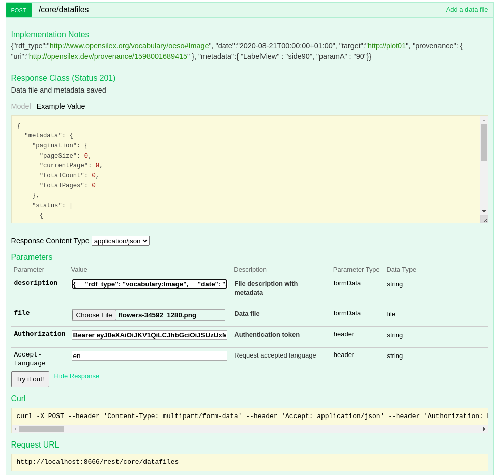
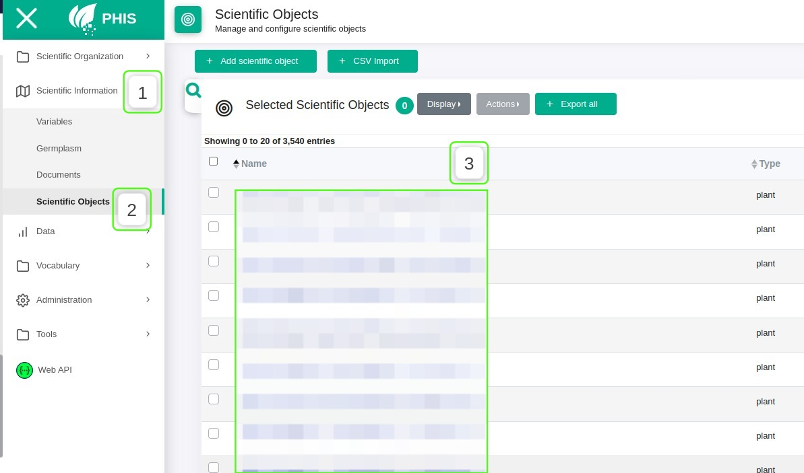
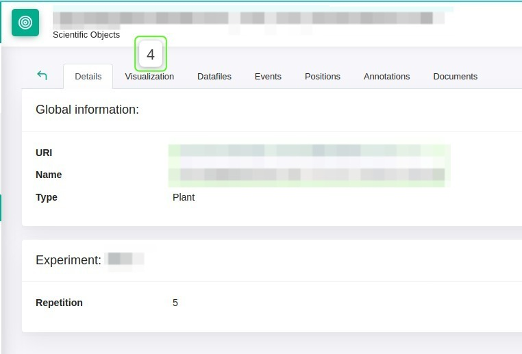
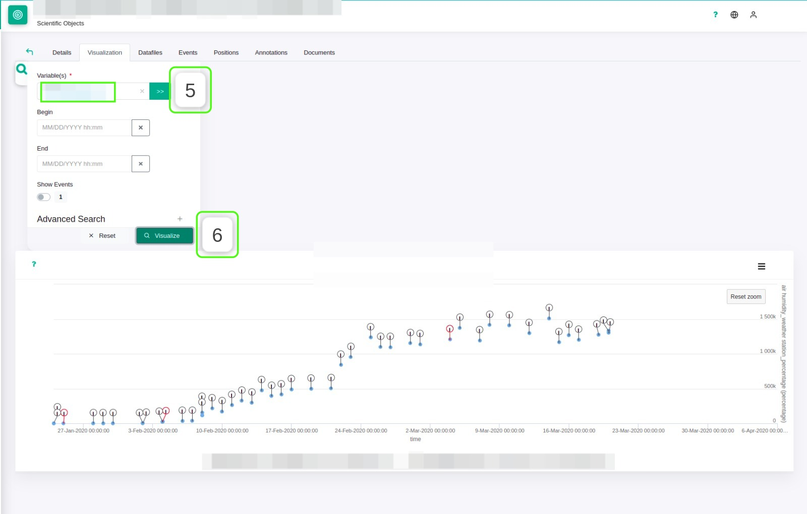

# Data Image

## What is Data Image ?
Data Image is a module allowing to associate an image with a respective data.
To do this, we need a scientific object as a target, a provenance for the data in question, a variable and the description of the image to be associated with the data.

## How to insert an image in OPENSILEX and associate an image to a data?

### 1. Upload the image
First, simply upload the image to the `opensilex-data/` folder on the OPENSILEX server.

### 2. Add the image description
From swagger, you need to add the description of the image using the endpoint ```POST /core/datafiles/description```

To do this, simply use the JSON
```
[
  {
    "rdf_type": "vocabulary:Image",
    "date": "2022-04-28T00:00:00+01:00",
    "provenance": {
      "uri": "Image Provenance"
    },
    "relative_path": "image.webp"
  }
]
```
**_image.webp_** is the name of the image to insert


> #### Another way to proceed for points `{1 and 2}`

- Add the description of the image omitting `"relative_path": "image.webp"`
```
{
    "rdf_type": "vocabulary:Image",
    "date": "2022-04-28T00:00:00+01:00",
    "provenance": {
        "uri": "Image Provenance"
    },
}
```
- Then click on the `Choose File` button to upload the file.<br>


### 3. Image URI
After inserting the description, you need to copy the result and then create the data with the uri of the newly created image.

This image is available in the PHIS datafiles menu.

### 4. Create the data
To create the data associated with the image you have to use the POST endpoint `/core/data` with the JSON:

```
[
  {
    "date": "2022-04-28T00:30:00+02:00",
    "target": "scientific object uri",
    "variable": "variable uri",
    "value": 255.6,
    "provenance": {
      "uri": "Data Provenance",
      "prov_used": [
        {
          "uri": "Datafiles description uri",
          "rdf_type": "vocabulary:Image"
        }
      ]
     
    }
  }
]
```
you must specify in `prov_used` the URI of the image to associate with the data.

## How to test the data image module?
1. Go to the Scientific Information menu
2. Click on Scientific Objects
3. Select the OS in question
   
4. Click on the Visualization tab <br> 
   
5. Select the variable
6. Click on Visualize
   
