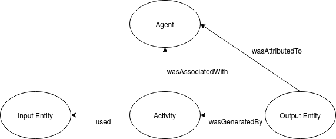
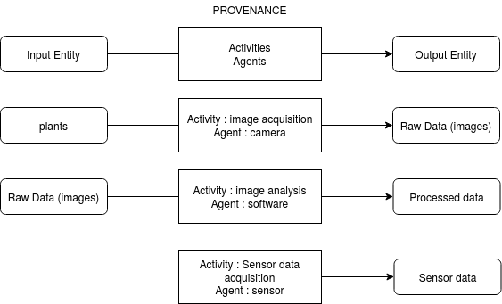

# 1. What is provenance ?

The provenance is the formalization of the transformation of raw data into processed data
The provenance describes a process, a step (or several steps) in a data acquisition workflow. It can describe how raw data have been measured and how processed data have been computed.


# 1. Provenance and Data in OpenSILEX

## 1.1 Provenance concept definition
The provenance is the formalization of the transformation of raw data into processed data
The provenance describes a process, a step (or several steps) in a data acquisition workflow. It can describe how raw data have been measured and how processed data have been computed.

## 1.2 Provenance Model

The provenance model is based on the Provenance Ontology (
[prov-o](https://www.w3.org/TR/prov-o/)) 

**Prov-O simplified schema**


**Prov-O concepts definitions**
An **entity** is a physical, digital, conceptual, or other kind of thing with some fixed aspects; entities may be real or imaginary. In our model, the entity is the input or the output of the data acquisition or transformation process.
An **activity** is something that occurs over a period of time and acts upon or with entities; it may include consuming, processing, transforming, modifying, relocating, using, or generating entities. In our model, the activity is the data acquisition or transformation process.
An **agent** is something that bears some form of responsibility for an activity taking place, for the existence of an entity, or for another agent's activity. In Prov-O, there are 3 kinds of agents: person, organization, softwareAgent. In our model, the agent can also be any device such as sensor.

**OpenSILEX model with examples**


- ***Provenance model***:
**uri**: URI, *optional*, provenance URI (it is automatically generated by the system if not given)  
**name**: string, *mandatory*, name of the provenance  
**description**: string, *optional*, optionaldescription of the provenance  
**prov_activity**: array of Activity model, *optional*
**prov_agent**: array of Agent model, *optional*

- ***Activity model***:
**rdf_type**: URI, activity type URI (the type must be a subclass of Activity in the OESO ontology)   
**start_date**: activity start date (AAAA-MM-DD)  
**end_date**: activity end date (AAAA-MM-DD)
**uri**: external uri
**settings**: map, any settings you want to store

- ***Agent model***:
**uri**: URI, agent URI (can be a device or a user URI)  
**rdf_type**: agent type URI (can be a Operator or a subclass of Device)   
**settings**: map, any settings you want to store  

***Provenance json example***

```
{
    "uri":"http://opensilex.dev/provenance/id/soil_humidity_measurements_acquisition_2021_sensor1"
    "name": "soil_humidity_measurements_acquisition_2021_sensor1",
    "description": "soil humidity measured in 2021 by the sensor #1"
    "prov_activity": [ 
        {
           "rdf_type": "oeso:MeasuresAcquisition",
           "start_date": "2021-08-04",
           "end_date": "2021-10-04",
           "uri": "http://opensilex.org/measuresAcquisition",
           "settings": {
               "param1": "value1",
               "param2": "value2"
            } 
        }
    ],
    "prov_agent": [
        {
            "uri": "http://opensilex.dev/device/sensor01",
            "rdf_type": "oeso:SensingDevice", 
            "settings": {
               "param1": "value1",
               "param2": "value2"
               }
        }
    ]
}
```
## 1.3 Data model

- **Data model**
**uri**: URI, *optional*, data URI (automatically generated by le service)
**date**:  string, *mandatory*, date or datetime of the measure (AAAA-MM-DD or AAAA-MM-DDT10:00:00+0100 or AAAA-MM-DDT10:00:00.123+0100, the offset can be in two formats+0100 or +01:00. If the offset is not given, you can specify the timezone in timezone field, or the offset will be calculated with the system default timezone)
**timezone**: string, *optional*, timezone of the measure place (necessary if the offset is not in the date and if the timezone is different from the default one)
**target**: string, *optional*, scientific objects URI on which the data have been collected  
**variable**: URI, *mandatory*, variable URI
**value**: decimal, integer, boolean, string or date, **mandatory** (must corresponds to the datatype variable)
**confidence**: decimal between 0 and 1, *optional*, confidence index
**provenance**: Individual data provenance model, *mandatory*, see model bellow
**metadata**: map, *optional*, key-value system to store any additional information that can be used to query data,
**raw_data**: array of decimal, integer, boolean, string or date, *optional*, must corresponds to the datatype variable (raw_data can be used to store data that have been used to obtain the variable measure: e.g. median value)


- **Individual data provenance model**
**uri**: URI, *mandatory*, corresponds to the provenance model URI,
**prov_used**: array of Provenance entity model, *optional*, see model bellow
**settings**: map, a key-value system to store specific information
**experiments**: array of URI, *optional*, experiments URIs on which the data has been produced

- **Provenance entity model**
**uri**: URI, *mandatory** (can be another data URI or a device URI)
**rdf_type**: URI, *mandatory*

*Data json example*

```
{
    "date": "2017-06-15T10:51:00+0200",
    "target": "http://opensilex.dev/scientific_object#plot01",
    "variable": "http://opensilex.dev/variables#variable.plant_height_manual_centimeter",
    "value": "10.3",
    "provenance":{
        "uri":"http://www.opensilex.org/demo/2018/pv181515071552",
        "experiments": ["http://opensilex.dev/experiments#exp01"]
    },
    "raw_data": {10.2,10.3,10.4}
}
```


## Datafile model

In Opensilex, two kinds of data are managed : The "observations" can be by a human or a sensor are the combination of a date, a variable, a value (and eventually a target). They correspond to the data model. The "datafiles" such as images, archive correspond to the datafile model which is similar to data. For these kind of data, there is no value, no variable but we specify the rdf_type of the file.

**uri**: URI, *optional*, data URI (automatically generated by le service)
**rdf_type**: URI, *mandatory*, file type (subclass of Datafile in Oeso)
**date**:  string, *mandatory*, date or datetime of the measure (AAAA-MM-DD or AAAA-MM-DDT10:00:00+0100 or AAAA-MM-DDT10:00:00.123+0100, the offset can be in two formats+0100 or +01:00. If the offset is not given, you can specify the timezone in timezone field, or the offset will be calculated with the system default timezone)
**timezone**: string, *optional*, timezone of the measure place (necessary if the offset is not in the date and if the timezone is different from the default one)
**target**: string, *optional*, scientific objects URI on which the data have been collected
**provenance**: Individual data provenance model, *mandatory*, see model bellow
**metadata**: map, *optional*, key-value system to store any additional information that can be used to query data

*Datafile json example*

```
{
    "rdf_type":"oeso:Image",
    "date": "2017-06-15T10:51:00+0200",
    "target": "http://opensilex.dev/scientific_object#plant01",
    "provenance":{
        "uri":"http://www.opensilex.org/demo/2018/pv181515071552",
        "experiments": ["http://opensilex.dev/experiments#exp01"]
    },
}
```


# 3. How to write provenances in OpenSILEX?

There is not one good solution of how describing provenance. It depends on what information you want to keep. Keep in mind that the best is the enemy of the good. It is recommended not to track everything but only the information that are useful to understand how the data have been computed or measured. The risk would be to have one provenance per piece of data, which is not manageable, and not usable (if you have several thousands of measures for example).

## 3.1. Distinguish provenance and variable method.

The role of the provenance is to describe how we got a dataset. A part of this question is answered by the variable method. But another part should be described in the provenance. 
For example, you have a dataset of plant heights obtained from image analysis. The method will be "image analysis" and the software used to make this image analysis should be an agent of the provenance. The settings of the agent could be the software configuration parameters.

## 3.2. What can be set in prov_used ?

- **Input entities**
  
In prov-0, prov_used corresponds to the input entities of the activity. In the previous example (dataset of plant heights obtained from image analysis), the input image URI will be set in prov_used. This will link each piece of data to each raw image. Using prov_used inside data avoid to have one provenance per piece of data. Here there is one global provenance describing the software used for image analysis and on each piece of data, we can get the raw image URI.

- **device**

Usually, the device used to get one dataset will be defined in the dataset provenance. Sometimes, it could be relevant to put it inside prov_used in each piece of data. For example, more than 1000 plants are equipés a device. In order to easily track what device has produced the data on a particular plant, it can be usefull to define the device URI in prov_used.

## Examples

### Annual yield data

Each year, crop yield for several plots is estimated. The variable method describes how the yield is measured.

*Provenance*

```
{
    "name": "annual_crop_yield_estimation",
    "description": "annual crop yield estimation"
    "prov_activity": [ 
        {
           "rdf_type": "oeso:MeasuresAcquisition",
           "start_date": "2001-07-15"
        }
    ]
}
```

*Data*
```
{
    "date": "2021-08-01",
    "target": "plot uri",
    "variable": "yield variable uri",
    "value": "70",
    "provenance":{
        "uri":"provenance uri"
    }
}
```


### Manual leaf number observations

*Provenance*

```
{
    "name": "leaf_number_observation_Exp01",
    "description": "leaf numbers observation of experiment Exp01"
    "prov_activity": [ 
        {
           "rdf_type": "oeso:MeasuresAcquisition",
           "start_date": "2021-03-15",
           "end_date": "2021-08-12"
        }
    ],
    prov_agent: [
        {
            "rdf_type": "oeso:Operator",
            "uri": "operator uri"
        }
    ]
}
```

*Data*
```
{
    "date": "2021-03-21T10:51:00+0200",
    "target": "plant uri",
    "variable": "variable uri",
    "value": "3",
    "provenance":{
        "uri":"provenance uri",
        "experiments":["exp01 uri"]
    }
}
```

### Plant height from image analysis

*Image acquisition Provenance*

```
{
    "name": "Images_acquisition_exp01",
    "description": "images acquisition for exp01"
    "prov_activity": [ 
        {
           "rdf_type": "oeso:ImagesAcquisition",
           "start_date": "2019-03-15",
           "end_date": "2019-07-30"
        }
    ],
    prov_agent: [
        {
            "rdf_type": "oeso:RGBCamera",
            "uri": "camera uri"
        }
    ]
}
```

*Datafile*

```
{
    "rdf_type":"oeso:RGBImage",
    "date": "2017-06-15T10:51:00+0200",
    "target": "http://opensilex.dev/scientific_object#plant01",
    "provenance":{
        "uri":"http://www.opensilex.org/demo/2018/pv181515071552",
        "experiments": ["http://opensilex.dev/experiments#exp01"]
    },
}
```


*Data*
```
{
    "date": "2021-03-21T10:51:00+0200",
    "target": "http://opensilex.dev/scientific_object#plant01",
    "variable": "variable uri",
    "value": "15",
    "provenance":{
        "uri":"provenance uri",
        "prov_used : [
            {
                "rdf_type":"oeso:RGBImage",
                "uri":"datafile uri"
            }
        ],
        "experiments": ["exp01 uri"]
    }
}
```

### Air temperature


*Provenance*

```
{
    "name": "Daily_Air_temperature_installation_01_sensorTemp01",
    "description": "Daily air temperature measured by sensor Temp01 in installation 01"
    "prov_activity": [ 
        {
           "rdf_type": "oeso:MeasuresAcquisition",
           "start_date": "2019-03-15"
        }
    ],
    prov_agent: [
        {
            "rdf_type": "oeso:TemperatureSensor",
            "uri": "sensor uri"
        }
    ]
}
```

*Data*
```
{
    "date": "2021-03-21T10:51:00+0200",
    "target": "installation uri",
    "variable": "variable uri",
    "value": "3",
    "provenance":{
        "uri":"provenance uri"
    }
}
```