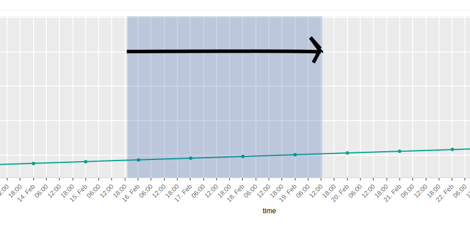
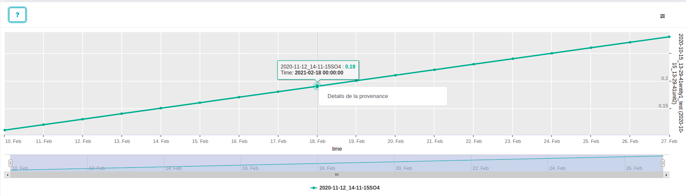
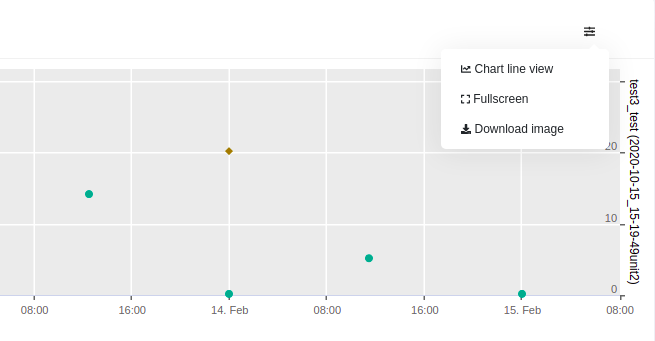

# HELP

**Zoom** 
- Click and drag on the graphic to zoom.

  
  
 
**Data 's contextual menu** 
- Click on data point to see a data 's contextual menu.

  
  

**Contextual menu** 
- a graphical contextual menu allows to : 
     - choose a chart line ( by default) or a scatter plot view.
     - a fullscreen mode.
     - to download an image from the charts. 

