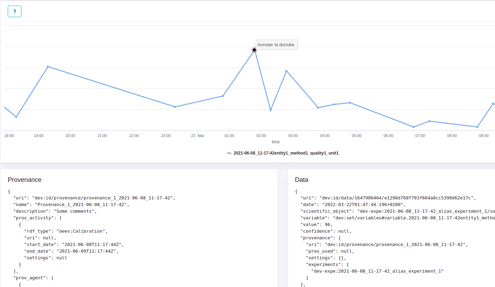
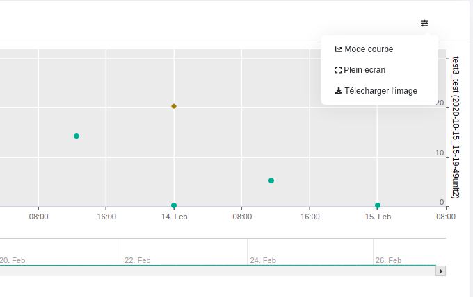

# AIDE

**Menu contextuel de donnée** 
- Faire un clic sur un point ou sur un événement pour voir les informations associées.
- Faire un clic droit sur le point de la donnée pour voir le menu contextuel.

  
  

**Zoom** 
- Cliquer et faire glisser pour zoomer.

  
  
 

**Menu contextuel** 
- Un menu contextuel de la représentation graphique permet de : 
     - choisir le mode courbe (par défaut) ou nuage de points.
     - d'afficher en plein ecran.
     - de télécharger une image. 

