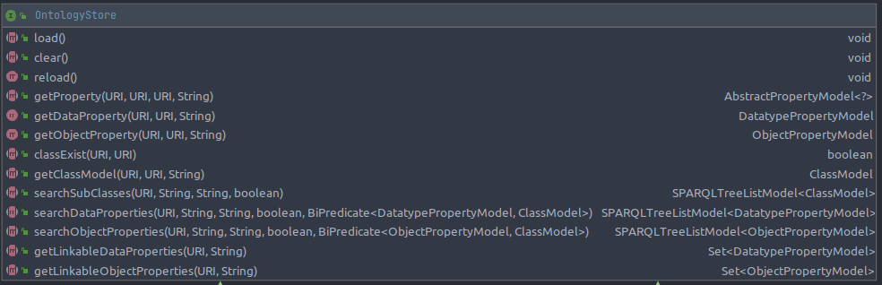

# Ontology RAM storage optimization

- Subject : This document describes which optimizations have been implemented in order to accelerate all Ontology-related services
- Author : Renaud COLIN
- Date : 09/02/2022

# Motivation

- The `OntologyAPI` and the `VueOwlExtensionAPI` provide information about class, properties and restrictions from all ontologies
from the SPARQL repository used by OpenSILEX.
- Initially, these data are retrieved through SPARQL request (by declaring models and using the `SPARLService`).
- Even if this service is correct, it comes with some latency, due to query evaluation. Moreover, since these models (class and properties) are often
described as tree-view, a lot of SPARQL query are generated by the SPARQLService, which can sometimes take 2/3s to complete.


- That is a problem when in Vue client, since a service called by a form, or a view, can take 1s to 3s to respond. This latency can be not acceptable for users,
 especially since the amount of data is low when just displaying a form. 
  

- We can reasonably consider that the amount of data (triple) which describe these models(class and properties) can be very low, in 
regards with data about objects (instance of class).
- Moreover, triples describing vocabulary are more or less static (we don't change the vocabulary thousands of times per hour ).


- In view of all these elements, it seems to be a good functionality to cache or index in RAM all vocabulary in order to 
speed-up these services.
  


# Conception

## Interface

The picture just below describe the main interface which provides functionalities of a OntologyStore.



We can split these functionalities into four parts : 

1. Classes : `getClassModel()`, `searchSubClasses()`, `classExist()`
2. Properties : `getProperty(), getDataProperty()`, `getObjectProperty()`, `searchDataProperties()`, `searchObjectProperties()`
3. Restrictions : `getLinkableDataProperties()`, `getLinkableObjectProperties()`, `getClassModel() `(return all associated restrictions)
4. Store administration : `load()`, `clear()`, `reload()`

More documentation about these methods are into the `OntologyStore` Javadoc

## Usages

- `OntologyAPI`
- `VueOwlExtensionAPI`
- CSV import
- Specific properties handling (`SPARQLRelationFetcher`)  
- Inside some API which use vocabulary : `DataAPI`, `ScientificObjectAPI`, `EventAPI`, `DeviceAPI`

## Configuration

The usage of RAM storage can be configured in the sparql config with the `enableOntologyStore` property. 

```java

interface SPARQLConfig {
    
   // ...
 
   @ConfigDescription(
           value = "Enable optimized storage in RAM of ontologies classes, properties and restrictions"
   )
   boolean enableOntologyStore();
}
```

Here an example of use in your `opensilex.yml` config file

```yaml
ontologies:
    baseURI: http://opensilex.dev/
    baseURIAlias: dev
    sparql:
        config:
            serverURI: http://localhost:7200
            repository: opensilex
    enableOntologyStore: true
```

Note that this optimized storage is **disabled** by default.

# Implementations

## Abstract implementation

`AbstractOntologyStore` : this implementation use the following strategy : 

- At loading run SPARQL queries in order to retrieve : classes, properties and restrictions
- Build an index of class and properties models by theirs URI : **`modelsByUris`**
- Build an additional graph data-structure (**`modelsGraph`**) in order to perform ancestors retrieval efficiently (By using jgrapht : https://jgrapht.org/).

Algorithm on graphs are needed, since classes/properties relationship could have a graph structure instead of a simple tree. In this case, it better
 to delegate the complex traversal to efficient algorithms. 


### Implementations notes

- Sub-classes and sub-properties computing : since class and property has children, then the store performs traversal about descendants.
  in order to build a tree representation (`searchSubClasses()`, `searchDataProperties()`, `searchObjectProperties()`). 
  

- **Inherited restriction** : Into the `getClassModel(type,ancestor)` method, the store compute all classes between type and ancestor, and also return 
  restrictions from these classes. If following the principle that if a class has a subclass, then all restrictions of this subclass apply to the class.


- **Lang handling** : all lang for a class/property are stored, when returning results, the store just set the provided lang for a model, if this lang is stored.

## No implementation

**`NoOntologyStore`** : This implementation just use the `OntologyDao` to performs all operations from `OntologyStore`

# Improvements and TODO

- Append more tests (especially with bad value, bad semantics and incomplete vocabulary)
- In `AbstractOntologyStore`, there are some warning about bad generics' usage, this should be fixed to improve quality
- When creating/updating/deleting class/property/restriction in `OntologyAPI`/`OwlExtensionAPI` we use a naive strategy to update to store.
  We reset and reload it. Instead, we should finally update the given vocabulary model and updates link to this model (with the parent and children).
  Since this part is not easy to implement and test, for now we use the naive strategy. 
- Write some micro-benchmark about read/write performances and RAM usage